# Technical Design

## Overview
本機能は、既存の`announcements`specが対象外としていたヘルプデスク側のお知らせ作成・編集・削除機能を実装し、あわせてお知らせごとに配信対象（全体一律 or 特定の国・地域）を指定できるようにする。**Purpose**: ヘルプデスク担当者が海外販社向けのお知らせを管理し、関係する販社にのみ的確に情報を届けられるようにする。**Users**: 日本側ヘルプデスク担当者（作成・編集・削除）と海外販社担当者（配信対象に応じてフィルタされた表示）。**Impact**: `Announcement`型に判別可能なユニオン型の`targeting`フィールドを追加し、既存の申請者側読み取り関数（`getAnnouncements`・`getRecentAnnouncements`・`getAnnouncementById`）を自社の国でスコープする。`helpdesk-inquiry-management`specで確立したServer Actions + 共有モックストアのパターンを踏襲する。

### Goals
- ヘルプデスク担当者がお知らせを作成・編集・削除できる
- お知らせごとに配信対象（全体一律 or 特定の国・地域）を指定できる
- 配信対象の指定が申請者側の表示に実際に反映される
- 変更が一覧・詳細・ダッシュボードウィジェットをまたいで一貫して反映される（画面遷移しても状態が残る）

### Non-Goals
- 認証・ロールベースアクセス制御
- お知らせの既読・未読管理
- メール・プッシュ通知等の配信機能
- `helpdesk-inquiry-management`（問い合わせ管理・テンプレート管理）機能自体の変更
- `helpdesk-portal-layout`が確立したルートセグメント・共通レイアウト構造自体の変更

## Boundary Commitments

### This Spec Owns
- `/[locale]/helpdesk/announcements`・`/[locale]/helpdesk/announcements/new`・`/[locale]/helpdesk/announcements/[id]/edit`配下の全ページ
- `Announcement`型への`targeting`フィールドの追加（後方互換な拡張、既存シードデータへの移行含む）
- お知らせの作成・編集・削除のServer Actions・モックAPIミューテーション・バリデーションスキーマ
- 申請者側読み取り関数（`getAnnouncements`・`getRecentAnnouncements`・`getAnnouncementById`）への自社国スコープフィルタの適用
- `src/lib/constants/current-company.ts`（`MOCK_CURRENT_COMPANY`の共有定数化）
- `HelpdeskSidebar`への「お知らせ管理」ナビゲーション項目の追加

### Out of Boundary
- `helpdesk-portal-layout`が所有するルートセグメント構造・`HelpdeskAppShell`・`HelpdeskHeader`自体の変更
- `helpdesk-inquiry-management`が所有する問い合わせ管理・テンプレート管理の画面・Server Actions
- 申請者側の`AnnouncementList`・`AnnouncementDetail`・`AnnouncementWidget`のレイアウト・操作性の変更（参照データ範囲の変更を除く）
- 認証・ロールベースアクセス制御の実装

### Allowed Dependencies
- 既存の`Announcement`型・`ANNOUNCEMENT_CATEGORY_CODES`（フィールド追加のみ、既存フィールドは変更しない）
- 既存の`INQUIRY_COUNTRY_CODES`（配信対象の国選択肢として再利用）
- `helpdesk-inquiry-management`が確立したServer Actions・`getGlobalMockStore`パターン（`src/lib/mock-store.ts`）
- 既存のUIプリミティブ（`Card`, `Button`, `Select`, `Input`, `Textarea`, `Label`）
- `HelpdeskSidebar`（項目追加のみ）

### Revalidation Triggers
- `Announcement`型のフィールド追加・変更（`announcements`・`dashboard`specが再確認する必要がある）
- `MOCK_CURRENT_COMPANY`の参照元変更（`inquiries.ts`・`announcements.ts`の両方が影響を受ける）
- `getAnnouncements`/`getRecentAnnouncements`/`getAnnouncementById`のフィルタ挙動変更（既存の申請者側テストの前提が変わる）

## Architecture

### Existing Architecture Analysis
既存の`announcements`specは、`lib/api/announcements.ts`に読み取り専用のモックAPI（`getAnnouncements`・`getRecentAnnouncements`・`getAnnouncementById`）を持ち、申請者側の`AnnouncementList`・`AnnouncementDetail`・`dashboard`spec所有の`AnnouncementWidget`がこれらを呼び出している。変更系操作は存在しない。`helpdesk-inquiry-management`specにより、Server Actions + `getGlobalMockStore`による`globalThis`共有ストア + zodによるサーバー側バリデーションという変更系操作の標準パターンが確立済み（`research.md`参照）。

### Architecture Pattern & Boundary Map
`helpdesk-inquiry-management`と同一のパターンを踏襲する。

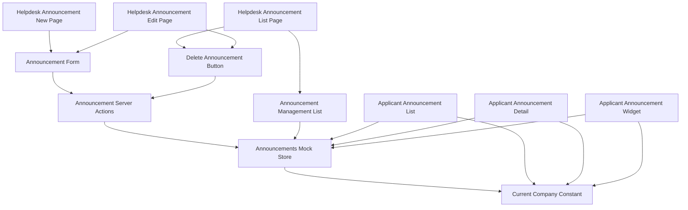

**Architecture Integration**:
- 選択パターン: Server Actions + `globalThis`共有ストア（`helpdesk-inquiry-management`と同一パターン、比較検討は`research.md`参照）
- ドメイン境界: お知らせデータは単一の`AnnouncementsStore`（`lib/api/announcements.ts`が所有する配列）に集約し、ヘルプデスク側（無絞り込み）と申請者側（自社国スコープ）の両方がここから読む
- 既存パターンの維持: フォームは`react-hook-form`+`zod`、ページ構成（一覧→新規作成/編集）は`helpdesk-templates`と同じNext.js App Router構成を踏襲
- 新規コンポーネントの理由: 削除確認・配信対象選択はいずれもクライアント状態境界を持つため独立コンポーネントとして新設する
- Steering準拠: 表示テキストは全て`next-intl`翻訳キー経由、モックAPIは`lib/api/`に抽象化という既存規約を維持

### Technology Stack

| Layer | Choice / Version | Role in Feature | Notes |
|-------|------------------|-----------------|-------|
| Frontend | Next.js App Router（既存, 14.2.35） | ページ構成・Server Actions | `helpdesk-inquiry-management`と同一パターン |
| Forms | react-hook-form + zod（既存） | お知らせ作成・編集フォームのバリデーション | `discriminatedUnion`で配信対象を検証 |
| UI | shadcn/ui（既存） | `Select`（種別・配信対象・国選択）, `Textarea`（本文） | 新規UIプリミティブの追加は不要。削除確認はブラウザ標準`confirm()`を使用（`research.md`参照） |
| Data / Mock | `lib/api/announcements.ts`の可変配列 + `getGlobalMockStore` | お知らせのCRUD状態管理 | フェーズ1限定。開発サーバー再起動でリセットされる |

## File Structure Plan

### Directory Structure
```
src/app/[locale]/helpdesk/announcements/
├── page.tsx                        # 一覧（全件表示・削除導線）
├── new/
│   └── page.tsx                    # 新規作成
└── [id]/
    └── edit/
        └── page.tsx                 # 編集・削除

src/components/features/helpdesk-announcements/
├── AnnouncementManagementList.tsx   # Server: 全件取得・一覧表示
├── AnnouncementForm.tsx             # Client: 新規作成・編集共用フォーム（配信対象選択を含む）
└── DeleteAnnouncementButton.tsx     # Client: confirm()による確認 + 削除アクション呼び出し

src/lib/api/
└── announcements.ts                 # 変更: 自社国スコープフィルタの適用、getAllAnnouncements/getAnnouncementByIdForHelpdesk/create/update/deleteの追加

src/lib/actions/
└── announcements.ts                 # 新規: "use server" Server Actions（create/update/delete）

src/lib/validation/
└── announcement.ts                  # 新規: お知らせフォームのzodスキーマ（配信対象のdiscriminatedUnion含む）

src/lib/constants/
└── current-company.ts               # 新規: MOCK_CURRENT_COMPANYを inquiries.ts から移設

src/types/
└── announcement.ts                  # 変更: `AnnouncementTargeting`判別可能ユニオン型、`Announcement.targeting`フィールドを追加

src/components/layout/
└── HelpdeskSidebar.tsx               # 変更: 「お知らせ管理」ナビゲーション項目を追加

messages/
├── ja.json                          # 変更: helpdeskAnnouncements名前空間、helpdeskNavへのキー追加
└── en.json                          # 同上
```

### Modified Files
- `src/types/announcement.ts` — `AnnouncementTargeting`型・`Announcement.targeting`フィールドを追加（既存フィールドは変更しない）
- `src/lib/api/announcements.ts` — `MOCK_ANNOUNCEMENTS`の全シードデータに`targeting: { scope: "all" }`を付与、`getAnnouncements`/`getRecentAnnouncements`/`getAnnouncementById`を自社国スコープでフィルタ、`getAllAnnouncements`・`getAnnouncementByIdForHelpdesk`・`createAnnouncement`・`updateAnnouncement`・`deleteAnnouncement`を追加
- `src/lib/api/inquiries.ts` — `MOCK_CURRENT_COMPANY`の定義を`lib/constants/current-company.ts`からのimportに置き換える（挙動変更なし）
- `src/components/layout/HelpdeskSidebar.tsx` — `HELPDESK_NAV_ITEMS`に1項目追加
- `messages/ja.json` / `messages/en.json` — 新規名前空間・キーの追加

> 申請者側の`AnnouncementList`・`AnnouncementDetail`・`dashboard`spec所有の`AnnouncementWidget`は変更しない。これらが呼び出す`lib/api/announcements.ts`の関数シグネチャ（引数・戻り値の型）も変更せず、返却データの中身のみが自社国スコープに絞り込まれる。

## System Flows

お知らせの作成・編集・削除はいずれも「Client Component → Server Action → モックストア更新 → revalidatePath」という同一パターンに従う（`helpdesk-inquiry-management`のClaim切り替えフローと同型）ため、代表として削除フローのみ図示する。

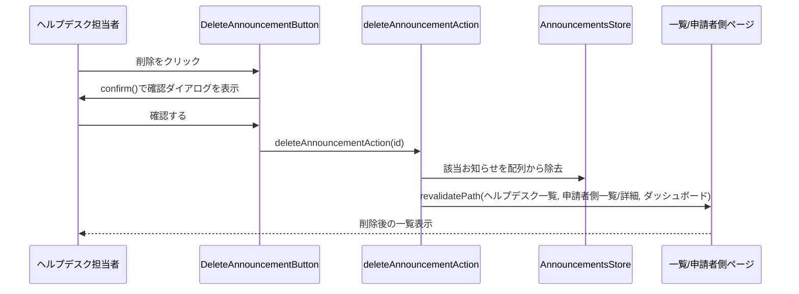

- 作成・編集も同様に、Server Action内でzodスキーマ（`announcementFormSchema`）によるサーバー側バリデーションを行った後、モックストアを更新し、影響範囲の全ルート（ヘルプデスク側・申請者側・ダッシュボード）を`revalidatePath`で再検証する。

## Requirements Traceability

| Requirement | Summary | Components | Interfaces | Flows |
|-------------|---------|------------|------------|-------|
| 1.1〜1.6 | ヘルプデスク側お知らせ一覧 | AnnouncementManagementList | AnnouncementsMockApi (Service) | — |
| 2.1〜2.4 | お知らせの新規作成 | AnnouncementForm, AnnouncementActions | Service | 削除フローと同型 |
| 3.1〜3.4 | お知らせの編集 | AnnouncementForm, AnnouncementActions | Service | 削除フローと同型 |
| 4.1〜4.3 | お知らせの削除 | DeleteAnnouncementButton, AnnouncementActions | Service | 削除フロー |
| 5.1〜5.4 | 配信対象の指定 | AnnouncementForm, AnnouncementsMockApi (バリデーション) | Service | — |
| 6.1〜6.3 | 申請者側での配信対象フィルタ | AnnouncementsMockApi（`getAnnouncements`等の変更） | Service | — |
| 7.1〜7.2 | ナビゲーション統合 | HelpdeskSidebar | — | — |
| 8.1〜8.2 | 多言語対応 | 全新規コンポーネント | — | — |
| 9.1 | レスポンシブ対応 | （既存HelpdeskAppShellに依存、新規コンポーネントなし） | — | — |

## Components and Interfaces

| Component | Domain/Layer | Intent | Req Coverage | Key Dependencies (P0/P1) | Contracts |
|-----------|--------------|--------|---------------|---------------------------|-----------|
| AnnouncementManagementList | UI/Server | 全件のお知らせを取得・一覧表示 | 1.1〜1.6 | AnnouncementsMockApi (P0) | State |
| AnnouncementForm | UI/Client | タイトル・本文・種別・配信対象の入力・送信 | 2.1〜2.4, 3.1〜3.4, 5.1〜5.3 | AnnouncementActions (P0) | State |
| DeleteAnnouncementButton | UI/Client | 削除確認・削除アクション呼び出し | 4.1〜4.3 | AnnouncementActions (P0) | State |
| AnnouncementsMockApi（拡張） | Data/Mock | お知らせの読み取り（自社国スコープ/無絞り込み）・CRUD | 1.1, 5.4, 6.1〜6.2 | Announcement型 (P0), CurrentCompany (P0) | Service |
| AnnouncementActions | Server Actions | モックAPIのCRUDを呼び出し、`revalidatePath`で再検証する | 2.3, 3.3, 4.2 | AnnouncementsMockApi (P0) | Service |

### Data / Mock API

#### AnnouncementsMockApi（拡張）

| Field | Detail |
|-------|--------|
| Intent | 申請者側には自社国スコープのお知らせのみを、ヘルプデスク側には全件を提供し、CRUDを行う |
| Requirements | 1.1, 5.4, 6.1, 6.2 |

**Responsibilities & Constraints**
- `getAnnouncements`・`getRecentAnnouncements`・`getAnnouncementById`は、`targeting.scope === "all"`または`targeting.scope === "countries" && targeting.countries.includes(CurrentCompany.country)`を満たすお知らせのみを返す
- `getAllAnnouncements`・`getAnnouncementByIdForHelpdesk`は絞り込みを行わない
- ミューテーション（作成・編集・削除）は`getGlobalMockStore`で保持する配列を直接更新する

**Dependencies**
- Inbound: `AnnouncementActions`（P0）, `AnnouncementList`/`AnnouncementDetail`/`AnnouncementWidget`（既存、P0）, `AnnouncementManagementList`（P0）
- Outbound: `lib/constants/current-company.ts`（P0）

**Contracts**: Service [x]

##### Service Interface
```typescript
interface AnnouncementsMockApiExtension {
  getAllAnnouncements(): Promise<Announcement[]>;
  getAnnouncementByIdForHelpdesk(id: string): Promise<Announcement | null>;
  createAnnouncement(input: CreateAnnouncementInput): Promise<Announcement>;
  updateAnnouncement(id: string, input: CreateAnnouncementInput): Promise<Announcement>;
  deleteAnnouncement(id: string): Promise<void>;
}
```
- Preconditions: `updateAnnouncement`/`deleteAnnouncement`の`id`は存在するお知らせのIDであること
- Postconditions: `createAnnouncement`で作成されたお知らせは、対象国であれば直後の`getAnnouncements`の結果に反映される
- Invariants: `getAnnouncements()`が返す配列は`getAllAnnouncements()`が返す配列の部分集合である

**Implementation Notes**
- Integration: 既存の`getAnnouncements`/`getRecentAnnouncements`/`getAnnouncementById`のシグネチャ（引数・戻り値の型）は変更しない
- Validation: 存在しないIDに対する`updateAnnouncement`/`deleteAnnouncement`はエラーをthrowする
- Risks: プロセス再起動でリセットされる（フェーズ1のモック制約、`helpdesk-inquiry-management`と同様）

### Server Actions

#### AnnouncementActions

| Field | Detail |
|-------|--------|
| Intent | クライアントからのお知らせ作成・編集・削除操作を受け、サーバー側バリデーション・ミューテーション・関連ルートの再検証を行う |
| Requirements | 2.2〜2.3, 3.2〜3.3, 4.2, 5.3 |

**Responsibilities & Constraints**
- 全ての関数に`"use server"`を付与する
- `createAnnouncementAction`・`updateAnnouncementAction`は`announcementFormSchema`（zod）でタイトル・本文・種別・配信対象を検証し、不正な入力は保存せず例外を送出する（`helpdesk-inquiry-management`のHigh指摘を踏まえ、クライアント側バリデーションに加えて必ずサーバー側でも検証する）
- 各操作の最後に、ヘルプデスク側一覧・申請者側一覧・詳細・ダッシュボードルートを`revalidatePath`で再検証する

**Dependencies**
- Inbound: `AnnouncementForm`, `DeleteAnnouncementButton`（いずれもP0）
- Outbound: `AnnouncementsMockApiExtension`（P0）

**Contracts**: Service [x]

##### Service Interface
```typescript
interface AnnouncementActions {
  createAnnouncementAction(
    input: CreateAnnouncementInput
  ): Promise<Announcement>;
  updateAnnouncementAction(
    id: string,
    input: CreateAnnouncementInput
  ): Promise<Announcement>;
  deleteAnnouncementAction(id: string): Promise<void>;
}
```
- Preconditions: `input`はクライアント側で`react-hook-form`+`zod`によりバリデーション済みであること（サーバー側でも同一スキーマで再検証する）
- Postconditions: 成功時、対象ルート群が再検証され、次回アクセス時に最新状態が反映される
- Invariants: バリデーション失敗時はストアを変更しない

**Implementation Notes**
- Integration: `revalidatePath`の対象は`/[locale]/helpdesk/announcements`（page）, `/[locale]/announcements`（page）, `/[locale]/announcements/[id]`（page）, `/[locale]`（page、ダッシュボードの`AnnouncementWidget`用）
- Validation: サーバー側バリデーションはクライアント側と同一の`announcementFormSchema`を再利用する
- Risks: `revalidatePath`の対象漏れがあると一部画面の表示が古いまま残る（`helpdesk-inquiry-management`のMedium指摘と同種のリスク、実装時に全対象を確実に含める）

### Presentation Components（サマリーのみ）

- **AnnouncementManagementList**: `getAllAnnouncements()`を公開日降順で表示し、各行に編集リンクと`DeleteAnnouncementButton`を配置する。既存`TemplateList`と同じ構造パターンを踏襲する。
- **AnnouncementForm**: タイトル・本文・種別（既存カテゴリ）に加え、配信対象の選択（全体一律 or 特定の国・地域）を持つ`react-hook-form`+`zod`フォーム。国選択は複数選択可能なUIとする。新規作成・編集で共用する。
- **DeleteAnnouncementButton**: クリック時に`confirm()`でユーザーに確認し、確認後に`deleteAnnouncementAction`を呼び出す。

## Data Models

### Domain Model
- `Announcement`（既存、拡張）: `targeting: AnnouncementTargeting`を追加。
- `AnnouncementTargeting`（新規）: `{ scope: "all" } | { scope: "countries"; countries: string[] }`の判別可能なユニオン型。

### Logical Data Model
- `Announcement`は単一エンティティ。`targeting`はAnnouncementに埋め込まれた値オブジェクトであり、別エンティティとしての関連は持たない。

### Data Contracts & Integration

| 型 | 主なフィールド | 備考 |
|---|---|---|
| `Announcement`（拡張） | 既存フィールド + `targeting: AnnouncementTargeting` | 既存フィールドは変更なし |
| `AnnouncementTargeting` | `{ scope: "all" }` または `{ scope: "countries", countries: string[] }` | `countries`はISO 3166-1 alpha-2、`INQUIRY_COUNTRY_CODES`のいずれか |
| `CreateAnnouncementInput` | `title`, `body`, `category`, `targeting` | `Announcement`から`id`・`publishedAt`を除いたサブセット（`publishedAt`はサーバー側で保存時刻を採番） |

## Error Handling

### Error Strategy
`helpdesk-inquiry-management`と同様のパターンを踏襲する。Server Componentは取得失敗時にtry/catchでエラーメッセージを表示し、Server Actionsは不正な入力・存在しないIDに対してエラーをthrowし、呼び出し元のクライアントコンポーネントがエラー状態を表示する。

### Error Categories and Responses
- **データ取得失敗**（一覧）: 既存パターンと同様にエラーメッセージを表示
- **存在しないお知らせIDへの編集・削除操作**: Server Actionがエラーをthrowし、クライアント側でエラー表示にフォールバック
- **入力値不正**（タイトル・本文・種別未入力、配信対象の国が0件）: クライアント側`zod`バリデーションで送信をブロックし、フィールド単位のエラーメッセージを表示（要件2.2, 3.2, 5.3）。サーバー側でも同一スキーマで再検証する

### Monitoring
フェーズ1はモックのため、追加のロギング・監視基盤は導入しない。

## Testing Strategy

- **Unit Tests**:
  - `getAnnouncements`/`getRecentAnnouncements`/`getAnnouncementById`が自社国（`CurrentCompany.country`）を含む、または`scope: "all"`のお知らせのみを返すこと
  - `getAllAnnouncements`が絞り込みなしで全件を返すこと
  - `createAnnouncement`/`updateAnnouncement`/`deleteAnnouncement`が対象のお知らせのみを操作し、他のレコードに影響しないこと
  - `announcementFormSchema`がタイトル・本文・種別の未入力、および`scope: "countries"`で0件選択を拒否すること
  - Server Actionsが不正な入力を拒否し、ストアを変更しないこと
- **Integration Tests**:
  - ヘルプデスク側でお知らせを作成後、申請者側の一覧・ダッシュボードウィジェットに反映されること（対象国が一致する場合）
  - 配信対象外の国向けに作成したお知らせが、申請者側の一覧・ダッシュボードウィジェットに表示されないこと
  - 削除後、ヘルプデスク側一覧・申請者側一覧の両方から除去されること
- **E2E/UI Tests**:
  - 日本語・英語両ロケールで一覧・作成・編集画面が表示されること
  - タブレット幅（768px）で新規画面が横スクロールを起こさないこと

## Security Considerations
配信対象フィルタは表示範囲の制御であり、認証・認可の代替ではない。フェーズ1は認証未実装のため、ヘルプデスク側の作成・編集・削除画面は`helpdesk-portal-layout`の前提通り制限なくアクセス可能である。フェーズ3で認証が導入される際、本specのルート境界を変更せずにアクセス制御を追加できることを設計上の前提とする。

---

## 追加ラウンド（2026-07-07）: タイトル・種別・対応要否による検索、対応要否フィールドの追加

### Overview（追加分）
お知らせ管理一覧にタイトル・種別・対応要否による検索・絞り込みを追加し、`Announcement`型に対応要否（`actionRequired`）フィールドを新設して作成・編集フォームで設定できるようにする。**Purpose**: ヘルプデスク担当者が登録件数の増加に対しても目的のお知らせを素早く見つけられるようにし、あわせて販社担当者への「対応要否」の伝達を可能にする。**Impact**: `Announcement`型へのフィールド追加（後方互換）と、`AnnouncementManagementList`のサーバー/クライアント分割。既存の一覧・作成・編集画面のレイアウト・操作性は維持する。

### Boundary Commitments（追加分）

**This Spec Owns（追加）**
- `Announcement.actionRequired: boolean`フィールドの追加、および作成・編集フォームでの設定
- お知らせ管理一覧の検索・絞り込みUI（`AnnouncementFilterBar`、`AnnouncementManagementListClient`、`lib/helpdesk-announcement-list.ts`）

**Out of Boundary（追加）**
- 対応要否バッジの申請者側での表示ロジック（`announcements`spec側で実装、本specは`actionRequired`フィールドの提供のみを担う）
- ダッシュボードの「お知らせ概要ウィジェット」への対応要否バッジの反映（`dashboard`/`dashboard-card-redesign`spec）

**Revalidation Triggers（追加）**
- `Announcement.actionRequired`の型・意味の変更（`announcements`specが再確認する必要がある）

### Architecture（追加分）

既存の「サーバーで全件取得 → クライアントコンポーネントでフィルタ」パターン（`helpdesk-inquiry-management`実績、`research.md`参照）を`AnnouncementManagementList`にも適用する。現状のサーバーコンポーネント1個構成を、データ取得のみを担うサーバーコンポーネントと、フィルタ状態を保持するクライアントコンポーネントに分割する。

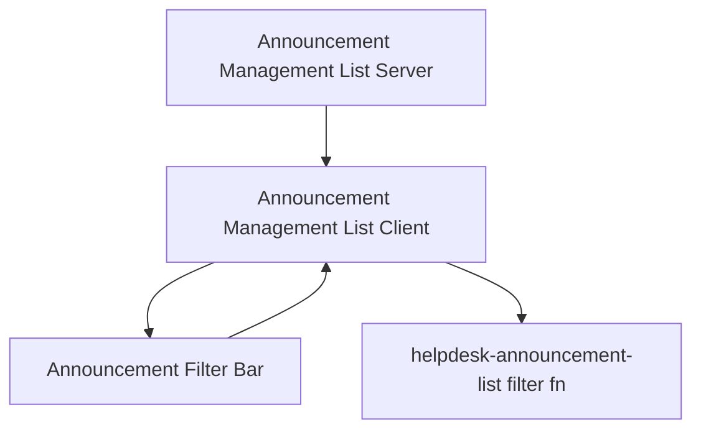

**Architecture Integration（追加分）**:
- 選択パターン: `helpdesk-inquiry-management`の`HelpdeskInquiryListClient`/`HelpdeskInquiryFilterBar`と同一パターン（比較検討は`research.md`参照）
- 新規コンポーネントの理由: フィルタ状態はクライアント側の一時状態であり、既存のサーバーコンポーネント（`AnnouncementManagementList`）とは責務が異なるため分離する
- Steering準拠: 表示テキストは全て`next-intl`翻訳キー経由という既存規約を維持

### Technology Stack（追加分・差分のみ）

| Layer | Choice / Version | Role in Feature | Notes |
|-------|------------------|-----------------|-------|
| UI | 既存`Select`（新規プリミティブなし） | `actionRequired`の2択入力・絞り込み | Checkbox/Switchは未導入のため`Select`で表現（`research.md`参照） |

### File Structure Plan（追加分）

```
src/components/features/helpdesk-announcements/
├── AnnouncementManagementList.tsx        # 変更: データ取得のみを担うサーバーコンポーネントに整理
├── AnnouncementManagementListClient.tsx  # 新規: フィルタ状態を保持し一覧を描画するクライアントコンポーネント
├── AnnouncementFilterBar.tsx             # 新規: キーワード・種別・対応要否の絞り込み入力
└── AnnouncementForm.tsx                  # 変更: 対応要否（actionRequired）のSelectフィールドを追加

src/lib/
└── helpdesk-announcement-list.ts         # 新規: HelpdeskAnnouncementFilters型・filterAnnouncementsForHelpdesk関数

src/types/
└── announcement.ts                       # 変更: Announcement.actionRequired: booleanを追加

src/lib/validation/
└── announcement.ts                       # 変更: announcementFormSchemaにactionRequired: z.boolean()を追加

src/lib/api/
└── announcements.ts                      # 変更: シードデータ全件にactionRequiredを付与

messages/
├── ja.json                               # 変更: helpdeskAnnouncements.list.filter, .actionRequiredBadge, .form.actionRequiredフィールドを追加
└── en.json                               # 同上
```

### Modified Files（追加分）
- `src/types/announcement.ts` — `Announcement`に`actionRequired: boolean`を追加（既存フィールドは変更しない）
- `src/lib/validation/announcement.ts` — `announcementFormSchema`に`actionRequired: z.boolean()`を追加
- `src/lib/api/announcements.ts` — `MOCK_ANNOUNCEMENTS`の全シードデータに`actionRequired`（既存データの内容に応じて`true`/`false`）を付与
- `src/components/features/helpdesk-announcements/AnnouncementForm.tsx` — 種別フィールドの直後に対応要否の`Select`（2択）を追加、初期値は新規作成時`false`
- `src/components/features/helpdesk-announcements/AnnouncementManagementList.tsx` — `getAllAnnouncements()`取得とエラー/空状態表示のみを担い、フィルタ済み一覧の描画を`AnnouncementManagementListClient`に委譲

### Requirements Traceability（追加分）

| Requirement | Summary | Components | Interfaces | Flows |
|-------------|---------|------------|------------|-------|
| 10.1〜10.5 | 対応要否フィールドの追加と設定 | AnnouncementForm, Announcement型, AnnouncementManagementListClient | Service | — |
| 11.1〜11.8 | タイトル・種別・対応要否による検索・絞り込み | AnnouncementFilterBar, AnnouncementManagementListClient, filterAnnouncementsForHelpdesk | State | — |

### Components and Interfaces（追加分）

| Component | Domain/Layer | Intent | Req Coverage | Key Dependencies (P0/P1) | Contracts |
|-----------|--------------|--------|---------------|---------------------------|-----------|
| AnnouncementManagementListClient | UI/Client | フィルタ状態を保持し、絞り込み済み一覧を描画 | 11.1〜11.8, 10.4 | filterAnnouncementsForHelpdesk (P0), AnnouncementFilterBar (P0) | State |
| AnnouncementFilterBar | UI/Client | キーワード・種別・対応要否の入力を受け付け、変更を通知 | 11.1〜11.4, 11.6 | — | State |
| filterAnnouncementsForHelpdesk | Lib/Pure Function | キーワード・種別・対応要否のAND条件でお知らせを絞り込む | 11.2〜11.4, 11.8 | — | Service |

#### filterAnnouncementsForHelpdesk

| Field | Detail |
|-------|--------|
| Intent | お知らせ配列をキーワード（タイトル部分一致）・種別・対応要否のAND条件で絞り込む純粋関数 |
| Requirements | 11.2, 11.3, 11.4, 11.8 |

**Responsibilities & Constraints**
- タイトルの部分一致判定は大文字・小文字を区別しない
- 各フィルタ条件が未指定（空文字列 or `undefined`）のときはその条件による絞り込みを行わない
- 入力配列の順序を変更しない（呼び出し側が公開日降順に整列済みであることを前提とする）

**Contracts**: State [x]

##### Service Interface
```typescript
interface HelpdeskAnnouncementFilters {
  keyword: string;
  category: string;
  actionRequired: "" | "true" | "false";
}

function filterAnnouncementsForHelpdesk(
  announcements: Announcement[],
  filters: HelpdeskAnnouncementFilters
): Announcement[];
```
- Preconditions: `announcements`は`getAllAnnouncements()`の戻り値（公開日降順）
- Postconditions: 戻り値は入力配列の部分集合であり、順序を維持する
- Invariants: `filters`が全て空文字列のとき、戻り値は入力配列と等しい

**Implementation Notes**
- Integration: `AnnouncementManagementListClient`が`useMemo`で本関数を呼び出す（`helpdesk-inquiry-management`の`filterInquiriesForHelpdesk`と同型）
- Validation: 型レベルで不正な`actionRequired`値を排除する（`"" | "true" | "false"`のUnion）
- Risks: なし（純粋関数、副作用なし）

### Data Models（追加分）

- `Announcement`（既存、再拡張）: `actionRequired: boolean`を追加。新規作成時の初期値は`false`（要件10.3）
- `CreateAnnouncementInput`は`Announcement`から`id`・`publishedAt`を除いたサブセットのため、`actionRequired`は自動的に含まれる（型定義の変更不要）

### Testing Strategy（追加分）

- **Unit Tests**:
  - `filterAnnouncementsForHelpdesk`がキーワード（部分一致・大小文字無視）・種別・対応要否のAND条件で絞り込むこと、全条件が空のとき全件を返すこと
  - `announcementFormSchema`が`actionRequired`を`boolean`として要求すること
- **Integration Tests**:
  - `AnnouncementManagementListClient`でキーワード・種別・対応要否を入力すると一覧が絞り込まれ、「クリア」で全件表示に戻ること
  - 絞り込み結果が0件のとき「該当するお知らせがありません」が表示されること
  - `AnnouncementForm`で対応要否を「対応が必要」に設定して保存すると、一覧にバッジが表示されること
- **E2E/UI Tests**:
  - 日本語・英語両方でフィルタバーのラベル・バッジ文言が翻訳されること
  - タブレット幅（768px）でフィルタバーが横スクロールを発生させないこと

---

## 追加ラウンド（2026-07-08）: 確認済み・実施済み人数の可視化と未対応者へのリマインド

### Overview（追加分）
アカウント機能未実装のフェーズ1では実測できないため、モックの「担当者」マスタ（既存`DOCUMENT_COMPANY_OPTIONS`の各社に2名ずつ、計16名）を新設し、お知らせごとに担当者単位の確認済み・実施済み状態をモックデータとして保持する。お知らせ管理一覧に確認済み／実施済み人数を表示し、クリックで未対応者一覧をダイアログ表示、個別・一括でリマインド送信（モック、実配信なし）できるようにする。**Purpose**: ヘルプデスク担当者が周知の浸透状況を人単位で把握し、対応漏れのある担当者にリマインドできるようにする。**Impact**: 新規の担当者マスタ・確認済み/実施済み/リマインド送信状態のモックストア、およびモーダル表示のための`Dialog`UIプリミティブ（本プロジェクト初導入）を追加する。既存のお知らせ作成・編集・削除・検索機能への変更はない。

### Goals（追加分）
- お知らせごとに確認済み人数・実施済み人数（対応要否ありのお知らせのみ）を一覧上で可視化する
- 未確認・未対応の担当者を一覧で確認できる
- 未対応の担当者へリマインドを送信できる（モック、実際の通知配信は行わない）

### Non-Goals（追加分）
- 実際のログイン・アカウント機能に基づくユーザー個人の識別
- メール・プッシュ通知等、実際の通知配信
- 海外販社側での確認済み・実施済み人数や未対応者一覧の表示（`announcements`spec側では、リマインド受信表示のみを対象とする。詳細は`announcements/design.md`参照）

### Boundary Commitments（追加分）

**This Spec Owns（追加）**
- 担当者マスタ（`AnnouncementRecipient`）のモックデータおよび型定義
- 担当者ごとの確認済み・実施済み・リマインド送信状態（`AnnouncementRecipientStatus`）のモックストアと読み取り・更新API
- お知らせ管理一覧の確認済み・実施済み人数表示、未対応者一覧ダイアログ、個別・一括リマインド送信のUI・Server Actions
- `Dialog`UIプリミティブ（`src/components/ui/dialog.tsx`、Radix UIベース、本プロジェクト初導入）

**Out of Boundary（追加）**
- 海外販社側でのリマインド受信表示ロジック（`announcements`specが実装。本specは参照可能な読み取り関数を提供するのみ）
- 実際のメール・プッシュ通知配信、送信履歴の恒久保存（プロセス再起動でリセットされるモックの範囲に留める）

**Allowed Dependencies（追加）**
- 既存の`DOCUMENT_COMPANY_OPTIONS`/`DOCUMENT_COMPANY_CODES`（`lib/constants/document-company-options.ts`、担当者の所属会社・国として再利用）
- 既存の`getGlobalMockStore`パターン（`lib/mock-store.ts`）
- 既存の`Announcement.targeting`/`Announcement.actionRequired`（集計対象の判定に使用、読み取りのみ）

**Revalidation Triggers（追加）**
- `AnnouncementRecipient`/`AnnouncementRecipientStatus`の型・意味の変更（`announcements`specが再確認する必要がある）
- 担当者マスタの会社紐付けロジック変更（`DOCUMENT_COMPANY_OPTIONS`に依存するため、その変更時も再確認する）

### Architecture（追加分）

お知らせ管理一覧（`AnnouncementManagementList`Server）が、お知らせ本体に加えて担当者別ステータス（`AnnouncementRecipientStatusView[]`）をお知らせごとに取得し、`AnnouncementManagementListClient`経由で各行に渡す。人数表示のクリックで開く`AnnouncementRecipientDialog`は、渡された配列から未対応者を算出して表示し、リマインド送信はServer Action経由でモックストアを更新後`revalidatePath`する（`helpdesk-inquiry-management`と同型のCRUDパターン）。

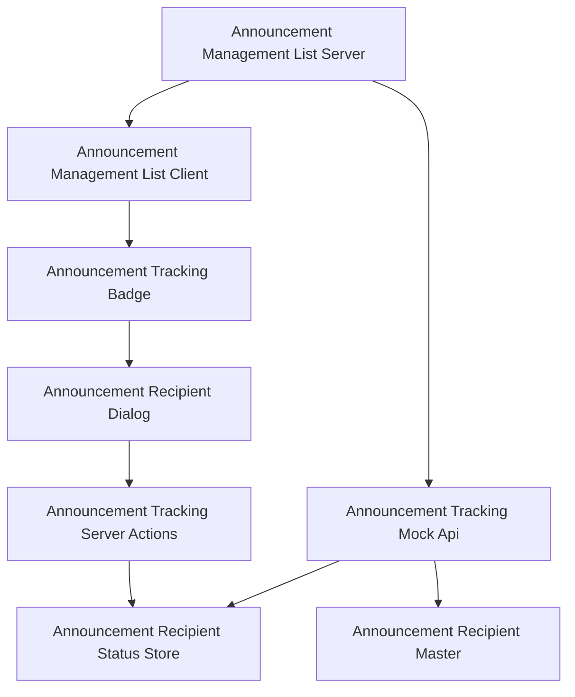

**Architecture Integration（追加分）**:
- 選択パターン: 既存と同じ「サーバーで取得 → クライアントで表示・操作」+ Server Actions更新パターン
- ドメイン境界: 担当者マスタ・ステータスは新設の`TrackingApi`（`lib/api/announcement-tracking.ts`）に集約し、`Announcement`本体のデータ（`lib/api/announcements.ts`）とは別ストアとして分離する（`announcementId`で疎結合に参照）
- 新規コンポーネントの理由: 人数表示・未対応者ダイアログはお知らせ本体の一覧表示とは異なる操作境界（クリックでの状態取得・リマインド送信）を持つため独立コンポーネントとする
- Steering準拠: 表示テキストは全て`next-intl`翻訳キー経由、モックAPIは`lib/api/`に抽象化という既存規約を維持

### Technology Stack（追加分・差分のみ）

| Layer | Choice / Version | Role in Feature | Notes |
|-------|------------------|-----------------|-------|
| UI | `@radix-ui/react-dialog`（新規導入） + shadcn/uiパターンの`Dialog`ラッパー | 未対応者一覧のモーダル表示 | 本プロジェクトに`Dialog`系プリミティブが存在しないため新規追加。既存の`@radix-ui/react-accordion`と同じ導入パターン（Radix Primitive + `class-variance-authority`不要のシンプルラップ）に揃える |
| Data / Mock | `lib/api/announcement-tracking.ts`の可変配列 + `getGlobalMockStore` | 担当者ごとの確認済み・実施済み・リマインド送信状態の管理 | フェーズ1限定。開発サーバー再起動でリセットされる |

### File Structure Plan（追加分）

```
src/components/ui/
└── dialog.tsx                              # 新規: Radix UI Dialogのshadcn/uiスタイルラッパー

src/lib/constants/
└── announcement-recipients.ts              # 新規: 担当者マスタ（DOCUMENT_COMPANY_OPTIONS各社2名、計16名）

src/types/
└── announcement-recipient.ts               # 新規: AnnouncementRecipient, AnnouncementRecipientStatus, AnnouncementRecipientStatusView型

src/lib/api/
└── announcement-tracking.ts                # 新規: 集計・未対応者取得・リマインド送信・自社宛リマインド有無判定のモックAPI

src/lib/actions/
└── announcement-tracking.ts                # 新規: "use server" リマインド送信Server Actions

src/components/features/helpdesk-announcements/
├── AnnouncementTrackingBadge.tsx           # 新規Client: 確認済み/実施済み人数を表示し、クリックでダイアログを開く
├── AnnouncementRecipientDialog.tsx         # 新規Client: 未対応者一覧・個別/一括リマインド送信・送信完了メッセージ表示
└── AnnouncementManagementList.tsx          # 変更: お知らせ本体に加え担当者別ステータスを取得し、Clientへ渡す

messages/
├── ja.json                                 # 変更: helpdeskAnnouncements.tracking名前空間を追加
└── en.json                                 # 同上
```

### Modified Files（追加分）
- `src/components/features/helpdesk-announcements/AnnouncementManagementList.tsx` — `getAllAnnouncements()`に加え`getAnnouncementRecipientStatuses(announcement.id)`を各お知らせについて取得し、`AnnouncementManagementListClient`へ`recipientStatuses`を追加のpropsとして渡す

### System Flows（追加分）

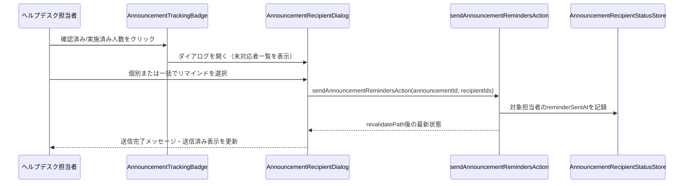

- リマインド送信は実際の通知配信を行わず、`reminderSentAt`の記録と`revalidatePath`によるヘルプデスク側一覧・申請者側一覧/詳細の再検証のみを行う（申請者側のリマインド受信表示に反映するため）。

### Requirements Traceability（追加分）

| Requirement | Summary | Components | Interfaces | Flows |
|-------------|---------|------------|------------|-------|
| 12.1〜12.4 | 担当者マスタのモックデータ | AnnouncementRecipient定数, AnnouncementTrackingMockApi | Service | — |
| 13.1〜13.5 | 確認済み・実施済み人数の表示 | AnnouncementTrackingBadge, AnnouncementManagementList | Service | — |
| 14.1〜14.6 | 未対応者一覧とリマインド | AnnouncementRecipientDialog, AnnouncementTrackingActions | Service | リマインド送信フロー |

### Components and Interfaces（追加分）

| Component | Domain/Layer | Intent | Req Coverage | Key Dependencies (P0/P1) | Contracts |
|-----------|--------------|--------|---------------|---------------------------|-----------|
| AnnouncementTrackingMockApi | Data/Mock | 担当者マスタ・確認済み/実施済み/リマインド状態の読み取りと算出 | 12.1〜12.4, 13.1〜13.4 | AnnouncementRecipient定数 (P0), Announcement.targeting/actionRequired (P0) | Service |
| AnnouncementTrackingActions | Server Actions | リマインド送信を受け、モックストアを更新し関連ルートを再検証する | 14.4〜14.5 | AnnouncementTrackingMockApi (P0) | Service |
| AnnouncementTrackingBadge | UI/Client | 確認済み/実施済み人数を表示し、クリックでダイアログを開く | 13.1〜13.5 | AnnouncementRecipientDialog (P0) | State |
| AnnouncementRecipientDialog | UI/Client | 未対応者一覧の表示、個別/一括リマインド送信、送信完了表示 | 14.1〜14.6 | AnnouncementTrackingActions (P0) | State |

#### AnnouncementTrackingMockApi

| Field | Detail |
|-------|--------|
| Intent | お知らせごとの対象担当者（配信対象でスコープ）を算出し、確認済み・実施済み件数、未対応者一覧、自社宛リマインド有無を提供する |
| Requirements | 12.1, 12.2, 12.3, 12.4, 13.1, 13.2, 13.3, 13.4 |

**Responsibilities & Constraints**
- `targeting.scope === "all"`のときは全16担当者、`targeting.scope === "countries"`のときは対象国に属する担当者のみを集計対象とする
- 実施済み件数は`actionRequired === true`のお知らせについてのみ意味を持つ値として提供する（`actionRequired === false`のときは`null`を返し、呼び出し側が非表示にする）
- モックデータは`getGlobalMockStore`で保持し、プロセス内で状態を維持する

**Dependencies**
- Inbound: `AnnouncementManagementList`（P0）, `AnnouncementTrackingActions`（P0）, `announcements`spec側の一覧・詳細コンポーネント（P1、自社宛リマインド有無の参照のみ）
- Outbound: `lib/constants/announcement-recipients.ts`（P0）, `lib/constants/document-company-options.ts`（P0）

**Contracts**: Service [x]

##### Service Interface
```typescript
interface AnnouncementRecipientStatusView {
  recipientId: string;
  companyCode: string;
  companyName: string;
  country: string;
  contactName: string;
  confirmedAt: string | null;
  completedAt: string | null;
  reminderSentAt: string | null;
}

interface AnnouncementTrackingSummary {
  totalRecipients: number;
  confirmedCount: number;
  completedCount: number | null;
}

interface AnnouncementTrackingMockApi {
  getAnnouncementRecipientStatuses(
    announcementId: string
  ): Promise<AnnouncementRecipientStatusView[]>;
  getAnnouncementTrackingSummary(
    announcementId: string
  ): Promise<AnnouncementTrackingSummary>;
  isReminderPendingForCompany(
    announcementId: string,
    companyCode: string
  ): Promise<boolean>;
}
```
- Preconditions: `announcementId`は存在するお知らせのIDであること
- Postconditions: `getAnnouncementRecipientStatuses`が返す配列の長さは、当該お知らせの配信対象に含まれる担当者数と一致する
- Invariants: `completedCount`は`actionRequired === false`のとき常に`null`。`isReminderPendingForCompany`は、対象担当者のいずれかが`reminderSentAt !== null && completedAt === null`のときのみ`true`を返す

**Implementation Notes**
- Integration: `announcements`spec（`AnnouncementList`/`AnnouncementDetail`）は`isReminderPendingForCompany(announcementId, MOCK_CURRENT_COMPANY.companyCode)`を読み取り専用で呼び出す
- Validation: 存在しない`announcementId`に対しては空集計（`totalRecipients: 0`等）を返す
- Risks: プロセス再起動でリセットされる（フェーズ1のモック制約）

#### AnnouncementTrackingActions

| Field | Detail |
|-------|--------|
| Intent | クライアントからのリマインド送信操作を受け、モックストアを更新し関連ルートを再検証する |
| Requirements | 14.4, 14.5 |

**Responsibilities & Constraints**
- `"use server"`を付与する
- 実際の通知配信は行わず、対象担当者の`reminderSentAt`に現在時刻を記録するのみ
- 処理後、ヘルプデスク側お知らせ一覧・申請者側一覧・詳細ルートを`revalidatePath`で再検証する（申請者側のリマインド受信表示への反映のため）

**Dependencies**
- Inbound: `AnnouncementRecipientDialog`（P0）
- Outbound: `AnnouncementTrackingMockApi`（P0）

**Contracts**: Service [x]

##### Service Interface
```typescript
interface AnnouncementTrackingActions {
  sendAnnouncementRemindersAction(
    announcementId: string,
    recipientIds: string[]
  ): Promise<void>;
}
```
- Preconditions: `recipientIds`は当該お知らせの対象担当者に含まれるIDであること
- Postconditions: 対象担当者全員の`reminderSentAt`が更新される
- Invariants: 既に`completedAt`が設定されている担当者へは送信対象から除外する（呼び出し元のダイアログが未対応者のみを渡す前提）

**Implementation Notes**
- Integration: 個別送信・一括送信のいずれも同一アクションを`recipientIds`の要素数のみを変えて呼び出す
- Validation: `recipientIds`が空配列のときは何もせず正常終了する
- Risks: なし（`revalidatePath`漏れ以外の副作用はない。対象ルートは既存の`AnnouncementActions`と同一集合を再利用する）

#### Presentation Components（サマリーのみ）

- **AnnouncementTrackingBadge**: お知らせ本体・`AnnouncementRecipientStatusView[]`を受け取り、「確認済み X/Y人」（`actionRequired`が真の場合は「実施済み X/Y人」も併記）を表示する。クリックで対象状態（確認済み or 実施済み）を指定して`AnnouncementRecipientDialog`を開く。
- **AnnouncementRecipientDialog**: 新設の`Dialog`プリミティブを用い、未対応の担当者（氏名・所属会社・国・送信済み状態）を一覧表示する。各行に個別リマインドボタン、一覧上部に一括リマインドボタンを配置し、送信後は`Alert`（`variant="success"`）で完了メッセージを表示する。

### Data Models（追加分）

- `AnnouncementRecipient`（新規）: `{ id, companyCode, companyName, country, contactName }`。`DOCUMENT_COMPANY_OPTIONS`の各社について2名、計16件をモックデータとして保持する
- `AnnouncementRecipientStatus`（新規）: `{ announcementId, recipientId, confirmedAt: string | null, completedAt: string | null, reminderSentAt: string | null }`。お知らせ×担当者の組ごとに保持する
- 初期シードデータには、`MOCK_CURRENT_COMPANY`（VN）に属する担当者について、`actionRequired: true`の既存お知らせの1件に対し`reminderSentAt`が設定済み・`completedAt`が`null`の状態を含める（`announcements`spec側のリマインド受信表示をアプリ起動直後から確認できるようにするため）

### Testing Strategy（追加分）

- **Unit Tests**:
  - `getAnnouncementTrackingSummary`が`targeting.scope`に応じて対象担当者数を正しく算出すること、`actionRequired === false`のとき`completedCount`が`null`になること
  - `isReminderPendingForCompany`が、対象担当者に`reminderSentAt`があり`completedAt`が`null`のときのみ`true`を返すこと
  - `sendAnnouncementRemindersAction`が対象担当者のみの`reminderSentAt`を更新し、他の担当者・他のお知らせに影響しないこと
- **Integration Tests**:
  - お知らせ管理一覧で確認済み人数をクリックすると、未確認の担当者のみがダイアログに表示されること
  - 一括リマインド送信後、ダイアログ内の対象者が「送信済み」表示に切り替わること
- **E2E/UI Tests**:
  - 日本語・英語両方で人数表示・ダイアログ内文言が翻訳されること
  - タブレット幅（768px）でダイアログが横スクロールを発生させずに表示されること

---

## 追加ラウンド（2026-07-08）: 公開期間・対応期限の設定

### Overview（追加分）
`Announcement`に公開期間（`publishStartDate`/`publishEndDate`）と対応期限（`dueDate`）を追加する。両フィールドともISO日付文字列（`YYYY-MM-DD`）の任意項目とし、既存の`AnnouncementForm`（作成・編集共用）にネイティブの`<input type="date">`を用いた入力欄を追加する。**Purpose**: 期限切れの周知を表示し続けない・対応期限を明確化するため。**Impact**: `Announcement`型・`announcementFormSchema`・`AnnouncementsMockApi`（`isVisibleToCurrentCompany`相当の判定）・`AnnouncementForm`・`AnnouncementManagementListClient`を変更する。新規コンポーネント・新規依存パッケージの追加はない。既存の`updateAnnouncement`が`actionRequired`を更新していない既存バグも本ラウンドで併せて修正する（対応期限の更新と同じ代入ブロックを触るため）。

### Goals（追加分）
- 公開期間が設定されたお知らせを、期間外は申請者側に表示しない（未設定時は常時公開）
- 対応要否が真のお知らせに対応期限の入力を必須化する
- 対応期限を申請者側の一覧・詳細画面にも表示する

### Non-Goals（追加分）
- 対応期限超過時の自動状態変更・自動エスカレーション通知
- 公開期間・対応期限の変更履歴の保持

### Boundary Commitments（追加分）

**This Spec Owns（追加）**
- `Announcement.publishStartDate`/`publishEndDate`/`dueDate`の型定義・バリデーション・フォーム入力・ヘルプデスク側一覧表示
- 公開期間による申請者側読み取り関数（`getAnnouncements`/`getRecentAnnouncements`/`getAnnouncementById`）の可視性判定ロジック（要件6の配信対象フィルタと同じ関数群への追加）

**Out of Boundary（追加）**
- 対応期限の申請者側UIでの表示自体（`announcements`spec側が実装。本specは`Announcement.dueDate`を提供するのみ）

**Allowed Dependencies（追加）**: 変更なし（既存の`AnnouncementsMockApiExtension`・`announcementFormSchema`の拡張のみ）

**Revalidation Triggers（追加）**
- `Announcement.dueDate`/`publishStartDate`/`publishEndDate`の型・意味の変更（`announcements`specが再確認する必要がある）

### Architecture（追加分）
新規コンポーネント・新規フローは発生しない。既存の`AnnouncementsMockApiExtension`内の可視性判定関数（`isVisibleToCurrentCompany`）に公開期間チェックを合成し、既存の`AnnouncementForm`・`AnnouncementManagementListClient`にフィールドを追加する形で対応する。

**Architecture Integration（追加分）**:
- 既存パターン踏襲: 可視性判定は既存の`isVisibleToCurrentCompany`（`lib/api/announcements.ts`）に`isWithinPublishPeriod`判定を`&&`で合成する形で拡張し、`getAnnouncements`/`getRecentAnnouncements`/`getAnnouncementById`のシグネチャは変更しない
- 新規コンポーネントを作らない理由: 入力欄・表示項目の追加のみであり、既存コンポーネントの責務範囲に収まるため

### Technology Stack（追加分・差分のみ）
追加・変更なし（既存の`react-hook-form`+`zod`、ネイティブHTML `<input type="date">`のみを使用し、日付ピッカー等の新規ライブラリは導入しない）。

### File Structure Plan（追加分）
新規ファイルなし。以下を変更する。

### Modified Files（追加分）
- `src/types/announcement.ts` — `Announcement`に`publishStartDate: string | null`, `publishEndDate: string | null`, `dueDate: string | null`を追加
- `src/lib/validation/announcement.ts` — 上記3フィールドのスキーマ追加、`superRefine`で「終了日は開始日以降」「`actionRequired`が真なら`dueDate`必須」を検証
- `src/lib/api/announcements.ts` — `isVisibleToCurrentCompany`に公開期間チェックを合成、`createAnnouncement`/`updateAnnouncement`で新フィールドを保存・更新（`updateAnnouncement`の`actionRequired`更新漏れも修正）
- `src/components/features/helpdesk-announcements/AnnouncementForm.tsx` — 公開期間（開始日・終了日）・対応期限の入力欄を追加。対応期限欄は`actionRequired`が偽のとき無効化し、偽に変更された時点で値をクリアする
- `src/components/features/helpdesk-announcements/AnnouncementManagementListClient.tsx` — 各行に公開期間（設定時のみ）・対応期限（`actionRequired`が真の場合のみ）を表示
- `messages/ja.json` / `messages/en.json` — 上記フィールドのラベル・バリデーションメッセージの翻訳キー追加

### Requirements Traceability（追加分）

| Requirement | Summary | Components | Interfaces | Flows |
|-------------|---------|------------|------------|-------|
| 15.1〜15.5 | 公開期間の設定 | AnnouncementForm, Announcement型 | State | — |
| 16.1〜16.4 | 公開期間による表示制御 | AnnouncementsMockApi（拡張）, AnnouncementManagementListClient | Service | — |
| 17.1〜17.6 | 対応期限の設定 | AnnouncementForm, announcementFormSchema, AnnouncementManagementListClient | State | — |

### Components and Interfaces（追加分）

#### AnnouncementsMockApiExtension（差分）

**Responsibilities & Constraints（追加）**
- `isVisibleToCurrentCompany`相当の判定に加え、`isWithinPublishPeriod(announcement, referenceDate)`を導入し、`publishStartDate`/`publishEndDate`がいずれも未設定なら常に`true`、設定されている場合は`referenceDate`（呼び出し時点の現在日時）がその範囲内かどうかで判定する
- `getAllAnnouncements`/`getAnnouncementByIdForHelpdesk`（ヘルプデスク側）は公開期間による絞り込みを行わない（要件16.3）

```typescript
function isWithinPublishPeriod(announcement: Announcement, referenceDate: Date): boolean {
  const start = announcement.publishStartDate ? new Date(announcement.publishStartDate) : null;
  const end = announcement.publishEndDate ? new Date(announcement.publishEndDate) : null;
  if (start && referenceDate < start) return false;
  if (end && referenceDate > end) return false;
  return true;
}
```
- Preconditions: `referenceDate`は呼び出し時点の`new Date()`
- Postconditions: `getAnnouncements`/`getRecentAnnouncements`/`getAnnouncementById`は`isVisibleToCurrentCompany(a) && isWithinPublishPeriod(a, new Date())`を満たすお知らせのみ返す
- Invariants: 公開期間が両方`null`のお知らせは常に`isWithinPublishPeriod`が`true`

#### AnnouncementForm（差分）

**Responsibilities & Constraints（追加）**
- 公開期間の開始日・終了日入力欄（`<input type="date">`、任意入力）を追加する
- 対応期限入力欄（`<input type="date">`）を追加し、`actionRequired`フィールドの値を`watch`して、真のときのみ活性化・必須表示（`requiredIndicator`）にする
- `actionRequired`が偽に変更されたとき、`setValue("dueDate", "")`で対応期限をクリアする（要件17.5）

#### AnnouncementManagementListClient（差分）

**Responsibilities & Constraints（追加）**
- 各行のメタ情報表示に、公開期間が設定されている場合は`「公開期間: {開始日} 〜 {終了日}」`（片方のみ設定時は該当側のみ）を、未設定の場合は表示を省略する
- `actionRequired`が真の行にのみ、対応期限（`dueDate`）をラベル付きで表示する

### Data Models（追加分）

- `Announcement`（既存、拡張）: `publishStartDate: string | null`, `publishEndDate: string | null`, `dueDate: string | null`を追加（いずれもISO日付文字列 `YYYY-MM-DD`、初期値は`null`）
- `CreateAnnouncementInput`は`Announcement`から`id`・`publishedAt`を除いたサブセットのため自動的に3フィールドを含む

### Testing Strategy（追加分）

- **Unit Tests**:
  - `announcementFormSchema`が、終了日が開始日より前のとき`publishEndDate`にエラーを付与すること
  - `announcementFormSchema`が、`actionRequired: true`かつ`dueDate`未入力のとき`dueDate`にエラーを付与すること
  - `announcementFormSchema`が、`actionRequired: false`のときは`dueDate`未入力を許容すること
  - `isWithinPublishPeriod`相当のロジックが、開始前・終了後・期間内・未設定の4パターンを正しく判定すること
  - `getAnnouncements`/`getRecentAnnouncements`/`getAnnouncementById`が公開期間外のお知らせを除外すること
  - `getAllAnnouncements`/`getAnnouncementByIdForHelpdesk`が公開期間に関わらず全件を返すこと
  - `updateAnnouncement`が`actionRequired`・`dueDate`・公開期間を含め、渡された全フィールドを更新すること
- **Integration Tests**:
  - 対応要否を「対応が必要」にした状態で対応期限未入力のまま保存しようとすると、保存がブロックされること
  - 対応要否を「対応が必要」から「対応不要」に変更すると、対応期限欄がクリア・無効化されること
- **E2E/UI Tests**:
  - 公開期間・対応期限の入力欄が日本語・英語で表示されること

---

## 追加ラウンド（2026-07-10）: 下書き機能の追加

### Overview（追加分）
`Announcement`に公開状態（`status`: `draft` | `published`）を追加し、内容を検討中のお知らせを海外販社側から完全に隠す下書き機能を実装する。**Purpose**: ヘルプデスク担当者が誤って未完成の周知事項を公開してしまうことを防ぎ、内容を練ってから明示的に公開する運用フローを可能にする。**Impact**: `Announcement`型・`announcementFormSchema`・`AnnouncementForm`・`AnnouncementManagementListClient`・`AnnouncementFilterBar`・`lib/helpdesk-announcement-list.ts`を変更する。新規コンポーネントの追加はない。

> **前提の変更点**: 本ラウンド以前の設計は`globalThis`共有モックストア（`getGlobalMockStore`）を前提に記述されているが、`backend-db-foundation`specにより実装はPrisma + PostgreSQLへ移行済みである（`prisma/schema.prisma`の`Announcement`モデル、`src/lib/server/announcement-service.ts`、`src/lib/api/announcements.ts`の`requireHelpdeskStaffSession()`/`requireApplicantSession()`ガード）。本ラウンドはこの現行のDBベース実装を対象に設計する。過去ラウンドの記述（モックストア）は当時の設計判断の記録として変更しない。

### Goals（追加分）
- お知らせごとに公開状態（下書き/公開）を設定でき、新規作成時は下書きが既定値である
- 下書き状態のお知らせは、配信対象・公開期間の条件を満たしていても海外販社側に一切表示されない
- 公開状態は編集フォームのセレクトで自由に切り替えられる（公開→下書きへの差し戻しも同じ操作で行える）
- 実際に公開された日時（`publishedAt`）が、下書き→公開へ遷移した瞬間を正しく反映する

### Non-Goals（追加分）
- 公開日時を指定した予約公開（自動的に下書きから公開へ切り替える機能）
- 公開状態の変更履歴の記録
- 下書き専用のプレビュー画面

### Boundary Commitments（追加分）

**This Spec Owns（追加）**
- `Announcement.status`（`AnnouncementStatus`: `draft` | `published`）フィールドの追加・マイグレーション
- `Announcement.publishedAt`のnullable化と、下書き→公開遷移時の打刻ロジック
- `Announcement.createdAt`/`updatedAt`の追加（ヘルプデスク側一覧のソートキーとして新設）
- お知らせ作成・編集フォームでの公開状態セレクト
- お知らせ管理一覧の下書きバッジ表示・公開状態による絞り込み
- 下書き状態のお知らせに対するリマインド送信・確認済み人数表示の抑止

**Out of Boundary（追加）**
- 申請者側（`announcements`spec）の一覧・詳細・ダッシュボードウィジェットにおける下書き除外の表示ロジック自体（本specは`status`フィールドと、それを反映した読み取り関数の絞り込みを提供する。`announcements`spec側は要件14として本フィールドを参照するのみで、UIコンポーネント自体の変更はない）

**Allowed Dependencies（追加）**: 変更なし（既存の`prisma`クライアント・`announcementFormSchema`・`AnnouncementForm`の拡張のみ）

**Revalidation Triggers（追加）**
- `Announcement.status`/`publishedAt`（nullable化）の型・意味の変更（`announcements`specが再確認する必要がある）

### Architecture（追加分）
新規コンポーネント・新規フローは発生しない。既存の可視性フィルタ（`visibleToCountryWhere` + `isWithinPublishPeriod`、`src/lib/server/announcement-service.ts`）に`status: "published"`のAND条件を追加し、既存の`AnnouncementForm`・`AnnouncementManagementListClient`・`AnnouncementFilterBar`にフィールドを追加する形で対応する。

**Architecture Integration（追加分）**:
- 既存パターン踏襲: 可視性判定は`listAnnouncementsVisibleToCountry`/`findAnnouncementVisibleToCountry`の`where`条件に`status: "published"`を追加する形で拡張し、`isWithinPublishPeriod`によるフィルタとは独立したAND条件として合成する。申請者側の関数シグネチャ（引数・戻り値の型）は変更しない
- `updateAnnouncementRecord`は、更新前のレコードを取得して現在の`status`を確認し、「`draft` → `published`」への遷移時のみ`publishedAt`を現在時刻で上書きする（それ以外は`publishedAt`を変更しない）
- 新規コンポーネントを作らない理由: 入力欄1つ（セレクト）・表示バッジ1つ・絞り込み条件1つの追加のみであり、既存コンポーネントの責務範囲に収まるため

### Technology Stack（追加分・差分のみ）
追加・変更なし（既存の`react-hook-form` + `zod`、Prisma、既存の`Select`/`Badge`UIプリミティブのみを使用）。

### File Structure Plan（追加分）
新規ファイルなし。以下を変更する。

### Modified Files（追加分）
- `prisma/schema.prisma` — `Announcement`に`status AnnouncementStatus @default(published)`、`AnnouncementStatus`列挙型（`draft`/`published`）、`createdAt DateTime @default(now())`、`updatedAt DateTime @updatedAt`を追加。`publishedAt`を`DateTime?`（nullable）に変更
- `prisma/migrations/` — 上記スキーマ変更を反映する新規マイグレーション（既存行は`status: published`として後方互換を維持）
- `src/types/announcement.ts` — `AnnouncementStatus`型（`"draft" | "published"`）、`Announcement.status`、`Announcement.createdAt`/`updatedAt: string`を追加。`publishedAt: string`を`publishedAt: string | null`に変更
- `src/lib/validation/announcement.ts` — `announcementFormSchema`に`status: z.enum(["draft", "published"])`を追加（既定値は`AnnouncementForm`側でハンドルする新規作成時の初期表示値として扱う）
- `src/lib/server/announcement-service.ts` — `visibleToCountryWhere`に`status: "published"`のAND条件を追加、`ORDER_BY_PUBLISHED_AT_DESC`はヘルプデスク側一覧（`listAllAnnouncements`）専用に`createdAt desc`へ切り替え、`updateAnnouncementRecord`に「`draft`→`published`遷移時のみ`publishedAt`を打刻」ロジックを追加、`createAnnouncementRecord`は`status`に応じて`publishedAt`を`now()`または`null`で保存
- `src/components/features/helpdesk-announcements/AnnouncementForm.tsx` — 公開状態（下書き/公開）の`Select`フィールドを追加。新規作成時の初期値は`"draft"`
- `src/components/features/helpdesk-announcements/AnnouncementManagementListClient.tsx` — 各行に下書きバッジ（`status === "draft"`のときのみ）を表示。`publishedAt`が`null`の行は公開日表示をフォールバック（例: `—`）にする
- `src/components/features/helpdesk-announcements/AnnouncementFilterBar.tsx` — 公開状態（すべて/下書き/公開）の`Select`を追加
- `src/lib/helpdesk-announcement-list.ts` — `HelpdeskAnnouncementFilters`に`status: "" | "draft" | "published"`を追加し、`filterAnnouncementsForHelpdesk`でAND条件として絞り込む
- `src/components/features/helpdesk-announcements/AnnouncementTrackingBadge.tsx` / `AnnouncementRecipientDialog.tsx` — `status === "draft"`のお知らせについては人数表示・リマインド送信操作を提供しない（非表示または無効化）
- `messages/ja.json` / `messages/en.json` — `helpdeskAnnouncements.form.status*`、`helpdeskAnnouncements.list.statusBadgeDraft`、`helpdeskAnnouncements.list.filter.status*`の翻訳キー追加

### Requirements Traceability（追加分）

| Requirement | Summary | Components | Interfaces | Flows |
|-------------|---------|------------|------------|-------|
| 18.1〜18.5 | 公開状態フィールドの追加 | AnnouncementForm, Announcement型, announcement-service | State/Service | — |
| 19.1〜19.5 | 公開日時の記録タイミング | announcement-service（createAnnouncementRecord/updateAnnouncementRecord） | Service | — |
| 20.1〜20.4 | 下書きの可視性制御 | announcement-service（visibleToCountryWhere） | Service | — |
| 21.1〜21.3 | 管理一覧での公開状態の表示・絞り込み | AnnouncementManagementListClient, AnnouncementFilterBar, filterAnnouncementsForHelpdesk | State | — |
| 22.1 | 下書き状態でのリマインド送信の抑止 | AnnouncementTrackingBadge, AnnouncementRecipientDialog | State | — |

### Components and Interfaces（追加分）

#### announcement-service（差分）

**Responsibilities & Constraints（追加）**
- `visibleToCountryWhere`の戻り値に`status: "published"`をトップレベルのAND条件として合成する（`isWithinPublishPeriod`のフィルタとは独立して適用する）
- `updateAnnouncementRecord`は更新対象の現在の`status`を`findAnnouncementById`相当で取得し、`previousStatus !== "published" && input.status === "published"`のときのみ`publishedAt: new Date()`をセットする。それ以外は`publishedAt`をデータに含めない（既存値を保持）
- `createAnnouncementRecord`は`input.status === "published"`のとき`publishedAt: new Date()`、`"draft"`のとき`publishedAt: null`を保存する
- `listAllAnnouncements`（ヘルプデスク側）は`orderBy: { createdAt: "desc" }`に変更する（下書きは`publishedAt`が`null`になり得るため）

```typescript
function visibleToCountryWhere(country: string): Prisma.AnnouncementWhereInput {
  return {
    status: "published",
    OR: [
      { targetingScope: "all" },
      { targetingScope: "countries", targetingCountries: { has: country } },
    ],
  };
}
```
- Preconditions: `country`は自社の国コード
- Postconditions: `listAnnouncementsVisibleToCountry`/`findAnnouncementVisibleToCountry`は`status === "published"`かつ配信対象条件かつ公開期間内のお知らせのみを返す
- Invariants: `status === "draft"`のお知らせは申請者側のいかなる読み取り関数からも返されない

#### AnnouncementForm（差分）

**Responsibilities & Constraints（追加）**
- 公開状態（下書き/公開）の`Select`フィールドを追加する。新規作成時の初期値は`"draft"`、編集時は既存レコードの`status`を初期表示する
- 保存ボタンは既存の1つのままとし、選択した`status`の値でそのまま送信する（下書き保存・公開の専用ボタンは設けない）

#### AnnouncementManagementListClient / AnnouncementFilterBar（差分）

**Responsibilities & Constraints（追加）**
- 各行について、`status === "draft"`のときのみ下書きバッジ（`Badge variant="secondary"`）を表示する
- `publishedAt`が`null`の行では、公開日表示を`—`等のプレースホルダーに置き換える（例外を発生させない）
- `AnnouncementFilterBar`に公開状態（すべて/下書き/公開）の`Select`を追加し、`filterAnnouncementsForHelpdesk`が`status`を含むAND条件で絞り込む

### Data Models（追加分）

- `Announcement`（既存、拡張）: `status: "draft" | "published"`を追加（新規作成時の既定値は`"draft"`）。`publishedAt: string | null`に変更（下書き中は`null`）。`createdAt: string`、`updatedAt: string`を追加
- `CreateAnnouncementInput`は`Announcement`から`id`・`publishedAt`・`createdAt`・`updatedAt`を除いたサブセットのため、`status`は自動的に含まれる（型定義の追加変更は`Omit`対象の見直しのみ）

### Error Handling（追加分）
既存パターンを維持する。公開状態の値は`zod`の`z.enum(["draft", "published"])`により型レベルで不正値を排除するため、追加のエラーハンドリングは発生しない。

### Testing Strategy（追加分）

- **Unit Tests**:
  - `createAnnouncementRecord`が`status: "draft"`のとき`publishedAt: null`を、`status: "published"`のとき`publishedAt`に現在時刻相当の値を保存すること
  - `updateAnnouncementRecord`が「`draft`→`published`」遷移時のみ`publishedAt`を更新し、「`published`→`published`」「`published`→`draft`」では既存の`publishedAt`を変更しないこと
  - `listAnnouncementsVisibleToCountry`/`findAnnouncementVisibleToCountry`が`status === "draft"`のお知らせを、配信対象・公開期間の条件を満たしていても除外すること
  - `listAllAnnouncements`（ヘルプデスク側）が`status`に関わらず全件を`createdAt`降順で返すこと
  - `filterAnnouncementsForHelpdesk`が`status`によるAND条件の絞り込みに対応すること
  - `announcementFormSchema`が`status`を`"draft" | "published"`のいずれかとして要求すること
- **Integration Tests**:
  - 下書きとして新規作成したお知らせが、申請者側の一覧・詳細・ダッシュボードウィジェットのいずれにも表示されないこと
  - 編集で公開状態を「公開」に変更して保存すると、申請者側に表示され、`publishedAt`が保存操作時刻に更新されること
  - 公開済みのお知らせを「下書き」に差し戻すと、即座に申請者側の表示から除外されること（確認済み・実施済み状態のモックデータは削除されない）
  - 下書き状態のお知らせについて、確認済み人数表示・リマインド送信操作が提供されない、または操作不可であること
- **E2E/UI Tests**:
  - 日本語・英語両方で公開状態セレクト・下書きバッジ・絞り込みラベルが翻訳されること
  - タブレット幅（768px）でフォーム・一覧が横スクロールを発生させないこと

---

## 追加ラウンド（2026-07-13）: 会社単位の自己申告記録機能（`announcements`spec連携）

### Overview（追加分）
`announcements`spec側に、海外販社担当者がお知らせ詳細画面を開くと自動的に「確認済み」が記録され、`actionRequired`が真のお知らせでは「対応完了にする」ボタン操作で「実施済み」が記録される機能が追加される。本ラウンドは、その自動記録・ボタン操作を受け付けるサーバー側の記録関数（会社単位の一括更新）を`announcement-service.ts`・`lib/api/announcement-tracking.ts`・`lib/actions/announcement-tracking.ts`に追加する。**Purpose**: 既存の確認済み・実施済み人数表示（要件13）が参照するデータを、シードデータの固定値から海外販社側の実際の閲覧・操作の結果に置き換える。**Impact**: 既存の`AnnouncementRecipientStatus`（`confirmedAt`/`completedAt`列）をそのまま書き込み先として再利用するため、スキーマ変更・マイグレーションは発生しない。

> **前提**: `backend-db-foundation`spec統合により申請者側セッション（`ApplicantSessionClaims`、`requireApplicantSession()`）が既に存在し、`companyCode`はクライアント入力ではなくセッションクレームから取得できる。一方、確認済み・実施済みの追跡対象である`AnnouncementRecipient`はログインユーザー（`ApplicantUser`）とは紐づかない別のモック担当者マスタであるため、本ラウンドは個人単位ではなく会社単位（`companyCode`）で記録する（`announcements`要件15参照）。

### Goals（追加分）
- 海外販社担当者がお知らせ詳細画面を開いた時点で、自社に属する担当者全員の確認済み状態が自動的に記録される
- `actionRequired`が真のお知らせについて、海外販社担当者の明示的な操作で自社の実施済み状態が記録される
- 記録された確認済み・実施済み状態が、既存の確認済み・実施済み人数表示（要件13）・未対応者一覧・リマインド機能（要件14）にそのまま反映される（別の集計経路を持たない）
- 記録操作は、なりすまし（他社の会社コードを騙って記録する操作）ができない

### Non-Goals（追加分）
- ヘルプデスク側UIの変更（本ラウンドはサーバー側の記録関数の追加のみを対象とする）
- 個人単位（`ApplicantUser`単位）の識別・記録
- 記録の取り消し・変更履歴の保持

### Boundary Commitments（追加分）

**This Spec Owns（追加）**
- 会社単位の確認済み・実施済み記録関数（`announcement-service.ts`の`recordCompanyConfirmation`・`recordCompanyCompletion`・`getAnnouncementSelfStatusForCompany`）
- 上記を申請者セッションでラップするAPI層関数（`lib/api/announcement-tracking.ts`の`confirmAnnouncementForCurrentCompany`・`completeAnnouncementForCurrentCompany`・`getAnnouncementSelfStatus`）
- 上記を呼び出すServer Actions（`lib/actions/announcement-tracking.ts`の`confirmAnnouncementAction`・`completeAnnouncementAction`）とそれに伴う`revalidatePath`

**Out of Boundary（追加）**
- `announcements`spec側のUI（「確認済みにする」自動記録のトリガー・「対応完了にする」ボタン・一覧/詳細のバッジ表示自体）
- 既存の`getAnnouncementTrackingSummary`・`getAnnouncementRecipientStatuses`・`isReminderPendingForCompany`・`sendAnnouncementReminders`の変更（本ラウンドはこれらが参照する`AnnouncementRecipientStatus`の書き込み経路を追加するのみで、既存の読み取りロジックは変更しない）

**Allowed Dependencies（追加）**
- 既存の`AnnouncementRecipientStatus`（`confirmedAt`/`completedAt`列、スキーマ変更なし）
- 既存の`findAnnouncementById`・`targetRecipientsWhere`（`announcement-service.ts`）
- 申請者側の`findAnnouncementVisibleToCountry`・`requireApplicantSession`（既存、`lib/api/announcements.ts`・`lib/server/auth-session.ts`）

**Revalidation Triggers（追加）**
- `AnnouncementRecipientStatus`の書き込み経路が増えることによる、既存の集計関数（要件13・14）の前提（「レコードが存在しない組み合わせは未確認・未実施」）への影響（本ラウンドでは前提を変更しないため影響なしと判断するが、将来的な変更時は再確認する）

### Architecture（追加分）
新規コンポーネント・新規UIは発生しない。既存の「API層でセッションガード → サービス層でPrismaクエリ」構成に、書き込み系の関数を追加する。`announcements`spec側のClient Component（`AnnouncementSelfReportPanel`、`announcements`spec所有）が本ラウンドで追加するServer Actionsを呼び出す。

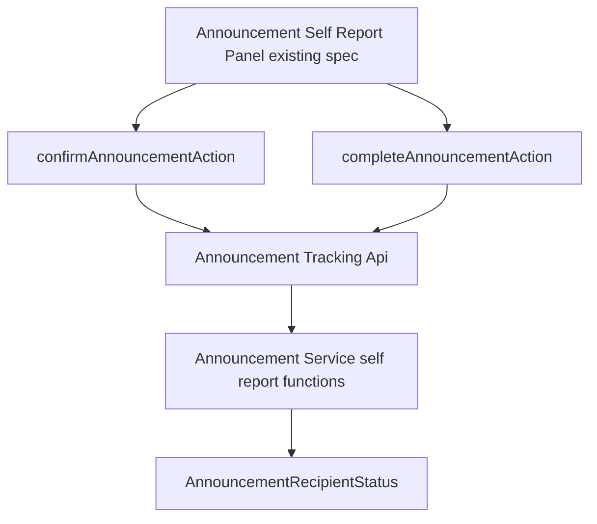

**Architecture Integration（追加分）**:
- 選択パターン: 既存の`sendAnnouncementRemindersAction`と同じ「Client → Server Action → API層（セッションガード）→ サービス層（Prisma）→ `revalidatePath`」構成をそのまま踏襲する
- ドメイン境界: 会社単位の記録先は既存の`AnnouncementRecipientStatus`（担当者単位）のまま変更せず、「会社に属する担当者全員へ同一操作を一括適用する」というサービス層の関数として表現する。新規テーブル・新規カラムは追加しない
- セキュリティ上の決定: `companyCode`はクライアントから受け取らず、`requireApplicantSession()`のクレームから取得する（他社になりすました記録を防ぐ。既存の`isReminderPendingForCompany`は読み取り専用のため呼び出し側が`companyCode`を渡す設計だが、本ラウンドは書き込みを伴うため同じ設計を採用しない）
- 既存パターンの維持: `findAnnouncementVisibleToCountry`（既存、公開状態・公開期間・配信対象の3条件を合成済み）をAPI層の事前チェックとして再利用することで、下書き・配信対象外に対する記録拒否（要件23.3・23.4）を専用の分岐なしに満たす
- Steering準拠: 表示テキストは本ラウンドでは追加しない（サーバー層のみの変更）

### Technology Stack（追加分・差分のみ）
追加・変更なし（既存のPrisma・Server Actionsのみを使用。新規ライブラリ・新規スキーマの追加はない）。

### File Structure Plan（追加分）
新規ファイルなし。以下を変更する。

### Modified Files（追加分）
- `src/lib/server/announcement-service.ts` — `recordCompanyConfirmation(announcementId, companyCode)`・`recordCompanyCompletion(announcementId, companyCode)`・`getAnnouncementSelfStatusForCompany(announcementId, companyCode)`を追加
- `src/lib/api/announcement-tracking.ts` — `confirmAnnouncementForCurrentCompany(id)`・`completeAnnouncementForCurrentCompany(id)`・`getAnnouncementSelfStatus(id)`を追加（いずれも`requireApplicantSession()`でガードし、`claims.companyCode`をサービス層に渡す）
- `src/lib/actions/announcement-tracking.ts` — `confirmAnnouncementAction(announcementId)`・`completeAnnouncementAction(announcementId)`を追加（`"use server"`、既存の`sendAnnouncementRemindersAction`と同一の`revalidatePath`対象を再検証し、呼び出し元に最新の`AnnouncementSelfStatus`を返す）
- `src/types/announcement-recipient.ts` — `AnnouncementSelfStatus`型（`{ confirmedAt: string | null; completedAt: string | null }`）を追加

### System Flows（追加分）

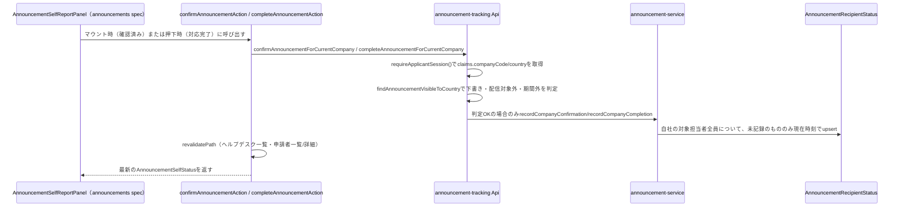

- 判定NG（下書き・配信対象外・期間外・`actionRequired`が偽での対応完了操作）の場合、API層は何もせず正常終了する（例外を送出しない。要件23.3・23.4は「記録を受け付けない」＝無害な no-op として実現する）。

### Requirements Traceability（追加分）

| Requirement | Summary | Components | Interfaces | Flows |
|-------------|---------|------------|------------|-------|
| 23.1〜23.2 | 会社単位の確認済み・実施済み記録関数 | announcement-service（recordCompanyConfirmation/recordCompanyCompletion） | Service | 記録フロー |
| 23.3〜23.4 | 下書き・配信対象外での記録拒否 | announcement-tracking Api（findAnnouncementVisibleToCountry事前チェック） | Service | 記録フロー |
| 23.5 | 既存集計への反映 | announcement-service（既存のgetAnnouncementTrackingSummary等が同一テーブルを参照） | Service | — |
| 23.6 | 記録済みの上書き防止 | announcement-service（recordCompanyConfirmation/recordCompanyCompletion） | Service | — |

---

## 追加ラウンド（2026-07-15）: 添付ファイル（直接アップロード・ドキュメント紐づけ）

### Overview（追加分）
お知らせの新規作成・編集フォームに、(A) `inquiry-form`spec所有の添付方式（Base64データURL、許可形式・サイズ・件数の既存制約をそのまま再利用）によるファイルの直接アップロードと、(B) `documents-management`spec配下に登録済みの`Document`をIDで参照する紐づけ、の2種類の添付を追加する。**Purpose**: ヘルプデスク担当者が、周知内容の裏付けとなる資料（マニュアルPDF等）を、その場でのアップロードと、既に登録済みの正式ドキュメントの参照の両方の手段でお知らせに添付できるようにする。**Impact**: `Announcement`にPrismaの新規子テーブル2つ（`AnnouncementAttachment`・`AnnouncementDocumentLink`）を追加するマイグレーションが発生する。既存の一覧・ダッシュボードウィジェットのレイアウト・データ構造は変更しない（詳細画面のみに影響する追加的変更）。

### Goals（追加分）
- ヘルプデスク担当者が、お知らせの作成・編集フォームからファイルを直接アップロードして添付できる（最大5件、`inquiry-form`と同一の形式・サイズ制約）
- ヘルプデスク担当者が、`documents-management`に登録済みのドキュメントを一覧から選択して紐づけられる（最大5件）
- 海外販社側の詳細画面で、直接アップロードの添付ファイルと、閲覧者から見て公開範囲内にある紐づけドキュメントのみが表示される
- 紐づけドキュメントの表示は、既存の申請者側ドキュメント一覧画面（`documents`spec）と同じ`PdfViewer`によるインラインプレビューとする
- 既存の一覧・ダッシュボードウィジェットの表示内容・レイアウトは一切変更しない

### Non-Goals（追加分）
- `Document`自体の新規登録・編集・削除・公開範囲設定（`documents-management`spec所有、本ラウンドはIDによる参照のみを扱う）
- お知らせの配信対象とドキュメントの公開範囲との不一致に対する警告・保存時のブロック
- 添付ファイル・紐づけドキュメントの一覧画面・ダッシュボードウィジェットへの表示
- 実ファイルストレージへの保存（引き続きBase64データURL方式）

### Boundary Commitments（追加分）

**This Spec Owns（追加）**
- `AnnouncementAttachment`（直接アップロード添付の子テーブル）・`AnnouncementDocumentLink`（ドキュメント紐づけの中間テーブル）のPrismaモデルとマイグレーション
- お知らせの作成・編集フォームへの直接アップロードフィールド（`AttachmentField`の再利用）・ドキュメント紐づけダイアログ（`AnnouncementDocumentLinkDialog`、新規）の追加
- `announcement-service.ts`・`announcement-mapper.ts`・`lib/validation/announcement.ts`への添付・紐づけ関連の読み書き・検証ロジックの追加
- 海外販社側詳細画面（`AnnouncementDetail.tsx`）への「添付ファイル」セクションの追加（直接アップロードの表示、および紐づけドキュメントの可視性フィルタ・`PdfViewer`表示）

**Out of Boundary（追加）**
- `Document`自体の作成・編集・削除・公開範囲設定（`documents-management`spec所有、本specはIDによる参照のみ）
- `documents`spec所有の申請者側ドキュメント一覧画面自体・`PdfViewer`コンポーネントの実装（読み取り専用で再利用するのみ、変更しない）
- `AnnouncementList*`・ダッシュボードウィジェット（`dashboard`spec）の変更

**Allowed Dependencies（追加）**
- `inquiry-form`spec所有: `ATTACHMENT_ALLOWED_MIME_TYPES`・`ATTACHMENT_MAX_FILE_SIZE_BYTES`・`ATTACHMENT_MAX_COUNT`（`lib/constants/attachment.ts`）、`validateAttachmentFile`・`readFileAsDataUrl`・`formatFileSize`（`lib/attachment-utils.ts`）、`AttachmentField`コンポーネント、`InquiryAttachment`型
- `helpdesk-inquiries`（`helpdesk-inquiry-management`spec）所有: `AttachmentPreviewList`コンポーネント（読み取り専用の添付プレビュー表示）
- `documents-management`spec所有: `getAllDocuments()`・`Document`型（ヘルプデスク側のドキュメント紐づけ選択肢の取得）
- `documents`spec所有: `getDocumentById(id)`（申請者セッションスコープの可視性フィルタ済み取得）・`PdfViewer`コンポーネント（詳細画面での紐づけドキュメントのインラインプレビュー表示）

**Revalidation Triggers（追加）**
- `Document`が`documents-management`側で削除された場合、`AnnouncementDocumentLink`の該当行はカスケード削除される（お知らせ側の`linkedDocumentIds`から自動的に除外され、追加のリビルド処理は不要）
- `Document.targeting`（公開範囲）が変更された場合、紐づけ側は何も保持し直さない（表示時に`getDocumentById`が都度最新の`targeting`を参照するため、既存の可視性フィルタがそのまま追随する）

### Architecture（追加分）

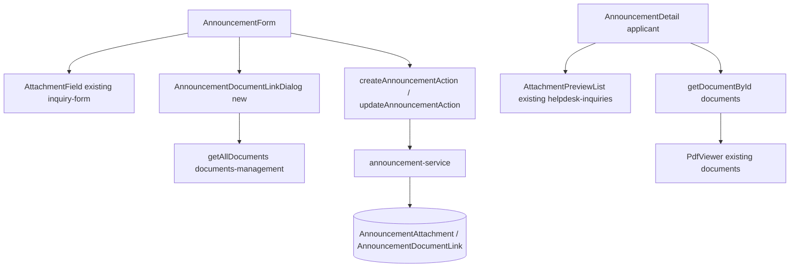

**Architecture Integration（追加分）**:
- 選択パターン: 直接アップロードは`inquiry-form`の`AttachmentField`（多ファイル選択・検証・Base64変換）をそのまま再利用し、独自の検証ロジックを新設しない
- ドメイン境界: ドキュメント紐づけは`Document`の内容をコピーせず、IDのみを`AnnouncementDocumentLink`で保持する。可視性の判定は常に`documents`spec所有の`getDocumentById`（呼び出し時点の`Document.targeting`を参照）に委譲し、お知らせ側で可視性ロジックを複製しない
- セキュリティ/整合性上の決定: ドキュメント紐づけの保存時に、配信対象とドキュメント公開範囲の整合性は検証しない（要件24.12）。表示時の可視性フィルタのみで安全側（非表示）に倒す設計とする
- 既存パターンの維持: フォームの保存は`targeting`等と同様、送信のたびに添付・紐づけの全体を置き換える（差分更新は行わない）

### Technology Stack（追加分・差分のみ）
追加ライブラリなし。既存のPrisma・react-hook-form・zod・shadcn/uiのDialogのみを使用する。

### File Structure Plan（追加分）

**New Files**
- `src/components/features/helpdesk-announcements/AnnouncementDocumentLinkDialog.tsx` — ドキュメント紐づけ選択ダイアログ（`AnnouncementRecipientDialog.tsx`と同様のDialog構成）
- `src/components/features/helpdesk-announcements/AnnouncementDocumentLinkDialog.test.tsx`

**Modified Files**
- `prisma/schema.prisma` — `AnnouncementAttachment`・`AnnouncementDocumentLink`モデル追加、`Announcement`・`Document`に逆リレーション追加
- `src/types/announcement.ts` — `AnnouncementAttachment`（`InquiryAttachment`のエイリアス）・`attachments`・`linkedDocumentIds`フィールド追加
- `src/lib/validation/announcement.ts` — `attachments`・`linkedDocumentIds`のzodスキーマ追加
- `src/lib/server/announcement-mapper.ts` — `attachments`・`linkedDocuments`のPrisma include・マッピング追加
- `src/lib/server/announcement-service.ts` — create/update時の添付・紐づけの全置換書き込み、読み取り系関数へのinclude追加
- `src/components/features/helpdesk-announcements/AnnouncementForm.tsx` — 直接アップロードフィールド・ドキュメント紐づけダイアログの統合
- `src/components/features/announcements/AnnouncementDetail.tsx` — 「添付ファイル」セクション追加
- `src/app/[locale]/helpdesk/(dashboard)/announcements/new/page.tsx`・`.../[id]/edit/page.tsx` — `getAllDocuments()`取得・`documentOptions`受け渡し、編集画面の`defaultValues`拡張

### Data Models（追加分）

```prisma
model AnnouncementAttachment {
  id             String       @id @default(cuid())
  fileName       String
  fileType       String
  fileSize       Int
  dataUrl        String
  announcementId String
  announcement   Announcement @relation(fields: [announcementId], references: [id], onDelete: Cascade)

  @@index([announcementId])
}

model AnnouncementDocumentLink {
  id             String       @id @default(cuid())
  announcementId String
  announcement   Announcement @relation(fields: [announcementId], references: [id], onDelete: Cascade)
  documentId     String
  document       Document     @relation(fields: [documentId], references: [id], onDelete: Cascade)

  @@unique([announcementId, documentId])
  @@index([announcementId])
  @@index([documentId])
}
```

`AnnouncementTargeting`等の値オブジェクトと異なり、添付・紐づけは独立した識別子を持つ子レコード・別集約（`Document`）への参照であるため、JSON列ではなく正規化したテーブル・リレーションとして追加する（`AnnouncementRecipientStatus`と同様の中間テーブルパターン）。両FKとも`onDelete: Cascade`とする（`AnnouncementRecipientStatus`の`Restrict`とは異なり、添付・紐づけ自体に削除をブロックすべき独立した業務的意味がないため）。

ドメイン型:
```typescript
export type AnnouncementAttachment = InquiryAttachment;

export interface Announcement {
  // ...既存フィールド
  attachments: AnnouncementAttachment[];
  linkedDocumentIds: string[];
}
```

`CreateAnnouncementInput`は引き続き`Omit<Announcement, "id"|"publishedAt"|"createdAt"|"updatedAt">`のまま`attachments`・`linkedDocumentIds`を含む。

### Error Handling（追加分）
既存パターンを維持する。フォーム側のzodバリデーションで添付形式・サイズ・件数超過をブロックする（要件24.2）。`linkedDocumentIds`に存在しない/削除済みのIDが含まれていても、サービス層は事前の`prisma.document.findMany`による存在確認で該当IDを無言で除外し、エラーにしない（要件24.12の「検証・警告しない」方針を書き込み時にも一貫させる）。

### Testing Strategy（追加分）
- **Unit Tests**:
  - `announcementFormSchema`が添付5件超・不正形式・サイズ超過・紐づけ5件超を拒否すること
  - `createAnnouncementRecord`/`updateAnnouncementRecord`が添付・紐づけを正しく永続化し、更新時に全置換されること
  - 存在しない`linkedDocumentIds`が無言で除外されること
  - `deleteAnnouncementRecord`実行後、関連する`AnnouncementAttachment`・`AnnouncementDocumentLink`もカスケード削除されること
- **Integration Tests**:
  - 紐づけドキュメントの公開範囲に閲覧者の会社・国が含まれない場合、詳細画面に表示されないこと（お知らせ自体の配信対象は満たしている場合を含む）
  - 公開範囲に含まれる紐づけドキュメントが`PdfViewer`でインラインプレビューされること
  - 直接アップロードの添付ファイルは常に表示されること
  - `documents-management`側でドキュメントが削除された場合、お知らせ詳細画面から当該紐づけが自動的に消えること
- **E2E/UI Tests**:
  - ヘルプデスク側で添付・紐づけを行ったお知らせが、一覧・ダッシュボードウィジェットの表示内容を変えないまま、申請者側詳細画面にのみ反映されること
  - タブレット幅（768px）で添付・紐づけUIが横スクロールを起こさないこと

### Components and Interfaces（追加分）

| Component | Domain/Layer | Intent | Req Coverage | Key Dependencies (P0/P1) | Contracts |
|-----------|--------------|--------|---------------|---------------------------|-----------|
| announcement-service（差分） | Data/Service | 会社単位の確認済み・実施済み記録・自社状態の読み取り | 23.1, 23.2, 23.6 | AnnouncementRecipientStatus (P0) | Service |
| announcement-tracking Api（差分） | Server API | 申請者セッションで会社を特定し、可視性チェック後にサービス層を呼び出す | 23.3, 23.4 | requireApplicantSession (P0), findAnnouncementVisibleToCountry (P0), announcement-service (P0) | Service |
| announcement-tracking Actions（差分） | Server Actions | クライアントからの呼び出しを受け、記録後に関連ルートを再検証する | — | announcement-tracking Api (P0) | Service |

#### announcement-service（差分）

| Field | Detail |
|-------|--------|
| Intent | 会社単位で確認済み・実施済み状態を一括記録し、自社の集約状態を読み取る |
| Requirements | 23.1, 23.2, 23.6 |

**Responsibilities & Constraints**
- `recordCompanyConfirmation`/`recordCompanyCompletion`は、`targetRecipientsWhere(announcement)`と`company.companyCode === companyCode`の両方を満たす担当者（＝配信対象に含まれ、かつ指定会社に属する担当者）のみを更新対象とする（配信対象外の会社を指定した場合、対象0件で何もしない no-op となり、要件23.4の防御としても働く）
- 既に`confirmedAt`（または`completedAt`）が設定済みの担当者はスキップし、初回記録時刻を上書きしない（要件23.6）
- `recordCompanyCompletion`は`announcement.actionRequired`が偽のとき何もしない
- `getAnnouncementSelfStatusForCompany`は、対象担当者が1件でも存在し、かつ全員が`confirmedAt`（または`completedAt`）を持つときのみ、その値（先勝ち・全員が持つ値のうち代表の1件）を返す。それ以外は`null`を返す（「会社として確認済み」は全員一致を条件とする、全員が同時に記録される設計のため実運用では常に一致する）

**Dependencies**
- Inbound: `announcement-tracking Api`（P0）
- Outbound: `AnnouncementRecipientStatus`テーブル（P0、Prisma）, `targetRecipientsWhere`（P0、既存）

**Contracts**: Service [x]

##### Service Interface
```typescript
interface AnnouncementSelfStatus {
  confirmedAt: string | null;
  completedAt: string | null;
}

interface AnnouncementSelfReportService {
  recordCompanyConfirmation(announcementId: string, companyCode: string): Promise<void>;
  recordCompanyCompletion(announcementId: string, companyCode: string): Promise<void>;
  getAnnouncementSelfStatusForCompany(
    announcementId: string,
    companyCode: string
  ): Promise<AnnouncementSelfStatus>;
}
```
- Preconditions: `announcementId`は存在するお知らせのID。`companyCode`は呼び出し元（API層）がセッションから取得した値であること（クライアント入力を直接渡さない）
- Postconditions: `recordCompanyConfirmation`実行後、当該会社かつ配信対象に含まれる担当者全員の`confirmedAt`が非nullになる（`recordCompanyCompletion`も同様に`completedAt`について）
- Invariants: 既存の`getAnnouncementTrackingSummary`・`getAnnouncementRecipientStatuses`は本関数が書き込んだ値をそのまま参照する（別集計を持たない）

**Implementation Notes**
- Integration: `targetRecipientsWhere`（既存）をそのまま再利用し、配信対象の判定ロジックを重複させない
- Validation: 対象担当者が0件（配信対象外の会社を指定した場合）は正常に no-op で終了する
- Risks: なし（既存テーブル・既存の集計関数への変更を伴わない加算的な変更）

#### announcement-tracking Api（差分）

| Field | Detail |
|-------|--------|
| Intent | 申請者セッションから会社を特定し、対象お知らせの可視性を確認した上でサービス層の記録関数を呼び出す |
| Requirements | 23.3, 23.4 |

**Responsibilities & Constraints**
- `confirmAnnouncementForCurrentCompany`/`completeAnnouncementForCurrentCompany`/`getAnnouncementSelfStatus`は`requireApplicantSession()`で必須セッションを取得し、`claims.companyCode`・`claims.country`をサービス層の呼び出しに用いる（クライアントから`companyCode`を受け取らない）
- 記録系の2関数は、実行前に`findAnnouncementVisibleToCountry(id, claims.country)`（既存、`lib/server/announcement-service.ts`）を呼び出し、`null`（下書き・配信対象外・公開期間外・存在しない）の場合は何もせず正常終了する
- `completeAnnouncementForCurrentCompany`は、取得した対象お知らせの`actionRequired`が偽の場合も何もせず正常終了する

**Dependencies**
- Inbound: `announcement-tracking Actions`（P0）
- Outbound: `requireApplicantSession`（P0, 既存）, `findAnnouncementVisibleToCountry`（P0, 既存）, `announcement-service`の自己申告記録関数（P0, 本ラウンド追加）

**Contracts**: Service [x]

##### Service Interface
```typescript
interface AnnouncementTrackingSelfApi {
  confirmAnnouncementForCurrentCompany(id: string): Promise<AnnouncementSelfStatus>;
  completeAnnouncementForCurrentCompany(id: string): Promise<AnnouncementSelfStatus>;
  getAnnouncementSelfStatus(id: string): Promise<AnnouncementSelfStatus>;
}
```
- Preconditions: 呼び出し元は`applicant`ロールの有効なセッションを持つこと（`requireApplicantSession`が例外を送出する場合、呼び出し元がハンドルする）
- Postconditions: 可視性チェックを通過した場合のみ記録が行われ、いずれの場合も最新の`AnnouncementSelfStatus`を返す
- Invariants: `companyCode`は常にセッションクレーム由来であり、引数として外部から指定できない

**Implementation Notes**
- Integration: 既存の`getAnnouncementById`/`findAnnouncementVisibleToCountry`のインポート元（`lib/server/announcement-service.ts`）をそのまま再利用する
- Validation: 該当なし（可視性チェック自体がバリデーションを兼ねる）
- Risks: なし

#### announcement-tracking Actions（差分）

**Responsibilities & Constraints（追加）**
- `confirmAnnouncementAction`・`completeAnnouncementAction`は`"use server"`を付与し、API層を呼び出した後、既存の`sendAnnouncementRemindersAction`と同一の`revalidatePath`対象（ヘルプデスク側一覧・申請者側一覧・詳細）を再検証する
- 呼び出し元（`AnnouncementSelfReportPanel`）が楽観的UI更新を行えるよう、最新の`AnnouncementSelfStatus`を返り値とする

##### Service Interface
```typescript
interface AnnouncementTrackingSelfActions {
  confirmAnnouncementAction(announcementId: string): Promise<AnnouncementSelfStatus>;
  completeAnnouncementAction(announcementId: string): Promise<AnnouncementSelfStatus>;
}
```
- Preconditions: なし（未認証時は内部で呼び出す`requireApplicantSession`が例外を送出し、クライアント側でエラー表示にフォールバックする）
- Postconditions: 成功時、ヘルプデスク側の確認済み・実施済み人数表示が次回アクセス時に最新値を反映する
- Invariants: 記録に失敗しても他のお知らせ・他社のデータには影響しない

### Data Models（追加分）
本ラウンドは新規のテーブル・カラムを追加しない。既存の`AnnouncementRecipientStatus.confirmedAt`/`completedAt`を書き込み先として再利用する。`AnnouncementSelfStatus`（`{ confirmedAt: string | null; completedAt: string | null }`）は、既存の複数担当者分のステータスを会社単位に集約するための読み取り専用の型（DB上の実体を持たない）として`types/announcement-recipient.ts`に追加する。

### Error Handling（追加分）
既存パターンを維持する。未認証時は`requireApplicantSession`が`UnauthorizedSessionError`を送出し、呼び出し元のクライアントコンポーネントがエラー表示にフォールバックする。可視性チェックNG（下書き・配信対象外等）は例外ではなく no-op として扱う（要件23.3・23.4はユーザーへのエラー表示を必要としない「静かな拒否」として実現する。そもそも申請者側はこれらのお知らせを閲覧できないため、この経路がユーザーに到達することは通常ない）。

### Testing Strategy（追加分）

- **Unit Tests**:
  - `recordCompanyConfirmation`/`recordCompanyCompletion`が、指定会社かつ配信対象に含まれる担当者全員の対応する列のみを更新し、他社・他のお知らせに影響しないこと
  - 既に`confirmedAt`/`completedAt`が設定済みの担当者について、再実行しても値が変わらないこと（初回記録時刻の保持）
  - `recordCompanyCompletion`が`actionRequired`が偽のお知らせに対しては何もしないこと
  - `getAnnouncementSelfStatusForCompany`が、対象担当者全員が記録済みのときのみ非nullを返すこと
  - `confirmAnnouncementForCurrentCompany`/`completeAnnouncementForCurrentCompany`が、下書き・配信対象外・公開期間外のお知らせに対して何もせず正常終了すること
- **Integration Tests**:
  - 申請者セッションで詳細画面相当の呼び出しを行うと、自社の担当者全員の確認済み人数が既存の`getAnnouncementTrackingSummary`に反映されること
  - 「対応完了にする」相当の呼び出し後、未対応者一覧（要件14）から自社の担当者が除外されること

---

## 追加ラウンド（2026-07-15・第2弾）: 添付ファイル・紐づけドキュメントのPDFインラインプレビュー

### Overview（追加分）
前ラウンド（要件24）で追加した添付ファイル・紐づけドキュメントの表示を拡張し、`documents-management`spec側の詳細/編集画面（`DocumentDetailPanel`）と同様のインラインPDFプレビュー（`PdfViewer`）を、ヘルプデスク側の新規作成・編集フォーム（`AnnouncementForm`）と海外販社側詳細画面（`AnnouncementDetail`）の両方に適用する。**Purpose**: ヘルプデスク担当者・海外販社担当者の双方が、添付・紐づけされたPDFの中身をダウンロードせずその場で確認できるようにする。**Impact**: 新規テーブル・型追加は発生しない。既存の`AnnouncementForm`・`AnnouncementDetail`内の表示分岐のみを変更する純粋なUI拡張である。

### Goals（追加分）
- `AnnouncementForm`で、直接アップロード済みのPDF添付ファイル・紐づけ済みドキュメント（常にPDF）について、`PdfViewer`によるインラインプレビューを表示する
- `AnnouncementDetail`で、直接アップロード済みのPDF添付ファイルについて、`PdfViewer`によるインラインプレビューを表示する（紐づけドキュメントは前ラウンドで対応済み）
- 画像添付の既存のサムネイル表示（`AttachmentField`・`AttachmentPreviewList`が提供する標準動作）は変更しない

### Non-Goals（追加分）
- `AttachmentField`・`AttachmentPreviewList`・`PdfViewer`自体の実装変更（いずれも読み取り専用で組み合わせて使うのみ）
- 紐づけドキュメントの公開範囲（`DocumentTargeting`）による可視性フィルタロジックの変更
- 一覧画面・ダッシュボードウィジェットへのプレビュー表示

### Boundary Commitments（追加分）

**This Spec Owns（追加）**
- `AnnouncementForm.tsx`における、直接アップロードのPDF添付ファイル・紐づけドキュメントそれぞれに対する`PdfViewer`表示の組み込み（`AttachmentField`本体は変更せず、その外側に並べて表示する）
- `AnnouncementDetail.tsx`における、直接アップロードの添付ファイルをMIMEタイプで振り分け、PDFは`PdfViewer`、画像は既存の`AttachmentPreviewList`で表示する分岐ロジック

**Out of Boundary（追加）**
- `inquiry-form`spec所有の`AttachmentField`・`helpdesk-inquiry-management`spec所有の`AttachmentPreviewList`・`documents`spec所有の`PdfViewer`自体の実装（読み取り専用の組み合わせ利用のみ）
- 紐づけドキュメントの可視性制御（要件24.10・24.11、前ラウンドのまま）

**Allowed Dependencies（追加）**
- 前ラウンドから変更なし。`documents`spec所有の`PdfViewer`コンポーネントを、直接アップロード添付ファイルの表示にも追加で利用する

**Revalidation Triggers（追加）**
- なし（新規の型・コンポーネント境界・データ所有権の変更を伴わない表示ロジックのみの変更）

### Architecture（追加分）

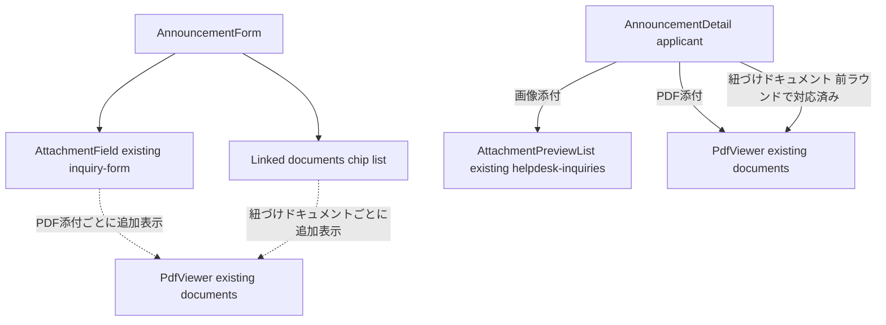

**Architecture Integration（追加分）**:
- 選択パターン: `documents-management`spec側の`DocumentDetailPanel`が確立した「フォーム/一覧コンポーネント本体は変更せず、その外側に独立した`PdfViewer`を並べて表示する」パターンをそのまま踏襲する
- 既存パターンの維持: `AttachmentField`は複数スペックで共有される汎用コンポーネントのため、内部実装は変更せず、`AnnouncementForm`側で`watch`/`field.value`から取得した添付ファイル一覧をもとに、`fileType === "application/pdf"`のものだけを別途`PdfViewer`として描画する
- ドメイン境界: 振り分けロジック（PDFか画像か）は`AnnouncementForm`・`AnnouncementDetail`それぞれのローカルなプレゼンテーション判定に留め、共有コンポーネント側やドメイン型に新しいフラグを追加しない

### Technology Stack（追加分・差分のみ）
追加ライブラリなし。既存の`PdfViewer`（`documents`spec）をそのまま再利用する。

### File Structure Plan（追加分）

**Modified Files**
- `src/components/features/helpdesk-announcements/AnnouncementForm.tsx` — 直接アップロードのPDF添付・紐づけドキュメントそれぞれについて、既存のチップ/ファイル名表示に加えて`PdfViewer`を描画する
- `src/components/features/announcements/AnnouncementDetail.tsx` — 直接アップロード添付ファイルを`fileType`で振り分け、PDFは`PdfViewer`、画像は既存どおり`AttachmentPreviewList`で表示する

### Requirements Traceability（追加分）

| Requirement | Summary | Components | Interfaces | Flows |
|-------------|---------|------------|------------|-------|
| 25.1, 25.2, 25.3, 25.8 | 管理フォームでのPDFプレビュー | AnnouncementForm | PdfViewer (props経由) | — |
| 25.4, 25.5, 25.6, 25.8 | 詳細画面でのPDFプレビュー | AnnouncementDetail | PdfViewer (props経由) | — |
| 25.7 | 可視性制御の維持 | AnnouncementDetail | getDocumentById (既存) | — |

### Components and Interfaces（追加分）

| Component | Domain/Layer | Intent | Req Coverage | Key Dependencies (P0/P1) | Contracts |
|-----------|--------------|--------|---------------|---------------------------|-----------|
| AnnouncementForm（差分） | UI | 直接アップロード添付・紐づけドキュメントのうちPDF形式のものをインラインプレビュー表示する | 25.1, 25.2, 25.3, 25.8 | AttachmentField (P0, 既存・変更なし), PdfViewer (P0, documents spec) | State |
| AnnouncementDetail（差分） | UI | 直接アップロード添付ファイルをMIMEタイプで振り分け、PDFはインラインプレビュー表示する | 25.4, 25.5, 25.6, 25.8 | AttachmentPreviewList (P0, 既存・変更なし), PdfViewer (P0, documents spec) | — |

#### AnnouncementForm（差分）

| Field | Detail |
|-------|--------|
| Intent | `attachments`・`linkedDocumentIds`のうちPDF形式のものについて、既存のチップ表示に加えて`PdfViewer`をインラインで描画する |
| Requirements | 25.1, 25.2, 25.3, 25.8 |

**Responsibilities & Constraints**
- `Controller name="attachments"`の`render`内で、`field.value`のうち`fileType === "application/pdf"`のものを抽出し、既存のチップ一覧の下に、添付ごとに独立した`PdfViewer`（`dataUrl`・`title`はファイル名、`downloadFileName`はファイル名）を描画する。画像添付（`fileType.startsWith("image/")`）は`AttachmentField`本体の既存サムネイル表示のみとし、追加の`PdfViewer`は描画しない
- `Controller name="linkedDocumentIds"`の`render`内で、`selectedDocuments`（`documentOptions`から解決済みの`Document[]`）それぞれについて、既存のチップ表示の下に`PdfViewer`（`dataUrl`は`document.dataUrl`、`downloadFileName`は`document.fileName`）を描画する。`documents-management`spec側の制約により`Document`は常にPDF形式のため、フォーマット分岐は不要
- `AttachmentField`コンポーネント自体（複数spec共有）は変更しない。プレビューは`AnnouncementForm`側で並べて描画する追加要素として実装する

**Dependencies**
- Inbound: なし（Presentational component）
- Outbound: `PdfViewer`（P0, `documents`spec） / `AttachmentField`（P0, `inquiry-form`spec, 既存・変更なし）

**Contracts**: State [x]

**Implementation Notes**
- Integration: `PdfViewer`の`downloadLinkLabel`は、既存の`AnnouncementDetail`と同様に`documents.list`の`downloadLink`翻訳キーを流用するか、`helpdeskAnnouncements.form`配下に同義の翻訳キーを追加するかは実装時に既存の翻訳キー命名規則に合わせて決定する
- Validation: 該当なし（表示のみの変更、`announcementFormSchema`のバリデーションには影響しない）
- Risks: 添付・紐づけドキュメントが複数件（最大5件ずつ）ある場合、フォーム内に複数の`PdfViewer`（各`h-[50vh]`のiframe）が縦に並び画面が縦長になる。既存の`documents`一覧画面でも同様のトレードオフを許容しているため、本ラウンドでも同様に許容する

#### AnnouncementDetail（差分）

| Field | Detail |
|-------|--------|
| Intent | 直接アップロード添付ファイルをMIMEタイプで振り分け、PDFは`PdfViewer`、画像は既存の`AttachmentPreviewList`で表示する |
| Requirements | 25.4, 25.5, 25.6, 25.8 |

**Responsibilities & Constraints**
- `announcement.attachments`を`fileType.startsWith("image/")`の画像添付と`fileType === "application/pdf"`のPDF添付に分割する（`ATTACHMENT_ALLOWED_MIME_TYPES`が画像・PDFのみのため、この2分割で全件を網羅する）
- 画像添付は既存どおり`AttachmentPreviewList`にまとめて渡す
- PDF添付は1件ずつ`PdfViewer`として描画する（紐づけドキュメントの描画箇所と同様の並びとする）
- 紐づけドキュメントの可視性フィルタ・`PdfViewer`表示（要件24.10・24.11）は変更しない

**Dependencies**
- Inbound: `app/[locale]/(applicant)/announcements/[id]/page.tsx`（P0, 既存・変更なし）
- Outbound: `PdfViewer`（P0, `documents`spec） / `AttachmentPreviewList`（P0, `helpdesk-inquiries`, 既存・変更なし）

**Contracts**: State [x]

**Implementation Notes**
- Integration: 既存の`hasAttachments`判定（`attachments.length > 0 || visibleLinkedDocuments.length > 0`）は変更不要（振り分け後も件数の合計は変わらない）
- Validation: 該当なし
- Risks: なし（既存の表示件数・データ取得経路は変更しない）

### Data Models（追加分）
本ラウンドは型・スキーマの追加変更を伴わない。既存の`Announcement.attachments`（`AnnouncementAttachment[]` = `InquiryAttachment[]`）の`fileType`をそのまま表示振り分けの判定に使う。

### Error Handling（追加分）
既存パターンを維持する。`PdfViewer`はdata URLの読み込み失敗を検知できないため、iframeの外側に独立したダウンロードリンクを常設する既存方針（`PdfViewer`自身の設計）をそのまま踏襲し、本ラウンドで新たなエラーハンドリングは追加しない。

### Testing Strategy（追加分）
- **Unit/Component Tests**:
  - `AnnouncementForm`に既存の`attachments`（PDF・画像混在）を渡したとき、PDF添付の件数分だけ`PdfViewer`相当の要素（iframe）が描画され、画像添付では描画されないこと
  - `AnnouncementForm`に紐づけドキュメントを渡したとき、選択済み件数分の`PdfViewer`が描画されること
  - `AnnouncementDetail`にPDF添付を渡したとき、`PdfViewer`のダウンロードリンクが`fileName`で表示されること
  - `AnnouncementDetail`に画像添付を渡したとき、従来どおり`AttachmentPreviewList`経由でサムネイル表示され、`PdfViewer`が描画されないこと
- **E2E/UI Tests**:
  - ヘルプデスク側フォームで新規添付・紐づけ後、保存せずにその場でPDFの内容がプレビューできること
  - 海外販社側詳細画面で、直接アップロードのPDF添付がダウンロードせずに内容確認できること
  - 日本語・英語両ロケール、タブレット幅（768px）でプレビューが横スクロールを起こさないこと

---

## 追加ラウンド（2026-07-16）: 通知配信と多言語発信対応

### Overview（追加分）
現状「フェーズ1はメール・プッシュ通知等の配信機能を対象外とする」としていた制約を見直し、お知らせの公開・リマインド送信時に対象受信者へメール通知を送るメール送信基盤を追加する。あわせて、`Announcement`のタイトル・本文を言語別（`ja`必須＋`en`必須＋任意の追加言語）に保持できるようにし、通知メールの本文を受信者の言語設定に応じて出し分ける。**Purpose**: 「日本本社→海外販社・代理店（20か国以上）への情報発信」という本ポータルの目的に対し、ログイン依存の閲覧のみだったプッシュ型の届け方を補い、単一言語の発信による伝達漏れを防ぐ。**Impact**: `Announcement`に子テーブル`AnnouncementTranslation`を追加し、`ApplicantUser`に`preferredLocale`を追加するマイグレーションが発生する。新規モジュール`src/lib/server/mailer.ts`・`src/lib/server/announcement-notifications.ts`を追加し、既存の`createAnnouncementRecord`/`updateAnnouncementRecord`/`sendAnnouncementReminders`（`announcement-service.ts`）から呼び出す。既存の一覧・詳細画面のレイアウト・操作性は変更しない（フォームへの言語タブ追加を除く）。

### Goals（追加分）
- お知らせが「公開」状態になった時点で、配信対象に含まれる`ApplicantUser`へ通知メールが送信される
- 未対応者へのリマインド送信操作時に、対象`ApplicantUser`へリマインドメールが送信される
- メール送信の失敗が、公開・リマインド送信という既存の業務操作を失敗させない（ベストエフォート）
- 送信結果（成功・失敗・スキップ）の履歴が記録される
- お知らせのタイトル・本文を`ja`・`en`必須＋任意の追加言語で登録でき、通知メールは受信者の言語設定に対応する内容で送信される

### Non-Goals（追加分）
- SMS・アプリ内プッシュ通知等、メール以外の配信チャネル
- 受信者ごとの配信オプトアウトUI（全対象受信者への一律送信のみ）
- `ApplicantUser`が自身の`preferredLocale`を変更するUI（本ラウンドはフィールドの追加と既定値の適用のみ。設定変更UIは将来の検討事項とする）
- `AnnouncementRecipient`（モック担当者マスタ）の個人単位識別・ログイン機能への拡張
- 20か国語すべてを網羅する翻訳データの自動生成・機械翻訳連携

### Boundary Commitments（追加分）

**This Spec Owns（追加）**
- `AnnouncementTranslation`（お知らせの言語別タイトル・本文の子テーブル）のPrismaモデル・マイグレーション
- `ApplicantUser.preferredLocale`フィールドの追加・マイグレーション
- メール送信基盤（`src/lib/server/mailer.ts`）・通知オーケストレーション（`src/lib/server/announcement-notifications.ts`）・送信履歴（`AnnouncementNotificationLog`）
- お知らせ作成・編集フォームの言語別入力UI（`AnnouncementForm`への言語タブ追加）
- 公開時・リマインド送信時のメール送信の呼び出し箇所（`announcement-service.ts`の`createAnnouncementRecord`/`updateAnnouncementRecord`/`sendAnnouncementReminders`）

**Out of Boundary（追加）**
- 申請者側（`announcements`spec）の一覧・詳細画面における言語別コンテンツの表示ロジック自体（本specは`Announcement`型の`title`/`body`が要求された言語で解決された値を返す関数を提供するのみ。`announcements`spec側は要件16として参照するのみで、本ラウンドではUIコンポーネントを変更しない）
- `ApplicantUser`の認証・アカウント管理機能自体（`backend-db-foundation`spec所有。本ラウンドは既存の`ApplicantUser`テーブルにフィールドを追加するのみ）
- ダッシュボードの「お知らせ概要ウィジェット」（`dashboard`spec所有）自体の変更

**Allowed Dependencies（追加）**
- 既存の`ApplicantUser`（`companyId`経由で`Company.country`を参照、メール送信・言語解決の宛先データとして使用）
- 既存の`requireApplicantSession`/`requireHelpdeskStaffSession`（`lib/server/auth-session.ts`）
- 既存の`targetRecipientsWhere`と同様の考え方（`Company.country`によるスコープ判定）

**Revalidation Triggers（追加）**
- `Announcement.title`/`body`の解決方式（言語別）の変更（`announcements`spec・`dashboard`spec双方が再確認する必要がある）
- `ApplicantUser.preferredLocale`の既定値・意味の変更
- メール送信基盤（SMTP設定・送信関数のシグネチャ）の変更

### Architecture（追加分）

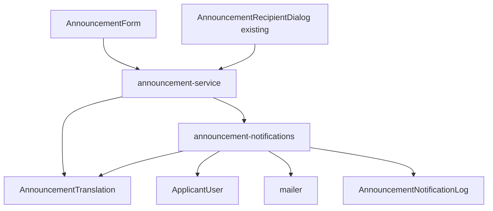

**Architecture Integration（追加分）**:
- 選択パターン: 既存の「Server Actions → サービス層（Prisma）」構成を維持し、公開・リマインド送信という既存の書き込み操作の内部で通知処理を追加で呼び出す（新規のUIエントリポイントは作らない）
- ドメイン境界: 通知の送信先解決（`ApplicantUser`単位）は`AnnouncementRecipient`（担当者マスタ、確認済み・実施済み集計専用）とは別経路とする。両者は「配信対象（`targeting`）でスコープされた対象母集団」という考え方は共有するが、`AnnouncementRecipient`にはメールアドレスが存在しないため、実際の送信先解決には`ApplicantUser`を参照する新しいwhere条件（`targetApplicantUsersWhere`）を設ける
- ベストエフォートの実現方式: `announcement-notifications.ts`の関数は宛先ごとの送信を内部で`try/catch`し、例外を呼び出し元（`announcement-service.ts`）に伝播させない（Promiseがrejectしない設計とする）。これにより`createAnnouncementRecord`等の既存の戻り値・エラー処理を変更せずに済む
- 言語解決の方式: `Announcement.title`/`body`は引き続き`ja`（既定言語）のコンテンツを直接保持する既存カラムとし、`en`必須＋任意追加言語は新設の`AnnouncementTranslation`（`locale`ごとに1行）に保持する。これにより既存の全ての読み取り経路（`title`/`body`を直接参照するコード）に対する破壊的変更を避けつつ、`en`・追加言語を段階的に載せられる
- Steering準拠: モックAPIではなく実DB（Prisma）ベースの既存パターン（`backend-db-foundation`統合後の規約）を維持する。表示テキストは`next-intl`翻訳キー経由という既存規約を維持する

### Technology Stack（追加分・差分のみ）

| Layer | Choice / Version | Role in Feature | Notes |
|-------|------------------|------------------|-------|
| メール送信 | `nodemailer`（新規導入） + SMTP | 公開・リマインド通知メールの送信 | SMTP接続情報は`SMTP_HOST`/`SMTP_PORT`/`SMTP_USER`/`SMTP_PASS`/`SMTP_FROM`の環境変数で構成する。未設定時は送信をスキップし`AnnouncementNotificationLog`に`status: "skipped"`として記録する（ローカル開発・テスト環境でSMTP資格情報を必須にしない） |
| Data / Storage | Prisma + PostgreSQL（既存） | `AnnouncementTranslation`・`AnnouncementNotificationLog`・`ApplicantUser.preferredLocale`の追加 | 既存の`Announcement`関連子テーブル（`AnnouncementAttachment`等）と同一パターン |

### File Structure Plan（追加分）

```
prisma/
├── schema.prisma                              # 変更: AnnouncementTranslation・AnnouncementNotificationLogモデル、ApplicantUser.preferredLocale、関連Enumを追加
└── migrations/                                 # 新規: 上記スキーマ変更を反映するマイグレーション

src/lib/server/
├── mailer.ts                                   # 新規: nodemailerトランスポートのラッパー（sendMail、SMTP未設定時はスキップ）
├── announcement-notifications.ts               # 新規: notifyAnnouncementPublished・notifyAnnouncementReminder（宛先解決・言語解決・ベストエフォート送信・履歴記録）
├── announcement-service.ts                     # 変更: createAnnouncementRecord/updateAnnouncementRecordの公開遷移時、sendAnnouncementRemindersの送信確定時にnotify*を呼び出す。targetApplicantUsersWhere・resolveAnnouncementContentを追加
└── announcement-mapper.ts                      # 変更: AnnouncementTranslationのinclude・マッピングを追加

src/types/
└── announcement.ts                             # 変更: AnnouncementTranslationView型、Announcement.translationsフィールドを追加

src/lib/validation/
└── announcement.ts                             # 変更: announcementFormSchemaに titleEn/bodyEn（必須）・translations（任意言語の配列）を追加

src/components/features/helpdesk-announcements/
└── AnnouncementForm.tsx                        # 変更: 言語別入力タブ（ja/en必須、任意言語の追加・削除）を追加

messages/
├── ja.json                                     # 変更: helpdeskAnnouncements.form.language*名前空間を追加
└── en.json                                     # 同上
```

### Modified Files（追加分）
- `prisma/schema.prisma` — `AnnouncementTranslation`（`id`, `announcementId`, `locale`, `title`, `body`, `@@unique([announcementId, locale])`）、`AnnouncementNotificationLog`（`id`, `announcementId`, `kind`（`AnnouncementNotificationKind`: `publish`/`reminder`）, `recipientEmail`, `locale`, `status`（`AnnouncementNotificationStatus`: `sent`/`failed`/`skipped`）, `errorMessage String?`, `sentAt DateTime @default(now())`）を追加。`ApplicantUser`に`preferredLocale String @default("en")`を追加
- `src/lib/server/mailer.ts` — `sendMail(options: { to: string; subject: string; text: string }): Promise<void>`（SMTP未設定時は例外`MailerNotConfiguredError`をthrow、呼び出し元が`skipped`として扱う）
- `src/lib/server/announcement-notifications.ts` — `notifyAnnouncementPublished(announcementId: string): Promise<void>`・`notifyAnnouncementReminder(announcementId: string, companyCodes: string[]): Promise<void>`を追加。いずれも内部で宛先ごとに`try/catch`し例外を伝播させない
- `src/lib/server/announcement-service.ts` — `createAnnouncementRecord`が`status: "published"`で新規作成された場合、`updateAnnouncementRecord`が`draft`→`published`へ遷移した場合に`notifyAnnouncementPublished`を呼び出す。`sendAnnouncementReminders`が送信確定後に`notifyAnnouncementReminder`を呼び出す。`targetApplicantUsersWhere`（`targetRecipientsWhere`と同型、`ApplicantUser`向け）・`resolveAnnouncementContent(announcement, locale)`（`ja`固定カラム＋`translations`からの解決、フォールバックは`ja`）を追加
- `src/lib/server/announcement-mapper.ts` — `ANNOUNCEMENT_INCLUDE`に`translations: true`を追加し、`mapAnnouncement`が`translations: AnnouncementTranslationView[]`を含めて返すよう変更
- `src/lib/validation/announcement.ts` — `announcementFormSchema`に`titleEn: z.string().min(1)`・`bodyEn: z.string().min(1)`・`translations: z.array(z.object({ locale: z.string().min(2), title: z.string().min(1), body: z.string().min(1) })).max(20)`を追加（`translations`内の`locale`に`ja`/`en`の重複指定は不可とする）
- `src/components/features/helpdesk-announcements/AnnouncementForm.tsx` — タイトル・本文フィールドの周辺に言語タブ（`ja`・`en`は固定タブ、その他は`useFieldArray`で追加・削除可能な行）を追加
- `messages/ja.json` / `messages/en.json` — `helpdeskAnnouncements.form.language.*`（タブラベル・言語追加ボタン・削除ボタン・言語コード入力ラベル）の翻訳キーを追加

### System Flows（追加分）

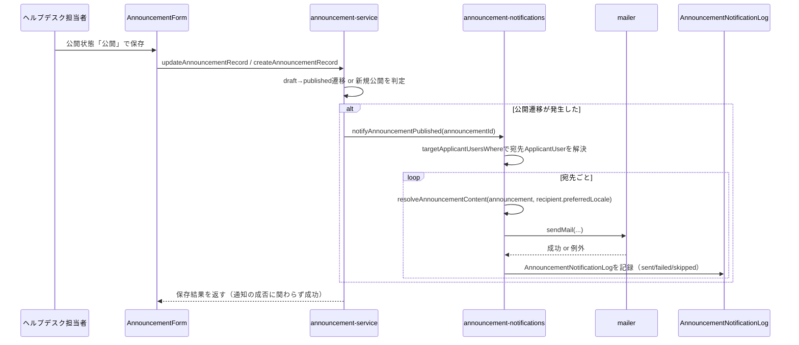

- リマインド送信（既存の`sendAnnouncementReminders`）も同型のフローに従う。差分は宛先を「配信対象全体」ではなく「リマインド対象として指定された会社（`companyCodes`）に属する`ApplicantUser`」に絞る点のみである
- 通知処理（`Notify`ブロック全体）の失敗は`Service`の戻り値・例外に影響しない。`Service`は`await`はするが、`Notify`側が内部で全例外を捕捉するため、`Service`から見た`notifyAnnouncementPublished`の呼び出しは常に正常終了する

### Requirements Traceability（追加分）

| Requirement | Summary | Components | Interfaces | Flows |
|-------------|---------|------------|------------|-------|
| 26.1〜26.3 | メール送信基盤の導入 | mailer | Service | — |
| 27.1〜27.4 | 公開時のメール通知送信 | announcement-service, announcement-notifications | Service | 公開通知フロー |
| 28.1〜28.3 | リマインド送信時のメール通知送信 | announcement-service, announcement-notifications | Service | 公開通知フローと同型 |
| 29.1〜29.4 | ベストエフォートと送信履歴 | announcement-notifications, AnnouncementNotificationLog | Service | 公開通知フロー |
| 30.1〜30.3 | 受信者の言語設定 | ApplicantUser.preferredLocale | Service | — |
| 31.1〜31.5 | タイトル・本文の多言語コンテンツ化 | AnnouncementTranslation, announcement-service（resolveAnnouncementContent） | Service | — |
| 32.1〜32.4 | ヘルプデスク側フォームでの言語別入力 | AnnouncementForm | State | — |
| 33.1〜33.3 | 通知メールの言語別本文生成 | announcement-notifications（resolveAnnouncementContent呼び出し） | Service | 公開通知フロー |

### Components and Interfaces（追加分）

#### mailer

| Field | Detail |
|-------|--------|
| Intent | SMTP経由でメールを送信する薄いラッパー。未設定環境では送信をスキップできるようにする |
| Requirements | 26.1, 26.2, 26.3 |

**Responsibilities & Constraints**
- `SMTP_HOST`等の環境変数が1つでも未設定の場合、`nodemailer.createTransport`を呼ばず`MailerNotConfiguredError`をthrowする（呼び出し元が`skipped`として履歴に記録する）
- 設定済みの場合、`nodemailer`のトランスポートで実際に送信し、失敗時は例外をそのままthrowする（呼び出し元が捕捉する）
- 本モジュール自体はベストエフォートの制御を持たない（呼び出し元である`announcement-notifications.ts`が制御する）

**Dependencies**
- External: `nodemailer`（新規, P0）

**Contracts**: Service [x]

##### Service Interface
```typescript
interface MailerService {
  sendMail(options: { to: string; subject: string; text: string }): Promise<void>;
}
```
- Preconditions: `to`は有効なメールアドレス形式であること
- Postconditions: 送信成功時は正常に解決する。SMTP未設定時・送信失敗時はいずれも例外をthrowする（呼び出し元が種別を判別してログ・履歴に記録する）
- Invariants: 本モジュールは他のテーブル・状態を直接変更しない（純粋な送信責務のみ）

**Implementation Notes**
- Integration: 呼び出し元は`MailerNotConfiguredError`と一般的な送信失敗を区別し、それぞれ`AnnouncementNotificationLog.status`を`"skipped"`/`"failed"`に振り分ける
- Validation: メールアドレス形式の検証は行わない（宛先は`ApplicantUser.email`から取得済みの既存の検証済みデータであることを前提とする）
- Risks: SMTP送信のタイムアウトが長い場合、公開・リマインド操作全体のレイテンシに影響する。宛先件数が多い場合は将来的に並列度の制御・キュー化を検討する必要がある（本ラウンドでは対象外とし、Requirements Traceabilityの範囲に限定する）

#### announcement-notifications

| Field | Detail |
|-------|--------|
| Intent | 公開・リマインド操作それぞれについて、宛先（`ApplicantUser`）の解決、言語別コンテンツの解決、ベストエフォートでのメール送信、送信履歴の記録を統括する |
| Requirements | 27.1, 27.2, 27.4, 28.1, 28.2, 29.1, 29.2, 29.3, 33.1, 33.2, 33.3 |

**Responsibilities & Constraints**
- 宛先ごとに`sendMail`を`try/catch`で呼び出し、例外を外側に伝播させない（要件29.1のベストエフォート方式を本関数内で完結させる）
- 宛先ごとに`resolveAnnouncementContent(announcement, recipient.preferredLocale)`で言語別のタイトル・本文を解決してからメール本文を組み立てる
- 送信結果（`sent`/`failed`/`skipped`）を宛先ごとに`AnnouncementNotificationLog`へ記録する
- リマインドの宛先は、指定された`companyCodes`に属する`ApplicantUser`に限定する（未対応者一覧のダイアログから渡される会社コード集合と一致させる）

**Dependencies**
- Inbound: `announcement-service`（`createAnnouncementRecord`/`updateAnnouncementRecord`/`sendAnnouncementReminders`、P0）
- Outbound: `mailer`（P0）, `prisma.applicantUser`（P0）, `AnnouncementNotificationLog`（P0）

**Contracts**: Service [x]

##### Service Interface
```typescript
interface AnnouncementNotificationService {
  notifyAnnouncementPublished(announcementId: string): Promise<void>;
  notifyAnnouncementReminder(
    announcementId: string,
    companyCodes: string[]
  ): Promise<void>;
}
```
- Preconditions: `announcementId`は存在し、公開状態が`published`であること（呼び出し元が公開遷移確定後に呼ぶことを前提とする）
- Postconditions: 対象宛先ごとに1件の`AnnouncementNotificationLog`が作成される。関数自体は例外をthrowせず常に正常終了する
- Invariants: 本関数の呼び出しが`Announcement`本体・`AnnouncementRecipientStatus`（確認済み・実施済み集計）を変更することはない（読み取りと通知履歴の記録のみ）

**Implementation Notes**
- Integration: `announcement-service.ts`からは`await`で呼び出すが、内部で全例外を捕捉するため呼び出し元の`try/catch`は不要（既存の関数シグネチャ・戻り値は変更しない）
- Validation: `resolveAnnouncementContent`が`en`翻訳の欠落を検知した場合でも例外をthrowしない（要件31.2により`en`は保存時点で必須のため通常発生しないが、防御的に`ja`へフォールバックする）
- Risks: 宛先件数が多い場合の逐次送信によるレイテンシ増（`mailer`のRisks参照）

#### announcement-service（差分: 言語解決・宛先解決）

**Responsibilities & Constraints（追加）**
- `resolveAnnouncementContent(announcement: PrismaAnnouncement, locale: string): { title: string; body: string }` — `locale === "ja"`のとき`announcement.title`/`announcement.body`を返す。それ以外は`announcement.translations`から`locale`が一致する行を探し、見つかればその`title`/`body`を、見つからなければ`ja`の内容（`announcement.title`/`body`）にフォールバックして返す
- `targetApplicantUsersWhere(announcement: Pick<Announcement, "targeting">): Prisma.ApplicantUserWhereInput` — `targetRecipientsWhere`と同型のロジックを`ApplicantUser`（`company.country`経由）向けに提供する
- `createAnnouncementRecord`/`updateAnnouncementRecord`は、`AnnouncementTranslation`の書き込みを「`en`行を必ず1件upsert、`translations`配列で渡された追加言語行を全置換（既存の全追加言語行を削除して渡された内容で作り直す）」という方針で行う

#### AnnouncementForm（差分: 言語別入力）

**Responsibilities & Constraints（追加）**
- 既存のタイトル・本文フィールドの直後に言語タブUIを追加する。`ja`タブは既存の`title`/`body`フィールドをそのまま使用し、`en`タブは新規の`titleEn`/`bodyEn`フィールド（いずれも必須）を持つ
- 追加言語は`useFieldArray`で管理する`translations`配列とし、各行が言語コード（自由入力、例: `th`・`vi`・`zh`）・タイトル・本文の3項目を持つ。行の追加・削除ボタンを提供する
- 言語コードの重複（`ja`・`en`との重複、追加言語同士の重複）は`announcementFormSchema`側の`refine`で検証し、保存操作をブロックする

### Data Models（追加分）

- `AnnouncementTranslation`（新規）: `Announcement`の子テーブル。`{ id, announcementId, locale, title, body }`、`@@unique([announcementId, locale])`。`locale === "ja"`の行は作らない（`ja`は常に`Announcement.title`/`body`が正）。`en`の行は`Announcement`の作成・編集時に必ず1件存在するように運用する（DB制約ではなくサービス層で保証する）
- `AnnouncementNotificationLog`（新規）: `{ id, announcementId, kind: "publish" | "reminder", recipientEmail, locale, status: "sent" | "failed" | "skipped", errorMessage: string | null, sentAt }`。1回の通知処理につき宛先1件ごとに1行を作成する（履歴は追記のみ、更新・削除は行わない）
- `ApplicantUser.preferredLocale`（既存モデルへのフィールド追加）: `string`、既定値`"en"`。通知メールの言語決定・お知らせ表示側（`announcements`spec要件16）の将来的な参照候補として使用する
- `Announcement.translations`（ドメイン型への追加）: `AnnouncementTranslationView[]`（`{ locale: string; title: string; body: string }[]`）。既存の`title`/`body`（`ja`固定）はフィールドとして維持し、破壊的変更を避ける

### Error Handling（追加分）

### Error Strategy（追加分）
- **メール送信基盤未設定**: `mailer.sendMail`が`MailerNotConfiguredError`をthrow → `announcement-notifications`が`status: "skipped"`として記録し、警告ログを出力する。公開・リマインド操作自体は成功として完了する
- **メール送信失敗（SMTPエラー等）**: `announcement-notifications`が`status: "failed"`・`errorMessage`を記録し、エラーログを出力する。公開・リマインド操作自体は成功として完了する（要件29.1）
- **翻訳データの欠落**: `resolveAnnouncementContent`が対応する言語のレコードを見つけられない場合、例外を発生させず`ja`にフォールバックする（要件31.4・33.2）

### Monitoring（追加分）
フェーズ1・2相当の範囲では追加の監視基盤は導入しない。送信失敗はサーバーログ（`console.error`等、既存規約に従う）と`AnnouncementNotificationLog`テーブルの両方に記録し、後者をヘルプデスク側の確認手段として利用する。

### Testing Strategy（追加分）

- **Unit Tests**:
  - `resolveAnnouncementContent`が`locale === "ja"`で`Announcement.title`/`body`を返すこと、対応する`AnnouncementTranslation`が存在する言語ではその内容を返すこと、存在しない言語では`ja`にフォールバックすること
  - `targetApplicantUsersWhere`が`targeting.scope === "all"`で無条件、`"countries"`で対象国の`ApplicantUser`のみに絞り込む`where`を生成すること
  - `mailer.sendMail`がSMTP環境変数未設定時に`MailerNotConfiguredError`をthrowすること
  - `announcement-notifications`が宛先の送信失敗時に例外を伝播させず、`AnnouncementNotificationLog`に`failed`を記録すること
  - `announcementFormSchema`が`titleEn`/`bodyEn`の未入力、および`translations`内の`ja`/`en`重複指定を拒否すること
- **Integration Tests**:
  - お知らせを下書きから公開へ更新すると、配信対象国に属する`ApplicantUser`宛に`AnnouncementNotificationLog`が作成されること（テスト用のダミーSMTP/モックトランスポートを使用）
  - 公開済みのまま編集保存した場合、通知が再送されない（新規の`AnnouncementNotificationLog`が作成されない）こと
  - リマインド送信操作後、対象会社に属する`ApplicantUser`宛に`kind: "reminder"`の`AnnouncementNotificationLog`が作成されること
  - `en`翻訳のみを登録したお知らせについて、`preferredLocale: "th"`（未登録言語）の`ApplicantUser`向け通知が`ja`の内容にフォールバックすること
- **E2E/UI Tests**:
  - ヘルプデスク側フォームで`ja`・`en`タブの入力、追加言語の追加・削除ができること
  - `ja`・`en`のいずれかが未入力のまま保存しようとするとブロックされること
  - 日本語・英語両ロケール、タブレット幅（768px）で言語タブUIが横スクロールを起こさないこと

---
