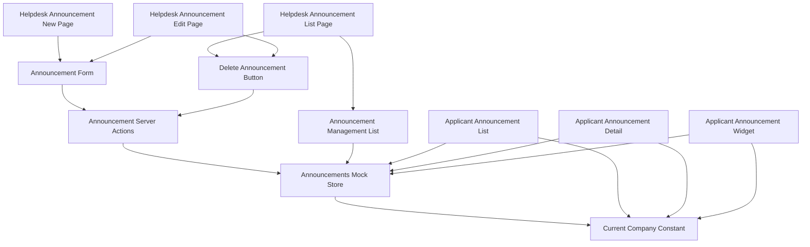
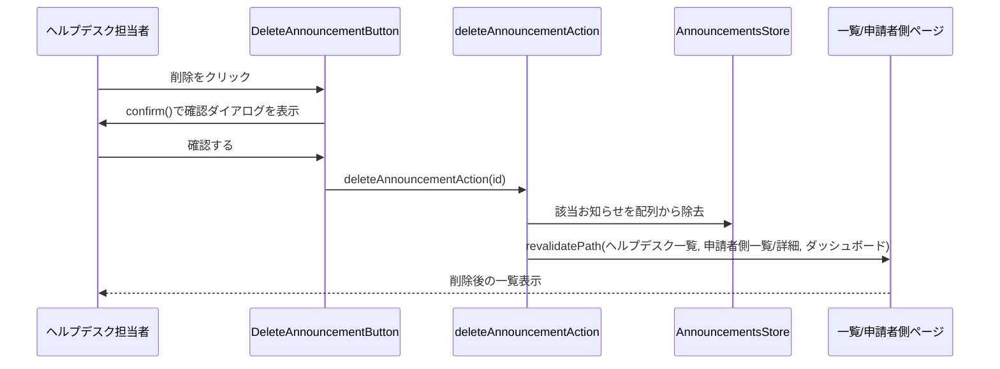
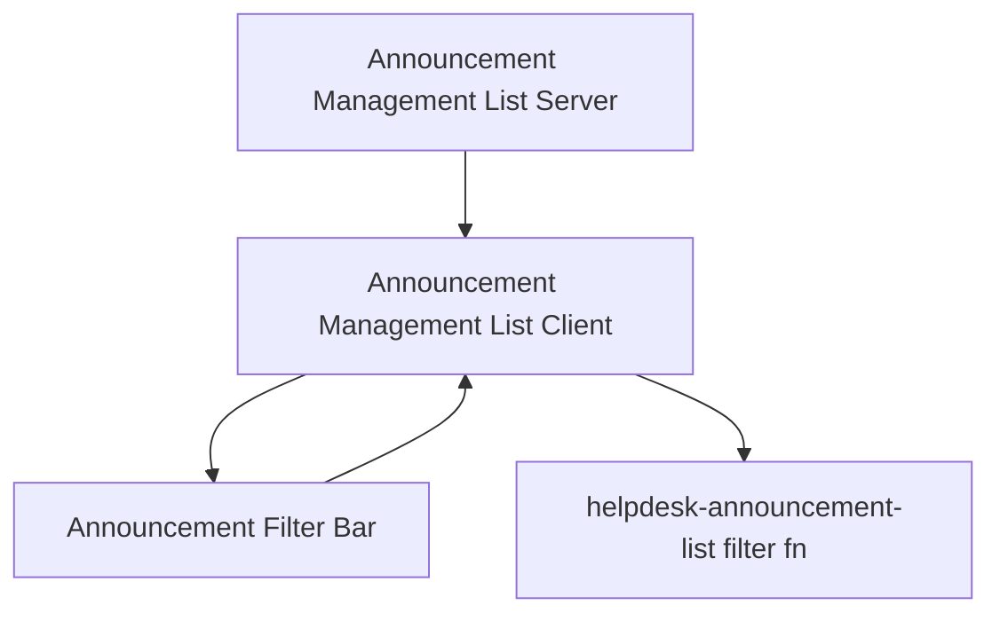

# Technical Design

## Overview
本機能は、既存の`announcements`specが対象外としていたヘルプデスク側のお知らせ作成・編集・削除機能を実装し、あわせてお知らせごとに配信対象（全体一律 or 特定の国・地域）を指定できるようにする。**Purpose**: ヘルプデスク担当者が海外販社向けのお知らせを管理し、関係する販社にのみ的確に情報を届けられるようにする。**Users**: 日本側ヘルプデスク担当者（作成・編集・削除）と海外販社担当者（配信対象に応じてフィルタされた表示）。**Impact**: `Announcement`型に判別可能なユニオン型の`targeting`フィールドを追加し、既存の申請者側読み取り関数（`getAnnouncements`・`getRecentAnnouncements`・`getAnnouncementById`）を自社の国でスコープする。`helpdesk-inquiry-management`specで確立したServer Actions + 共有モックストアのパターンを踏襲する。

### Goals
- ヘルプデスク担当者がお知らせを作成・編集・削除できる
- お知らせごとに配信対象（全体一律 or 特定の国・地域）を指定できる
- 配信対象の指定が申請者側の表示に実際に反映される
- 変更が一覧・詳細・ダッシュボードウィジェットをまたいで一貫して反映される（画面遷移しても状態が残る）

### Non-Goals
- 認証・ロールベースアクセス制御
- お知らせの既読・未読管理
- メール・プッシュ通知等の配信機能
- `helpdesk-inquiry-management`（問い合わせ管理・テンプレート管理）機能自体の変更
- `helpdesk-portal-layout`が確立したルートセグメント・共通レイアウト構造自体の変更

## Boundary Commitments

### This Spec Owns
- `/[locale]/helpdesk/announcements`・`/[locale]/helpdesk/announcements/new`・`/[locale]/helpdesk/announcements/[id]/edit`配下の全ページ
- `Announcement`型への`targeting`フィールドの追加（後方互換な拡張、既存シードデータへの移行含む）
- お知らせの作成・編集・削除のServer Actions・モックAPIミューテーション・バリデーションスキーマ
- 申請者側読み取り関数（`getAnnouncements`・`getRecentAnnouncements`・`getAnnouncementById`）への自社国スコープフィルタの適用
- `src/lib/constants/current-company.ts`（`MOCK_CURRENT_COMPANY`の共有定数化）
- `HelpdeskSidebar`への「お知らせ管理」ナビゲーション項目の追加

### Out of Boundary
- `helpdesk-portal-layout`が所有するルートセグメント構造・`HelpdeskAppShell`・`HelpdeskHeader`自体の変更
- `helpdesk-inquiry-management`が所有する問い合わせ管理・テンプレート管理の画面・Server Actions
- 申請者側の`AnnouncementList`・`AnnouncementDetail`・`AnnouncementWidget`のレイアウト・操作性の変更（参照データ範囲の変更を除く）
- 認証・ロールベースアクセス制御の実装

### Allowed Dependencies
- 既存の`Announcement`型・`ANNOUNCEMENT_CATEGORY_CODES`（フィールド追加のみ、既存フィールドは変更しない）
- 既存の`INQUIRY_COUNTRY_CODES`（配信対象の国選択肢として再利用）
- `helpdesk-inquiry-management`が確立したServer Actions・`getGlobalMockStore`パターン（`src/lib/mock-store.ts`）
- 既存のUIプリミティブ（`Card`, `Button`, `Select`, `Input`, `Textarea`, `Label`）
- `HelpdeskSidebar`（項目追加のみ）

### Revalidation Triggers
- `Announcement`型のフィールド追加・変更（`announcements`・`dashboard`specが再確認する必要がある）
- `MOCK_CURRENT_COMPANY`の参照元変更（`inquiries.ts`・`announcements.ts`の両方が影響を受ける）
- `getAnnouncements`/`getRecentAnnouncements`/`getAnnouncementById`のフィルタ挙動変更（既存の申請者側テストの前提が変わる）

## Architecture

### Existing Architecture Analysis
既存の`announcements`specは、`lib/api/announcements.ts`に読み取り専用のモックAPI（`getAnnouncements`・`getRecentAnnouncements`・`getAnnouncementById`）を持ち、申請者側の`AnnouncementList`・`AnnouncementDetail`・`dashboard`spec所有の`AnnouncementWidget`がこれらを呼び出している。変更系操作は存在しない。`helpdesk-inquiry-management`specにより、Server Actions + `getGlobalMockStore`による`globalThis`共有ストア + zodによるサーバー側バリデーションという変更系操作の標準パターンが確立済み（`research.md`参照）。

### Architecture Pattern & Boundary Map
`helpdesk-inquiry-management`と同一のパターンを踏襲する。



**Architecture Integration**:
- 選択パターン: Server Actions + `globalThis`共有ストア（`helpdesk-inquiry-management`と同一パターン、比較検討は`research.md`参照）
- ドメイン境界: お知らせデータは単一の`AnnouncementsStore`（`lib/api/announcements.ts`が所有する配列）に集約し、ヘルプデスク側（無絞り込み）と申請者側（自社国スコープ）の両方がここから読む
- 既存パターンの維持: フォームは`react-hook-form`+`zod`、ページ構成（一覧→新規作成/編集）は`helpdesk-templates`と同じNext.js App Router構成を踏襲
- 新規コンポーネントの理由: 削除確認・配信対象選択はいずれもクライアント状態境界を持つため独立コンポーネントとして新設する
- Steering準拠: 表示テキストは全て`next-intl`翻訳キー経由、モックAPIは`lib/api/`に抽象化という既存規約を維持

### Technology Stack

| Layer | Choice / Version | Role in Feature | Notes |
|-------|------------------|-----------------|-------|
| Frontend | Next.js App Router（既存, 14.2.35） | ページ構成・Server Actions | `helpdesk-inquiry-management`と同一パターン |
| Forms | react-hook-form + zod（既存） | お知らせ作成・編集フォームのバリデーション | `discriminatedUnion`で配信対象を検証 |
| UI | shadcn/ui（既存） | `Select`（種別・配信対象・国選択）, `Textarea`（本文） | 新規UIプリミティブの追加は不要。削除確認はブラウザ標準`confirm()`を使用（`research.md`参照） |
| Data / Mock | `lib/api/announcements.ts`の可変配列 + `getGlobalMockStore` | お知らせのCRUD状態管理 | フェーズ1限定。開発サーバー再起動でリセットされる |

## File Structure Plan

### Directory Structure
```
src/app/[locale]/helpdesk/announcements/
├── page.tsx                        # 一覧（全件表示・削除導線）
├── new/
│   └── page.tsx                    # 新規作成
└── [id]/
    └── edit/
        └── page.tsx                 # 編集・削除

src/components/features/helpdesk-announcements/
├── AnnouncementManagementList.tsx   # Server: 全件取得・一覧表示
├── AnnouncementForm.tsx             # Client: 新規作成・編集共用フォーム（配信対象選択を含む）
└── DeleteAnnouncementButton.tsx     # Client: confirm()による確認 + 削除アクション呼び出し

src/lib/api/
└── announcements.ts                 # 変更: 自社国スコープフィルタの適用、getAllAnnouncements/getAnnouncementByIdForHelpdesk/create/update/deleteの追加

src/lib/actions/
└── announcements.ts                 # 新規: "use server" Server Actions（create/update/delete）

src/lib/validation/
└── announcement.ts                  # 新規: お知らせフォームのzodスキーマ（配信対象のdiscriminatedUnion含む）

src/lib/constants/
└── current-company.ts               # 新規: MOCK_CURRENT_COMPANYを inquiries.ts から移設

src/types/
└── announcement.ts                  # 変更: `AnnouncementTargeting`判別可能ユニオン型、`Announcement.targeting`フィールドを追加

src/components/layout/
└── HelpdeskSidebar.tsx               # 変更: 「お知らせ管理」ナビゲーション項目を追加

messages/
├── ja.json                          # 変更: helpdeskAnnouncements名前空間、helpdeskNavへのキー追加
└── en.json                          # 同上
```

### Modified Files
- `src/types/announcement.ts` — `AnnouncementTargeting`型・`Announcement.targeting`フィールドを追加（既存フィールドは変更しない）
- `src/lib/api/announcements.ts` — `MOCK_ANNOUNCEMENTS`の全シードデータに`targeting: { scope: "all" }`を付与、`getAnnouncements`/`getRecentAnnouncements`/`getAnnouncementById`を自社国スコープでフィルタ、`getAllAnnouncements`・`getAnnouncementByIdForHelpdesk`・`createAnnouncement`・`updateAnnouncement`・`deleteAnnouncement`を追加
- `src/lib/api/inquiries.ts` — `MOCK_CURRENT_COMPANY`の定義を`lib/constants/current-company.ts`からのimportに置き換える（挙動変更なし）
- `src/components/layout/HelpdeskSidebar.tsx` — `HELPDESK_NAV_ITEMS`に1項目追加
- `messages/ja.json` / `messages/en.json` — 新規名前空間・キーの追加

> 申請者側の`AnnouncementList`・`AnnouncementDetail`・`dashboard`spec所有の`AnnouncementWidget`は変更しない。これらが呼び出す`lib/api/announcements.ts`の関数シグネチャ（引数・戻り値の型）も変更せず、返却データの中身のみが自社国スコープに絞り込まれる。

## System Flows

お知らせの作成・編集・削除はいずれも「Client Component → Server Action → モックストア更新 → revalidatePath」という同一パターンに従う（`helpdesk-inquiry-management`のClaim切り替えフローと同型）ため、代表として削除フローのみ図示する。



- 作成・編集も同様に、Server Action内でzodスキーマ（`announcementFormSchema`）によるサーバー側バリデーションを行った後、モックストアを更新し、影響範囲の全ルート（ヘルプデスク側・申請者側・ダッシュボード）を`revalidatePath`で再検証する。

## Requirements Traceability

| Requirement | Summary | Components | Interfaces | Flows |
|-------------|---------|------------|------------|-------|
| 1.1〜1.6 | ヘルプデスク側お知らせ一覧 | AnnouncementManagementList | AnnouncementsMockApi (Service) | — |
| 2.1〜2.4 | お知らせの新規作成 | AnnouncementForm, AnnouncementActions | Service | 削除フローと同型 |
| 3.1〜3.4 | お知らせの編集 | AnnouncementForm, AnnouncementActions | Service | 削除フローと同型 |
| 4.1〜4.3 | お知らせの削除 | DeleteAnnouncementButton, AnnouncementActions | Service | 削除フロー |
| 5.1〜5.4 | 配信対象の指定 | AnnouncementForm, AnnouncementsMockApi (バリデーション) | Service | — |
| 6.1〜6.3 | 申請者側での配信対象フィルタ | AnnouncementsMockApi（`getAnnouncements`等の変更） | Service | — |
| 7.1〜7.2 | ナビゲーション統合 | HelpdeskSidebar | — | — |
| 8.1〜8.2 | 多言語対応 | 全新規コンポーネント | — | — |
| 9.1 | レスポンシブ対応 | （既存HelpdeskAppShellに依存、新規コンポーネントなし） | — | — |

## Components and Interfaces

| Component | Domain/Layer | Intent | Req Coverage | Key Dependencies (P0/P1) | Contracts |
|-----------|--------------|--------|---------------|---------------------------|-----------|
| AnnouncementManagementList | UI/Server | 全件のお知らせを取得・一覧表示 | 1.1〜1.6 | AnnouncementsMockApi (P0) | State |
| AnnouncementForm | UI/Client | タイトル・本文・種別・配信対象の入力・送信 | 2.1〜2.4, 3.1〜3.4, 5.1〜5.3 | AnnouncementActions (P0) | State |
| DeleteAnnouncementButton | UI/Client | 削除確認・削除アクション呼び出し | 4.1〜4.3 | AnnouncementActions (P0) | State |
| AnnouncementsMockApi（拡張） | Data/Mock | お知らせの読み取り（自社国スコープ/無絞り込み）・CRUD | 1.1, 5.4, 6.1〜6.2 | Announcement型 (P0), CurrentCompany (P0) | Service |
| AnnouncementActions | Server Actions | モックAPIのCRUDを呼び出し、`revalidatePath`で再検証する | 2.3, 3.3, 4.2 | AnnouncementsMockApi (P0) | Service |

### Data / Mock API

#### AnnouncementsMockApi（拡張）

| Field | Detail |
|-------|--------|
| Intent | 申請者側には自社国スコープのお知らせのみを、ヘルプデスク側には全件を提供し、CRUDを行う |
| Requirements | 1.1, 5.4, 6.1, 6.2 |

**Responsibilities & Constraints**
- `getAnnouncements`・`getRecentAnnouncements`・`getAnnouncementById`は、`targeting.scope === "all"`または`targeting.scope === "countries" && targeting.countries.includes(CurrentCompany.country)`を満たすお知らせのみを返す
- `getAllAnnouncements`・`getAnnouncementByIdForHelpdesk`は絞り込みを行わない
- ミューテーション（作成・編集・削除）は`getGlobalMockStore`で保持する配列を直接更新する

**Dependencies**
- Inbound: `AnnouncementActions`（P0）, `AnnouncementList`/`AnnouncementDetail`/`AnnouncementWidget`（既存、P0）, `AnnouncementManagementList`（P0）
- Outbound: `lib/constants/current-company.ts`（P0）

**Contracts**: Service [x]

##### Service Interface
```typescript
interface AnnouncementsMockApiExtension {
  getAllAnnouncements(): Promise<Announcement[]>;
  getAnnouncementByIdForHelpdesk(id: string): Promise<Announcement | null>;
  createAnnouncement(input: CreateAnnouncementInput): Promise<Announcement>;
  updateAnnouncement(id: string, input: CreateAnnouncementInput): Promise<Announcement>;
  deleteAnnouncement(id: string): Promise<void>;
}
```
- Preconditions: `updateAnnouncement`/`deleteAnnouncement`の`id`は存在するお知らせのIDであること
- Postconditions: `createAnnouncement`で作成されたお知らせは、対象国であれば直後の`getAnnouncements`の結果に反映される
- Invariants: `getAnnouncements()`が返す配列は`getAllAnnouncements()`が返す配列の部分集合である

**Implementation Notes**
- Integration: 既存の`getAnnouncements`/`getRecentAnnouncements`/`getAnnouncementById`のシグネチャ（引数・戻り値の型）は変更しない
- Validation: 存在しないIDに対する`updateAnnouncement`/`deleteAnnouncement`はエラーをthrowする
- Risks: プロセス再起動でリセットされる（フェーズ1のモック制約、`helpdesk-inquiry-management`と同様）

### Server Actions

#### AnnouncementActions

| Field | Detail |
|-------|--------|
| Intent | クライアントからのお知らせ作成・編集・削除操作を受け、サーバー側バリデーション・ミューテーション・関連ルートの再検証を行う |
| Requirements | 2.2〜2.3, 3.2〜3.3, 4.2, 5.3 |

**Responsibilities & Constraints**
- 全ての関数に`"use server"`を付与する
- `createAnnouncementAction`・`updateAnnouncementAction`は`announcementFormSchema`（zod）でタイトル・本文・種別・配信対象を検証し、不正な入力は保存せず例外を送出する（`helpdesk-inquiry-management`のHigh指摘を踏まえ、クライアント側バリデーションに加えて必ずサーバー側でも検証する）
- 各操作の最後に、ヘルプデスク側一覧・申請者側一覧・詳細・ダッシュボードルートを`revalidatePath`で再検証する

**Dependencies**
- Inbound: `AnnouncementForm`, `DeleteAnnouncementButton`（いずれもP0）
- Outbound: `AnnouncementsMockApiExtension`（P0）

**Contracts**: Service [x]

##### Service Interface
```typescript
interface AnnouncementActions {
  createAnnouncementAction(
    input: CreateAnnouncementInput
  ): Promise<Announcement>;
  updateAnnouncementAction(
    id: string,
    input: CreateAnnouncementInput
  ): Promise<Announcement>;
  deleteAnnouncementAction(id: string): Promise<void>;
}
```
- Preconditions: `input`はクライアント側で`react-hook-form`+`zod`によりバリデーション済みであること（サーバー側でも同一スキーマで再検証する）
- Postconditions: 成功時、対象ルート群が再検証され、次回アクセス時に最新状態が反映される
- Invariants: バリデーション失敗時はストアを変更しない

**Implementation Notes**
- Integration: `revalidatePath`の対象は`/[locale]/helpdesk/announcements`（page）, `/[locale]/announcements`（page）, `/[locale]/announcements/[id]`（page）, `/[locale]`（page、ダッシュボードの`AnnouncementWidget`用）
- Validation: サーバー側バリデーションはクライアント側と同一の`announcementFormSchema`を再利用する
- Risks: `revalidatePath`の対象漏れがあると一部画面の表示が古いまま残る（`helpdesk-inquiry-management`のMedium指摘と同種のリスク、実装時に全対象を確実に含める）

### Presentation Components（サマリーのみ）

- **AnnouncementManagementList**: `getAllAnnouncements()`を公開日降順で表示し、各行に編集リンクと`DeleteAnnouncementButton`を配置する。既存`TemplateList`と同じ構造パターンを踏襲する。
- **AnnouncementForm**: タイトル・本文・種別（既存カテゴリ）に加え、配信対象の選択（全体一律 or 特定の国・地域）を持つ`react-hook-form`+`zod`フォーム。国選択は複数選択可能なUIとする。新規作成・編集で共用する。
- **DeleteAnnouncementButton**: クリック時に`confirm()`でユーザーに確認し、確認後に`deleteAnnouncementAction`を呼び出す。

## Data Models

### Domain Model
- `Announcement`（既存、拡張）: `targeting: AnnouncementTargeting`を追加。
- `AnnouncementTargeting`（新規）: `{ scope: "all" } | { scope: "countries"; countries: string[] }`の判別可能なユニオン型。

### Logical Data Model
- `Announcement`は単一エンティティ。`targeting`はAnnouncementに埋め込まれた値オブジェクトであり、別エンティティとしての関連は持たない。

### Data Contracts & Integration

| 型 | 主なフィールド | 備考 |
|---|---|---|
| `Announcement`（拡張） | 既存フィールド + `targeting: AnnouncementTargeting` | 既存フィールドは変更なし |
| `AnnouncementTargeting` | `{ scope: "all" }` または `{ scope: "countries", countries: string[] }` | `countries`はISO 3166-1 alpha-2、`INQUIRY_COUNTRY_CODES`のいずれか |
| `CreateAnnouncementInput` | `title`, `body`, `category`, `targeting` | `Announcement`から`id`・`publishedAt`を除いたサブセット（`publishedAt`はサーバー側で保存時刻を採番） |

## Error Handling

### Error Strategy
`helpdesk-inquiry-management`と同様のパターンを踏襲する。Server Componentは取得失敗時にtry/catchでエラーメッセージを表示し、Server Actionsは不正な入力・存在しないIDに対してエラーをthrowし、呼び出し元のクライアントコンポーネントがエラー状態を表示する。

### Error Categories and Responses
- **データ取得失敗**（一覧）: 既存パターンと同様にエラーメッセージを表示
- **存在しないお知らせIDへの編集・削除操作**: Server Actionがエラーをthrowし、クライアント側でエラー表示にフォールバック
- **入力値不正**（タイトル・本文・種別未入力、配信対象の国が0件）: クライアント側`zod`バリデーションで送信をブロックし、フィールド単位のエラーメッセージを表示（要件2.2, 3.2, 5.3）。サーバー側でも同一スキーマで再検証する

### Monitoring
フェーズ1はモックのため、追加のロギング・監視基盤は導入しない。

## Testing Strategy

- **Unit Tests**:
  - `getAnnouncements`/`getRecentAnnouncements`/`getAnnouncementById`が自社国（`CurrentCompany.country`）を含む、または`scope: "all"`のお知らせのみを返すこと
  - `getAllAnnouncements`が絞り込みなしで全件を返すこと
  - `createAnnouncement`/`updateAnnouncement`/`deleteAnnouncement`が対象のお知らせのみを操作し、他のレコードに影響しないこと
  - `announcementFormSchema`がタイトル・本文・種別の未入力、および`scope: "countries"`で0件選択を拒否すること
  - Server Actionsが不正な入力を拒否し、ストアを変更しないこと
- **Integration Tests**:
  - ヘルプデスク側でお知らせを作成後、申請者側の一覧・ダッシュボードウィジェットに反映されること（対象国が一致する場合）
  - 配信対象外の国向けに作成したお知らせが、申請者側の一覧・ダッシュボードウィジェットに表示されないこと
  - 削除後、ヘルプデスク側一覧・申請者側一覧の両方から除去されること
- **E2E/UI Tests**:
  - 日本語・英語両ロケールで一覧・作成・編集画面が表示されること
  - タブレット幅（768px）で新規画面が横スクロールを起こさないこと

## Security Considerations
配信対象フィルタは表示範囲の制御であり、認証・認可の代替ではない。フェーズ1は認証未実装のため、ヘルプデスク側の作成・編集・削除画面は`helpdesk-portal-layout`の前提通り制限なくアクセス可能である。フェーズ3で認証が導入される際、本specのルート境界を変更せずにアクセス制御を追加できることを設計上の前提とする。

---

## 追加ラウンド（2026-07-07）: タイトル・種別・対応要否による検索、対応要否フィールドの追加

### Overview（追加分）
お知らせ管理一覧にタイトル・種別・対応要否による検索・絞り込みを追加し、`Announcement`型に対応要否（`actionRequired`）フィールドを新設して作成・編集フォームで設定できるようにする。**Purpose**: ヘルプデスク担当者が登録件数の増加に対しても目的のお知らせを素早く見つけられるようにし、あわせて販社担当者への「対応要否」の伝達を可能にする。**Impact**: `Announcement`型へのフィールド追加（後方互換）と、`AnnouncementManagementList`のサーバー/クライアント分割。既存の一覧・作成・編集画面のレイアウト・操作性は維持する。

### Boundary Commitments（追加分）

**This Spec Owns（追加）**
- `Announcement.actionRequired: boolean`フィールドの追加、および作成・編集フォームでの設定
- お知らせ管理一覧の検索・絞り込みUI（`AnnouncementFilterBar`、`AnnouncementManagementListClient`、`lib/helpdesk-announcement-list.ts`）

**Out of Boundary（追加）**
- 対応要否バッジの申請者側での表示ロジック（`announcements`spec側で実装、本specは`actionRequired`フィールドの提供のみを担う）
- ダッシュボードの「お知らせ概要ウィジェット」への対応要否バッジの反映（`dashboard`/`dashboard-card-redesign`spec）

**Revalidation Triggers（追加）**
- `Announcement.actionRequired`の型・意味の変更（`announcements`specが再確認する必要がある）

### Architecture（追加分）

既存の「サーバーで全件取得 → クライアントコンポーネントでフィルタ」パターン（`helpdesk-inquiry-management`実績、`research.md`参照）を`AnnouncementManagementList`にも適用する。現状のサーバーコンポーネント1個構成を、データ取得のみを担うサーバーコンポーネントと、フィルタ状態を保持するクライアントコンポーネントに分割する。



**Architecture Integration（追加分）**:
- 選択パターン: `helpdesk-inquiry-management`の`HelpdeskInquiryListClient`/`HelpdeskInquiryFilterBar`と同一パターン（比較検討は`research.md`参照）
- 新規コンポーネントの理由: フィルタ状態はクライアント側の一時状態であり、既存のサーバーコンポーネント（`AnnouncementManagementList`）とは責務が異なるため分離する
- Steering準拠: 表示テキストは全て`next-intl`翻訳キー経由という既存規約を維持

### Technology Stack（追加分・差分のみ）

| Layer | Choice / Version | Role in Feature | Notes |
|-------|------------------|-----------------|-------|
| UI | 既存`Select`（新規プリミティブなし） | `actionRequired`の2択入力・絞り込み | Checkbox/Switchは未導入のため`Select`で表現（`research.md`参照） |

### File Structure Plan（追加分）

```
src/components/features/helpdesk-announcements/
├── AnnouncementManagementList.tsx        # 変更: データ取得のみを担うサーバーコンポーネントに整理
├── AnnouncementManagementListClient.tsx  # 新規: フィルタ状態を保持し一覧を描画するクライアントコンポーネント
├── AnnouncementFilterBar.tsx             # 新規: キーワード・種別・対応要否の絞り込み入力
└── AnnouncementForm.tsx                  # 変更: 対応要否（actionRequired）のSelectフィールドを追加

src/lib/
└── helpdesk-announcement-list.ts         # 新規: HelpdeskAnnouncementFilters型・filterAnnouncementsForHelpdesk関数

src/types/
└── announcement.ts                       # 変更: Announcement.actionRequired: booleanを追加

src/lib/validation/
└── announcement.ts                       # 変更: announcementFormSchemaにactionRequired: z.boolean()を追加

src/lib/api/
└── announcements.ts                      # 変更: シードデータ全件にactionRequiredを付与

messages/
├── ja.json                               # 変更: helpdeskAnnouncements.list.filter, .actionRequiredBadge, .form.actionRequiredフィールドを追加
└── en.json                               # 同上
```

### Modified Files（追加分）
- `src/types/announcement.ts` — `Announcement`に`actionRequired: boolean`を追加（既存フィールドは変更しない）
- `src/lib/validation/announcement.ts` — `announcementFormSchema`に`actionRequired: z.boolean()`を追加
- `src/lib/api/announcements.ts` — `MOCK_ANNOUNCEMENTS`の全シードデータに`actionRequired`（既存データの内容に応じて`true`/`false`）を付与
- `src/components/features/helpdesk-announcements/AnnouncementForm.tsx` — 種別フィールドの直後に対応要否の`Select`（2択）を追加、初期値は新規作成時`false`
- `src/components/features/helpdesk-announcements/AnnouncementManagementList.tsx` — `getAllAnnouncements()`取得とエラー/空状態表示のみを担い、フィルタ済み一覧の描画を`AnnouncementManagementListClient`に委譲

### Requirements Traceability（追加分）

| Requirement | Summary | Components | Interfaces | Flows |
|-------------|---------|------------|------------|-------|
| 10.1〜10.5 | 対応要否フィールドの追加と設定 | AnnouncementForm, Announcement型, AnnouncementManagementListClient | Service | — |
| 11.1〜11.8 | タイトル・種別・対応要否による検索・絞り込み | AnnouncementFilterBar, AnnouncementManagementListClient, filterAnnouncementsForHelpdesk | State | — |

### Components and Interfaces（追加分）

| Component | Domain/Layer | Intent | Req Coverage | Key Dependencies (P0/P1) | Contracts |
|-----------|--------------|--------|---------------|---------------------------|-----------|
| AnnouncementManagementListClient | UI/Client | フィルタ状態を保持し、絞り込み済み一覧を描画 | 11.1〜11.8, 10.4 | filterAnnouncementsForHelpdesk (P0), AnnouncementFilterBar (P0) | State |
| AnnouncementFilterBar | UI/Client | キーワード・種別・対応要否の入力を受け付け、変更を通知 | 11.1〜11.4, 11.6 | — | State |
| filterAnnouncementsForHelpdesk | Lib/Pure Function | キーワード・種別・対応要否のAND条件でお知らせを絞り込む | 11.2〜11.4, 11.8 | — | Service |

#### filterAnnouncementsForHelpdesk

| Field | Detail |
|-------|--------|
| Intent | お知らせ配列をキーワード（タイトル部分一致）・種別・対応要否のAND条件で絞り込む純粋関数 |
| Requirements | 11.2, 11.3, 11.4, 11.8 |

**Responsibilities & Constraints**
- タイトルの部分一致判定は大文字・小文字を区別しない
- 各フィルタ条件が未指定（空文字列 or `undefined`）のときはその条件による絞り込みを行わない
- 入力配列の順序を変更しない（呼び出し側が公開日降順に整列済みであることを前提とする）

**Contracts**: State [x]

##### Service Interface
```typescript
interface HelpdeskAnnouncementFilters {
  keyword: string;
  category: string;
  actionRequired: "" | "true" | "false";
}

function filterAnnouncementsForHelpdesk(
  announcements: Announcement[],
  filters: HelpdeskAnnouncementFilters
): Announcement[];
```
- Preconditions: `announcements`は`getAllAnnouncements()`の戻り値（公開日降順）
- Postconditions: 戻り値は入力配列の部分集合であり、順序を維持する
- Invariants: `filters`が全て空文字列のとき、戻り値は入力配列と等しい

**Implementation Notes**
- Integration: `AnnouncementManagementListClient`が`useMemo`で本関数を呼び出す（`helpdesk-inquiry-management`の`filterInquiriesForHelpdesk`と同型）
- Validation: 型レベルで不正な`actionRequired`値を排除する（`"" | "true" | "false"`のUnion）
- Risks: なし（純粋関数、副作用なし）

### Data Models（追加分）

- `Announcement`（既存、再拡張）: `actionRequired: boolean`を追加。新規作成時の初期値は`false`（要件10.3）
- `CreateAnnouncementInput`は`Announcement`から`id`・`publishedAt`を除いたサブセットのため、`actionRequired`は自動的に含まれる（型定義の変更不要）

### Testing Strategy（追加分）

- **Unit Tests**:
  - `filterAnnouncementsForHelpdesk`がキーワード（部分一致・大小文字無視）・種別・対応要否のAND条件で絞り込むこと、全条件が空のとき全件を返すこと
  - `announcementFormSchema`が`actionRequired`を`boolean`として要求すること
- **Integration Tests**:
  - `AnnouncementManagementListClient`でキーワード・種別・対応要否を入力すると一覧が絞り込まれ、「クリア」で全件表示に戻ること
  - 絞り込み結果が0件のとき「該当するお知らせがありません」が表示されること
  - `AnnouncementForm`で対応要否を「対応が必要」に設定して保存すると、一覧にバッジが表示されること
- **E2E/UI Tests**:
  - 日本語・英語両方でフィルタバーのラベル・バッジ文言が翻訳されること
  - タブレット幅（768px）でフィルタバーが横スクロールを発生させないこと
