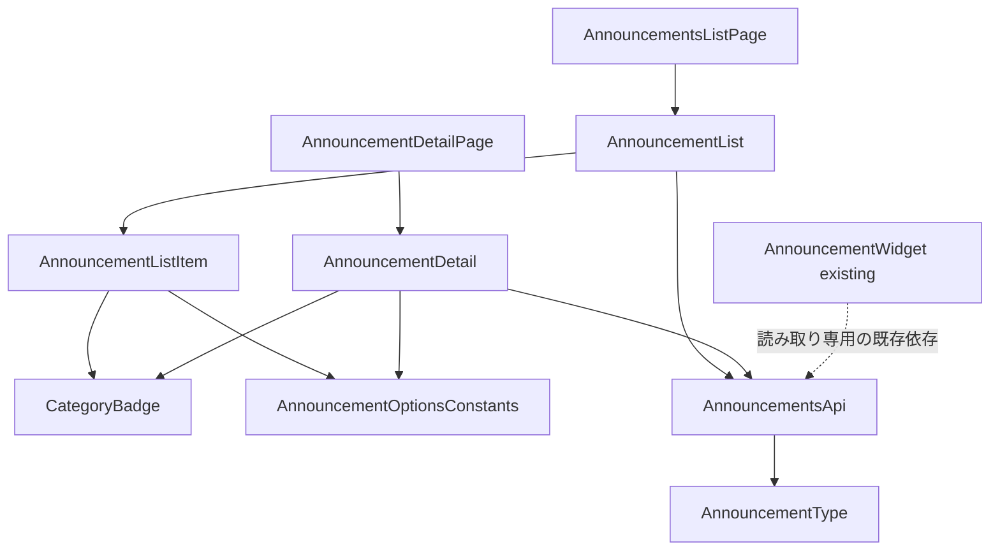
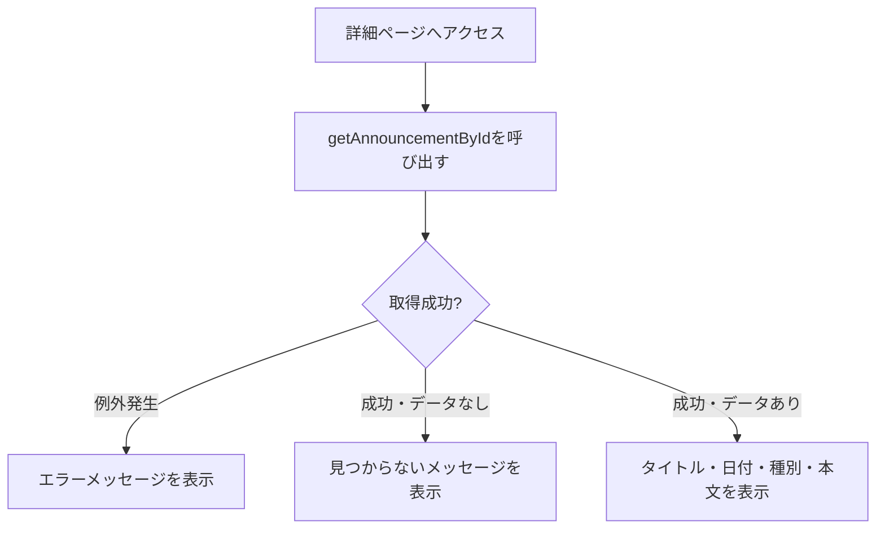
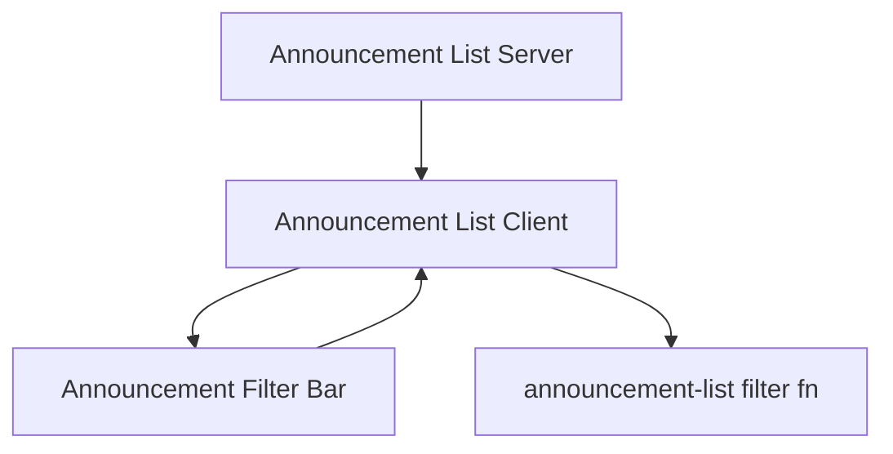
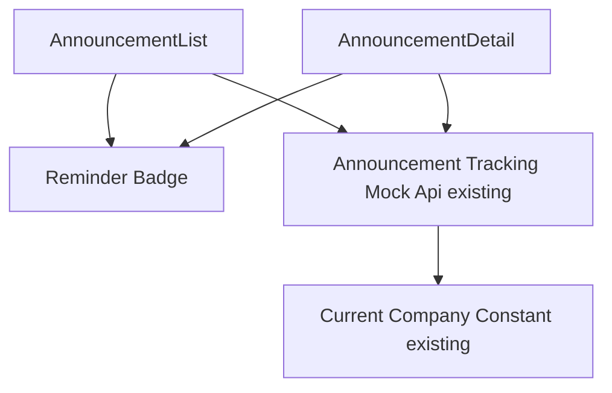

# 技術設計書: announcements

## Overview

**Purpose**: 本機能は、ヘルプデスク担当者からの周知事項を海外販社担当者が一覧・詳細で確認できるお知らせ一覧ページ（`/announcements`）および詳細画面（`/announcements/[id]`）を提供する。

**Users**: 海外販社の担当者が、サイドバーの「お知らせ」ナビゲーションまたはダッシュボードのお知らせ概要ウィジェットから遷移し、周知事項を確認する際に利用する。

**Impact**: 既存の `/announcements` は `PlaceholderPage` を表示しているのみであり、本設計はそれを実際の一覧表示に置き換える。加えて、このリポジトリで初となる動的ルート（`/announcements/[id]`）を追加する。`dashboard` 仕様が実装済みの `AnnouncementWidget`・`getRecentAnnouncements` には後方互換な拡張のみを行い、既存の挙動を変更しない。

### Goals
- お知らせを公開日降順の一覧として表示し、種別（メンテナンス・制度変更・障害情報・その他）を視覚的に区別できる
- 一覧項目から詳細画面へ遷移し、本文を含む詳細情報を確認できる
- `dashboard` 仕様が所有する `AnnouncementWidget`・`getRecentAnnouncements` の型・挙動を変更しない
- 日本語・英語の両言語で一覧・詳細画面が利用できる

### Non-Goals
- ヘルプデスク担当者向けのお知らせ作成・編集・削除機能
- 既読・未読管理（フェーズ1では認証機能が未実装のため対象外）
- メール・プッシュ通知等の配信機能
- お知らせ本文の多言語翻訳（本文自体はヘルプデスクが入力する運用データであり、UI文字列の翻訳とは別軸。フェーズ1のモックデータは日本語のみ）

## Boundary Commitments

### This Spec Owns
- お知らせ一覧ページ（`/announcements`）・詳細ページ（`/announcements/[id]`）のUI
- `Announcement` 型への追加フィールド（`category`・`body`）
- お知らせ種別（`category`）のコード一覧定数
- お知らせ一覧全件取得・詳細単体取得のモック関数（`getAnnouncements`・`getAnnouncementById`）
- お知らせ一覧・詳細関連の翻訳キー（`messages/ja.json` / `en.json` の `announcements` 名前空間）
- 種別バッジ用の新規UIプリミティブ（`components/ui/badge.tsx`）

### Out of Boundary
- `AnnouncementWidget`（ダッシュボードのお知らせ概要ウィジェット、`dashboard` 仕様が所有）。本仕様はこのコンポーネントを変更しない
- `getRecentAnnouncements` の引数・戻り値の型・内部挙動。本仕様はこの関数を一切変更しない（読み取り専用の依存として扱う）
- お知らせの作成・編集・削除、既読管理、通知配信（Non-Goals参照）
- グローバルレイアウト（Header/Sidebar/AppShell/LanguageSwitcher）の変更

### Allowed Dependencies
- `dashboard` 仕様が提供する `AppShell` / ロケールレイアウト（`app/[locale]/layout.tsx`）
- 既存のUI基盤コンポーネント（`card.tsx`・`skeleton.tsx`・`button.tsx`）
- 既存の `next-intl` 設定（`i18n/routing.ts`, `i18n/request.ts`, `middleware.ts`, `i18n/navigation.ts`）
- 既存の `types/announcement.ts`・`lib/api/announcements.ts`（後方互換な拡張のみ）

### Revalidation Triggers
- `Announcement` 型のフィールド形状が変更された場合、`dashboard` 仕様の `AnnouncementWidget` に影響がないか再確認が必要
- `lib/api/announcements.ts` 内のモックデータ配列の並び順・件数を変更する場合、`getRecentAnnouncements` の戻り値（`AnnouncementWidget` が表示する最新3件）が変わらないことを確認する必要がある
- 種別（`category`）の選択肢がヒアリング結果を受けて変更された場合、`lib/constants/announcement-options.ts` と翻訳キーの同時更新が必要

## Architecture

### Existing Architecture Analysis
- `app/[locale]/layout.tsx` が `AppShell` を全ページ共通で提供しており、本機能は `children` として各 `page.tsx` を配置するのみでよい
- `AnnouncementWidget`（`dashboard` 仕様）が確立したパターン——async Server Component が `try/catch` でモックAPI呼び出しを行い、失敗時はエラーメッセージを、成功時は `Card` ベースのリストを表示し、ダッシュボードページ側で `Suspense` + 専用Skeletonコンポーネントで包む——を一覧・詳細の両画面で踏襲する
- `lib/api/` はモック関数を `Promise` で返す規約が確立済み。既存の `getRecentAnnouncements` は変更せず、新規関数を同ファイルに追加する
- UI基盤コンポーネント（`components/ui/`）は shadcn/ui CLIを使わず `forwardRef` + `cn` ベースで手書きされている規約が確立済み。新規追加する `badge.tsx` も同パターンに従う
- 動的ルート（`[id]`）の前例はまだないが、Next.js App Routerの標準機能であり技術的な不確実性はない

### Architecture Pattern & Boundary Map



**Architecture Integration**:
- **Selected pattern**: `AnnouncementWidget` と同じ「async Server Component + `try/catch` + `Suspense`/Skeleton」パターンを一覧・詳細の両画面に適用するコンポジションパターン
- **Domain/feature boundaries**: `types/announcement.ts`（型）→ `lib/constants/announcement-options.ts`（種別コード）→ `lib/api/announcements.ts`（取得）→ `components/features/announcements/*`（UI）→ `app/[locale]/announcements/**/page.tsx`（ルーティング）という一方向の依存関係で責務を分離する
- **Existing patterns preserved**: `AppShell` によるレイアウト共有、`lib/api/` のモック関数規約、`next-intl` 翻訳キー規約、`Suspense` + Skeleton によるローディング表示パターン
- **New components rationale**: `CategoryBadge` は種別を一覧・詳細の両方で一貫した見た目で表示するための共有コンポーネント。既存のUI基盤に種別バッジ相当のものが存在しないため新規追加する
- **Steering compliance**: `structure.md` が想定する `components/features/announcements/` 構成、`lib/api/` でのモック抽象化、翻訳キー経由の文字列管理をすべて満たす

### Technology Stack

| Layer | Choice / Version | Role in Feature | Notes |
|-------|------------------|------------------|-------|
| Frontend | Next.js 14.2 (App Router) + React 18 + TypeScript 5 | 既存スタックを継続利用 | 変更なし。新規の動的ルート（`[id]`）はNext.js標準機能 |
| UIコンポーネント | 手書き shadcn/ui 互換コンポーネント（`components/ui/`） | `badge.tsx` を新規追加、既存の `card`/`skeleton`/`button` を再利用 | 新規外部依存なし |
| 多言語対応 | next-intl（既存） | 一覧・詳細画面の文字列・種別ラベルの翻訳 | 既存基盤を拡張（`announcements` 名前空間を新規追加） |
| データ取得 | モック関数（`lib/api/announcements.ts`） | `getAnnouncements`・`getAnnouncementById` を追加 | 既存の `getRecentAnnouncements` は無変更 |

## File Structure Plan

### Directory Structure
```
src/
├── types/
│   └── announcement.ts                     # Announcement型に category・body を追加（既存フィールドは変更しない）
├── lib/
│   ├── constants/
│   │   └── announcement-options.ts         # 種別(category)コード一覧
│   └── api/
│       └── announcements.ts                # getAnnouncements・getAnnouncementByIdを追加（既存getRecentAnnouncementsは無変更）
├── components/
│   ├── ui/
│   │   └── badge.tsx                       # 新規: 種別バッジ用の汎用コンポーネント
│   └── features/
│       └── announcements/
│           ├── AnnouncementList.tsx        # 一覧取得・表示 + AnnouncementListSkeleton（AnnouncementWidgetと同じ構成パターン）
│           ├── AnnouncementListItem.tsx    # 一覧の1行（タイトル・日付・種別バッジ、詳細への遷移リンク）
│           └── AnnouncementDetail.tsx      # 詳細取得・表示 + AnnouncementDetailSkeleton（見つからない場合の表示を含む）
└── app/[locale]/announcements/
    ├── page.tsx                            # PlaceholderPage呼び出しをAnnouncementList呼び出しに変更
    └── [id]/page.tsx                       # 新規: 詳細ページ（動的ルート）
messages/ja.json, messages/en.json          # announcements 名前空間を新規追加
```

> `AnnouncementList`・`AnnouncementDetail` は、既存の `AnnouncementWidget.tsx` と同様に、本体コンポーネントと対応する `*Skeleton` コンポーネントを同一ファイルからエクスポートするパターンを踏襲する。

### Modified Files
- `src/app/[locale]/announcements/page.tsx` — `PlaceholderPage` の呼び出しを `AnnouncementList`（`Suspense` + `AnnouncementListSkeleton`）の呼び出しに置き換える
- `src/types/announcement.ts` — `Announcement` に `category: AnnouncementCategory` と `body: string` を追加（既存の `id`/`title`/`publishedAt` は変更しない）
- `src/lib/api/announcements.ts` — `getAnnouncements`・`getAnnouncementById` を追加。既存の `getRecentAnnouncements` とモックデータ配列は、要素へのフィールド追加を除き変更しない
- `messages/ja.json` / `messages/en.json` — `announcements` 名前空間（一覧見出し・空/エラーメッセージ・種別ラベル・詳細画面のラベル・戻るリンク・見つからないメッセージ）を追加

## System Flows



**Key Decisions**:
- `getAnnouncementById` は「存在しないID」を例外ではなく `null` の解決で表現する（要件3.3の「見つからない」表示と、通信・実装エラーによる「取得失敗」表示を区別するため）
- 一覧（`AnnouncementList`）は `AnnouncementWidget` と同一の `try/catch` + 空配列チェックパターンのため、個別の図は省略する

## Requirements Traceability

| Requirement | Summary | Components | Interfaces | Flows |
|-------------|---------|------------|------------|-------|
| 1.1–1.3 | 一覧ページへのアクセス・全体構造 | AnnouncementsListPage, AnnouncementList | - | - |
| 2.1–2.4 | 表示順序・状態表示 | AnnouncementList, AnnouncementListItem | GetAnnouncements Service Interface | - |
| 3.1–3.4 | 詳細表示 | AnnouncementDetailPage, AnnouncementDetail | GetAnnouncementById Service Interface | 詳細取得フロー |
| 4.1–4.3 | 種別（category） | CategoryBadge, AnnouncementListItem, AnnouncementDetail | AnnouncementOptionsConstants | - |
| 5.1–5.3 | モックAPI連携 | AnnouncementList, AnnouncementDetail | GetAnnouncements/GetAnnouncementById Service Interfaces | - |
| 6.1–6.3 | 多言語対応 | 全コンポーネント | messages/announcements | - |
| 7.1 | レスポンシブ | AnnouncementList, AnnouncementDetail | - | - |

## Components and Interfaces

| Component | Domain/Layer | Intent | Req Coverage | Key Dependencies (P0/P1) | Contracts |
|-----------|--------------|--------|---------------|---------------------------|-----------|
| AnnouncementList | Feature | 一覧取得・ローディング/エラー/空状態・表示を統括 | 1, 2, 5 | GetAnnouncements (P0), AnnouncementListItem (P1) | Service, State |
| AnnouncementListItem | Feature (UI) | 1件分のタイトル・日付・種別バッジ・詳細リンク表示 | 1.2, 2.1, 4.1 | CategoryBadge (P1) | - |
| AnnouncementDetail | Feature | 詳細取得・見つからない/エラー状態・本文表示を統括 | 3, 4, 5 | GetAnnouncementById (P0), CategoryBadge (P1) | Service, State |
| CategoryBadge | UI Primitive | 種別コードに応じた配色でバッジ表示 | 4.1, 4.2 | - | - |

### Feature Layer

#### AnnouncementList

| Field | Detail |
|-------|--------|
| Intent | お知らせ全件を取得し、公開日降順で一覧表示する。ローディング・エラー・空状態を管理する |
| Requirements | 1.1, 1.2, 2.1, 2.2, 2.3, 2.4, 5.1 |

**Responsibilities & Constraints**
- async Server Componentとして実装し、`getAnnouncements()` を `try/catch` で呼び出す（`AnnouncementWidget` と同じエラーハンドリング規約）
- 取得結果が空配列の場合、専用の空状態メッセージを表示する
- 呼び出し元（`page.tsx`）から `Suspense` でラップされ、フォールバックとして同ファイルの `AnnouncementListSkeleton` が使われることを前提とする

**Dependencies**
- Outbound: `getAnnouncements`（モックAPI） — 一覧データ取得 (P0)
- Outbound: `AnnouncementListItem` — 1件ごとの表示 (P1)

**Contracts**: Service [x] / API [ ] / Event [ ] / Batch [ ] / State [x]

##### Service Interface
```typescript
function getAnnouncements(): Promise<Announcement[]>;
```
- Preconditions: なし
- Postconditions: `publishedAt` の降順に並んだ全件の `Announcement` 配列を解決する。取得件数の上限は設けない（フェーズ1のモック件数を前提とするため、ページネーションは対象外）
- Invariants: `getRecentAnnouncements` が参照するモックデータ配列と同一のデータソースを参照するが、内部実装・並び順は独立して保証する

##### State Management
- State model: サーバーコンポーネントのため、クライアント側の状態は持たない。ローディング状態は `Suspense` の境界がRSCのレンダリング完了までフォールバックを表示することで表現する
- Persistence & consistency: フェーズ1ではクライアントに状態を保持しない（画面遷移ごとに再取得）

**Implementation Notes**
- Integration: `getRecentAnnouncements` とは別関数として `lib/api/announcements.ts` に追加し、既存関数のコード・挙動を変更しない
- Validation: 該当なし（読み取り専用の一覧表示）
- Risks: モックデータ配列の要素数が増えた場合の表示崩れ（想定件数は少数のため、フェーズ1では対象外とする）

#### AnnouncementListItem

新しい境界（ロジック・外部結合）を持たないプレゼンテーション層のコンポーネントであり、サマリー行の記載で十分とする。

**Implementation Notes**
- Integration: `AnnouncementList` から1件分の `Announcement` を props として受け取り、`CategoryBadge` と組み合わせて表示する。タイトル部分は `next-intl` の `Link` コンポーネント経由で詳細ページ（`/announcements/[id]`）へのリンクとする
- Validation: 該当なし
- Risks: なし

#### AnnouncementDetail

| Field | Detail |
|-------|--------|
| Intent | 指定されたIDのお知らせを取得し、見つからない・エラー・成功の3状態を管理して詳細を表示する |
| Requirements | 3.1, 3.2, 3.3, 3.4, 4.1, 4.2, 5.1, 5.3 |

**Responsibilities & Constraints**
- async Server Componentとして実装し、`getAnnouncementById(id)` を `try/catch` で呼び出す
- 戻り値が `null` の場合は「見つからない」メッセージを、例外発生時は「取得失敗」メッセージを、それぞれ区別して表示する
- 一覧ページへ戻るリンクを常に表示する

**Dependencies**
- Outbound: `getAnnouncementById`（モックAPI） — 単体データ取得 (P0)
- Outbound: `CategoryBadge` — 種別表示 (P1)

**Contracts**: Service [x] / API [ ] / Event [ ] / Batch [ ] / State [x]

##### Service Interface
```typescript
function getAnnouncementById(id: string): Promise<Announcement | null>;
```
- Preconditions: `id` は文字列であること（型レベルでのみ保証。存在チェックは関数内部で行う）
- Postconditions: 該当する `Announcement` が存在する場合はそれを解決し、存在しない場合は `null` を解決する。実装上の例外（想定外エラー）はrejectする
- Invariants: `getRecentAnnouncements`・`getAnnouncements` と同一のデータソースを参照する

##### State Management
- State model: `AnnouncementList` と同様、サーバーコンポーネントのためクライアント状態は持たない
- Persistence & consistency: フェーズ1ではクライアントに状態を保持しない

**Implementation Notes**
- Integration: 動的ルートパラメータ（`params.id`）を `app/[locale]/announcements/[id]/page.tsx` から受け取り、`AnnouncementDetail` に渡す
- Validation: 該当なし（読み取り専用の詳細表示）
- Risks: `null` とrejectの区別を実装で誤ると、要件3.3（見つからない）と一般的なエラー表示が混同される。テストで両方のケースを明示的に検証する

### UI Primitive Layer

#### CategoryBadge

| Field | Detail |
|-------|--------|
| Intent | お知らせの種別コードに応じて配色を切り替えるバッジ表示コンポーネント |
| Requirements | 4.1, 4.2 |

**Responsibilities & Constraints**
- 種別コード（`AnnouncementCategory`）を受け取り、対応する表示ラベル（翻訳済み文字列、呼び出し側が解決して渡す）と配色を適用する
- 配色は既存のCSS変数トークン（`--accent`/`--secondary`/`--destructive`/`--muted`）を再利用し、新規トークンを追加しない（`incident` は `destructive`、`policy` は `secondary`、`maintenance` は `accent`、`other` は `muted`）

**Dependencies**
- なし（`cn` ヘルパーのみ使用）

**Contracts**: Service [ ] / API [ ] / Event [ ] / Batch [ ] / State [ ]

**Implementation Notes**
- Integration: `category` propと表示ラベル（`label` prop、翻訳済み文字列）を受け取るシンプルなプレゼンテーションコンポーネントとする
- Validation: 該当なし
- Risks: なし

## Data Models

### Domain Model
- **Announcement**（拡張）: お知らせ1件を表す集約。既存の `id`/`title`/`publishedAt` に加え、`category`（種別）・`body`（本文）を追加する。本仕様は読み取りのみを扱い、作成・更新のドメインロジックは持たない
- **AnnouncementCategory**: お知らせの種別を表す列挙（`"maintenance" | "policy" | "incident" | "other"`）。ヒアリング後に選択肢が変更される前提の仮値

### Logical Data Model

| フィールド | 型 | 必須 | 備考 |
|---|---|---|---|
| `id` | `string` | ✓ | 既存フィールド（変更なし） |
| `title` | `string` | ✓ | 既存フィールド（変更なし） |
| `publishedAt` | `string`（ISO 8601） | ✓ | 既存フィールド（変更なし） |
| `category` | `AnnouncementCategory` | ✓（新規） | `lib/constants/announcement-options.ts` のコード一覧から選択 |
| `body` | `string` | ✓（新規） | 複数行の本文（フェーズ1はプレーンテキスト、Markdown等のリッチテキストは対象外） |

### Data Contracts & Integration

**モックAPI契約**
- `getAnnouncements(): Promise<Announcement[]>` — 全件を `publishedAt` 降順で返す
- `getAnnouncementById(id: string): Promise<Announcement | null>` — 該当データがなければ `null` を返す
- 既存の `getRecentAnnouncements(options?: { limit?: number }): Promise<Announcement[]>` — 型・挙動ともに変更しない

## Error Handling

### Error Strategy
- **一覧取得失敗**: `AnnouncementList` 内の `try/catch` でエラーメッセージ（翻訳キー経由）を表示する（`AnnouncementWidget` と同一パターン）
- **詳細取得失敗**: `AnnouncementDetail` 内の `try/catch` で「取得失敗」メッセージを表示する
- **詳細が見つからない**: `getAnnouncementById` が `null` を返した場合、`AnnouncementDetail` は「取得失敗」とは異なる「見つからない」メッセージを表示する（要件3.3）

### Error Categories and Responses
- **System Errors**: モックAPI呼び出しの例外 → 一覧・詳細それぞれのエラーメッセージ表示
- **Not Found**: 存在しないID → 「見つからない」メッセージ + 一覧へ戻るリンク

### Monitoring
- フェーズ1ではモックAPIのためサーバーサイド監視は対象外。既存パターンと同様、ブラウザコンソールへのエラーログ出力のみで十分とする

## Testing Strategy

- **Unit Tests**: `getAnnouncements`（降順ソート・全件返却）・`getAnnouncementById`（存在するID/存在しないID/データ形状）の挙動検証
- **Integration Tests**: `AnnouncementList` の空状態・エラー状態の表示切り替え、`AnnouncementDetail` の見つからない状態とエラー状態の区別
- **E2E/UI Tests**: 一覧から詳細への遷移、存在しないIDへの直接アクセス時の表示、日英切り替え時の種別ラベル切り替え、タブレット幅での表示崩れ確認

## Security Considerations
- お知らせの本文（`body`）はヘルプデスク側が入力する運用データであり、フェーズ1ではモックデータのみを扱う。表示時はReactの標準エスケープに依拠し、`dangerouslySetInnerHTML` を使用しない

---

## 追加ラウンド（2026-07-07）: タイトル・種別による検索、対応要否の表示

### Overview（追加分）
お知らせ一覧にタイトル・種別による検索・絞り込みを追加し、`announcements-management`specが追加する`Announcement.actionRequired`フィールドを一覧・詳細画面にバッジ表示する。**Purpose**: 件数増加に伴う目的のお知らせの探しにくさを解消し、対応の要否をひと目で判断できるようにする。**Impact**: `AnnouncementList`をサーバー取得専用コンポーネントとクライアント側フィルタコンポーネントに分割する。既存のCard/Skeleton構成・レイアウトは変更しない。

### Boundary Commitments（追加分）

**This Spec Owns（追加）**
- お知らせ一覧の検索・絞り込みUI（`AnnouncementFilterBar`、`AnnouncementListClient`、`src/lib/announcement-list.ts`）
- 一覧・詳細画面での対応要否（`actionRequired`）バッジの表示ロジック（読み取りのみ）

**Out of Boundary（追加）**
- `Announcement.actionRequired`フィールド自体の追加、作成・編集フォームでの設定操作（`announcements-management`spec側で実装、本specは読み取り専用で参照する）
- ダッシュボードの「お知らせ概要ウィジェット」への対応要否バッジ・検索機能の反映（`dashboard`/`dashboard-card-redesign`spec）

**Allowed Dependencies（追加）**
- `announcements-management`specが追加する`Announcement.actionRequired: boolean`フィールド（読み取り専用）

**Revalidation Triggers（追加）**
- `Announcement.actionRequired`の型・意味の変更（`announcements-management`specの変更に追従する必要がある）

### Architecture（追加分）

`announcements-management`specが確立する「サーバーで全件取得 → クライアントコンポーネントでフィルタ」パターンを、申請者側の`AnnouncementList`にも適用する。フィルタ型・フィルタ関数は画面・spec境界に沿って申請者側専用に実装し、ヘルプデスク側とは共有しない（`research.md`の設計判断参照）。



**Architecture Integration（追加分）**:
- 選択パターン: `announcements-management`の`AnnouncementManagementListClient`/`AnnouncementFilterBar`と同型（比較検討・境界分離の理由は`research.md`参照）
- 新規コンポーネントの理由: フィルタ状態はクライアント側の一時状態であり、既存のサーバーコンポーネント（`AnnouncementList`）とは責務が異なるため分離する
- Steering準拠: 表示テキストは全て`next-intl`翻訳キー経由という既存規約を維持

### File Structure Plan（追加分）

```
src/components/features/announcements/
├── AnnouncementList.tsx        # 変更: データ取得のみを担うサーバーコンポーネントに整理
├── AnnouncementListClient.tsx  # 新規: フィルタ状態を保持し一覧を描画するクライアントコンポーネント
├── AnnouncementFilterBar.tsx   # 新規: キーワード・種別・対応要否の絞り込み入力（申請者側専用）
├── AnnouncementListItem.tsx    # 変更: actionRequiredバッジを追加
└── AnnouncementDetail.tsx      # 変更: actionRequiredバッジを追加

src/lib/
└── announcement-list.ts        # 新規: AnnouncementFilters型・filterAnnouncements関数（申請者側専用）

messages/
├── ja.json                     # 変更: announcements.list.filter, .actionRequiredBadgeキーを追加
└── en.json                     # 同上
```

### Modified Files（追加分）
- `src/components/features/announcements/AnnouncementList.tsx` — `getAnnouncements()`取得とエラー/空状態表示のみを担い、一覧描画を`AnnouncementListClient`に委譲
- `src/components/features/announcements/AnnouncementListItem.tsx` — `announcement.actionRequired`が真のときのみ「対応が必要」バッジを種別バッジの隣に表示
- `src/components/features/announcements/AnnouncementDetail.tsx` — 同上のバッジを種別表示の隣に表示

### Requirements Traceability（追加分）

| Requirement | Summary | Components | Interfaces | Flows |
|-------------|---------|------------|------------|-------|
| 8.1〜8.8 | タイトル・種別による検索・絞り込み | AnnouncementFilterBar, AnnouncementListClient, filterAnnouncements | State | — |
| 9.1〜9.5 | 対応要否の表示 | AnnouncementListItem, AnnouncementDetail, AnnouncementListClient | — | — |

### Components and Interfaces（追加分）

| Component | Domain/Layer | Intent | Req Coverage | Key Dependencies (P0/P1) | Contracts |
|-----------|--------------|--------|---------------|---------------------------|-----------|
| AnnouncementListClient | UI/Client | フィルタ状態を保持し、絞り込み済み一覧を描画 | 8.1〜8.8, 9.4 | filterAnnouncements (P0), AnnouncementFilterBar (P0) | State |
| AnnouncementFilterBar | UI/Client | キーワード・種別・対応要否の入力を受け付け、変更を通知 | 8.1〜8.4, 8.6, 9.4 | — | State |
| filterAnnouncements | Lib/Pure Function | キーワード・種別・対応要否のAND条件でお知らせを絞り込む | 8.2〜8.4, 8.8, 9.4 | — | Service |

#### filterAnnouncements

| Field | Detail |
|-------|--------|
| Intent | お知らせ配列をキーワード（タイトル部分一致）・種別・対応要否のAND条件で絞り込む純粋関数 |
| Requirements | 8.2, 8.3, 8.4, 8.8, 9.4 |

**Responsibilities & Constraints**
- タイトルの部分一致判定は大文字・小文字を区別しない
- 各フィルタ条件が未指定（空文字列）のときはその条件による絞り込みを行わない
- 入力配列の順序（公開日降順）を変更しない

**Contracts**: State [x]

##### Service Interface
```typescript
interface AnnouncementFilters {
  keyword: string;
  category: string;
  actionRequired: "" | "true";
}

function filterAnnouncements(
  announcements: Announcement[],
  filters: AnnouncementFilters
): Announcement[];
```
- Preconditions: `announcements`は`getAnnouncements()`の戻り値（公開日降順、自社配信対象でフィルタ済み）
- Postconditions: 戻り値は入力配列の部分集合であり、順序を維持する
- Invariants: `filters`が全て空文字列のとき、戻り値は入力配列と等しい

**Implementation Notes**
- Integration: `AnnouncementListClient`が`useMemo`で本関数を呼び出す。`announcements-management`spec所有の`filterAnnouncementsForHelpdesk`とは実装を共有しない（`research.md`の境界分離判断を参照）。`actionRequired`は申請者側では「対応が必要なもののみ表示」の単一トグルのため`"" | "true"`の2値とし、ヘルプデスク側の3値（`"" | "true" | "false"`）とは型を分ける
- Validation: 該当なし（読み取り専用フィルタ）
- Risks: なし（純粋関数、副作用なし）

### Data Models（追加分）

- `Announcement`（`announcements-management`spec側で拡張済みの型を読み取り専用で参照）: `actionRequired: boolean`が追加される。本specはこのフィールドの型定義・初期値・設定ロジックを一切変更しない

### Testing Strategy（追加分）

- **Unit Tests**:
  - `filterAnnouncements`がキーワード（部分一致・大小文字無視）・種別・対応要否のAND条件で絞り込むこと、全条件が空のとき全件を返すこと
- **Integration Tests**:
  - `AnnouncementListClient`でキーワード・種別・対応要否を入力すると一覧が絞り込まれ、「クリア」で全件表示に戻ること
  - 絞り込み結果が0件のとき「該当するお知らせがありません」が表示されること
  - `actionRequired`が`true`のお知らせにのみ一覧・詳細でバッジが表示されること
- **E2E/UI Tests**:
  - 日本語・英語両方でフィルタバーのラベル・バッジ文言が翻訳されること
  - タブレット幅（768px）でフィルタバーが横スクロールを発生させないこと

## 追加ラウンド（2026-07-08）: 見出し（h1 + 説明文）の統一

### Overview（追加分）
お知らせ一覧ページに、`links`/`faq` specが既に採用している`h1`＋説明文の見出しパターンを適用する。新規翻訳キーは追加せず、既存の`announcements.list.title`/`announcements.list.description`をそのまま使用する。

### Modified Files（追加分）
- `src/components/features/announcements/AnnouncementList.tsx` — `LinkList.tsx`/`FaqList.tsx`と同じ`heading`要素（`<div className="mb-6"><h1 className="text-2xl font-semibold text-foreground">...</h1><p className="mt-1 text-sm text-muted-foreground">...</p></div>`）を定義し、既存の`Card`の外側・上部に配置する。エラー時・空データ時の各早期returnにも同じ`heading`を含める

### Requirements Traceability（追加分）
| Requirement | Summary | Components |
|-------------|---------|------------|
| 10.1〜10.4 | h1＋説明文の見出し統一 | AnnouncementList |

---

## 追加ラウンド（2026-07-08）: リマインド受信表示

### Overview（追加分）
`announcements-management`spec側で追加される、担当者ごとの確認済み・実施済み・リマインド送信状態（モック）を読み取り、自社（`MOCK_CURRENT_COMPANY`）宛に未対応のままリマインドが送信されているお知らせについて、一覧・詳細画面にリマインド受信の表示を追加する。**Purpose**: 販社担当者が、ヘルプデスクからリマインドが届いている＝対応の優先度が高いお知らせを見分けられるようにする。**Impact**: `AnnouncementList`・`AnnouncementDetail`が`announcements-management`spec所有の読み取り専用API（`isReminderPendingForCompany`）を呼び出す点を除き、既存のレイアウト・操作性・データ取得の型は変更しない。

### Goals（追加分）
- 自社宛に未対応のリマインドが送信されているお知らせを、一覧・詳細画面で視覚的に区別できる
- 対応が完了している場合はリマインド表示を行わない

### Non-Goals（追加分）
- 確認済み・実施済み人数や未対応者一覧の表示（ヘルプデスク限定。`announcements-management`spec側の対象）
- 実際のメール・プッシュ通知配信

### Boundary Commitments（追加分）

**This Spec Owns（追加）**
- お知らせ一覧・詳細画面におけるリマインド受信バッジ・表示のUI

**Out of Boundary（追加）**
- リマインド送信状態（`AnnouncementRecipientStatus`）のデータ・算出ロジック自体（`announcements-management`specが所有。本specは`isReminderPendingForCompany`を読み取り専用で呼び出すのみ）
- 確認済み・実施済み人数の算出・表示（対象外。要件6参照）

**Allowed Dependencies（追加）**
- `announcements-management`spec所有の`isReminderPendingForCompany(announcementId, companyCode)`（`lib/api/announcement-tracking.ts`、読み取り専用）
- 既存の`MOCK_CURRENT_COMPANY`（`lib/constants/current-company.ts`）

**Revalidation Triggers（追加）**
- `isReminderPendingForCompany`の関数シグネチャ・戻り値の意味が変更された場合、本specの表示ロジックを再確認する必要がある

### Architecture（追加分）

`AnnouncementList`・`AnnouncementDetail`（いずれもServer Component）が、お知らせ取得時に`isReminderPendingForCompany(announcement.id, MOCK_CURRENT_COMPANY.companyCode)`を追加で呼び出し、結果を各行・詳細画面に渡す。表示は既存の`CategoryBadge`と同系統の新規`ReminderBadge`で行う。



**Architecture Integration（追加分）**:
- 選択パターン: 既存の`CategoryBadge`/`ActionRequiredBadge`と同じ「値に応じてバッジ表示を出し分ける」パターンを踏襲する
- ドメイン境界: リマインド送信状態のデータ・算出は`announcements-management`spec側に留め、本specは真偽値の読み取り結果のみを扱う（データを直接参照・加工しない）
- 新規コンポーネントの理由: リマインド受信表示は種別・対応要否とは異なる文脈の情報であり、既存バッジと視覚的に区別するため独立コンポーネントとする
- Steering準拠: 表示テキストは`next-intl`翻訳キー経由という既存規約を維持

### Technology Stack（追加分・差分のみ）
新規の技術要素なし（既存のUIプリミティブ・モックAPI呼び出しパターンのみを使用）。

### File Structure Plan（追加分）

```
src/components/features/announcements/
├── ReminderBadge.tsx                # 新規: リマインド受信を示すバッジ（Badgeプリミティブを利用）
├── AnnouncementList.tsx             # 変更: 各行についてisReminderPendingForCompanyを取得しReminderBadgeを表示
└── AnnouncementDetail.tsx           # 変更: 詳細画面にReminderBadgeを表示

messages/
├── ja.json                          # 変更: announcements.reminderBadge名前空間を追加
└── en.json                          # 同上
```

### Modified Files（追加分）
- `src/components/features/announcements/AnnouncementList.tsx` — 一覧取得時に各お知らせへ`isReminderPendingForCompany`を並行して呼び出し、`true`の項目に`ReminderBadge`を表示
- `src/components/features/announcements/AnnouncementDetail.tsx` — 詳細取得時に同様の判定を行い、`true`のとき`ReminderBadge`を表示

### Requirements Traceability（追加分）

| Requirement | Summary | Components | Interfaces |
|-------------|---------|------------|------------|
| 11.1〜11.5 | リマインド受信表示 | ReminderBadge, AnnouncementList, AnnouncementDetail | Service（`isReminderPendingForCompany`読み取り） |

### Components and Interfaces（追加分）

| Component | Domain/Layer | Intent | Req Coverage | Key Dependencies (P0/P1) | Contracts |
|-----------|--------------|--------|---------------|---------------------------|-----------|
| ReminderBadge | UI/Presentational | リマインド受信中であることを示すバッジを表示 | 11.1, 11.2 | Badgeプリミティブ（P0） | — |

**Presentation Components（サマリーのみ）**
- **ReminderBadge**: `isReminderPendingForCompany`が`true`の場合のみ表示するプレゼンテーショナルコンポーネント。propsは`{ isPending: boolean }`のみを受け取り、状態算出ロジックを持たない。

### Data Models（追加分）
本specはデータモデルを追加しない。`announcements-management`spec所有の`isReminderPendingForCompany(announcementId: string, companyCode: string): Promise<boolean>`を読み取り専用で参照する。

### Testing Strategy（追加分）

- **Unit Tests**:
  - `ReminderBadge`が`isPending: true`のときのみバッジを描画すること
- **Integration Tests**:
  - 自社宛に未対応のリマインドがあるお知らせについて、一覧・詳細の両方で`ReminderBadge`が表示されること
  - 対応が完了している（`completedAt`が設定されている）場合、`ReminderBadge`が表示されないこと
- **E2E/UI Tests**:
  - 日本語・英語両方でリマインド受信表示の文言が翻訳されること

---

## 追加ラウンド（2026-07-08）: 対応期限の表示・公開期間による表示制御

### Overview（追加分）
`announcements-management`spec側で追加される`Announcement.dueDate`（対応期限）・`publishStartDate`/`publishEndDate`（公開期間）を参照し、対応期限を一覧・詳細画面に表示する。公開期間による表示制御自体は`announcements-management`spec側の`getAnnouncements`/`getRecentAnnouncements`/`getAnnouncementById`（既存の可視性判定関数）に実装されるため、本specは追加のフィルタ処理を実装しない（既存の呼び出しのままで期間外のお知らせは戻り値に含まれなくなる）。**Purpose**: 販社担当者が対応期限を把握できるようにし、期限切れ・未公開の周知に惑わされないようにする。**Impact**: `AnnouncementListItem`・`AnnouncementDetail`に対応期限表示を追加する点を除き、既存のデータ取得・レイアウト・操作性は変更しない。

### Goals（追加分）
- 対応が必要なお知らせについて、対応期限が設定されていれば一覧・詳細画面に表示する
- 公開期間外のお知らせが表示されなくなる（データ層の変更のみで実現し、本spec側のロジック追加は不要）

### Non-Goals（追加分）
- 対応期限フィールド自体の追加、作成・編集フォームでの設定操作（`announcements-management`spec側で実装）
- 公開期間フィルタの算出ロジック自体（`announcements-management`spec側の`getAnnouncements`等に実装。本specは戻り値をそのまま利用するのみ）

### Boundary Commitments（追加分）

**This Spec Owns（追加）**
- お知らせ一覧・詳細画面における対応期限のラベル・表示UI

**Out of Boundary（追加）**
- `Announcement.dueDate`/`publishStartDate`/`publishEndDate`の型定義・バリデーション・算出ロジック（`announcements-management`spec所有）

**Allowed Dependencies（追加）**
- `announcements-management`spec側で拡張される`Announcement.dueDate`（読み取りのみ）

**Revalidation Triggers（追加）**
- `Announcement.dueDate`のフィールド名・型が変更された場合

### Architecture（追加分）
新規コンポーネント・新規フローは発生しない。既存の`AnnouncementListItem`・`AnnouncementDetail`が、既に受け取っている`announcement`オブジェクトから`dueDate`を読み取り、`actionRequired`が真かつ`dueDate`が設定されている場合のみ表示する。公開期間フィルタは`getAnnouncements`等の戻り値が変わるだけであり、本spec側のコンポーネントに変更は不要。

### Technology Stack（追加分・差分のみ）
追加・変更なし。

### File Structure Plan（追加分）
新規ファイルなし。

### Modified Files（追加分）
- `src/components/features/announcements/AnnouncementListItem.tsx` — `actionRequired`が真かつ`dueDate`が設定されている場合、対応期限を表示するテキストを追加
- `src/components/features/announcements/AnnouncementDetail.tsx` — 同様に詳細画面へ対応期限表示を追加
- `messages/ja.json` / `messages/en.json` — `announcements.dueDateLabel`翻訳キーを追加

### Requirements Traceability（追加分）

| Requirement | Summary | Components | Interfaces |
|-------------|---------|------------|------------|
| 12.1〜12.4 | 対応期限の表示 | AnnouncementListItem, AnnouncementDetail | — |
| 13.1〜13.4 | 公開期間による表示制御 | （データ層のみ、`announcements-management`spec所有） | — |

### Components and Interfaces（追加分）
新規コンポーネントなし。`AnnouncementListItem`・`AnnouncementDetail`に表示分岐を追加するのみ（`Announcement.dueDate`はいずれも既存propsの`announcement`経由で取得済みのため、propsの追加は不要）。

### Data Models（追加分）
本specはデータモデルを追加しない。`announcements-management`spec所有の`Announcement.dueDate: string | null`を読み取り専用で参照する。

### Testing Strategy（追加分）

- **Unit Tests**:
  - `AnnouncementListItem`/`AnnouncementDetail`が、`actionRequired: true`かつ`dueDate`設定時のみ対応期限を表示すること
  - `actionRequired: false`または`dueDate`が`null`のとき対応期限を表示しないこと
- **Integration Tests**:
  - 公開期間外のお知らせIDを直接指定した場合、詳細画面が「見つかりません」表示になること
- **E2E/UI Tests**:
  - 日本語・英語両方で対応期限ラベルが翻訳されること
