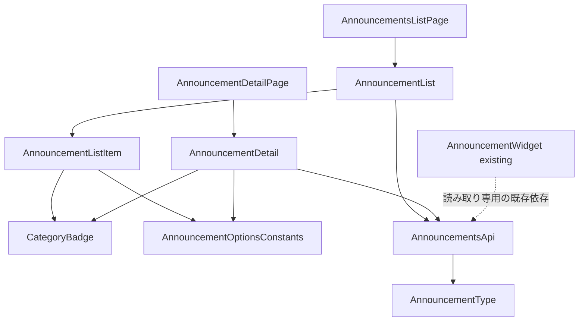
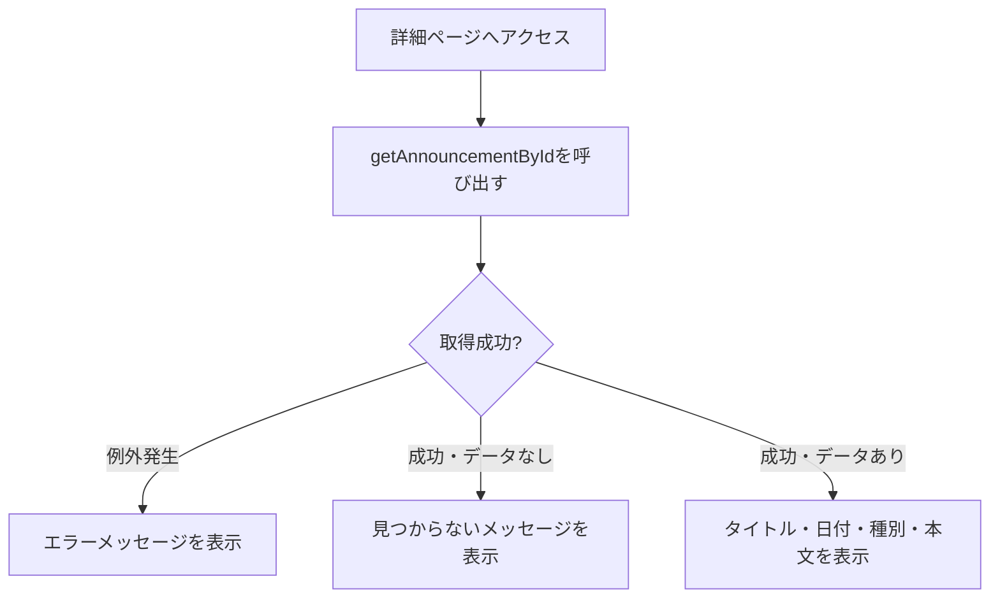

# 技術設計書: announcements

## Overview

**Purpose**: 本機能は、ヘルプデスク担当者からの周知事項を海外販社担当者が一覧・詳細で確認できるお知らせ一覧ページ（`/announcements`）および詳細画面（`/announcements/[id]`）を提供する。

**Users**: 海外販社の担当者が、サイドバーの「お知らせ」ナビゲーションまたはダッシュボードのお知らせ概要ウィジェットから遷移し、周知事項を確認する際に利用する。

**Impact**: 既存の `/announcements` は `PlaceholderPage` を表示しているのみであり、本設計はそれを実際の一覧表示に置き換える。加えて、このリポジトリで初となる動的ルート（`/announcements/[id]`）を追加する。`dashboard` 仕様が実装済みの `AnnouncementWidget`・`getRecentAnnouncements` には後方互換な拡張のみを行い、既存の挙動を変更しない。

### Goals
- お知らせを公開日降順の一覧として表示し、種別（メンテナンス・制度変更・障害情報・その他）を視覚的に区別できる
- 一覧項目から詳細画面へ遷移し、本文を含む詳細情報を確認できる
- `dashboard` 仕様が所有する `AnnouncementWidget`・`getRecentAnnouncements` の型・挙動を変更しない
- 日本語・英語の両言語で一覧・詳細画面が利用できる

### Non-Goals
- ヘルプデスク担当者向けのお知らせ作成・編集・削除機能
- 既読・未読管理（フェーズ1では認証機能が未実装のため対象外）
- メール・プッシュ通知等の配信機能
- お知らせ本文の多言語翻訳（本文自体はヘルプデスクが入力する運用データであり、UI文字列の翻訳とは別軸。フェーズ1のモックデータは日本語のみ）

## Boundary Commitments

### This Spec Owns
- お知らせ一覧ページ（`/announcements`）・詳細ページ（`/announcements/[id]`）のUI
- `Announcement` 型への追加フィールド（`category`・`body`）
- お知らせ種別（`category`）のコード一覧定数
- お知らせ一覧全件取得・詳細単体取得のモック関数（`getAnnouncements`・`getAnnouncementById`）
- お知らせ一覧・詳細関連の翻訳キー（`messages/ja.json` / `en.json` の `announcements` 名前空間）
- 種別バッジ用の新規UIプリミティブ（`components/ui/badge.tsx`）

### Out of Boundary
- `AnnouncementWidget`（ダッシュボードのお知らせ概要ウィジェット、`dashboard` 仕様が所有）。本仕様はこのコンポーネントを変更しない
- `getRecentAnnouncements` の引数・戻り値の型・内部挙動。本仕様はこの関数を一切変更しない（読み取り専用の依存として扱う）
- お知らせの作成・編集・削除、既読管理、通知配信（Non-Goals参照）
- グローバルレイアウト（Header/Sidebar/AppShell/LanguageSwitcher）の変更

### Allowed Dependencies
- `dashboard` 仕様が提供する `AppShell` / ロケールレイアウト（`app/[locale]/layout.tsx`）
- 既存のUI基盤コンポーネント（`card.tsx`・`skeleton.tsx`・`button.tsx`）
- 既存の `next-intl` 設定（`i18n/routing.ts`, `i18n/request.ts`, `middleware.ts`, `i18n/navigation.ts`）
- 既存の `types/announcement.ts`・`lib/api/announcements.ts`（後方互換な拡張のみ）

### Revalidation Triggers
- `Announcement` 型のフィールド形状が変更された場合、`dashboard` 仕様の `AnnouncementWidget` に影響がないか再確認が必要
- `lib/api/announcements.ts` 内のモックデータ配列の並び順・件数を変更する場合、`getRecentAnnouncements` の戻り値（`AnnouncementWidget` が表示する最新3件）が変わらないことを確認する必要がある
- 種別（`category`）の選択肢がヒアリング結果を受けて変更された場合、`lib/constants/announcement-options.ts` と翻訳キーの同時更新が必要

## Architecture

### Existing Architecture Analysis
- `app/[locale]/layout.tsx` が `AppShell` を全ページ共通で提供しており、本機能は `children` として各 `page.tsx` を配置するのみでよい
- `AnnouncementWidget`（`dashboard` 仕様）が確立したパターン——async Server Component が `try/catch` でモックAPI呼び出しを行い、失敗時はエラーメッセージを、成功時は `Card` ベースのリストを表示し、ダッシュボードページ側で `Suspense` + 専用Skeletonコンポーネントで包む——を一覧・詳細の両画面で踏襲する
- `lib/api/` はモック関数を `Promise` で返す規約が確立済み。既存の `getRecentAnnouncements` は変更せず、新規関数を同ファイルに追加する
- UI基盤コンポーネント（`components/ui/`）は shadcn/ui CLIを使わず `forwardRef` + `cn` ベースで手書きされている規約が確立済み。新規追加する `badge.tsx` も同パターンに従う
- 動的ルート（`[id]`）の前例はまだないが、Next.js App Routerの標準機能であり技術的な不確実性はない

### Architecture Pattern & Boundary Map



**Architecture Integration**:
- **Selected pattern**: `AnnouncementWidget` と同じ「async Server Component + `try/catch` + `Suspense`/Skeleton」パターンを一覧・詳細の両画面に適用するコンポジションパターン
- **Domain/feature boundaries**: `types/announcement.ts`（型）→ `lib/constants/announcement-options.ts`（種別コード）→ `lib/api/announcements.ts`（取得）→ `components/features/announcements/*`（UI）→ `app/[locale]/announcements/**/page.tsx`（ルーティング）という一方向の依存関係で責務を分離する
- **Existing patterns preserved**: `AppShell` によるレイアウト共有、`lib/api/` のモック関数規約、`next-intl` 翻訳キー規約、`Suspense` + Skeleton によるローディング表示パターン
- **New components rationale**: `CategoryBadge` は種別を一覧・詳細の両方で一貫した見た目で表示するための共有コンポーネント。既存のUI基盤に種別バッジ相当のものが存在しないため新規追加する
- **Steering compliance**: `structure.md` が想定する `components/features/announcements/` 構成、`lib/api/` でのモック抽象化、翻訳キー経由の文字列管理をすべて満たす

### Technology Stack

| Layer | Choice / Version | Role in Feature | Notes |
|-------|------------------|------------------|-------|
| Frontend | Next.js 14.2 (App Router) + React 18 + TypeScript 5 | 既存スタックを継続利用 | 変更なし。新規の動的ルート（`[id]`）はNext.js標準機能 |
| UIコンポーネント | 手書き shadcn/ui 互換コンポーネント（`components/ui/`） | `badge.tsx` を新規追加、既存の `card`/`skeleton`/`button` を再利用 | 新規外部依存なし |
| 多言語対応 | next-intl（既存） | 一覧・詳細画面の文字列・種別ラベルの翻訳 | 既存基盤を拡張（`announcements` 名前空間を新規追加） |
| データ取得 | モック関数（`lib/api/announcements.ts`） | `getAnnouncements`・`getAnnouncementById` を追加 | 既存の `getRecentAnnouncements` は無変更 |

## File Structure Plan

### Directory Structure
```
src/
├── types/
│   └── announcement.ts                     # Announcement型に category・body を追加（既存フィールドは変更しない）
├── lib/
│   ├── constants/
│   │   └── announcement-options.ts         # 種別(category)コード一覧
│   └── api/
│       └── announcements.ts                # getAnnouncements・getAnnouncementByIdを追加（既存getRecentAnnouncementsは無変更）
├── components/
│   ├── ui/
│   │   └── badge.tsx                       # 新規: 種別バッジ用の汎用コンポーネント
│   └── features/
│       └── announcements/
│           ├── AnnouncementList.tsx        # 一覧取得・表示 + AnnouncementListSkeleton（AnnouncementWidgetと同じ構成パターン）
│           ├── AnnouncementListItem.tsx    # 一覧の1行（タイトル・日付・種別バッジ、詳細への遷移リンク）
│           └── AnnouncementDetail.tsx      # 詳細取得・表示 + AnnouncementDetailSkeleton（見つからない場合の表示を含む）
└── app/[locale]/announcements/
    ├── page.tsx                            # PlaceholderPage呼び出しをAnnouncementList呼び出しに変更
    └── [id]/page.tsx                       # 新規: 詳細ページ（動的ルート）
messages/ja.json, messages/en.json          # announcements 名前空間を新規追加
```

> `AnnouncementList`・`AnnouncementDetail` は、既存の `AnnouncementWidget.tsx` と同様に、本体コンポーネントと対応する `*Skeleton` コンポーネントを同一ファイルからエクスポートするパターンを踏襲する。

### Modified Files
- `src/app/[locale]/announcements/page.tsx` — `PlaceholderPage` の呼び出しを `AnnouncementList`（`Suspense` + `AnnouncementListSkeleton`）の呼び出しに置き換える
- `src/types/announcement.ts` — `Announcement` に `category: AnnouncementCategory` と `body: string` を追加（既存の `id`/`title`/`publishedAt` は変更しない）
- `src/lib/api/announcements.ts` — `getAnnouncements`・`getAnnouncementById` を追加。既存の `getRecentAnnouncements` とモックデータ配列は、要素へのフィールド追加を除き変更しない
- `messages/ja.json` / `messages/en.json` — `announcements` 名前空間（一覧見出し・空/エラーメッセージ・種別ラベル・詳細画面のラベル・戻るリンク・見つからないメッセージ）を追加

## System Flows



**Key Decisions**:
- `getAnnouncementById` は「存在しないID」を例外ではなく `null` の解決で表現する（要件3.3の「見つからない」表示と、通信・実装エラーによる「取得失敗」表示を区別するため）
- 一覧（`AnnouncementList`）は `AnnouncementWidget` と同一の `try/catch` + 空配列チェックパターンのため、個別の図は省略する

## Requirements Traceability

| Requirement | Summary | Components | Interfaces | Flows |
|-------------|---------|------------|------------|-------|
| 1.1–1.3 | 一覧ページへのアクセス・全体構造 | AnnouncementsListPage, AnnouncementList | - | - |
| 2.1–2.4 | 表示順序・状態表示 | AnnouncementList, AnnouncementListItem | GetAnnouncements Service Interface | - |
| 3.1–3.4 | 詳細表示 | AnnouncementDetailPage, AnnouncementDetail | GetAnnouncementById Service Interface | 詳細取得フロー |
| 4.1–4.3 | 種別（category） | CategoryBadge, AnnouncementListItem, AnnouncementDetail | AnnouncementOptionsConstants | - |
| 5.1–5.3 | モックAPI連携 | AnnouncementList, AnnouncementDetail | GetAnnouncements/GetAnnouncementById Service Interfaces | - |
| 6.1–6.3 | 多言語対応 | 全コンポーネント | messages/announcements | - |
| 7.1 | レスポンシブ | AnnouncementList, AnnouncementDetail | - | - |

## Components and Interfaces

| Component | Domain/Layer | Intent | Req Coverage | Key Dependencies (P0/P1) | Contracts |
|-----------|--------------|--------|---------------|---------------------------|-----------|
| AnnouncementList | Feature | 一覧取得・ローディング/エラー/空状態・表示を統括 | 1, 2, 5 | GetAnnouncements (P0), AnnouncementListItem (P1) | Service, State |
| AnnouncementListItem | Feature (UI) | 1件分のタイトル・日付・種別バッジ・詳細リンク表示 | 1.2, 2.1, 4.1 | CategoryBadge (P1) | - |
| AnnouncementDetail | Feature | 詳細取得・見つからない/エラー状態・本文表示を統括 | 3, 4, 5 | GetAnnouncementById (P0), CategoryBadge (P1) | Service, State |
| CategoryBadge | UI Primitive | 種別コードに応じた配色でバッジ表示 | 4.1, 4.2 | - | - |

### Feature Layer

#### AnnouncementList

| Field | Detail |
|-------|--------|
| Intent | お知らせ全件を取得し、公開日降順で一覧表示する。ローディング・エラー・空状態を管理する |
| Requirements | 1.1, 1.2, 2.1, 2.2, 2.3, 2.4, 5.1 |

**Responsibilities & Constraints**
- async Server Componentとして実装し、`getAnnouncements()` を `try/catch` で呼び出す（`AnnouncementWidget` と同じエラーハンドリング規約）
- 取得結果が空配列の場合、専用の空状態メッセージを表示する
- 呼び出し元（`page.tsx`）から `Suspense` でラップされ、フォールバックとして同ファイルの `AnnouncementListSkeleton` が使われることを前提とする

**Dependencies**
- Outbound: `getAnnouncements`（モックAPI） — 一覧データ取得 (P0)
- Outbound: `AnnouncementListItem` — 1件ごとの表示 (P1)

**Contracts**: Service [x] / API [ ] / Event [ ] / Batch [ ] / State [x]

##### Service Interface
```typescript
function getAnnouncements(): Promise<Announcement[]>;
```
- Preconditions: なし
- Postconditions: `publishedAt` の降順に並んだ全件の `Announcement` 配列を解決する。取得件数の上限は設けない（フェーズ1のモック件数を前提とするため、ページネーションは対象外）
- Invariants: `getRecentAnnouncements` が参照するモックデータ配列と同一のデータソースを参照するが、内部実装・並び順は独立して保証する

##### State Management
- State model: サーバーコンポーネントのため、クライアント側の状態は持たない。ローディング状態は `Suspense` の境界がRSCのレンダリング完了までフォールバックを表示することで表現する
- Persistence & consistency: フェーズ1ではクライアントに状態を保持しない（画面遷移ごとに再取得）

**Implementation Notes**
- Integration: `getRecentAnnouncements` とは別関数として `lib/api/announcements.ts` に追加し、既存関数のコード・挙動を変更しない
- Validation: 該当なし（読み取り専用の一覧表示）
- Risks: モックデータ配列の要素数が増えた場合の表示崩れ（想定件数は少数のため、フェーズ1では対象外とする）

#### AnnouncementListItem

新しい境界（ロジック・外部結合）を持たないプレゼンテーション層のコンポーネントであり、サマリー行の記載で十分とする。

**Implementation Notes**
- Integration: `AnnouncementList` から1件分の `Announcement` を props として受け取り、`CategoryBadge` と組み合わせて表示する。タイトル部分は `next-intl` の `Link` コンポーネント経由で詳細ページ（`/announcements/[id]`）へのリンクとする
- Validation: 該当なし
- Risks: なし

#### AnnouncementDetail

| Field | Detail |
|-------|--------|
| Intent | 指定されたIDのお知らせを取得し、見つからない・エラー・成功の3状態を管理して詳細を表示する |
| Requirements | 3.1, 3.2, 3.3, 3.4, 4.1, 4.2, 5.1, 5.3 |

**Responsibilities & Constraints**
- async Server Componentとして実装し、`getAnnouncementById(id)` を `try/catch` で呼び出す
- 戻り値が `null` の場合は「見つからない」メッセージを、例外発生時は「取得失敗」メッセージを、それぞれ区別して表示する
- 一覧ページへ戻るリンクを常に表示する

**Dependencies**
- Outbound: `getAnnouncementById`（モックAPI） — 単体データ取得 (P0)
- Outbound: `CategoryBadge` — 種別表示 (P1)

**Contracts**: Service [x] / API [ ] / Event [ ] / Batch [ ] / State [x]

##### Service Interface
```typescript
function getAnnouncementById(id: string): Promise<Announcement | null>;
```
- Preconditions: `id` は文字列であること（型レベルでのみ保証。存在チェックは関数内部で行う）
- Postconditions: 該当する `Announcement` が存在する場合はそれを解決し、存在しない場合は `null` を解決する。実装上の例外（想定外エラー）はrejectする
- Invariants: `getRecentAnnouncements`・`getAnnouncements` と同一のデータソースを参照する

##### State Management
- State model: `AnnouncementList` と同様、サーバーコンポーネントのためクライアント状態は持たない
- Persistence & consistency: フェーズ1ではクライアントに状態を保持しない

**Implementation Notes**
- Integration: 動的ルートパラメータ（`params.id`）を `app/[locale]/announcements/[id]/page.tsx` から受け取り、`AnnouncementDetail` に渡す
- Validation: 該当なし（読み取り専用の詳細表示）
- Risks: `null` とrejectの区別を実装で誤ると、要件3.3（見つからない）と一般的なエラー表示が混同される。テストで両方のケースを明示的に検証する

### UI Primitive Layer

#### CategoryBadge

| Field | Detail |
|-------|--------|
| Intent | お知らせの種別コードに応じて配色を切り替えるバッジ表示コンポーネント |
| Requirements | 4.1, 4.2 |

**Responsibilities & Constraints**
- 種別コード（`AnnouncementCategory`）を受け取り、対応する表示ラベル（翻訳済み文字列、呼び出し側が解決して渡す）と配色を適用する
- 配色は既存のCSS変数トークン（`--accent`/`--secondary`/`--destructive`/`--muted`）を再利用し、新規トークンを追加しない（`incident` は `destructive`、`policy` は `secondary`、`maintenance` は `accent`、`other` は `muted`）

**Dependencies**
- なし（`cn` ヘルパーのみ使用）

**Contracts**: Service [ ] / API [ ] / Event [ ] / Batch [ ] / State [ ]

**Implementation Notes**
- Integration: `category` propと表示ラベル（`label` prop、翻訳済み文字列）を受け取るシンプルなプレゼンテーションコンポーネントとする
- Validation: 該当なし
- Risks: なし

## Data Models

### Domain Model
- **Announcement**（拡張）: お知らせ1件を表す集約。既存の `id`/`title`/`publishedAt` に加え、`category`（種別）・`body`（本文）を追加する。本仕様は読み取りのみを扱い、作成・更新のドメインロジックは持たない
- **AnnouncementCategory**: お知らせの種別を表す列挙（`"maintenance" | "policy" | "incident" | "other"`）。ヒアリング後に選択肢が変更される前提の仮値

### Logical Data Model

| フィールド | 型 | 必須 | 備考 |
|---|---|---|---|
| `id` | `string` | ✓ | 既存フィールド（変更なし） |
| `title` | `string` | ✓ | 既存フィールド（変更なし） |
| `publishedAt` | `string`（ISO 8601） | ✓ | 既存フィールド（変更なし） |
| `category` | `AnnouncementCategory` | ✓（新規） | `lib/constants/announcement-options.ts` のコード一覧から選択 |
| `body` | `string` | ✓（新規） | 複数行の本文（フェーズ1はプレーンテキスト、Markdown等のリッチテキストは対象外） |

### Data Contracts & Integration

**モックAPI契約**
- `getAnnouncements(): Promise<Announcement[]>` — 全件を `publishedAt` 降順で返す
- `getAnnouncementById(id: string): Promise<Announcement | null>` — 該当データがなければ `null` を返す
- 既存の `getRecentAnnouncements(options?: { limit?: number }): Promise<Announcement[]>` — 型・挙動ともに変更しない

## Error Handling

### Error Strategy
- **一覧取得失敗**: `AnnouncementList` 内の `try/catch` でエラーメッセージ（翻訳キー経由）を表示する（`AnnouncementWidget` と同一パターン）
- **詳細取得失敗**: `AnnouncementDetail` 内の `try/catch` で「取得失敗」メッセージを表示する
- **詳細が見つからない**: `getAnnouncementById` が `null` を返した場合、`AnnouncementDetail` は「取得失敗」とは異なる「見つからない」メッセージを表示する（要件3.3）

### Error Categories and Responses
- **System Errors**: モックAPI呼び出しの例外 → 一覧・詳細それぞれのエラーメッセージ表示
- **Not Found**: 存在しないID → 「見つからない」メッセージ + 一覧へ戻るリンク

### Monitoring
- フェーズ1ではモックAPIのためサーバーサイド監視は対象外。既存パターンと同様、ブラウザコンソールへのエラーログ出力のみで十分とする

## Testing Strategy

- **Unit Tests**: `getAnnouncements`（降順ソート・全件返却）・`getAnnouncementById`（存在するID/存在しないID/データ形状）の挙動検証
- **Integration Tests**: `AnnouncementList` の空状態・エラー状態の表示切り替え、`AnnouncementDetail` の見つからない状態とエラー状態の区別
- **E2E/UI Tests**: 一覧から詳細への遷移、存在しないIDへの直接アクセス時の表示、日英切り替え時の種別ラベル切り替え、タブレット幅での表示崩れ確認

## Security Considerations
- お知らせの本文（`body`）はヘルプデスク側が入力する運用データであり、フェーズ1ではモックデータのみを扱う。表示時はReactの標準エスケープに依拠し、`dangerouslySetInnerHTML` を使用しない
