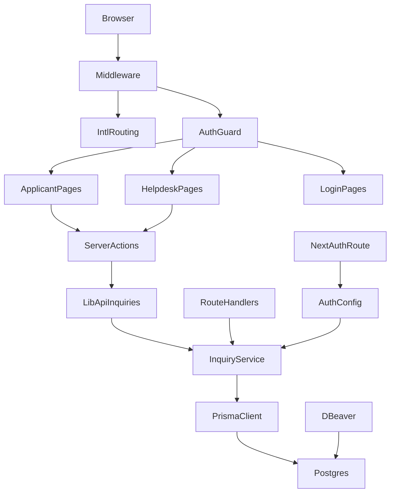
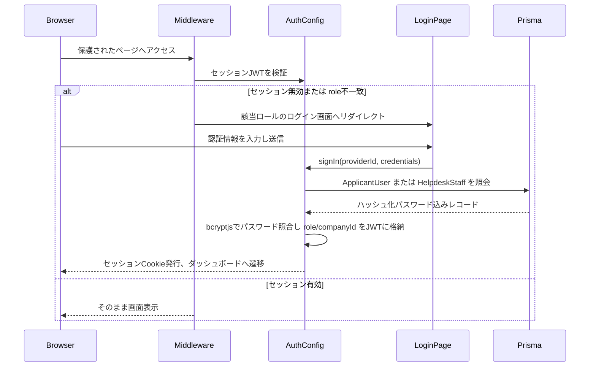
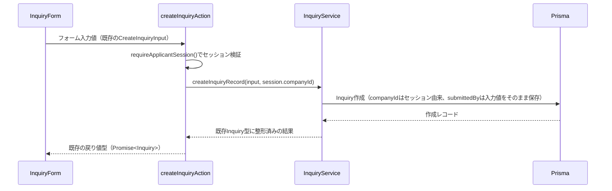
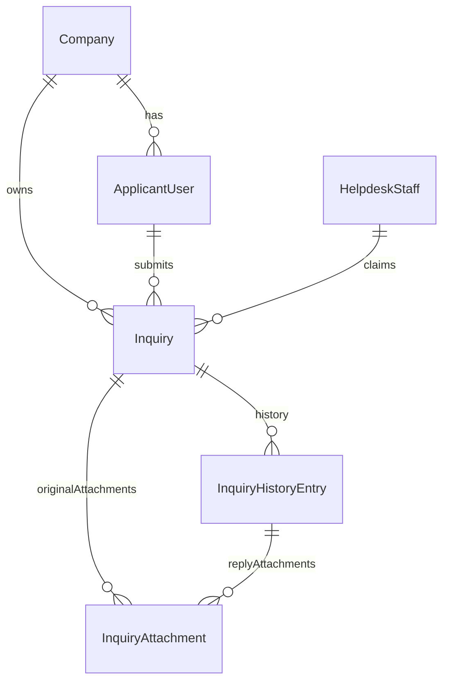
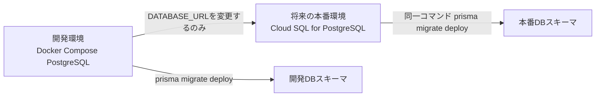
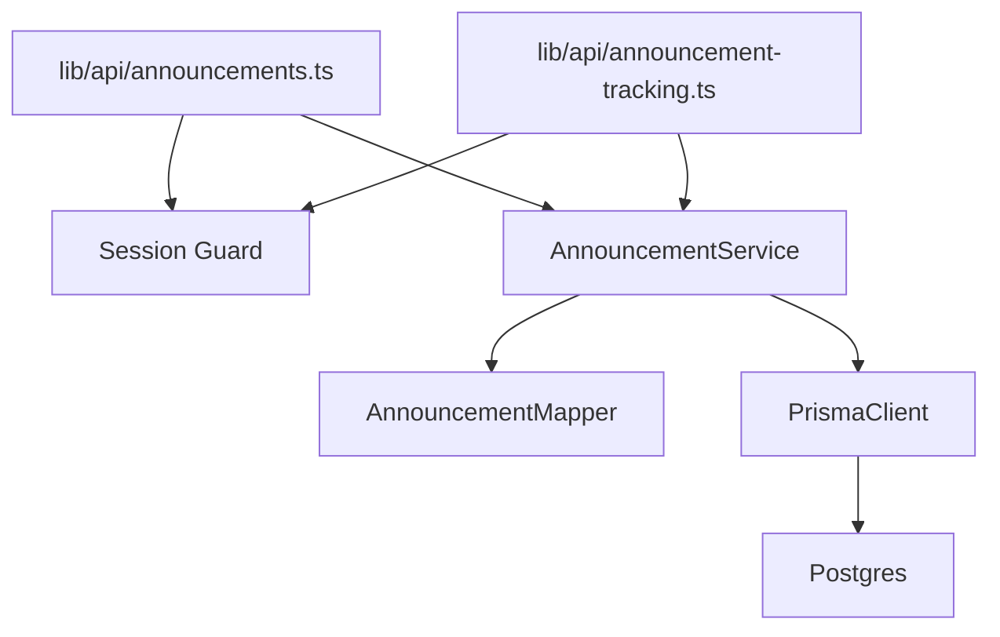
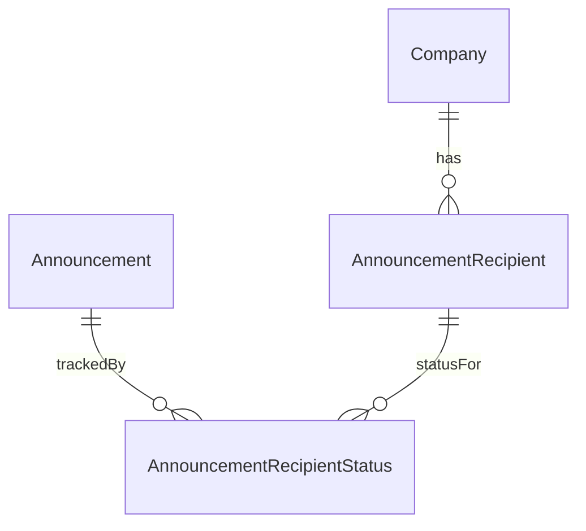
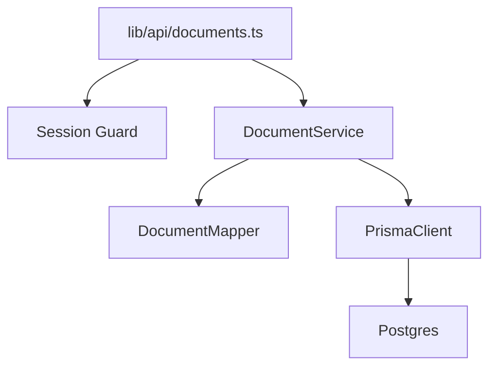

# 技術設計書

## Overview

**Purpose**: 本機能は、フェーズ1でモックAPI・固定値（`MOCK_CURRENT_COMPANY`・`MOCK_CURRENT_STAFF_NAME`・インメモリストア）に依存していたヘルプデスクポータルの問い合わせ・申請領域に、開発環境で実際に稼働するバックエンド（Next.js Route Handlers）・DB（PostgreSQL、Prisma管理）・認証機能（申請者側企業ユーザー、ヘルプデスク担当者）を提供する。

**Users**: 販社担当者（申請者側）はログインして自社の問い合わせ・申請の送信・確認を行い、ヘルプデスク担当者はログインして全社の問い合わせに対応する。開発者はDocker Composeで起動したPostgreSQLをDBeaverで確認しながら開発する。

**Impact**: 現状「認証なしで全ページに到達でき、問い合わせデータはプロセスメモリ上の配列」という状態から、「ログインが前提となり、問い合わせデータはPostgreSQLに永続化される」状態へ変更する。既存のUIコンポーネントの見た目・操作性は変更しないが、`InquiryForm.tsx`の呼び出し先（1箇所のimport）と、ヘルプデスク側のルーティング構造（ログイン画面追加のための層分け）は変更する。

### Goals
- 開発環境でDocker Compose上のPostgreSQLを起動し、DBeaverで内容を確認できるようにする
- Prismaでスキーマ・マイグレーションを管理し、本番環境（Cloud SQL for PostgreSQL）へ接続文字列の変更のみで拡張できるようにする
- 申請者側企業ユーザー・ヘルプデスク担当者の認証を導入し、問い合わせデータへのアクセスをセッションベースで制御する
- 問い合わせ・申請領域（`inquiry-form`・`inquiry-list`・`helpdesk-inquiry-management`）のモックAPIをPrisma経由の実DBアクセスに置き換える。既存の関数シグネチャ・UIコンポーネントの見た目・操作性は維持する

### Non-Goals
- announcements・documents・faq・links-pageドメインの実DB化（将来別spec）
- 自由記述の翻訳処理（Google Cloud Translation API連携）
- 添付ファイルの外部ストレージ・CDN化（本specではDBにデータとして保持する）
- 本番環境（Cloud SQL）への実際のプロビジョニング・デプロイ実行
- パスワードリセット・サインアップ（ユーザー登録）画面

## Boundary Commitments

### This Spec Owns
- 開発環境のDB基盤（Docker Compose、Prismaスキーマ・マイグレーション・シード）
- `Company`・`ApplicantUser`・`HelpdeskStaff`・`Inquiry`・`InquiryAttachment`・`InquiryHistoryEntry`のDBスキーマとPrisma経由のアクセス
- 認証（Auth.js、Credentials Provider×2、JWTセッション）とMiddlewareによるルート保護
- `src/lib/api/inquiries.ts`・`src/lib/api/inquiry-history.ts`の内部実装（シグネチャは不変）
- `src/app/api/inquiries/**`・`src/app/api/auth/**`のRoute Handlers

### Out of Boundary
- `MOCK_CURRENT_COMPANY`（`src/lib/constants/current-company.ts`）・`MOCK_CURRENT_STAFF_NAME`（`src/lib/constants/helpdesk.ts`）の実装変更。両定数はannouncements・documentsドメインからも参照されており、本specでは不変とする
- announcements・documents・faq・links-pageのAPI実装・ルーティング
- reply-templates（`src/lib/api/reply-templates.ts`）ドメインの実DB化
- 実際のCloud SQLインスタンスのプロビジョニング

### Allowed Dependencies
- `src/types/inquiry.ts`・`inquiry-history.ts`・`attachment.ts`（`inquiry-form`spec所有の型定義） — 型の形状を変更せず、DBスキーマ・マッパーをこれに合わせる
- `src/lib/validation/inquiry.ts`（添付ファイルの件数・サイズ・形式検証） — Route Handler・Server Action双方でサーバー側検証に再利用する
- next-intlの`routing`設定（`src/i18n/routing.ts`） — Middlewareでのロケール判定に使用する

### Revalidation Triggers
- `Inquiry`・`InquiryHistoryEntry`・`InquiryAttachment`型の形状変更
- `MOCK_CURRENT_COMPANY`・`MOCK_CURRENT_STAFF_NAME`の実装がセッションベースに変更される場合（announcements・documents等の将来spec）
- セッションのJWTクレーム形状（`role`・`companyId`）の変更
- `src/lib/api/inquiries.ts`・`inquiry-history.ts`のシグネチャ変更

## Architecture

### Existing Architecture Analysis
- フロントエンドはNext.js 14 App Router構成。`src/app/[locale]/(applicant)/`（申請者側）と`src/app/[locale]/helpdesk/`（ヘルプデスク側）の2つのルートツリーに分かれ、それぞれ`AppShell`・`HelpdeskAppShell`レイアウトでラップされている
- `src/middleware.ts`はnext-intlのロケール検出・リライトのみを行っている（`matcher`は`api`等を除外）
- データアクセスは`src/lib/api/*.ts`（モック関数）に抽象化されており、Server Component・Server Action（`src/lib/actions/*.ts`）・1箇所のClient Component（`InquiryForm.tsx`）から呼び出されている
- 状態の永続化は`getGlobalMockStore`による`globalThis`上のインメモリ配列で、プロセス再起動で消える

### Architecture Pattern & Boundary Map



**Architecture Integration**:
- **選定パターン**: Next.js Route Handlers統合＋サーバー専用サービス層。HTTP API（`src/app/api/`）とServer Component/Server Action双方が同一のサービス層（`src/lib/server/inquiry-service.ts`）を呼び出す構成とする（詳細な比較は`research.md`）
- **ドメイン境界**: 認証（`src/auth.ts`、Middleware）／問い合わせサービス層（`src/lib/server/`）／既存互換API（`src/lib/api/`）／DBアクセス（`src/lib/db/prisma.ts`）を分離し、互換APIは既存呼び出し元への安定した窓口としてのみ機能する
- **既存パターンの維持**: Server Action（`"use server"`）から`lib/api/*.ts`を呼ぶ既存パターンは維持する。`revalidatePath`の呼び出し箇所も変更しない
- **新規コンポーネントの理由**: サーバー専用サービス層は、Route HandlerとServer Actionの両方から認可・DBアクセスロジックを重複させずに再利用するために必要
- **Steering準拠**: `lib/api/`をモック関数の抽象化層として維持し将来の差し替えを容易にする方針（`tech.md`）を、シグネチャ不変のまま実DBアクセスへ差し替えることで継続する

### Technology Stack

| Layer | Choice / Version | Role in Feature | Notes |
|-------|------------------|-----------------|-------|
| Backend / API | Next.js 14.2 Route Handlers (`src/app/api/`) | 問い合わせCRUD・認証エンドポイントのHTTP契約を提供 | 既存Next.jsアプリ内に統合、別サービスは立てない |
| 認証 | Auth.js (`next-auth`) v5、Credentials Provider×2、JWTセッション | 申請者側・ヘルプデスク側ログイン、セッション検証 | `research.md`参照。DBセッションテーブルは使わない |
| パスワードハッシュ | `bcryptjs` | ログイン時のパスワード照合 | 純JS実装でDocker/Cloud Run上のネイティブビルド依存を回避 |
| ORM / マイグレーション | Prisma (`prisma`, `@prisma/client`) 最新5系 | スキーマ定義・マイグレーション・型安全なDBアクセス | `schema.prisma`でスキーマ管理 |
| データ / ストレージ | PostgreSQL 16（開発: Docker Compose、将来本番: Cloud SQL for PostgreSQL） | 問い合わせ・認証データの永続化 | `DATABASE_URL`のみで接続先切替（`research.md`参照） |
| ローカル実行環境 | Docker Compose | PostgreSQLコンテナ起動・DBeaver接続確認 | ボリュームでデータ永続化 |

## File Structure Plan

### Directory Structure
```
prisma/
├── schema.prisma          # Company/ApplicantUser/HelpdeskStaff/Inquiry/InquiryAttachment/InquiryHistoryEntry
├── seed.ts                 # 開発用初期データ投入（会社・ユーザー・問い合わせサンプル）
└── migrations/             # Prisma Migrateが生成するマイグレーション履歴

src/
├── auth.ts                 # Auth.js設定（Providers・callbacks・JWTクレーム形状）。handlers/auth/signIn/signOutをexport
├── middleware.ts            # [変更] next-intlロケール処理＋認証ルート保護を合成
├── lib/
│   ├── db/
│   │   └── prisma.ts        # PrismaClientシングルトン（開発時のホットリロード対応）
│   ├── server/               # サーバー専用（"server-only"）。Route Handler/Server Action/lib-api互換層が共通利用
│   │   ├── auth-session.ts   # requireApplicantSession() / requireHelpdeskStaffSession()
│   │   ├── inquiry-service.ts # Prisma経由の問い合わせドメインロジック
│   │   └── inquiry-mapper.ts  # Prismaモデル ⇄ 既存Inquiry/InquiryHistoryEntry/InquiryAttachment型の変換
│   ├── api/
│   │   ├── inquiries.ts        # [変更] 内部実装をinquiry-service呼び出しに置き換え。シグネチャ不変
│   │   └── inquiry-history.ts  # [変更] 同上
│   └── actions/
│       ├── inquiry.ts           # [変更] createInquiryAction追加、sendApplicantMessageActionに自社チェック追加
│       └── helpdesk.ts          # [変更] MOCK_CURRENT_STAFF_NAME参照をセッション由来の担当者名に置換
├── app/
│   ├── api/
│   │   ├── auth/[...nextauth]/route.ts   # Auth.jsカタチオールルート
│   │   └── inquiries/
│   │       ├── route.ts                   # GET(一覧) / POST(作成)
│   │       └── [id]/
│   │           ├── route.ts               # GET(詳細)
│   │           ├── claim/route.ts         # POST(対応中フラグ設定・解除)
│   │           ├── status/route.ts        # POST(ステータス変更)
│   │           └── history/route.ts       # POST(対応履歴追加)
│   └── [locale]/
│       ├── login/page.tsx                  # [新規] 申請者側ログイン画面（(applicant)グループ外）
│       └── helpdesk/
│           ├── layout.tsx                  # [変更] シェルなしのパススルーに変更
│           ├── login/page.tsx              # [新規] ヘルプデスク側ログイン画面
│           └── (dashboard)/                # [新規グループ] 既存の helpdesk/page.tsx 等をここへ移動
│               ├── layout.tsx              # [新規] 既存のHelpdeskAppShellラップをここに移動
│               ├── page.tsx                # [移動] 既存 helpdesk/page.tsx
│               ├── announcements/ ...      # [移動] 既存ディレクトリをそのまま移動
│               ├── documents/ ...
│               ├── faq/ ...
│               ├── inquiries/ ...
│               ├── links/ ...
│               └── templates/ ...
docker-compose.yml           # [新規] PostgreSQLコンテナ定義
.env.example                  # [新規] DATABASE_URL・AUTH_SECRET等のテンプレート
```

> `(applicant)`グループは変更しない。ログイン画面は`(applicant)`グループの外（`/[locale]/login`）に配置するため、既存の申請者側ディレクトリ構造への変更は不要。

### Modified Files
- `src/middleware.ts` — next-intlミドルウェアの後段で認証チェックを実行するよう合成する
- `src/lib/api/inquiries.ts` / `src/lib/api/inquiry-history.ts` — 内部実装を`inquiry-service`呼び出しに置き換え。エクスポート関数のシグネチャは変更しない
- `src/lib/actions/inquiry.ts` — `createInquiryAction`を追加。`sendApplicantMessageAction`に、ログイン中セッションの`companyId`と対象`Inquiry.companyId`が一致することを検証するガードを追加する
- `src/lib/actions/helpdesk.ts` — `MOCK_CURRENT_STAFF_NAME`の参照箇所（4箇所）を、ログイン中ヘルプデスク担当者のセッションから取得した氏名に置き換える
- `src/components/features/inquiry-form/InquiryForm.tsx` — `@/lib/api/inquiries`の`createInquiry`直接importを、`@/lib/actions/inquiry`の`createInquiryAction`に変更する（import文・呼び出し箇所のみ、UIは無変更）
- `src/app/[locale]/helpdesk/layout.tsx` — `HelpdeskAppShell`のラップを`(dashboard)/layout.tsx`へ移動し、パススルーにする
- `.gitignore` — `.env`を追加
- `package.json` — `prisma`・`@prisma/client`・`next-auth`・`bcryptjs`等を追加
- `README.md` — Docker起動・マイグレーション・シード・ログイン手順を追記（要件9.3）

## System Flows

### ログインとルート保護

- Middlewareはnext-intlのロケール解決を先に行い、ロケールを除いたパスで保護対象か判定する
- ログイン画面（`/[locale]/login`・`/[locale]/helpdesk/login`）とAuth.jsのRoute Handler（`/api/auth/**`）はMiddlewareの保護対象から除外し、リダイレクトループを防ぐ
- 申請者側セッション（`role: "applicant"`）でヘルプデスク側の保護パスにアクセスした場合、およびその逆の場合は、未ログインと同様に該当ロールのログイン画面へリダイレクトする（要件6.4）

### 問い合わせ・申請の作成

- `submittedBy.companyName`・`submittedBy.country`はフォーム入力値のまま保存する（表示用、既存フォームの項目・検証は変更しない）
- 自社スコープ判定に使う`companyId`はフォーム入力値ではなく、セッションから解決した値を使用する（`research.md`のDecision参照）

## Requirements Traceability

| Requirement | Summary | Components | Interfaces | Flows |
|---|---|---|---|---|
| 1.1-1.4 | Docker Compose PostgreSQL | Docker Compose定義 | — | — |
| 2.1-2.4 | Prismaスキーマ・マイグレーション・シード | Prisma Schema, Seed Script | Prisma Client | — |
| 3.1-3.7 | データモデル | Prisma Schema | Prisma Client | ER図（Data Models） |
| 4.1-4.5 | 申請者側認証 | AuthConfig, LoginPage(applicant) | signIn/signOut, Service Interface | ログインとルート保護 |
| 5.1-5.5 | ヘルプデスク認証 | AuthConfig, LoginPage(helpdesk) | signIn/signOut, Service Interface | ログインとルート保護 |
| 6.1-6.5 | セッション管理・ルート保護 | Middleware, AuthConfig | Session Guard | ログインとルート保護 |
| 7.1-7.8 | 問い合わせAPIのDB化 | Route Handlers, InquiryService, lib/api互換層 | API Contract, Service Interface | 問い合わせ・申請の作成 |
| 8.1-8.3 | 本番環境への拡張性 | Prisma datasource, `.env` | DATABASE_URL契約 | — |
| 9.1-9.3 | 既存フロントエンド互換性 | lib/api互換層, InquiryForm呼び出し変更 | 既存関数シグネチャ | 問い合わせ・申請の作成 |

## Components and Interfaces

| Component | Domain/Layer | Intent | Req Coverage | Key Dependencies (P0/P1) | Contracts |
|-----------|--------------|--------|--------------|--------------------------|-----------|
| PrismaClient Singleton | Data | DB接続の単一インスタンス管理 | 2.3, 8.1 | Postgres (P0) | State |
| AuthConfig (`src/auth.ts`) | Auth | 2種のCredentials Provider・JWTクレーム定義 | 4.1-4.5, 5.1-5.5, 6.1 | PrismaClient (P0), bcryptjs (P0) | Service, API |
| Session Guard (`auth-session.ts`) | Auth | Route Handler/Server Action向けのセッション検証ヘルパー | 6.2-6.4 | AuthConfig (P0) | Service |
| Middleware (`src/middleware.ts`) | Auth/Routing | ロケール処理後にルート保護を適用 | 6.2-6.5 | AuthConfig (P0), next-intl routing (P0) | State |
| InquiryService | Domain | Prisma経由の問い合わせドメインロジック（作成・取得・claim・status・履歴） | 3.4-3.6, 7.3-7.8 | PrismaClient (P0), inquiry-mapper (P0) | Service |
| InquiryMapper | Domain | PrismaモデルとTS型（Inquiry等）の相互変換 | 3.7, 9.1 | 既存型定義 (P0) | — |
| lib/api互換層 (`inquiries.ts`, `inquiry-history.ts`) | 互換API | 既存呼び出し元向けの安定インターフェース | 7.2, 9.1-9.2 | InquiryService (P0) | Service |
| Route Handlers (`app/api/inquiries/**`) | API | HTTP経由の問い合わせCRUD契約 | 7.1 | InquiryService (P0), Session Guard (P0) | API |
| Auth Route Handler (`app/api/auth/[...nextauth]`) | API | Auth.jsの認証エンドポイント | 4.1-4.3, 5.1-5.3 | AuthConfig (P0) | API |
| Login Pages | UI | 申請者側・ヘルプデスク側の認証情報入力画面 | 4.1-4.3, 5.1-5.3 | AuthConfig (P0, `signIn`) | — |
| Docker Compose定義 | Infra | 開発環境PostgreSQLの起動・永続化 | 1.1-1.4 | — | — |
| Prisma Seed Script | Infra | 初期データ（会社・ユーザー・問い合わせ）投入 | 2.4 | InquiryService/PrismaClient (P0) | Batch |

### 認証（Auth）

#### AuthConfig

| Field | Detail |
|-------|--------|
| Intent | 申請者側・ヘルプデスク側それぞれのCredentials認証と、JWTセッションのクレーム形状を定義する |
| Requirements | 4.1, 4.2, 4.3, 5.1, 5.2, 5.3, 6.1 |

**Responsibilities & Constraints**
- `applicant-credentials`・`helpdesk-credentials`という2つのCredentials Providerを保持する
- `authorize()`はそれぞれ`ApplicantUser`・`HelpdeskStaff`をメールアドレスで照会し、`bcryptjs`でパスワードハッシュを照合する
- JWTセッションにカスタムクレーム`role`（`"applicant" | "helpdesk"`）、`role === "applicant"`のときは`companyId`・`companyName`、`role === "helpdesk"`のときは`staffId`・`displayName`を格納する
- セッション戦略は`jwt`固定（Credentials Providerの制約、`research.md`参照）

**Dependencies**
- Outbound: PrismaClient — ユーザー照会 (P0)
- External: `bcryptjs` — パスワード照合 (P0)
- External: `next-auth` v5 — 認証フレームワーク本体 (P0)

**Contracts**: Service [x] / API [x] / Event [ ] / Batch [ ] / State [ ]

##### Service Interface
```typescript
type SessionRole = "applicant" | "helpdesk";

interface ApplicantSessionClaims {
  role: "applicant";
  applicantUserId: string;
  companyId: string;
  companyName: string;
}

interface HelpdeskSessionClaims {
  role: "helpdesk";
  staffId: string;
  displayName: string;
}

type SessionClaims = ApplicantSessionClaims | HelpdeskSessionClaims;

interface AuthorizeResult {
  id: string;
  role: SessionRole;
}
```
- Preconditions: `authorize()`にはメールアドレスとパスワードが渡される
- Postconditions: 認証成功時は`AuthorizeResult`相当の値を返し、JWTに`SessionClaims`が格納される。失敗時は`null`を返す（Auth.jsの規約）
- Invariants: `role`の値によって`SessionClaims`の付随フィールドが一意に決まる（discriminated union）

##### API Contract
| Method | Endpoint | Request | Response | Errors |
|--------|----------|---------|----------|--------|
| GET/POST | /api/auth/[...nextauth] | Auth.js標準（`signIn`/`signOut`/`session`/`csrf`等） | Auth.js標準レスポンス | 401 |

**Implementation Notes**
- Integration: ログイン画面のフォームは`next-auth/react`の`signIn("applicant-credentials", {...})`または`signIn("helpdesk-credentials", {...})`を呼び出す
- Validation: メールアドレス・パスワードの形式検証は`zod`でログイン画面側でも行い、`authorize()`内でも再検証する
- Risks: JWT戦略のため強制ログアウト（即時失効）はできない。トークン有効期限を短めに設定して緩和する（`research.md`のRisks参照）

#### Session Guard (`src/lib/server/auth-session.ts`)

| Field | Detail |
|-------|--------|
| Intent | Route Handler・Server Action・lib/api互換層から共通で使う、ロール別セッション検証ヘルパー |
| Requirements | 6.2, 6.3, 6.4 |

**Responsibilities & Constraints**
- `requireApplicantSession()`は`role: "applicant"`のセッションを取得し、なければ例外を送出する
- `requireHelpdeskStaffSession()`は`role: "helpdesk"`のセッションを取得し、なければ例外を送出する
- Route Handlerではこの例外を401レスポンスに変換する。Server Actionでは例外をそのままthrowし、呼び出し元（フォーム）がエラー表示する

**Dependencies**
- Inbound: Route Handlers, lib/api互換層, Server Actions — セッション検証 (P0)
- Outbound: AuthConfigの`auth()` (P0)

**Contracts**: Service [x] / API [ ] / Event [ ] / Batch [ ] / State [ ]

##### Service Interface
```typescript
interface RequireSessionResult<TClaims> {
  claims: TClaims;
}

declare function requireApplicantSession(): Promise<RequireSessionResult<ApplicantSessionClaims>>;
declare function requireHelpdeskStaffSession(): Promise<RequireSessionResult<HelpdeskSessionClaims>>;
```
- Preconditions: Next.jsのリクエストコンテキスト内（Route Handler・Server Action・Server Component）で呼び出されること
- Postconditions: 該当ロールのセッションが存在すれば`claims`を返す
- Invariants: セッションが存在しない、またはロールが一致しない場合は必ず例外を送出する（値としての`null`を返さない）

### 問い合わせドメイン

#### InquiryService (`src/lib/server/inquiry-service.ts`)

| Field | Detail |
|-------|--------|
| Intent | Prisma経由の問い合わせ・添付ファイル・対応履歴に関するドメインロジックを一元化する |
| Requirements | 3.4, 3.5, 3.6, 7.3, 7.4, 7.5, 7.6, 7.7, 7.8 |

**Responsibilities & Constraints**
- 問い合わせの作成時、`companyId`はセッションから渡された値を使用し、`submittedBy`表示用フィールドは入力値をそのまま保存する（不変条件）
- 自社スコープの一覧取得（`companyId`一致）と全社一覧取得（絞り込みなし）を別メソッドとして提供する
- 対応中フラグ（claim）操作は、対象の`Inquiry`が既にclaim済みの場合の二重claim防止チェックを行う
- 添付ファイルは`Inquiry`（申請時）または`InquiryHistoryEntry`（返信・申請者メッセージ時）のいずれか一方にのみ紐づく（相互排他）

**Dependencies**
- Outbound: PrismaClient (P0), InquiryMapper (P0)
- Inbound: lib/api互換層 (P0), Route Handlers (P0)

**Contracts**: Service [x] / API [ ] / Event [ ] / Batch [ ] / State [ ]

##### Service Interface
```typescript
interface CreateInquiryServiceInput {
  data: CreateInquiryInput; // 既存型（src/types/inquiry.ts）
  companyId: string;
}

interface InquiryService {
  create(input: CreateInquiryServiceInput): Promise<Inquiry>;
  listForCompany(companyId: string): Promise<Inquiry[]>;
  listAll(): Promise<Inquiry[]>;
  findById(id: string): Promise<Inquiry | null>;
  setClaim(id: string, staff: { staffId: string; displayName: string } | null): Promise<Inquiry>;
  updateStatus(id: string, status: Inquiry["status"]): Promise<Inquiry>;
  appendHistoryEntry(entry: Omit<InquiryHistoryEntry, "id">): Promise<InquiryHistoryEntry>;
  listHistory(inquiryId: string): Promise<InquiryHistoryEntry[]>;
}
```
- Preconditions: `create`の`companyId`は呼び出し元（Server Action/Route Handler）が`requireApplicantSession()`で解決済みの値であること
- Postconditions: すべてのメソッドは既存の型（`Inquiry`・`InquiryHistoryEntry`）と同じ形状を返す（`InquiryMapper`で変換済み）
- Invariants: `listForCompany`は指定`companyId`以外の`Inquiry`を返さない

**Implementation Notes**
- Integration: lib/api互換層とRoute Handlersの両方から呼ばれる。呼び出し元ごとに認可（どのロールがどのメソッドを呼べるか）を確認する責務はSession Guard側に置き、`InquiryService`自体は認可ロジックを持たない
- Validation: 添付ファイルの件数・サイズ・形式検証は既存の`src/lib/validation/inquiry.ts`をRoute Handler/Server Action側で先に適用してから`InquiryService`へ渡す
- Risks: `listAll`は将来的な件数増加でページネーションが必要になる可能性がある（本specでは既存同様に全件取得のままとする）

#### lib/api互換層 (`src/lib/api/inquiries.ts`, `inquiry-history.ts`)

| Field | Detail |
|-------|--------|
| Intent | 既存の呼び出し元（Server Component/Server Action）に対し、シグネチャ不変のまま`InquiryService`への橋渡しを行う |
| Requirements | 7.2, 9.1, 9.2 |

**Responsibilities & Constraints**
- 既存のエクスポート関数名・引数・戻り値の型を一切変更しない
- `getInquiries()`・`getInquiryStatusSummary()`は内部で`requireApplicantSession()`を呼び、解決した`companyId`で`InquiryService.listForCompany`を呼ぶ
- `getAllInquiries()`・`getAllInquiryStatusSummary()`は内部で`requireHelpdeskStaffSession()`を呼ぶ
- `createInquiry()`は本層にも残すが、Client Component（`InquiryForm.tsx`）からは呼ばれなくなる（`createInquiryAction`経由に変更）。他のサーバー側呼び出し元・既存テストとの互換性のために維持する

**Dependencies**
- Outbound: InquiryService (P0), Session Guard (P0)

**Contracts**: Service [x] / API [ ] / Event [ ] / Batch [ ] / State [ ]

**Implementation Notes**
- Integration: このファイル自体は`"server-only"`相当（Prismaを間接的に参照する）となるため、Client Componentから新たにimportしないよう既存テストで確認する
- Validation: 追加の入力検証は行わない（既存同様、呼び出し元でzod検証済みの値を受け取る前提）
- Risks: なし（振る舞いは既存モックと同一の契約を維持する）

### API（Route Handlers）

#### 問い合わせRoute Handlers (`src/app/api/inquiries/**`)

| Field | Detail |
|-------|--------|
| Intent | 問い合わせの作成・一覧・詳細・claim・status・履歴追加をHTTP経由で提供する |
| Requirements | 7.1 |

**Contracts**: Service [ ] / API [x] / Event [ ] / Batch [ ] / State [ ]

##### API Contract
| Method | Endpoint | Request | Response | Errors |
|--------|----------|---------|----------|--------|
| POST | /api/inquiries | CreateInquiryInput | Inquiry | 400, 401 |
| GET | /api/inquiries | — | Inquiry[]（申請者:自社分／ヘルプデスク:全件） | 401 |
| GET | /api/inquiries/{id} | — | Inquiry \| 404 | 401, 404 |
| POST | /api/inquiries/{id}/claim | `{ claim: boolean }` | Inquiry | 400, 401, 409（二重claim） |
| POST | /api/inquiries/{id}/status | `{ status: Inquiry["status"] }` | Inquiry | 400, 401, 404 |
| POST | /api/inquiries/{id}/history | `Omit<InquiryHistoryEntry, "id" | "inquiryId">` | InquiryHistoryEntry | 400, 401, 404 |

**Implementation Notes**
- Integration: 各Route HandlerはSession Guardで認可（申請者は自社の`Inquiry`のみ、ヘルプデスクは全件）を行った上で`InquiryService`を呼ぶ
- Validation: 添付ファイル検証は`src/lib/validation/inquiry.ts`を再利用する
- Risks: 本spec時点でこれらのRoute Handlersを実際に呼び出すクライアントコードは存在しない（既存UIはServer Action経由）。将来の外部連携・クライアント側fetchのための契約として用意する

## Data Models

### Domain Model
- 集約ルートは`Inquiry`。`InquiryAttachment`（申請時添付）・`InquiryHistoryEntry`（対応履歴、その配下の返信添付）は`Inquiry`に従属する
- `Company`・`ApplicantUser`・`HelpdeskStaff`は認証・スコープ判定のための参照エンティティで、`Inquiry`からは`companyId`・`claimedByStaffId`として参照される
- 不変条件: `InquiryAttachment`は`inquiryId`・`historyEntryId`のいずれか一方のみを持つ（相互排他）



### Logical Data Model
- `Inquiry.companyId`は必須（申請時のセッションから解決、要件7.3）。`submittedByCompanyName`・`submittedByCountry`はフォーム入力値（表示専用、`Inquiry`型の`submittedBy`に対応）
- `Inquiry.claimedByStaffId`・`claimedAt`はnull許容（未claim状態）。claim解除時は両方`null`に戻す
- `InquiryHistoryEntry`は追記のみ（更新・削除なし、既存モックの挙動を維持）
- カーディナリティ: `Company 1—N ApplicantUser`、`Company 1—N Inquiry`、`Inquiry 1—N InquiryAttachment`、`Inquiry 1—N InquiryHistoryEntry`、`InquiryHistoryEntry 1—N InquiryAttachment`

### Physical Data Model

| Table | Column | Type | Constraints |
|---|---|---|---|
| Company | id | text (cuid) | PK |
| | name | text | not null |
| | country | text(2) | not null |
| | companyCode | text | unique, not null |
| | createdAt | timestamptz | default now() |
| ApplicantUser | id | text (cuid) | PK |
| | email | text | unique, not null |
| | passwordHash | text | not null |
| | displayName | text | not null |
| | companyId | text | FK → Company.id, not null |
| | createdAt | timestamptz | default now() |
| HelpdeskStaff | id | text (cuid) | PK |
| | email | text | unique, not null |
| | passwordHash | text | not null |
| | displayName | text | not null |
| | createdAt | timestamptz | default now() |
| Inquiry | id | text (cuid) | PK |
| | category | enum(defect,order,system,other) | not null |
| | urgency | enum(high,medium,low) | not null |
| | storeRegion | text | not null |
| | originalText | text | not null |
| | originalLanguage | text | not null |
| | translatedText | text | null |
| | status | enum(new,in_progress,resolved) | not null, default new |
| | createdAt | timestamptz | default now() |
| | companyId | text | FK → Company.id, not null, index |
| | submittedByCompanyName | text | not null |
| | submittedByCountry | text(2) | not null |
| | claimedByStaffId | text | FK → HelpdeskStaff.id, null |
| | claimedAt | timestamptz | null |
| InquiryAttachment | id | text (cuid) | PK |
| | fileName | text | not null |
| | fileType | text | not null |
| | fileSize | integer | not null |
| | dataUrl | text | not null |
| | inquiryId | text | FK → Inquiry.id, null |
| | historyEntryId | text | FK → InquiryHistoryEntry.id, null |
| InquiryHistoryEntry | id | text (cuid) | PK |
| | inquiryId | text | FK → Inquiry.id, not null, index |
| | type | enum(claimed,released,status_changed,reply_sent,requester_message) | not null |
| | actorName | text | not null |
| | occurredAt | timestamptz | not null |
| | detail | text | null |

- インデックス: `Inquiry.companyId`（自社一覧の絞り込み高速化）、`InquiryHistoryEntry.inquiryId`（対応履歴の取得高速化）
- 制約: `InquiryAttachment`は`inquiryId`・`historyEntryId`のどちらか一方のみ非nullであることをアプリケーション層（`InquiryService`）で検証する（DB制約のCHECKは本specでは必須としない）

### Data Contracts & Integration
- PrismaのEnum値（例: `InquiryCategory.DEFECT`）と既存TS型の文字列リテラル（`"defect"`）は`InquiryMapper`で相互変換する。フロントエンド・既存テストが参照する値は常に既存の小文字リテラルのままとする
- `POST /api/inquiries`等のRoute Handlerのリクエスト/レスポンスJSONは、既存の`CreateInquiryInput`・`Inquiry`型をそのままシリアライズしたものとする（追加の変換レイヤーは設けない）

## Error Handling

### Error Strategy
- Route Handlerは、Session Guardの例外を401、`zod`検証エラーを400、対象レコードなしを404、二重claim等の状態競合を409に変換して返す
- Server Actionは、Session Guard・`InquiryService`の例外をそのままthrowし、既存のフォームのエラー表示（`try/catch`＋エラーメッセージ表示）に委ねる（既存パターンを変更しない）

### Error Categories and Responses
- **User Errors (4xx)**: 未ログイン→ログイン画面へのリダイレクト（Middleware）／不正な認証情報→ログイン画面でのエラーメッセージ（要件4.3, 5.3）
- **System Errors (5xx)**: DB接続失敗時はRoute Handler/Server Actionともに例外を上位に伝播し、Next.jsの既定のエラーバウンダリで処理する（本specでは独自のリトライ・サーキットブレーカーは導入しない）
- **Business Logic Errors (409)**: 二重claim試行時は409を返し、ヘルプデスク側UIは既存の対応中フラグ表示から状態を読み取れる

### Monitoring
- 本spec時点ではCloud Loggingとの統合等は範囲外とし、Next.jsの標準エラーログ（コンソール出力）に留める

## Testing Strategy

- **Unit Tests**:
  - `InquiryService`の各メソッド（create/listForCompany/listAll/setClaim/updateStatus）をPrisma Clientをモック化して検証する
  - `InquiryMapper`のPrisma⇄TS型変換（Enum値の相互変換）を検証する
  - `AuthConfig`の`authorize()`ロジック（パスワード照合成功・失敗）を検証する
- **Integration Tests**:
  - 既存の`src/lib/api/inquiries.test.ts`・`inquiry-history.test.ts`は、`auth()`と`InquiryService`をvitestの`vi.mock`でモックし、固定のセッション・戻り値で既存のアサーション（自社分のみ取得等）を維持する
  - Middlewareのルート保護（未ログイン→リダイレクト、ロール不一致→リダイレクト）を検証する
- **E2E/UI Tests**:
  - 申請者ログイン→問い合わせ送信→自社一覧に表示される一連の流れ
  - ヘルプデスクログイン→全件一覧表示→claim→ステータス変更→対応履歴反映の一連の流れ

## Security Considerations
- パスワードは`bcryptjs`でハッシュ化して保存し、平文はDB・ログに残さない
- JWTセッションの署名鍵（`AUTH_SECRET`）は`.env`で管理し、リポジトリにコミットしない
- 申請者側セッションでの`Inquiry`アクセスは常に`companyId`一致を要求し、他社データへのアクセスをアプリケーション層で防止する（Route Handler・Server Action・lib/api互換層のすべてで一貫して適用する）
- ヘルプデスク側セッションと申請者側セッションは異なる`role`クレームで区別し、Middlewareでクロスロールアクセスを拒否する

## Migration Strategy


- 本specでは実際の本番プロビジョニングは行わず、同一のPrismaマイグレーション手順が両環境で通用する構成であることを設計・確認する
- 既存モックデータの本番移行は発生しない（フェーズ1のモックデータは開発用シードとして再構成する）

## 追加ラウンド（2026-07-09）: お知らせ・お知らせ管理領域の実DB化

### Overview（追加分）

問い合わせ・申請領域に続き、`announcements`spec（申請者側のお知らせ閲覧）・`announcements-management`spec（ヘルプデスク側のお知らせ管理）が対象とする画面群のデータアクセスを、`getGlobalMockStore`によるインメモリ配列からPostgreSQL（Prisma経由）へ置き換える。既存のUIコンポーネント・Server Actions・画面の見た目・操作性は変更しない。

### Goals（追加分）
- `Announcement`・確認済み/実施済み/リマインド送信状況の追跡データ（`AnnouncementRecipient`・`AnnouncementRecipientStatus`）をPrismaスキーマとして定義し、DBへ永続化する
- `lib/api/announcements.ts`の既存エクスポート関数のシグネチャを変更せず、内部実装をDBアクセスに置き換える
- 申請者側の配信対象フィルタ（自社の国が対象国に含まれるか）を、`MOCK_CURRENT_COMPANY`ではなくログイン中の申請者セッションが所属する`Company`の国情報を用いて行う
- `lib/api/announcement-tracking.ts`の既存エクスポート関数の内部実装をDBアクセスに置き換える。`isReminderPendingForCompany`は、呼び出し元がセッションから解決した`companyCode`を明示的に渡す既存の呼び出し方を維持したまま実装を差し替える

### Non-Goals（追加分）
- documents・faq・links-page・reply-templatesドメインの実DB化（将来別ラウンド）
- `AnnouncementRecipient`（お知らせ確認・対応状況の追跡対象）への実際のログイン機能の追加（引き続き閲覧・追跡専用のモック担当者マスタとしてDBに保持する）
- お知らせの既読・未読管理、実際のメール・プッシュ通知配信（`announcements`・`announcements-management`両specの既存のNon-Goalsを継承する）

### Boundary Commitments（追加分）

**This Spec Owns（追加分）**
- `Announcement`・`AnnouncementRecipient`・`AnnouncementRecipientStatus`のDBスキーマとPrisma経由のアクセス
- `src/lib/api/announcements.ts`・`src/lib/api/announcement-tracking.ts`の内部実装
- `src/lib/server/announcement-service.ts`・`announcement-mapper.ts`（新規）
- `ApplicantSessionClaims`への`companyCode`・`country`フィールドの追加（お知らせの配信対象フィルタ・リマインド判定に必要な会社情報をセッションから解決するため）

**Out of Boundary（追加分）**
- `announcements`・`announcements-management`両specが所有するUIコンポーネント・画面・Server Actionsの構造自体の変更（`revalidatePath`呼び出し箇所も含め変更しない）
- documents・faq・links-page・reply-templatesのAPI実装

**Allowed Dependencies（追加分）**
- `src/types/announcement.ts`・`announcement-recipient.ts`（`announcements`・`announcements-management`spec所有の型定義） — 型の形状を変更せず、DBスキーマ・マッパーをこれに合わせる
- `src/lib/constants/document-company-options.ts`（`DOCUMENT_COMPANY_OPTIONS`） — 開発用シードで会社マスタを再構成する際の参照データとして使用する（読み取りのみ、定義自体は変更しない）
- `src/lib/validation/announcement.ts`（`announcementFormSchema`） — Server Action側の既存の入力検証をそのまま再利用する

**Revalidation Triggers（追加分）**
- `Announcement`・`AnnouncementRecipient`・`AnnouncementRecipientStatus`型（`src/types/announcement.ts`・`announcement-recipient.ts`）の形状変更
- `ApplicantSessionClaims`のクレーム形状の再変更
- `lib/api/announcements.ts`・`announcement-tracking.ts`のシグネチャ変更

### Architecture（追加分）

- `AnnouncementService`（`src/lib/server/announcement-service.ts`）を新設し、`InquiryService`と同様にPrisma経由のドメインロジックを一元化する
- `lib/api/announcements.ts`・`announcement-tracking.ts`は、既存の`InquiryService`利用パターンと同様に、内部で`requireApplicantSession()`／`requireHelpdeskStaffSession()`を呼び認可判定を行った上で`AnnouncementService`を呼び出す
- 申請者側の配信対象フィルタは、`Announcement.targetingScope`が`all`のとき常に可視、`countries`のときセッションから解決した`Company.country`が`targetingCountries`に含まれる場合のみ可視とする（DBクエリ側で絞り込む）



### File Structure Plan（追加分）

```
prisma/
├── schema.prisma          # [変更] Announcement/AnnouncementRecipient/AnnouncementRecipientStatusモデル・Enumを追加
└── seed.ts                 # [変更] 会社8社・お知らせ5件・担当者16名・確認状況のシードを追加

src/
├── types/
│   └── session.ts          # [変更] ApplicantSessionClaimsにcompanyCode・countryを追加
├── lib/
│   ├── server/
│   │   ├── authorize.ts        # [変更] authorizeApplicantCredentialsの戻り値にcompanyCode・countryを追加
│   │   ├── announcement-service.ts # [新規] Prisma経由のお知らせ・追跡ドメインロジック
│   │   └── announcement-mapper.ts  # [新規] Prismaモデル⇄既存Announcement系型の変換
│   └── api/
│       ├── announcements.ts        # [変更] 内部実装をannouncement-service呼び出しに置き換え。シグネチャ不変
│       └── announcement-tracking.ts # [変更] 同上。isReminderPendingForCompanyは呼び出し方を維持したまま内部実装を差し替え
└── components/features/
    ├── announcements/
    │   ├── AnnouncementList.tsx    # [変更] MOCK_CURRENT_COMPANY参照を削除（lib/api側でセッション解決するため不要になる）
    │   └── AnnouncementDetail.tsx  # [変更] 同上
    └── dashboard/
        └── ReminderAnnouncementsPanel.tsx # [変更] 同上
```

### Modified Files（追加分）
- `prisma/schema.prisma` — `Announcement`・`AnnouncementRecipient`・`AnnouncementRecipientStatus`モデル、`AnnouncementCategory`・`AnnouncementTargetingScope`Enum、`Company`への逆参照リレーションを追加
- `prisma/seed.ts` — `DOCUMENT_COMPANY_OPTIONS`相当の会社8社、既存モックと同内容のお知らせ5件・担当者16名・確認状況の初期データ投入を追加
- `src/types/session.ts` — `ApplicantSessionClaims`に`companyCode`・`country`を追加（既存の`companyId`・`companyName`は変更しない）
- `src/lib/server/authorize.ts` — `authorizeApplicantCredentials`の戻り値に`companyCode`・`country`を追加
- `src/lib/api/announcements.ts` — 内部実装を`announcement-service`呼び出しに置き換え。エクスポート関数のシグネチャは変更しない
- `src/lib/api/announcement-tracking.ts` — 内部実装を`announcement-service`呼び出しに置き換え
- `src/components/features/announcements/AnnouncementList.tsx`・`AnnouncementDetail.tsx`・`src/components/features/dashboard/ReminderAnnouncementsPanel.tsx` — `MOCK_CURRENT_COMPANY`のimport・参照を削除（`isReminderPendingForCompany`が引き続きセッションから会社情報を解決するため、呼び出し元での参照が不要になる）

### Requirements Traceability（追加分）

| Requirement | Summary | Components | Interfaces | Flows |
|---|---|---|---|---|
| 10.1-10.5 | お知らせデータモデル | Prisma Schema | Prisma Client | ER図（Data Models 追加分） |
| 11.1-11.7 | お知らせ閲覧・管理APIのDB化 | AnnouncementService, lib/api互換層 | Service Interface | — |
| 12.1-12.2 | 既存フロントエンドとの互換性 | lib/api互換層, 既存コンポーネント | 既存関数シグネチャ | — |

### Components and Interfaces（追加分）

#### AnnouncementService (`src/lib/server/announcement-service.ts`)

| Field | Detail |
|-------|--------|
| Intent | Prisma経由のお知らせ本体・確認済み/実施済み/リマインド送信状況に関するドメインロジックを一元化する |
| Requirements | 10.1-10.4, 11.2-11.4, 11.7 |

**Responsibilities & Constraints**
- お知らせの取得（自社country絞り込み／全件）・作成・更新・削除を提供する
- `targeting`（`AnnouncementTargeting`ユニオン型）とDBの`targetingScope`・`targetingCountries`列を相互変換する
- 確認済み・実施済み・リマインド送信状況（`AnnouncementRecipientStatus`）の取得・集計・リマインド記録を提供する
- 配信対象（`targeting`）に応じて集計対象の`AnnouncementRecipient`を絞り込む（`scope: "all"`は全担当者、`scope: "countries"`は対象国に属する会社の担当者のみ）

##### Service Interface
```typescript
interface AnnouncementService {
  listVisibleToCountry(country: string): Promise<Announcement[]>;
  findByIdVisibleToCountry(id: string, country: string): Promise<Announcement | null>;
  listAll(): Promise<Announcement[]>;
  findByIdForHelpdesk(id: string): Promise<Announcement | null>;
  create(input: CreateAnnouncementInput): Promise<Announcement>;
  update(id: string, input: CreateAnnouncementInput): Promise<Announcement>;
  remove(id: string): Promise<void>;
  getRecipientStatuses(announcementId: string): Promise<AnnouncementRecipientStatusView[]>;
  getTrackingSummary(announcementId: string): Promise<AnnouncementTrackingSummary>;
  isReminderPendingForCompany(announcementId: string, companyCode: string): Promise<boolean>;
  sendReminders(announcementId: string, recipientIds: string[]): Promise<void>;
}
```
- Preconditions: `listVisibleToCountry`・`findByIdVisibleToCountry`の`country`は呼び出し元が`requireApplicantSession()`で解決済みの値であること
- Postconditions: 全メソッドは既存の型（`Announcement`・`AnnouncementRecipientStatusView`・`AnnouncementTrackingSummary`）と同じ形状を返す（`AnnouncementMapper`で変換済み）
- Invariants: `listVisibleToCountry`は配信対象が`all`または`country`を含む`countries`以外のお知らせを返さない

**Dependencies**
- Outbound: PrismaClient (P0), AnnouncementMapper (P0)
- Inbound: lib/api互換層 (P0)

**Contracts**: Service [x] / API [ ] / Event [ ] / Batch [ ] / State [ ]

#### lib/api互換層 (`src/lib/api/announcements.ts`, `announcement-tracking.ts`)

| Field | Detail |
|-------|--------|
| Intent | 既存の呼び出し元（Server Component/Server Action）に対し、シグネチャ不変のまま`AnnouncementService`への橋渡しを行う |
| Requirements | 11.1, 11.5, 11.6, 12.1, 12.2 |

**Responsibilities & Constraints**
- `getRecentAnnouncements`・`getAnnouncements`・`getAnnouncementById`は内部で`requireApplicantSession()`を呼び、セッションが所属する`Company.country`で`AnnouncementService.listVisibleToCountry`／`findByIdVisibleToCountry`を呼ぶ
- `getAllAnnouncements`・`getAnnouncementByIdForHelpdesk`・`createAnnouncement`・`updateAnnouncement`・`deleteAnnouncement`は内部で`requireHelpdeskStaffSession()`を呼ぶ
- `getAnnouncementRecipientStatuses`・`getAnnouncementTrackingSummary`・`sendAnnouncementReminders`は内部で`requireHelpdeskStaffSession()`を呼ぶ
- `isReminderPendingForCompany(announcementId, companyCode)`は既存の呼び出し方（引数で`companyCode`を受け取る）を維持したまま、内部実装のみ`AnnouncementService`呼び出しに差し替える。呼び出し元（`AnnouncementList`・`AnnouncementDetail`・`ReminderAnnouncementsPanel`）は`MOCK_CURRENT_COMPANY.companyCode`の代わりに`requireApplicantSession()`で解決した`companyCode`を渡す

**Dependencies**
- Outbound: AnnouncementService (P0), Session Guard (P0)

**Contracts**: Service [x] / API [ ] / Event [ ] / Batch [ ] / State [ ]

### Data Models（追加分）

#### Domain Model（追加分）
- `Announcement`が集約ルート。`AnnouncementRecipientStatus`は`Announcement`・`AnnouncementRecipient`の両方に従属する中間エンティティ
- `AnnouncementRecipient`は`Company`に多対一で属する、確認・対応状況の追跡専用マスタ（ログイン機能は持たない）



#### Logical Data Model（追加分）
- `Announcement.targetingScope`が`all`のとき`targetingCountries`は空配列とする。`countries`のとき1件以上のISO 3166-1 alpha-2コードを保持する
- `AnnouncementRecipientStatus`は`Announcement`×`AnnouncementRecipient`の組ごとに0または1件（`(announcementId, recipientId)`一意制約）。レコードが存在しない組み合わせは既存モック同様「未確認・未実施・リマインド未送信」を意味する
- カーディナリティ: `Company 1—N AnnouncementRecipient`、`Announcement 1—N AnnouncementRecipientStatus`、`AnnouncementRecipient 1—N AnnouncementRecipientStatus`

#### Physical Data Model（追加分）

| Table | Column | Type | Constraints |
|---|---|---|---|
| Announcement | id | text (cuid) | PK |
| | title | text | not null |
| | body | text | not null |
| | category | enum(maintenance,policy,incident,other) | not null |
| | publishedAt | timestamptz | default now() |
| | actionRequired | boolean | not null, default false |
| | targetingScope | enum(all,countries) | not null, default all |
| | targetingCountries | text[] | not null, default '{}' |
| AnnouncementRecipient | id | text (cuid) | PK |
| | companyId | text | FK → Company.id, not null, index |
| | contactName | text | not null |
| AnnouncementRecipientStatus | id | text (cuid) | PK |
| | announcementId | text | FK → Announcement.id, not null, index |
| | recipientId | text | FK → AnnouncementRecipient.id, not null |
| | confirmedAt | timestamptz | null |
| | completedAt | timestamptz | null |
| | reminderSentAt | timestamptz | null |

- 一意制約: `AnnouncementRecipientStatus.(announcementId, recipientId)`（お知らせ×担当者の組は最大1件）
- `Company`モデルに`announcementRecipients AnnouncementRecipient[]`の逆参照リレーションを追加する

#### Data Contracts & Integration（追加分）
- `Announcement.targetingScope`/`targetingCountries`と既存の`AnnouncementTargeting`ユニオン型（`{ scope: "all" }` | `{ scope: "countries"; countries: string[] }`）は`AnnouncementMapper`で相互変換する
- `AnnouncementRecipient.companyId`から`Company`をJOINし、既存の`AnnouncementRecipient`型が持つ`companyCode`・`companyName`・`country`はマッパーで`Company`レコードの`companyCode`・`name`・`country`から補完する

### Testing Strategy（追加分）
- **Unit Tests**: `AnnouncementService`の各メソッド（targeting相互変換、country絞り込み、リマインド対象抽出、二重送信時の`reminderSentAt`上書き）をPrisma Clientをモック化して検証する
- **Integration Tests**: 既存の`src/lib/api/announcements.test.ts`・`announcement-tracking.test.ts`は、`get-session`と`AnnouncementService`をvitestの`vi.mock`でモックし、既存のアサーション（自社country絞り込み等）を維持する
- **Component Tests**: `AnnouncementList.test.tsx`・`AnnouncementDetail.test.tsx`・`ReminderAnnouncementsPanel.test.tsx`は、`lib/api/announcements.ts`・`announcement-tracking.ts`をモックしたまま、`MOCK_CURRENT_COMPANY`参照削除後も既存のアサーションが成功する状態を維持する

## 追加ラウンド（2026-07-09 続き）: documents / documents-management の実DB化

### Overview（追加分）
announcements・announcements-management領域の実DB化完了を受け、`documents`spec（申請者側のドキュメント閲覧）・`documents-management`spec（ヘルプデスク側のドキュメント管理）が対象とする画面群のデータアクセスを、`getGlobalMockStore`によるインメモリ配列からPostgreSQL（Prisma経由）へ置き換える。**Purpose**: `Document`本体・公開範囲（全体公開／国単位／販社単位）をDBに永続化し、申請者側の公開範囲フィルタをセッション由来の値で行う。**Impact**: `documents`・`documents-management`両specが所有するUIコンポーネント・画面の見た目・操作性は変更しない。両ドメインのコンポーネント（`DocumentList.tsx`・`DocumentDetail.tsx`）は`MOCK_CURRENT_COMPANY`を直接参照していないため（`lib/api/documents.ts`内でのみ参照）、コンポーネント自体の変更は不要（announcements領域より変更範囲が小さい）。

### Goals（追加分）
- `Document`・公開範囲（`targeting`）をPrismaスキーマとして定義し、DBへ永続化する
- `lib/api/documents.ts`の既存エクスポート関数のシグネチャを変更せず、内部実装をDBアクセスに置き換える
- 申請者側の公開範囲フィルタ（全体公開／自社の国が対象国に含まれる／自社が対象販社に含まれる）を、`MOCK_CURRENT_COMPANY`ではなくログイン中の申請者セッションのクレーム（`country`・`companyCode`、announcements領域で追加済み）から行う

### Non-Goals（追加分）
- `documents`・`documents-management`両specのUI・画面遷移・翻訳キーの変更
- faq・links-page・reply-templatesドメインの実DB化（将来別ラウンド）
- PDF以外のファイル形式のサポート、実ファイルストレージへの移行（引き続きBase64データURLをDBのtext列に保持する）
- 申請者側セッションクレームの追加変更（`country`・`companyCode`は既存のまま再利用する）

### Boundary Commitments（追加分）

**This Spec Owns（追加）**
- `Document`のPrismaスキーマとPrisma経由のアクセス
- `src/lib/server/document-service.ts`・`document-mapper.ts`（新規）
- `src/lib/api/documents.ts`の内部実装

**Out of Boundary（追加）**
- `documents`・`documents-management`両specが所有するUIコンポーネント・翻訳キー・画面遷移そのもの
- `MOCK_CURRENT_COMPANY`の定義自体（`current-company.ts`）。faq・links-page・reply-templatesは引き続きこれを参照する

**Allowed Dependencies（追加）**
- `src/types/document.ts`（`documents`spec所有の型定義） — 型の形状を変更せず、DBスキーマ・マッパーをこれに合わせる
- `src/lib/validation/document.ts`（`documentFormSchema`） — Server Action側の既存の入力検証をそのまま再利用する
- 既存の`Session Guard`（`requireApplicantSession`/`requireHelpdeskStaffSession`）、`ApplicantSessionClaims`の`companyCode`・`country`（追加変更なし）

**Revalidation Triggers（追加）**
- `Document`・`DocumentTargeting`型（`src/types/document.ts`）の形状変更
- `lib/api/documents.ts`のシグネチャ変更

### Architecture（追加分）
既存のInquiry・Announcement領域と同一の層構造（lib/api互換層 → サーバー専用サービス層 → Prisma）を適用する。`Document`には確認済み・実施済み等の追跡サブドメインが存在しないため、`AnnouncementService`より単純な構成になる。



### File Structure Plan（追加分）
```
prisma/
├── schema.prisma          # [変更] DocumentTargetingScope Enum・Documentモデルを追加
└── seed.ts                 # [変更] 既存モックと同内容のドキュメント5件を追加投入

src/
├── lib/
│   ├── server/
│   │   ├── document-service.ts  # [新規] Prisma経由のドキュメントドメインロジック
│   │   └── document-mapper.ts   # [新規] Prismaモデル⇄既存Document型の変換
│   └── api/
│       └── documents.ts          # [変更] 内部実装をdocument-service呼び出しに置き換え。シグネチャ不変
```

### Modified Files（追加分）
- `prisma/schema.prisma` — `Document`モデル、`DocumentTargetingScope`Enumを追加
- `prisma/seed.ts` — 既存モックと同内容のドキュメント5件（Base64サンプルPDF含む）の投入を追加
- `src/lib/api/documents.ts` — 内部実装を`document-service`呼び出しに置き換え。エクスポート関数のシグネチャは変更しない。申請者側2関数（`getDocuments`・`getDocumentById`）は`requireApplicantSession()`→`claims.country`・`claims.companyCode`でサービス呼び出し、ヘルプデスク側5関数は`requireHelpdeskStaffSession()`を追加してサービス呼び出し

### Requirements Traceability（追加分）
| Requirement | Summary | Components | Interfaces | Flows |
|---|---|---|---|---|
| 13.1-13.3 | ドキュメントデータモデル | Prisma Schema | Prisma Client | ER図（Data Models 追加分） |
| 14.1-14.5 | ドキュメント閲覧・管理APIのDB化 | DocumentService, lib/api互換層 | Service Interface | — |
| 15.1-15.2 | 既存フロントエンドとの互換性 | lib/api互換層 | 既存関数シグネチャ | — |

### Components and Interfaces（追加分）

#### DocumentService (`src/lib/server/document-service.ts`)

| Field | Detail |
|-------|--------|
| Intent | Prisma経由のドキュメント本体・公開範囲に関するドメインロジックを一元化する |
| Requirements | 13.1-13.3, 14.2-14.4 |

**Responsibilities & Constraints**
- 申請者側の一覧・詳細取得は、`targetingScope`が`all`、または`targetingCountries`に指定`country`が含まれる、または`targetingCompanyCodes`に指定`companyCode`が含まれる`Document`のみを返す
- ヘルプデスク側の一覧・詳細取得はスコープ制限を行わない
- `create`/`update`は`targeting`ユニオン型を`targetingScope`+`targetingCountries`+`targetingCompanyCodes`列へ分解して永続化する

##### Service Interface
```typescript
interface DocumentService {
  listVisibleTo(country: string, companyCode: string): Promise<Document[]>;
  findByIdVisibleTo(id: string, country: string, companyCode: string): Promise<Document | null>;
  listAll(): Promise<Document[]>;
  findByIdForHelpdesk(id: string): Promise<Document | null>;
  create(input: CreateDocumentInput): Promise<Document>;
  update(id: string, input: CreateDocumentInput): Promise<Document>;
  remove(id: string): Promise<void>;
}
```
- Preconditions: `listVisibleTo`・`findByIdVisibleTo`の`country`・`companyCode`は呼び出し元が`requireApplicantSession()`で解決済みの値であること
- Postconditions: 全メソッドは既存の型（`Document`）と同じ形状を返す（`DocumentMapper`で変換済み）
- Invariants: `listVisibleTo`は公開範囲が`all`でも対象`country`/`companyCode`を含む`countries`/`companies`でもないドキュメントを返さない

**Dependencies**
- Outbound: PrismaClient (P0), DocumentMapper (P0)
- Inbound: lib/api互換層 (P0)

**Contracts**: Service [x] / API [ ] / Event [ ] / Batch [ ] / State [ ]

### Data Models（追加分）

#### Physical Data Model（追加分）

| Table | Column | Type | Constraints |
|---|---|---|---|
| Document | id | text (cuid) | PK |
| | title | text | not null |
| | description | text | null |
| | fileName | text | not null |
| | fileType | text | not null, デフォルト値 `application/pdf` |
| | fileSize | integer | not null |
| | dataUrl | text | not null |
| | uploadedAt | timestamptz | default now() |
| | targetingScope | enum(all,countries,companies) | not null, default all |
| | targetingCountries | text[] | not null, default '{}' |
| | targetingCompanyCodes | text[] | not null, default '{}' |

- `targetingScope`が`countries`のときのみ`targetingCountries`が1件以上、`companies`のときのみ`targetingCompanyCodes`が1件以上（アプリケーション層で保証、DB制約は設けない）
- `Document`は他モデルから参照されない独立テーブルのため、削除時のFK制約は発生しない（announcements領域で発生した`ON DELETE RESTRICT`の問題は該当しない）

#### Data Contracts & Integration（追加分）
- `Document.targetingScope`/`targetingCountries`/`targetingCompanyCodes`と既存の`DocumentTargeting`ユニオン型（`{scope:"all"}` | `{scope:"countries";countries:string[]}` | `{scope:"companies";companyCodes:string[]}`）は`DocumentMapper`で相互変換する

### Testing Strategy（追加分）
- **Unit Tests**: `DocumentService`の各メソッド（targeting相互変換、country/companyCode絞り込みのOR条件）をPrisma Clientをモック化して検証する
- **Integration Tests**: 既存の`src/lib/api/documents.test.ts`・`src/lib/actions/documents.test.ts`は、`get-session`と`DocumentService`をvitestの`vi.mock`でモックし、既存のアサーション（公開範囲ごとの可視性判定等）を維持する
