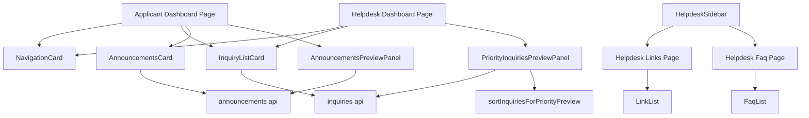

# Technical Design Document

## Overview
本機能は、申請者側ポータル（`/[locale]`）とヘルプデスク側ポータル（`/[locale]/helpdesk`）のトップページを、それぞれのポータルで利用可能な機能へのカード形式の導線を並べた「ナビゲーションハブ」として再構築する。あわせて、ヘルプデスク側に不足している「リンク」「FAQ」ページを新規追加し、実態と乖離したヘルプデスク側トップページの案内文言を解消する。さらに、ナビゲーションカードのみでは情報量が少ないというフィードバックを受け、カード群の下部に申請者側「最新のお知らせ」・ヘルプデスク側「対応が必要な問い合わせ」のプレビューパネルを追加する。

**Users**: 海外販社担当者（申請者側利用者）およびヘルプデスク担当者（ヘルプデスク側利用者）が、日々のポータル利用の起点としてこのトップページを使う。

**Impact**: 申請者側トップページ（現在5つの情報ウィジェットで構成）とヘルプデスク側トップページ（現在プレースホルダー文言のみ）を、共通のカードUIパターンに基づく6枚以内のナビゲーションカード群へ置き換える。ヘルプデスク側には新規ルート（`/helpdesk/links`, `/helpdesk/faq`）を追加する。両ポータルのトップページ下部には、カード群を補完するプレビューパネル（お知らせ／優先度付き問い合わせ）を1枚ずつ追加する。

### Goals
- 両ポータルのトップページから、各機能ページへワンクリックで遷移できるカード群を提供する
- ヘルプデスク側トップページの実態と異なる案内文言を解消する
- ヘルプデスク側に「リンク」「FAQ」ページを、申請者側の実装を再利用する形で追加する
- 両ポータルで統一されたカードデザイン（構造・スタイル・レスポンシブ挙動）を適用する
- ナビゲーションカードを画面上部に維持したまま、カード群の下部に実データのプレビューを追加し、ナビゲーションの分かりやすさと情報量を両立させる

### Non-Goals
- お知らせ管理機能（一覧・作成・編集・削除）自体の内部実装（`announcements-management` spec の範囲、実装済み・`main`にマージ済み）
- 問い合わせ管理・テンプレート管理・問い合わせ申請フォーム・問い合わせ一覧など、各機能ページ自体の内部ロジックの変更
- 認証・アクセス制御の実装
- 個人単位の既読/未読管理（フェーズ1は認証未実装のため技術的に不可能。代替指標については研究ログ・Design Decisionsを参照）
- プレビューパネル内でのフィルタリング・検索・ページネーションUI（一覧ページ自体の機能であり、プレビューパネルは要約表示に限定する）

## Boundary Commitments

### This Spec Owns
- 申請者側トップページ（`src/app/[locale]/(applicant)/page.tsx`）のカードハブへの全面書き換え
- ヘルプデスク側トップページ（`src/app/[locale]/helpdesk/page.tsx`）のプレースホルダーからカードハブへの全面書き換え
- 両ポータル共通のカードUIコンポーネント（`NavigationCard`）とその周辺コンポーネント
- ヘルプデスク側「リンク」「FAQ」ページの新規追加（既存 `LinkList` / `FaqList` を再利用）
- `HelpdeskSidebar.tsx` への「リンク」「FAQ」ナビゲーション項目の追加、および既存「ホーム」ラベルの「ダッシュボード」への変更
- ヘルプデスク側の全社問い合わせ状況集計関数（`getAllInquiryStatusSummary`）の追加
- 既存の申請者側ダッシュボードウィジェット5点（`AnnouncementWidget`, `InquiryStatusWidget`, `RecentInquiriesWidget`, `QuickLinksWidget`, `FaqPickWidget`）の削除（置き換えにより不要となるため）
- 関連する翻訳キー（`dashboard.*` の書き換え、`helpdeskDashboard.*` の新規追加、`helpdeskNav.*` の追加・変更、`helpdeskHome` の削除）
- 申請者側トップページへの「最新のお知らせ」プレビューパネル（`AnnouncementsPreviewPanel`）の追加
- ヘルプデスク側トップページへの「対応が必要な問い合わせ」プレビューパネル（`PriorityInquiriesPreviewPanel`）の追加、および優先度付き並び替えロジック（`sortInquiriesForPriorityPreview`）の新設

### Out of Boundary
- `/[locale]/helpdesk/announcements` 配下の一覧・作成・編集ページの内部実装（`announcements-management` spec が所有）。本specは当該ルートへの導線カードのみを追加する
- `HelpdeskSidebar.tsx` への「お知らせ管理」ナビゲーション項目の追加（`announcements-management` spec 自身のタスクとして別途実施される。統合済み）
- 問い合わせ一覧・問い合わせ申請フォーム・テンプレート管理の画面内部のロジック変更
- 認証・セッション・ユーザーごとの既読管理の実装
- 既存の `sortInquiriesForHelpdesk`（`src/lib/helpdesk-inquiry-list.ts`、問い合わせ一覧ページ本体が使用）の変更。プレビューパネル専用の並び替えロジックは別関数として新設し、既存の一覧ページの挙動には影響を与えない

### Allowed Dependencies
- 既存のモックAPI関数: `getLinks()`, `getFaqs()`, `getAllInquiries()`, `getInquiries()`, `getInquiryStatusSummary()`, `getAnnouncements()`, `getRecentAnnouncements()`
- 既存UIコンポーネント: `Card` / `CardHeader` / `CardTitle` / `CardContent`（`src/components/ui/card.tsx`）, `Badge`（`src/components/ui/badge.tsx`）, `Skeleton`
- 既存の表示コンポーネント: `AnnouncementListItem`（`src/components/features/announcements/`）, `HelpdeskInquiryListItem`（`src/components/features/helpdesk-inquiries/`）
- `lucide-react` アイコンセット（追加インストール不要、既存依存関係）
- `announcements-management` spec が確定させたルートパス `/[locale]/helpdesk/announcements`（実装済み・`main`にマージ済み）

### Revalidation Triggers
- `announcements-management` spec がルートパスまたは `HelpdeskSidebar.tsx` の変更内容を変更した場合
- `getAllInquiries()` / `getInquiries()` / `InquiryStatusSummary` のシグネチャが変更された場合
- `Card` / `Badge` コンポーネントのAPIが変更された場合
- `AnnouncementListItem` / `HelpdeskInquiryListItem` のPropsが変更された場合
- `Inquiry` 型の `claim` フィールドの構造が変更された場合（優先度並び替えロジックが依存する）

## Architecture

### Existing Architecture Analysis
- Next.js App Router + React Server Components。各機能データは `src/lib/api/*` のモック関数（`Promise` を返す）から取得する
- 既存ダッシュボードウィジェットは「非同期Serverコンポーネント + 個別`Suspense`/スケルトン + 個別try/catchによるエラー分離」というパターンを踏襲している（例: `AnnouncementWidget`）。本設計も同パターンを維持し、カード単位のエラー分離（要件1.6, 2.9）を満たす
- サイドバーは静的な `NAV_ITEMS` 配列をコンポーネント内で定義し、`next-intl` の翻訳キーでラベルを解決する（`Sidebar.tsx`, `HelpdeskSidebar.tsx`）
- `getInquiries()`（自社スコープ）と `getAllInquiries()`（全社・スコープなし）が既に両方存在し、集計関数 `getInquiryStatusSummary()` は前者のみを利用している

### Architecture Pattern & Boundary Map



**Architecture Integration**:
- 選択パターン: 既存の「Server Component + Suspense単位のデータ取得」を維持したまま、ウィジェット（コンテンツプレビュー主体）をナビゲーションカード（導線主体、軽量なバッジのみ）に置き換える
- ドメイン境界: カードの見た目・配置は `dashboard` ドメイン（本spec所有）、遷移先の各機能ページの中身は既存ドメイン（inquiry-form, inquiry-list, links, faq, helpdesk-inquiries, reply-templates）がそのまま所有し続ける。「お知らせ管理」への導線のみ `announcements-management` ドメインを参照する
- 既存パターンの維持: Suspense＋スケルトン、try/catchによるカード単位のエラー分離、`next-intl` 経由の文言管理
- 新規コンポーネントの理由: `NavigationCard` は両ポータル・全カードで共通のカードUIを1箇所に集約し、スタイルの重複を防ぐために新設する。`InquiryListCard` / `AnnouncementsCard` はバッジ集計という非自明なロジックを持つため、`NavigationCard` とは別の非同期ラッパーとして切り出す。`AnnouncementsPreviewPanel` / `PriorityInquiriesPreviewPanel` は、カード（導線）とは異なる「実データの一覧プレビュー」という責務を持つため、既存の削除済みウィジェットと同様のSuspense単位のコンポーネントとして別途新設する
- Steering準拠: DAISOブランドトークン（`--primary`等）の利用、`next-intl`経由の文言管理、`react-hook-form`等への影響なし（フォーム機能自体は変更しない）

### Technology Stack

| Layer | Choice / Version | Role in Feature | Notes |
|-------|------------------|-----------------|-------|
| Frontend | Next.js (App Router) + TypeScript（既存） | ページ・コンポーネント実装 | 新規依存追加なし |
| UI | shadcn/ui `Card` / `Badge`（既存） | カードの構造・バッジ表示 | 既存コンポーネントをそのまま利用 |
| アイコン | `lucide-react`（既存） | カードのアイコン表示 | 既存依存関係、追加インストール不要 |
| 多言語 | `next-intl`（既存） | カードの文言・ナビゲーションラベル | `messages/ja.json` / `en.json` の更新のみ |
| データ | `src/lib/api/*` モック関数（既存） | 問い合わせ状況・お知らせ件数の取得 | `getAllInquiryStatusSummary` を新規追加 |

## File Structure Plan

### Directory Structure
```
src/
├── app/[locale]/
│   ├── (applicant)/
│   │   └── page.tsx                      # 変更: カードハブへ全面書き換え
│   └── helpdesk/
│       ├── page.tsx                      # 変更: プレースホルダーからカードハブへ全面書き換え
│       ├── links/
│       │   └── page.tsx                  # 新規: 申請者側と同一のLinkListを表示
│       └── faq/
│           └── page.tsx                  # 新規: 申請者側と同一のFaqListを表示
├── components/
│   ├── layout/
│   │   └── HelpdeskSidebar.tsx           # 変更: リンク・FAQ項目追加、ホームラベル変更
│   └── features/
│       └── dashboard/
│           ├── NavigationCard.tsx        # 新規: 共通ナビゲーションカード（プレゼンテーション）
│           ├── NavigationCardSkeleton.tsx# 新規: NavigationCard用スケルトン
│           ├── InquiryListCard.tsx       # 新規: 問い合わせ状況バッジ付きカード（own/all共通）
│           ├── AnnouncementsCard.tsx     # 新規: お知らせ新着件数バッジ付きカード
│           ├── AnnouncementsPreviewPanel.tsx      # 新規: 申請者側「最新のお知らせ」プレビュー
│           ├── PriorityInquiriesPreviewPanel.tsx  # 新規: ヘルプデスク側「対応が必要な問い合わせ」プレビュー
│           ├── AnnouncementWidget.tsx    # 削除: ダッシュボード置き換えに伴い未使用化
│           ├── InquiryStatusWidget.tsx   # 削除: 同上
│           ├── RecentInquiriesWidget.tsx # 削除: 同上
│           ├── QuickLinksWidget.tsx      # 削除: 同上
│           └── FaqPickWidget.tsx         # 削除: 同上
└── lib/
    ├── api/
    │   └── inquiries.ts                  # 変更: getAllInquiryStatusSummary を追加
    └── dashboard-priority-inquiries.ts   # 新規: プレビューパネル専用の優先度並び替えロジック
```

> `NavigationCard` 以外の静的カード（問い合わせ申請、テンプレート管理、お知らせ管理、問い合わせ申請フォーム導線、リンク、FAQ）は専用コンポーネントを持たず、各ページ内で `NavigationCard` に直接propsを渡して描画する。

### Modified Files
- `src/app/[locale]/(applicant)/page.tsx` — 5ウィジェット構成から5枚のナビゲーションカード（問い合わせ申請・問い合わせ一覧・お知らせ・リンク・FAQ）構成へ書き換え。カード群の下部に `AnnouncementsPreviewPanel` を追加
- `src/app/[locale]/helpdesk/page.tsx` — プレースホルダー文言から、対応系3枚（問い合わせ一覧・テンプレート管理・お知らせ管理）＋参照系3枚（問い合わせ申請フォーム・リンク・FAQ）のセクション区分カード構成へ書き換え。カード群の下部に `PriorityInquiriesPreviewPanel` を追加
- `src/components/layout/HelpdeskSidebar.tsx` — `HELPDESK_NAV_ITEMS` に `links` / `faq` を追加し、`translationKey` のユニオン型を拡張。既存 `home` の表示ラベル（`helpdeskNav.home` の翻訳値）を「ホーム」から「ダッシュボード」に変更（キー名は変更しない）
- `src/lib/api/inquiries.ts` — `getAllInquiryStatusSummary(): Promise<InquiryStatusSummary>` を追加（`getInquiryStatusSummary()` と同一パターンで `getAllInquiries()` を集計元とする）
- `messages/ja.json` / `messages/en.json` — `dashboard.*` を新カード文言に置き換え、`helpdeskDashboard.*` を新設、`helpdeskNav.links` / `helpdeskNav.faq` を追加、`helpdeskHome` を削除。プレビューパネル用の文言（`dashboard.announcementsPreview.*`, `helpdeskDashboard.priorityInquiriesPreview.*`）を追加

## Requirements Traceability

| Requirement | Summary | Components | Interfaces | Flows |
|-------------|---------|------------|------------|-------|
| 1.1, 1.3, 1.4 | 申請者側5カードの表示・遷移・説明表示 | ApplicantDashboardPage, NavigationCard | — | — |
| 1.2 | 問い合わせ一覧カードの遷移先は自社分のみ | InquiryListCard（scope=own） | Service | — |
| 1.5, 1.6 | バッジ表示とエラー時のフォールバック | InquiryListCard, AnnouncementsCard | Service | カード単位エラー分離 |
| 2.1, 2.2, 2.4, 2.6 | ヘルプデスク側6カードの表示・遷移・実態反映 | HelpdeskDashboardPage, NavigationCard | — | — |
| 2.3 | 対応系/参照系のセクション区分 | HelpdeskDashboardPage | — | — |
| 2.5 | お知らせ管理カードから`/helpdesk/announcements`へ遷移 | HelpdeskDashboardPage, NavigationCard | — | 別spec依存（Allowed Dependencies参照） |
| 2.7, 2.9 | バッジ表示とエラー時のフォールバック | InquiryListCard | Service | カード単位エラー分離 |
| 2.8 | サイドバーのホームラベルを「ダッシュボード」に変更 | HelpdeskSidebar | — | — |
| 3.1, 3.2, 3.3 | ヘルプデスク側リンク・FAQページ新設とナビ追加 | HelpdeskLinksPage, HelpdeskFaqPage, HelpdeskSidebar | — | — |
| 4.1〜4.5 | カードデザインの一貫性・レスポンシブ・ブランド準拠・i18n | NavigationCard, NavigationCardSkeleton | — | — |
| 4.6 | ナビゲーションカードを上部、プレビューパネルを下部に配置 | ApplicantDashboardPage, HelpdeskDashboardPage | — | — |
| 5.1〜5.5, 5.7 | 申請者側「最新のお知らせ」プレビュー表示・遷移・一覧導線 | AnnouncementsPreviewPanel | Service | カード単位エラー分離 |
| 5.6 | お知らせ0件時の空状態表示 | AnnouncementsPreviewPanel | — | — |
| 6.1〜6.6, 6.8 | ヘルプデスク側「対応が必要な問い合わせ」プレビュー表示・優先順位・遷移・一覧導線 | PriorityInquiriesPreviewPanel | Service | カード単位エラー分離 |
| 6.7 | 対応が必要な問い合わせ0件時の空状態表示 | PriorityInquiriesPreviewPanel | — | — |

## Components and Interfaces

| Component | Domain/Layer | Intent | Req Coverage | Key Dependencies (P0/P1) | Contracts |
|-----------|--------------|--------|---------------|---------------------------|-----------|
| NavigationCard | UI (dashboard) | 共通のカード表示（アイコン・タイトル・説明・任意バッジ・遷移リンク） | 1.3, 1.4, 2.1, 4.1, 4.3, 4.4 | Card/Badge（P0） | State |
| NavigationCardSkeleton | UI (dashboard) | NavigationCard読み込み中のスケルトン表示 | 4.1 | Skeleton（P0） | State |
| InquiryListCard | dashboard (data) | 問い合わせ状況集計を取得しNavigationCardへバッジを渡す（own/all共通） | 1.1, 1.2, 1.5, 1.6, 2.2, 2.7, 2.9 | inquiries api（P0）, NavigationCard（P0） | Service |
| AnnouncementsCard | dashboard (data) | 直近お知らせ件数を取得しNavigationCardへバッジを渡す | 1.1, 1.5, 1.6 | announcements api（P0）, NavigationCard（P0） | Service |
| ApplicantDashboardPage | Page | 申請者側5カードの構成・配置 | 1.1〜1.6 | InquiryListCard, AnnouncementsCard, NavigationCard（P0） | — |
| HelpdeskDashboardPage | Page | ヘルプデスク側6カードの構成・配置・セクション区分 | 2.1〜2.9 | InquiryListCard, NavigationCard（P0） | — |
| HelpdeskLinksPage / HelpdeskFaqPage | Page | 既存LinkList/FaqListの再表示 | 3.1, 3.2 | LinkList, FaqList（P0） | — |
| HelpdeskSidebar（変更） | Layout | ナビゲーション項目の追加・ラベル変更 | 2.8, 3.3 | i18n messages（P0） | — |
| inquiries api（変更） | Data | `getAllInquiryStatusSummary` の追加 | 2.2, 2.7 | mock-store（P0） | Service |
| AnnouncementsPreviewPanel | dashboard (data) | 直近のお知らせ最大5件をタイトル・カテゴリ・日付付きで一覧表示する | 5.1〜5.7 | announcements api（P0）, AnnouncementListItem（P0） | Service |
| PriorityInquiriesPreviewPanel | dashboard (data) | 全社の未対応問い合わせを優先度順に最大5件、会社名・種別・緊急度・状況付きで一覧表示する | 6.1〜6.8 | inquiries api（P0）, sortInquiriesForPriorityPreview（P0）, HelpdeskInquiryListItem（P0） | Service |
| sortInquiriesForPriorityPreview | dashboard (data) | 未着手（未クレーム）・緊急度・受付日時に基づき問い合わせを優先度順に並び替える純関数 | 6.3 | — | Service |

### dashboard ドメイン

#### NavigationCard

| Field | Detail |
|-------|--------|
| Intent | アイコン・タイトル・説明・任意のバッジを持つ、クリックで指定ページへ遷移するカードを描画する |
| Requirements | 1.3, 1.4, 2.1, 4.1, 4.3, 4.4 |

**Responsibilities & Constraints**
- 表示のみを担当し、データ取得は行わない（Presentational）
- カード全体がリンクとして機能し、キーボード操作・スクリーンリーダーでも遷移可能なマークアップにする
- DAISOブランドトークン（`--primary`等）とTailwindユーティリティのみでスタイリングし、色をハードコードしない

**Dependencies**
- Inbound: ApplicantDashboardPage, HelpdeskDashboardPage, InquiryListCard, AnnouncementsCard（P0）
- Outbound: `Card` / `CardHeader` / `CardTitle` / `CardContent`（`src/components/ui/card`）, `Badge`（P0）
- External: `lucide-react`（アイコン, P1）, `@/i18n/navigation`の`Link`（P0）

**Contracts**: Service [ ] / API [ ] / Event [ ] / Batch [ ] / State [x]

##### State Management
- State model: Propsのみで完結するステートレスなプレゼンテーションコンポーネント
- Persistence & consistency: なし
- Concurrency strategy: 該当なし

```typescript
type NavigationCardBadgeVariant = "default" | "urgency-high" | "muted";

interface NavigationCardBadge {
  count: number;
  variant: NavigationCardBadgeVariant;
}

interface NavigationCardProps {
  title: string;
  description: string;
  href: string;
  icon: LucideIcon;
  badge?: NavigationCardBadge;
}
```

**Implementation Notes**
- Integration: `href` は `@/i18n/navigation` の `Link` にそのまま渡し、ロケールプレフィックスの解決を委譲する
- Validation: `badge.count` が `0` の場合はバッジ自体を描画しない
- Risks: なし

#### InquiryListCard

| Field | Detail |
|-------|--------|
| Intent | 問い合わせ状況（自社/全社）を集計し、未対応件数バッジ付きの`NavigationCard`を描画する |
| Requirements | 1.1, 1.2, 1.5, 1.6, 2.2, 2.7, 2.9 |

**Responsibilities & Constraints**
- `scope` に応じて `getInquiryStatusSummary()`（own）または `getAllInquiryStatusSummary()`（all）を呼び分ける
- バッジ件数は `summary.new + summary.in_progress`（未対応件数）とする
- データ取得失敗時は、バッジなしの`NavigationCard`をフォールバック表示し、例外をページへ伝播させない（要件1.6, 2.9）

**Dependencies**
- Inbound: ApplicantDashboardPage, HelpdeskDashboardPage（P0）
- Outbound: NavigationCard（P0）
- External: `getInquiryStatusSummary`, `getAllInquiryStatusSummary`（`src/lib/api/inquiries.ts`, P0）

**Contracts**: Service [x] / API [ ] / Event [ ] / Batch [ ] / State [ ]

##### Service Interface
```typescript
type InquiryListCardScope = "own" | "all";

interface InquiryListCardProps {
  scope: InquiryListCardScope;
  href: string;
  titleKey: string;
  descriptionKey: string;
}
```
- Preconditions: `titleKey` / `descriptionKey` は呼び出し側の翻訳namespace内に存在するキーであること
- Postconditions: 集計取得に成功した場合は未対応件数をバッジとして持つ`NavigationCard`を返す。失敗時はバッジなしの`NavigationCard`を返す
- Invariants: 例外を上位（ページ）へ再送出しない

**Implementation Notes**
- Integration: `scope="own"` は申請者側ページから、`scope="all"` はヘルプデスク側ページから使用する
- Validation: 該当なし（表示専用の集計であり入力を受け取らない）
- Risks: `getAllInquiries()` のデータ件数が将来大きく増えた場合、都度全件取得＋集計となるためパフォーマンス劣化の可能性がある（フェーズ1のモックデータ規模では影響なし）

#### AnnouncementsCard

| Field | Detail |
|-------|--------|
| Intent | 直近7日以内に公開されたお知らせ件数を集計し、新着件数バッジ付きの`NavigationCard`を描画する |
| Requirements | 1.1, 1.5, 1.6 |

**Responsibilities & Constraints**
- `getAnnouncements()` を取得し、`publishedAt` が現在時刻から7日以内のものを新着件数として数える
- データ取得失敗時は、バッジなしの`NavigationCard`をフォールバック表示する（要件1.6）

**Dependencies**
- Inbound: ApplicantDashboardPage（P0）
- Outbound: NavigationCard（P0）
- External: `getAnnouncements`（`src/lib/api/announcements.ts`, P0）

**Contracts**: Service [x] / API [ ] / Event [ ] / Batch [ ] / State [ ]

##### Service Interface
```typescript
interface AnnouncementsCardProps {
  href: string;
  titleKey: string;
  descriptionKey: string;
  recentDays?: number; // 既定値: 7
}
```
- Preconditions: なし
- Postconditions: 新着件数が1件以上であればバッジ付き、0件またはデータ取得失敗であればバッジなしの`NavigationCard`を返す
- Invariants: 例外を上位（ページ）へ再送出しない

**Implementation Notes**
- Integration: 申請者側ページの「お知らせ」カードでのみ使用する
- Validation: 該当なし
- Risks: 「7日」というしきい値は仮値であり、フェーズ2のヒアリング結果を踏まえて調整され得る（`research.md`参照）

#### AnnouncementsPreviewPanel

| Field | Detail |
|-------|--------|
| Intent | 直近のお知らせ最大5件をタイトル・カテゴリ・公開日付きで一覧表示し、詳細画面・一覧画面への導線を提供する |
| Requirements | 5.1, 5.2, 5.3, 5.4, 5.5, 5.6, 5.7 |

**Responsibilities & Constraints**
- `getRecentAnnouncements({ limit: 5 })` を取得し、公開日の降順で表示する（`getRecentAnnouncements` は既に降順ソート済みのため追加のソート処理は不要）
- 各項目は既存の `AnnouncementListItem` コンポーネントで描画し、表示ロジックを重複実装しない
- 該当お知らせが0件の場合は空状態メッセージを表示する
- データ取得失敗時は、パネル全体をエラー状態で表示し、ページ全体やナビゲーションカードの表示には影響を与えない（要件5.7）
- パネル下部に `/announcements` への「お知らせ一覧を見る」リンクを表示する

**Dependencies**
- Inbound: ApplicantDashboardPage（P0）
- Outbound: `AnnouncementListItem`（`src/components/features/announcements/`, P0）
- External: `getRecentAnnouncements`（`src/lib/api/announcements.ts`, P0）

**Contracts**: Service [x] / API [ ] / Event [ ] / Batch [ ] / State [ ]

##### Service Interface
```typescript
interface AnnouncementsPreviewPanelProps {
  viewAllHref: string; // "/announcements"
}
```
- Preconditions: なし
- Postconditions: 取得に成功した場合は最大5件のお知らせ一覧を表示する。0件の場合は空状態、失敗時はエラー状態を表示する
- Invariants: 例外を上位（ページ）へ再送出しない

**Implementation Notes**
- Integration: 申請者側ダッシュボードのカード群の下部に、独立した`Suspense`境界（`AnnouncementsPreviewPanelSkeleton`をfallbackとする）で配置する
- Validation: 該当なし
- Risks: `AnnouncementsCard`（バッジ集計）と`AnnouncementsPreviewPanel`（内容一覧）はいずれも`getAnnouncements`系関数を呼び出すため、同一データソースに対する重複フェッチが発生する。フェーズ1のモックデータ規模では性能への影響はないが、将来的にキャッシュ層を検討する余地がある

#### PriorityInquiriesPreviewPanel

| Field | Detail |
|-------|--------|
| Intent | 全社の未対応問い合わせを優先度順に最大5件、会社名・種別・緊急度・対応状況付きで一覧表示し、詳細画面・一覧画面への導線を提供する |
| Requirements | 6.1, 6.2, 6.3, 6.4, 6.5, 6.6, 6.7, 6.8 |

**Responsibilities & Constraints**
- `getAllInquiries()` を取得し、ステータスが `new` または `in_progress` の問い合わせのみを対象とする
- 対象を `sortInquiriesForPriorityPreview` で並び替え、上位5件のみ表示する
- 各項目は既存の `HelpdeskInquiryListItem` コンポーネントで描画し、表示ロジックを重複実装しない
- 該当する問い合わせが0件の場合は空状態メッセージを表示する
- データ取得失敗時は、パネル全体をエラー状態で表示し、ページ全体やナビゲーションカードの表示には影響を与えない（要件6.8）
- パネル下部に `/helpdesk/inquiries` への「問い合わせ一覧を見る」リンクを表示する

**Dependencies**
- Inbound: HelpdeskDashboardPage（P0）
- Outbound: `HelpdeskInquiryListItem`（`src/components/features/helpdesk-inquiries/`, P0）, `sortInquiriesForPriorityPreview`（P0）
- External: `getAllInquiries`（`src/lib/api/inquiries.ts`, P0）

**Contracts**: Service [x] / API [ ] / Event [ ] / Batch [ ] / State [ ]

##### Service Interface
```typescript
interface PriorityInquiriesPreviewPanelProps {
  viewAllHref: string; // "/helpdesk/inquiries"
}
```
- Preconditions: なし
- Postconditions: 取得・絞り込みに成功した場合は優先度順の最大5件を表示する。0件の場合は空状態、失敗時はエラー状態を表示する
- Invariants: 例外を上位（ページ）へ再送出しない。既存の問い合わせ一覧ページ（`/helpdesk/inquiries`）の表示・並び順には一切影響を与えない

**Implementation Notes**
- Integration: ヘルプデスク側ダッシュボードのカード群の下部に、独立した`Suspense`境界（`PriorityInquiriesPreviewPanelSkeleton`をfallbackとする）で配置する
- Validation: 該当なし
- Risks: `InquiryListCard`（バッジ集計）と`PriorityInquiriesPreviewPanel`（内容一覧）はいずれも`getAllInquiries`を呼び出すため重複フェッチが発生する。フェーズ1のモックデータ規模では性能への影響はない

#### sortInquiriesForPriorityPreview

| Field | Detail |
|-------|--------|
| Intent | 未着手（未クレーム）を最優先とし、次いで緊急度、次いで受付日時の降順で問い合わせを並び替える純関数 |
| Requirements | 6.3 |

**Responsibilities & Constraints**
- 優先順位は (1) `claim` が未設定（誰も対応着手していない）ものを先に、(2) 緊急度（高→中→低）、(3) 受付日時（`createdAt`）の降順、の順で決定する
- 既存の `sortInquiriesForHelpdesk`（`src/lib/helpdesk-inquiry-list.ts`、問い合わせ一覧ページ本体が使用）とは独立した関数として実装し、既存関数・既存ページの挙動を変更しない
- 引数の配列を変更しない（既存の`sortInquiriesForHelpdesk`と同様の非破壊的パターンに従う）

**Dependencies**
- Inbound: PriorityInquiriesPreviewPanel（P0）
- Outbound: なし

**Contracts**: Service [x] / API [ ] / Event [ ] / Batch [ ] / State [ ]

##### Service Interface
```typescript
function sortInquiriesForPriorityPreview(inquiries: Inquiry[]): Inquiry[];
```
- Preconditions: なし
- Postconditions: 入力と同じ件数の配列を、未着手優先・緊急度・受付日時の順で並び替えて返す
- Invariants: 引数の配列インスタンスを変更しない（新しい配列を返す）

**Implementation Notes**
- Integration: `src/lib/dashboard-priority-inquiries.ts` に配置し、既存の `src/lib/helpdesk-inquiry-list.ts` とは別ファイルとする（Boundary Commitmentsの「既存並び替えロジックの非変更」を明確にするため）
- Validation: 該当なし
- Risks: なし

### inquiries api（データ層・変更）

#### getAllInquiryStatusSummary

| Field | Detail |
|-------|--------|
| Intent | 全社（スコープなし）の問い合わせをステータス別に集計する |
| Requirements | 2.2, 2.7 |

**Responsibilities & Constraints**
- `getAllInquiries()` の結果を `InquiryStatusSummary` 型に集計する。既存 `getInquiryStatusSummary()` と同一の集計ロジックを、集計元のみ `getInquiries()` から `getAllInquiries()` に差し替えた形で実装する

**Dependencies**
- Inbound: InquiryListCard（scope=all, P0）
- Outbound: `getAllInquiries()`（同ファイル内, P0）

**Contracts**: Service [x] / API [ ] / Event [ ] / Batch [ ] / State [ ]

##### Service Interface
```typescript
function getAllInquiryStatusSummary(): Promise<InquiryStatusSummary>;
```
- Preconditions: なし
- Postconditions: `new` / `in_progress` / `resolved` の件数を持つ `InquiryStatusSummary` を返す
- Invariants: 既存の `InquiryStatusSummary` 型定義を変更しない

**Implementation Notes**
- Integration: 既存の `getInquiryStatusSummary()` と対称的な実装とし、将来の保守性を揃える
- Validation: 該当なし
- Risks: なし

### Page / Layout（サマリーのみ）

- **ApplicantDashboardPage**（`src/app/[locale]/(applicant)/page.tsx`）: 上部に「問い合わせ申請」（静的`NavigationCard`, href `/inquiry/new`）、「問い合わせ一覧」（`InquiryListCard` scope=own, href `/inquiry`）、「お知らせ」（`AnnouncementsCard`, href `/announcements`）、「リンク」（静的, href `/links`）、「FAQ」（静的, href `/faq`）の5枚をグリッド配置し、その下部に `AnnouncementsPreviewPanel`（viewAllHref `/announcements`）を配置する
- **HelpdeskDashboardPage**（`src/app/[locale]/helpdesk/page.tsx`）: 上部に「対応系」セクション（「問い合わせ一覧」`InquiryListCard` scope=all href `/helpdesk/inquiries`、「テンプレート管理」静的 href `/helpdesk/templates`、「お知らせ管理」静的 href `/helpdesk/announcements`）と「参照系」セクション（「問い合わせ申請フォーム」静的 href `/inquiry/new`、「リンク」静的 href `/helpdesk/links`、「FAQ」静的 href `/helpdesk/faq`）を配置し、その下部に `PriorityInquiriesPreviewPanel`（viewAllHref `/helpdesk/inquiries`）を配置する
- **HelpdeskLinksPage / HelpdeskFaqPage**: 既存の `LinkList` / `FaqList` をそのまま `Suspense` でラップして描画する薄いページ（申請者側の `links/page.tsx` / `faq/page.tsx` と同一構造）
- **HelpdeskSidebar（変更）**: `HELPDESK_NAV_ITEMS` に `{ translationKey: "links", href: "/helpdesk/links", icon: Link2 }` と `{ translationKey: "faq", href: "/helpdesk/faq", icon: HelpCircle }` を追加し、`helpdeskNav.home` の翻訳値を「ダッシュボード」/`Dashboard`に変更する

## Data Models

### Domain Model
本specは新しいドメインエンティティを導入しない。既存の `Inquiry`, `InquiryStatusSummary`, `Announcement`, `Link`, `Faq` 型をそのまま利用する。

### Logical Data Model
変更なし。`getAllInquiryStatusSummary` は既存 `InquiryStatusSummary` 型の新しい算出経路を追加するのみで、スキーマ変更は伴わない。

## Error Handling

### Error Strategy
既存ウィジェットと同様、カード単位のtry/catchでデータ取得失敗を吸収し、失敗したカードのみバッジなし表示にフォールバックする。ページ全体やその他のカードには影響を与えない（要件1.6, 2.9）。

### Error Categories and Responses
- **データ取得失敗**（モックAPI例外）: 該当カードをバッジなしの`NavigationCard`として表示する。エラーメッセージの個別表示は行わない（カード自体は常にリンクとして機能する）
- **未実装ルートへの遷移**（`announcements-management`未マージ状態で「お知らせ管理」カードを踏んだ場合）: Next.jsの標準404として扱う。実装（タスク）着手前にブランチのマージ状況を確認することでこのリスクを回避する（Allowed Dependencies参照）

## Testing Strategy

- **Unit Tests**: `NavigationCard`（バッジあり/なし表示切り替え）, `getAllInquiryStatusSummary`（集計ロジック）, `AnnouncementsCard`（7日しきい値の境界値）, `sortInquiriesForPriorityPreview`（未着手優先・緊急度・受付日時の並び替えロジック）
- **Integration Tests**: `InquiryListCard`（scope=own/allそれぞれでのAPI呼び出しとエラー時フォールバック）, `AnnouncementsPreviewPanel`（正常表示・空状態・エラー時フォールバック）, `PriorityInquiriesPreviewPanel`（正常表示・0件時の空状態・エラー時フォールバック）
- **E2E/UI Tests**: 申請者側トップページの5カードから各ページへの遷移、ヘルプデスク側トップページの6カードから各ページへの遷移とセクション区分表示、ヘルプデスク側「リンク」「FAQ」ページの表示内容が申請者側と一致すること、両ポータルともナビゲーションカードが画面上部・プレビューパネルがその下部に表示されること
