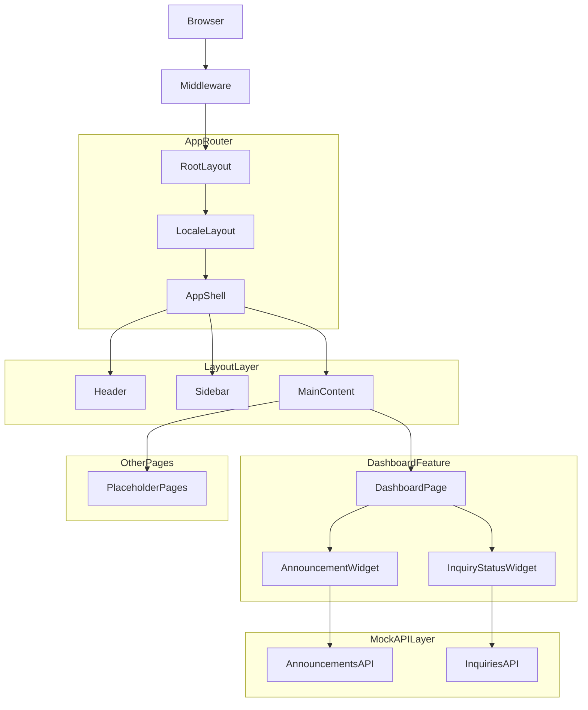
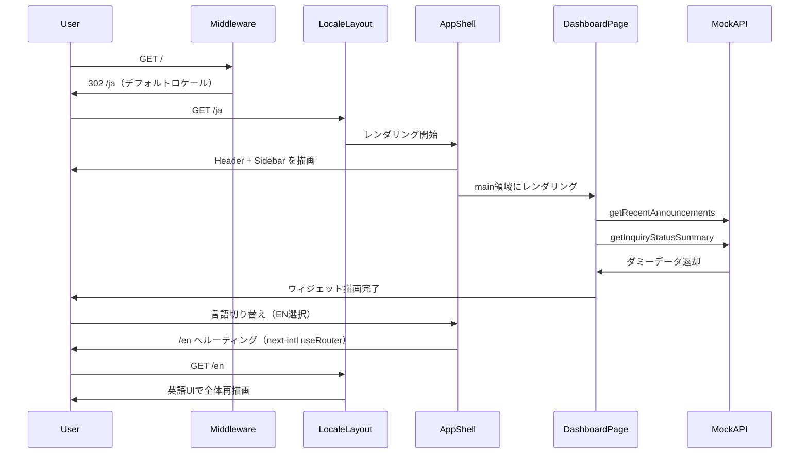

# 技術設計書: dashboard

## 概要

ヘルプデスクポータルのダッシュボード機能は、全ページ共通のシェルレイアウト（ヘッダー・サイドバーナビゲーション・メインコンテンツ領域）と、ポータルのエントリーポイントとなるダッシュボードトップページを提供する。後続のすべての機能スペック（`inquiry-form`・`announcements`・`links-page`・`faq`）はこのシェルを継承するため、本仕様がポータル全体の技術的基盤となる。

**ユーザー**: 海外販社担当者（20か国以上）が日本語または英語でポータルにアクセスし、お知らせと問い合わせ状況をダッシュボードで即座に把握する。

### Goals

- PC・タブレット対応の一貫したレイアウトシェルを全ページに提供する
- next-intl による日本語・英語切り替えをUI全テキストに反映する
- ダッシュボードトップページでお知らせ概要と問い合わせステータス概要を表示する
- フェーズ3のバックエンドAPI差し替えに耐えるモック連携インターフェースを確立する

### Non-Goals

- モバイル（767px未満）への完全最適化
- 認証・ログイン機能（フェーズ2以降）
- 各機能ページの詳細実装（`announcements`・`inquiry-form`・`links-page`・`faq` 仕様が担当）
- バックエンドAPIの実装

---

## スコープ境界

### This Spec Owns

- `app/[locale]/layout.tsx`: AppShell配置・next-intl Provider設定
- `components/layout/`: Header・Sidebar・LanguageSwitcherコンポーネント
- `app/[locale]/page.tsx`: ダッシュボードトップページ
- `components/features/dashboard/`: ダッシュボードウィジェット群
- `lib/api/announcements.ts`, `lib/api/inquiries.ts`: モックAPI関数と型インターフェース
- `types/announcement.ts`, `types/inquiry-summary.ts`: 共有型定義
- `messages/ja.json`, `messages/en.json`: 翻訳キー（本仕様が初期スキーマを確立）
- `i18n/routing.ts`, `i18n/request.ts`, `middleware.ts`: next-intlルーティング設定

### Out of Boundary

- 各機能ページの実装（`announcements`・`inquiry-form`・`links-page`・`faq` 仕様が担当）
- 問い合わせデータの完全な型定義（`inquiry-form` 仕様が担当）
- お知らせの詳細データ構造（`announcements` 仕様が担当）
- 認証・認可処理

### Allowed Dependencies

- shadcn/ui: `Card`・`Skeleton`・`Button` コンポーネント
- next-intl: `useTranslations`・`useRouter`・`usePathname`・`useLocale`・`Link`・`NextIntlClientProvider`
- Next.js App Router: `layout.tsx`・`page.tsx`・`Suspense`

### Revalidation Triggers

- `lib/api/announcements.ts` の型インターフェース変更 → `announcements` 仕様との整合性確認が必要
- `lib/api/inquiries.ts` の型インターフェース変更 → `inquiry-form` 仕様との整合性確認が必要
- サイドバーのナビゲーション項目（パス・ラベル）の変更 → 後続仕様のルーティング設計に影響

---

## アーキテクチャ

### Architecture Pattern & Boundary Map

Next.js App Router の **Nested Layouts** パターンを採用する。ルートレイアウト（`app/layout.tsx`）がHTML基盤を提供し、ロケールレイアウト（`app/[locale]/layout.tsx`）がAppShellを配置する。ページコンポーネントはメインコンテンツ領域（`{children}`）にレンダリングされる。



**依存方向（厳守）**: `types/` → `lib/api/` → `components/features/` → `components/layout/` → `app/[locale]/`

上位レイヤーが下位レイヤーをインポートする方向でのみ依存を許可し、逆方向の参照は禁止する。

### Technology Stack

| Layer | Choice / Version | Role | Notes |
|-------|-----------------|------|-------|
| Frontend | Next.js 14+ App Router | ルーティング・Nested Layouts | `[locale]` ディレクトリ方式 |
| Language | TypeScript strict | 型安全な実装全般 | `any` 使用禁止 |
| Styling | Tailwind CSS + shadcn/ui | レイアウト・UIコンポーネント | レスポンシブは `md:` / `lg:` ブレークポイント |
| i18n | next-intl 3.x | 多言語対応・言語切り替え | `[locale]` ルーティング方式を採用（詳細は `research.md`） |
| State | React `useState` | サイドバー開閉状態のみ | グローバル状態管理ライブラリは不使用 |

---

## File Structure Plan

### Directory Structure

```
src/
├── app/
│   ├── layout.tsx                       # ルートHTML基盤（フォント・メタデータ）
│   ├── globals.css
│   └── [locale]/
│       ├── layout.tsx                   # AppShell配置・NextIntlClientProvider
│       └── page.tsx                     # ダッシュボードトップページ（/ja, /en）
├── components/
│   ├── layout/
│   │   ├── AppShell.tsx                 # Header + Sidebar + main構成のシェル
│   │   ├── Header.tsx                   # ロゴ + LanguageSwitcher
│   │   ├── Sidebar.tsx                  # ナビゲーション（PC展開/タブレットコンパクト）
│   │   └── LanguageSwitcher.tsx         # ja/en 言語切り替えUI
│   └── features/
│       └── dashboard/
│           ├── AnnouncementWidget.tsx   # お知らせ概要ウィジェット（async Server Component）
│           └── InquiryStatusWidget.tsx  # 問い合わせステータス概要ウィジェット（async Server Component）
├── lib/
│   └── api/
│       ├── announcements.ts             # getRecentAnnouncements() モック関数
│       └── inquiries.ts                 # getInquiryStatusSummary() モック関数
├── types/
│   ├── announcement.ts                  # Announcement 型定義
│   └── inquiry-summary.ts               # InquiryStatusSummary 型定義
├── messages/
│   ├── ja.json                          # 日本語翻訳キー（本仕様で初期スキーマを確立）
│   └── en.json                          # 英語翻訳キー
├── i18n/
│   ├── routing.ts                       # next-intl ロケールリスト・デフォルトロケール設定
│   └── request.ts                       # next-intl サーバーサイドリクエスト設定
└── middleware.ts                        # next-intl ロケール検出・リダイレクト
```

### Modified Files

既存ファイルなし（グリーンフィールド）。

---

## System Flows

### 初回アクセス・言語切り替えフロー



フロー上のキー決定: ミドルウェアがデフォルトロケール（`ja`）へ302リダイレクトするため、`/` を直接ブックマークしたユーザーも正しくダッシュボードへ到達できる。

---

## Requirements Traceability

| 要件ID | 概要 | コンポーネント | インターフェース | フロー |
|--------|------|--------------|----------------|------|
| 1.1 | 全ページ共通3エリアレイアウト | AppShell | AppShellProps | 初回アクセスフロー |
| 1.2 | タブレット幅で横スクロールなし | AppShell, Sidebar | — | — |
| 1.3 | PC幅でサイドバー常時展開 | Sidebar | SidebarProps.isCollapsed | — |
| 1.4 | タブレット幅でサイドバーコンパクト | AppShell, Sidebar | SidebarProps.isCollapsed | — |
| 2.1 | ヘッダーにロゴ表示 | Header | — | — |
| 2.2 | ヘッダーに言語切り替えUI | Header, LanguageSwitcher | LanguageSwitcherProps | — |
| 2.3 | 言語切り替え時にUI全体再描画 | LanguageSwitcher | LanguageSwitcherProps | 初回アクセスフロー |
| 2.4 | テキストはnext-intl翻訳キー経由 | Header, LanguageSwitcher | messages/*.json | — |
| 3.1 | サイドバーに6ナビ項目表示 | Sidebar | NavItem[] | — |
| 3.2 | アクティブ項目のハイライト | Sidebar | NavItem | — |
| 3.3 | ナビ項目クリックで遷移 | Sidebar | NavItem.href | — |
| 3.4 | ナビラベルはnext-intl翻訳キー経由 | Sidebar | messages/*.json | — |
| 4.1 | ルートURLでダッシュボード表示 | app/[locale]/page.tsx | — | 初回アクセスフロー |
| 4.2 | お知らせ概要ウィジェット（最大3件） | AnnouncementWidget | AnnouncementsAPI | — |
| 4.3 | 問い合わせステータス概要ウィジェット | InquiryStatusWidget | InquiriesAPI | — |
| 4.4 | 新規問い合わせCTAリンク | app/[locale]/page.tsx | — | — |
| 4.5 | ローディング状態表示 | AnnouncementWidget, InquiryStatusWidget | — | — |
| 4.6 | エラー状態表示 | AnnouncementWidget, InquiryStatusWidget | — | — |
| 5.1 | ja/en 2言語サポート | 全コンポーネント | messages/ja.json, messages/en.json | — |
| 5.2 | 翻訳キー未存在時にenフォールバック | i18n/request.ts | — | — |
| 5.3 | JSXにテキストハードコードなし | 全コンポーネント | — | — |
| 5.4 | 言語ファイル追加で拡張可能 | i18n/routing.ts | — | — |
| 6.1 | データはlib/api/から取得 | AnnouncementWidget, InquiryStatusWidget | AnnouncementsAPI, InquiriesAPI | — |
| 6.2 | モック関数が実APIと同一インターフェース | lib/api/*.ts | AnnouncementsAPI, InquiriesAPI | — |
| 6.3 | コンポーネントはPromiseを前提に動作 | AnnouncementWidget, InquiryStatusWidget | — | — |

---

## Components and Interfaces

### コンポーネント概要

| コンポーネント | ドメイン/レイヤー | 役割 | 要件カバレッジ | 主要依存 (P0/P1) | コントラクト |
|---|---|---|---|---|---|
| AppShell | Layout | 3エリアレイアウトシェル | 1.1, 1.2, 1.3, 1.4 | Header(P0), Sidebar(P0) | State |
| Header | Layout | ロゴ + 言語切り替え | 2.1, 2.2, 2.3, 2.4 | LanguageSwitcher(P0) | Service |
| Sidebar | Layout | ナビゲーションリスト | 3.1, 3.2, 3.3, 3.4 | next-intl Link(P0) | Service |
| LanguageSwitcher | Layout | 言語トグルUI | 2.2, 2.3, 5.1, 5.4 | next-intl useRouter(P0) | Service |
| app/[locale]/page.tsx | Routing | ダッシュボードページ配置 | 4.1, 4.4 | AnnouncementWidget(P0), InquiryStatusWidget(P0) | — |
| AnnouncementWidget | Feature/Dashboard | お知らせ概要表示 | 4.2, 4.5, 4.6, 6.1, 6.2, 6.3 | AnnouncementsAPI(P0), Skeleton(P1) | Service |
| InquiryStatusWidget | Feature/Dashboard | ステータス集計カード | 4.3, 4.5, 4.6, 6.1, 6.2, 6.3 | InquiriesAPI(P0), Skeleton(P1) | Service |
| AnnouncementsAPI | Mock API | お知らせモックデータ提供 | 6.1, 6.2, 6.3 | — | Service |
| InquiriesAPI | Mock API | 問い合わせ集計モックデータ提供 | 6.1, 6.2, 6.3 | — | Service |

---

### Layout Layer

#### AppShell

| Field | Detail |
|---|---|
| Intent | ヘッダー・サイドバー・メインコンテンツの3エリアレイアウトをすべてのページに提供する |
| Requirements | 1.1, 1.2, 1.3, 1.4 |

**Responsibilities & Constraints**
- Tailwind CSS の flex レイアウトで Header（上部固定）・Sidebar（左固定）・`main`（残余領域）を構成する
- サイドバー開閉状態 `isSidebarCollapsed` を `useState` で保持し、`isCollapsed` として Sidebar へ props 渡しする
- `children` prop にページコンポーネントをレンダリングする

**Dependencies**
- Outbound: Header — ヘッダー表示（P0）
- Outbound: Sidebar — ナビゲーション表示（P0）（`isCollapsed` を渡す）

**Contracts**: Service [x] / State [x]

##### Service Interface

```typescript
interface AppShellProps {
  children: React.ReactNode;
}
```

##### State Management

- `isSidebarCollapsed: boolean` — AppShell ローカル `useState`
- PC幅（≥1280px）: Tailwind `lg:` ブレークポイントで Sidebar を展開幅（例: `w-60`）で表示
- タブレット幅（768px–1279px）: Tailwind `md:` ブレークポイントで Sidebar をアイコン幅（例: `w-16`）に縮小
- 横スクロール防止: ルート要素に `overflow-x-hidden` + `min-w-0` を適用する

**Implementation Notes**
- Integration: `app/[locale]/layout.tsx` で `<AppShell>{children}</AppShell>` としてインポートする
- Validation: Chrome DevTools で 768px 幅に設定し、横スクロールバーが発生しないことを確認する

---

#### Header

| Field | Detail |
|---|---|
| Intent | ポータルロゴと言語切り替えUIを上部固定領域に常時表示する |
| Requirements | 2.1, 2.2, 2.3, 2.4 |

**Dependencies**
- Outbound: LanguageSwitcher — 言語切り替えUI（P0）
- External: next-intl `useTranslations` — ヘッダーラベルの翻訳（P0）

**Contracts**: Service [x]

##### Service Interface

```typescript
interface HeaderProps {
  // フェーズ1はpropsなし（ユーザー情報表示はフェーズ2以降）
}
```

**Implementation Notes**
- Integration: AppShell 内の `header` 要素としてレンダリングする。Tailwind `h-14 fixed top-0` 等でヘッダー高さを確保する
- Validation: `t('header.title')` 等の翻訳キーが `ja.json` / `en.json` に存在することを確認する

---

#### Sidebar

| Field | Detail |
|---|---|
| Intent | 全機能ページへのナビゲーションを提供し、現在ページをアクティブ状態として強調表示する |
| Requirements | 3.1, 3.2, 3.3, 3.4, 1.3, 1.4 |

**Responsibilities & Constraints**
- ナビゲーション項目リスト（`NAV_ITEMS`）を定数として定義し、翻訳キー・アイコン・パスのペアで管理する
- `usePathname`（next-intl）でアクティブ判定を行う。ロケールプレフィックス（`/ja`, `/en`）を除去して比較する
- `isCollapsed` が `true` のときはアイコンのみ表示、`false` のときはアイコン + ラベルを表示する

**Dependencies**
- Inbound: AppShell — `isCollapsed` prop 受け取り（P0）
- External: next-intl `Link`, `useTranslations`, `usePathname` — ルーティングと翻訳（P0）

**Contracts**: Service [x]

##### Service Interface

```typescript
interface NavItem {
  translationKey: string;              // 例: 'nav.dashboard'
  href: string;                        // 例: '/'（ロケールプレフィックスなし）
  icon: React.ComponentType<{ className?: string }>;
}

interface SidebarProps {
  isCollapsed: boolean;
}
```

ナビゲーション項目（6件）:

| translationKey | href |
|---|---|
| `nav.dashboard` | `/` |
| `nav.inquiryForm` | `/inquiry/new` |
| `nav.inquiryList` | `/inquiry` |
| `nav.announcements` | `/announcements` |
| `nav.links` | `/links` |
| `nav.faq` | `/faq` |

**Implementation Notes**
- Integration: `NAV_ITEMS` 配列を `map()` でレンダリングする。各項目は next-intl `Link` でラップする
- Risks: `usePathname()` はロケールプレフィックスを含む（例: `/ja/faq`）。`/ja` 部分をトリミングしてから `href` と比較する必要がある

---

#### LanguageSwitcher

| Field | Detail |
|---|---|
| Intent | 日本語・英語の切り替えUIを提供し、選択時に next-intl のロケールを切り替える |
| Requirements | 2.2, 2.3, 5.1, 5.4 |

**Dependencies**
- External: next-intl `useRouter`, `useLocale`, `usePathname` — ロケール切り替え（P0）

**Contracts**: Service [x]

##### Service Interface

```typescript
type SupportedLocale = 'ja' | 'en';

interface LanguageSwitcherProps {
  // ロケールはnext-intlフックから取得するためpropsなし
}
```

**Implementation Notes**
- Integration: `useRouter().replace(pathname, { locale: nextLocale })` で現在のパスを保持しつつロケールを切り替える
- Risks: `SupportedLocale` 型を `i18n/routing.ts` の `locales` 設定と同期させること。将来の言語追加時に両方の更新が必要

---

### Feature Layer

#### AnnouncementWidget

| Field | Detail |
|---|---|
| Intent | 最新のお知らせを最大3件取得し、タイトル・日付でリスト表示する。ローディング・エラー状態を処理する |
| Requirements | 4.2, 4.5, 4.6, 6.1, 6.2, 6.3 |

**Dependencies**
- Outbound: `lib/api/announcements.ts` `getRecentAnnouncements` — データ取得（P0）
- External: next-intl `useTranslations` — セクションタイトル・エラーメッセージ翻訳（P0）
- External: shadcn/ui `Card`, `Skeleton` — UIコンポーネント（P1）

**Contracts**: Service [x]

##### Service Interface

```typescript
// AnnouncementWidget は async Server Component のため props なし
// データはコンポーネント内で直接 await する
```

**Implementation Notes**
- Integration: `async` Server Component として実装する。呼び出し元（`page.tsx`）は `<Suspense fallback={<AnnouncementWidgetSkeleton />}>` で囲む
- Validation: ローディング中はshadcn/ui `Skeleton` を fallback として表示する。エラー時は `try-catch` でキャッチし翻訳キー経由のエラーメッセージを表示する
- Risks: フェーズ3での実API移行時、`getRecentAnnouncements` の関数シグネチャが変わらない限りこのコンポーネントへの変更は不要

---

#### InquiryStatusWidget

| Field | Detail |
|---|---|
| Intent | 問い合わせの新規・対応中・解決済みの件数を3枚のカードで表示する |
| Requirements | 4.3, 4.5, 4.6, 6.1, 6.2, 6.3 |

**Dependencies**
- Outbound: `lib/api/inquiries.ts` `getInquiryStatusSummary` — データ取得（P0）
- External: next-intl `useTranslations` — ステータスラベル・件数単位の翻訳（P0）
- External: shadcn/ui `Card`, `Skeleton` — UIコンポーネント（P1）

**Contracts**: Service [x]

##### Service Interface

```typescript
// InquiryStatusWidget は async Server Component のため props なし
```

**Implementation Notes**
- Integration: AnnouncementWidget と同様に async Server Component + Suspense パターンを使用する
- Validation: 3枚のカード（新規・対応中・解決済み）のラベルをそれぞれ翻訳キー経由で表示する

---

### Mock API Layer

#### AnnouncementsAPI と InquiriesAPI

**Contracts**: Service [x]

##### Service Interface

```typescript
// types/announcement.ts
export interface Announcement {
  id: string;
  title: string;
  publishedAt: string; // ISO 8601 形式（例: "2026-07-01T09:00:00Z"）
}

// lib/api/announcements.ts
export interface GetRecentAnnouncementsOptions {
  limit?: number; // デフォルト: 3
}

export function getRecentAnnouncements(
  options?: GetRecentAnnouncementsOptions
): Promise<Announcement[]>;
```

```typescript
// types/inquiry-summary.ts
export interface InquiryStatusSummary {
  new: number;
  in_progress: number;
  resolved: number;
}

// lib/api/inquiries.ts
export function getInquiryStatusSummary(): Promise<InquiryStatusSummary>;
```

**Implementation Notes**
- Integration: フェーズ1では静的ダミーデータを `Promise.resolve(data)` で返す。フェーズ3では関数本体のみ実APIコールに差し替える（シグネチャは変更しない）
- Validation: 呼び出し元コンポーネントは必ず `await` でデータを受け取ること（要件 6.3）

---

## Data Models

### Domain Model

```
Announcement（読み取り専用・ダッシュボード概要表示用）
  id:          string   — 一意識別子
  title:       string   — お知らせタイトル（翻訳済み文字列を想定）
  publishedAt: string   — 公開日時（ISO 8601）

InquiryStatusSummary（集計値・ダッシュボード表示用）
  new:         number   — 新規問い合わせ件数
  in_progress: number   — 対応中件数
  resolved:    number   — 解決済み件数
```

詳細な `Inquiry` 型（`category`・`urgency`・`originalText` 等）は `inquiry-form` 仕様が定義する。本仕様では集計結果（`InquiryStatusSummary`）のみを使用する。

### Data Contracts & Integration

| 関数 | 引数 | 戻り値型 | フェーズ3での差し替え先 |
|---|---|---|---|
| `getRecentAnnouncements` | `{ limit?: number }` | `Promise<Announcement[]>` | お知らせ一覧APIエンドポイント |
| `getInquiryStatusSummary` | なし | `Promise<InquiryStatusSummary>` | 問い合わせ集計APIエンドポイント |

---

## Error Handling

### Error Strategy

フェーズ1はモックAPIを使用するためデータ取得エラーは基本的に発生しない。ただし Server Component 内に `try-catch` を設けることでフェーズ3の実API連携時に備える。

### Error Categories and Responses

- **データ取得失敗**: `try-catch` でキャッチし、翻訳キー経由のエラーメッセージを該当ウィジェット領域に表示する（他のウィジェットへの影響なし）
- **翻訳キー未存在**: next-intl が自動的に `en` にフォールバックする（要件 5.2）。コンソール警告を出力するため、開発時に検出可能

---

## Testing Strategy

### Unit Tests

- `Sidebar`: `usePathname()` の返り値に応じてアクティブ項目が正しくハイライトされること（ロケールプレフィックスのトリミング込み）
- `LanguageSwitcher`: ロケール切り替え時に `useRouter().replace()` が正しい引数（locale・pathname）で呼ばれること
- `getRecentAnnouncements`: `limit` オプションが返り値の件数に反映されること・返り値が `Announcement[]` 型であること
- `getInquiryStatusSummary`: 返り値が `InquiryStatusSummary` 型であること（`new` / `in_progress` / `resolved` フィールドを持つ）

### Integration Tests

- `AnnouncementWidget`: モックAPI → ウィジェット表示の結合（最大3件表示・日付フォーマット）
- `InquiryStatusWidget`: モックAPI → 3枚カード表示の結合

### E2E/UI Tests

- ルートURL（`/`）アクセス時に `/ja` へリダイレクトされダッシュボードが表示されること
- 言語切り替えUI操作後にURLが `/en` に変わり、UI全テキストが英語に切り替わること
- サイドバーのナビゲーション項目をクリックして対応ページへ遷移できること
- 768px 幅でレイアウトが崩れず横スクロールバーが発生しないこと

---

## 翻訳キースキーマ（初期定義）

本仕様が確立する `messages/` の初期キー構造。後続仕様は既存キーを拡張するかたちで追記する。

```json
// messages/ja.json（抜粋）
{
  "header": {
    "title": "ヘルプデスクポータル"
  },
  "nav": {
    "dashboard": "ダッシュボード",
    "inquiryForm": "問い合わせ申請",
    "inquiryList": "問い合わせ一覧",
    "announcements": "お知らせ",
    "links": "リンク集",
    "faq": "FAQ"
  },
  "dashboard": {
    "announcements": {
      "title": "お知らせ",
      "empty": "お知らせはありません",
      "error": "お知らせの取得に失敗しました"
    },
    "inquiryStatus": {
      "title": "問い合わせ状況",
      "new": "新規",
      "inProgress": "対応中",
      "resolved": "解決済み",
      "error": "データの取得に失敗しました"
    },
    "cta": "新規問い合わせを申請する"
  }
}
```
