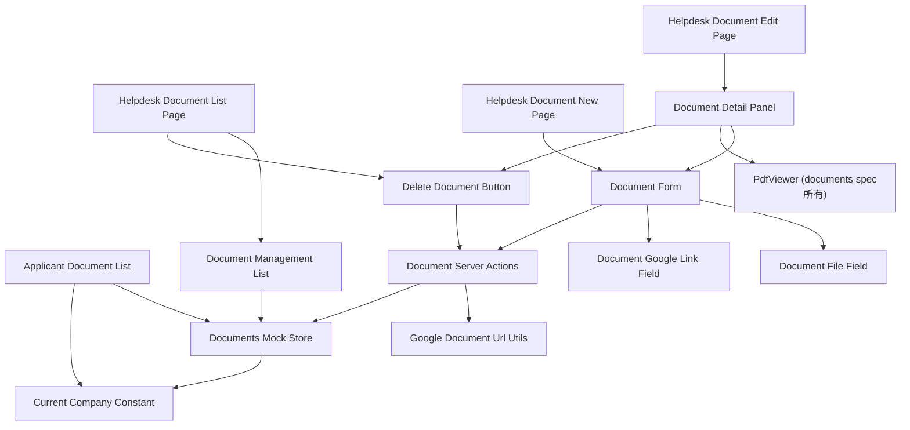
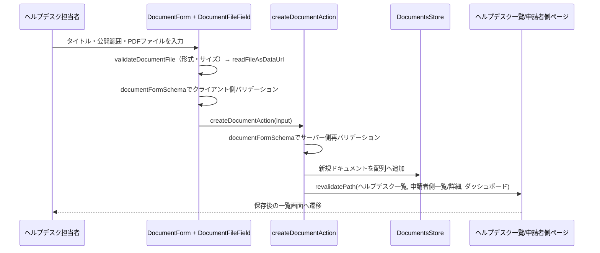

# 技術設計書: documents-management

## Overview

**Purpose**: 本機能は、ヘルプデスク担当者がPDFドキュメントをアップロードし、公開範囲（全体公開／国単位／販社単位）を指定して登録・編集・削除できる管理画面（`/helpdesk/documents`配下）を提供する。あわせて、申請者側の閲覧機能（`documents`spec）が依存するデータモデル・読み取り専用モックAPIの型契約を本specが所有・提供する。

**Users**: 日本側ヘルプデスク担当者が、業務マニュアル等のPDFを海外販社へ配布する際に利用する。

**Impact**: 現状存在しない`Document`型・`DocumentTargeting`型・販社マスタ（`DOCUMENT_COMPANY_OPTIONS`）を新規に定義する。既存の`AnnouncementTargeting`（判別可能ユニオン型による配信対象指定）・`InquiryAttachment`（Base64データURLによるファイル保持）・`announcements-management`のCRUDパターン（Server Actions + `getGlobalMockStore`）をすべて踏襲し、新しい抽象化は導入しない。2026-07-16追記: PDFアップロードに加え、Googleドキュメント/スプレッドシート/スライドの共有リンクを登録する方式（`sourceType: "google"`）を追加する。`Document`型を`sourceType`による判別可能ユニオン型へ変更し、共有リンクURLを埋め込み用URLへ変換する純粋関数を新設する（詳細は`research.md`を参照）。

### Goals
- ヘルプデスク担当者がPDFドキュメントをアップロード・編集・削除できる
- ドキュメントごとに公開範囲（全体公開／国単位／販社単位）を指定できる
- アップロードするファイルの形式（PDFのみ）・サイズ（20MB以下）を検証する
- 変更操作の完了後、申請者側の一覧・詳細表示に確実に反映される
- 既存の`announcements-management`・`inquiry-form`のパターンを踏襲し、新規の抽象化・依存ライブラリを追加しない
- （2026-07-16追記）ヘルプデスク担当者がPDF再アップロードなしに、Googleドキュメント/スプレッドシート/スライドの共有リンクを登録できる
- （2026-07-16追記）登録方式（アップロード／Googleリンク）によらず、既存の一覧・公開範囲指定・削除・申請者側反映の仕組みをそのまま適用する

### Non-Goals
- 申請者側のドキュメント一覧・詳細画面のレイアウト・PDFビューア実装自体（`documents`spec所有）
- 認証・ロールベースアクセス制御（フェーズ3以降）
- PDF以外のファイル形式のアップロード対応
- 実ファイルストレージ（S3等）への保存（フェーズ1はBase64データURL方式を継続。フェーズ3で置き換え、その際に上限値を再検討する）
- リンク集（`links-page`spec）の`document`カテゴリとの統合
- （2026-07-16追記）Google Drive APIによる変更検知・自動再同期・OAuth連携（埋め込み表示がGoogle側から都度最新のコンテンツを配信することに委ねる）
- （2026-07-16追記）Google側のファイル共有設定（「リンクを知っている全員」等）の検証・強制（ポータル側からは制御不能なため、運用上の注意点として扱う）

## Boundary Commitments

### This Spec Owns
- `/[locale]/helpdesk/documents`・`/[locale]/helpdesk/documents/new`・`/[locale]/helpdesk/documents/[id]/edit`配下の全ページ（2026-07-09追記: `/[locale]/helpdesk/documents/[id]/edit`は表示モード（登録済み情報＋PDFプレビュー）と編集モード（既存フォーム＋PDFプレビュー）をクライアント状態で切り替える構成に変更。2026-07-09追記②: 遷移直後の初期モードを表示モードから編集モードへ変更）
- `Document`型・`DocumentTargeting`型（`src/types/document.ts`、新規）
- 販社マスタ`DOCUMENT_COMPANY_OPTIONS`（`src/lib/constants/document-company-options.ts`、新規）
- ドキュメントの検証定数（`DOCUMENT_MAX_FILE_SIZE_BYTES`・`DOCUMENT_ALLOWED_MIME_TYPES`、`src/lib/constants/document.ts`、新規）
- ドキュメントの作成・編集・削除のServer Actions・モックAPIミューテーション・バリデーションスキーマ
- ドキュメント一覧・詳細取得の読み取り専用モック関数（`getDocuments`・`getDocumentById`）の型契約とシード実装（`documents`specが依存する側）
- `src/lib/constants/current-company.ts`への`companyCode`フィールドの追加（既存フィールドは変更しない）
- `HelpdeskSidebar`への「ドキュメント管理」ナビゲーション項目の追加
- （2026-07-16追記）`Document`型の`sourceType: "upload" | "google"`判別可能ユニオン化、Googleリンク登録用フィールド（`googleUrl`・`googleEmbedUrl`）の定義
- （2026-07-16追記）Googleドキュメント共有リンクのURLパターン検証・埋め込み用URL変換ロジック（`toGoogleEmbedUrl`、`src/lib/google-document-url.ts`、新規）
- （2026-07-16追記）登録方法（アップロード／Googleリンク）を切り替えるフォームUI（`DocumentForm`の拡張）とGoogleリンク専用の入力フィールド（`DocumentGoogleLinkField`、新規）

### Out of Boundary
- `documents`spec所有の申請者側`DocumentList`・`DocumentDetail`・`PdfViewer`のレイアウト・実装（2026-07-16追記: `PdfViewer`の`sourceType`分岐対応自体は`documents`spec側の設計・実装とする。本specは`sourceType`に応じた`props`をPdfViewerへ渡す呼び出し側のみを担う）
- `helpdesk-portal-layout`が所有するルートセグメント構造・`HelpdeskAppShell`・`HelpdeskHeader`自体の変更
- 認証・ロールベースアクセス制御の実装
- リンク集（`links-page`spec）の型・画面・データ
- （2026-07-16追記）Google Drive API・OAuth連携、Googleファイルの共有設定の検証・自動化

### Allowed Dependencies
- `announcements-management`が確立したServer Actions + `getGlobalMockStore`パターン（`src/lib/mock-store.ts`）
- `inquiry-form`が確立したファイルユーティリティ（`readFileAsDataUrl`・`formatFileSize`、`src/lib/attachment-utils.ts`）
- 既存の`INQUIRY_COUNTRY_CODES`（公開範囲の国選択肢として再利用）
- 既存のUIプリミティブ（`Card`, `Button`, `Select`, `Input`, `Textarea`, `Label`）
- `HelpdeskSidebar`（項目追加のみ）
- `documents`spec所有の`PdfViewer`コンポーネント（`src/components/features/documents/PdfViewer.tsx`、読み取り専用の表示コンポーネントとしてそのまま再利用。2026-07-09追記: 表示モード・編集モードのPDFプレビューに使用。2026-07-16追記: `documents`specが`sourceType`分岐に対応した拡張版`PdfViewer`を提供する前提とし、本specはそのpropsインターフェースに従って呼び出す）

### Revalidation Triggers
- `Document`/`DocumentTargeting`型のフィールド追加・変更（`documents`specが再確認する必要がある）
- `MOCK_CURRENT_COMPANY`への`companyCode`フィールド追加（`announcements.ts`・`inquiries.ts`など既存の参照元に影響がないか確認）
- `getDocuments`/`getDocumentById`の関数シグネチャ変更（`documents`specの実装前提が変わる）
- （2026-07-16追記）`Document`型を`sourceType`判別可能ユニオン型へ変更したこと自体（`documents`spec側の`PdfViewer`・一覧表示コンポーネントで型ガード・`sourceType`分岐の追加が必要）
- （2026-07-16追記）`PdfViewer`のprops契約変更（`documents`spec側の設計変更を本specが呼び出し側として追随する必要がある）

## Architecture

### Existing Architecture Analysis
`announcements-management`specが確立したCRUDパターン（`lib/api/*.ts`の`getGlobalMockStore`による可変配列 + `lib/validation/*.ts`のzodスキーマ + `lib/actions/*.ts`のServer Actions + `mode: "create"|"edit"`共用フォーム）をそのまま踏襲する。ファイル本体の扱いは`inquiry-form`の`InquiryAttachment`（Base64データURL）パターンを踏襲するが、1ドキュメント=1PDFの1対1関係のため複数ファイル・件数制限の概念は持たない専用の型・ユーティリティを新設する。2026-07-16追記: `DocumentTargeting`が確立した判別可能ユニオン型パターンを`Document`型自体の`sourceType`分岐にも適用し、既存の型設計方針を一貫して踏襲する（詳細は`research.md`の Design Decisions を参照）。

### Architecture Pattern & Boundary Map
`announcements-management`と同一のパターンを踏襲する。2026-07-16追記: 登録方法の分岐（アップロード／Googleリンク）はフォーム内のクライアント状態として持ち、送信データの形は`documentFormSchema`の判別可能ユニオンで検証する。埋め込みURL変換はServer Action内の純粋関数呼び出しとして行い、新規の外部通信・ライブラリは導入しない。



**Architecture Integration**:
- 選択パターン: Server Actions + `globalThis`共有ストア（`announcements-management`と同一パターン）
- ドメイン境界: ドキュメントデータは単一の`DocumentsStore`（`lib/api/documents.ts`が所有する配列）に集約し、ヘルプデスク側（無絞り込み）と申請者側（自社可視性スコープ）の両方がここから読む
- 既存パターンの維持: フォームは`react-hook-form`+`zod`、ページ構成（一覧→新規作成/編集）は`helpdesk-announcements`と同じNext.js App Router構成を踏襲
- 新規コンポーネントの理由: PDFファイルの選択・検証・Base64変換はクライアント状態境界を持つため、`AttachmentField`を汎用化するのではなく単一ファイル専用の`DocumentFileField`として新設する（`AttachmentField`は複数ファイル・件数制限を前提とした`inquiry-form`所有のコンポーネントであり、責務混在を避けるため）。2026-07-09追記: 既存ドキュメント画面の表示/編集モード切り替えは、`DocumentForm`（既存, 変更なし）の外側にモード状態を持つ`DocumentDetailPanel`を新設して実現する。`DocumentForm`自体にモード切り替えを組み込むと、新規作成フローとの責務が混在するため避ける。2026-07-16追記: `DocumentGoogleLinkField`を`DocumentFileField`と並立する専用コンポーネントとして新設する（両者は排他的に表示されるが、責務が異なる＝ファイル読み込み検証 vs URL文字列検証のため、条件分岐を1コンポーネントに詰め込まず分離する）。URL⇔埋め込みURL変換は`DocumentFileField`/`DocumentGoogleLinkField`のどちらにも依存しない独立した純粋関数（`GoogleDocumentUrlUtils`）として新設し、クライアント側検証・サーバー側検証の両方から共用する
- Steering準拠: 表示テキストは全て`next-intl`翻訳キー経由、モックAPIは`lib/api/`に抽象化という既存規約を維持

### Technology Stack

| Layer | Choice / Version | Role in Feature | Notes |
|-------|------------------|-----------------|-------|
| Frontend | Next.js App Router（既存, 14.2.35） | ページ構成・Server Actions | `announcements-management`と同一パターン |
| Forms | react-hook-form + zod（既存） | ドキュメント作成・編集フォームのバリデーション | `discriminatedUnion`で公開範囲を検証 |
| UI | shadcn/ui（既存） | `Select`（公開範囲・国・販社選択）, `Input type="file"` | 新規UIプリミティブの追加は不要。削除確認はブラウザ標準`confirm()`を使用 |
| Data / Mock | `lib/api/documents.ts`の可変配列 + `getGlobalMockStore` | ドキュメントのCRUD状態管理 | フェーズ1限定。開発サーバー再起動でリセットされる |
| File Handling | `FileReader.readAsDataURL`（既存パターン踏襲） | PDFファイルのBase64データURL変換 | 新規ライブラリは導入しない |

## File Structure Plan

### Directory Structure
```
src/app/[locale]/helpdesk/documents/
├── page.tsx                        # 一覧（全件表示・削除導線）
├── new/
│   └── page.tsx                    # 新規作成
└── [id]/
    └── edit/
        └── page.tsx                 # 編集・削除

src/components/features/helpdesk-documents/
├── DocumentManagementList.tsx       # Server: 全件取得・一覧表示（2026-07-16追記: 登録方式バッジ表示を追加）
├── DocumentForm.tsx                 # Client: 新規作成・編集共用フォーム（公開範囲選択を含む。2026-07-16追記: 登録方法の選択を追加）
├── DocumentFileField.tsx            # Client: 単一PDFファイルの選択・検証・Base64変換
├── DocumentGoogleLinkField.tsx      # Client（新規, 2026-07-16）: Googleドキュメント共有リンクURLの入力・検証
├── DocumentDetailPanel.tsx          # Client（新規, 2026-07-09）: 表示/編集モード切り替え + PdfViewerの組み込み
└── DeleteDocumentButton.tsx         # Client: confirm()による確認 + 削除アクション呼び出し

src/lib/api/
└── documents.ts                     # 新規: getDocuments/getDocumentById（申請者側）、getAllDocuments/getDocumentByIdForHelpdesk/create/update/delete

src/lib/actions/
└── documents.ts                     # 新規: "use server" Server Actions（create/update/delete）

src/lib/validation/
└── document.ts                      # 新規: ドキュメントフォームのzodスキーマ（公開範囲のdiscriminatedUnion含む。2026-07-16追記: sourceTypeのdiscriminatedUnion化）

src/lib/document-utils.ts            # 新規: validateDocumentFile（size/typeのみ）。2026-07-09追記: targetingLabel（公開範囲の表示ラベル整形、DocumentManagementListから移動）を追加

src/lib/google-document-url.ts       # 新規（2026-07-16）: parseGoogleDocumentUrl（URLパターン判定）・toGoogleEmbedUrl（埋め込み用URL変換）の純粋関数

src/lib/constants/
├── document.ts                      # 新規: DOCUMENT_MAX_FILE_SIZE_BYTES, DOCUMENT_ALLOWED_MIME_TYPES
├── document-company-options.ts      # 新規: DOCUMENT_COMPANY_CODES, DOCUMENT_COMPANY_OPTIONS
└── current-company.ts               # 変更: MOCK_CURRENT_COMPANYにcompanyCodeフィールドを追加

src/types/
└── document.ts                      # 新規: Document, DocumentTargeting, CreateDocumentInput（2026-07-16追記: Documentをsource Typeによる判別可能ユニオン型へ変更）

src/components/layout/
└── HelpdeskSidebar.tsx               # 変更: 「ドキュメント管理」ナビゲーション項目を追加

messages/
├── ja.json                          # 変更: helpdeskDocuments名前空間、helpdeskNavへのキー追加
└── en.json                          # 同上
```

### Modified Files
- `src/lib/constants/current-company.ts` — `MOCK_CURRENT_COMPANY`に`companyCode: "vn-daiso-vietnam"`を追加（既存フィールドは変更しない、既存の参照元である`announcements.ts`・`inquiries.ts`の挙動に影響なし）
- `src/components/layout/HelpdeskSidebar.tsx` — `HELPDESK_NAV_ITEMS`に1項目追加
- `messages/ja.json` / `messages/en.json` — 新規名前空間・キーの追加。2026-07-09追記: `helpdeskDocuments.form`に`detailTitle`・`editButton`・`cancelButton`を追加。2026-07-16追記: `helpdeskDocuments.form`に`sourceTypeLabel`・`sourceTypeUploadOption`・`sourceTypeGoogleOption`・`googleUrlLabel`・`googleUrlPlaceholder`・`googleUrlHint`・`googleUrlInvalidMessage`、`helpdeskDocuments.list`に`sourceTypeUploadBadge`・`sourceTypeGoogleBadge`を追加
- `src/app/[locale]/helpdesk/documents/[id]/edit/page.tsx`（2026-07-09追記） — データ取得・翻訳解決はServer Componentとして維持しつつ、`DocumentForm`を直接呼ぶ代わりに`DocumentDetailPanel`へ表示用props・フォーム用propsをまとめて渡す
- `src/components/features/helpdesk-documents/DocumentManagementList.tsx`（2026-07-09追記） — ローカル定義の`targetingLabel`関数を`src/lib/document-utils.ts`へ移動し、インポートに置き換える。2026-07-16追記: 各行に登録方式バッジを追加

> `documents`spec所有の申請者側`DocumentList`・`DocumentDetail`・`PdfViewer`は本specでは変更しない。これらが呼び出す`lib/api/documents.ts`の`getDocuments`/`getDocumentById`の型インターフェースを本specが定義・実装する。

## System Flows

ドキュメントの作成・編集・削除はいずれも「Client Component → Server Action → モックストア更新 → revalidatePath」という同一パターンに従う（`announcements-management`の削除フローと同型）ため、代表として新規作成フローを図示する。



- 編集・削除も同様に、Server Action内でzodスキーマ（`documentFormSchema`）によるサーバー側バリデーションを行った後、モックストアを更新し、影響範囲の全ルート（ヘルプデスク側・申請者側）を`revalidatePath`で再検証する。

## Requirements Traceability

| Requirement | Summary | Components | Interfaces | Flows |
|-------------|---------|------------|------------|-------|
| 1.1〜1.6 | ヘルプデスク側ドキュメント一覧 | DocumentManagementList | DocumentsMockApi (Service) | — |
| 2.1〜2.5 | ドキュメントの新規アップロード | DocumentForm, DocumentFileField, DocumentActions | Service | 新規作成フロー |
| 3.1〜3.5 | ドキュメントの編集 | DocumentForm, DocumentActions | Service | 新規作成フローと同型 |
| 4.1〜4.3 | ドキュメントの削除 | DeleteDocumentButton, DocumentActions | Service | 新規作成フローと同型 |
| 5.1〜5.5 | 公開範囲の指定 | DocumentForm, DocumentsMockApi（バリデーション） | Service | — |
| 6.1〜6.4 | PDFファイルの検証 | DocumentFileField, validateDocumentFile, documentFormSchema | Service | 新規作成フロー |
| 7.1〜7.2 | ナビゲーション統合 | HelpdeskSidebar | — | — |
| 8.1〜8.2 | 申請者側表示への反映 | DocumentActions（revalidatePath） | Service | 新規作成フロー |
| 9.1〜9.2 | 多言語対応 | 全新規コンポーネント | — | — |
| 10.1 | レスポンシブ対応 | （既存HelpdeskAppShellに依存、新規コンポーネントなし） | — | — |
| 11.1〜11.8 | 既存ドキュメント画面のプレビュー表示とビュー/編集切り替え（2026-07-09追記） | DocumentDetailPanel, PdfViewer（`documents`spec所有） | Service | — |
| 12.1〜12.4 | 一覧からの遷移時に編集モードを初期表示（2026-07-09追記②、11.1/11.3を上書き） | DocumentDetailPanel | Service | — |
| 13.1〜13.11 | Googleドキュメント/スプレッドシートの共有リンクによる登録（2026-07-16追記） | DocumentForm, DocumentGoogleLinkField, GoogleDocumentUrlUtils, DocumentActions, DocumentManagementList, DocumentDetailPanel | Service | 新規作成フロー（Google分岐） |

## Components and Interfaces

| Component | Domain/Layer | Intent | Req Coverage | Key Dependencies (P0/P1) | Contracts |
|-----------|--------------|--------|---------------|---------------------------|-----------|
| DocumentManagementList | UI/Server | 全件のドキュメントを取得・一覧表示（登録方式バッジ含む） | 1.1〜1.6, 13.9 | DocumentsMockApi (P0) | State |
| DocumentForm | UI/Client | タイトル・説明・公開範囲・登録方法（アップロード/Googleリンク）・ファイルまたはURLの入力・送信 | 2.1〜2.4, 3.1〜3.4, 5.1〜5.4, 13.1〜13.2, 13.4, 13.8 | DocumentFileField (P0), DocumentGoogleLinkField (P0), DocumentActions (P0) | State |
| DocumentFileField | UI/Client | 単一PDFファイルの選択・検証・Base64変換・プレビュー | 2.5, 6.1〜6.2 | validateDocumentFile (P0), readFileAsDataUrl (P0) | State |
| DocumentGoogleLinkField | UI/Client | GoogleドキュメントURLの入力・クライアント側パターン検証 | 13.2〜13.3 | GoogleDocumentUrlUtils (P0) | State |
| DeleteDocumentButton | UI/Client | 削除確認・削除アクション呼び出し | 4.1〜4.3 | DocumentActions (P0) | State |
| DocumentDetailPanel | UI/Client | 既存ドキュメント画面の表示/編集モード切り替え、表示モードでの読み取り専用情報＋プレビュー表示 | 11.1〜11.8, 12.1〜12.4, 13.6, 13.8 | DocumentForm (P0), PdfViewer（`documents`spec所有, P0）, DeleteDocumentButton (P1) | State |
| GoogleDocumentUrlUtils | Data/Util | GoogleドキュメントURLパターン判定と埋め込み用URLへの変換 | 13.3, 13.5 | なし（純粋関数） | Service |
| DocumentsMockApi | Data/Mock | ドキュメントの読み取り（自社可視性スコープ/無絞り込み）・CRUD | 1.1, 5.5, 8.1, 13.10 | Document型 (P0), CurrentCompany (P0) | Service |
| DocumentActions | Server Actions | モックAPIのCRUDを呼び出し、`revalidatePath`で再検証する | 2.3, 3.4, 4.3, 6.4, 8.1, 13.3〜13.7 | DocumentsMockApi (P0), GoogleDocumentUrlUtils (P0) | Service |

### Data / Mock API

#### DocumentsMockApi

| Field | Detail |
|-------|--------|
| Intent | 申請者側には自社可視性スコープのドキュメントのみを、ヘルプデスク側には全件を提供し、CRUDを行う |
| Requirements | 1.1, 5.5, 8.1 |

**Responsibilities & Constraints**
- `getDocuments`・`getDocumentById`（申請者側）は、`targeting.scope === "all"`、または`targeting.scope === "countries" && targeting.countries.includes(CurrentCompany.country)`、または`targeting.scope === "companies" && targeting.companyCodes.includes(CurrentCompany.companyCode)`のいずれかを満たすドキュメントのみを返す
- `getAllDocuments`・`getDocumentByIdForHelpdesk`（ヘルプデスク側）は絞り込みを行わない
- ミューテーション（作成・編集・削除）は`getGlobalMockStore`で保持する配列を直接更新する

**Dependencies**
- Inbound: `DocumentActions`（P0）, `DocumentManagementList`（P0）, `documents`spec所有の`DocumentList`/`DocumentDetail`（読み取り専用、P0）
- Outbound: `src/lib/constants/current-company.ts`（P0）

**Contracts**: Service [x]

##### Service Interface
```typescript
interface DocumentsMockApi {
  getDocuments(): Promise<Document[]>;
  getDocumentById(id: string): Promise<Document | null>;
  getAllDocuments(): Promise<Document[]>;
  getDocumentByIdForHelpdesk(id: string): Promise<Document | null>;
  createDocument(input: CreateDocumentInput): Promise<Document>;
  updateDocument(id: string, input: CreateDocumentInput): Promise<Document>;
  deleteDocument(id: string): Promise<void>;
}
```
- Preconditions: `updateDocument`/`deleteDocument`の`id`は存在するドキュメントのIDであること
- Postconditions: `createDocument`で作成されたドキュメントは、可視性条件を満たせば直後の`getDocuments`の結果に反映される
- Invariants: `getDocuments()`が返す配列は`getAllDocuments()`が返す配列の部分集合である

**Implementation Notes**
- Integration: `documents`spec は本インターフェースの`getDocuments`/`getDocumentById`のみを利用する（型・戻り値を変更しない限り、申請者側の実装に影響しない）
- Validation: 存在しないIDに対する`updateDocument`/`deleteDocument`はエラーをthrowする
- Risks: プロセス再起動でリセットされる（フェーズ1のモック制約）

### Utilities

#### GoogleDocumentUrlUtils

| Field | Detail |
|-------|--------|
| Intent | Googleドキュメント/スプレッドシート/スライドの共有リンクURLを判定し、iframe埋め込み用のプレビューURLへ変換する |
| Requirements | 13.3, 13.5 |

**Responsibilities & Constraints**
- `docs.google.com/document/`, `docs.google.com/spreadsheets/`, `docs.google.com/presentation/`のいずれかのパスに一致するURLからファイルIDを抽出する
- 一致しないURL（他ドメイン、不正な形式）に対しては変換不能を表す結果を返す（例外は投げない）
- 変換後の埋め込みURLは`{種別のパス}/d/{ファイルID}/preview`に統一する（`research.md`のDesign Decisions参照）
- クライアント側（`DocumentGoogleLinkField`）・サーバー側（`DocumentActions`内の`documentFormSchema`によるURL形式再検証）の両方から同一実装を呼び出す純粋関数として実装し、DOM・ネットワークアクセスを行わない

**Dependencies**
- Inbound: `DocumentGoogleLinkField`（P0）, `DocumentActions`（P0）
- Outbound: なし

**Contracts**: Service [x]

##### Service Interface
```typescript
type GoogleDocumentKind = "document" | "spreadsheets" | "presentation";

interface GoogleDocumentUrlUtils {
  parseGoogleDocumentUrl(url: string): { kind: GoogleDocumentKind; fileId: string } | null;
  toGoogleEmbedUrl(url: string): string | null;
}
```
- Preconditions: `url`はトリム済みの文字列であること
- Postconditions: 有効なGoogleドキュメント/スプレッドシート/スライドのURLであれば埋め込み用URLを返し、それ以外は`null`を返す
- Invariants: 同一の入力URLに対して常に同一の結果を返す（副作用を持たない）

**Implementation Notes**
- Integration: `documentFormSchema`（`sourceType: "google"`ブランチ）は`toGoogleEmbedUrl(googleUrl) !== null`を`refine`条件として利用し、要件13.3のエラーメッセージをトリガーする
- Validation: ファイルID抽出には英数字・ハイフン・アンダースコアのみを許容する
- Risks: Google側が将来URLパターンを変更した場合、本ユーティリティの正規表現を追随して更新する必要がある（外部サービス仕様への依存はこの1関数に閉じ込める）

### Server Actions

#### DocumentActions

| Field | Detail |
|-------|--------|
| Intent | クライアントからのドキュメント作成・編集・削除操作を受け、サーバー側バリデーション・ミューテーション・関連ルートの再検証を行う |
| Requirements | 2.2〜2.3, 3.2, 3.4, 4.3, 5.4, 6.4, 8.1, 13.3〜13.7 |

**Responsibilities & Constraints**
- 全ての関数に`"use server"`を付与する
- `createDocumentAction`・`updateDocumentAction`は`documentFormSchema`（zod）でタイトル・公開範囲・ファイル形式/サイズ（`sourceType: "upload"`）またはGoogleURL形式（`sourceType: "google"`、`GoogleDocumentUrlUtils.toGoogleEmbedUrl`による`refine`）を検証し、不正な入力は保存せず例外を送出する
- `sourceType: "google"`の保存時、`googleEmbedUrl`は`GoogleDocumentUrlUtils.toGoogleEmbedUrl(googleUrl)`の結果をサーバー側で再計算して保存する（クライアントから送られた埋め込みURLをそのまま信頼しない）
- 各操作の最後に、ヘルプデスク側一覧・編集、申請者側一覧・詳細ルートを`revalidatePath`で再検証する

**Dependencies**
- Inbound: `DocumentForm`, `DeleteDocumentButton`（いずれもP0）
- Outbound: `DocumentsMockApi`（P0）, `GoogleDocumentUrlUtils`（P0）

**Contracts**: Service [x]

##### Service Interface
```typescript
interface DocumentActions {
  createDocumentAction(input: CreateDocumentInput): Promise<Document>;
  updateDocumentAction(id: string, input: CreateDocumentInput): Promise<Document>;
  deleteDocumentAction(id: string): Promise<void>;
}
```
`CreateDocumentInput`は2026-07-16追記により`sourceType`で分岐する判別可能ユニオン型となる（Data Models参照）。
- Preconditions: `input`はクライアント側で`react-hook-form`+`zod`によりバリデーション済みであること（サーバー側でも同一スキーマで再検証する）
- Postconditions: 成功時、対象ルート群が再検証され、次回アクセス時に最新状態が反映される
- Invariants: バリデーション失敗時はストアを変更しない

**Implementation Notes**
- Integration: `revalidatePath`の対象は`/[locale]/helpdesk/documents`（page）, `/[locale]/helpdesk/documents/[id]/edit`（page）, `/[locale]/documents`（page）, `/[locale]/documents/[id]`（page）
- Validation: サーバー側バリデーションはクライアント側と同一の`documentFormSchema`を再利用する
- Risks: `revalidatePath`の対象漏れがあると一部画面の表示が古いまま残る（実装時に全対象を確実に含める）

### Presentation Components（サマリーのみ）

- **DocumentManagementList**: `getAllDocuments()`をアップロード日降順で表示し、各行に編集リンクと`DeleteDocumentButton`を配置する。既存`AnnouncementManagementList`と同じ構造パターンを踏襲する。2026-07-16追記: 各行に`sourceType`に応じたバッジ（「アップロード」／「Googleリンク」）を表示する。
- **DocumentForm**: タイトル・説明（任意）・公開範囲（全体公開／国単位／販社単位）・登録方法（アップロード／Googleリンク、2026-07-16追記）・`DocumentFileField`または`DocumentGoogleLinkField`を持つ`react-hook-form`+`zod`フォーム。新規作成・編集で共用する。編集時にファイルを再選択しない場合は既存の`fileName`/`fileType`/`fileSize`/`dataUrl`を保持する（`sourceType: "upload"`の場合のみ）。2026-07-16追記: 登録方法を切り替えると対応するサブフィールド（`DocumentFileField`／`DocumentGoogleLinkField`）を出し分け、送信時の値の形は`sourceType`で判別する。既存ドキュメントの編集時は登録済みの`sourceType`を初期選択とする。
- **DocumentFileField**: `<Input type="file" accept="application/pdf">`（単一ファイル）。選択→`validateDocumentFile`→`readFileAsDataUrl`→ファイル名・サイズのみのプレビュー表示（画像プレビューは不要）。
- **DocumentGoogleLinkField**（2026-07-16新規）: `<Input type="url">`。入力値の変更時・フォーム送信時に`GoogleDocumentUrlUtils.toGoogleEmbedUrl`で検証し、`null`が返る場合は要件13.3のエラーメッセージを表示する。
- **DeleteDocumentButton**: クリック時に`confirm()`でユーザーに確認し、確認後に`deleteDocumentAction`を呼び出す。
- **DocumentDetailPanel**（2026-07-09追記、2026-07-09追記②で初期値変更）: `mode: "view" | "edit"`をローカル状態（`useState`、初期値`"edit"`）で管理する。`view`時はタイトル・説明・`targetingLabel`による公開範囲要約・ファイルサイズ・アップロード日（`sourceType: "upload"`時）または登録方式・元URL（`sourceType: "google"`時）を読み取り専用で表示し、その直下に`PdfViewer`（`documents`spec所有、`sourceType`に応じたpropsを渡す）を配置、「編集」ボタン・`DeleteDocumentButton`・一覧へ戻るリンクを表示する。`edit`時は既存の`DocumentForm`（`mode="edit"`, 変更なし）と`PdfViewer`を並べて表示し、「キャンセル」ボタンで`mode`を`"view"`に戻す（保存は行わない）。ページ遷移は発生しない。一覧の「編集」リンクから遷移した直後は`edit`モードで表示され、`view`モードには編集モードで「キャンセル」を押した場合にのみ遷移する。

## Data Models

### Domain Model
- `Document`（2026-07-16追記: `sourceType`による判別可能ユニオン型へ変更）: 共通フィールド`id`, `title`, `description?`, `targeting`, `uploadedAt`に加え、`sourceType: "upload"`ブランチは`fileName`, `fileType`, `fileSize`, `dataUrl`を、`sourceType: "google"`ブランチは`googleUrl`, `googleEmbedUrl`を持つ
- `DocumentTargeting`（新規）: `{ scope: "all" } | { scope: "countries"; countries: string[] } | { scope: "companies"; companyCodes: string[] }`の判別可能なユニオン型
- `CreateDocumentInput`（新規）: `Omit<Document, "id" | "uploadedAt">`（`Document`と同様に`sourceType`で分岐する判別可能ユニオン型）

### Logical Data Model
- `Document`は単一エンティティ。`targeting`は`Document`に埋め込まれた値オブジェクトであり、別エンティティとしての関連は持たない。
- 販社マスタ（`DOCUMENT_COMPANY_OPTIONS`）は`Document`とは独立した参照専用の静的データであり、`targeting.companyCodes`が参照するのみで外部キー制約は持たない（フェーズ1はDBを持たないため）。
- （2026-07-16追記）`sourceType`は`Document`のエンティティ内で不変ではない点に注意（編集時に登録方式自体を変更可能。要件13.8）。ただし1つの`Document`インスタンスは常にどちらか一方のブランチのフィールドのみを持ち、両ブランチのフィールドが混在することはない。

### Data Contracts & Integration

| 型 | 主なフィールド | 備考 |
|---|---|---|
| `Document`（`sourceType: "upload"`） | `id`, `title`, `description?`, `sourceType: "upload"`, `fileName`, `fileType`, `fileSize`, `dataUrl`, `targeting`, `uploadedAt` | `fileType`は`"application/pdf"`固定値 |
| `Document`（`sourceType: "google"`、2026-07-16新規） | `id`, `title`, `description?`, `sourceType: "google"`, `googleUrl`, `googleEmbedUrl`, `targeting`, `uploadedAt` | `googleUrl`はヘルプデスク担当者が入力した元の共有リンク、`googleEmbedUrl`は`GoogleDocumentUrlUtils.toGoogleEmbedUrl`で変換したiframe埋め込み用URL（サーバー側で再計算して保存） |
| `DocumentTargeting` | `{scope:"all"}` \| `{scope:"countries", countries:string[]}` \| `{scope:"companies", companyCodes:string[]}` | `countries`は`INQUIRY_COUNTRY_CODES`、`companyCodes`は`DOCUMENT_COMPANY_CODES`のいずれか |
| `CreateDocumentInput` | `Document`から`id`・`uploadedAt`を除いたサブセット（`sourceType`で分岐、2026-07-16追記） | `uploadedAt`はサーバー側で保存時刻を採番。`sourceType: "google"`時は`googleEmbedUrl`もサーバー側で再計算する |
| `DOCUMENT_COMPANY_OPTIONS` | `code`, `companyName`, `country` | フェーズ1の仮マスタ。フェーズ3で実際の販社マスタAPIに置き換える前提 |

## Error Handling

### Error Strategy
`announcements-management`と同様のパターンを踏襲する。Server Componentは取得失敗時にtry/catchでエラーメッセージを表示し、Server Actionsは不正な入力・存在しないIDに対してエラーをthrowし、呼び出し元のクライアントコンポーネントがエラー状態を表示する。

### Error Categories and Responses
- **データ取得失敗**（一覧）: 既存パターンと同様にエラーメッセージを表示
- **存在しないドキュメントIDへの編集・削除操作**: Server Actionがエラーをthrowし、クライアント側でエラー表示にフォールバック
- **入力値不正**（タイトル未入力、公開範囲の国・販社が0件選択）: クライアント側`zod`バリデーションで送信をブロックし、フィールド単位のエラーメッセージを表示。サーバー側でも同一スキーマで再検証する
- **ファイル形式・サイズ不正**（PDF以外、20MB超過）: `DocumentFileField`内でクライアント側検証しエラーメッセージを表示、Server Action側でも`documentFormSchema`により再検証し不正なら保存せず例外を送出する
- **GoogleドキュメントURL形式不正**（2026-07-16追記、要件13.3・13.4）: `DocumentGoogleLinkField`内で`GoogleDocumentUrlUtils.toGoogleEmbedUrl`による検証結果が`null`の場合、フィールド単位のエラーメッセージを表示し送信をブロックする。Server Action側でも`documentFormSchema`の`sourceType: "google"`ブランチで同一関数により再検証し、不正なら保存せず例外を送出する

### Monitoring
フェーズ1はモックのため、追加のロギング・監視基盤は導入しない。

## Testing Strategy

- **Unit Tests**:
  - `getDocuments`/`getDocumentById`が自社（`CurrentCompany.country`/`companyCode`）を含む、または`scope: "all"`のドキュメントのみを返すこと
  - `getAllDocuments`が絞り込みなしで全件を返すこと
  - `createDocument`/`updateDocument`/`deleteDocument`が対象のドキュメントのみを操作し、他のレコードに影響しないこと
  - `documentFormSchema`がタイトル未入力、`scope: "countries"`/`"companies"`で0件選択、PDF以外の形式、20MB超過を拒否すること
  - `validateDocumentFile`が形式・サイズを正しく判定すること
  - Server Actionsが不正な入力を拒否し、ストアを変更しないこと
- **Integration Tests**:
  - ヘルプデスク側でドキュメントを作成後、申請者側の一覧・詳細に反映されること（可視性条件が一致する場合）
  - 公開範囲外の国・販社向けに作成したドキュメントが、申請者側の一覧・詳細に表示されないこと
  - 削除後、ヘルプデスク側一覧・申請者側一覧の両方から除去されること
  - 編集時にファイルを再選択しない場合、既存ファイルが保持されること
- **E2E/UI Tests**:
  - 日本語・英語両ロケールで一覧・作成・編集画面が表示されること
  - タブレット幅（768px）で新規画面が横スクロールを起こさないこと

**2026-07-09追記（DocumentDetailPanel）**:
- **Unit Tests**:
  - ~~`DocumentDetailPanel`が初期表示（表示モード）でタイトル・説明・公開範囲要約・ファイルサイズ・アップロード日・PDFプレビューを表示し、編集フォームを表示しないこと~~（2026-07-09追記②で下記に置き換え）
  - 「編集」ボタンをクリックすると編集モードに切り替わり、`DocumentForm`とPDFプレビューが両方表示されること
  - 編集モードで「キャンセル」をクリックすると、フォームの変更を保存せず表示モードに戻ること
  - `targetingLabel`（`src/lib/document-utils.ts`）が全体公開／国単位／販社単位の各パターンで正しいラベルを返すこと

**2026-07-09追記②（要件12: 初期モードを編集モードへ変更）**:
- **Unit Tests**:
  - `DocumentDetailPanel`が初期表示（編集モード）で`DocumentForm`とPDFプレビューを表示し、読み取り専用の表示モードは表示しないこと
  - 編集モードで「キャンセル」をクリックすると表示モード（タイトル・説明・公開範囲要約・ファイルサイズ・アップロード日・PDFプレビューを読み取り専用表示）に切り替わること
  - 表示モードで「編集」ボタンをクリックすると再度編集モードに戻ること

**2026-07-16追記（要件13: Googleドキュメント/スプレッドシートの共有リンクによる登録）**:
- **Unit Tests**:
  - `GoogleDocumentUrlUtils.parseGoogleDocumentUrl`/`toGoogleEmbedUrl`が、Docs/Sheets/Slidesの各URLパターンから正しく種別・ファイルIDを抽出し埋め込みURLを生成すること
  - 上記関数が、Google以外のドメインや不正な形式のURLに対して`null`を返すこと
  - `documentFormSchema`が`sourceType: "google"`ブランチで、無効なURLの入力を拒否し、有効なURLを受理すること
  - `documentFormSchema`が`sourceType: "google"`ブランチにおいて、`fileName`/`fileType`/`fileSize`/`dataUrl`を要求しないこと
  - `DocumentForm`が登録方法の選択に応じて`DocumentFileField`と`DocumentGoogleLinkField`を排他的に表示すること
- **Integration Tests**:
  - Googleリンクで作成したドキュメントが、ヘルプデスク一覧・申請者側一覧の両方に、アップロード方式のドキュメントと同様に反映されること（公開範囲フィルタも同様に適用されること）
  - `createDocumentAction`がクライアントから送られた`googleEmbedUrl`をそのまま保存せず、`googleUrl`からサーバー側で再計算した値を保存すること
  - 既存のGoogleリンク型ドキュメントを編集し、URLのみ変更した場合に`googleEmbedUrl`が再計算されること

## Security Considerations
公開範囲フィルタは表示範囲の制御であり、認証・認可の代替ではない。フェーズ1は認証未実装のため、ヘルプデスク側の作成・編集・削除画面は`helpdesk-portal-layout`の前提通り制限なくアクセス可能である。フェーズ3で認証が導入される際、本specのルート境界を変更せずにアクセス制御を追加できることを設計上の前提とする。アップロードされたPDFはBase64データURLとしてサーバーメモリ・クライアント双方に保持されるため、機密性の高い文書の取り扱いはフェーズ3の実ファイルストレージ移行まで運用上の注意が必要である旨を非機能上の制約として明記する。

**2026-07-16追記（Googleドキュメント連携）**: ポータルの公開範囲（`targeting`）は、あくまで「一覧にその項目を表示するかどうか」を制御するものであり、Google側のファイル自体の共有設定（誰がそのGoogleドキュメントを直接閲覧できるか）には一切影響しない。この2つの権限は完全に独立しており、Googleファイル側を「リンクを知っている全員が閲覧可」に設定した場合、ポータルの公開範囲外の第三者であっても、共有リンクを直接入手すればGoogle側でその内容を閲覧できてしまう。本specはこの非対称性を解消する仕組み（Google Drive APIによるアクセス制御・OAuth連携等）を実装しない（Non-Goals参照）ため、`DocumentGoogleLinkField`のヘルプテキスト（要件13.2関連UI文言）に、Google側の共有設定を適切に行う必要がある旨の運用上の注意を含める。また、サーバー側が`googleEmbedUrl`をクライアント入力から信頼せず`googleUrl`から再計算する設計（DocumentActions参照）は、クライアントが任意の埋め込みURLを注入する経路を防ぐための措置である。

## 追加ラウンド（2026-07-22）: ドキュメント管理一覧の検索・絞り込み・ページネーション

### Overview（追加分）
ヘルプデスク側ドキュメント管理一覧（`/helpdesk/documents`）に、キーワード検索・登録方式/公開範囲種別による絞り込み・クライアント側ページネーションを追加する。データ取得（`getAllDocuments`によるサーバー側の全件取得、アップロード日降順）・行の表示項目・編集/削除導線・登録方式バッジ（要件13.9）は変更せず、取得済みの全件配列に対してクライアント側で検索・絞り込み・ページ分割を行う。実装は申請者側`documents`spec の`DocumentListClient`（クライアント状態保持＋`filterDocuments`再利用）のパターンを踏襲する。

### Component Design（追加分）

- **DocumentManagementList（変更・サーバーコンポーネント）**: 現状は`getAllDocuments()`で取得した全件を直接`map`している。取得・エラー/0件ハンドリング・見出し（`ManagementListHeading`）・ラベル辞書（`countryLabels`/`companyLabels`）の生成はサーバー側に残し、行の描画とインタラクティブUIを新規クライアントコンポーネントへ委譲する。取得した`documents`・`locale`・各種ラベル辞書・行描画に必要な翻訳文字列を`DocumentManagementListClient`へprops渡しする。
- **DocumentManagementListClient（新規・クライアントコンポーネント）**: 申請者側`DocumentListClient`に相当する。以下の状態と処理を持つ:
  - 状態: `keyword`（検索語）、`sourceTypeFilter`（`"all" | "upload" | "google"`）、`scopeFilter`（`"all" | "all-scope" | "countries" | "companies"`。表示ラベルと`targeting.scope`の対応に注意）、`page`（現在ページ、1始まり）。
  - 絞り込み: `filterDocuments(documents, keyword)`（`src/lib/document-utils.ts`を再利用、要件14.2）に加え、`sourceType`一致・`targeting.scope`一致の述語を合成する（要件14.3〜14.5）。並び順は入力（アップロード日降順）を維持する（要件14.12）。
  - ページネーション: 絞り込み後配列を1ページ`DOCUMENT_MANAGEMENT_PAGE_SIZE`件（既定10、定数で一元管理）に分割し、現在ページ分のみ`ManagementListRow`で描画する（要件14.9・14.10）。`useMemo`で絞り込み結果とページ総数を算出する。
  - 条件変更時のページリセット: `keyword`/`sourceTypeFilter`/`scopeFilter`変更時に`page`を1へ戻す（要件14.11）。
  - 0件表示: 絞り込み結果が0件のとき「該当するドキュメントがありません」を表示する（要件14.8。既存の全体0件＝`ManagementListMessageCard`とは別の、絞り込み後0件メッセージ）。
  - 行の中身（タイトル・バッジ・ファイルサイズ・アップロード日・公開範囲・編集/削除）は既存`DocumentManagementList`の描画をそのまま移設する。`DeleteDocumentButton`はクライアントコンポーネントのため子として問題なく配置できる。
- **絞り込み・ページネーションUI（新規）**: 検索欄＋絞り込みセレクトを、見出し（`ManagementListHeading`）の下・一覧カード（`ManagementListCard`）の上に配置する。申請者側`DocumentSearchBar`はキーワードのみで管理側の絞り込みセレクトを持たないため、そのままの再利用ではなく、本spec側に管理一覧用の検索・絞り込みバー（例: `DocumentManagementFilterBar`）を新設する（`DocumentSearchBar`のレイアウト方針＝`AnnouncementFilterBar`パターンを参考にする）。ページネーションUI（前へ／次へ・現在ページ/総ページ表示）は本ラウンドで新規に用意する（既存の共有ページネーションコンポーネントは存在しないため、`ManagementList`系と整合する軽量な実装を`helpdesk-documents`配下に置く）。
- **共通ユーティリティの扱い**: `filterDocuments`（`documents`spec がタイトル/説明の部分一致で実装済み・`src/lib/document-utils.ts`）を再利用する。これは読み取り専用の純関数であり、`documents`spec の所有物だが型・シグネチャを変更せず利用するのみのため、隣接仕様との境界（後方互換）に反しない。ページサイズ・絞り込み選択肢の定数は本spec側（`helpdesk-documents`配下または`src/lib/constants`）で定義する。

### Modified / New Files（追加分）
- `src/components/features/helpdesk-documents/DocumentManagementList.tsx`（変更） — 取得・ラベル辞書生成・見出し・エラー/全体0件はサーバー側に残し、行描画とインタラクティブUIを`DocumentManagementListClient`へ委譲
- `src/components/features/helpdesk-documents/DocumentManagementListClient.tsx`（新規） — キーワード/登録方式/公開範囲種別の絞り込み状態、ページネーション状態、絞り込み後0件メッセージ、行描画
- `src/components/features/helpdesk-documents/DocumentManagementFilterBar.tsx`（新規） — キーワード検索欄＋登録方式セレクト＋公開範囲種別セレクト＋条件クリア
- ページネーションUIコンポーネント（新規、例: `src/components/features/helpdesk-documents/DocumentManagementPagination.tsx`、または`helpdesk-shared`配下の汎用実装） — 前へ／次へ・現在ページ/総ページ表示
- ページサイズ・絞り込み選択肢の定数（新規、`helpdesk-documents`配下または`src/lib/constants/document.ts`等）
- `messages/ja.json` / `messages/en.json` — `helpdeskDocuments.list`（または新設の`helpdeskDocuments.filter`）に検索欄プレースホルダー・登録方式/公開範囲種別の絞り込みラベル・クリアボタン・絞り込み後0件メッセージ・ページネーション操作ラベルを追加

### Requirements Traceability（追加分）
| Requirement | Summary | Components |
|-------------|---------|------------|
| 14.1〜14.2 | キーワード検索（`filterDocuments`再利用） | DocumentManagementFilterBar, DocumentManagementListClient, filterDocuments |
| 14.3〜14.5 | 登録方式・公開範囲種別による絞り込みと条件合成 | DocumentManagementFilterBar, DocumentManagementListClient |
| 14.6〜14.7 | 再読込なしの即時反映・条件クリア | DocumentManagementListClient, DocumentManagementFilterBar |
| 14.8 | 絞り込み後0件メッセージ | DocumentManagementListClient |
| 14.9〜14.11 | ページネーション・ページ切替・条件変更時のページリセット | DocumentManagementListClient, DocumentManagementPagination |
| 14.12 | アップロード日降順・行表示項目・導線・バッジの維持 | DocumentManagementList, DocumentManagementListClient |
| 14.13 | 追加UIのi18n | i18n messages |
| 14.14 | 追加UIのレスポンシブ対応 | DocumentManagementFilterBar, DocumentManagementPagination |
| 15.1〜15.6 | ドキュメント削除確認のアプリ内モーダル化・対象名明示 | DeleteDocumentButton, ConfirmDialog（helpdesk-portal-layout要件15）, i18n messages |

## 設計追記（2026-07-22）: ドキュメント削除確認のアプリ内モーダル化（要件15）

### 変更対象
- `src/components/features/helpdesk-documents/DeleteDocumentButton.tsx`: `window.confirm(confirmMessage)`を廃止し、共通`ConfirmDialog`（`src/components/ui/confirm-dialog.tsx`, helpdesk-portal-layout要件15）でラップ。確認押下時に既存削除処理を`onConfirm`で実行、`isPending`を伝播。
- Props: `title`（対象ドキュメントタイトル）と確認モーダル用文言を追加。既存`confirmMessage` propは`{title}`埋め込み済み本文へ置換。

### i18n
- `helpdeskDocuments.list.deleteConfirm`を`{title}`プレースホルダー付きに変更（ja/en）。確認見出し・確認/キャンセルボタン文言のキーを追加。

### テスト
- `DeleteDocumentButton.test.tsx`を`window.confirm`モック前提から`ConfirmDialog`操作前提へ更新（トリガー→確認で削除、キャンセルで未実行、本文にタイトル表示）。
