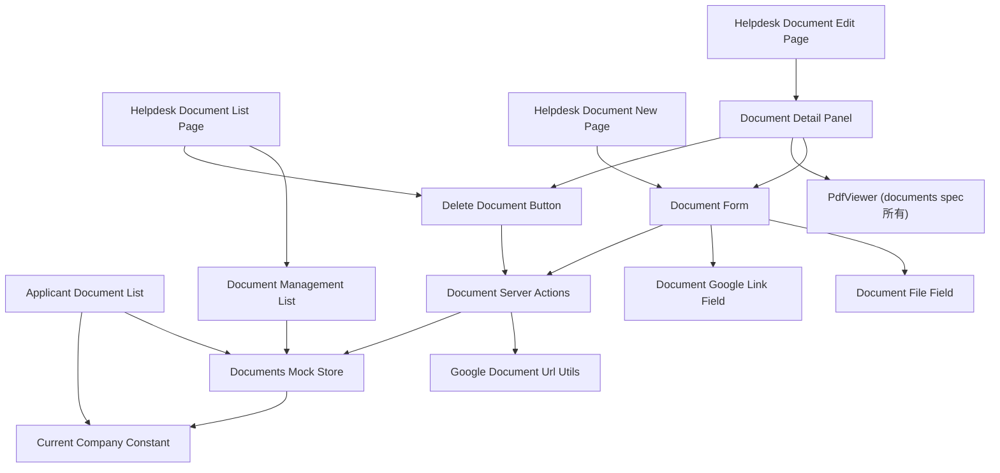
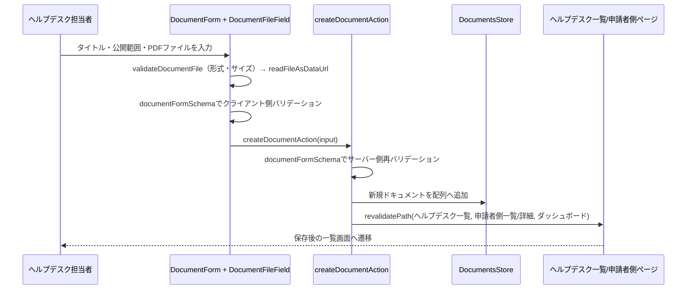
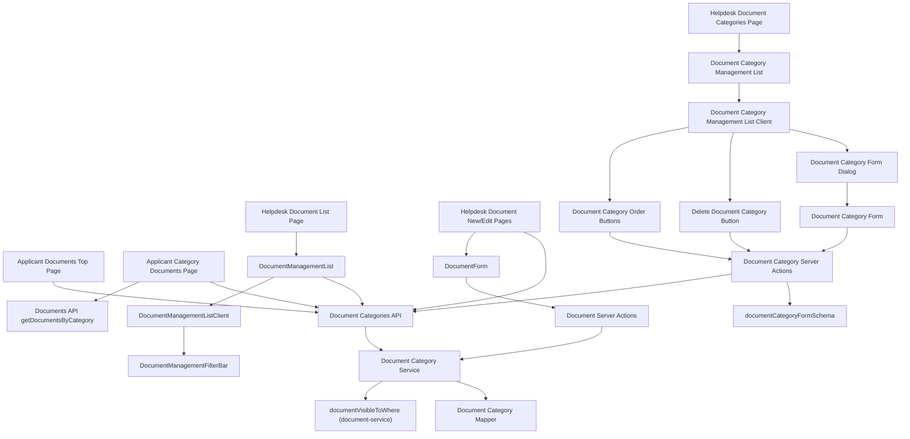

# 技術設計書: documents-management

## Overview

**Purpose**: 本機能は、ヘルプデスク担当者がPDFドキュメントをアップロードし、公開範囲（全体公開／国単位／販社単位）を指定して登録・編集・削除できる管理画面（`/helpdesk/documents`配下）を提供する。あわせて、申請者側の閲覧機能（`documents`spec）が依存するデータモデル・読み取り専用モックAPIの型契約を本specが所有・提供する。

**Users**: 日本側ヘルプデスク担当者が、業務マニュアル等のPDFを海外販社へ配布する際に利用する。

**Impact**: 現状存在しない`Document`型・`DocumentTargeting`型・販社マスタ（`DOCUMENT_COMPANY_OPTIONS`）を新規に定義する。既存の`AnnouncementTargeting`（判別可能ユニオン型による配信対象指定）・`InquiryAttachment`（Base64データURLによるファイル保持）・`announcements-management`のCRUDパターン（Server Actions + `getGlobalMockStore`）をすべて踏襲し、新しい抽象化は導入しない。2026-07-16追記: PDFアップロードに加え、Googleドキュメント/スプレッドシート/スライドの共有リンクを登録する方式（`sourceType: "google"`）を追加する。`Document`型を`sourceType`による判別可能ユニオン型へ変更し、共有リンクURLを埋め込み用URLへ変換する純粋関数を新設する（詳細は`research.md`を参照）。

### Goals
- ヘルプデスク担当者がPDFドキュメントをアップロード・編集・削除できる
- ドキュメントごとに公開範囲（全体公開／国単位／販社単位）を指定できる
- アップロードするファイルの形式（PDFのみ）・サイズ（20MB以下）を検証する
- 変更操作の完了後、申請者側の一覧・詳細表示に確実に反映される
- 既存の`announcements-management`・`inquiry-form`のパターンを踏襲し、新規の抽象化・依存ライブラリを追加しない
- （2026-07-16追記）ヘルプデスク担当者がPDF再アップロードなしに、Googleドキュメント/スプレッドシート/スライドの共有リンクを登録できる
- （2026-07-16追記）登録方式（アップロード／Googleリンク）によらず、既存の一覧・公開範囲指定・削除・申請者側反映の仕組みをそのまま適用する

### Non-Goals
- 申請者側のドキュメント一覧・詳細画面のレイアウト・PDFビューア実装自体（`documents`spec所有）
- 認証・ロールベースアクセス制御（フェーズ3以降）
- PDF以外のファイル形式のアップロード対応
- 実ファイルストレージ（S3等）への保存（フェーズ1はBase64データURL方式を継続。フェーズ3で置き換え、その際に上限値を再検討する）
- リンク集（`links-page`spec）の`document`カテゴリとの統合
- （2026-07-16追記）Google Drive APIによる変更検知・自動再同期・OAuth連携（埋め込み表示がGoogle側から都度最新のコンテンツを配信することに委ねる）
- （2026-07-16追記）Google側のファイル共有設定（「リンクを知っている全員」等）の検証・強制（ポータル側からは制御不能なため、運用上の注意点として扱う）

## Boundary Commitments

### This Spec Owns
- `/[locale]/helpdesk/documents`・`/[locale]/helpdesk/documents/new`・`/[locale]/helpdesk/documents/[id]/edit`配下の全ページ（2026-07-09追記: `/[locale]/helpdesk/documents/[id]/edit`は表示モード（登録済み情報＋PDFプレビュー）と編集モード（既存フォーム＋PDFプレビュー）をクライアント状態で切り替える構成に変更。2026-07-09追記②: 遷移直後の初期モードを表示モードから編集モードへ変更）
- `Document`型・`DocumentTargeting`型（`src/types/document.ts`、新規）
- 販社マスタ`DOCUMENT_COMPANY_OPTIONS`（`src/lib/constants/document-company-options.ts`、新規）
- ドキュメントの検証定数（`DOCUMENT_MAX_FILE_SIZE_BYTES`・`DOCUMENT_ALLOWED_MIME_TYPES`、`src/lib/constants/document.ts`、新規）
- ドキュメントの作成・編集・削除のServer Actions・モックAPIミューテーション・バリデーションスキーマ
- ドキュメント一覧・詳細取得の読み取り専用モック関数（`getDocuments`・`getDocumentById`）の型契約とシード実装（`documents`specが依存する側）
- `src/lib/constants/current-company.ts`への`companyCode`フィールドの追加（既存フィールドは変更しない）
- `HelpdeskSidebar`への「ドキュメント管理」ナビゲーション項目の追加
- （2026-07-16追記）`Document`型の`sourceType: "upload" | "google"`判別可能ユニオン化、Googleリンク登録用フィールド（`googleUrl`・`googleEmbedUrl`）の定義
- （2026-07-16追記）Googleドキュメント共有リンクのURLパターン検証・埋め込み用URL変換ロジック（`toGoogleEmbedUrl`、`src/lib/google-document-url.ts`、新規）
- （2026-07-16追記）登録方法（アップロード／Googleリンク）を切り替えるフォームUI（`DocumentForm`の拡張）とGoogleリンク専用の入力フィールド（`DocumentGoogleLinkField`、新規）

### Out of Boundary
- `documents`spec所有の申請者側`DocumentList`・`DocumentDetail`・`PdfViewer`のレイアウト・実装（2026-07-16追記: `PdfViewer`の`sourceType`分岐対応自体は`documents`spec側の設計・実装とする。本specは`sourceType`に応じた`props`をPdfViewerへ渡す呼び出し側のみを担う）
- `helpdesk-portal-layout`が所有するルートセグメント構造・`HelpdeskAppShell`・`HelpdeskHeader`自体の変更
- 認証・ロールベースアクセス制御の実装
- リンク集（`links-page`spec）の型・画面・データ
- （2026-07-16追記）Google Drive API・OAuth連携、Googleファイルの共有設定の検証・自動化

### Allowed Dependencies
- `announcements-management`が確立したServer Actions + `getGlobalMockStore`パターン（`src/lib/mock-store.ts`）
- `inquiry-form`が確立したファイルユーティリティ（`readFileAsDataUrl`・`formatFileSize`、`src/lib/attachment-utils.ts`）
- 既存の`INQUIRY_COUNTRY_CODES`（公開範囲の国選択肢として再利用）
- 既存のUIプリミティブ（`Card`, `Button`, `Select`, `Input`, `Textarea`, `Label`）
- `HelpdeskSidebar`（項目追加のみ）
- `documents`spec所有の`PdfViewer`コンポーネント（`src/components/features/documents/PdfViewer.tsx`、読み取り専用の表示コンポーネントとしてそのまま再利用。2026-07-09追記: 表示モード・編集モードのPDFプレビューに使用。2026-07-16追記: `documents`specが`sourceType`分岐に対応した拡張版`PdfViewer`を提供する前提とし、本specはそのpropsインターフェースに従って呼び出す）

### Revalidation Triggers
- `Document`/`DocumentTargeting`型のフィールド追加・変更（`documents`specが再確認する必要がある）
- `MOCK_CURRENT_COMPANY`への`companyCode`フィールド追加（`announcements.ts`・`inquiries.ts`など既存の参照元に影響がないか確認）
- `getDocuments`/`getDocumentById`の関数シグネチャ変更（`documents`specの実装前提が変わる）
- （2026-07-16追記）`Document`型を`sourceType`判別可能ユニオン型へ変更したこと自体（`documents`spec側の`PdfViewer`・一覧表示コンポーネントで型ガード・`sourceType`分岐の追加が必要）
- （2026-07-16追記）`PdfViewer`のprops契約変更（`documents`spec側の設計変更を本specが呼び出し側として追随する必要がある）

## Architecture

### Existing Architecture Analysis
`announcements-management`specが確立したCRUDパターン（`lib/api/*.ts`の`getGlobalMockStore`による可変配列 + `lib/validation/*.ts`のzodスキーマ + `lib/actions/*.ts`のServer Actions + `mode: "create"|"edit"`共用フォーム）をそのまま踏襲する。ファイル本体の扱いは`inquiry-form`の`InquiryAttachment`（Base64データURL）パターンを踏襲するが、1ドキュメント=1PDFの1対1関係のため複数ファイル・件数制限の概念は持たない専用の型・ユーティリティを新設する。2026-07-16追記: `DocumentTargeting`が確立した判別可能ユニオン型パターンを`Document`型自体の`sourceType`分岐にも適用し、既存の型設計方針を一貫して踏襲する（詳細は`research.md`の Design Decisions を参照）。

### Architecture Pattern & Boundary Map
`announcements-management`と同一のパターンを踏襲する。2026-07-16追記: 登録方法の分岐（アップロード／Googleリンク）はフォーム内のクライアント状態として持ち、送信データの形は`documentFormSchema`の判別可能ユニオンで検証する。埋め込みURL変換はServer Action内の純粋関数呼び出しとして行い、新規の外部通信・ライブラリは導入しない。


```mermaid
graph TB
    HelpdeskDocumentListPage[Helpdesk Document List Page]
    HelpdeskDocumentNewPage[Helpdesk Document New Page]
    HelpdeskDocumentEditPage[Helpdesk Document Edit Page]
    ApplicantDocumentList[Applicant Document List]

    HelpdeskDocumentListPage --> DocumentManagementList[Document Management List]
    HelpdeskDocumentListPage --> DeleteDocumentButton[Delete Document Button]
    HelpdeskDocumentNewPage --> DocumentForm[Document Form]
    HelpdeskDocumentEditPage --> DocumentDetailPanel[Document Detail Panel]

    DocumentDetailPanel --> DocumentForm
    DocumentDetailPanel --> PdfViewer["PdfViewer (documents spec所有)"]
    DocumentDetailPanel --> DeleteDocumentButton

    DocumentForm --> DocumentFileField[Document File Field]
    DocumentForm --> DocumentGoogleLinkField[Document Google Link Field]
    DocumentForm --> DocumentActions[Document Server Actions]
    DeleteDocumentButton --> DocumentActions

    DocumentActions --> GoogleDocumentUrlUtils[Google Document Url Utils]
    DocumentActions --> DocumentsStore[Documents Mock Store]

    DocumentManagementList --> DocumentsStore
    ApplicantDocumentList --> DocumentsStore

    DocumentsStore --> CurrentCompany[Current Company Constant]
    ApplicantDocumentList --> CurrentCompany
```

**Architecture Integration**:
- 選択パターン: Server Actions + `globalThis`共有ストア（`announcements-management`と同一パターン）
- ドメイン境界: ドキュメントデータは単一の`DocumentsStore`（`lib/api/documents.ts`が所有する配列）に集約し、ヘルプデスク側（無絞り込み）と申請者側（自社可視性スコープ）の両方がここから読む
- 既存パターンの維持: フォームは`react-hook-form`+`zod`、ページ構成（一覧→新規作成/編集）は`helpdesk-announcements`と同じNext.js App Router構成を踏襲
- 新規コンポーネントの理由: PDFファイルの選択・検証・Base64変換はクライアント状態境界を持つため、`AttachmentField`を汎用化するのではなく単一ファイル専用の`DocumentFileField`として新設する（`AttachmentField`は複数ファイル・件数制限を前提とした`inquiry-form`所有のコンポーネントであり、責務混在を避けるため）。2026-07-09追記: 既存ドキュメント画面の表示/編集モード切り替えは、`DocumentForm`（既存, 変更なし）の外側にモード状態を持つ`DocumentDetailPanel`を新設して実現する。`DocumentForm`自体にモード切り替えを組み込むと、新規作成フローとの責務が混在するため避ける。2026-07-16追記: `DocumentGoogleLinkField`を`DocumentFileField`と並立する専用コンポーネントとして新設する（両者は排他的に表示されるが、責務が異なる＝ファイル読み込み検証 vs URL文字列検証のため、条件分岐を1コンポーネントに詰め込まず分離する）。URL⇔埋め込みURL変換は`DocumentFileField`/`DocumentGoogleLinkField`のどちらにも依存しない独立した純粋関数（`GoogleDocumentUrlUtils`）として新設し、クライアント側検証・サーバー側検証の両方から共用する
- Steering準拠: 表示テキストは全て`next-intl`翻訳キー経由、モックAPIは`lib/api/`に抽象化という既存規約を維持

### Technology Stack

| Layer | Choice / Version | Role in Feature | Notes |
|-------|------------------|-----------------|-------|
| Frontend | Next.js App Router（既存, 14.2.35） | ページ構成・Server Actions | `announcements-management`と同一パターン |
| Forms | react-hook-form + zod（既存） | ドキュメント作成・編集フォームのバリデーション | `discriminatedUnion`で公開範囲を検証 |
| UI | shadcn/ui（既存） | `Select`（公開範囲・国・販社選択）, `Input type="file"` | 新規UIプリミティブの追加は不要。削除確認はブラウザ標準`confirm()`を使用 |
| Data / Mock | `lib/api/documents.ts`の可変配列 + `getGlobalMockStore` | ドキュメントのCRUD状態管理 | フェーズ1限定。開発サーバー再起動でリセットされる |
| File Handling | `FileReader.readAsDataURL`（既存パターン踏襲） | PDFファイルのBase64データURL変換 | 新規ライブラリは導入しない |

## File Structure Plan

### Directory Structure
```
src/app/[locale]/helpdesk/documents/
├── page.tsx                        # 一覧（全件表示・削除導線）
├── new/
│   └── page.tsx                    # 新規作成
└── [id]/
    └── edit/
        └── page.tsx                 # 編集・削除

src/components/features/helpdesk-documents/
├── DocumentManagementList.tsx       # Server: 全件取得・一覧表示（2026-07-16追記: 登録方式バッジ表示を追加）
├── DocumentForm.tsx                 # Client: 新規作成・編集共用フォーム（公開範囲選択を含む。2026-07-16追記: 登録方法の選択を追加）
├── DocumentFileField.tsx            # Client: 単一PDFファイルの選択・検証・Base64変換
├── DocumentGoogleLinkField.tsx      # Client（新規, 2026-07-16）: Googleドキュメント共有リンクURLの入力・検証
├── DocumentDetailPanel.tsx          # Client（新規, 2026-07-09）: 表示/編集モード切り替え + PdfViewerの組み込み
└── DeleteDocumentButton.tsx         # Client: confirm()による確認 + 削除アクション呼び出し

src/lib/api/
└── documents.ts                     # 新規: getDocuments/getDocumentById（申請者側）、getAllDocuments/getDocumentByIdForHelpdesk/create/update/delete

src/lib/actions/
└── documents.ts                     # 新規: "use server" Server Actions（create/update/delete）

src/lib/validation/
└── document.ts                      # 新規: ドキュメントフォームのzodスキーマ（公開範囲のdiscriminatedUnion含む。2026-07-16追記: sourceTypeのdiscriminatedUnion化）

src/lib/document-utils.ts            # 新規: validateDocumentFile（size/typeのみ）。2026-07-09追記: targetingLabel（公開範囲の表示ラベル整形、DocumentManagementListから移動）を追加

src/lib/google-document-url.ts       # 新規（2026-07-16）: parseGoogleDocumentUrl（URLパターン判定）・toGoogleEmbedUrl（埋め込み用URL変換）の純粋関数

src/lib/constants/
├── document.ts                      # 新規: DOCUMENT_MAX_FILE_SIZE_BYTES, DOCUMENT_ALLOWED_MIME_TYPES
├── document-company-options.ts      # 新規: DOCUMENT_COMPANY_CODES, DOCUMENT_COMPANY_OPTIONS
└── current-company.ts               # 変更: MOCK_CURRENT_COMPANYにcompanyCodeフィールドを追加

src/types/
└── document.ts                      # 新規: Document, DocumentTargeting, CreateDocumentInput（2026-07-16追記: Documentをsource Typeによる判別可能ユニオン型へ変更）

src/components/layout/
└── HelpdeskSidebar.tsx               # 変更: 「ドキュメント管理」ナビゲーション項目を追加

messages/
├── ja.json                          # 変更: helpdeskDocuments名前空間、helpdeskNavへのキー追加
└── en.json                          # 同上
```

### Modified Files
- `src/lib/constants/current-company.ts` — `MOCK_CURRENT_COMPANY`に`companyCode: "vn-daiso-vietnam"`を追加（既存フィールドは変更しない、既存の参照元である`announcements.ts`・`inquiries.ts`の挙動に影響なし）
- `src/components/layout/HelpdeskSidebar.tsx` — `HELPDESK_NAV_ITEMS`に1項目追加
- `messages/ja.json` / `messages/en.json` — 新規名前空間・キーの追加。2026-07-09追記: `helpdeskDocuments.form`に`detailTitle`・`editButton`・`cancelButton`を追加。2026-07-16追記: `helpdeskDocuments.form`に`sourceTypeLabel`・`sourceTypeUploadOption`・`sourceTypeGoogleOption`・`googleUrlLabel`・`googleUrlPlaceholder`・`googleUrlHint`・`googleUrlInvalidMessage`、`helpdeskDocuments.list`に`sourceTypeUploadBadge`・`sourceTypeGoogleBadge`を追加
- `src/app/[locale]/helpdesk/documents/[id]/edit/page.tsx`（2026-07-09追記） — データ取得・翻訳解決はServer Componentとして維持しつつ、`DocumentForm`を直接呼ぶ代わりに`DocumentDetailPanel`へ表示用props・フォーム用propsをまとめて渡す
- `src/components/features/helpdesk-documents/DocumentManagementList.tsx`（2026-07-09追記） — ローカル定義の`targetingLabel`関数を`src/lib/document-utils.ts`へ移動し、インポートに置き換える。2026-07-16追記: 各行に登録方式バッジを追加

> `documents`spec所有の申請者側`DocumentList`・`DocumentDetail`・`PdfViewer`は本specでは変更しない。これらが呼び出す`lib/api/documents.ts`の`getDocuments`/`getDocumentById`の型インターフェースを本specが定義・実装する。

## System Flows

ドキュメントの作成・編集・削除はいずれも「Client Component → Server Action → モックストア更新 → revalidatePath」という同一パターンに従う（`announcements-management`の削除フローと同型）ため、代表として新規作成フローを図示する。


```mermaid
sequenceDiagram
    participant User as ヘルプデスク担当者
    participant Form as DocumentForm + DocumentFileField
    participant Action as createDocumentAction
    participant Store as DocumentsStore
    participant Pages as ヘルプデスク一覧/申請者側ページ

    User->>Form: タイトル・公開範囲・PDFファイルを入力
    Form->>Form: validateDocumentFile（形式・サイズ）→ readFileAsDataUrl
    Form->>Form: documentFormSchemaでクライアント側バリデーション
    Form->>Action: createDocumentAction(input)
    Action->>Action: documentFormSchemaでサーバー側再バリデーション
    Action->>Store: 新規ドキュメントを配列へ追加
    Action->>Pages: revalidatePath(ヘルプデスク一覧, 申請者側一覧/詳細, ダッシュボード)
    Pages-->>User: 保存後の一覧画面へ遷移
```

- 編集・削除も同様に、Server Action内でzodスキーマ（`documentFormSchema`）によるサーバー側バリデーションを行った後、モックストアを更新し、影響範囲の全ルート（ヘルプデスク側・申請者側）を`revalidatePath`で再検証する。

## Requirements Traceability

| Requirement | Summary | Components | Interfaces | Flows |
|-------------|---------|------------|------------|-------|
| 1.1〜1.6 | ヘルプデスク側ドキュメント一覧 | DocumentManagementList | DocumentsMockApi (Service) | — |
| 2.1〜2.5 | ドキュメントの新規アップロード | DocumentForm, DocumentFileField, DocumentActions | Service | 新規作成フロー |
| 3.1〜3.5 | ドキュメントの編集 | DocumentForm, DocumentActions | Service | 新規作成フローと同型 |
| 4.1〜4.3 | ドキュメントの削除 | DeleteDocumentButton, DocumentActions | Service | 新規作成フローと同型 |
| 5.1〜5.5 | 公開範囲の指定 | DocumentForm, DocumentsMockApi（バリデーション） | Service | — |
| 6.1〜6.4 | PDFファイルの検証 | DocumentFileField, validateDocumentFile, documentFormSchema | Service | 新規作成フロー |
| 7.1〜7.2 | ナビゲーション統合 | HelpdeskSidebar | — | — |
| 8.1〜8.2 | 申請者側表示への反映 | DocumentActions（revalidatePath） | Service | 新規作成フロー |
| 9.1〜9.2 | 多言語対応 | 全新規コンポーネント | — | — |
| 10.1 | レスポンシブ対応 | （既存HelpdeskAppShellに依存、新規コンポーネントなし） | — | — |
| 11.1〜11.8 | 既存ドキュメント画面のプレビュー表示とビュー/編集切り替え（2026-07-09追記） | DocumentDetailPanel, PdfViewer（`documents`spec所有） | Service | — |
| 12.1〜12.4 | 一覧からの遷移時に編集モードを初期表示（2026-07-09追記②、11.1/11.3を上書き） | DocumentDetailPanel | Service | — |
| 13.1〜13.11 | Googleドキュメント/スプレッドシートの共有リンクによる登録（2026-07-16追記） | DocumentForm, DocumentGoogleLinkField, GoogleDocumentUrlUtils, DocumentActions, DocumentManagementList, DocumentDetailPanel | Service | 新規作成フロー（Google分岐） |

## Components and Interfaces

| Component | Domain/Layer | Intent | Req Coverage | Key Dependencies (P0/P1) | Contracts |
|-----------|--------------|--------|---------------|---------------------------|-----------|
| DocumentManagementList | UI/Server | 全件のドキュメントを取得・一覧表示（登録方式バッジ含む） | 1.1〜1.6, 13.9 | DocumentsMockApi (P0) | State |
| DocumentForm | UI/Client | タイトル・説明・公開範囲・登録方法（アップロード/Googleリンク）・ファイルまたはURLの入力・送信 | 2.1〜2.4, 3.1〜3.4, 5.1〜5.4, 13.1〜13.2, 13.4, 13.8 | DocumentFileField (P0), DocumentGoogleLinkField (P0), DocumentActions (P0) | State |
| DocumentFileField | UI/Client | 単一PDFファイルの選択・検証・Base64変換・プレビュー | 2.5, 6.1〜6.2 | validateDocumentFile (P0), readFileAsDataUrl (P0) | State |
| DocumentGoogleLinkField | UI/Client | GoogleドキュメントURLの入力・クライアント側パターン検証 | 13.2〜13.3 | GoogleDocumentUrlUtils (P0) | State |
| DeleteDocumentButton | UI/Client | 削除確認・削除アクション呼び出し | 4.1〜4.3 | DocumentActions (P0) | State |
| DocumentDetailPanel | UI/Client | 既存ドキュメント画面の表示/編集モード切り替え、表示モードでの読み取り専用情報＋プレビュー表示 | 11.1〜11.8, 12.1〜12.4, 13.6, 13.8 | DocumentForm (P0), PdfViewer（`documents`spec所有, P0）, DeleteDocumentButton (P1) | State |
| GoogleDocumentUrlUtils | Data/Util | GoogleドキュメントURLパターン判定と埋め込み用URLへの変換 | 13.3, 13.5 | なし（純粋関数） | Service |
| DocumentsMockApi | Data/Mock | ドキュメントの読み取り（自社可視性スコープ/無絞り込み）・CRUD | 1.1, 5.5, 8.1, 13.10 | Document型 (P0), CurrentCompany (P0) | Service |
| DocumentActions | Server Actions | モックAPIのCRUDを呼び出し、`revalidatePath`で再検証する | 2.3, 3.4, 4.3, 6.4, 8.1, 13.3〜13.7 | DocumentsMockApi (P0), GoogleDocumentUrlUtils (P0) | Service |

### Data / Mock API

#### DocumentsMockApi

| Field | Detail |
|-------|--------|
| Intent | 申請者側には自社可視性スコープのドキュメントのみを、ヘルプデスク側には全件を提供し、CRUDを行う |
| Requirements | 1.1, 5.5, 8.1 |

**Responsibilities & Constraints**
- `getDocuments`・`getDocumentById`（申請者側）は、`targeting.scope === "all"`、または`targeting.scope === "countries" && targeting.countries.includes(CurrentCompany.country)`、または`targeting.scope === "companies" && targeting.companyCodes.includes(CurrentCompany.companyCode)`のいずれかを満たすドキュメントのみを返す
- `getAllDocuments`・`getDocumentByIdForHelpdesk`（ヘルプデスク側）は絞り込みを行わない
- ミューテーション（作成・編集・削除）は`getGlobalMockStore`で保持する配列を直接更新する

**Dependencies**
- Inbound: `DocumentActions`（P0）, `DocumentManagementList`（P0）, `documents`spec所有の`DocumentList`/`DocumentDetail`（読み取り専用、P0）
- Outbound: `src/lib/constants/current-company.ts`（P0）

**Contracts**: Service [x]

##### Service Interface
```typescript
interface DocumentsMockApi {
  getDocuments(): Promise<Document[]>;
  getDocumentById(id: string): Promise<Document | null>;
  getAllDocuments(): Promise<Document[]>;
  getDocumentByIdForHelpdesk(id: string): Promise<Document | null>;
  createDocument(input: CreateDocumentInput): Promise<Document>;
  updateDocument(id: string, input: CreateDocumentInput): Promise<Document>;
  deleteDocument(id: string): Promise<void>;
}
```
- Preconditions: `updateDocument`/`deleteDocument`の`id`は存在するドキュメントのIDであること
- Postconditions: `createDocument`で作成されたドキュメントは、可視性条件を満たせば直後の`getDocuments`の結果に反映される
- Invariants: `getDocuments()`が返す配列は`getAllDocuments()`が返す配列の部分集合である

**Implementation Notes**
- Integration: `documents`spec は本インターフェースの`getDocuments`/`getDocumentById`のみを利用する（型・戻り値を変更しない限り、申請者側の実装に影響しない）
- Validation: 存在しないIDに対する`updateDocument`/`deleteDocument`はエラーをthrowする
- Risks: プロセス再起動でリセットされる（フェーズ1のモック制約）

### Utilities

#### GoogleDocumentUrlUtils

| Field | Detail |
|-------|--------|
| Intent | Googleドキュメント/スプレッドシート/スライドの共有リンクURLを判定し、iframe埋め込み用のプレビューURLへ変換する |
| Requirements | 13.3, 13.5 |

**Responsibilities & Constraints**
- `docs.google.com/document/`, `docs.google.com/spreadsheets/`, `docs.google.com/presentation/`のいずれかのパスに一致するURLからファイルIDを抽出する
- 一致しないURL（他ドメイン、不正な形式）に対しては変換不能を表す結果を返す（例外は投げない）
- 変換後の埋め込みURLは`{種別のパス}/d/{ファイルID}/preview`に統一する（`research.md`のDesign Decisions参照）
- クライアント側（`DocumentGoogleLinkField`）・サーバー側（`DocumentActions`内の`documentFormSchema`によるURL形式再検証）の両方から同一実装を呼び出す純粋関数として実装し、DOM・ネットワークアクセスを行わない

**Dependencies**
- Inbound: `DocumentGoogleLinkField`（P0）, `DocumentActions`（P0）
- Outbound: なし

**Contracts**: Service [x]

##### Service Interface
```typescript
type GoogleDocumentKind = "document" | "spreadsheets" | "presentation";

interface GoogleDocumentUrlUtils {
  parseGoogleDocumentUrl(url: string): { kind: GoogleDocumentKind; fileId: string } | null;
  toGoogleEmbedUrl(url: string): string | null;
}
```
- Preconditions: `url`はトリム済みの文字列であること
- Postconditions: 有効なGoogleドキュメント/スプレッドシート/スライドのURLであれば埋め込み用URLを返し、それ以外は`null`を返す
- Invariants: 同一の入力URLに対して常に同一の結果を返す（副作用を持たない）

**Implementation Notes**
- Integration: `documentFormSchema`（`sourceType: "google"`ブランチ）は`toGoogleEmbedUrl(googleUrl) !== null`を`refine`条件として利用し、要件13.3のエラーメッセージをトリガーする
- Validation: ファイルID抽出には英数字・ハイフン・アンダースコアのみを許容する
- Risks: Google側が将来URLパターンを変更した場合、本ユーティリティの正規表現を追随して更新する必要がある（外部サービス仕様への依存はこの1関数に閉じ込める）

### Server Actions

#### DocumentActions

| Field | Detail |
|-------|--------|
| Intent | クライアントからのドキュメント作成・編集・削除操作を受け、サーバー側バリデーション・ミューテーション・関連ルートの再検証を行う |
| Requirements | 2.2〜2.3, 3.2, 3.4, 4.3, 5.4, 6.4, 8.1, 13.3〜13.7 |

**Responsibilities & Constraints**
- 全ての関数に`"use server"`を付与する
- `createDocumentAction`・`updateDocumentAction`は`documentFormSchema`（zod）でタイトル・公開範囲・ファイル形式/サイズ（`sourceType: "upload"`）またはGoogleURL形式（`sourceType: "google"`、`GoogleDocumentUrlUtils.toGoogleEmbedUrl`による`refine`）を検証し、不正な入力は保存せず例外を送出する
- `sourceType: "google"`の保存時、`googleEmbedUrl`は`GoogleDocumentUrlUtils.toGoogleEmbedUrl(googleUrl)`の結果をサーバー側で再計算して保存する（クライアントから送られた埋め込みURLをそのまま信頼しない）
- 各操作の最後に、ヘルプデスク側一覧・編集、申請者側一覧・詳細ルートを`revalidatePath`で再検証する

**Dependencies**
- Inbound: `DocumentForm`, `DeleteDocumentButton`（いずれもP0）
- Outbound: `DocumentsMockApi`（P0）, `GoogleDocumentUrlUtils`（P0）

**Contracts**: Service [x]

##### Service Interface
```typescript
interface DocumentActions {
  createDocumentAction(input: CreateDocumentInput): Promise<Document>;
  updateDocumentAction(id: string, input: CreateDocumentInput): Promise<Document>;
  deleteDocumentAction(id: string): Promise<void>;
}
```
`CreateDocumentInput`は2026-07-16追記により`sourceType`で分岐する判別可能ユニオン型となる（Data Models参照）。
- Preconditions: `input`はクライアント側で`react-hook-form`+`zod`によりバリデーション済みであること（サーバー側でも同一スキーマで再検証する）
- Postconditions: 成功時、対象ルート群が再検証され、次回アクセス時に最新状態が反映される
- Invariants: バリデーション失敗時はストアを変更しない

**Implementation Notes**
- Integration: `revalidatePath`の対象は`/[locale]/helpdesk/documents`（page）, `/[locale]/helpdesk/documents/[id]/edit`（page）, `/[locale]/documents`（page）, `/[locale]/documents/[id]`（page）
- Validation: サーバー側バリデーションはクライアント側と同一の`documentFormSchema`を再利用する
- Risks: `revalidatePath`の対象漏れがあると一部画面の表示が古いまま残る（実装時に全対象を確実に含める）

### Presentation Components（サマリーのみ）

- **DocumentManagementList**: `getAllDocuments()`をアップロード日降順で表示し、各行に編集リンクと`DeleteDocumentButton`を配置する。既存`AnnouncementManagementList`と同じ構造パターンを踏襲する。2026-07-16追記: 各行に`sourceType`に応じたバッジ（「アップロード」／「Googleリンク」）を表示する。
- **DocumentForm**: タイトル・説明（任意）・公開範囲（全体公開／国単位／販社単位）・登録方法（アップロード／Googleリンク、2026-07-16追記）・`DocumentFileField`または`DocumentGoogleLinkField`を持つ`react-hook-form`+`zod`フォーム。新規作成・編集で共用する。編集時にファイルを再選択しない場合は既存の`fileName`/`fileType`/`fileSize`/`dataUrl`を保持する（`sourceType: "upload"`の場合のみ）。2026-07-16追記: 登録方法を切り替えると対応するサブフィールド（`DocumentFileField`／`DocumentGoogleLinkField`）を出し分け、送信時の値の形は`sourceType`で判別する。既存ドキュメントの編集時は登録済みの`sourceType`を初期選択とする。
- **DocumentFileField**: `<Input type="file" accept="application/pdf">`（単一ファイル）。選択→`validateDocumentFile`→`readFileAsDataUrl`→ファイル名・サイズのみのプレビュー表示（画像プレビューは不要）。
- **DocumentGoogleLinkField**（2026-07-16新規）: `<Input type="url">`。入力値の変更時・フォーム送信時に`GoogleDocumentUrlUtils.toGoogleEmbedUrl`で検証し、`null`が返る場合は要件13.3のエラーメッセージを表示する。
- **DeleteDocumentButton**: クリック時に`confirm()`でユーザーに確認し、確認後に`deleteDocumentAction`を呼び出す。
- **DocumentDetailPanel**（2026-07-09追記、2026-07-09追記②で初期値変更）: `mode: "view" | "edit"`をローカル状態（`useState`、初期値`"edit"`）で管理する。`view`時はタイトル・説明・`targetingLabel`による公開範囲要約・ファイルサイズ・アップロード日（`sourceType: "upload"`時）または登録方式・元URL（`sourceType: "google"`時）を読み取り専用で表示し、その直下に`PdfViewer`（`documents`spec所有、`sourceType`に応じたpropsを渡す）を配置、「編集」ボタン・`DeleteDocumentButton`・一覧へ戻るリンクを表示する。`edit`時は既存の`DocumentForm`（`mode="edit"`, 変更なし）と`PdfViewer`を並べて表示し、「キャンセル」ボタンで`mode`を`"view"`に戻す（保存は行わない）。ページ遷移は発生しない。一覧の「編集」リンクから遷移した直後は`edit`モードで表示され、`view`モードには編集モードで「キャンセル」を押した場合にのみ遷移する。

## Data Models

### Domain Model
- `Document`（2026-07-16追記: `sourceType`による判別可能ユニオン型へ変更）: 共通フィールド`id`, `title`, `description?`, `targeting`, `uploadedAt`に加え、`sourceType: "upload"`ブランチは`fileName`, `fileType`, `fileSize`, `dataUrl`を、`sourceType: "google"`ブランチは`googleUrl`, `googleEmbedUrl`を持つ
- `DocumentTargeting`（新規）: `{ scope: "all" } | { scope: "countries"; countries: string[] } | { scope: "companies"; companyCodes: string[] }`の判別可能なユニオン型
- `CreateDocumentInput`（新規）: `Omit<Document, "id" | "uploadedAt">`（`Document`と同様に`sourceType`で分岐する判別可能ユニオン型）

### Logical Data Model
- `Document`は単一エンティティ。`targeting`は`Document`に埋め込まれた値オブジェクトであり、別エンティティとしての関連は持たない。
- 販社マスタ（`DOCUMENT_COMPANY_OPTIONS`）は`Document`とは独立した参照専用の静的データであり、`targeting.companyCodes`が参照するのみで外部キー制約は持たない（フェーズ1はDBを持たないため）。
- （2026-07-16追記）`sourceType`は`Document`のエンティティ内で不変ではない点に注意（編集時に登録方式自体を変更可能。要件13.8）。ただし1つの`Document`インスタンスは常にどちらか一方のブランチのフィールドのみを持ち、両ブランチのフィールドが混在することはない。

### Data Contracts & Integration

| 型 | 主なフィールド | 備考 |
|---|---|---|
| `Document`（`sourceType: "upload"`） | `id`, `title`, `description?`, `sourceType: "upload"`, `fileName`, `fileType`, `fileSize`, `dataUrl`, `targeting`, `uploadedAt` | `fileType`は`"application/pdf"`固定値 |
| `Document`（`sourceType: "google"`、2026-07-16新規） | `id`, `title`, `description?`, `sourceType: "google"`, `googleUrl`, `googleEmbedUrl`, `targeting`, `uploadedAt` | `googleUrl`はヘルプデスク担当者が入力した元の共有リンク、`googleEmbedUrl`は`GoogleDocumentUrlUtils.toGoogleEmbedUrl`で変換したiframe埋め込み用URL（サーバー側で再計算して保存） |
| `DocumentTargeting` | `{scope:"all"}` \| `{scope:"countries", countries:string[]}` \| `{scope:"companies", companyCodes:string[]}` | `countries`は`INQUIRY_COUNTRY_CODES`、`companyCodes`は`DOCUMENT_COMPANY_CODES`のいずれか |
| `CreateDocumentInput` | `Document`から`id`・`uploadedAt`を除いたサブセット（`sourceType`で分岐、2026-07-16追記） | `uploadedAt`はサーバー側で保存時刻を採番。`sourceType: "google"`時は`googleEmbedUrl`もサーバー側で再計算する |
| `DOCUMENT_COMPANY_OPTIONS` | `code`, `companyName`, `country` | フェーズ1の仮マスタ。フェーズ3で実際の販社マスタAPIに置き換える前提 |

## Error Handling

### Error Strategy
`announcements-management`と同様のパターンを踏襲する。Server Componentは取得失敗時にtry/catchでエラーメッセージを表示し、Server Actionsは不正な入力・存在しないIDに対してエラーをthrowし、呼び出し元のクライアントコンポーネントがエラー状態を表示する。

### Error Categories and Responses
- **データ取得失敗**（一覧）: 既存パターンと同様にエラーメッセージを表示
- **存在しないドキュメントIDへの編集・削除操作**: Server Actionがエラーをthrowし、クライアント側でエラー表示にフォールバック
- **入力値不正**（タイトル未入力、公開範囲の国・販社が0件選択）: クライアント側`zod`バリデーションで送信をブロックし、フィールド単位のエラーメッセージを表示。サーバー側でも同一スキーマで再検証する
- **ファイル形式・サイズ不正**（PDF以外、20MB超過）: `DocumentFileField`内でクライアント側検証しエラーメッセージを表示、Server Action側でも`documentFormSchema`により再検証し不正なら保存せず例外を送出する
- **GoogleドキュメントURL形式不正**（2026-07-16追記、要件13.3・13.4）: `DocumentGoogleLinkField`内で`GoogleDocumentUrlUtils.toGoogleEmbedUrl`による検証結果が`null`の場合、フィールド単位のエラーメッセージを表示し送信をブロックする。Server Action側でも`documentFormSchema`の`sourceType: "google"`ブランチで同一関数により再検証し、不正なら保存せず例外を送出する

### Monitoring
フェーズ1はモックのため、追加のロギング・監視基盤は導入しない。

## Testing Strategy

- **Unit Tests**:
  - `getDocuments`/`getDocumentById`が自社（`CurrentCompany.country`/`companyCode`）を含む、または`scope: "all"`のドキュメントのみを返すこと
  - `getAllDocuments`が絞り込みなしで全件を返すこと
  - `createDocument`/`updateDocument`/`deleteDocument`が対象のドキュメントのみを操作し、他のレコードに影響しないこと
  - `documentFormSchema`がタイトル未入力、`scope: "countries"`/`"companies"`で0件選択、PDF以外の形式、20MB超過を拒否すること
  - `validateDocumentFile`が形式・サイズを正しく判定すること
  - Server Actionsが不正な入力を拒否し、ストアを変更しないこと
- **Integration Tests**:
  - ヘルプデスク側でドキュメントを作成後、申請者側の一覧・詳細に反映されること（可視性条件が一致する場合）
  - 公開範囲外の国・販社向けに作成したドキュメントが、申請者側の一覧・詳細に表示されないこと
  - 削除後、ヘルプデスク側一覧・申請者側一覧の両方から除去されること
  - 編集時にファイルを再選択しない場合、既存ファイルが保持されること
- **E2E/UI Tests**:
  - 日本語・英語両ロケールで一覧・作成・編集画面が表示されること
  - タブレット幅（768px）で新規画面が横スクロールを起こさないこと

**2026-07-09追記（DocumentDetailPanel）**:
- **Unit Tests**:
  - ~~`DocumentDetailPanel`が初期表示（表示モード）でタイトル・説明・公開範囲要約・ファイルサイズ・アップロード日・PDFプレビューを表示し、編集フォームを表示しないこと~~（2026-07-09追記②で下記に置き換え）
  - 「編集」ボタンをクリックすると編集モードに切り替わり、`DocumentForm`とPDFプレビューが両方表示されること
  - 編集モードで「キャンセル」をクリックすると、フォームの変更を保存せず表示モードに戻ること
  - `targetingLabel`（`src/lib/document-utils.ts`）が全体公開／国単位／販社単位の各パターンで正しいラベルを返すこと

**2026-07-09追記②（要件12: 初期モードを編集モードへ変更）**:
- **Unit Tests**:
  - `DocumentDetailPanel`が初期表示（編集モード）で`DocumentForm`とPDFプレビューを表示し、読み取り専用の表示モードは表示しないこと
  - 編集モードで「キャンセル」をクリックすると表示モード（タイトル・説明・公開範囲要約・ファイルサイズ・アップロード日・PDFプレビューを読み取り専用表示）に切り替わること
  - 表示モードで「編集」ボタンをクリックすると再度編集モードに戻ること

**2026-07-16追記（要件13: Googleドキュメント/スプレッドシートの共有リンクによる登録）**:
- **Unit Tests**:
  - `GoogleDocumentUrlUtils.parseGoogleDocumentUrl`/`toGoogleEmbedUrl`が、Docs/Sheets/Slidesの各URLパターンから正しく種別・ファイルIDを抽出し埋め込みURLを生成すること
  - 上記関数が、Google以外のドメインや不正な形式のURLに対して`null`を返すこと
  - `documentFormSchema`が`sourceType: "google"`ブランチで、無効なURLの入力を拒否し、有効なURLを受理すること
  - `documentFormSchema`が`sourceType: "google"`ブランチにおいて、`fileName`/`fileType`/`fileSize`/`dataUrl`を要求しないこと
  - `DocumentForm`が登録方法の選択に応じて`DocumentFileField`と`DocumentGoogleLinkField`を排他的に表示すること
- **Integration Tests**:
  - Googleリンクで作成したドキュメントが、ヘルプデスク一覧・申請者側一覧の両方に、アップロード方式のドキュメントと同様に反映されること（公開範囲フィルタも同様に適用されること）
  - `createDocumentAction`がクライアントから送られた`googleEmbedUrl`をそのまま保存せず、`googleUrl`からサーバー側で再計算した値を保存すること
  - 既存のGoogleリンク型ドキュメントを編集し、URLのみ変更した場合に`googleEmbedUrl`が再計算されること

## Security Considerations
公開範囲フィルタは表示範囲の制御であり、認証・認可の代替ではない。フェーズ1は認証未実装のため、ヘルプデスク側の作成・編集・削除画面は`helpdesk-portal-layout`の前提通り制限なくアクセス可能である。フェーズ3で認証が導入される際、本specのルート境界を変更せずにアクセス制御を追加できることを設計上の前提とする。アップロードされたPDFはBase64データURLとしてサーバーメモリ・クライアント双方に保持されるため、機密性の高い文書の取り扱いはフェーズ3の実ファイルストレージ移行まで運用上の注意が必要である旨を非機能上の制約として明記する。

**2026-07-16追記（Googleドキュメント連携）**: ポータルの公開範囲（`targeting`）は、あくまで「一覧にその項目を表示するかどうか」を制御するものであり、Google側のファイル自体の共有設定（誰がそのGoogleドキュメントを直接閲覧できるか）には一切影響しない。この2つの権限は完全に独立しており、Googleファイル側を「リンクを知っている全員が閲覧可」に設定した場合、ポータルの公開範囲外の第三者であっても、共有リンクを直接入手すればGoogle側でその内容を閲覧できてしまう。本specはこの非対称性を解消する仕組み（Google Drive APIによるアクセス制御・OAuth連携等）を実装しない（Non-Goals参照）ため、`DocumentGoogleLinkField`のヘルプテキスト（要件13.2関連UI文言）に、Google側の共有設定を適切に行う必要がある旨の運用上の注意を含める。また、サーバー側が`googleEmbedUrl`をクライアント入力から信頼せず`googleUrl`から再計算する設計（DocumentActions参照）は、クライアントが任意の埋め込みURLを注入する経路を防ぐための措置である。

## 追加ラウンド（2026-07-22）: ドキュメント管理一覧の検索・絞り込み・ページネーション

### Overview（追加分）
ヘルプデスク側ドキュメント管理一覧（`/helpdesk/documents`）に、キーワード検索・登録方式/公開範囲種別による絞り込み・クライアント側ページネーションを追加する。データ取得（`getAllDocuments`によるサーバー側の全件取得、アップロード日降順）・行の表示項目・編集/削除導線・登録方式バッジ（要件13.9）は変更せず、取得済みの全件配列に対してクライアント側で検索・絞り込み・ページ分割を行う。実装は申請者側`documents`spec の`DocumentListClient`（クライアント状態保持＋`filterDocuments`再利用）のパターンを踏襲する。

### Component Design（追加分）

- **DocumentManagementList（変更・サーバーコンポーネント）**: 現状は`getAllDocuments()`で取得した全件を直接`map`している。取得・エラー/0件ハンドリング・見出し（`ManagementListHeading`）・ラベル辞書（`countryLabels`/`companyLabels`）の生成はサーバー側に残し、行の描画とインタラクティブUIを新規クライアントコンポーネントへ委譲する。取得した`documents`・`locale`・各種ラベル辞書・行描画に必要な翻訳文字列を`DocumentManagementListClient`へprops渡しする。
- **DocumentManagementListClient（新規・クライアントコンポーネント）**: 申請者側`DocumentListClient`に相当する。以下の状態と処理を持つ:
  - 状態: `keyword`（検索語）、`sourceTypeFilter`（`"all" | "upload" | "google"`）、`scopeFilter`（`"all" | "all-scope" | "countries" | "companies"`。表示ラベルと`targeting.scope`の対応に注意）、`page`（現在ページ、1始まり）。
  - 絞り込み: `filterDocuments(documents, keyword)`（`src/lib/document-utils.ts`を再利用、要件14.2）に加え、`sourceType`一致・`targeting.scope`一致の述語を合成する（要件14.3〜14.5）。並び順は入力（アップロード日降順）を維持する（要件14.12）。
  - ページネーション: 絞り込み後配列を1ページ`DOCUMENT_MANAGEMENT_PAGE_SIZE`件（既定10、定数で一元管理）に分割し、現在ページ分のみ`ManagementListRow`で描画する（要件14.9・14.10）。`useMemo`で絞り込み結果とページ総数を算出する。
  - 条件変更時のページリセット: `keyword`/`sourceTypeFilter`/`scopeFilter`変更時に`page`を1へ戻す（要件14.11）。
  - 0件表示: 絞り込み結果が0件のとき「該当するドキュメントがありません」を表示する（要件14.8。既存の全体0件＝`ManagementListMessageCard`とは別の、絞り込み後0件メッセージ）。
  - 行の中身（タイトル・バッジ・ファイルサイズ・アップロード日・公開範囲・編集/削除）は既存`DocumentManagementList`の描画をそのまま移設する。`DeleteDocumentButton`はクライアントコンポーネントのため子として問題なく配置できる。
- **絞り込み・ページネーションUI（新規）**: 検索欄＋絞り込みセレクトを、見出し（`ManagementListHeading`）の下・一覧カード（`ManagementListCard`）の上に配置する。申請者側`DocumentSearchBar`はキーワードのみで管理側の絞り込みセレクトを持たないため、そのままの再利用ではなく、本spec側に管理一覧用の検索・絞り込みバー（例: `DocumentManagementFilterBar`）を新設する（`DocumentSearchBar`のレイアウト方針＝`AnnouncementFilterBar`パターンを参考にする）。ページネーションUI（前へ／次へ・現在ページ/総ページ表示）は本ラウンドで新規に用意する（既存の共有ページネーションコンポーネントは存在しないため、`ManagementList`系と整合する軽量な実装を`helpdesk-documents`配下に置く）。
- **共通ユーティリティの扱い**: `filterDocuments`（`documents`spec がタイトル/説明の部分一致で実装済み・`src/lib/document-utils.ts`）を再利用する。これは読み取り専用の純関数であり、`documents`spec の所有物だが型・シグネチャを変更せず利用するのみのため、隣接仕様との境界（後方互換）に反しない。ページサイズ・絞り込み選択肢の定数は本spec側（`helpdesk-documents`配下または`src/lib/constants`）で定義する。

### Modified / New Files（追加分）
- `src/components/features/helpdesk-documents/DocumentManagementList.tsx`（変更） — 取得・ラベル辞書生成・見出し・エラー/全体0件はサーバー側に残し、行描画とインタラクティブUIを`DocumentManagementListClient`へ委譲
- `src/components/features/helpdesk-documents/DocumentManagementListClient.tsx`（新規） — キーワード/登録方式/公開範囲種別の絞り込み状態、ページネーション状態、絞り込み後0件メッセージ、行描画
- `src/components/features/helpdesk-documents/DocumentManagementFilterBar.tsx`（新規） — キーワード検索欄＋登録方式セレクト＋公開範囲種別セレクト＋条件クリア
- ページネーションUIコンポーネント（新規、例: `src/components/features/helpdesk-documents/DocumentManagementPagination.tsx`、または`helpdesk-shared`配下の汎用実装） — 前へ／次へ・現在ページ/総ページ表示
- ページサイズ・絞り込み選択肢の定数（新規、`helpdesk-documents`配下または`src/lib/constants/document.ts`等）
- `messages/ja.json` / `messages/en.json` — `helpdeskDocuments.list`（または新設の`helpdeskDocuments.filter`）に検索欄プレースホルダー・登録方式/公開範囲種別の絞り込みラベル・クリアボタン・絞り込み後0件メッセージ・ページネーション操作ラベルを追加

### Requirements Traceability（追加分）
| Requirement | Summary | Components |
|-------------|---------|------------|
| 14.1〜14.2 | キーワード検索（`filterDocuments`再利用） | DocumentManagementFilterBar, DocumentManagementListClient, filterDocuments |
| 14.3〜14.5 | 登録方式・公開範囲種別による絞り込みと条件合成 | DocumentManagementFilterBar, DocumentManagementListClient |
| 14.6〜14.7 | 再読込なしの即時反映・条件クリア | DocumentManagementListClient, DocumentManagementFilterBar |
| 14.8 | 絞り込み後0件メッセージ | DocumentManagementListClient |
| 14.9〜14.11 | ページネーション・ページ切替・条件変更時のページリセット | DocumentManagementListClient, DocumentManagementPagination |
| 14.12 | アップロード日降順・行表示項目・導線・バッジの維持 | DocumentManagementList, DocumentManagementListClient |
| 14.13 | 追加UIのi18n | i18n messages |
| 14.14 | 追加UIのレスポンシブ対応 | DocumentManagementFilterBar, DocumentManagementPagination |
| 15.1〜15.6 | ドキュメント削除確認のアプリ内モーダル化・対象名明示 | DeleteDocumentButton, ConfirmDialog（helpdesk-portal-layout要件18）, i18n messages |

## 設計追記（2026-07-22）: ドキュメント削除確認のアプリ内モーダル化（要件15）

### 変更対象
- `src/components/features/helpdesk-documents/DeleteDocumentButton.tsx`: `window.confirm(confirmMessage)`を廃止し、共通`ConfirmDialog`（`src/components/ui/confirm-dialog.tsx`, helpdesk-portal-layout要件18）でラップ。確認押下時に既存削除処理を`onConfirm`で実行、`isPending`を伝播。
- Props: `title`（対象ドキュメントタイトル）と確認モーダル用文言を追加。既存`confirmMessage` propは`{title}`埋め込み済み本文へ置換。

### i18n
- `helpdeskDocuments.list.deleteConfirm`を`{title}`プレースホルダー付きに変更（ja/en）。確認見出し・確認/キャンセルボタン文言のキーを追加。

### テスト
- `DeleteDocumentButton.test.tsx`を`window.confirm`モック前提から`ConfirmDialog`操作前提へ更新（トリガー→確認で削除、キャンセルで未実行、本文にタイトル表示）。

## 追加ラウンド（2026-07-23）: ドキュメントの下書き（非公開）状態

### Overview（追加分）
`Document`に公開状態フィールド`status`（`"draft" | "published"`）を追加し、ヘルプデスク担当者が下書き（非公開）として保存してから公開できるようにする。お知らせ機能の既存パターン（`enum AnnouncementStatus`・`Announcement.status @default(published)`・`AnnouncementForm`の`Select`による状態選択・申請者側`announcement-service.ts`の`status: "published"`フィルタ）をドキュメントにそのまま踏襲し、新しい抽象化は導入しない。データモデル（Prismaスキーマ・マイグレーション）・型・マッパー・バリデーション・読み取り/書き込みサービス・ヘルプデスク側フォーム/一覧は本specが所有するため、これらの変更と、申請者側フィルタ（読み取り関数側の`status`絞り込み）を本specで担う。申請者側の一覧画面（`/documents`）のUI自体は`documents`spec所有だが、下書きが表示されないのは本specが所有する読み取り関数のフィルタによるものである。

### Data Model（追加分）

#### Prisma スキーマ（`prisma/schema.prisma`）
`AnnouncementStatus`と同型のenumと、`Document`への列追加を行う。

```prisma
enum DocumentStatus {
  draft
  published
}

model Document {
  // ...既存フィールド...
  status                DocumentStatus             @default(published)
  // ...
}
```

- `@default(published)`とすることで、マイグレーション適用時に既存レコード（seedの5件を含む）が全て`published`となり、従来どおり申請者側に表示される（要件16.13、後方互換）。これは`Announcement.status @default(published)`（`20260710062646_add_announcement_draft_status`）と同一の後方互換方針である。

#### マイグレーション
新規マイグレーション（例: `add_document_draft_status`）を`prisma migrate dev`で生成する。想定されるSQLは`AnnouncementStatus`追加時（`20260710062646_add_announcement_draft_status/migration.sql`）と同型:

```sql
-- CreateEnum
CREATE TYPE "DocumentStatus" AS ENUM ('draft', 'published');

-- AlterTable
ALTER TABLE "Document" ADD COLUMN "status" "DocumentStatus" NOT NULL DEFAULT 'published';
```

- 本番反映は`prisma migrate deploy`が別途必要（Cloud SQLへの反映は手動・都度。MEMORY「本番マイグレーション反映漏れ」参照）。design上はマイグレーションファイルの追加までを本specの範囲とし、本番反映運用はデプロイ手順に委ねる。

#### 型（`src/types/document.ts`）
`DocumentBase`に`status: "draft" | "published"`を追加する。`Document`は`sourceType`による判別可能ユニオンだが、`status`は両ブランチ共通フィールドのため`DocumentBase`に置く。`CreateDocumentInput`は`Document`から`id`・`uploadedAt`を除いたサブセットのため、`status`は自動的に入力に含まれる。

```typescript
interface DocumentBase {
  id: string;
  title: string;
  description?: string;
  /** 公開状態。draft=下書き（申請者側に非表示）、published=公開 */
  status: "draft" | "published";
  targeting: DocumentTargeting;
  uploadedAt: string;
}
```

#### マッパー（`src/lib/server/document-mapper.ts`）
- `mapDocument`: `base`オブジェクトに`status: record.status`を追加する（`sourceType`分岐の前、共通フィールドとして）。
- `toDocumentData`（`document-service.ts`内）: 両分岐（upload/google）の返却オブジェクトに`status: input.status`を追加する。

### Component / Service Design（追加分）

- **document-service.ts（変更・要件16.8/16.9/16.10）**: `visibleToWhere(country, companyCode)`に`status: "published"`を追加する（`announcement-service.ts`の`visibleToCountryWhere`と同型）。これにより`listDocumentsVisibleTo`（`getDocuments`）・`findDocumentVisibleTo`（`getDocumentById`）が自動的に公開済みのみを返す。ヘルプデスク側の`listAllDocuments`・`findDocumentById`は`status`条件を追加せず、下書き・公開の両方を返す（要件16.10）。`createDocumentRecord`・`updateDocumentRecord`は`toDocumentData`経由で`status`を保存する。
- **documentFormSchema（変更・要件16.12）**: `documentUploadSchema`・`documentGoogleSchema`の両方（＝`discriminatedUnion`の各ブランチ）に`status: z.enum(["draft", "published"])`を追加する（`validation/announcement.ts`の`status: z.enum(["draft", "published"])`と同型）。これによりクライアント側・サーバー側（`createDocumentAction`/`updateDocumentAction`の`documentFormSchema.parse`）の双方で検証される。Server Actions自体のロジック（`withServerRecomputedEmbedUrl`・`revalidateDocumentRoutes`）は変更不要で、`status`はスキーマを通過して保存される。
- **DocumentForm（変更・要件16.2〜16.6）**: `AnnouncementForm`の状態選択と同じく、`Select`で下書き/公開を選ぶフィールドを追加する。`DocumentFormFieldValues`に`status`を追加し、`react-hook-form`の`defaultValues`は新規作成時`status: "draft"`（要件16.3）、編集時は`defaultValues`（既存レコードの`status`）を初期値とする（要件16.4）。`toFieldValues`/フォーム送信時の値整形に`status`を含める。状態選択は`sourceType`（登録方法）・`targeting`（公開範囲）と独立して常時表示する（要件16.6）。ラベルは`statusLabel`・`statusDraftOption`・`statusPublishedOption`をpropsで受け取り、翻訳解決は呼び出し元ページが行う既存規約を踏襲する（`AnnouncementForm`と同じprops命名に揃える）。
- **DocumentManagementList / DocumentManagementListClient（変更・要件16.7）**: 各行に`status`に応じた状態バッジ（「下書き」／「公開」）を、既存の登録方式バッジ（要件13.9）に併記する。バッジのラベルは翻訳キーから解決する。行描画は`DocumentManagementListClient`（要件14で移設済み）に含まれるため、そこへ状態バッジ描画を追加し、必要な翻訳文字列をサーバー側`DocumentManagementList`からprops渡しする。状態による絞り込みUI（`DocumentManagementFilterBar`への状態セレクト追加）は本ラウンドのスコープ外（要件16のスコープ外に明記）。
- **DocumentDetailPanel（変更・要件16.4）**: 表示モードの読み取り専用情報に現在の`status`（下書き/公開）を表示する。編集モードは`DocumentForm`（上記変更済み）をそのまま使うため追加変更は不要。

### i18n（追加分）
- `messages/ja.json` / `messages/en.json` の `helpdeskDocuments.form` に `statusLabel`・`statusDraftOption`（「下書き」/"Draft"）・`statusPublishedOption`（「公開」/"Published"）を追加する。
- `helpdeskDocuments.list` に状態バッジ用の `statusDraftBadge`（「下書き」/"Draft"）・`statusPublishedBadge`（「公開」/"Published"）を追加する。
- `ja.json`で定義した新規キーが全て`en.json`にも存在し、キー構造が一致していること。

### Modified / New Files（追加分）
- `prisma/schema.prisma`（変更） — `enum DocumentStatus`追加、`Document.status DocumentStatus @default(published)`追加
- `prisma/migrations/<timestamp>_add_document_draft_status/migration.sql`（新規） — enum作成＋列追加（既存行はデフォルト`published`）
- `src/types/document.ts`（変更） — `DocumentBase`に`status: "draft" | "published"`追加
- `src/lib/server/document-mapper.ts`（変更） — `mapDocument`の`base`に`status`、`toDocumentData`の両分岐に`status`
- `src/lib/server/document-service.ts`（変更） — `visibleToWhere`に`status: "published"`追加（`toDocumentData`は`document-service.ts`内にあるため上記マッパー項目と一体で対応）
- `src/lib/validation/document.ts`（変更） — 両ブランチに`status: z.enum(["draft", "published"])`追加
- `src/components/features/helpdesk-documents/DocumentForm.tsx`（変更） — 状態選択Select、`defaultValues`（新規=draft）、送信値整形に`status`追加、`statusLabel`等のprops追加
- `src/components/features/helpdesk-documents/DocumentManagementListClient.tsx`（変更） — 各行に状態バッジ追加
- `src/components/features/helpdesk-documents/DocumentManagementList.tsx`（変更） — 状態バッジ用翻訳文字列のprops渡し
- `src/components/features/helpdesk-documents/DocumentDetailPanel.tsx`（変更） — 表示モードに状態表示追加
- `src/app/[locale]/helpdesk/documents/new/page.tsx` / `[id]/edit/page.tsx`（変更） — `DocumentForm`へ`statusLabel`等の翻訳文字列を渡す
- `prisma/seed.ts`（変更なし、任意） — 既存seedはデフォルト`published`のまま。デモ目的で1件を`status: "draft"`にすることは任意だが、既存の申請者側可視性テストへの影響を避けるため本ラウンドでは全件`published`を維持する
- `messages/ja.json` / `messages/en.json`（変更） — 上記i18nキー追加

### Requirements Traceability（追加分）
| Requirement | Summary | Components |
|-------------|---------|------------|
| 16.1 | `status`フィールドの追加（Prisma/型/入力） | schema.prisma, types/document.ts, CreateDocumentInput |
| 16.2〜16.6 | フォームでの状態選択・初期値draft・sourceType/targetingと独立 | DocumentForm |
| 16.7 | 管理一覧の状態バッジ | DocumentManagementListClient, DocumentManagementList |
| 16.8〜16.9 | 申請者側読み取りの`status: "published"`フィルタ | document-service.ts（visibleToWhere） |
| 16.10 | ヘルプデスク側読み取りは全状態を返す | document-service.ts（listAllDocuments/findDocumentById） |
| 16.11 | 状態ラベル・バッジのi18n | i18n messages |
| 16.12 | クライアント/サーバー両方の`status`バリデーション | documentFormSchema, DocumentActions |
| 16.13 | 既存データの後方互換（`@default(published)`） | schema.prisma, migration |
| 16.14 | 状態変更の`revalidatePath`反映 | DocumentActions（既存のrevalidateDocumentRoutesで担保） |

### Testing Strategy（追加分）
- **Unit Tests**:
  - `document-mapper.mapDocument`が`record.status`を`Document.status`にマッピングすること。`toDocumentData`が両`sourceType`分岐で`status`を書き込みデータに含めること
  - `listDocumentsVisibleTo`/`findDocumentVisibleTo`が`status: "draft"`のドキュメントを返さないこと（`published`のみ返す）。`listAllDocuments`/`findDocumentById`が`draft`・`published`の両方を返すこと
  - `documentFormSchema`が`status`未指定/不正値を拒否し、`"draft"`/`"published"`を受理すること（upload/google両ブランチ）
- **Integration Tests**:
  - ヘルプデスク側で`status: "draft"`のドキュメントを作成した後、申請者側の一覧・詳細に表示されないこと。`published`に変更・保存すると表示されるようになること（`revalidatePath`反映）
- **E2E/UI Tests**:
  - 日本語・英語両ロケールで、新規作成フォームの状態選択が初期値「下書き」で表示され、一覧に状態バッジが表示されること

---

## 追加ラウンド（2026-07-27）: ドキュメントのタイトル・説明の多言語対応（要件17）

### Overview（追加分）
`Document`のタイトル・説明を言語別に保持できるようにし、ヘルプデスク担当者が`AnnouncementForm`と同型の言語タブUI（ja/en＋任意の追加言語）で言語ごとに手動入力できるようにする。既存のお知らせ多言語実装（`AnnouncementTranslation`モデル・`resolveAnnouncementContent`・`announcementFormSchema`の`titleEn`/`bodyEn`＋`translations`・`AnnouncementForm`の言語タブ）をそのまま横展開し、新しい抽象化は導入しない。翻訳対象は`title`（必須）・`description`（任意）のみ。データモデル・マッパー・サービス・バリデーション・ヘルプデスク側フォームは本specが所有するため本ラウンドで担う。申請者側の一覧UI（`/documents`）で「選択ロケールの内容を表示する」ことは`documents`spec側の要件（要件19）で扱い、本specは`locale`を受け取る読み取り関数と表示解決関数`resolveDocumentContent`の型契約を提供する。

`ja`（既定言語）はお知らせと同じく親テーブル（`Document.title`/`description`）に保持し、`DocumentTranslation`には`ja`行を作らない。既存の単一言語ドキュメントは、既存の親列＝`ja`としてそのまま扱い、翻訳テーブル追加のためのデータ移行を要さない（後方互換。要件17.11）。

### Data Model（追加分）

#### Prisma スキーマ（`prisma/schema.prisma`）
`AnnouncementTranslation`（`prisma/schema.prisma`）と同型の子テーブルを追加し、`Document`に`translations`リレーションを持たせる。`body`の代わりに`title`＋`description`（任意）を持つ点のみ異なる。

```prisma
model Document {
  // ...既存フィールド...
  translations          DocumentTranslation[]
}

/**
 * ドキュメントのタイトル・説明を`ja`以外の言語で保持する子テーブル。`ja`（既定言語）の内容は
 * 引き続き`Document.title`/`description`が正であり、`locale === "ja"`の行は作らない。
 * `en`の行は作成・編集時に必ず1件存在するようサービス層（documentFormSchemaのtransform）で保証する。
 */
model DocumentTranslation {
  id          String   @id @default(cuid())
  documentId  String
  document    Document  @relation(fields: [documentId], references: [id], onDelete: Cascade)
  locale      String
  title       String
  description String?

  @@unique([documentId, locale])
  @@index([documentId])
}
```

#### マイグレーション
新規マイグレーション（例: `add_document_translations`）を`prisma migrate dev`で生成する。想定SQLは`AnnouncementTranslation`追加時（`20260716041522_add_announcement_translations_notifications_and_preferred_locale/migration.sql`の`CREATE TABLE "AnnouncementTranslation"`部分）と同型:

```sql
-- CreateTable
CREATE TABLE "DocumentTranslation" (
    "id" TEXT NOT NULL,
    "documentId" TEXT NOT NULL,
    "locale" TEXT NOT NULL,
    "title" TEXT NOT NULL,
    "description" TEXT,
    CONSTRAINT "DocumentTranslation_pkey" PRIMARY KEY ("id")
);
CREATE UNIQUE INDEX "DocumentTranslation_documentId_locale_key" ON "DocumentTranslation"("documentId", "locale");
CREATE INDEX "DocumentTranslation_documentId_idx" ON "DocumentTranslation"("documentId");
ALTER TABLE "DocumentTranslation" ADD CONSTRAINT "DocumentTranslation_documentId_fkey" FOREIGN KEY ("documentId") REFERENCES "Document"("id") ON DELETE CASCADE ON UPDATE CASCADE;
```

- テーブル新設のみで、既存`Document`行への`UPDATE`（データ移行）は不要（後方互換、要件17.11）。`AnnouncementTranslation`追加時も`en`行のバックフィルは行っておらず、フォールバック（`en`なし → `ja`）で既存データを表示する方針を踏襲する。
- 本番反映は`prisma migrate deploy`が別途必要（Cloud SQLへの反映は手動・都度。MEMORY「本番マイグレーション反映漏れ」参照）。design上はマイグレーションファイル追加までを本specの範囲とする。

#### 型（`src/types/document.ts`）
`AnnouncementTranslationView`に相当する`DocumentTranslationView`を追加し、`DocumentBase`に`translations`を持たせる。`title`＋任意`description`で、`body`は持たない。

```typescript
export interface DocumentTranslationView {
  locale: string;
  title: string;
  description?: string;
}

interface DocumentBase {
  id: string;
  title: string;
  description?: string;
  status: "draft" | "published";
  targeting: DocumentTargeting;
  uploadedAt: string;
  /** ja以外の言語別タイトル・説明（jaは親のtitle/descriptionが正）。 */
  translations: DocumentTranslationView[];
}
```

- `CreateDocumentInput`は`Document`から`id`・`uploadedAt`を除いた判別可能ユニオンのため、`translations`は自動的に入力へ含まれる。

#### マッパー（`src/lib/server/document-mapper.ts`）
`announcement-mapper.ts`を範として以下を追加する。

- `DOCUMENT_INCLUDE = { translations: true } as const satisfies Prisma.DocumentInclude` を定義し、読み取り時に`translations`をincludeする（現状`document-service.ts`のread/createはincludeを付けていないため、`mapDocument`の入力型を`Prisma.DocumentGetPayload<{ include: typeof DOCUMENT_INCLUDE }>`に変更する）。
- `mapDocument`: `base`に`translations: record.translations.map((t) => ({ locale: t.locale, title: t.title, description: t.description ?? undefined }))`を追加する（`sourceType`分岐の前、共通フィールドとして）。
- `DEFAULT_DOCUMENT_LOCALE = "ja"` を定義（`DEFAULT_ANNOUNCEMENT_LOCALE`と同型）。
- `resolveDocumentContent(document, locale)`: `resolveAnnouncementContent`と同一のフォールバック（`locale`一致 → `en` → `ja`＝親の`title`/`description`）で`{ title, description }`を返す。`description`は翻訳行にあればそれを、なければ親の`description`を返す。

```typescript
export function resolveDocumentContent(
  document: Pick<Document, "title" | "description" | "translations">,
  locale: string
): { title: string; description?: string } {
  if (locale === DEFAULT_DOCUMENT_LOCALE) {
    return { title: document.title, description: document.description };
  }
  const match = document.translations.find((t) => t.locale === locale);
  if (match) return { title: match.title, description: match.description };
  const en = document.translations.find((t) => t.locale === "en");
  if (en) return { title: en.title, description: en.description };
  return { title: document.title, description: document.description };
}
```

### Component / Service Design（追加分）

- **document-service.ts（変更・要件17.6/17.8/17.9）**:
  - `toDocumentData`は親列（`title`・`description`）に`ja`の内容を書く既存挙動を維持する。翻訳行はネスト書き込みで扱うため、`createDocumentRecord`/`updateDocumentRecord`を`prisma.document.create/update({ data: { ...toDocumentData(input), translations: translationsToNestedWrite(input.translations) }, include: DOCUMENT_INCLUDE })`に変更する。`translationsToNestedWrite`は`announcement-service.ts`と同型で、create時は`{ create: [...] }`、update時は`{ deleteMany: {}, create: [...] }`（全置換）とする（`en`行必須＋任意追加言語）。
  - 読み取り関数に`include: DOCUMENT_INCLUDE`を付ける（現状はincludeなし）。
  - 申請者側`listDocumentsVisibleTo(country, companyCode, locale = DEFAULT_DOCUMENT_LOCALE)`・`findDocumentVisibleTo(id, country, companyCode, locale = DEFAULT_DOCUMENT_LOCALE)`に`locale`引数を追加し、`mapDocument`後に`resolveDocumentContent`で`title`/`description`を上書きして返す（`listAnnouncementsVisibleToCountry`/`findAnnouncementVisibleToCountry`と同型）。既定引数によりロケール未指定時は`ja`となり後方互換。
  - ヘルプデスク側`listAllDocuments`/`findDocumentById`は`resolveDocumentContent`を適用せず、親列（`ja`）＋`translations`配列をそのまま返す（要件17.9）。
- **documentFormSchema（変更・要件17.4/17.5/17.10）**: `announcementFormSchema`のtitle多言語入力パターンを`title`＋`description`向けに移植する。現状の`z.discriminatedUnion("sourceType", [upload, google]).superRefine(...)`に対し、両ブランチ（またはブランチ共通のbaseオブジェクト）へ以下を追加する:
  - `titleEn: z.string().trim().min(1).optional()`（実質必須、superRefineで検証）、`descriptionEn: z.string().trim().optional()`
  - `translations: z.array(documentTranslationSchema).default([])`（`documentTranslationSchema = z.object({ locale: z.string().trim().min(2).max(10), title: z.string().trim().min(1), description: z.string().trim().optional() })`）
  - `.superRefine`に、`en`タイトル必須（`titleEn` or `translations`内`en`から導出）・追加言語件数上限（`announcementFormSchema`と同じ20件）・`ja`/`en`/追加言語間の言語コード重複禁止を追加する（`announcementFormSchema`のロジックをそのまま流用）。
  - `.superRefine`の後段に`.transform(...)`を連結し、`titleEn`/`descriptionEn`を`translations`の`en`行へ合成する（`announcementFormSchema`のtransformと同型。`z.discriminatedUnion(...).superRefine(...)`は`ZodEffects`を返すため、その上に`.transform`を連結できる）。
  - 型を`DocumentFormValues = z.input<...>`・`DocumentSubmitValues = z.output<...>`の入力/出力2型に分ける（`AnnouncementFormValues`/`AnnouncementSubmitValues`と同型）。現状`DocumentFormValues = z.infer<...>`のためこの分割はDocumentForm/DocumentActionsの型に波及する（下記参照）。
- **DocumentForm（変更・要件17.3/17.4/17.5/17.7）**: `AnnouncementForm`の言語タブUIをそのまま移植する:
  - `activeLanguageTab`（`useState<string>("ja")`）、`useFieldArray({ control, name: "translations" })`、`role="tablist"`の固定ja/enタブ＋追加言語タブ、「言語を追加」ボタン（`appendTranslation({ locale: "", title: "", description: "" })`）、新規追加タブへの自動切替・エラータブへの自動切替の`useEffect`。
  - 各タブで`title`/`description`（ja）、`titleEn`/`descriptionEn`（en）、`translations.${index}.{locale,title,description}`（追加言語）を`register`する。既存の単一`titleLabel`/`titlePlaceholder`/`descriptionLabel`/`descriptionPlaceholder`は全タブで共用する。
  - `useForm<DocumentFormValues, unknown, DocumentSubmitValues>`の入力/出力2型構成へ変更する（現状は`DocumentFormFieldValues`のフラット型＋`Resolver`キャスト。判別可能ユニオンのため`keyof`崩れ対策のキャストは維持しつつ、`translations`のフィールド配列も扱えるよう`control`ベースで実装する）。
  - 言語タブ用の新規props（`languageJaTabLabel`・`languageEnTabLabel`・`languageAddButtonLabel`・`languageRemoveButtonLabel`・`languageLocaleCodeLabel`・`languageLocaleCodePlaceholder`・`languageLocaleDuplicateErrorMessage`）を`AnnouncementForm`と同名で追加し、翻訳解決は呼び出し元ページ（`new`/`[id]/edit`）が行う既存規約を踏襲する。
  - `DocumentDetailPanel.toFormDefaultValues(document)`（編集時の初期値生成）を、`document.translations`から`titleEn`/`descriptionEn`（`en`行）と`translations`（追加言語）を復元するよう変更する（要件17.7）。`ja`は既存どおり`document.title`/`description`。
- **DocumentActions（変更・要件17.10）**: `createDocumentAction`/`updateDocumentAction`は既存どおり`documentFormSchema.parse(input)`でサーバー側再検証する（transformにより`en`合成・`translations`整形が行われる）。`withServerRecomputedEmbedUrl`・`revalidateDocumentRoutes`は変更不要。
- **DocumentManagementList / DocumentDetailPanel の表示（要件スコープ外の確認）**: 管理一覧の行タイトルは従来どおり`document.title`（＝`ja`）を表示する（本ラウンドで多言語解決しない。お知らせ管理一覧と同挙動）。`DocumentDetailPanel`の表示モードのタイトル・説明も`ja`（親列）を表示する。

### i18n（追加分）
- `messages/ja.json` / `messages/en.json` の `helpdeskDocuments.form` に `language` サブ名前空間を追加する（`helpdeskAnnouncements.form.language`と同一キー構成）:
  - `jaTab`（「日本語」/"Japanese"）、`enTab`（「English」/"English"）、`addButton`（「言語を追加」/"Add language"）、`removeButton`（「この言語を削除」/"Remove language"）、`localeCodeLabel`（「言語コード」/"Language code"）、`localeCodePlaceholder`（「例: th, vi, zh」/"e.g. th, vi, zh"）、`localeDuplicateError`（言語コード重複エラー文言）。
- 既存の`titleLabel`/`descriptionLabel`等はそのまま全タブで共用する（新規追加不要）。
- `ja.json`で定義した新規キーが全て`en.json`にも存在し、キー構造が一致していること。

### Modified / New Files（追加分）
- `prisma/schema.prisma`（変更） — `model DocumentTranslation`追加、`Document.translations DocumentTranslation[]`追加
- `prisma/migrations/<timestamp>_add_document_translations/migration.sql`（新規） — テーブル作成＋unique/index/FK（既存行の移行なし）
- `src/types/document.ts`（変更） — `DocumentTranslationView`追加、`DocumentBase.translations`追加
- `src/lib/server/document-mapper.ts`（変更） — `DOCUMENT_INCLUDE`・`DEFAULT_DOCUMENT_LOCALE`・`resolveDocumentContent`追加、`mapDocument`の入力型変更＋`translations`マッピング
- `src/lib/server/document-service.ts`（変更） — `translationsToNestedWrite`追加、create/updateのネスト書き込み＋`include`、`listDocumentsVisibleTo`/`findDocumentVisibleTo`に`locale`引数＋`resolveDocumentContent`適用
- `src/lib/validation/document.ts`（変更） — `documentTranslationSchema`・`titleEn`/`descriptionEn`/`translations`追加、`superRefine`（en必須・重複禁止・件数上限）、`transform`（en合成）、`z.input`/`z.output`の2型化
- `src/lib/api/documents.ts`（変更） — `getDocuments`/`getDocumentById`に`options?: { locale?: string }`を追加し、申請者側サービスへ`locale`を転送（`api/announcements.ts`と同型。`documents`spec要件19の依存）
- `src/lib/actions/documents.ts`（変更なし想定） — `documentFormSchema.parse`のtransform経由で`translations`が保存される。型が`DocumentSubmitValues`に変わる場合はimport調整のみ
- `src/components/features/helpdesk-documents/DocumentForm.tsx`（変更） — 言語タブUI・`useFieldArray`・言語タブprops・入力/出力2型化
- `src/components/features/helpdesk-documents/DocumentDetailPanel.tsx`（変更） — `toFormDefaultValues`で`translations`から各タブ初期値を復元
- `src/app/[locale]/helpdesk/(dashboard)/documents/new/page.tsx` / `[id]/edit/page.tsx`（変更） — `DocumentForm`へ`languageJaTabLabel`等の翻訳文字列を渡す
- `prisma/seed.ts` / `prisma/seed.sql`（変更） — 既存5件のドキュメントに`en`翻訳行（`DocumentTranslation`）を追加投入（デモ用。`ja`は親列のまま）
- `messages/ja.json` / `messages/en.json`（変更） — `helpdeskDocuments.form.language.*`追加

### Requirements Traceability（追加分）
| Requirement | Summary | Components |
|-------------|---------|------------|
| 17.1, 17.2 | `DocumentTranslation`モデル・`ja`は親列 | schema.prisma, migration |
| 17.3, 17.4, 17.5, 17.7 | 言語タブUI・ja/enタイトル必須・重複禁止・編集時の復元 | DocumentForm, DocumentDetailPanel, documentFormSchema |
| 17.6 | 言語別の保存（ja=親列 / en・追加=翻訳行） | document-service.ts（translationsToNestedWrite） |
| 17.8 | 申請者側読み取りの表示解決（locale→en→ja） | document-mapper.ts（resolveDocumentContent）, document-service.ts, api/documents.ts |
| 17.9 | ヘルプデスク側読み取りは未解決＋全翻訳を返す | document-service.ts（listAllDocuments/findDocumentById） |
| 17.10 | クライアント/サーバー両方のバリデーション | documentFormSchema, DocumentActions |
| 17.11 | 既存データの後方互換（親列=ja・移行不要・フォールバック） | migration, resolveDocumentContent |
| 17.12 | 言語タブUIのi18n | i18n messages（helpdeskDocuments.form.language） |
| 17.13 | sourceType/targeting/statusと独立 | documentFormSchema（両ブランチ共通）, DocumentForm |
| 17.14 | 保存時の`revalidatePath`反映 | DocumentActions（既存revalidateDocumentRoutesで担保） |

### Testing Strategy（追加分）
- **Unit Tests**:
  - `resolveDocumentContent`が`locale`一致 → `en` → `ja`の順にフォールバックすること（`document-mapper.test.ts`）。`description`が翻訳行になければ親の`description`を返すこと
  - `mapDocument`が`record.translations`を`DocumentTranslationView[]`にマッピングすること
  - `document-service`のcreate/updateが`ja`を親列に、`en`・追加言語を`DocumentTranslation`行に書くこと（updateは全置換）。`listDocumentsVisibleTo`/`findDocumentVisibleTo`が`locale`に応じた内容を返すこと。`listAllDocuments`/`findDocumentById`が未解決（ja）＋`translations`を返すこと
  - `documentFormSchema`が`ja`/`en`タイトル未入力・言語コード重複・件数上限超過を拒否し、transformが`en`を`translations`へ合成すること（upload/google両ブランチ）
- **Integration Tests**:
  - ヘルプデスク側で`en`・追加言語のタイトル/説明を入力して保存 → 申請者側を`en`ロケールで取得すると`en`の内容、未登録ロケールでは`ja`の内容にフォールバックすること（`revalidatePath`反映）
- **E2E/UI Tests**:
  - 日本語・英語両ロケールで、新規作成/編集フォームに言語タブ（ja/en＋追加）が表示され、言語追加・削除・エラータブ自動切替が機能すること

---

## 追加ラウンド（2026-07-28）: ドキュメントのカテゴリ管理（要件18〜22）

### Overview（追加分）
ドキュメントに**大分類（必須）・中分類（任意）の2階層のカテゴリ**を導入する。本specは、カテゴリのデータモデル（Prisma・型・マッパー）・カテゴリのCRUD/並び替えサービス・Server Actions・バリデーション・カテゴリ管理画面（`/helpdesk/documents/categories`）・`DocumentForm`のカテゴリ選択・管理一覧のカテゴリ表示と絞り込み（要件22）・申請者側が使う「可視カテゴリ取得関数」を所有する。申請者側の画面構成（`/documents`を大分類カード一覧へ変更し、`/documents/categories/[categoryId]`で大分類配下のドキュメント一覧＋中分類絞り込みを表示する）は`documents`spec（要件20〜22）が所有する。

設計方針は既存ラウンドと同様に「既存パターンの横展開」であり、新しい抽象化・依存ライブラリは追加しない。具体的には、公開範囲は既存の`DocumentTargeting`（判別可能ユニオン＋`targetingScope`/`targetingCountries`/`targetingCompanyCodes`の3列表現）を、名称の多言語化は`DocumentTranslation`＋`resolveDocumentContent`のパターンを、管理画面は`ManagementListCard`/`Rows`/`Row`＋Server Actions＋`ConfirmDialog`のパターンをそれぞれ再利用する。

一方、本ラウンドは本リポジトリで初めて次の3つを導入するため、設計上の判断を明示する（詳細は`research.md`の Design Decisions）。
1. 自己参照リレーション（親子階層）を持つモデル
2. `displayOrder`による手動並び替え
3. 「削除の可否が他エンティティの件数に依存する」削除の安全制御

### Boundary Commitments（追加分）

#### This Spec Owns（追加）
- `/[locale]/helpdesk/documents/categories`（カテゴリ管理画面。新規ルート）
- `DocumentCategory`/`DocumentCategoryTranslation`モデル・`src/types/document-category.ts`の全型
- `Document.categoryId`・`Document.subCategoryId`（列・型・入力契約）
- カテゴリのCRUD・並び替え・削除可否判定のサービス層（`src/lib/server/document-category-service.ts`）とServer Actions（`src/lib/actions/document-categories.ts`）
- 申請者側が利用する可視カテゴリ取得関数（`getVisibleDocumentCategories`・`getVisibleDocumentCategory`）と大分類配下のドキュメント取得関数（`getDocumentsByCategory`）の**型契約と実装**
- カテゴリ名の表示解決関数`resolveDocumentCategoryContent`

#### Out of Boundary（追加）
- 申請者側の大分類カード一覧・大分類配下一覧ページ・中分類絞り込みUIの実装（`documents`spec所有・要件20〜22）
- `src/components/features/helpdesk-shared/ManagementList.tsx`の変更（所有specが明示されていない事実上の共有コンポーネントのため、本ラウンドでは**変更せず**、公開されている`ManagementListCard`/`ManagementListRows`/`ManagementListRow`/`ManagementListMessageCard`/`ManagementListSkeleton`を利用するのみとする。`ManagementListHeading`は`addHref`必須のためカテゴリ管理画面では使わない＝下記 Design Decision 5 参照）
- リンク集（`links-page`spec）の`LinkCategory`との統合（既存のNon-Goalsを維持。本カテゴリは完全に独立した概念）

#### Revalidation Triggers（追加）
- `DocumentBase`への`categoryId`/`subCategoryId`追加（`documents`spec側の`DocumentListItem`等が参照する型形状の変更。ただし追加のみで既存フィールドは不変）
- `getVisibleDocumentCategories`/`getVisibleDocumentCategory`/`getDocumentsByCategory`のシグネチャ変更（`documents`spec要件20・21の実装前提が変わる）
- `resolveDocumentCategoryContent`のフォールバック順序の変更（`documents`spec要件22の期待値が変わる）

### Architecture（追加分）


```mermaid
graph TB
    CategoryPage[Helpdesk Document Categories Page]
    DocListPage[Helpdesk Document List Page]
    FormPages[Helpdesk Document New/Edit Pages]
    ApplicantTop[Applicant Documents Top Page]
    ApplicantCategory[Applicant Category Documents Page]

    CategoryPage --> CategoryManagementList[Document Category Management List]
    CategoryManagementList --> CategoryManagementListClient[Document Category Management List Client]
    CategoryManagementListClient --> CategoryFormDialog[Document Category Form Dialog]
    CategoryManagementListClient --> DeleteCategoryButton[Delete Document Category Button]
    CategoryManagementListClient --> OrderButtons[Document Category Order Buttons]

    CategoryFormDialog --> CategoryForm[Document Category Form]
    CategoryForm --> CategoryActions[Document Category Server Actions]
    DeleteCategoryButton --> CategoryActions
    OrderButtons --> CategoryActions

    CategoryActions --> CategoryValidation[documentCategoryFormSchema]
    CategoryActions --> CategoryApi[Document Categories API]
    CategoryApi --> CategoryService[Document Category Service]
    CategoryService --> CategoryMapper[Document Category Mapper]
    CategoryService --> DocumentVisibleWhere["documentVisibleToWhere (document-service)"]

    DocListPage --> DocumentManagementList
    DocumentManagementList --> CategoryApi
    DocumentManagementList --> DocumentManagementListClient
    DocumentManagementListClient --> DocumentManagementFilterBar

    FormPages --> CategoryApi
    FormPages --> DocumentForm
    DocumentForm --> DocumentActions[Document Server Actions]
    DocumentActions --> CategoryService

    ApplicantTop --> CategoryApi
    ApplicantCategory --> CategoryApi
    ApplicantCategory --> DocumentsApi[Documents API getDocumentsByCategory]
```

**Architecture Integration**:
- 依存方向: `types` → `mapper` → `service` → `api`（セッション境界） → `actions` → UI。既存のドキュメント側と同一の層構成を維持し、カテゴリ用に並列のモジュール群を追加する。
- 可視性判定の置き場所: **データ取得層（サービス層）**に置く。カテゴリ自体の公開範囲と「配下に自社可視の公開済みドキュメントが1件以上」（要件21.6）はいずれもDBクエリで表現でき、コンポーネント層で判定すると全カテゴリ・全ドキュメントを取得してから捨てることになるため採らない。
- 可視性述語の単一情報源: ドキュメントの可視性条件（`status: "published"` ＋ `targeting`のOR、既存の`visibleToWhere`）を**`document-service.ts`から`documentVisibleToWhere`としてexport**し、カテゴリサービスがこれを再利用する。同じ述語を2箇所に書かない。
- 削除の安全制御: 「表示のための件数」と「実行時の拒否」を分離する。管理画面は`listDocumentCategoriesForHelpdesk`が返す件数で削除操作をブロックし件数入りメッセージを表示する（追加のラウンドトリップなし）。加えてサービス層の`deleteDocumentCategoryRecord`が保存直前に件数を再確認して例外を送出する（TOCTOU対策・要件19.12）。DB側にも`onDelete: Restrict`を設定して三重の防御とする。

### Data Model（追加分）

#### Prisma スキーマ（`prisma/schema.prisma`）
既存の`DocumentTargetingScope` enumを再利用し、新規enumは追加しない。

```prisma
/**
 * ドキュメントのカテゴリ。`parentId === null`が大分類、非nullが中分類（親は必ず大分類）。
 * 3階層以上のネストはサービス層で禁止する（要件18.2）。
 */
model DocumentCategory {
  id                    String                        @id @default(cuid())
  parentId              String?
  parent                DocumentCategory?             @relation("DocumentCategoryHierarchy", fields: [parentId], references: [id], onDelete: Restrict)
  children              DocumentCategory[]            @relation("DocumentCategoryHierarchy")
  /** 既定言語（ja）の名称。他言語はtranslationsが持つ */
  name                  String
  /** 同一階層内の表示順（昇順）。要件19.11の並び替えで更新する */
  displayOrder          Int                           @default(0)
  targetingScope        DocumentTargetingScope        @default(all)
  targetingCountries    String[]                      @default([])
  targetingCompanyCodes String[]                      @default([])
  createdAt             DateTime                      @default(now())
  updatedAt             DateTime                      @updatedAt
  translations          DocumentCategoryTranslation[]
  documents             Document[]                    @relation("DocumentPrimaryCategory")
  subCategoryDocuments  Document[]                    @relation("DocumentSubCategory")

  @@index([parentId, displayOrder])
}

/**
 * カテゴリ名を`ja`以外の言語で保持する子テーブル（`DocumentTranslation`と同型）。
 * `ja`は`DocumentCategory.name`が正であり、`locale === "ja"`の行は作らない。
 */
model DocumentCategoryTranslation {
  id         String           @id @default(cuid())
  categoryId String
  category   DocumentCategory @relation(fields: [categoryId], references: [id], onDelete: Cascade)
  locale     String
  name       String

  @@unique([categoryId, locale])
  @@index([categoryId])
}

model Document {
  // ...既存フィールド...
  categoryId    String?
  category      DocumentCategory? @relation("DocumentPrimaryCategory", fields: [categoryId], references: [id], onDelete: Restrict)
  subCategoryId String?
  subCategory   DocumentCategory? @relation("DocumentSubCategory", fields: [subCategoryId], references: [id], onDelete: Restrict)
}
```

- `categoryId`/`subCategoryId`をいずれもNULL許容にする理由: 既存の登録済みドキュメントへ自動割当を行わない後方互換方針（要件18.4）。**書き込み経路では`categoryId`を必須にする**（`documentFormSchema`側で担保。要件18.6）ため、「列はnullable・入力は必須」という非対称を意図的に持つ。
- `onDelete: Restrict`（`documents`/`subCategoryDocuments`/`parent`）: 要件19.8・19.9の拒否はサービス層で件数付きメッセージとともに行うが、経路を漏らした場合でもDBが最終防衛線として削除を拒否する。
- **同一階層内の名称一意性（要件19.6）はDB制約で表現しない**: `@@unique([parentId, name])`はPostgresがNULLを互いに異なる値として扱うため、`parentId IS NULL`の大分類同士には効かない。片方だけDB制約が効く中途半端な状態を避け、判定はサービス層（`assertCategoryNameAvailable`）に一元化する（Design Decision 3）。
- `@@index([parentId, displayOrder])`は階層ごとの表示順ソート・並び替え時の隣接レコード検索のためのインデックスであり、一意制約ではない。

#### マイグレーション
新規マイグレーション（例: `add_document_categories`）を`prisma migrate dev`で生成する。想定される操作は次の通り。

```sql
-- CreateTable: "DocumentCategory"（自己参照FK・targeting3列・displayOrder・createdAt/updatedAt）
-- CreateTable: "DocumentCategoryTranslation"（unique(categoryId, locale) / index(categoryId) / FK ON DELETE CASCADE）
-- AlterTable: "Document" ADD COLUMN "categoryId" TEXT, ADD COLUMN "subCategoryId" TEXT
-- AddForeignKey: Document.categoryId / Document.subCategoryId → DocumentCategory(id) ON DELETE RESTRICT
-- CreateIndex: "DocumentCategory_parentId_displayOrder_idx"
```

- 既存`Document`行への`UPDATE`（カテゴリの自動割当）は**行わない**（要件18.4）。新規列はNULLのまま追加されるため既存データは無変更。
- 本番反映は`prisma migrate deploy`が別途必要（Cloud SQLへの反映は手動・都度）。design上はマイグレーションファイルの追加までを本specの範囲とする。

#### 型（`src/types/document-category.ts`、新規）

```typescript
import type { DocumentTargeting } from "@/types/document";

/** カテゴリ名の言語別（`ja`以外）の内容。`ja`は親の`name`が正。 */
export interface DocumentCategoryTranslationView {
  locale: string;
  name: string;
}

/** カテゴリ1件。`parentId === null`が大分類、非nullが中分類。`name`は既定言語（ja）。 */
export interface DocumentCategory {
  id: string;
  parentId: string | null;
  name: string;
  displayOrder: number;
  targeting: DocumentTargeting;
  translations: DocumentCategoryTranslationView[];
}

/** ヘルプデスク側カテゴリ管理画面用。削除可否の表示判定に必要な件数を同梱する。 */
export interface DocumentCategoryAdminView extends DocumentCategory {
  /** 当該カテゴリに直接紐づくドキュメント件数（下書きを含み、公開範囲で絞らない） */
  documentCount: number;
  /** 大分類のときのみ意味を持つ配下の中分類（displayOrder昇順） */
  children: DocumentCategoryAdminChildView[];
}

export interface DocumentCategoryAdminChildView extends DocumentCategory {
  documentCount: number;
}

/** カテゴリの作成入力。`displayOrder`はサービス層が同一階層の末尾へ自動採番する。 */
export interface CreateDocumentCategoryInput {
  /** null=大分類として作成、非null=当該大分類配下の中分類として作成 */
  parentId: string | null;
  /** 既定言語（ja）の名称 */
  name: string;
  targeting: DocumentTargeting;
  /** `en`必須＋任意の追加言語。`ja`行は含まない */
  translations: DocumentCategoryTranslationView[];
}

/** カテゴリの更新入力。所属大分類の付け替えは対象外のため`parentId`を含まない。 */
export type UpdateDocumentCategoryInput = Omit<CreateDocumentCategoryInput, "parentId">;

export type DocumentCategoryMoveDirection = "up" | "down";

/** 申請者側トップページの大分類カード用（`name`はlocale解決済み）。 */
export interface DocumentCategorySummary {
  id: string;
  name: string;
  /** 自社に公開された公開済みドキュメントの件数（要件20.4） */
  documentCount: number;
}

/** 申請者側の大分類配下一覧用（`name`はlocale解決済み）。 */
export interface DocumentCategoryDetail {
  id: string;
  name: string;
  /** 自社に公開されている中分類のみ（displayOrder昇順、要件21.5） */
  subCategories: DocumentSubCategoryOption[];
}

export interface DocumentSubCategoryOption {
  id: string;
  name: string;
}
```

#### 型（`src/types/document.ts`、変更）
`DocumentBase`に2つのフィールドを追加する。`Document`は`sourceType`による判別可能ユニオンだが、カテゴリは両ブランチ共通のため`DocumentBase`に置く。`CreateDocumentInput`は`Omit<Document, "id" | "uploadedAt">`のため入力にも自動的に含まれる。

```typescript
interface DocumentBase {
  // ...既存フィールド...
  /** 大分類のID。カテゴリ未設定の既存ドキュメントはnull（要件18.4） */
  categoryId: string | null;
  /** 中分類のID。未設定を許容（要件18.3）。非nullのとき必ずcategoryIdの配下 */
  subCategoryId: string | null;
}
```

- **カテゴリ名は`Document`に持たせない**（`include: { category: true }`を行わない）。管理一覧の行表示（要件18.11）・フォームの選択肢（要件18.5）・絞り込み選択肢（要件22.1）はいずれも「カテゴリ一覧」を必要とするため、サーバーコンポーネントが`getAllDocumentCategories()`で取得した木構造をクライアントへ渡し、クライアント側でID→名称の辞書を作って表示する（既存の`countryLabels`/`companyLabels`辞書と同じ方式）。`mapDocument`の入力型・`DOCUMENT_INCLUDE`を変更せずに済む利点がある。

#### マッパー（`src/lib/server/document-category-mapper.ts`、新規）

```typescript
export const DOCUMENT_CATEGORY_INCLUDE = { translations: true } as const satisfies Prisma.DocumentCategoryInclude;

export type PrismaDocumentCategoryWithTranslations = Prisma.DocumentCategoryGetPayload<{
  include: typeof DOCUMENT_CATEGORY_INCLUDE;
}>;

export function mapDocumentCategory(record: PrismaDocumentCategoryWithTranslations): DocumentCategory;

/**
 * `resolveDocumentContent`と同一のフォールバック順序（`locale`一致 → `en` → 既定言語`ja`）で
 * カテゴリ名を解決する（要件20.8）。
 */
export function resolveDocumentCategoryContent(
  category: Pick<DocumentCategory, "name" | "translations">,
  locale: string
): { name: string };
```

- 既定言語は`document-mapper.ts`の`DEFAULT_DOCUMENT_LOCALE`（`"ja"`）を**再利用**し、カテゴリ専用の定数を新設しない。
- `targeting`の変換は既存の`mapTargeting`/`targetingToColumns`（`document-mapper.ts`）を再利用する。ただし現在の`mapTargeting(record: PrismaDocument)`は`Document`レコード型に固定されているため、**構造的な型へ緩める小リファクタ**を行う（`interface DocumentTargetingColumns { targetingScope: DocumentTargetingScope; targetingCountries: string[]; targetingCompanyCodes: string[] }`を受け取る形にする）。既存呼び出しは構造的部分型のためそのまま通る。

### Component / Service Design（追加分）

#### document-category-service.ts（新規・要件18.2/18.9/19.*/20.6〜20.9/21.6〜21.9）

```typescript
export class DocumentCategoryNotFoundError extends Error {}
/** 同一階層で既定言語（ja）の名称が重複（要件19.6） */
export class DocumentCategoryNameConflictError extends Error {}
/** 配下にドキュメントまたは中分類が存在するため削除できない（要件19.8・19.9） */
export class DocumentCategoryInUseError extends Error {
  readonly documentCount: number;
  readonly childCount: number;
}
/** 中分類の配下に中分類を作ろうとした（要件18.2） */
export class DocumentCategoryDepthError extends Error {}
/** 大分類と中分類の親子関係が不整合（要件18.9） */
export class DocumentCategoryPairError extends Error {}

// ---- ヘルプデスク側（公開範囲で絞らない。要件21.9）----
export async function listDocumentCategoriesForHelpdesk(): Promise<DocumentCategoryAdminView[]>;
export async function findDocumentCategoryForHelpdesk(id: string): Promise<DocumentCategory | null>;
export async function createDocumentCategoryRecord(input: CreateDocumentCategoryInput): Promise<DocumentCategory>;
export async function updateDocumentCategoryRecord(id: string, input: UpdateDocumentCategoryInput): Promise<DocumentCategory>;
export async function deleteDocumentCategoryRecord(id: string): Promise<void>;
export async function moveDocumentCategoryRecord(id: string, direction: DocumentCategoryMoveDirection): Promise<void>;
/** ドキュメント保存時に大分類/中分類の親子整合を検証する（要件18.9） */
export async function assertDocumentCategoryPair(categoryId: string, subCategoryId: string | null): Promise<void>;

// ---- 申請者側（公開範囲で絞る。要件21.6〜21.8）----
export async function listVisibleDocumentCategories(
  country: string, companyCode: string, locale?: string
): Promise<DocumentCategorySummary[]>;
export async function findVisibleDocumentCategory(
  id: string, country: string, companyCode: string, locale?: string
): Promise<DocumentCategoryDetail | null>;
```

**Responsibilities & Constraints**
- `listDocumentCategoriesForHelpdesk`: 大分類（`parentId: null`）を`displayOrder`昇順で取得し、`children`も`displayOrder`昇順でinclude、`translations`をinclude、各カテゴリの`documentCount`を取得する。件数は大分類＝`documents`（`categoryId`一致）、中分類＝`subCategoryDocuments`（`subCategoryId`一致）の関係件数（絞り込みなし）とする。`childCount`は`children.length`から導出するため専用フィールドを持たない。
- `createDocumentCategoryRecord`: ①`parentId`が非nullのとき、親の存在と`parent.parentId === null`を確認し、違反なら`DocumentCategoryDepthError`（要件18.2）。②同一階層の名称重複を確認し、違反なら`DocumentCategoryNameConflictError`（要件19.6）。③`displayOrder`は同一階層の`max(displayOrder) + 1`（末尾追加）。④`translations`はネスト`create`（`en`必須＋追加言語。`ja`行は作らない）。
- `updateDocumentCategoryRecord`: `name`・`targeting`・`translations`を更新する。`translations`は`{ deleteMany: {}, create: [...] }`の全置換（`document-service.ts`の`translationsToNestedWrite`と同型）。`parentId`・`displayOrder`は更新対象外（付け替えはスコープ外、並び替えは専用関数）。名称重複判定は自分自身を除外して行う。
- `deleteDocumentCategoryRecord`: 削除直前に`documents`件数（大分類なら`categoryId`一致、中分類なら`subCategoryId`一致）と`children`件数を数え、いずれかが1件以上なら`DocumentCategoryInUseError`（件数を保持）を送出して削除しない（要件19.8〜19.10・19.12）。0件のときのみ削除する（翻訳行は`onDelete: Cascade`で連鎖削除）。
- `moveDocumentCategoryRecord`: 同一階層（同一`parentId`）の`displayOrder`順で隣接するレコードを1件取得し、`prisma.$transaction`で両者の`displayOrder`を入れ替える。端（先頭で`up`／末尾で`down`）の場合は何もしない。
- `assertDocumentCategoryPair`: `categoryId`の存在と`parentId === null`、`subCategoryId`が非nullのとき`parentId === categoryId`であることを確認し、違反なら`DocumentCategoryPairError`。zodでは他レコードを参照できないため、この検証だけはサービス層で行う。
- `listVisibleDocumentCategories`: 次の2クエリで要件21.6（カテゴリ自体が可視 **かつ** 配下に自社可視の公開済みドキュメントが1件以上）と要件20.4（件数）を同時に満たす。
  1. `prisma.document.groupBy({ by: ["categoryId"], where: { ...documentVisibleToWhere(country, companyCode), categoryId: { not: null } }, _count: { _all: true } })` → `categoryId → 可視件数`のMapを作る（`categoryId`がnullのドキュメント＝未分類は`where`で除外され、どの大分類にも計上されない。要件20.10）。
  2. `prisma.documentCategory.findMany({ where: { parentId: null, ...categoryVisibleToWhere(country, companyCode) }, orderBy: { displayOrder: "asc" }, include: DOCUMENT_CATEGORY_INCLUDE })` → Mapに存在し件数>0の大分類のみを残し、`resolveDocumentCategoryContent`で`name`を解決して`DocumentCategorySummary[]`を返す。
  - Prismaのフィルタ付き`_count`（`_count: { select: { documents: { where: ... } } }`）や`documents: { some: ... }`でも表現できるが、`groupBy`方式は「AND条件の判定」と「カード用件数」を1クエリで同時に得られ、Prismaのフィルタ付きリレーション件数機能への依存も無いため本設計の第一候補とする（代替案は`research.md`に記録）。
- `findVisibleDocumentCategory`: 指定IDが「大分類（`parentId: null`）かつカテゴリ自体が可視」のときのみ返し、それ以外は`null`（要件21.8。`documents`spec要件21.11の「見つからない」表示につながる）。`children`は`categoryVisibleToWhere`で絞り、`displayOrder`昇順、`resolveDocumentCategoryContent`で名称解決して`subCategories`とする（要件21.7・要件21.5）。**配下ドキュメントの件数条件は課さない**（要件21.7は中分類自体の可視性のみを条件とする）。
- `categoryVisibleToWhere(country, companyCode): Prisma.DocumentCategoryWhereInput`（本モジュール内のプライベート関数）: `OR: [{ targetingScope: "all" }, { targetingScope: "countries", targetingCountries: { has: country } }, { targetingScope: "companies", targetingCompanyCodes: { has: companyCode } }]`。ドキュメント側と異なり`status`条件を持たない（カテゴリに公開状態の概念はない＝要件のスコープ外）。

#### document-service.ts（変更・要件21.6/要件`documents`spec 21.1）
- 既存のプライベート関数`visibleToWhere`を`documentVisibleToWhere`として**export**し、カテゴリサービスから再利用できるようにする（可視性述語の二重定義を防ぐ）。既存の呼び出し箇所（`listDocumentsVisibleTo`・`findDocumentVisibleTo`）は名称変更のみで挙動は不変。
- 新規: `listVisibleDocumentsInCategory(categoryId, country, companyCode, locale = DEFAULT_DOCUMENT_LOCALE): Promise<Document[]>` — `where: { categoryId, ...documentVisibleToWhere(...) }`、`orderBy`はアップロード日降順（既存の`ORDER_BY_UPLOADED_AT_DESC`）、`include: DOCUMENT_INCLUDE`、`resolveDocumentContent`で解決して返す。既存`listDocumentsVisibleTo`のシグネチャは変更しない（既存テスト・呼び出しへの波及を避けるため、カテゴリ絞り込みは別関数として追加する）。
- `toDocumentData`（書き込み変換）に`categoryId: input.categoryId`・`subCategoryId: input.subCategoryId`を両`sourceType`分岐へ追加する。`mapDocument`（`document-mapper.ts`）の`base`にも`categoryId`・`subCategoryId`を追加する。

#### api層（`src/lib/api/document-categories.ts`新規／`src/lib/api/documents.ts`変更）
既存`api/documents.ts`と同じく、セッション境界（`requireApplicantSession`／`requireHelpdeskStaffSession`）をこの層で適用する。

```typescript
// src/lib/api/document-categories.ts（新規）
export async function getVisibleDocumentCategories(options?: { locale?: string }): Promise<DocumentCategorySummary[]>;      // applicant
export async function getVisibleDocumentCategory(id: string, options?: { locale?: string }): Promise<DocumentCategoryDetail | null>; // applicant
export async function getAllDocumentCategories(): Promise<DocumentCategoryAdminView[]>;                                      // helpdesk
export async function getDocumentCategoryById(id: string): Promise<DocumentCategory | null>;                                 // helpdesk
export async function createDocumentCategory(input: CreateDocumentCategoryInput): Promise<DocumentCategory>;                  // helpdesk
export async function updateDocumentCategory(id: string, input: UpdateDocumentCategoryInput): Promise<DocumentCategory>;      // helpdesk
export async function deleteDocumentCategory(id: string): Promise<void>;                                                     // helpdesk
export async function moveDocumentCategory(id: string, direction: DocumentCategoryMoveDirection): Promise<void>;              // helpdesk

// src/lib/api/documents.ts（変更・追加）
export async function getDocumentsByCategory(categoryId: string, options?: { locale?: string }): Promise<Document[]>;         // applicant
```

- `getDocuments`（自社可視の全ドキュメント）・`getDocumentById`は**シグネチャを変更しない**。`getDocumentById`は`announcements`spec の`AnnouncementDetail`が添付ドキュメント解決に使用しているため維持必須。`getDocuments`は本ラウンド後、申請者側一覧からは呼ばれなくなる（大分類配下一覧は`getDocumentsByCategory`を使う）ため、残置するか撤去するかは**レビュー判断ポイント**とする（既存テストと`documents`specの依存記述があるため、本設計では残置を前提とする）。

#### Server Actions（`src/lib/actions/document-categories.ts`新規／`src/lib/actions/documents.ts`変更）

```typescript
// src/lib/actions/document-categories.ts（新規、"use server"）
export async function createDocumentCategoryAction(input: CreateDocumentCategoryInput): Promise<DocumentCategory>;
export async function updateDocumentCategoryAction(id: string, input: UpdateDocumentCategoryInput): Promise<DocumentCategory>;
export async function deleteDocumentCategoryAction(id: string): Promise<void>;
export async function moveDocumentCategoryAction(id: string, direction: DocumentCategoryMoveDirection): Promise<void>;
```

- `create`/`update`は`documentCategoryFormSchema.parse(input)`でサーバー側再検証を行う（要件20.11・21.12）。スキーマで表現できない検証（同一階層の名称重複・階層の深さ・親子整合）はサービス層の例外に委ね、Server Actionsは例外をそのまま送出する（既存`documents.ts`のactionsが`throw`するのと同じ規約）。
- `revalidateDocumentCategoryRoutes()`（本モジュール内のプライベートヘルパー）で次を再検証する（要件19.13）:
  `/[locale]/helpdesk/documents/categories`・`/[locale]/helpdesk/documents`・`/[locale]/helpdesk/documents/new`・`/[locale]/helpdesk/documents/[id]/edit`・`/[locale]/documents`・`/[locale]/documents/categories/[categoryId]`
- 既存`revalidateDocumentRoutes()`（`actions/documents.ts`）に`/[locale]/documents/categories/[categoryId]`を追加する（要件18.14）。あわせて、2026-07-09に撤廃済みの申請者側詳細パス`/[locale]/documents/[id]`の再検証は無効化されているため、この機会に新パスへ置き換える。
- `createDocumentAction`/`updateDocumentAction`（変更）: `documentFormSchema.parse`の後、`assertDocumentCategoryPair(parsed.categoryId, parsed.subCategoryId)`を呼び出してから保存する（要件18.9・18.10のサーバー側検証）。

#### バリデーション（`src/lib/validation/document-category.ts`新規／`src/lib/validation/document.ts`変更）

```typescript
// src/lib/validation/document-category.ts（新規）
const documentCategoryTranslationSchema = z.object({
  locale: z.string().trim().min(2).max(10),
  name: z.string().trim().min(1),
});

export const documentCategoryFormSchema = z
  .object({
    parentId: z.string().trim().min(1).nullable(),
    name: z.string().trim().min(1),          // ja（要件19.5）
    nameEn: z.string().trim().min(1).optional(), // en（superRefineで実質必須。要件20.4）
    translations: z.array(documentCategoryTranslationSchema).default([]),
    targeting: documentTargetingSchema,      // validation/document.ts から再利用（要件21.2）
  })
  .superRefine(/* en必須・言語コード重複禁止・追加言語件数上限 */)
  .transform(/* nameEn を translations の en 行へ合成 */);

export type DocumentCategoryFormValues = z.input<typeof documentCategoryFormSchema>;
export type DocumentCategorySubmitValues = z.output<typeof documentCategoryFormSchema>;
```

- `superRefine`/`transform`のロジック（`en`必須判定・`new Set(["ja","en"])`を種にした重複検出・再パース時の冪等性を保つ`isSecondPass`判定・追加言語の上限）は既存`documentFormSchema`から**そのまま写経**する。上限定数は`DOCUMENT_CATEGORY_ADDITIONAL_TRANSLATIONS_MAX_COUNT = 20`として既存と同値にする。
- `documentTargetingSchema`は現在`validation/document.ts`内でモジュールプライベートのため、**exportする**（公開範囲の選択肢定義を二重に持たない。要件21.2）。
- `validation/document.ts`（変更）: `documentUploadSchema`・`documentGoogleSchema`の共通フィールドへ `categoryId: z.string().trim().min(1)`（必須。要件18.6）と `subCategoryId: z.string().trim().min(1).nullable().default(null)` を追加する。**親子整合（要件18.9）はzodでは検証できない**ためスキーマには含めず、`assertDocumentCategoryPair`（サービス層）とフォームの選択肢制御（要件18.7）で担保する。

#### カテゴリ管理画面のコンポーネント構成（`src/components/features/helpdesk-document-categories/`、新規ディレクトリ）
`helpdesk-documents`/`helpdesk-links`と同じ「1画面ファミリ＝1ディレクトリ」の慣習に従い、専用ディレクトリを新設する。

| コンポーネント | 種別 | 責務 |
|---|---|---|
| `DocumentCategoryManagementList` | Server（async） | `getAllDocumentCategories()`取得、`getTranslations("helpdeskDocumentCategories.list")`/`getTranslations("inquiryForm.options.country")`/`getLocale()`、`countryLabels`/`companyLabels`辞書と`targetingLabels`（既存`TargetingLabelDictionary`）の生成、`BackLink`（`/helpdesk/documents`へ）と見出しの描画、エラー時・0件時の`ManagementListMessageCard`（要件19.15）。行の描画とインタラクションは下記クライアントへ委譲。同ファイルから`DocumentCategoryManagementListSkeleton`（`ManagementListSkeleton`のラッパ）もexportする |
| `DocumentCategoryManagementListClient` | Client | 大分類行＋その配下の中分類行を階層が分かるインデント付きで`ManagementListCard`/`ManagementListRows`/`ManagementListRow`に描画（要件19.1）。ダイアログの開閉状態を保持し、追加/編集/削除/並び替えの各操作コンポーネントを配置する。自身のUI文字列は`useTranslations("helpdeskDocumentCategories")`で解決する（`DocumentManagementFilterBar`/`Pagination`と同じ方式。約25個のラベルpropsを避ける） |
| `DocumentCategoryFormDialog` | Client | `Dialog`（既存`src/components/ui/dialog.tsx`）で`DocumentCategoryForm`をモーダル表示する。`mode`は「大分類を追加」「中分類を追加（`parentId`固定）」「編集」の3種 |
| `DocumentCategoryForm` | Client | `useForm<DocumentCategoryFormValues, unknown, DocumentCategorySubmitValues>` + `zodResolver(documentCategoryFormSchema)`。名称は言語タブUI（ja/en＋追加言語）、公開範囲は`Select`＋複数選択`Select`（既存`DocumentForm`のtargeting UIと同型）。送信時に`createDocumentCategoryAction`/`updateDocumentCategoryAction`を呼び、成功時はダイアログを閉じて`router.refresh()` |
| `DeleteDocumentCategoryButton` | Client | 削除可能（`documentCount === 0 && children.length === 0`）なら`ConfirmDialog`（対象カテゴリ名を本文に明示、要件19.7）。削除不可なら確認ダイアログを開かず、件数入りのエラーメッセージ（要件19.8・19.9）をインライン表示し、トリガーを`disabled`にする |
| `DocumentCategoryOrderButtons` | Client | 「上へ」「下へ」ボタン。`moveDocumentCategoryAction(id, direction)`を呼び、`router.refresh()`。同一階層の先頭/末尾では該当ボタンを`disabled`にする（要件19.11） |

- ルート: `src/app/[locale]/helpdesk/(dashboard)/documents/categories/page.tsx`。`Suspense` + `DocumentCategoryManagementListSkeleton`で`DocumentCategoryManagementList`を包む既存の一覧ページ構成を踏襲する。静的セグメント`categories`は同階層の動的セグメント`[id]`より優先されるため、既存`/helpdesk/documents/[id]/edit`と競合しない。
- **`ManagementListHeading`を使わない理由**: 同コンポーネントは`addHref`（`Link`遷移）が必須で、本画面の「追加」はダイアログ起動のため合致しない。`helpdesk-shared`は所有specが明示されていない共有物であり本ラウンドでは変更しない方針のため、`ManagementListHeading`と同じマークアップ（`h1` + 説明文 + 右上のアクション）をカテゴリ管理画面側に用意する。`ManagementListHeading`へ任意の`action?: ReactNode`スロットを追加して共通化する案は、所有specとの調整が必要なため**レビュー判断ポイント**として残す。
- **言語タブUIの4つ目の複製について**: 言語タブUI（固定ja/enタブ＋`useFieldArray`による追加言語タブ＋エラータブへの自動切替）は既に`AnnouncementForm`・`DocumentForm`・`FaqForm`に3つ複製されている。本ラウンドでも「既存パターンをそのまま横展開し新しい抽象化を導入しない」既存方針に従い、名称1フィールド版として`DocumentCategoryForm`に写経する。共通`LanguageTabs`コンポーネントへの抽出は別ラウンドの改善候補として`research.md`に記録する。

#### ドキュメント側UIの変更（要件18.5〜18.11・要件22）

- **`DocumentForm`（変更）**: props追加 `categoryOptions: DocumentCategoryFormOption[]`（`interface DocumentCategoryFormOption { id: string; name: string; subCategories: { id: string; name: string }[] }`）、ラベル系 `categoryLabel`・`categoryPlaceholderOption`・`subCategoryLabel`・`subCategoryNoneOption`・`categoryRequiredErrorMessage`。`DocumentFormFieldValues`に`categoryId: string`・`subCategoryId: string`を追加（`""`＝未選択／なし）し、送信時に`""`→`null`へ正規化する。中分類の選択肢は`watch("categoryId")`に一致する`categoryOptions`要素の`subCategories`から導出し（要件18.7）、大分類の変更時に`setValue("subCategoryId", "")`でリセットする（要件18.8。編集時の初期値をマウント時に消さないよう`previousCategoryIdRef`で「実際に変更されたときだけ」に限定する。既存`previousTranslationCountRef`と同じ手法）。カテゴリ選択欄は言語タブの外側、`status`/`targeting`と並ぶ共通項目として配置する（要件18.13）。
- **`/helpdesk/documents/new`・`/helpdesk/documents/[id]/edit`（変更）**: `getAllDocumentCategories()`を呼び、`DocumentCategoryFormOption[]`（既定言語`ja`の名称、要件20.10）へ整形して`DocumentForm`へ渡す。カテゴリ関連の新規ラベルも`getTranslations("helpdeskDocuments.form")`から解決して渡す（既存の「ラベルは全てpropsで渡す」規約を維持）。
- **`DocumentDetailPanel`（変更）**: 表示モードの読み取り専用情報に大分類・中分類名（未設定時はその旨）を追加する。名称はフォーム用に受け取っている`categoryOptions`と`document.categoryId`/`subCategoryId`から導出し、新規propsを増やさない。
- **`DocumentManagementList`（Server・変更）**: `getAllDocumentCategories()`を追加取得し、`DocumentManagementListClient`へ`categories`として渡す。あわせて見出しの下にカテゴリ管理画面（`/helpdesk/documents/categories`）への導線リンクを追加する（要件19.2。新規キー`helpdeskDocuments.list.manageCategoriesLink`）。
- **`DocumentManagementListClient`（変更）**: `categories: DocumentCategoryAdminView[]`（または軽量な`DocumentCategoryFormOption[]`）を受け取り、ID→名称のMapを構築して各行に大分類・中分類名（未設定表示を含む）を描画する（要件18.11）。`filters`に`category`・`subCategory`を追加し、既存の`keyword`（`filterDocuments`）・`sourceType`・`scope`の述語にカテゴリ述語を合成する（要件22.4）。`handleFiltersChange`が既に`setPage(1)`を行うため要件22.7は既存実装で満たされる。大分類が`"all"`/`"unassigned"`へ変わったときは`subCategory`を`"all"`へ戻す（要件22.3）。
- **`DocumentManagementFilterBar`（変更）**: 現状の`{ filters, onChange, onClear }`にデータprops`categories`を追加する（選択肢ラベルはカテゴリ名＝データ由来のため翻訳キーでは解決できない）。固定文言（絞り込みラベル・「すべての大分類」「すべての中分類」「未設定」）は従来どおり`useTranslations("helpdeskDocuments.list.filter")`で自己解決する。中分類セレクトは大分類が特定のカテゴリのときのみ有効化する（要件22.2）。レイアウトのグリッドを`lg:grid-cols-4`から`xl:grid-cols-6`相当へ拡張し、タブレット幅で横スクロールが出ないようにする（要件22.11）。
- **フィルタ値の型（`src/lib/constants/document.ts`、変更）**: セレクトの値はセンチネルとIDを1つの文字列で表すため、テンプレートリテラル型で型安全に区別する。

```typescript
export const DOCUMENT_MANAGEMENT_CATEGORY_FILTER_ALL = "all";
export const DOCUMENT_MANAGEMENT_CATEGORY_FILTER_UNASSIGNED = "unassigned";
/** "all" | "unassigned" | `id:<categoryId>` */
export type DocumentManagementCategoryFilter = "all" | "unassigned" | `id:${string}`;
/** "all" | `id:<subCategoryId>` */
export type DocumentManagementSubCategoryFilter = "all" | `id:${string}`;
export function toCategoryFilterValue(categoryId: string): `id:${string}`;
export function parseCategoryFilterValue(value: string): string | null;
```

#### シードデータ（`prisma/seed.ts` / `prisma/seed.sql`、変更）
デモが成立するよう、大分類3件程度＋いくつかの中分類を投入し、既存のseedドキュメント5件に大分類（一部は中分類も）を割り当てる。これは**seedデータのみの整備**であり、既存の本番データに対する自動割当（要件18.4で禁止）とは別物である。本番環境ではマイグレーション後もカテゴリ未設定のドキュメントが残り、手動での再設定が完了するまで申請者側の一覧に現れないため、運用手順として明示する（Security / 運用上の注意点を参照）。

### Design Decisions（要点）
1. **単一モデル＋自己参照 vs 大分類/中分類の2モデル** → 単一`DocumentCategory`＋自己参照を採用。翻訳テーブル・サービス・フォーム・Server Actionsを1組で済ませられる。代償として「3階層以上を作れない」保証がDB制約ではなくサービス層（`DocumentCategoryDepthError`）になる。
2. **カテゴリの並び順は`displayOrder`（Int）＋隣接スワップ** → 本リポジトリ初の手動並び替え。作成時は同一階層の末尾（`max + 1`）、並び替えは隣接1件との入れ替えをトランザクションで行う。小規模データ前提のため、隙間を空ける採番（gap採番）やfractional indexingは導入しない。
3. **同一階層の名称一意性はサービス層で判定** → Postgresの一意制約はNULLを互いに異なる値と扱うため`@@unique([parentId, name])`が大分類同士に効かない。DB制約と実装の二重管理を避け、判定をサービス層に一元化する。
4. **削除の安全制御は「表示用の件数」と「実行時の再確認」の二層** → 管理一覧が保持する件数でUIをブロックし（追加のラウンドトリップなし・件数入りメッセージを即時表示）、サービス層でも削除直前に再確認して例外を送出する。DBの`onDelete: Restrict`が最終防衛線。
5. **カテゴリ管理は1画面内のダイアログCRUD（`/new`・`/[id]/edit`ルートを作らない）** → 階層と並び順を俯瞰しながら操作する必要があるため。`links-management`/`faq-management`/ドキュメント本体が採る「一覧＋別ルートのフォーム」パターンからの意図的な逸脱であり、レビュー判断ポイントとする。
6. **可視カテゴリ判定は`groupBy`＋`findMany`の2クエリ** → 「配下に自社可視の公開済みドキュメントが1件以上」というAND条件と、カード用の件数を同時に得られる。Prismaのフィルタ付きリレーション件数への依存も持たない。
7. **`Document`にカテゴリ名を持たせない** → 管理一覧・フォーム・絞り込みはいずれもカテゴリ一覧そのものを必要とするため、既存の`countryLabels`/`companyLabels`と同じ「サーバーで辞書を作ってクライアントへ渡す」方式に揃え、`mapDocument`・`DOCUMENT_INCLUDE`を変更しない。
8. **`categoryId`は列nullable・入力必須** → 既存データの後方互換（要件18.4）と、以後の登録で分類漏れを防ぐこと（要件18.6）を両立する。

### i18n（追加分）
- `messages/ja.json` / `messages/en.json` に新規名前空間 `helpdeskDocumentCategories` を追加する。
  - `list`: `title`・`description`・`backToDocuments`・`empty`・`error`・`addParentButton`・`addChildButton`・`editButton`・`moveUpButton`・`moveDownButton`・`documentCountLabel`（`{count}`）・`subCategoryCountLabel`（`{count}`）・`targetingAllLabel`/`targetingCountriesLabel`/`targetingCompaniesLabel`（既存`helpdeskDocuments.list`の同名キーと同じ用途）
  - `list.delete`: `buttonLabel`・`confirmTitle`・`confirmMessage`（`{name}`）・`confirmButtonLabel`・`cancelButtonLabel`・`errorMessage`・`blockedByDocuments`（`{name}`・`{count}`、要件19.8）・`blockedByChildren`（`{name}`・`{count}`、要件19.9）
  - `form`: `createParentTitle`・`createChildTitle`・`editTitle`・`nameLabel`・`namePlaceholder`・`targetingLabel`・`targetingAllOption`/`targetingCountriesOption`/`targetingCompaniesOption`・`countriesLabel`・`companiesLabel`・`submitButton`・`cancelButton`・`submitError`
  - `form.language`: `jaTab`・`enTab`・`addButton`・`removeButton`・`localeCodeLabel`・`localeCodePlaceholder`・`localeDuplicateError`（`helpdeskDocuments.form.language`と同一キー構成）
  - `form.validation`: `required`・`nameConflict`（要件19.6）
- `helpdeskDocuments.form` に `categoryLabel`・`categoryPlaceholderOption`・`subCategoryLabel`・`subCategoryNoneOption`・`validation.categoryRequired`・`validation.categoryPairInvalid` を追加する。
- `helpdeskDocuments.list` に `categoryLabel`・`subCategoryLabel`・`categoryUnassigned`・`manageCategoriesLink` を追加する。
- `helpdeskDocuments.list.filter` に `categoryLabel`・`categoryAll`・`categoryUnassigned`・`subCategoryLabel`・`subCategoryAll` を追加する。
- `ja.json`で定義した新規キーが全て`en.json`にも存在し、キー構造が一致していること。

### Modified / New Files（追加分）
- `prisma/schema.prisma`（変更） — `model DocumentCategory`・`model DocumentCategoryTranslation`追加、`Document`に`categoryId`/`subCategoryId`＋2つの名前付きリレーション追加
- `prisma/migrations/<timestamp>_add_document_categories/migration.sql`（新規） — 2テーブル作成＋`Document`への2列追加＋FK（`ON DELETE RESTRICT`）＋インデックス（既存行の移行なし）
- `src/types/document-category.ts`（新規） — 上記「型」の全定義
- `src/types/document.ts`（変更） — `DocumentBase`に`categoryId`・`subCategoryId`追加
- `src/lib/server/document-category-mapper.ts`（新規） — `DOCUMENT_CATEGORY_INCLUDE`・`mapDocumentCategory`・`resolveDocumentCategoryContent`
- `src/lib/server/document-mapper.ts`（変更） — `mapTargeting`の引数型を構造的な`DocumentTargetingColumns`へ緩和、`mapDocument`の`base`に`categoryId`・`subCategoryId`追加
- `src/lib/server/document-category-service.ts`（新規） — カテゴリのCRUD・並び替え・削除可否判定・親子整合検証・可視カテゴリ取得
- `src/lib/server/document-service.ts`（変更） — `visibleToWhere`を`documentVisibleToWhere`としてexport、`listVisibleDocumentsInCategory`追加、`toDocumentData`にカテゴリ2列追加
- `src/lib/api/document-categories.ts`（新規） — セッション境界付きのカテゴリ読み書きAPI
- `src/lib/api/documents.ts`（変更） — `getDocumentsByCategory`追加
- `src/lib/actions/document-categories.ts`（新規） — カテゴリのServer Actions＋`revalidateDocumentCategoryRoutes`
- `src/lib/actions/documents.ts`（変更） — `assertDocumentCategoryPair`呼び出し追加、`revalidateDocumentRoutes`の対象パス更新
- `src/lib/validation/document-category.ts`（新規） — `documentCategoryFormSchema`・入力/出力2型
- `src/lib/validation/document.ts`（変更） — `documentTargetingSchema`をexport、両ブランチに`categoryId`（必須）・`subCategoryId`追加
- `src/lib/constants/document.ts`（変更） — カテゴリ絞り込みのセンチネル定数・型・変換ヘルパー追加
- `src/app/[locale]/helpdesk/(dashboard)/documents/categories/page.tsx`（新規） — カテゴリ管理画面のルート
- `src/components/features/helpdesk-document-categories/DocumentCategoryManagementList.tsx`（新規）
- `src/components/features/helpdesk-document-categories/DocumentCategoryManagementListClient.tsx`（新規）
- `src/components/features/helpdesk-document-categories/DocumentCategoryFormDialog.tsx`（新規）
- `src/components/features/helpdesk-document-categories/DocumentCategoryForm.tsx`（新規）
- `src/components/features/helpdesk-document-categories/DeleteDocumentCategoryButton.tsx`（新規）
- `src/components/features/helpdesk-document-categories/DocumentCategoryOrderButtons.tsx`（新規）
- `src/components/features/helpdesk-documents/DocumentForm.tsx`（変更） — 大分類/中分類の選択、選択肢の親子連動、リセット
- `src/components/features/helpdesk-documents/DocumentManagementList.tsx`（変更） — カテゴリ取得・カテゴリ管理への導線
- `src/components/features/helpdesk-documents/DocumentManagementListClient.tsx`（変更） — 行のカテゴリ表示、カテゴリ絞り込みの合成
- `src/components/features/helpdesk-documents/DocumentManagementFilterBar.tsx`（変更） — 大分類/中分類セレクト追加
- `src/components/features/helpdesk-documents/DocumentDetailPanel.tsx`（変更） — 表示モードにカテゴリ表示
- `src/app/[locale]/helpdesk/(dashboard)/documents/new/page.tsx` / `[id]/edit/page.tsx`（変更） — `getAllDocumentCategories()`の取得とラベルの受け渡し
- `prisma/seed.ts` / `prisma/seed.sql`（変更） — カテゴリのseedと既存seedドキュメントへの割当
- `messages/ja.json` / `messages/en.json`（変更） — 上記i18nキー追加

### Requirements Traceability（追加分）
| Requirement | Summary | Components |
|-------------|---------|------------|
| 18.1〜18.4 | カテゴリの階層データモデル・`Document`への参照追加・後方互換 | schema.prisma, migration, types/document-category.ts, types/document.ts, document-category-mapper |
| 18.5〜18.10 | フォームでの大分類必須/中分類任意・選択肢の親子連動・親子整合の検証 | DocumentForm, documentFormSchema, assertDocumentCategoryPair, DocumentActions |
| 18.11 | 管理一覧へのカテゴリ表示（未設定表示を含む） | DocumentManagementList, DocumentManagementListClient |
| 18.12〜18.13 | ドキュメント削除でカテゴリを消さない・他属性と独立 | schema.prisma（FK方向）, documentFormSchema |
| 18.14 | カテゴリ紐付け保存時の`revalidatePath` | DocumentActions（revalidateDocumentRoutes） |
| 18.15 | カテゴリ選択欄のi18n | i18n messages（helpdeskDocuments.form/list） |
| 19.1〜19.4 | カテゴリ管理画面の階層一覧・導線・追加・編集 | DocumentCategoryManagementList, DocumentCategoryManagementListClient, DocumentCategoryFormDialog, DocumentCategoryForm, DocumentManagementList（導線） |
| 19.5〜19.6 | 名称必須・同一階層の名称重複禁止 | documentCategoryFormSchema, document-category-service（NameConflictError） |
| 19.7〜19.10 | 削除確認モーダル・件数入りの削除拒否・0件時のみ削除 | DeleteDocumentCategoryButton, ConfirmDialog, document-category-service（InUseError）, schema.prisma（onDelete: Restrict） |
| 19.11 | 表示順の並び替え | DocumentCategoryOrderButtons, moveDocumentCategoryRecord |
| 19.12 | サーバー側での検証・削除可否判定 | DocumentCategoryActions, document-category-service |
| 19.13 | カテゴリ変更時の`revalidatePath` | DocumentCategoryActions（revalidateDocumentCategoryRoutes） |
| 19.14〜19.16 | 管理画面のi18n・0件メッセージ・レスポンシブ | i18n messages（helpdeskDocumentCategories）, ManagementListMessageCard, DocumentCategoryManagementListClient |
| 20.1〜20.2 | 翻訳テーブル・`ja`は親列 | schema.prisma（DocumentCategoryTranslation）, migration |
| 20.3〜20.7 | 言語タブUI・ja/en必須・重複禁止・言語別保存・編集時の復元 | DocumentCategoryForm, documentCategoryFormSchema, document-category-service |
| 20.8〜20.9 | 表示解決（locale→en→ja）・ヘルプデスク側は未解決 | resolveDocumentCategoryContent, document-category-service |
| 20.10 | ヘルプデスク側UIは既定言語（ja）表示 | DocumentCategoryManagementList, DocumentForm, DocumentManagementFilterBar |
| 20.11〜20.12 | クライアント/サーバー両方の検証・言語タブUIのi18n | documentCategoryFormSchema, DocumentCategoryActions, i18n messages |
| 21.1〜21.5 | カテゴリの公開範囲（型・フォーム・0件選択の拒否・独立設定・一覧表示） | schema.prisma, DocumentCategoryForm, documentTargetingSchema, DocumentCategoryManagementList |
| 21.6〜21.8 | 可視カテゴリ取得（AND条件）・中分類の可視性・非可視IDはnull | listVisibleDocumentCategories, findVisibleDocumentCategory |
| 21.9〜21.10 | ヘルプデスク側は全件・ドキュメント可視性は不変 | listDocumentCategoriesForHelpdesk, documentVisibleToWhere（変更なし） |
| 21.11〜21.12 | 公開範囲UIのi18n再利用・両側の検証 | i18n messages, documentCategoryFormSchema, DocumentCategoryActions |
| 22.1〜22.4 | 大分類/中分類の絞り込み・「未設定」抽出・選択肢の連動・AND条件 | DocumentManagementFilterBar, DocumentManagementListClient, constants/document.ts |
| 22.5〜22.9 | 即時反映・条件クリア・ページリセット・0件・並び順と行表示の維持 | DocumentManagementListClient（既存実装で担保） |
| 22.10〜22.11 | 絞り込みUIのi18n・レスポンシブ | i18n messages, DocumentManagementFilterBar |

### Testing Strategy（追加分）
- **Unit Tests**:
  - `mapDocumentCategory`が`translations`・`targeting`・`displayOrder`・`parentId`を正しくマッピングすること
  - `resolveDocumentCategoryContent`が`locale`一致 → `en` → `ja`の順にフォールバックすること
  - `createDocumentCategoryRecord`が同一階層の末尾に`displayOrder`を採番すること、中分類の下に中分類を作ろうとすると`DocumentCategoryDepthError`を送出すること、同一階層の名称重複で`DocumentCategoryNameConflictError`を送出すること（自分自身は重複判定から除外されること）
  - `deleteDocumentCategoryRecord`が、配下ドキュメント1件以上／配下中分類1件以上のいずれでも`DocumentCategoryInUseError`（正しい`documentCount`・`childCount`付き）を送出し削除しないこと。両方0件のときのみ削除し、翻訳行が連鎖削除されること
  - `moveDocumentCategoryRecord`が隣接レコードと`displayOrder`を入れ替えること、先頭で`up`／末尾で`down`のとき何も変更しないこと、他階層のカテゴリを巻き込まないこと
  - `assertDocumentCategoryPair`が、存在しない大分類・大分類として指定された中分類・親が一致しない中分類を拒否し、`subCategoryId === null`を受理すること
  - `listVisibleDocumentCategories`が「カテゴリ自体が可視」かつ「配下に自社可視の公開済みドキュメントが1件以上」の大分類のみを返し、`documentCount`が下書き・公開範囲外・未分類を計上しないこと、`displayOrder`昇順であること
  - `findVisibleDocumentCategory`が非可視カテゴリ・中分類ID・存在しないIDに対して`null`を返すこと、`subCategories`が可視の中分類のみ・`displayOrder`昇順であること
  - `listVisibleDocumentsInCategory`が当該大分類配下のみを返し、中分類未設定のドキュメントも含むこと、下書き・公開範囲外を除外すること
  - `documentCategoryFormSchema`が`ja`/`en`名称未入力・言語コード重複・追加言語件数上限超過・公開範囲0件選択を拒否し、transformが`nameEn`を`translations`の`en`行へ合成すること（再パースが冪等であること）
  - `documentFormSchema`が`categoryId`未指定を拒否し、`subCategoryId`未指定を`null`として受理すること（upload/google両ブランチ）
  - `DocumentForm`が大分類の変更時に中分類選択をリセットし、編集時の初期値はマウント時にリセットされないこと
  - `DocumentManagementListClient`がキーワード・登録方式・公開範囲種別・大分類・中分類のAND条件で絞り込むこと、「未設定」でカテゴリ未割当のみを抽出すること、大分類を「すべて」に戻すと中分類選択がリセットされること
  - `DeleteDocumentCategoryButton`が件数>0のとき確認ダイアログを開かず件数入りメッセージを表示すること
- **Integration Tests**:
  - カテゴリを作成 → ドキュメントに割当 → 当該カテゴリの削除が件数付きで拒否されること → ドキュメントのカテゴリを外すと削除できること
  - 大分類の公開範囲を自社対象外に変更すると、申請者側のトップページから当該大分類が消えること（`revalidatePath`反映）
  - 配下の全ドキュメントを下書きに変更すると、当該大分類が申請者側トップページから消えること（要件21.6のAND条件）
  - カテゴリ名の`en`翻訳を登録し、`en`ロケールで取得すると`en`の名称、未登録ロケールでは`ja`の名称になること
  - 並び替え後、申請者側トップページの大分類カードの順序が変わること
- **E2E/UI Tests**:
  - 日本語・英語両ロケールでカテゴリ管理画面が表示され、大分類/中分類の追加・編集・削除・並び替えが機能すること
  - タブレット幅（768px）でカテゴリ管理画面・拡張後の絞り込みバーが横スクロールを起こさないこと

### Security Considerations（追加分）
- カテゴリの公開範囲は、ドキュメント自体の公開範囲・公開状態による可視性判定（要件2/5/16.8）を**置き換えない**（要件21.10）。カテゴリを可視にしても、その配下の個々のドキュメントは自身の`targeting`と`status`で判定される。逆に、カテゴリを非可視にすることでドキュメント本体のURL（Googleリンクや`dataUrl`）を保護できるわけでもないため、機密性の制御手段として用いない。
- カテゴリのCRUD・並び替えのAPIはすべて`requireHelpdeskStaffSession()`を通す（既存`api/documents.ts`と同一の境界）。申請者側の`getVisibleDocumentCategories`/`getVisibleDocumentCategory`/`getDocumentsByCategory`は`requireApplicantSession()`を通し、セッションの`country`/`companyCode`のみを可視性判定の入力とする（クライアントから対象国・販社を渡せる経路を作らない）。
- **運用上の注意点（移行）**: マイグレーション後、本番の既存ドキュメントは`categoryId`がNULLのままであり、申請者側の新しい導線（大分類カード → 大分類配下一覧）からは到達できない。カテゴリの整備と全ドキュメントへの再割当が完了するまで、申請者側のドキュメント一覧は実質的に空に見える。リリース手順として「カテゴリ作成 → 既存ドキュメントへの割当（管理一覧の『未設定』絞り込みで抽出）→ 公開」の順序を明示する必要がある。
