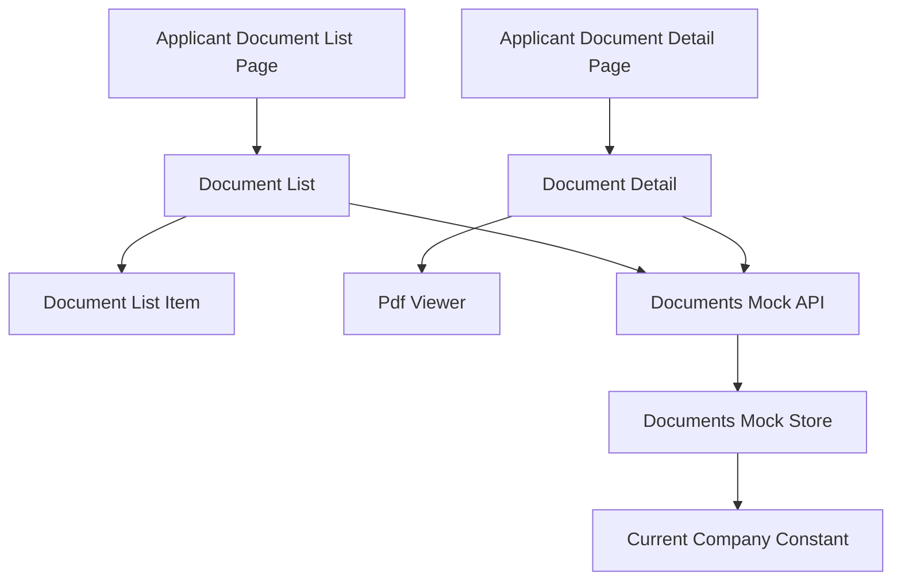
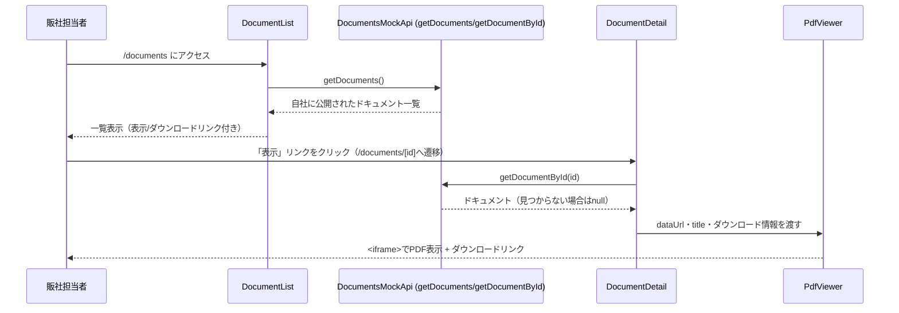

# 技術設計書: documents

## Overview

**Purpose**: 本機能は、`documents-management`specが提供するドキュメントのうち、自社に公開範囲が及ぶものだけを一覧表示（`/documents`）し、詳細ページ（`/documents/[id]`）でブラウザネイティブの`<iframe>`によりPDFをその場で閲覧・ダウンロードできる画面を提供する。

**Users**: 海外販社の担当者が、サイドバーの「ドキュメント」ナビゲーションから遷移し、業務マニュアル等のPDFを確認する際に利用する。

**Impact**: 新規ルート（`/documents`, `/documents/[id]`）とサイドバー項目を追加する。`documents-management`spec所有の`Document`型・`getDocuments`/`getDocumentById`関数を読み取り専用の依存として利用し、これらを変更しない。

### Goals
- 自社に公開されているドキュメントのみを一覧表示できる
- 一覧から詳細ページへ遷移し、追加のライブラリを導入せずブラウザネイティブの`<iframe>`でPDFをその場で閲覧できる
- 一覧・詳細の両方から、独立したダウンロード導線を提供する
- 日本語・英語の両言語で一覧・詳細画面が利用できる

### Non-Goals
- ドキュメントのアップロード・編集・削除・公開範囲の設定（`documents-management`spec所有）
- 販社マスタの管理（`documents-management`spec所有）
- PDF以外のファイル形式のサポート
- PDFの複数ページ送り・ページ内検索等の高度なビューア機能（`react-pdf`等のライブラリ導入は行わない）
- 既読・未読管理（フェーズ1では認証機能が未実装のため対象外）

## Boundary Commitments

### This Spec Owns
- ドキュメント一覧ページ（`/documents`）・詳細ページ（`/documents/[id]`）のUI
- `PdfViewer`コンポーネント（ブラウザネイティブ`<iframe>`によるPDF表示）
- ドキュメント一覧・詳細関連の翻訳キー（`messages/ja.json` / `en.json` の `documents` 名前空間）
- `Sidebar`への「ドキュメント」ナビゲーション項目の追加

### Out of Boundary
- `Document`/`DocumentTargeting`型定義、公開範囲による可視性フィルタの実装（`documents-management`spec所有）。本仕様はこれらを変更しない
- ドキュメントの作成・編集・削除、`DocumentForm`・`DocumentFileField`（`documents-management`spec所有）
- 販社マスタ`DOCUMENT_COMPANY_OPTIONS`の定義・管理（`documents-management`spec所有）
- グローバルレイアウト（Header/Sidebar本体の構造/AppShell/LanguageSwitcher）の変更
- リンク集（`links-page`spec）の型・画面・データ

### Allowed Dependencies
- `documents-management`spec所有の`Document`型、`getDocuments`/`getDocumentById`（読み取り専用）
- 既存のUI基盤コンポーネント（`card.tsx`・`skeleton.tsx`・`button.tsx`）
- 既存の`next-intl`設定・`i18n/navigation.ts`
- `Sidebar`（項目追加のみ）
- `src/lib/attachment-utils.ts`の`formatFileSize`（既存の汎用関数、複製しない）

### Revalidation Triggers
- `Document`/`DocumentTargeting`型のフィールド形状が変更された場合、`DocumentList`・`DocumentDetail`・`PdfViewer`への影響を再確認する必要がある
- `getDocuments`/`getDocumentById`の関数シグネチャが変更された場合、本specの実装前提が変わる

## Architecture

### Existing Architecture Analysis
`announcements`specが確立したパターン——async Server Componentが`try/catch`でモックAPI呼び出しを行い、失敗時はエラーメッセージを、成功時は`Card`ベースのリストを表示し、ページ側で`Suspense` + 専用Skeletonコンポーネントで包む——を一覧・詳細の両画面で踏襲する。動的ルート（`[id]`）は`announcements/[id]`に前例があり技術的な不確実性はない。PDF表示は本リポジトリで初めての要素だが、`<iframe>`はNext.js/Reactの標準的なJSX要素であり追加のライブラリを必要としない。

### Architecture Pattern & Boundary Map



**Architecture Integration**:
- 選択パターン: Server Component + `Suspense`/Skeleton（`announcements`と同一パターン）
- ドメイン境界: 本specは`documents-management`が所有する`DocumentsMockApi`の読み取り関数（`getDocuments`/`getDocumentById`）のみを呼び出し、データの書き込みは一切行わない
- 既存パターンの維持: ページ構成（一覧→詳細）は`announcements`と同じNext.js App Router構成を踏襲し、表示文言はpropsで受け取り翻訳解決はpage.tsx側の責務とする規約を維持
- 新規コンポーネントの理由: `PdfViewer`はこのリポジトリで初めてのPDF表示要素であり、既存コンポーネントの拡張では表現できないため新設する
- Steering準拠: 表示テキストは全て`next-intl`翻訳キー経由という既存規約を維持

### Technology Stack

| Layer | Choice / Version | Role in Feature | Notes |
|-------|------------------|-----------------|-------|
| Frontend | Next.js App Router（既存, 14.2.35） | ページ構成・動的ルート | `announcements`と同一パターン |
| PDF表示 | `<iframe>`（ブラウザネイティブ、追加ライブラリなし） | PDF本体のインライン表示 | `<embed>`はフォールバック手段を持たないため不採用 |
| UI | shadcn/ui（既存） | `Card`, `Skeleton` | 新規UIプリミティブの追加は不要 |
| Data / Mock | `documents-management`所有の`lib/api/documents.ts` | 読み取り専用のデータ取得 | 本specは書き込みを行わない |

## File Structure Plan

### Directory Structure
```
src/app/[locale]/(applicant)/documents/
├── page.tsx                        # 一覧
└── [id]/
    └── page.tsx                     # 詳細＋PDF閲覧

src/components/features/documents/
├── DocumentList.tsx                 # Server: getDocuments()取得・一覧表示
├── DocumentListSkeleton.tsx         # ローディング表示
├── DocumentListItem.tsx             # 1件分（タイトル・説明・サイズ・日付・表示リンク・ダウンロードリンク）
├── DocumentDetail.tsx               # Server: getDocumentById(id)取得・詳細表示
├── DocumentDetailSkeleton.tsx       # ローディング表示
└── PdfViewer.tsx                    # Client不要（純粋な表示コンポーネント）: <iframe>によるPDF表示＋ダウンロードリンク

src/components/layout/
└── Sidebar.tsx                       # 変更: 「ドキュメント」ナビゲーション項目を追加

messages/
├── ja.json                          # 変更: documents名前空間、navへのキー追加
└── en.json                          # 同上
```

### Modified Files
- `src/components/layout/Sidebar.tsx` — `NavItem`の`translationKey`Unionに`"documents"`を追加、`NAV_ITEMS`に1項目追加
- `messages/ja.json` / `messages/en.json` — 新規名前空間・キーの追加

> `documents-management`spec所有の`Document`/`DocumentTargeting`型・`lib/api/documents.ts`の読み取り関数（`getDocuments`/`getDocumentById`）は本specでは変更しない。

## System Flows

一覧から詳細へ遷移しPDFを閲覧するまでの代表的なフローを示す。



- 存在しない、または自社に非公開のIDが指定された場合、`getDocumentById`は`null`を返し、`DocumentDetail`は「見つからない」旨のメッセージを表示する。

## Requirements Traceability

| Requirement | Summary | Components | Interfaces | Flows |
|-------------|---------|------------|------------|-------|
| 1.1〜1.3 | 一覧ページへのアクセスと全体構造 | DocumentList, DocumentListItem | DocumentsMockApi (Service) | 一覧〜詳細フロー |
| 2.1〜2.5 | 公開範囲による可視性制御 | DocumentList, DocumentDetail | DocumentsMockApi（`documents-management`所有） | — |
| 3.1〜3.4 | 一覧の表示順序・状態表示 | DocumentList, DocumentListSkeleton | Service | — |
| 4.1〜4.6 | 詳細表示とPDF閲覧 | DocumentDetail, DocumentDetailSkeleton, PdfViewer | Service | 一覧〜詳細フロー |
| 5.1〜5.3 | ダウンロード機能 | DocumentListItem, PdfViewer | — | 一覧〜詳細フロー |
| 6.1〜6.3 | モックAPIとのデータ連携 | DocumentList, DocumentDetail | Service | — |
| 7.1〜7.2 | 多言語対応 | 全新規コンポーネント | — | — |
| 8.1〜8.2 | レスポンシブ対応 | DocumentList, PdfViewer | — | — |

## Components and Interfaces

| Component | Domain/Layer | Intent | Req Coverage | Key Dependencies (P0/P1) | Contracts |
|-----------|--------------|--------|---------------|---------------------------|-----------|
| DocumentList | UI/Server | 自社に公開されたドキュメントを取得・一覧表示 | 1.1〜1.3, 3.1〜3.4 | DocumentsMockApi (P0) | State |
| DocumentListItem | UI | 1件分のタイトル・説明・サイズ・日付・表示リンク・ダウンロードリンクを表示 | 1.2, 5.1, 5.3 | — | State |
| DocumentDetail | UI/Server | 指定IDのドキュメントを取得し詳細表示、見つからない場合の表示 | 4.1〜4.2, 4.5〜4.6 | DocumentsMockApi (P0) | State |
| PdfViewer | UI | `<iframe>`によるPDF表示とダウンロードリンクの併設 | 4.3〜4.4, 5.2〜5.3, 8.2 | — | State |

### Data / Mock API（依存のみ、本specは実装しない）

#### DocumentsMockApi（`documents-management`所有）

| Field | Detail |
|-------|--------|
| Intent | 自社に公開範囲が及ぶドキュメントのみを一覧・単体取得する |
| Requirements | 2.1〜2.5, 6.1〜6.3 |

##### Service Interface（参照のみ）
```typescript
interface DocumentsReadOnlyApi {
  getDocuments(): Promise<Document[]>;
  getDocumentById(id: string): Promise<Document | null>;
}
```
- Preconditions: なし（呼び出し側は認証情報を持たないため常に`MOCK_CURRENT_COMPANY`が適用される）
- Postconditions: 戻り値は自社に公開範囲が及ぶドキュメントのみを含む
- Invariants: `getDocumentById`が返すドキュメントは、常に`getDocuments()`の戻り値に含まれる

**Implementation Notes**
- Integration: 本specはこのインターフェースを変更しない。型・戻り値の変更は`documents-management`spec側の責務であり、変更時は本specへの影響を確認する
- Risks: `documents-management`specの実装前に本specを実装する場合、モック関数のスタブが必要になる（実装順序は`documents-management`を先行させることを推奨）

### Presentation Components（サマリーのみ）

- **DocumentList**: `getDocuments()`をアップロード日降順で表示し、各行に`DocumentListItem`を配置する。既存`AnnouncementList`と同じ構造パターンを踏襲する。
- **DocumentListItem**: タイトル・説明・`formatFileSize(fileSize)`・アップロード日、詳細ページへの「表示」リンク、`<a href={dataUrl} download={fileName}>`の「ダウンロード」リンクを表示する。
- **DocumentDetail**: `getDocumentById(id)`を取得し、見つからない/エラー/成功の3状態を管理する。成功時は`PdfViewer`にドキュメント情報を渡す。一覧へ戻るリンクを表示する。
- **PdfViewer**: `<iframe src={dataUrl} title={title}>`をビューポート高さに応じたコンテナ（`h-[70vh] lg:h-[80vh]`程度）に配置し、iframeの外側に独立したダウンロードリンクを常設する。`<embed>`はフォールバック手段がないため不採用。

## Data Models

### Domain Model
- `Document`（`documents-management`所有、参照のみ）: `id`, `title`, `description?`, `fileName`, `fileType`, `fileSize`, `dataUrl`, `targeting`, `uploadedAt`

### Logical Data Model
本specは`Document`エンティティを新規に定義せず、`documents-management`が所有する型をそのまま参照する。

### Data Contracts & Integration

| 型 | 主なフィールド | 備考 |
|---|---|---|
| `Document`（参照のみ） | `documents-management`spec所有 | 本specはこの型を変更しない |

## Error Handling

### Error Strategy
`announcements`と同様のパターンを踏襲する。Server Componentは取得失敗時にtry/catchでエラーメッセージを表示する。

### Error Categories and Responses
- **データ取得失敗**（一覧・詳細）: エラーメッセージを表示
- **存在しない/自社に非公開のドキュメントIDへの直接アクセス**: 「見つからない」旨のメッセージを表示（要件2.5, 4.5）
- **0件時**: 「ドキュメントはありません」旨のメッセージを表示（要件3.4）

### Monitoring
フェーズ1はモックのため、追加のロギング・監視基盤は導入しない。

## Testing Strategy

- **Unit Tests**:
  - `DocumentListItem`がタイトル・説明・ファイルサイズ・日付・表示/ダウンロードリンクを正しく描画すること
  - `PdfViewer`が`<iframe>`に`src`/`title`を正しく設定し、ダウンロードリンクを併設すること
- **Integration Tests**:
  - `DocumentList`が`getDocuments()`の結果をアップロード日降順で表示すること、0件時に空状態メッセージを表示すること
  - `DocumentDetail`が存在しない/非公開のIDに対して「見つからない」旨を表示すること
- **E2E/UI Tests**:
  - 日本語・英語両ロケールで一覧・詳細画面が表示されること
  - タブレット幅（768px）で一覧・詳細画面が横スクロールを起こさないこと
  - 詳細ページでPDFが`<iframe>`内に表示され、ダウンロードリンクが機能すること

## Security Considerations
本specは読み取り専用であり、認証・認可の代替とはならない表示範囲制御（`documents-management`spec所有）に依存する。フェーズ3で認証が導入される際、本specのルート境界を変更せずにアクセス制御を追加できることを設計上の前提とする。
