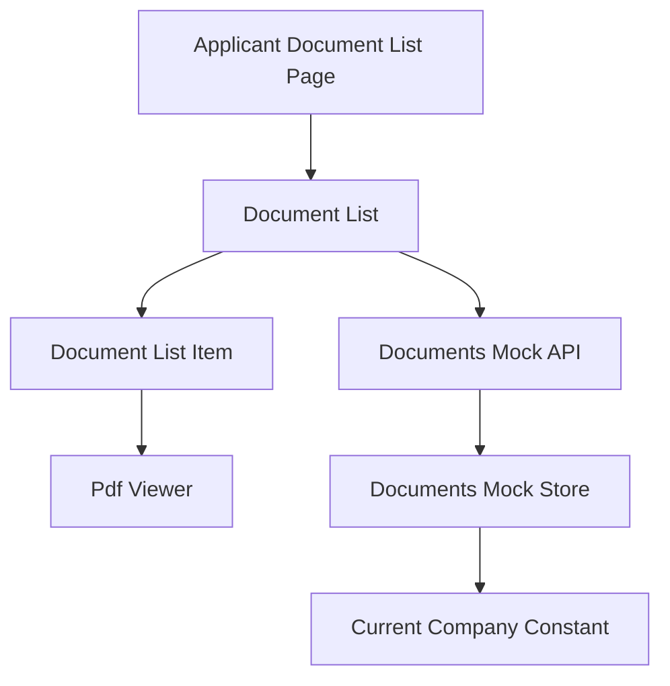
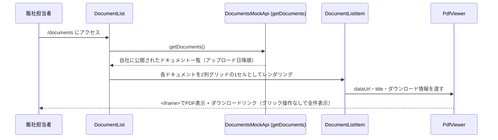

# 技術設計書: documents

## Overview

**Purpose**: 本機能は、`documents-management`specが提供するドキュメントのうち、自社に公開範囲が及ぶものだけを一覧表示（`/documents`）し、各ドキュメントのPDFプレビュー（ブラウザネイティブの`<iframe>`）を一覧ページ上で直接閲覧・ダウンロードできる画面を提供する。

**Users**: 海外販社の担当者が、サイドバーの「ドキュメント」ナビゲーションから遷移し、業務マニュアル等のPDFを確認する際に利用する。

**Impact**: 新規ルート（`/documents`）とサイドバー項目を追加する。`documents-management`spec所有の`Document`型・`getDocuments`関数を読み取り専用の依存として利用し、これらを変更しない。

> **2026-07-09追記**: 当初は`/documents`（一覧）と`/documents/[id]`（詳細＋PDF閲覧）の2ページ構成だったが、追加要望により`/documents/[id]`は撤廃し、一覧ページ内で各ドキュメントのPDFプレビューを直接（2列グリッドで）表示する構成に変更した。`getDocumentById`への依存はなくなった。

### Goals
- 自社に公開されているドキュメントのみを一覧表示できる
- 一覧ページ上で、クリック操作なしに、追加のライブラリを導入せずブラウザネイティブの`<iframe>`でPDFを直接閲覧できる
- 一覧の各ドキュメントから、独立したダウンロード導線を提供する
- ドキュメントが多い場合でも画面を有効に使えるよう、2列グリッドでプレビューを並べる
- 日本語・英語の両言語で一覧画面が利用できる

### Non-Goals
- ドキュメントのアップロード・編集・削除・公開範囲の設定（`documents-management`spec所有）
- 販社マスタの管理（`documents-management`spec所有）
- PDF以外のファイル形式のサポート
- PDFの複数ページ送り・ページ内検索等の高度なビューア機能（`react-pdf`等のライブラリ導入は行わない）
- 既読・未読管理（フェーズ1では認証機能が未実装のため対象外）

## Boundary Commitments

### This Spec Owns
- ドキュメント一覧ページ（`/documents`）のUI（各ドキュメントのインラインPDFプレビューを含む、2列グリッド構成）
- `PdfViewer`コンポーネント（ブラウザネイティブ`<iframe>`によるPDF表示）
- ドキュメント一覧・詳細関連の翻訳キー（`messages/ja.json` / `en.json` の `documents` 名前空間）
- `Sidebar`への「ドキュメント」ナビゲーション項目の追加

### Out of Boundary
- `Document`/`DocumentTargeting`型定義、公開範囲による可視性フィルタの実装（`documents-management`spec所有）。本仕様はこれらを変更しない
- ドキュメントの作成・編集・削除、`DocumentForm`・`DocumentFileField`（`documents-management`spec所有）
- 販社マスタ`DOCUMENT_COMPANY_OPTIONS`の定義・管理（`documents-management`spec所有）
- グローバルレイアウト（Header/Sidebar本体の構造/AppShell/LanguageSwitcher）の変更
- リンク集（`links-page`spec）の型・画面・データ

### Allowed Dependencies
- `documents-management`spec所有の`Document`型、`getDocuments`/`getDocumentById`（読み取り専用）
- 既存のUI基盤コンポーネント（`card.tsx`・`skeleton.tsx`・`button.tsx`）
- 既存の`next-intl`設定・`i18n/navigation.ts`
- `Sidebar`（項目追加のみ）
- `src/lib/attachment-utils.ts`の`formatFileSize`（既存の汎用関数、複製しない）

### Revalidation Triggers
- `Document`/`DocumentTargeting`型のフィールド形状が変更された場合、`DocumentList`・`DocumentDetail`・`PdfViewer`への影響を再確認する必要がある
- `getDocuments`/`getDocumentById`の関数シグネチャが変更された場合、本specの実装前提が変わる

## Architecture

### Existing Architecture Analysis
`announcements`specが確立したパターン——async Server Componentが`try/catch`でモックAPI呼び出しを行い、失敗時はエラーメッセージを、成功時は`Card`ベースのリストを表示し、ページ側で`Suspense` + 専用Skeletonコンポーネントで包む——を一覧・詳細の両画面で踏襲する。動的ルート（`[id]`）は`announcements/[id]`に前例があり技術的な不確実性はない。PDF表示は本リポジトリで初めての要素だが、`<iframe>`はNext.js/Reactの標準的なJSX要素であり追加のライブラリを必要としない。

### Architecture Pattern & Boundary Map



**Architecture Integration**:
- 選択パターン: Server Component + `Suspense`/Skeleton（`announcements`と同一パターン）
- ドメイン境界: 本specは`documents-management`が所有する`DocumentsMockApi`の読み取り関数（`getDocuments`）のみを呼び出し、データの書き込みは一切行わない
- 既存パターンの維持: 表示文言はpropsで受け取り翻訳解決はpage.tsx/Server Component側の責務とする規約を維持
- レイアウト: `DocumentListItem`を`grid grid-cols-1 md:grid-cols-2 gap-6`のグリッドに配置し、768px未満では1列にフォールバックする
- 新規コンポーネントの理由: `PdfViewer`はこのリポジトリで初めてのPDF表示要素であり、既存コンポーネントの拡張では表現できないため新設する
- Steering準拠: 表示テキストは全て`next-intl`翻訳キー経由という既存規約を維持

### Technology Stack

| Layer | Choice / Version | Role in Feature | Notes |
|-------|------------------|-----------------|-------|
| Frontend | Next.js App Router（既存, 14.2.35） | ページ構成・動的ルート | `announcements`と同一パターン |
| PDF表示 | `<iframe>`（ブラウザネイティブ、追加ライブラリなし） | PDF本体のインライン表示 | `<embed>`はフォールバック手段を持たないため不採用 |
| UI | shadcn/ui（既存） | `Card`, `Skeleton` | 新規UIプリミティブの追加は不要 |
| Data / Mock | `documents-management`所有の`lib/api/documents.ts` | 読み取り専用のデータ取得 | 本specは書き込みを行わない |

## File Structure Plan

### Directory Structure
```
src/app/[locale]/(applicant)/documents/
└── page.tsx                        # 一覧（各ドキュメントのインラインPDFプレビューを含む）

src/components/features/documents/
├── DocumentList.tsx                 # Server: getDocuments()取得・2列グリッド一覧表示
├── DocumentListSkeleton.tsx         # ローディング表示
├── DocumentListItem.tsx             # 1件分（タイトル・説明・サイズ・日付・インラインPdfViewer）
└── PdfViewer.tsx                    # Client不要（純粋な表示コンポーネント）: <iframe>によるPDF表示＋ダウンロードリンク

src/components/layout/
└── Sidebar.tsx                       # 変更: 「ドキュメント」ナビゲーション項目を追加

messages/
├── ja.json                          # 変更: documents名前空間、navへのキー追加
└── en.json                          # 同上
```

### Modified Files
- `src/components/layout/Sidebar.tsx` — `NavItem`の`translationKey`Unionに`"documents"`を追加、`NAV_ITEMS`に1項目追加
- `messages/ja.json` / `messages/en.json` — 新規名前空間・キーの追加

> `documents-management`spec所有の`Document`/`DocumentTargeting`型・`lib/api/documents.ts`の読み取り関数（`getDocuments`）は本specでは変更しない。

### Removed Files（2026-07-09追記）
- `src/app/[locale]/(applicant)/documents/[id]/page.tsx` — 詳細ページ撤廃に伴い削除
- `src/components/features/documents/DocumentDetail.tsx` / 同テストファイル — 一覧ページへの統合に伴い削除（PdfViewerの呼び出しは`DocumentListItem`に移行）

## System Flows

一覧ページにアクセスしてから全ドキュメントのPDFプレビューが表示されるまでの代表的なフローを示す（クリック操作は発生しない）。



- 一覧取得に失敗した場合、`DocumentList`はエラーメッセージを表示する。0件の場合は空状態メッセージを表示する（要件3参照）。

## Requirements Traceability

| Requirement | Summary | Components | Interfaces | Flows |
|-------------|---------|------------|------------|-------|
| 1.1〜1.3 | 一覧ページへのアクセスと全体構造 | DocumentList, DocumentListItem | DocumentsMockApi (Service) | 一覧フロー |
| 2.1〜2.5 | 公開範囲による可視性制御 | DocumentList | DocumentsMockApi（`documents-management`所有） | — |
| 3.1〜3.4 | 一覧の表示順序・状態表示 | DocumentList, DocumentListSkeleton | Service | — |
| 6.1〜6.3 | モックAPIとのデータ連携 | DocumentList | Service | — |
| 7.1〜7.2 | 多言語対応 | 全新規コンポーネント | — | — |
| 9.1〜9.4 | h1＋説明文の見出し統一 | DocumentList | — | — |
| 10.1〜10.5 | 一覧ページでのPDFプレビュー表示（2026-07-09追記、要件4を統合） | DocumentListItem, PdfViewer | Service | 一覧フロー |
| 11.1〜11.4 | 一覧ページのグリッドレイアウトとレスポンシブ対応（2026-07-09追記、要件5・8を統合） | DocumentList, PdfViewer | — | — |

## Components and Interfaces

| Component | Domain/Layer | Intent | Req Coverage | Key Dependencies (P0/P1) | Contracts |
|-----------|--------------|--------|---------------|---------------------------|-----------|
| DocumentList | UI/Server | 自社に公開されたドキュメントを取得・2列グリッド表示 | 1.1〜1.3, 3.1〜3.4, 11.1〜11.4 | DocumentsMockApi (P0) | State |
| DocumentListItem | UI | 1件分のタイトル・説明・サイズ・日付・インラインPdfViewerを表示 | 1.2, 10.1〜10.5 | PdfViewer (P0) | State |
| PdfViewer | UI | `<iframe>`によるPDF表示とダウンロードリンクの併設 | 10.1〜10.4, 11.2 | — | State |

### Data / Mock API（依存のみ、本specは実装しない）

#### DocumentsMockApi（`documents-management`所有）

| Field | Detail |
|-------|--------|
| Intent | 自社に公開範囲が及ぶドキュメントのみを一覧取得する |
| Requirements | 2.1〜2.5, 6.1〜6.3 |

##### Service Interface（参照のみ）
```typescript
interface DocumentsReadOnlyApi {
  getDocuments(): Promise<Document[]>;
}
```
- Preconditions: なし（呼び出し側は認証情報を持たないため常に`MOCK_CURRENT_COMPANY`が適用される）
- Postconditions: 戻り値は自社に公開範囲が及ぶドキュメントのみを含む
- Invariants: なし（本specは`getDocumentById`に依存しない。2026-07-09追記: 詳細ページ撤廃により単体取得は不要になった）

**Implementation Notes**
- Integration: 本specはこのインターフェースを変更しない。型・戻り値の変更は`documents-management`spec側の責務であり、変更時は本specへの影響を確認する
- Risks: `documents-management`specの実装前に本specを実装する場合、モック関数のスタブが必要になる（実装順序は`documents-management`を先行させることを推奨）

### Presentation Components（サマリーのみ）

- **DocumentList**: `getDocuments()`をアップロード日降順で表示し、`grid grid-cols-1 md:grid-cols-2 gap-6`のグリッドに`DocumentListItem`を配置する（768px未満は1列にフォールバック）。既存`AnnouncementList`と同じ取得・状態管理パターンを踏襲する。
- **DocumentListItem**: 1件分の`Card`。タイトル・説明・`formatFileSize(fileSize)`・アップロード日を上部に表示し、その直下に`PdfViewer`を配置してPDFプレビューをインライン表示する（クリック操作不要、遷移なし）。
- **PdfViewer**: `<iframe src={dataUrl} title={title}>`をグリッドの1セル幅を想定したコンテナ（`h-[50vh]`程度、`min-h`を確保）に配置し、iframeの外側に独立したダウンロードリンクを常設する。`<embed>`はフォールバック手段がないため不採用。

## Data Models

### Domain Model
- `Document`（`documents-management`所有、参照のみ）: `id`, `title`, `description?`, `fileName`, `fileType`, `fileSize`, `dataUrl`, `targeting`, `uploadedAt`

### Logical Data Model
本specは`Document`エンティティを新規に定義せず、`documents-management`が所有する型をそのまま参照する。

### Data Contracts & Integration

| 型 | 主なフィールド | 備考 |
|---|---|---|
| `Document`（参照のみ） | `documents-management`spec所有 | 本specはこの型を変更しない |

## Error Handling

### Error Strategy
`announcements`と同様のパターンを踏襲する。Server Componentは取得失敗時にtry/catchでエラーメッセージを表示する。

### Error Categories and Responses
- **データ取得失敗**（一覧・詳細）: エラーメッセージを表示
- **存在しない/自社に非公開のドキュメントIDへの直接アクセス**: 「見つからない」旨のメッセージを表示（要件2.5, 4.5）
- **0件時**: 「ドキュメントはありません」旨のメッセージを表示（要件3.4）

### Monitoring
フェーズ1はモックのため、追加のロギング・監視基盤は導入しない。

## Testing Strategy

- **Unit Tests**:
  - `DocumentListItem`がタイトル・説明・ファイルサイズ・日付・インラインPdfViewer・ダウンロードリンクを正しく描画すること
  - `PdfViewer`が`<iframe>`に`src`/`title`を正しく設定し、ダウンロードリンクを併設すること
- **Integration Tests**:
  - `DocumentList`が`getDocuments()`の結果をアップロード日降順で2列グリッドに表示すること、0件時に空状態メッセージを表示すること
  - `DocumentList`の各項目でクリック操作なしにPDFプレビュー（`<iframe>`）が表示されていること
- **E2E/UI Tests**:
  - 日本語・英語両ロケールで一覧画面が表示されること
  - タブレット幅（768px）未満で1列表示に切り替わり横スクロールを起こさないこと、768px以上で2列グリッドが横スクロールなく表示されること
  - 一覧の各ドキュメントでPDFが`<iframe>`内に表示され、ダウンロードリンクが機能すること

## Security Considerations
本specは読み取り専用であり、認証・認可の代替とはならない表示範囲制御（`documents-management`spec所有）に依存する。フェーズ3で認証が導入される際、本specのルート境界を変更せずにアクセス制御を追加できることを設計上の前提とする。

## 追加ラウンド（2026-07-08）: 見出し（h1 + 説明文）の統一

### Overview（追加分）
ドキュメント一覧ページに、`links`/`faq` specが既に採用している`h1`＋説明文の見出しパターンを適用する。新規翻訳キーは追加せず、既存の`documents.list.title`/`documents.list.description`をそのまま使用する。

### Modified Files（追加分）
- `src/components/features/documents/DocumentList.tsx` — `LinkList.tsx`/`FaqList.tsx`と同じ`heading`要素（`<div className="mb-6"><h1 className="text-2xl font-semibold text-foreground">...</h1><p className="mt-1 text-sm text-muted-foreground">...</p></div>`）を定義し、既存の`Card`の外側・上部に配置する。エラー時・空データ時の各早期returnにも同じ`heading`を含める

### Requirements Traceability（追加分）
| Requirement | Summary | Components |
|-------------|---------|------------|
| 9.1〜9.4 | h1＋説明文の見出し統一 | DocumentList |

## 追加ラウンド（2026-07-09）: 一覧ページへのPDFプレビュー統合（詳細ページの撤廃）

### Overview（追加分）
`/documents/[id]`詳細ページを撤廃し、一覧ページ（`/documents`）内で各ドキュメントのPDFプレビューをクリック操作なしに直接表示する構成に変更する。表示件数が多い場合でも画面を有効に使えるよう、ドキュメントカードは1列の縦積みではなく`grid grid-cols-1 md:grid-cols-2 gap-6`の2列グリッドで配置し、3件目以降は次の行に続ける（768px未満は1列にフォールバック）。

### Modified Files（追加分）
- `src/components/features/documents/DocumentListItem.tsx` — 詳細ページへの「表示」リンクを削除し、`PdfViewer`をカード内に直接配置する。タイトル・説明・メタ情報・`PdfViewer`（ダウンロードリンクを含む）を1枚の`Card`として構成する
- `src/components/features/documents/DocumentList.tsx` — `ul.divide-y`構成をやめ、`DocumentListItem`を`grid grid-cols-1 md:grid-cols-2 gap-6`のグリッドで並べる。見出し（`h1`+説明文）は既存のまま維持する
- `src/app/[locale]/(applicant)/documents/page.tsx` — コンテナ幅を、2列グリッドが画面全体を活かせる幅に変更する
- `src/components/features/documents/PdfViewer.tsx` — グリッドの1セル幅を想定し、高さを`h-[50vh]`程度（`min-h`確保）に調整する
- `messages/ja.json` / `messages/en.json` — `documents.list.viewLink`を削除、`documents.detail`名前空間を削除

### Removed Files（追加分）
- `src/app/[locale]/(applicant)/documents/[id]/page.tsx`
- `src/components/features/documents/DocumentDetail.tsx`（および対応するテストファイル）

### Requirements Traceability（追加分）
| Requirement | Summary | Components |
|-------------|---------|------------|
| 10.1〜10.5 | 一覧ページでのPDFプレビュー表示 | DocumentListItem, PdfViewer |
| 11.1〜11.4 | 一覧ページのグリッドレイアウトとレスポンシブ対応 | DocumentList, PdfViewer |
