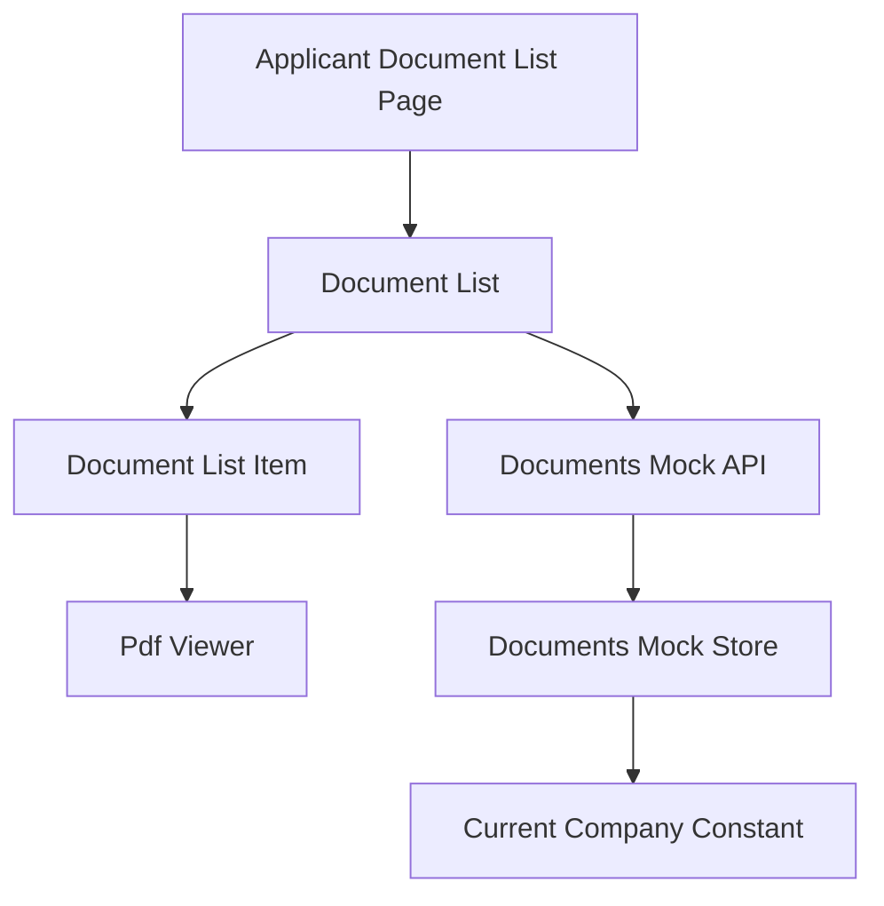
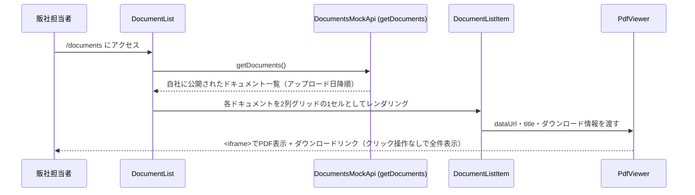

# 技術設計書: documents

## Overview

**Purpose**: 本機能は、`documents-management`specが提供するドキュメントのうち、自社に公開範囲が及ぶものだけを一覧表示（`/documents`）し、各ドキュメントのPDFプレビュー（ブラウザネイティブの`<iframe>`）を一覧ページ上で直接閲覧・ダウンロードできる画面を提供する。

**Users**: 海外販社の担当者が、サイドバーの「ドキュメント」ナビゲーションから遷移し、業務マニュアル等のPDFを確認する際に利用する。

**Impact**: 新規ルート（`/documents`）とサイドバー項目を追加する。`documents-management`spec所有の`Document`型・`getDocuments`関数を読み取り専用の依存として利用し、これらを変更しない。

> **2026-07-09追記**: 当初は`/documents`（一覧）と`/documents/[id]`（詳細＋PDF閲覧）の2ページ構成だったが、追加要望により`/documents/[id]`は撤廃し、一覧ページ内で各ドキュメントのPDFプレビューを直接（2列グリッドで）表示する構成に変更した。`getDocumentById`への依存はなくなった。

> **2026-07-16追記**: `documents-management`specの追加要望により、`Document`は`sourceType: "upload" | "google"`の判別可能ユニオン型に変更される。本specが所有する`PdfViewer`を、`sourceType`に応じて「アップロードPDFのdata URLをiframe表示＋ダウンロードリンク」または「Google埋め込みURLをiframe表示＋元ドキュメントを開くリンク」のいずれかを描画するよう拡張する（詳細は「追加ラウンド（2026-07-16）」を参照）。

### Goals
- 自社に公開されているドキュメントのみを一覧表示できる
- 一覧ページ上で、クリック操作なしに、追加のライブラリを導入せずブラウザネイティブの`<iframe>`でPDFを直接閲覧できる
- 一覧の各ドキュメントから、独立したダウンロード導線を提供する
- ドキュメントが多い場合でも画面を有効に使えるよう、2列グリッドでプレビューを並べる
- 日本語・英語の両言語で一覧画面が利用できる
- （2026-07-16追記）`sourceType: "google"`のドキュメントについても、一覧ページ上でクリック操作なしにGoogle側の最新コンテンツをその場でプレビューできる

### Non-Goals
- ドキュメントのアップロード・編集・削除・公開範囲の設定（`documents-management`spec所有）
- 販社マスタの管理（`documents-management`spec所有）
- PDF以外のファイル形式のサポート
- PDFの複数ページ送り・ページ内検索等の高度なビューア機能（`react-pdf`等のライブラリ導入は行わない）
- 既読・未読管理（フェーズ1では認証機能が未実装のため対象外）
- （2026-07-16追記）Google埋め込みが権限不足等で表示できない場合の独自エラーハンドリング（ブラウザのiframe標準動作に委ねる）
- （2026-07-16追記）Google Drive APIによる変更検知・自動再同期（`documents-management`spec所有のNon-Goals、本specも実装しない）

## Boundary Commitments

### This Spec Owns
- ドキュメント一覧ページ（`/documents`）のUI（各ドキュメントのインラインPDFプレビューを含む、2列グリッド構成）
- `PdfViewer`コンポーネント（ブラウザネイティブ`<iframe>`によるPDF表示。2026-07-16追記: `sourceType`に応じたprops分岐対応を含む）
- ドキュメント一覧・詳細関連の翻訳キー（`messages/ja.json` / `en.json` の `documents` 名前空間）
- `Sidebar`への「ドキュメント」ナビゲーション項目の追加

### Out of Boundary
- `Document`/`DocumentTargeting`型定義、公開範囲による可視性フィルタの実装（`documents-management`spec所有）。本仕様はこれらを変更しない
- ドキュメントの作成・編集・削除、`DocumentForm`・`DocumentFileField`（`documents-management`spec所有）
- 販社マスタ`DOCUMENT_COMPANY_OPTIONS`の定義・管理（`documents-management`spec所有）
- グローバルレイアウト（Header/Sidebar本体の構造/AppShell/LanguageSwitcher）の変更
- リンク集（`links-page`spec）の型・画面・データ
- （2026-07-16追記）GoogleドキュメントURLの妥当性検証・埋め込みURLへの変換ロジック（`documents-management`spec所有の`GoogleDocumentUrlUtils`。本specは`documents-management`が保存済みの`googleEmbedUrl`をそのまま受け取って表示するのみ）

### Allowed Dependencies
- `documents-management`spec所有の`Document`型、`getDocuments`/`getDocumentById`（読み取り専用。2026-07-16追記: `sourceType`判別可能ユニオン型を含む）
- 既存のUI基盤コンポーネント（`card.tsx`・`skeleton.tsx`・`button.tsx`）
- 既存の`next-intl`設定・`i18n/navigation.ts`
- `Sidebar`（項目追加のみ）
- `src/lib/attachment-utils.ts`の`formatFileSize`（既存の汎用関数、複製しない）

### Revalidation Triggers
- `Document`/`DocumentTargeting`型のフィールド形状が変更された場合、`DocumentList`・`DocumentDetail`・`PdfViewer`への影響を再確認する必要がある
- `getDocuments`/`getDocumentById`の関数シグネチャが変更された場合、本specの実装前提が変わる
- （2026-07-16追記）`documents-management`spec側の`sourceType`判別可能ユニオン型の追加は、本spec側で確認済み（本design.mdの対応内容が本トリガーへの回答）

## Architecture

### Existing Architecture Analysis
`announcements`specが確立したパターン——async Server Componentが`try/catch`でモックAPI呼び出しを行い、失敗時はエラーメッセージを、成功時は`Card`ベースのリストを表示し、ページ側で`Suspense` + 専用Skeletonコンポーネントで包む——を一覧・詳細の両画面で踏襲する。動的ルート（`[id]`）は`announcements/[id]`に前例があり技術的な不確実性はない。PDF表示は本リポジトリで初めての要素だが、`<iframe>`はNext.js/Reactの標準的なJSX要素であり追加のライブラリを必要としない。

### Architecture Pattern & Boundary Map



**Architecture Integration**:
- 選択パターン: Server Component + `Suspense`/Skeleton（`announcements`と同一パターン）
- ドメイン境界: 本specは`documents-management`が所有する`DocumentsMockApi`の読み取り関数（`getDocuments`）のみを呼び出し、データの書き込みは一切行わない
- 既存パターンの維持: 表示文言はpropsで受け取り翻訳解決はpage.tsx/Server Component側の責務とする規約を維持
- レイアウト: `DocumentListItem`を`grid grid-cols-1 md:grid-cols-2 gap-6`のグリッドに配置し、768px未満では1列にフォールバックする
- 新規コンポーネントの理由: `PdfViewer`はこのリポジトリで初めてのPDF表示要素であり、既存コンポーネントの拡張では表現できないため新設する
- Steering準拠: 表示テキストは全て`next-intl`翻訳キー経由という既存規約を維持
- （2026-07-16追記）`PdfViewer`は`sourceType`で分岐する判別可能ユニオン型のpropsを受け取り、呼び出し元（`DocumentListItem`）が`Document.sourceType`を見てどちらのバリアントを渡すか決定する。`PdfViewer`自体は`Document`型を直接importせず、必要なフィールドのみをpropsとして受け取ることで`documents-management`型への直接依存を避ける（既存の`dataUrl`/`title`/`downloadFileName`/`downloadLinkLabel`という個別props方式を踏襲）

### Technology Stack

| Layer | Choice / Version | Role in Feature | Notes |
|-------|------------------|-----------------|-------|
| Frontend | Next.js App Router（既存, 14.2.35） | ページ構成・動的ルート | `announcements`と同一パターン |
| PDF表示 | `<iframe>`（ブラウザネイティブ、追加ライブラリなし） | PDF本体のインライン表示 | `<embed>`はフォールバック手段を持たないため不採用 |
| UI | shadcn/ui（既存） | `Card`, `Skeleton` | 新規UIプリミティブの追加は不要 |
| Data / Mock | `documents-management`所有の`lib/api/documents.ts` | 読み取り専用のデータ取得 | 本specは書き込みを行わない |

## File Structure Plan

### Directory Structure
```
src/app/[locale]/(applicant)/documents/
└── page.tsx                        # 一覧（各ドキュメントのインラインPDFプレビューを含む）

src/components/features/documents/
├── DocumentList.tsx                 # Server: getDocuments()取得・2列グリッド一覧表示
├── DocumentListSkeleton.tsx         # ローディング表示
├── DocumentListItem.tsx             # 1件分（タイトル・説明・サイズ・日付・インラインPdfViewer）
└── PdfViewer.tsx                    # Client不要（純粋な表示コンポーネント）: <iframe>によるPDF表示＋ダウンロードリンク

src/components/layout/
└── Sidebar.tsx                       # 変更: 「ドキュメント」ナビゲーション項目を追加

messages/
├── ja.json                          # 変更: documents名前空間、navへのキー追加
└── en.json                          # 同上
```

### Modified Files
- `src/components/layout/Sidebar.tsx` — `NavItem`の`translationKey`Unionに`"documents"`を追加、`NAV_ITEMS`に1項目追加
- `messages/ja.json` / `messages/en.json` — 新規名前空間・キーの追加

> `documents-management`spec所有の`Document`/`DocumentTargeting`型・`lib/api/documents.ts`の読み取り関数（`getDocuments`）は本specでは変更しない。

### Removed Files（2026-07-09追記）
- `src/app/[locale]/(applicant)/documents/[id]/page.tsx` — 詳細ページ撤廃に伴い削除
- `src/components/features/documents/DocumentDetail.tsx` / 同テストファイル — 一覧ページへの統合に伴い削除（PdfViewerの呼び出しは`DocumentListItem`に移行）

## System Flows

一覧ページにアクセスしてから全ドキュメントのPDFプレビューが表示されるまでの代表的なフローを示す（クリック操作は発生しない）。



- 一覧取得に失敗した場合、`DocumentList`はエラーメッセージを表示する。0件の場合は空状態メッセージを表示する（要件3参照）。

## Requirements Traceability

| Requirement | Summary | Components | Interfaces | Flows |
|-------------|---------|------------|------------|-------|
| 1.1〜1.3 | 一覧ページへのアクセスと全体構造 | DocumentList, DocumentListItem | DocumentsMockApi (Service) | 一覧フロー |
| 2.1〜2.5 | 公開範囲による可視性制御 | DocumentList | DocumentsMockApi（`documents-management`所有） | — |
| 3.1〜3.4 | 一覧の表示順序・状態表示 | DocumentList, DocumentListSkeleton | Service | — |
| 6.1〜6.3 | モックAPIとのデータ連携 | DocumentList | Service | — |
| 7.1〜7.2 | 多言語対応 | 全新規コンポーネント | — | — |
| 9.1〜9.4 | h1＋説明文の見出し統一 | DocumentList | — | — |
| 10.1〜10.5 | 一覧ページでのPDFプレビュー表示（2026-07-09追記、要件4を統合） | DocumentListItem, PdfViewer | Service | 一覧フロー |
| 11.1〜11.4 | 一覧ページのグリッドレイアウトとレスポンシブ対応（2026-07-09追記、要件5・8を統合） | DocumentList, PdfViewer | — | — |

## Components and Interfaces

| Component | Domain/Layer | Intent | Req Coverage | Key Dependencies (P0/P1) | Contracts |
|-----------|--------------|--------|---------------|---------------------------|-----------|
| DocumentList | UI/Server | 自社に公開されたドキュメントを取得・2列グリッド表示 | 1.1〜1.3, 3.1〜3.4, 11.1〜11.4 | DocumentsMockApi (P0) | State |
| DocumentListItem | UI | 1件分のタイトル・説明・サイズ・日付・インラインPdfViewerを表示 | 1.2, 10.1〜10.5, 13.1〜13.2, 13.5 | PdfViewer (P0) | State |
| PdfViewer | UI | `<iframe>`によるPDF表示とダウンロードリンク／Google埋め込みと元ドキュメントリンクの併設 | 10.1〜10.4, 11.2, 13.1〜13.4 | — | State |

### Data / Mock API（依存のみ、本specは実装しない）

#### DocumentsMockApi（`documents-management`所有）

| Field | Detail |
|-------|--------|
| Intent | 自社に公開範囲が及ぶドキュメントのみを一覧取得する |
| Requirements | 2.1〜2.5, 6.1〜6.3 |

##### Service Interface（参照のみ）
```typescript
interface DocumentsReadOnlyApi {
  getDocuments(): Promise<Document[]>;
}
```
- Preconditions: なし（呼び出し側は認証情報を持たないため常に`MOCK_CURRENT_COMPANY`が適用される）
- Postconditions: 戻り値は自社に公開範囲が及ぶドキュメントのみを含む
- Invariants: なし（本specは`getDocumentById`に依存しない。2026-07-09追記: 詳細ページ撤廃により単体取得は不要になった）

**Implementation Notes**
- Integration: 本specはこのインターフェースを変更しない。型・戻り値の変更は`documents-management`spec側の責務であり、変更時は本specへの影響を確認する
- Risks: `documents-management`specの実装前に本specを実装する場合、モック関数のスタブが必要になる（実装順序は`documents-management`を先行させることを推奨）

### Presentation Components（サマリーのみ）

- **DocumentList**: `getDocuments()`をアップロード日降順で表示し、`grid grid-cols-1 md:grid-cols-2 gap-6`のグリッドに`DocumentListItem`を配置する（768px未満は1列にフォールバック）。既存`AnnouncementList`と同じ取得・状態管理パターンを踏襲する。
- **DocumentListItem**: 1件分の`Card`。タイトル・説明・`formatFileSize(fileSize)`・アップロード日を上部に表示し、その直下に`PdfViewer`を配置してPDFプレビューをインライン表示する（クリック操作不要、遷移なし）。
- **PdfViewer**: `<iframe title={title}>`をグリッドの1セル幅を想定したコンテナ（`h-[50vh]`程度、`min-h`を確保）に配置する。`variant: "upload"`時は`src={dataUrl}`とし、iframeの外側に独立したダウンロードリンクを常設する。`variant: "google"`（2026-07-16追記）時は`src={embedUrl}`とし、ダウンロードリンクの代わりに元の共有リンク（`originalUrl`）を新しいタブで開くリンクを常設する。`<embed>`はフォールバック手段がないため不採用。

## Data Models

### Domain Model
- `Document`（`documents-management`所有、参照のみ。2026-07-16追記: `sourceType`による判別可能ユニオン型に変更）: 共通フィールド`id`, `title`, `description?`, `targeting`, `uploadedAt`に加え、`sourceType: "upload"`時は`fileName`, `fileType`, `fileSize`, `dataUrl`を、`sourceType: "google"`時は`googleUrl`, `googleEmbedUrl`を持つ

### Logical Data Model
本specは`Document`エンティティを新規に定義せず、`documents-management`が所有する型をそのまま参照する。

### Data Contracts & Integration

| 型 | 主なフィールド | 備考 |
|---|---|---|
| `Document`（参照のみ） | `documents-management`spec所有 | 本specはこの型を変更しない |

## Error Handling

### Error Strategy
`announcements`と同様のパターンを踏襲する。Server Componentは取得失敗時にtry/catchでエラーメッセージを表示する。

### Error Categories and Responses
- **データ取得失敗**（一覧・詳細）: エラーメッセージを表示
- **存在しない/自社に非公開のドキュメントIDへの直接アクセス**: 「見つからない」旨のメッセージを表示（要件2.5, 4.5）
- **0件時**: 「ドキュメントはありません」旨のメッセージを表示（要件3.4）
- **Google埋め込みの表示失敗**（2026-07-16追記、権限不足等）: ブラウザのiframe標準動作に委ね、本specとして追加のエラーハンドリングは実装しない（要件13.6）

### Monitoring
フェーズ1はモックのため、追加のロギング・監視基盤は導入しない。

## Testing Strategy

- **Unit Tests**:
  - `DocumentListItem`がタイトル・説明・ファイルサイズ・日付・インラインPdfViewer・ダウンロードリンクを正しく描画すること
  - `PdfViewer`が`<iframe>`に`src`/`title`を正しく設定し、ダウンロードリンクを併設すること
  - （2026-07-16追記）`PdfViewer`が`variant: "google"`のとき`embedUrl`をiframeの`src`に設定し、ダウンロードリンクの代わりに`originalUrl`を新しいタブで開くリンクを描画すること
  - （2026-07-16追記）`DocumentListItem`が`document.sourceType`に応じて`PdfViewer`へ正しいvariantのpropsを渡すこと
- **Integration Tests**:
  - `DocumentList`が`getDocuments()`の結果をアップロード日降順で2列グリッドに表示すること、0件時に空状態メッセージを表示すること
  - `DocumentList`の各項目でクリック操作なしにPDFプレビュー（`<iframe>`）が表示されていること
  - （2026-07-16追記）`sourceType: "upload"`と`sourceType: "google"`のドキュメントが混在する一覧で、検索・並び順・グリッドレイアウトが`sourceType`によらず同様に機能すること
- **E2E/UI Tests**:
  - 日本語・英語両ロケールで一覧画面が表示されること
  - タブレット幅（768px）未満で1列表示に切り替わり横スクロールを起こさないこと、768px以上で2列グリッドが横スクロールなく表示されること
  - 一覧の各ドキュメントでPDFが`<iframe>`内に表示され、ダウンロードリンクが機能すること

## Security Considerations
本specは読み取り専用であり、認証・認可の代替とはならない表示範囲制御（`documents-management`spec所有）に依存する。フェーズ3で認証が導入される際、本specのルート境界を変更せずにアクセス制御を追加できることを設計上の前提とする。

**2026-07-16追記**: `sourceType: "google"`のドキュメントについて、ポータルの公開範囲制御とGoogle側のファイル共有設定は独立している（`documents-management`spec Security Considerations参照）。本specはGoogle側の権限を制御・検証できないため、埋め込みが表示できない場合の挙動はブラウザのiframe標準動作に委ねる。

## 追加ラウンド（2026-07-08）: 見出し（h1 + 説明文）の統一

### Overview（追加分）
ドキュメント一覧ページに、`links`/`faq` specが既に採用している`h1`＋説明文の見出しパターンを適用する。新規翻訳キーは追加せず、既存の`documents.list.title`/`documents.list.description`をそのまま使用する。

### Modified Files（追加分）
- `src/components/features/documents/DocumentList.tsx` — `LinkList.tsx`/`FaqList.tsx`と同じ`heading`要素（`<div className="mb-6"><h1 className="text-2xl font-semibold text-foreground">...</h1><p className="mt-1 text-sm text-muted-foreground">...</p></div>`）を定義し、既存の`Card`の外側・上部に配置する。エラー時・空データ時の各早期returnにも同じ`heading`を含める

### Requirements Traceability（追加分）
| Requirement | Summary | Components |
|-------------|---------|------------|
| 9.1〜9.4 | h1＋説明文の見出し統一 | DocumentList |

## 追加ラウンド（2026-07-09）: 一覧ページへのPDFプレビュー統合（詳細ページの撤廃）

### Overview（追加分）
`/documents/[id]`詳細ページを撤廃し、一覧ページ（`/documents`）内で各ドキュメントのPDFプレビューをクリック操作なしに直接表示する構成に変更する。表示件数が多い場合でも画面を有効に使えるよう、ドキュメントカードは1列の縦積みではなく`grid grid-cols-1 md:grid-cols-2 gap-6`の2列グリッドで配置し、3件目以降は次の行に続ける（768px未満は1列にフォールバック）。

### Modified Files（追加分）
- `src/components/features/documents/DocumentListItem.tsx` — 詳細ページへの「表示」リンクを削除し、`PdfViewer`をカード内に直接配置する。タイトル・説明・メタ情報・`PdfViewer`（ダウンロードリンクを含む）を1枚の`Card`として構成する
- `src/components/features/documents/DocumentList.tsx` — `ul.divide-y`構成をやめ、`DocumentListItem`を`grid grid-cols-1 md:grid-cols-2 gap-6`のグリッドで並べる。見出し（`h1`+説明文）は既存のまま維持する
- `src/app/[locale]/(applicant)/documents/page.tsx` — コンテナ幅を、2列グリッドが画面全体を活かせる幅に変更する
- `src/components/features/documents/PdfViewer.tsx` — グリッドの1セル幅を想定し、高さを`h-[50vh]`程度（`min-h`確保）に調整する
- `messages/ja.json` / `messages/en.json` — `documents.list.viewLink`を削除、`documents.detail`名前空間を削除

### Removed Files（追加分）
- `src/app/[locale]/(applicant)/documents/[id]/page.tsx`
- `src/components/features/documents/DocumentDetail.tsx`（および対応するテストファイル）

### Requirements Traceability（追加分）
| Requirement | Summary | Components |
|-------------|---------|------------|
| 10.1〜10.5 | 一覧ページでのPDFプレビュー表示 | DocumentListItem, PdfViewer |
| 11.1〜11.4 | 一覧ページのグリッドレイアウトとレスポンシブ対応 | DocumentList, PdfViewer |

## 追加ラウンド（2026-07-13）: 書類一覧の検索

### Overview（追加分）
申請者側`announcements`spec 要件8で実装済みの「クライアント側の即時フィルタ」パターンを踏襲し、`DocumentList`が取得した一覧に対してキーワードで絞り込む検索欄とクライアントコンポーネントを追加する。読み取り専用モック関数（`getDocuments`）は変更せず、全件を取得したうえでクライアント側で絞り込む。並び順（アップロード日降順）・2列グリッドのレイアウトは絞り込み後も維持する。ページネーションは導入しない（データ小規模のため将来対応）。ドキュメントに申請者向けの分類概念が薄いため、絞り込みはキーワード（`title`・`description`の部分一致）のみとする。

### Component Design（追加分）
- **filterDocuments（純関数）**: `Document[]`とキーワードを受け取り、`title`・`description`への部分一致（`toLowerCase()`で大小文字無視）で絞り込んだ配列を返す。キーワードが空のとき入力配列をそのまま（順序維持で）返す。
- **DocumentSearchBar（Client）**: キーワード入力欄・クリアボタンを表示し、変更を親へ通知する。ラベルは`next-intl`翻訳キー経由。
- **DocumentListClient（Client）**: キーワード状態を`useState`で保持し、`filterDocuments`で絞り込んだ結果を既存の2列グリッド（`DocumentListItem`）として描画する。0件時は「該当するドキュメントがありません」を表示する。既存の`DocumentList`（サーバー）はデータ取得専用に整理し、見出し（`h1`＋説明文）とグリッド描画のうち、グリッド描画を`DocumentListClient`へ委譲する（見出しは既存のまま維持）。

### Modified Files（追加分）
- `src/components/features/documents/DocumentList.tsx` — データ取得専用に整理し、取得した`Document[]`を`DocumentListClient`へ渡す（`h1`＋説明文の見出しは維持）
- `src/components/features/documents/DocumentListClient.tsx`（新規） — キーワード状態の保持と絞り込み済み2列グリッドの描画
- `src/components/features/documents/DocumentSearchBar.tsx`（新規） — キーワード検索欄
- `src/lib/document-utils.ts` — `filterDocuments`純関数を追加（既存の`targetingLabel`等と同じユーティリティに配置）
- `messages/ja.json` / `messages/en.json` — `documents.search`名前空間（検索欄プレースホルダー・クリア操作・0件メッセージ）を追加

### Requirements Traceability（追加分）
| Requirement | Summary | Components |
|-------------|---------|------------|
| 12.1〜12.6 | 書類一覧の検索 | DocumentSearchBar, DocumentListClient, filterDocuments |
| 12.7 | 検索UIの多言語対応 | i18n messages |

## 追加ラウンド（2026-07-16）: Googleドキュメント埋め込みのライブ表示

### Overview（追加分）
`documents-management`specの追加要望により、ドキュメントは`sourceType: "upload"`（既存のPDFアップロード、`dataUrl`保持）と`sourceType: "google"`（Googleドキュメント/スプレッドシート/スライドの共有リンク登録、`googleUrl`・`googleEmbedUrl`保持）のいずれかで登録されるようになる。本ラウンドでは、一覧ページの`PdfViewer`を`sourceType`に応じて分岐させ、Google型のドキュメントについても一覧上でクリック操作なしにその場でプレビューできるようにする。埋め込みはGoogle側が閲覧時点の最新コンテンツを都度配信するため、元のGoogleドキュメントが更新されれば、次回このページを開いた際に自動的に最新内容が表示される。検索（要件12）・2列グリッド（要件11）・見出し（要件9）・アップロード日降順の並び順（要件3.1）は`sourceType`によらず同様に適用する。

### Component Design（追加分）
- **PdfViewer（変更）**: propsを`{ variant: "upload"; dataUrl; title; downloadFileName; downloadLinkLabel } | { variant: "google"; embedUrl; title; originalUrl; openOriginalLabel }`の判別可能ユニオン型に変更する。`variant: "upload"`は既存の描画（iframe + ダウンロードリンク）を維持し、`variant: "google"`は`src={embedUrl}`のiframe + `<a href={originalUrl} target="_blank" rel="noopener noreferrer">`による「元のドキュメントを開く」リンクを描画する。
- **DocumentListItem（変更）**: `document.sourceType`を見て、`sourceType: "upload"`なら`{ variant: "upload", dataUrl: document.dataUrl, ... }`を、`sourceType: "google"`なら`{ variant: "google", embedUrl: document.googleEmbedUrl, originalUrl: document.googleUrl, ... }`を`PdfViewer`へ渡す。ダウンロードリンクラベル・「元のドキュメントを開く」ラベルはいずれもpropsとして受け取り、翻訳解決は呼び出し元（`DocumentList`/`page.tsx`）が行う既存の規約を維持する。

### Modified Files（追加分）
- `src/components/features/documents/PdfViewer.tsx` — propsを`variant`による判別可能ユニオン型に変更し、`variant: "google"`時の描画分岐を追加
- `src/components/features/documents/DocumentListItem.tsx` — `document.sourceType`に応じて`PdfViewer`へ渡すpropsを分岐
- `messages/ja.json` / `messages/en.json` — `documents.list`に`openOriginalLinkLabel`（「元のドキュメントを開く」）を追加。既存の`downloadLinkLabel`は`variant: "upload"`用として維持

### Requirements Traceability（追加分）
| Requirement | Summary | Components |
|-------------|---------|------------|
| 13.1〜13.2 | sourceTypeに応じたプレビューsrcの切り替え | DocumentListItem, PdfViewer |
| 13.3 | アクセシブルな名前の両バリアント共通適用 | PdfViewer |
| 13.4 | Google型でのダウンロードリンク代替（元ドキュメントを開くリンク） | PdfViewer |
| 13.5 | 検索・グリッド・並び順の`sourceType`非依存の維持 | DocumentList, DocumentListClient |
| 13.6 | Google埋め込み表示失敗時のブラウザ標準動作への委任 | PdfViewer |

## 追加ラウンド（2026-07-22）: 一覧のプレビュー性能・表示品質の改善

### Overview（追加分）
申請者側ドキュメント一覧（`/documents`）の4課題（性能・説明文の改行・新着強調・Google埋め込み失敗時のフォールバック）を、既存の「クリック操作なしで全件をその場プレビュー」構成（要件10・11）を維持したまま改善する。変更は既存コンポーネント（`PdfViewer`・`DocumentListItem`）への追記が中心で、新規の日付判定ユーティリティと翻訳キーを追加する。

### Component Design（追加分）

- **PdfViewer（変更・要件14/17）**:
  - 現状はサーバーコンポーネント（`"use client"`なし）。要件17のiframe `error`イベント検知のため、`variant: "google"`の描画に限りクライアント側の状態（`hasError`）が必要となる。方針は次のいずれかとし、実装時に選択する:
    - (A) `PdfViewer`全体を`"use client"`化し、`variant: "google"`時のみ`useState`で`hasError`を管理する（`variant: "upload"`の描画・props契約は不変）。
    - (B) `variant: "google"`のフォールバック描画部分のみを担う小さなクライアント子コンポーネント（例: `GooglePreviewFrame`）を切り出し、`PdfViewer`はサーバーコンポーネントのまま維持する。
  - いずれの方針でも、両`variant`のiframeに`loading="lazy"`属性を付与する（要件14.1）。
  - `variant: "google"`のとき:
    - iframeの`onError`（`error`イベント）で`hasError`を`true`にし、iframeに代えてフォールバックブロック（メッセージ＋「元のドキュメントを開く」リンク）を描画する（要件17.1）。
    - `error`イベントが発火しないクロスオリジンのエラーページ表示ケースに備え、プレビュー成否によらず常時、iframe直下に補助案内文（例:「プレビューが表示されない場合は、元のドキュメントを開いてください」）＋元リンク導線を表示する（要件17.2）。既存の「元のドキュメントを開く」リンク（要件13.4）はこの導線として流用してよい。
    - フォールバックメッセージ・補助案内文は新規propsとして受け取り、翻訳解決は呼び出し元が行う（既存のラベルprops規約を踏襲）。
  - `variant: "upload"`はフォールバックUIの対象外（要件17.4）。`loading="lazy"`のみ適用する。
- **DocumentListItem（変更・要件15/16/17）**:
  - 説明（`description`）表示の`<p>`に`whitespace-pre-wrap`を付与する（要件15.1）。既存の`{document.description && (...)}`条件付き描画は維持する（要件15.2）。
  - 新着バッジ: `isRecentlyUploaded(document.uploadedAt)`（新規ユーティリティ）が`true`のとき、既存のメタ情報行（ファイルサイズ・`<time>`）に併記する形で「新着」バッジ（`Badge`相当）を表示する（要件16.1・16.5）。ラベルは翻訳キーから解決してpropsで受け取る。
  - `variant: "google"`のドキュメントについて、`PdfViewer`へフォールバック用の翻訳文字列（メッセージ・補助案内文）をpropsで渡す（要件17.3）。
- **DocumentList / page.tsx（変更・要件16/17）**: 追加した翻訳キー（新着バッジラベル、Googleフォールバックメッセージ・補助案内文）を`getTranslations("documents.list")`から解決し、`DocumentListClient` → `DocumentListItem` → `PdfViewer`へ受け渡す（既存のラベル受け渡し経路を踏襲）。
- **新着判定ユーティリティ（新規・要件16.2）**: `src/lib/document-utils.ts`に`isRecentlyUploaded(uploadedAt: string, now?: Date): boolean`を追加し、基準日数は同ファイル内の定数（例: `DOCUMENT_NEW_BADGE_DAYS = 7`）で一元管理する。`now`引数はテスト容易性のため任意で受け取れるようにする。

### Modified Files（追加分）
- `src/components/features/documents/PdfViewer.tsx` — 両variantのiframeに`loading="lazy"`を付与。`variant: "google"`にiframe `error`検知によるフォールバック描画と常時表示の補助案内文を追加（必要に応じて`"use client"`化またはクライアント子コンポーネント切り出し）
- `src/components/features/documents/DocumentListItem.tsx` — 説明`<p>`に`whitespace-pre-wrap`付与、新着バッジ表示、Googleフォールバック文字列のprops受け渡し
- `src/components/features/documents/DocumentList.tsx` — 新規翻訳キー（新着バッジ・Googleフォールバック）の解決と受け渡し
- `src/lib/document-utils.ts` — `isRecentlyUploaded`と基準日数定数`DOCUMENT_NEW_BADGE_DAYS`を追加
- `messages/ja.json` / `messages/en.json` — `documents.list`に`newBadge`（新着ラベル）・`googlePreviewError`（フォールバックメッセージ）・`googlePreviewHint`（常時表示の補助案内文）を追加

### Requirements Traceability（追加分）
| Requirement | Summary | Components |
|-------------|---------|------------|
| 14.1〜14.3 | プレビューiframeの遅延描画（`loading="lazy"`）・既存挙動の維持 | PdfViewer, DocumentListItem |
| 15.1〜15.2 | 説明文の改行保持（`whitespace-pre-wrap`） | DocumentListItem |
| 16.1〜16.5 | 新着バッジ表示・基準日数の一元管理・i18n | DocumentListItem, DocumentList, document-utils, i18n messages |
| 17.1〜17.5 | Google埋め込み失敗時のフォールバックUI・常時案内文・i18n（13.6の上書き） | PdfViewer, DocumentListItem, DocumentList, i18n messages |

## 追加ラウンド（2026-07-23）: 下書き（非公開）ドキュメントの非表示

### Overview（追加分）
`documents-management`spec（要件16）が`Document`に公開状態フィールド`status`（`"draft" | "published"`）を追加し、`getDocuments` / `getDocumentById`（`document-service.ts`の`listDocumentsVisibleTo` / `findDocumentVisibleTo`）が公開範囲フィルタに加えて`status: "published"`で絞り込むようになる。本spec（申請者側`/documents`）は読み取り専用でこの関数に依存するため、下書きの非表示はデータ取得側で自動的に満たされ、本specの一覧UI（`DocumentList` / `DocumentListClient` / `DocumentListItem` / `PdfViewer`）に新規の状態分岐は不要である。

### Component Design（追加分）
- 変更なし。`DocumentList`（サーバー）が呼ぶ`getDocuments()`が`status: "published"`のドキュメントのみを返すため、既存の描画・検索（要件12）・グリッド（要件11）・新着バッジ（要件16）・Google埋め込みフォールバック（要件17）はそのまま公開済みドキュメントに適用される。`Document.status`フィールドが型に追加されること自体による本spec側のコンパイルエラーは想定されない（`status`は`DocumentBase`共通フィールドとして追加され、既存の`sourceType`分岐・個別props受け渡しには影響しない）。

### Modified Files（追加分）
- なし（`documents-management`spec の`document-service.ts`の`visibleToWhere`への`status: "published"`追加により満たされる）。
- 型追加（`src/types/document.ts`の`DocumentBase.status`）は`documents-management`spec所有。本specはこの型変更を参照するのみで変更しない。

### Requirements Traceability（追加分）
| Requirement | Summary | Components |
|-------------|---------|------------|
| 18.1〜18.4 | 下書き（非公開）ドキュメントの非表示（`getDocuments`側の`status`フィルタに依拠、本spec側UI変更なし） | DocumentList（依存: documents-management所有のgetDocuments） |

### Testing Strategy（追加分）
- **Integration Tests**:
  - `documents-management`spec側で`status: "draft"`のドキュメントを作成した状態で、申請者側`/documents`の一覧に当該ドキュメントが表示されないこと、`published`のドキュメントは従来どおり表示されることを確認する（フィルタの主たる単体テストは`documents-management`spec の`document-service.test.ts`が担う）。
