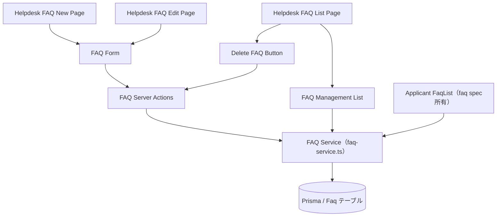
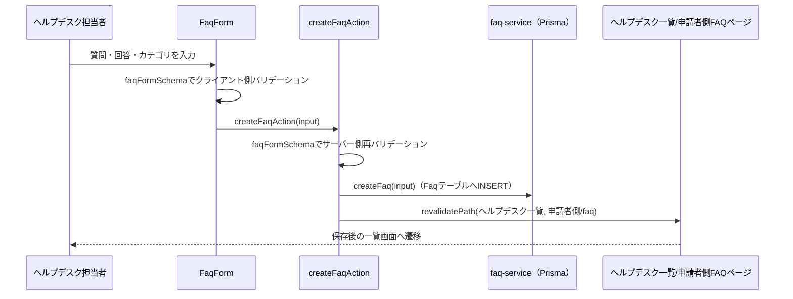

# 技術設計書: faq-management

## Overview

**Purpose**: 本機能は、ヘルプデスク担当者がFAQ（質問・回答・カテゴリ）を登録・編集・削除できる管理画面（`/helpdesk/faq`配下）を提供する。あわせて、申請者側の閲覧機能（`faq`spec）が依存するFAQデータの書き込み系（作成・更新・削除）と、ヘルプデスク向け一覧取得の型契約を本specが所有・提供する。

**Users**: 日本側ヘルプデスク担当者が、海外販社向けのよくある質問と回答を継続的に整備する際に利用する。

**Impact**: 現状、ヘルプデスク側のFAQ画面は申請者側と同一の閲覧専用コンポーネント（`FaqList`）を流用しているだけで、作成・編集・削除の手段が存在しない。本specはこの画面を管理画面に置き換え、`documents-management`が確立したヘルプデスク側CRUDのルート構成（一覧・新規作成・編集）と、`announcements-management`のServer Actions + サーバー側バリデーションパターンをそのまま踏襲する。データ層は`backend-db-foundation`が導入したPrisma/PostgreSQL上の`Faq`モデルを、既存のサーバー専用サービス層（`src/lib/server/faq-service.ts`）を拡張して読み書きする。

### Goals
- ヘルプデスク担当者がFAQを作成・編集・削除できる
- FAQごとにカテゴリ（既存の`FaqCategory`の4値）を指定できる
- 変更操作の完了後、申請者側のFAQ一覧表示に確実に反映される
- 既存の`documents-management`・`announcements-management`のパターンを踏襲し、新規の抽象化・依存ライブラリを追加しない

### Non-Goals
- 申請者側のFAQ一覧画面のレイアウト・カテゴリ別グループ表示・アコーディオン実装自体（`faq`spec所有）
- 申請者側のFAQ検索・キーワードフィルタ機能（`faq`spec側で扱う）
- 認証・ロールベースアクセス制御（フェーズ3以降）
- `Faq`モデル/`Faq`型・`FaqCategory`選択肢自体の変更（既存定義を流用する）
- FAQへの公開範囲（配信対象）・公開状態（下書き/公開）・表示順の概念の追加（既存`Faq`モデルに存在しないため対象外）

## Boundary Commitments

### This Spec Owns
- `/[locale]/helpdesk/faq`・`/[locale]/helpdesk/faq/new`・`/[locale]/helpdesk/faq/[id]/edit`配下の全ページ（現状の閲覧専用流用画面を管理画面へ置き換える）
- FAQの作成・更新・削除を行うサービス層関数（`createFaq`・`updateFaq`・`deleteFaq`）と、ヘルプデスク向け取得関数（`listFaqsForHelpdesk`・`getFaqById`）の型契約・実装（`src/lib/server/faq-service.ts`への追加）
- FAQの作成・編集・削除のServer Actions（`src/lib/actions/faqs.ts`、新規）
- FAQフォームのサーバー側バリデーションスキーマ（`src/lib/validation/faq.ts`、新規）
- `CreateFaqInput`型（作成・更新入力、`src/types/faq.ts`への追加）
- `HelpdeskSidebar`への「FAQ管理」ナビゲーション項目の追加

### Out of Boundary
- `faq`spec所有の申請者側`FaqList`・カテゴリ別グループ表示・アコーディオン・状態表示のレイアウト・実装
- `faq`specが所有する`Faq`型・`FaqCategory`の選択肢定義（読み取り専用で再利用する）
- `helpdesk-portal-layout`が所有するルートセグメント構造・`HelpdeskAppShell`・`HelpdeskHeader`自体の変更
- 認証・ロールベースアクセス制御の実装

### Allowed Dependencies
- `announcements-management`・`documents-management`が確立したServer Actions + サーバー側バリデーション + `revalidatePath`パターン
- `backend-db-foundation`が導入したPrismaクライアント（`src/lib/db/prisma.ts`）・`Faq`モデル
- `faq`spec所有の`Faq`型・`FaqCategory`型（`src/types/faq.ts`）の再利用
- 既存のUIプリミティブ（`Card`, `Button`, `Select`, `Input`, `Textarea`, `Label`）
- `HelpdeskSidebar`（項目追加のみ）

### Revalidation Triggers
- `Faq`型・`FaqCategory`のフィールド・選択肢の変更（`faq`specが再確認する必要がある）
- `listFaqs`の関数シグネチャ変更（`faq`specの実装前提が変わる）

## Architecture

### Existing Architecture Analysis
`documents-management`specが確立したヘルプデスク側CRUDのルート構成（一覧→新規作成/編集、`mode: "create"|"edit"`共用フォーム、`DeleteXxxButton`によるブラウザ標準`confirm()`削除）と、`announcements-management`のServer Actions + zodスキーマパターンをそのまま踏襲する。FAQはファイル添付・公開範囲・公開状態を持たない単純なエンティティのため、`documents-management`から「PDFファイル検証・公開範囲（targeting）指定・可視性フィルタ」を取り除いた最小構成となる。データ層は既存の`src/lib/server/faq-service.ts`（`listFaqs`のみ実装済み）を拡張し、CRUD関数を追加する。

### Architecture Pattern & Boundary Map
`documents-management`と同一のパターンを踏襲する（可視性フィルタ・ファイルフィールドを持たない点のみ異なる）。



**Architecture Integration**:
- 選択パターン: Server Actions + サーバー専用サービス層（`announcements-management`・`documents-management`と同一パターン。データ実体はPrisma/PostgreSQL）
- ドメイン境界: FAQデータは単一の`Faq`テーブルに集約し、ヘルプデスク側（管理一覧）と申請者側（カテゴリ別閲覧）の両方が`faq-service`経由で読む。可視性スコープは持たない（FAQは全社共通）
- 既存パターンの維持: フォームは`react-hook-form`+`zod`、ページ構成（一覧→新規作成/編集）は`documents-management`と同じNext.js App Router構成を踏襲
- 新規コンポーネントを最小化: ファイル添付・公開範囲選択のUIを持たないため、`documents-management`の`DocumentFileField`に相当する追加コンポーネントは不要
- Steering準拠: 表示テキストは全て`next-intl`翻訳キー経由、データアクセスは`src/lib/server/`のサービス層に集約という既存規約を維持

### Technology Stack

| Layer | Choice / Version | Role in Feature | Notes |
|-------|------------------|-----------------|-------|
| Frontend | Next.js App Router（既存, 14.2.35） | ページ構成・Server Actions | `documents-management`と同一パターン |
| Forms | react-hook-form + zod（既存） | FAQ作成・編集フォームのバリデーション | 質問・回答・カテゴリの必須検証 |
| UI | shadcn/ui（既存） | `Select`（カテゴリ選択）, `Input`（質問）, `Textarea`（回答） | 新規UIプリミティブの追加は不要。削除確認はブラウザ標準`confirm()`を使用 |
| Data | Prisma / PostgreSQL（`backend-db-foundation`基盤）+ `faq-service.ts` | FAQのCRUD | 既存の`listFaqs`にCRUD関数を追加 |

## File Structure Plan

### Directory Structure
```
src/app/[locale]/helpdesk/faq/
├── page.tsx                        # 一覧（全件表示・削除導線）※現状の閲覧専用流用画面を置き換える
├── new/
│   └── page.tsx                    # 新規作成
└── [id]/
    └── edit/
        └── page.tsx                 # 編集・削除

src/components/features/helpdesk-faq/
├── FaqManagementList.tsx            # Server: 全件取得・一覧表示
├── FaqForm.tsx                      # Client: 新規作成・編集共用フォーム（カテゴリ選択を含む）
└── DeleteFaqButton.tsx              # Client: confirm()による確認 + 削除アクション呼び出し

src/lib/server/
└── faq-service.ts                   # 変更: listFaqsForHelpdesk / getFaqById / createFaq / updateFaq / deleteFaq を追加

src/lib/actions/
└── faqs.ts                          # 新規: "use server" Server Actions（create/update/delete）

src/lib/validation/
└── faq.ts                           # 新規: FAQフォームのzodスキーマ（question/answer必須、category enum）

src/types/
└── faq.ts                           # 変更: CreateFaqInput を追加（既存 Faq / FaqCategory は変更しない）

src/components/layout/
└── HelpdeskSidebar.tsx               # 変更: 「FAQ管理」ナビゲーション項目を追加

messages/
├── ja.json                          # 変更: helpdeskFaq名前空間、helpdeskNavへのキー追加
└── en.json                          # 同上
```

### Modified Files
- `src/lib/server/faq-service.ts` — 既存の`listFaqs`はそのまま維持し、ヘルプデスク向け一覧（`listFaqsForHelpdesk`、`createdAt`降順・`createdAt`を含む）・`getFaqById`・`createFaq`・`updateFaq`・`deleteFaq`を追加する
- `src/types/faq.ts` — `CreateFaqInput`（`{ question: string; answer: string; category: FaqCategory }`）を追加。既存の`Faq`・`FaqCategory`は変更しない
- `src/components/layout/HelpdeskSidebar.tsx` — `HELPDESK_NAV_ITEMS`に1項目追加
- `messages/ja.json` / `messages/en.json` — 新規名前空間・キーの追加。カテゴリ表示名は`faq`specが定義済みのキーを再利用する

> `faq`spec所有の申請者側`FaqList`・カテゴリ別グループ表示・アコーディオンは本specでは変更しない。これらが呼び出す`listFaqs`の型インターフェースを本specは変更しない。

## System Flows

FAQの作成・編集・削除はいずれも「Client Component → Server Action → サービス層（Prisma）→ revalidatePath」という同一パターンに従う（`documents-management`の削除フローと同型）ため、代表として新規作成フローを図示する。



- 編集・削除も同様に、Server Action内で（作成・編集は`faqFormSchema`による）サーバー側バリデーションを行った後、サービス層を通じてFAQテーブルを更新し、影響範囲の全ルート（ヘルプデスク側・申請者側`/faq`）を`revalidatePath`で再検証する。

## Requirements Traceability

| Requirement | Summary | Components | Interfaces | Flows |
|-------------|---------|------------|------------|-------|
| 1.1〜1.6 | ヘルプデスク側FAQ一覧 | FaqManagementList | FaqService (Service) | — |
| 2.1〜2.4 | FAQの新規作成 | FaqForm, FaqActions | Service | 新規作成フロー |
| 3.1〜3.4 | FAQの編集 | FaqForm, FaqActions | Service | 新規作成フローと同型 |
| 4.1〜4.3 | FAQの削除 | DeleteFaqButton, FaqActions | Service | 新規作成フローと同型 |
| 5.1〜5.4 | カテゴリの指定 | FaqForm, faqFormSchema | Service | — |
| 6.1〜6.2 | ナビゲーション統合 | HelpdeskSidebar | — | — |
| 7.1〜7.2 | 申請者側表示への反映 | FaqActions（revalidatePath） | Service | 新規作成フロー |
| 8.1〜8.3 | 多言語対応 | 全新規コンポーネント | — | — |
| 9.1 | レスポンシブ対応 | （既存HelpdeskAppShellに依存、新規コンポーネントなし） | — | — |

## Components and Interfaces

| Component | Domain/Layer | Intent | Req Coverage | Key Dependencies (P0/P1) | Contracts |
|-----------|--------------|--------|---------------|---------------------------|-----------|
| FaqManagementList | UI/Server | 全件のFAQを取得・一覧表示 | 1.1〜1.6 | FaqService (P0) | State |
| FaqForm | UI/Client | 質問・回答・カテゴリの入力・送信 | 2.1〜2.4, 3.1〜3.4, 5.1〜5.4 | FaqActions (P0) | State |
| DeleteFaqButton | UI/Client | 削除確認・削除アクション呼び出し | 4.1〜4.3 | FaqActions (P0) | State |
| FaqService | Data/Service | FAQの読み取り（全件）・CRUD（Prisma） | 1.1, 7.1 | Prisma (P0), Faq型 (P0) | Service |
| FaqActions | Server Actions | サービス層のCRUDを呼び出し、`revalidatePath`で再検証する | 2.3, 3.3, 4.3, 7.1 | FaqService (P0) | Service |

### Data / Service Layer

#### FaqService

| Field | Detail |
|-------|--------|
| Intent | 申請者側・ヘルプデスク側の双方にFAQを提供し、ヘルプデスク側からのCRUDを行う |
| Requirements | 1.1, 7.1 |

**Responsibilities & Constraints**
- `listFaqs`（既存、変更しない）は申請者側`faq`specが利用する読み取り関数。絞り込みを行わず全件を返す
- `listFaqsForHelpdesk`は管理一覧用に`createdAt`降順で全件を返す（`createdAt`フィールドを含める）
- `getFaqById`は指定IDのFAQを1件返し、存在しない場合は`null`を返す
- ミューテーション（`createFaq`・`updateFaq`・`deleteFaq`）はPrisma経由で`Faq`テーブルを更新する。`createFaq`は`createdAt`をDBの`@default(now())`に委ねる
- FAQは可視性スコープ（配信対象）を持たないため、ヘルプデスク側・申請者側で同一のレコード集合を扱う

**Dependencies**
- Inbound: `FaqActions`（P0）, `FaqManagementList`（P0）, `faq`spec所有の`FaqList`（読み取り専用、P0）
- Outbound: Prismaクライアント（P0）

**Contracts**: Service [x]

##### Service Interface
```typescript
interface FaqService {
  listFaqs(): Promise<Faq[]>;                                  // 既存（変更しない）
  listFaqsForHelpdesk(): Promise<FaqWithTimestamp[]>;          // createdAt降順・createdAtを含む
  getFaqById(id: string): Promise<Faq | null>;
  createFaq(input: CreateFaqInput): Promise<Faq>;
  updateFaq(id: string, input: CreateFaqInput): Promise<Faq>;
  deleteFaq(id: string): Promise<void>;
}
```
- Preconditions: `updateFaq`/`deleteFaq`の`id`は存在するFAQのIDであること
- Postconditions: `createFaq`で作成されたFAQは、直後の`listFaqs`/`listFaqsForHelpdesk`の結果に反映される
- Invariants: `listFaqs`が返す集合と`listFaqsForHelpdesk`が返す集合は同一のレコード群を表す（並び順・付随フィールドのみ異なる）

**Implementation Notes**
- Integration: `faq`spec は本サービスの`listFaqs`のみを利用する（型・戻り値を変更しない限り、申請者側の実装に影響しない）
- Validation: 存在しないIDに対する`updateFaq`/`deleteFaq`はエラーをthrowする（Prismaの`P2025`をハンドリングして見つからない旨を返してもよい）
- Risks: なし（永続化はPrisma/PostgreSQL。フェーズ1のモック配列ではない）

### Server Actions

#### FaqActions

| Field | Detail |
|-------|--------|
| Intent | クライアントからのFAQ作成・編集・削除操作を受け、サーバー側バリデーション・ミューテーション・関連ルートの再検証を行う |
| Requirements | 2.2〜2.3, 3.2〜3.3, 4.3, 5.2, 7.1 |

**Responsibilities & Constraints**
- 全ての関数に`"use server"`を付与する
- `createFaqAction`・`updateFaqAction`は`faqFormSchema`（zod）で質問・回答・カテゴリを検証し、不正な入力は保存せず例外を送出する
- 各操作の最後に、ヘルプデスク側一覧・編集、申請者側`/faq`ルートを`revalidatePath`で再検証する

**Contracts**: Service [x]

##### Service Interface
```typescript
interface FaqActions {
  createFaqAction(input: CreateFaqInput): Promise<Faq>;
  updateFaqAction(id: string, input: CreateFaqInput): Promise<Faq>;
  deleteFaqAction(id: string): Promise<void>;
}
```
- Preconditions: `input`はクライアント側で`react-hook-form`+`zod`によりバリデーション済みであること（サーバー側でも同一スキーマで再検証する）
- Postconditions: 成功時、対象ルート群が再検証され、次回アクセス時に最新状態が反映される
- Invariants: バリデーション失敗時はDBを変更しない

**Implementation Notes**
- Integration: `revalidatePath`の対象は`/[locale]/helpdesk/faq`（page）, `/[locale]/helpdesk/faq/[id]/edit`（page）, `/[locale]/faq`（page）
- Validation: サーバー側バリデーションはクライアント側と同一の`faqFormSchema`を再利用する

### Presentation Components（サマリーのみ）

- **FaqManagementList**: `listFaqsForHelpdesk()`を登録日降順で表示し、各行に質問・カテゴリ表示名・登録日、編集リンクと`DeleteFaqButton`を配置する。既存`DocumentManagementList`と同じ構造パターンを踏襲する。
- **FaqForm**: 質問（`Input`）・回答（`Textarea`）・カテゴリ（`Select`、`FaqCategory`の4値）を持つ`react-hook-form`+`zod`フォーム。新規作成・編集で共用する。
- **DeleteFaqButton**: クリック時に`confirm()`でユーザーに確認し、確認後に`deleteFaqAction`を呼び出す。

## Data Models

### Domain Model
- `Faq`（既存、変更しない）: `id`, `category`, `question`, `answer`
- `CreateFaqInput`（新規）: `{ question: string; answer: string; category: FaqCategory }`（`id`・`createdAt`を除いた作成・更新入力）
- `FaqCategory`（既存、変更しない）: `"inquiry_method" | "form_input" | "status" | "other"`

### Logical Data Model
- `Faq`は単一エンティティ。Prismaの`Faq`モデル（`id`・`category`・`question`・`answer`・`createdAt`）に対応する。公開範囲・公開状態・表示順といった追加のリレーション・属性は持たない。

### Data Contracts & Integration

| 型 | 主なフィールド | 備考 |
|---|---|---|
| `Faq` | `id`, `category`, `question`, `answer` | `faq`spec所有。本specは変更しない |
| `CreateFaqInput` | `question`, `answer`, `category` | `Faq`から`id`を除き、`createdAt`はDBが採番 |
| `FaqCategory` | `inquiry_method` \| `form_input` \| `status` \| `other` | `faq`spec所有の既存定義を流用 |

## Error Handling

### Error Strategy
`documents-management`と同様のパターンを踏襲する。Server Componentは取得失敗時にtry/catchでエラーメッセージを表示し、Server Actionsは不正な入力・存在しないIDに対してエラーをthrowし、呼び出し元のクライアントコンポーネントがエラー状態を表示する。

### Error Categories and Responses
- **データ取得失敗**（一覧）: 既存パターンと同様にエラーメッセージを表示
- **存在しないFAQ IDへの編集・削除操作**: Server Actionがエラーをthrow（またはPrisma `P2025`をハンドリング）し、クライアント側で見つからない旨/エラー表示にフォールバック
- **入力値不正**（質問・回答・カテゴリ未入力）: クライアント側`zod`バリデーションで送信をブロックし、フィールド単位のエラーメッセージを表示。サーバー側でも同一スキーマで再検証する

### Monitoring
フェーズ1では追加のロギング・監視基盤は導入しない。

## Testing Strategy

- **Unit Tests**:
  - `listFaqsForHelpdesk`が`createdAt`降順で全件を返すこと、`getFaqById`が存在しないIDに対して`null`を返すこと
  - `createFaq`/`updateFaq`/`deleteFaq`が対象のFAQのみを操作し、他のレコードに影響しないこと（存在しないIDへの操作がエラーになること）
  - `faqFormSchema`が質問・回答の未入力、カテゴリ未選択（4値以外）を拒否すること
  - Server Actionsが不正な入力を拒否し、DBを変更しないこと
- **Integration Tests**:
  - ヘルプデスク側でFAQを作成後、申請者側`/faq`の該当カテゴリグループに表示されること
  - 編集でカテゴリを変更すると、申請者側で別グループに移動して表示されること
  - 削除後、ヘルプデスク側一覧・申請者側`/faq`の両方から除去されること
- **E2E/UI Tests**:
  - 日本語・英語両ロケールで一覧・作成・編集画面が表示され、カテゴリ表示名が`faq`specと同一のラベルで切り替わること
  - タブレット幅（768px）で新規画面が横スクロールを起こさないこと

## Security Considerations
フェーズ1は認証未実装のため、ヘルプデスク側のFAQ作成・編集・削除画面は`helpdesk-portal-layout`の前提通り制限なくアクセス可能である。FAQは可視性スコープを持たない全社共通データであり、公開範囲による情報分離は行わない。フェーズ3で認証が導入される際、本specのルート境界を変更せずにアクセス制御（ヘルプデスク担当者のみ書き込み可）を追加できることを設計上の前提とする。

## 設計追記（2026-07-22）: FAQ削除確認のアプリ内モーダル化（要件10）

### 変更対象
- `src/components/features/helpdesk-faq/DeleteFaqButton.tsx`: `window.confirm(confirmMessage)`を廃止し、共通`ConfirmDialog`（`src/components/ui/confirm-dialog.tsx`, helpdesk-portal-layout要件15）でラップ。トリガー＝既存削除ボタン（`variant="destructive"`）、確認押下時に既存の削除処理を`onConfirm`として実行、`isPending`を伝播。
- Props: `question`（対象質問文）と確認モーダル用文言（見出し・本文・確認/キャンセル）を追加。既存の`confirmMessage` propは`{question}`埋め込み済み本文へ置換。

### i18n
- `helpdeskFaq.list.deleteConfirm`を`{question}`プレースホルダー付きに変更（ja/en）。確認見出し・確認/キャンセルボタン文言のキーを追加。

### テスト
- `DeleteFaqButton.test.tsx`を`window.confirm`モック前提から`ConfirmDialog`操作前提へ更新（トリガー→確認で削除、キャンセルで未実行、本文に質問文表示）。
