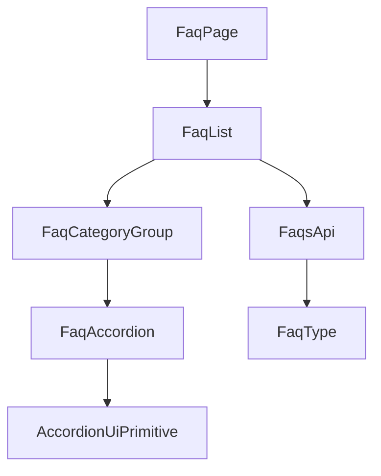

# 技術設計書: faq

## Overview

**Purpose**: 本機能は、海外販社担当者がヘルプデスクへ問い合わせる前に、よくある質問と回答をカテゴリ別に整理された一覧ページ（`/faq`）でセルフサービス的に確認できるようにする。

**Users**: 海外販社の担当者が、サイドバーの「FAQ」ナビゲーションから遷移し、質問をクリック（アコーディオン展開）して回答を確認する際に利用する。

**Impact**: 既存の`/faq`は`PlaceholderPage`を表示しているのみであり、本設計はそれを実際のFAQ一覧表示に置き換える。`Faq`型・関連モックAPI・アコーディオンUIプリミティブは本仕様が新規に定義する。既存の`Announcement`/`Link`/`Inquiry`関連の型・コンポーネントは変更しない。

### Goals
- よくある質問をカテゴリ別にグループ化して一覧表示する
- 質問をクリック（またはキーボード操作）すると回答が展開/折りたたみされ、複数の質問を独立して同時展開できる
- アコーディオンの開閉状態がスクリーンリーダー利用者にも識別できる（`aria-expanded`等）
- 日本語・英語の両言語でFAQ一覧が利用できる

### Non-Goals
- ヘルプデスク担当者向けのFAQ新規作成・編集・削除機能
- FAQの検索・キーワードフィルタ機能
- 質問ごとの詳細画面（動的ルート）
- ユーザーからの「役に立った」等のフィードバック収集機能

## Boundary Commitments

### This Spec Owns
- FAQ一覧ページ（`/faq`）のUI
- `Faq`型・カテゴリ定数（`src/types/faq.ts`・`src/lib/constants/faq-options.ts`）
- 静的モックデータと、それを返すモック関数（`lib/api/faqs.ts`の`getFaqs`）
- FAQ関連の翻訳キー（`messages/ja.json` / `en.json` の `faq` 名前空間）
- 新規のアコーディオンUIプリミティブ（`components/ui/accordion.tsx`）

### Out of Boundary
- `Announcement`/`Link`/`Inquiry`型・関連モックAPI・関連コンポーネント（本仕様はこれらを一切変更しない）
- グローバルレイアウト（Header/Sidebar/AppShell/LanguageSwitcher）の変更
- ヘルプデスク側からのFAQ編集・承認ワークフロー（将来フェーズ）

### Allowed Dependencies
- `dashboard` 仕様が提供する `AppShell` / ロケールレイアウト
- 既存のUI基盤コンポーネント（`card.tsx`・`skeleton.tsx`）
- 既存の `next-intl` 設定
- 新規外部依存: `@radix-ui/react-accordion`（既存の`@radix-ui/react-slot`と同系列。ライセンス・React 18ピア互換性を確認済み）

### Revalidation Triggers
- `components/ui/accordion.tsx`を他機能が再利用し始めた場合、本仕様が定義したContractの後方互換性を維持する必要がある
- `@radix-ui/react-accordion`のメジャーバージョンアップ時はAPI変更の有無を確認する

## Architecture

### Existing Architecture Analysis
- `AnnouncementList`/`LinkList`/`InquiryList`（既存仕様）が確立した「async Server Component + `try/catch` + `Suspense`/Skeleton」パターンをデータ取得・状態表示部分で踏襲する
- `LinkList`のカテゴリ別グループ化ループ（`LINK_CATEGORY_CODES`をmapし、該当カテゴリのデータのみをフィルタして`Card`単位で表示）と同様の構造を、FAQ専用の型・定数で再実装する
- 既存のリスト系コンポーネントはすべて非対話的な読み取り専用表示だが、本機能はアコーディオン開閉という初めてのクライアント側インタラクションを持つ。このため、データ取得（Server Component）と開閉インタラクション（Client Component）を明確に分離する

### Architecture Pattern & Boundary Map



**Architecture Integration**:
- **Selected pattern**: データ取得・カテゴリ分類は既存の「async Server Component + `try/catch` + Suspense/Skeleton」パターンを踏襲し、質問1件ごとの開閉インタラクションのみをClient Componentに切り出す「Server/Clientコンポーネント分離」パターンを採用する
- **Domain/feature boundaries**: `lib/api/faqs.ts`（新規） → `components/features/faq/*`（UI） → `app/[locale]/faq/page.tsx`（ルーティング）という一方向の依存関係。カテゴリごとの分類ロジックはServer Component側（`FaqList`）に置き、Client Component（`FaqAccordion`）はpropsで受け取った質問配列の開閉状態のみを管理する
- **Existing patterns preserved**: `AppShell`によるレイアウト共有、`lib/api/`のモック関数規約、`next-intl`翻訳キー規約、`Suspense`+Skeletonによるローディング表示パターン、`lib/constants/*-options.ts`によるカテゴリコード定義規約
- **New components rationale**: `components/ui/accordion.tsx`は`@radix-ui/react-accordion`をラップする新規UIプリミティブで、アクセシビリティ要件（3.4, 3.5）を標準機能で満たすために導入する。`FaqAccordion`は開閉stateを持つ唯一のClient Componentとして責務を分離する
- **Steering compliance**: `structure.md`が想定する`components/features/faq/`構成、`lib/api/`でのモック抽象化、翻訳キー経由の文字列管理、`tech.md`の「状態管理はReact標準機能のみ」（Radixの内部状態はReact標準の`useState`/Contextで実装されており、追加の状態管理ライブラリではない）をすべて満たす

### Technology Stack

| Layer | Choice / Version | Role in Feature | Notes |
|-------|------------------|------------------|-------|
| Frontend | Next.js 14.2 (App Router) + React 18 + TypeScript 5 | 既存スタックを継続利用 | 変更なし |
| UIコンポーネント | `@radix-ui/react-accordion` 1.2.x（新規） + 既存の`card`/`skeleton` | アコーディオン開閉の基盤ロジック・アクセシビリティ属性 | React 18ピア互換性確認済み（`^16.8 \|\| ^17.0 \|\| ^18.0 \|\| ^19.0`）。既存の`@radix-ui/react-slot`と同系列のライブラリで技術選定の一貫性がある |
| 多言語対応 | next-intl（既存） | 一覧文字列の翻訳 | 新規の`faq`名前空間を追加 |
| データ取得 | モック関数（`lib/api/faqs.ts`、新規） | `getFaqs`を新規追加 | 既存の他機能のAPIファイルとは独立したファイル |

## File Structure Plan

### Directory Structure
```
src/
├── types/
│   └── faq.ts                              # 新規: Faq型・FaqCategory型
├── lib/
│   ├── constants/
│   │   └── faq-options.ts                  # 新規: FAQ_CATEGORY_CODES定数
│   └── api/
│       └── faqs.ts                         # 新規: 静的モックデータ + getFaqs
├── components/
│   ├── ui/
│   │   └── accordion.tsx                   # 新規: Radixラッパー（Accordion/AccordionItem/AccordionTrigger/AccordionContent）
│   └── features/
│       └── faq/
│           ├── FaqList.tsx                 # 一覧取得・状態管理 + FaqListSkeleton（Server Component）
│           ├── FaqCategoryGroup.tsx        # カテゴリ見出し + 質問配列の受け渡し（Server Component）
│           └── FaqAccordion.tsx            # 開閉インタラクション（Client Component、"use client"）
└── app/[locale]/faq/
    └── page.tsx                            # PlaceholderPage呼び出しをFaqList呼び出しに変更
messages/ja.json, messages/en.json          # faq 名前空間（一覧見出し・空/エラーメッセージ・カテゴリ表示名）を新規追加
```

### Modified Files
- `src/app/[locale]/faq/page.tsx` — `PlaceholderPage`の呼び出しを、`Suspense`+`FaqListSkeleton`でラップした`FaqList`の呼び出しに置き換える
- `package.json` — `@radix-ui/react-accordion`を依存に追加
- `messages/ja.json` / `messages/en.json` — `faq`名前空間（一覧見出し・空/エラーメッセージ・カテゴリ表示名）を新規追加

## Requirements Traceability

| Requirement | Summary | Components | Interfaces | Flows |
|-------------|---------|------------|------------|-------|
| 1.1–1.3 | 一覧ページへのアクセス・全体構造 | FaqPage, FaqList | - | - |
| 2.1–2.4 | カテゴリ別分類 | FaqList, FaqCategoryGroup | GetFaqs Service Interface | - |
| 3.1–3.5 | アコーディオン表示 | FaqCategoryGroup, FaqAccordion | AccordionUi State Interface | アコーディオン開閉フロー |
| 4.1–4.3 | 状態表示 | FaqList | GetFaqs Service Interface | - |
| 5.1–5.2 | モックAPI連携 | FaqList | GetFaqs Service Interface | - |
| 6.1–6.3 | 多言語対応 | 全コンポーネント | messages/faq | - |
| 7.1–7.2 | レスポンシブ | FaqList, FaqCategoryGroup, FaqAccordion | - | - |

## Components and Interfaces

| Component | Domain/Layer | Intent | Req Coverage | Key Dependencies (P0/P1) | Contracts |
|-----------|--------------|--------|---------------|---------------------------|-----------|
| FaqList | Feature | 全件取得・ローディング/エラー/空状態の管理・カテゴリ別グループ化 | 1, 2, 4, 5 | GetFaqs (P0), FaqCategoryGroup (P1) | Service, State |
| FaqCategoryGroup | Feature (UI) | カテゴリ見出し表示、質問配列を`FaqAccordion`へ橋渡し | 2.2, 2.3 | FaqAccordion (P1) | - |
| FaqAccordion | Feature (UI, Client) | 質問クリック/キー操作による回答の開閉、開閉状態の独立管理 | 3.1, 3.2, 3.3, 3.4, 3.5 | AccordionUiPrimitive (P0) | State |
| AccordionUiPrimitive (`components/ui/accordion.tsx`) | UI Primitive | `@radix-ui/react-accordion`のラップ、`aria-expanded`等の付与 | 3.4, 3.5 | @radix-ui/react-accordion (P0) | State |

### Feature Layer

#### FaqList

| Field | Detail |
|-------|--------|
| Intent | FAQ全件を取得し、カテゴリごとにグループ化して表示する。ローディング・エラー・空状態を管理する |
| Requirements | 1.1, 1.2, 2.1, 2.2, 4.1, 4.2, 4.3, 5.1 |

**Responsibilities & Constraints**
- async Server Componentとして実装し、`getFaqs()`を`try/catch`で呼び出す（`LinkList`と同じエラーハンドリング規約）
- 取得結果を`FAQ_CATEGORY_CODES`の順にフィルタし、該当データが1件もないカテゴリはグループ自体を表示しない（`LinkList`と同じ規約）
- 取得結果が空配列の場合、専用の空状態メッセージを表示する

**Dependencies**
- Outbound: `getFaqs`（モックAPI） — 一覧データ取得 (P0)
- Outbound: `FaqCategoryGroup` — カテゴリ単位の表示 (P1)

**Contracts**: Service [x] / API [ ] / Event [ ] / Batch [ ] / State [x]

##### Service Interface
```typescript
function getFaqs(): Promise<Faq[]>;
```
- Preconditions: なし
- Postconditions: 全件の`Faq`配列を解決する（並び順の保証はなく、カテゴリ別グループ化は呼び出し側の責務とする。`getLinks`と同一の規約）
- Invariants: 他機能（`Announcement`/`Link`/`Inquiry`）のデータとは独立している

##### State Management
- State model: サーバーコンポーネントのため、クライアント側の状態は持たない
- Persistence & consistency: フェーズ1ではクライアントに状態を保持しない

**Implementation Notes**
- Integration: `lib/api/faqs.ts`は本仕様が新規に作成するファイルであり、既存のAPIファイルとの衝突はない
- Validation: 該当なし（読み取り専用の一覧表示）
- Risks: なし

#### FaqCategoryGroup

新しい境界（ロジック・外部結合）を持たないプレゼンテーション層のコンポーネントであり、サマリー行の記載で十分とする。

**Implementation Notes**
- Integration: `FaqList`からカテゴリコード・カテゴリ表示ラベル・当該カテゴリに属する`Faq[]`をpropsで受け取り、`Card`内にカテゴリ見出しと`FaqAccordion`を配置する
- Validation: 該当なし
- Risks: なし

#### FaqAccordion

| Field | Detail |
|-------|--------|
| Intent | 質問ごとの回答表示/非表示をクリック・キーボード操作で切り替え、各質問の開閉状態を独立して管理する |
| Requirements | 3.1, 3.2, 3.3, 3.4, 3.5 |

**Responsibilities & Constraints**
- `"use client"`境界を持つ唯一のコンポーネントとし、`components/ui/accordion.tsx`（`AccordionUiPrimitive`）の`type="multiple"`モードを用いて、複数の質問を独立して同時展開できるようにする（要件3.3）
- 初期状態はすべての質問を折りたたんだ状態とする（要件3.1）。Radixの`defaultValue`を空配列として渡すことで表現する
- キーボード操作（Enter/Space/矢印キー）・`aria-expanded`はRadixプリミティブが標準で提供するため、本コンポーネントはそれを呼び出すのみで要件3.4/3.5を満たす

**Dependencies**
- Outbound: `AccordionUiPrimitive`（`components/ui/accordion.tsx`） — 開閉ロジック・アクセシビリティ属性の提供 (P0)

**Contracts**: Service [ ] / API [ ] / Event [ ] / Batch [ ] / State [x]

##### State Management
- State model: Radixの`Accordion.Root`が内部で保持する「展開中の質問idの配列」をクライアント側stateとして利用する（`type="multiple"`、非制御モード）
- Persistence & consistency: ページ再読み込みで開閉状態はリセットされる（永続化はフェーズ1の要件外）
- Concurrency strategy: 単一ユーザーのブラウザ内状態のみであり、並行性の考慮は不要

**Implementation Notes**
- Integration: `FaqCategoryGroup`から質問配列（`{id, question, answer}`相当）をpropsで受け取り、`AccordionUiPrimitive`の`Item`/`Trigger`/`Content`にマッピングする
- Validation: 該当なし
- Risks: Radixの`Content`はアンマウントせず`hidden`属性で非表示にする実装のため、質問数が極端に多い場合はDOMサイズが増える。フェーズ1のFAQ件数（8〜12件程度）では実害はない

#### AccordionUiPrimitive（`components/ui/accordion.tsx`）

| Field | Detail |
|-------|--------|
| Intent | `@radix-ui/react-accordion`をラップし、`Badge`/`Card`と同様のTailwindスタイルを適用した汎用UIプリミティブを提供する |
| Requirements | 3.4, 3.5 |

**Responsibilities & Constraints**
- `Accordion`・`AccordionItem`・`AccordionTrigger`・`AccordionContent`をエクスポートし、`Card`/`Badge`と同じ`components/ui/`配下の汎用プリミティブとして位置づける
- スタイリング以外のロジック（開閉判定・アクセシビリティ属性）はRadix本体に委譲し、本コンポーネントは独自のロジックを持たない

**Dependencies**
- External: `@radix-ui/react-accordion`（1.2.x） — 開閉ロジック・アクセシビリティ属性の提供 (P0)

**Contracts**: Service [ ] / API [ ] / Event [ ] / Batch [ ] / State [x]

##### State Management
- State model: `@radix-ui/react-accordion`の`Root`コンポーネントが管理する内部状態をそのまま利用する（本コンポーネントは状態を持たない）

**Implementation Notes**
- Integration: 将来的に他機能（FAQ以外）がアコーディオンUIを必要とする場合、本コンポーネントを再利用できる
- Validation: 該当なし
- Risks: なし

## Data Models

### Domain Model
- `Faq`は本仕様が新規に定義する独立したドメイン型であり、既存の`Announcement`/`Link`/`Inquiry`型とは無関係
- 属性: `id`（一意識別子）・`category`（`FaqCategory`）・`question`（質問文）・`answer`（回答文）
- 静的モックデータは`lib/api/faqs.ts`内に配列として保持する

### Logical Data Model
| フィールド | 型 | 説明 |
|---|---|---|
| `id` | `string` | 一意識別子 |
| `category` | `FaqCategory`（`"inquiry_method" \| "form_input" \| "status" \| "other"`） | カテゴリコード（仮値、ヒアリング後に変更前提） |
| `question` | `string` | 質問文 |
| `answer` | `string` | 回答文 |

### Data Contracts & Integration

**モックAPI契約**
- `getFaqs(): Promise<Faq[]>` — FAQ全件を返す（並び順の保証なし）

## Error Handling

### Error Strategy
- **一覧取得失敗**: `FaqList`内の`try/catch`でエラーメッセージ（翻訳キー経由）を表示する
- **FAQが0件**: `FaqList`が空状態メッセージ（翻訳キー経由）を表示する

### Monitoring
- フェーズ1ではモックAPIのためサーバーサイド監視は対象外

## Testing Strategy

- **Unit Tests**: `getFaqs`が全件を返すことの検証
- **Integration Tests**: `FaqList`の空状態・エラー状態の表示切り替え、`FaqAccordion`の質問クリックによる回答表示/非表示の切り替え、複数質問の独立した開閉状態
- **E2E/UI Tests**: カテゴリ別グループ表示、キーボード操作（Enter/Space）による開閉、`aria-expanded`属性の確認、日英切り替え、タブレット幅でのアコーディオン展開時のレイアウト崩れ確認

## Security Considerations
- 本仕様は読み取り専用のモックデータのみを扱い、外部入力の受け付けは行わない。質問・回答文の表示はReactの標準エスケープに依拠し、`dangerouslySetInnerHTML`を使用しない
