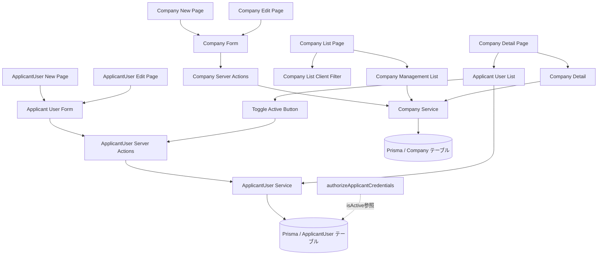
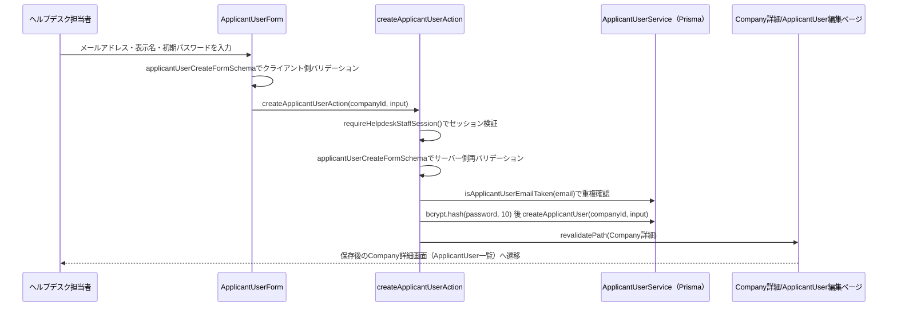
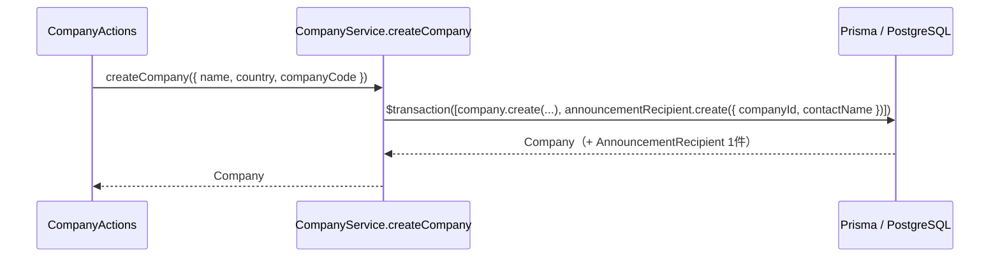
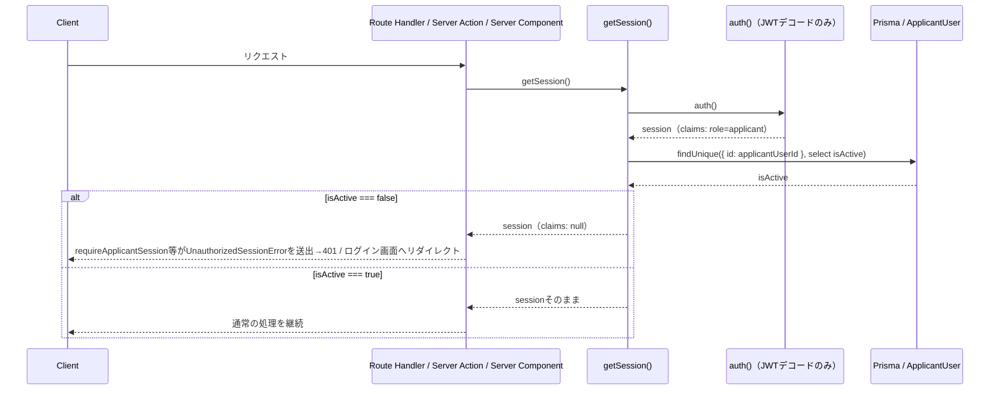

# 技術設計書: helpdesk-account-management

## Overview

**Purpose**: 本機能は、ヘルプデスク担当者が海外販社（`Company`）とその申請者アカウント（`ApplicantUser`）を、管理画面（`/helpdesk/companies`配下）から一覧・新規作成・編集・無効化できるようにする。あわせて、新規作成時にヘルプデスク担当者が初期パスワードを直接設定し、既存アカウントのパスワードも直接再設定できる運用を提供する。

**Users**: 日本側ヘルプデスク担当者が、新規販社の契約・担当者の異動・退職に応じて、継続的に`Company`・`ApplicantUser`データを整備する際に利用する。

**Impact**: 現状、`Company`・`ApplicantUser`は`prisma/schema.prisma`にフェーズ3で定義済みだが、投入・更新手段は`prisma/seed.ts`の直接編集のみである。本specはこれをヘルプデスク側の管理画面に置き換える。`ApplicantUser`モデルに`isActive`フィールド（後方互換なマイグレーション追加、デフォルト`true`）を新設し、無効化されたアカウントの認証を`authorize.ts`側で拒否するようにする。既存の`src/lib/server/company-service.ts`（`listCompaniesForHelpdesk`、`helpdesk-inquiry-management`spec所有の代理登録画面向け読み取り専用関数）はシグネチャを変更せず、本specは同ファイルへ関数を追加する形で書き込み系・詳細取得系を実装する。

### Goals
- ヘルプデスク担当者が`Company`を一覧・新規作成・編集できる
- ヘルプデスク担当者が会社ごとに`ApplicantUser`を一覧・新規作成・編集・無効化／再有効化できる
- 新規`ApplicantUser`作成時・既存アカウント編集時に、ヘルプデスク担当者が初期パスワード・新しいパスワードを直接設定できる
- 無効化されたアカウントがログインできないことを保証する
- 既存のヘルプデスク管理画面（`documents-management`・`faq-management`・`helpdesk-inquiry-management`）が確立したCRUDパターン（Server Component一覧 + Server Actions + zodバリデーション + react-hook-form + `revalidatePath`、`requireHelpdeskStaffSession`による多層防御）をそのまま踏襲し、新規の抽象化を持ち込まない

### Non-Goals
- 実際のメール送信によるパスワードリセット・アカウント招待メール（メール送信基盤が無いため将来フェーズ）
- 多要素認証（MFA）
- CSVインポート等の一括登録・一括無効化（将来検討）
- `ApplicantUser`の物理削除（既存の`Inquiry.companyId`・`AnnouncementRecipientStatus`等の参照整合性のため無効化のみとする）
- `Company`の削除・無効化（既存の申請者アカウント・問い合わせの参照元となるため対象外。将来要件）
- `HelpdeskStaff`（ヘルプデスク担当者自身）の管理画面（別画面・別specの対象）
- ログイン画面自体（`/login`・`/helpdesk/login`のUI・フォーム）の変更。認証ロジック（`authorize.ts`）への無効化チェック追加のみを行う
- ミドルウェアによる`/helpdesk/*`ルート保護自体の変更（`helpdesk-portal-layout`が確立した既存の仕組みをそのまま利用する）

## Boundary Commitments

### This Spec Owns
- `/[locale]/helpdesk/companies`・`/[locale]/helpdesk/companies/new`・`/[locale]/helpdesk/companies/[id]`・`/[locale]/helpdesk/companies/[id]/edit`・`/[locale]/helpdesk/companies/[id]/applicant-users/new`・`/[locale]/helpdesk/companies/[id]/applicant-users/[userId]/edit`配下の全ページ
- `Company`の作成・更新・詳細取得・一覧取得（申請者アカウント数集計付き）を行うサービス層関数（`src/lib/server/company-service.ts`への追加）
- `ApplicantUser`の一覧（会社別）・詳細取得・作成・更新・有効状態変更を行うサービス層関数（新規`src/lib/server/applicant-user-service.ts`）
- `Company`・`ApplicantUser`のServer Actions（新規`src/lib/actions/companies.ts`・`src/lib/actions/applicant-users.ts`）
- 対応するzodバリデーションスキーマ（新規`src/lib/validation/company.ts`・`src/lib/validation/applicant-user.ts`）
- `ApplicantUser`モデルへの`isActive: Boolean @default(true)`フィールド追加（Prismaスキーマ変更・マイグレーション）
- `authorizeApplicantCredentials`（`src/lib/server/authorize.ts`）への無効化アカウントのログイン拒否ロジックの追加
- `HelpdeskSidebar`への「販社管理」ナビゲーション項目の追加
- （2026-07-17 追記）`Company`新規作成時に対応する`AnnouncementRecipient`を同一トランザクションで同期生成する処理（`company-service.ts`の`createCompany`拡張）
- （2026-07-17 追記）`AnnouncementRecipient`が欠落している既存`Company`を補完する冪等バックフィルスクリプト（新規`prisma/backfill-announcement-recipients.ts` + `package.json`スクリプト）
- （2026-07-21 追記）無効化された`ApplicantUser`のログイン済みセッションを次回参照時に失効させる処理（`src/lib/server/get-session.ts`への`isActive`再照会追加）、および申請者側レイアウト（`src/app/[locale]/(applicant)/layout.tsx`）でのログイン画面へのリダイレクト

### Out of Boundary
- 既存の`listCompaniesForHelpdesk`（`helpdesk-inquiry-management`spec所有、代理問い合わせ登録画面向け）のシグネチャ・戻り値・呼び出し元。本specは変更せず、別関数を追加する
- `Company`・`ApplicantUser`以外のPrismaモデル（`Inquiry`・`Announcement`・`Document`等）の変更
- ログイン画面のUI・フォーム・ルーティング自体（`/login`・`/helpdesk/login`の実装は`backend-db-foundation`spec所有のまま変更しない）
- ミドルウェアによる`/helpdesk/*`ルート保護の実装自体（`helpdesk-portal-layout`所有）
- メール送信基盤・パスワードリセットメール・招待メールの実装
- （2026-07-17 追記）`AnnouncementRecipient`の型定義（`src/types/announcement-recipient.ts`）・Prismaスキーマ定義・お知らせのトラッキング/自己申告/リマインド送信ロジック（`announcement-service.ts`・`announcement-notifications.ts`等）。これらは`announcements-management`/`announcements`/`backend-db-foundation`spec所有であり、本specは`Company`作成フロー側での`AnnouncementRecipient`レコード生成のみを追加する（モデル・型・ロジックは読み取り前提で変更しない）
- （2026-07-17 追記）`AnnouncementRecipient`の`contactName`の運用ルール整備・複数担当者の登録UI。本specの同期生成は「会社が識別できる代表担当1件」を作るのみで、担当者名の精緻な運用は将来要件とする

### Allowed Dependencies
- `documents-management`・`faq-management`・`helpdesk-inquiry-management`が確立したServer Actions + zodバリデーション + `revalidatePath`パターン
- `backend-db-foundation`が導入したPrismaクライアント（`src/lib/db/prisma.ts`）・`Company`/`ApplicantUser`モデル
- `helpdesk-portal-layout`が確立した`HelpdeskAppShell`・`HelpdeskSidebar`・ミドルウェアによるルート保護
- 既存の`requireHelpdeskStaffSession`（`src/lib/server/auth-session.ts`）
- 既存の`bcryptjs`によるパスワードハッシュ方式（`authorize.ts`・`prisma/seed.ts`と同一の`bcrypt.hash(password, 10)`）
- 既存のUIプリミティブ（`Card`, `Button`, `Input`, `Select`, `Label`, `Badge`, `Skeleton`, `Alert`）

### Revalidation Triggers
- `ApplicantUser`モデルへのフィールド追加・変更（本specの`isActive`追加を含め、`authorize.ts`・`prisma/seed.ts`・型定義への影響を要確認）
- `Company`・`ApplicantUser`のPrismaモデル自体の破壊的変更（`company-service.ts`の既存関数`listCompaniesForHelpdesk`を利用する`helpdesk-inquiry-management`specへの影響確認が必要）
- ログイン認証ロジック（`authorize.ts`）の変更（`backend-db-foundation`specが定めた認証フローへの影響確認が必要）

## Architecture

### Existing Architecture Analysis
`helpdesk-portal-layout`により、`/[locale]/helpdesk`配下はミドルウェアでヘルプデスクセッションが必須化された独立レイアウト（`HelpdeskAppShell`）を持つ。既存の`src/lib/server/company-service.ts`は`listCompaniesForHelpdesk`（読み取り専用、`requireHelpdeskStaffSession`による多層防御あり）のみを実装済みで、書き込み系・詳細取得系は存在しない。`documents-management`・`faq-management`はいずれも「Server Component一覧ページ → Server Actions → サービス層（Prisma） → `revalidatePath`」という同一パターンを確立しており、本specもこれを踏襲する。認証は`authorize.ts`が`prisma.applicantUser.findUnique`・`bcrypt.compare`で照合する実装済みのCredentials Providerフローであり、本specは`ApplicantUser`取得後の分岐に無効化チェックを1箇所追加するのみで済む。

### Architecture Pattern & Boundary Map
`documents-management`・`helpdesk-inquiry-management`と同一のパターンを踏襲する。`Company`と`ApplicantUser`は1:N関係のため、`Company`詳細画面が`ApplicantUser`一覧の入り口を兼ねる構成とする。



**Architecture Integration**:
- 選択パターン: Server Actions + サーバー専用サービス層（`documents-management`・`faq-management`と同一パターン。データ実体はPrisma/PostgreSQL）
- ドメイン境界: `Company`サービス（`company-service.ts`拡張）と`ApplicantUser`サービス（新規`applicant-user-service.ts`）を分離する。`ApplicantUser`は常に`companyId`のスコープ内で操作され、会社をまたいだ一覧・検索は本specの対象外とする（要件4は「会社ごとの」一覧であり、全社横断の申請者アカウント一覧は持たない）
- 既存パターンの維持: ページ構成（一覧→新規作成/編集、`Company`は詳細画面を追加で持つ）はNext.js App Router構成を踏襲。フォームは`react-hook-form`+`zod`
- 新規コンポーネントの理由: `Company`と`ApplicantUser`はライフサイクル・フォーム項目が異なる別エンティティのため、`CompanyForm`と`ApplicantUserForm`を分離する。無効化操作は削除確認（`confirm()`）と異なり状態変更の確認UIのため専用の`ToggleApplicantUserActiveButton`を新設する
- Steering準拠: 表示テキストは全て`next-intl`翻訳キー経由、データアクセスは`src/lib/server/`のサービス層に集約、Server Actionsは呼び出し時に`requireHelpdeskStaffSession`を検証するという既存規約を維持

### Technology Stack

| Layer | Choice / Version | Role in Feature | Notes |
|-------|------------------|-----------------|-------|
| Frontend | Next.js App Router（既存） | ページ構成・Server Actions | `documents-management`と同一パターン |
| Forms | react-hook-form + zod（既存） | `Company`/`ApplicantUser`作成・編集フォームのバリデーション | パスワードは`ApplicantUserForm`のみが扱う |
| UI | shadcn/ui（既存） | `Input`, `Select`（国選択）, `Badge`（有効/無効表示）, `Button` | 新規UIプリミティブの追加は不要。無効化確認はブラウザ標準`confirm()`を使用（既存`DeleteFaqButton`等と同様） |
| Auth | bcryptjs（既存） | 初期パスワード・再設定パスワードのハッシュ化（`bcrypt.hash(password, 10)`） | `authorize.ts`・`seed.ts`と同一のコスト係数 |
| Data | Prisma / PostgreSQL（`backend-db-foundation`基盤） | `Company`・`ApplicantUser`のCRUD、`isActive`フィールド追加 | マイグレーション追加が必要（後方互換） |

## File Structure Plan

### Directory Structure
```
src/app/[locale]/helpdesk/(dashboard)/companies/
├── page.tsx                                # 一覧（検索・新規作成導線）
├── new/
│   └── page.tsx                            # Company新規作成
└── [id]/
    ├── page.tsx                            # Company詳細 + ApplicantUser一覧
    ├── edit/
    │   └── page.tsx                        # Company編集
    └── applicant-users/
        ├── new/
        │   └── page.tsx                    # ApplicantUser新規作成
        └── [userId]/
            └── edit/
                └── page.tsx                # ApplicantUser編集・パスワード再設定・無効化/再有効化

src/components/features/helpdesk-companies/
├── CompanyManagementList.tsx               # Server: 全件取得（申請者数集計付き）
├── CompanyManagementListClient.tsx         # Client: 会社名・販社コードによる絞り込み
├── CompanyForm.tsx                         # Client: Company新規作成・編集共用フォーム
├── CompanyDetail.tsx                       # Server: Company情報 + ApplicantUserList組み立て
├── ApplicantUserList.tsx                   # 表示専用: 有効状態バッジ・編集導線を含む一覧
├── ApplicantUserForm.tsx                   # Client: ApplicantUser新規作成・編集共用フォーム（パスワード欄含む）
└── ToggleApplicantUserActiveButton.tsx     # Client: confirm()による確認 + 有効/無効切り替えアクション呼び出し

src/lib/server/
├── company-service.ts                      # 変更: listCompaniesForHelpdesk（既存、変更なし）に加え、
│                                            #        listCompaniesForManagement / getCompanyById /
│                                            #        createCompany / updateCompany / isCompanyCodeTaken を追加
├── applicant-user-service.ts               # 新規: listApplicantUsersByCompany / getApplicantUserById /
│                                            #        createApplicantUser / updateApplicantUser /
│                                            #        setApplicantUserActive / isApplicantUserEmailTaken
└── authorize.ts                            # 変更: authorizeApplicantCredentialsにisActive==falseの拒否分岐を追加

src/lib/actions/
├── companies.ts                            # 新規: createCompanyAction / updateCompanyAction
└── applicant-users.ts                      # 新規: createApplicantUserAction / updateApplicantUserAction /
                                             #        setApplicantUserActiveAction

src/lib/validation/
├── company.ts                              # 新規: companyFormSchema（zod）
└── applicant-user.ts                       # 新規: applicantUserCreateFormSchema / applicantUserUpdateFormSchema（zod）

src/lib/constants/
└── applicant-user.ts                       # 新規: APPLICANT_USER_PASSWORD_MIN_LENGTH（8）

src/types/
├── company.ts                              # 新規: CompanyWithStats, CreateCompanyInput
└── applicant-user.ts                       # 新規: ApplicantUserSummary, CreateApplicantUserInput,
                                             #        UpdateApplicantUserInput

src/components/layout/
└── HelpdeskSidebar.tsx                      # 変更: 「販社管理」ナビゲーション項目を追加

prisma/
└── schema.prisma                           # 変更: ApplicantUserに isActive Boolean @default(true) を追加
                                             #        （マイグレーション新規追加。既存フィールドは変更しない）

messages/
├── ja.json                                 # 変更: helpdeskCompanies名前空間、helpdeskNavへのキー追加
└── en.json                                 # 同上
```

### Modified Files
- `src/lib/server/company-service.ts` — 既存の`listCompaniesForHelpdesk`（`CompanyOption`を返す、`helpdesk-inquiry-management`spec所有）はシグネチャ・実装を変更しない。新規に`listCompaniesForManagement()`（`name`昇順、各社の`applicantUserCount`を`_count`で集計）・`getCompanyById(id)`・`createCompany(input)`・`updateCompany(id, input)`・`isCompanyCodeTaken(companyCode, excludeId?)`を追加する
- `src/lib/server/authorize.ts` — `authorizeApplicantCredentials`内、`bcrypt.compare`成功後に`if (!applicantUser.isActive) return null;`を追加する（要件7.5）。`authorizeHelpdeskCredentials`は変更しない（`HelpdeskStaff`は本specの対象外）
- `src/components/layout/HelpdeskSidebar.tsx` — `HELPDESK_NAV_ITEMS`に1項目（`{ translationKey: "companies", href: "/helpdesk/companies", icon: Building2 }`）を追加
- `prisma/schema.prisma` — `ApplicantUser`モデルに`isActive Boolean @default(true)`を追加。`@default(true)`により既存データ（`seed.ts`投入済みレコード）は後方互換にマイグレーションされる
- `messages/ja.json` / `messages/en.json` — 新規名前空間（`helpdeskCompanies`）・`helpdeskNav`への項目追加

> 既存のヘルプデスク画面（`helpdesk-inquiry-management`の代理問い合わせ登録画面）が依存する`listCompaniesForHelpdesk`の型・挙動は変更しない。

## System Flows

`Company`・`ApplicantUser`の作成・編集はいずれも「Client Component（フォーム） → Server Action → サービス層（Prisma） → `revalidatePath`」という同一パターンに従う。パスワードを扱う`ApplicantUser`作成フローを代表として図示する。



- 無効化・再有効化フローは「`ToggleApplicantUserActiveButton`（`confirm()`確認） → `setApplicantUserActiveAction` → `setApplicantUserActive(id, isActive)` → `revalidatePath`」という同型のより単純なフローであり、パスワードの取り扱いを含まない。
- ログイン拒否フローは既存の`authorizeApplicantCredentials`内に閉じる（新規のUI・Server Actionは持たない）。`bcrypt.compare`成功後に`isActive`を確認し、`false`であれば既存のパスワード不一致時と同様に`null`を返す（Auth.js側は既存の「認証失敗」表示にフォールバックする）。

## Requirements Traceability

| Requirement | Summary | Components | Interfaces | Flows |
|-------------|---------|------------|------------|-------|
| 1.1〜1.7 | Company一覧表示 | CompanyManagementList, CompanyManagementListClient | CompanyService (Service) | — |
| 2.1〜2.5 | Companyの新規作成 | CompanyForm, CompanyActions | CompanyService | ApplicantUser作成フローと同型 |
| 3.1〜3.5 | Companyの編集 | CompanyForm, CompanyActions | CompanyService | ApplicantUser作成フローと同型 |
| 4.1〜4.6 | Company詳細・ApplicantUser一覧表示 | CompanyDetail, ApplicantUserList | CompanyService, ApplicantUserService | — |
| 5.1〜5.9 | ApplicantUser新規作成・パスワード設定 | ApplicantUserForm, ApplicantUserActions | ApplicantUserService | ApplicantUser作成フロー |
| 6.1〜6.9 | ApplicantUser編集・パスワード再設定 | ApplicantUserForm, ApplicantUserActions | ApplicantUserService | ApplicantUser作成フローと同型 |
| 7.1〜7.7 | ApplicantUserの無効化・再有効化 | ToggleApplicantUserActiveButton, ApplicantUserActions, authorize.ts | ApplicantUserService | 無効化フロー、ログイン拒否フロー |
| 8.1〜8.3 | 認可（ヘルプデスクセッション限定） | 全ページ, 全Server Actions | requireHelpdeskStaffSession | — |
| 9.1〜9.2 | ナビゲーション統合 | HelpdeskSidebar | — | — |
| 10.1〜10.2 | 多言語対応 | 全新規コンポーネント | — | — |
| 11.1 | レスポンシブ対応 | （既存HelpdeskAppShellに依存、新規コンポーネントなし） | — | — |

## Components and Interfaces

| Component | Domain/Layer | Intent | Req Coverage | Key Dependencies (P0/P1) | Contracts |
|-----------|--------------|--------|---------------|---------------------------|-----------|
| CompanyManagementList | UI/Server | 申請者数集計付きでCompany全件を取得・表示 | 1.1〜1.7 | CompanyService (P0) | State |
| CompanyManagementListClient | UI/Client | 会社名・販社コードによる絞り込み | 1.3 | なし | State |
| CompanyForm | UI/Client | 会社名・国・販社コードの入力・送信 | 2.1〜2.5, 3.1〜3.5 | CompanyActions (P0) | State |
| CompanyDetail | UI/Server | Company情報・ApplicantUser一覧の組み立て | 4.1〜4.6 | CompanyService (P0), ApplicantUserService (P0) | State |
| ApplicantUserList | UI | ApplicantUser一覧行（有効状態バッジ・編集導線） | 4.2〜4.5 | なし | State |
| ApplicantUserForm | UI/Client | メールアドレス・表示名・パスワードの入力・送信 | 5.1〜5.9, 6.1〜6.9 | ApplicantUserActions (P0) | State |
| ToggleApplicantUserActiveButton | UI/Client | 無効化/再有効化確認・アクション呼び出し | 7.1〜7.3, 7.6〜7.7 | ApplicantUserActions (P0) | State |
| CompanyService | Data/Service | Companyの読み取り・CRUD（Prisma） | 1.1, 2.4, 3.4, 4.1 | Prisma (P0), Company型 (P0) | Service |
| ApplicantUserService | Data/Service | ApplicantUserの読み取り・CRUD・有効状態変更（Prisma） | 4.2, 5.6, 6.7, 7.3, 7.7 | Prisma (P0), ApplicantUser型 (P0) | Service |
| CompanyActions | Server Actions | CompanyServiceのCRUDを呼び出し`revalidatePath`で再検証 | 2.3〜2.5, 3.3〜3.4 | CompanyService (P0) | Service |
| ApplicantUserActions | Server Actions | ApplicantUserServiceのCRUD・有効状態変更を呼び出し`revalidatePath`で再検証 | 5.6, 6.7〜6.8, 7.3, 7.7 | ApplicantUserService (P0) | Service |

### Data / Service Layer

#### CompanyService（`company-service.ts`拡張）

| Field | Detail |
|-------|--------|
| Intent | Companyの一覧（申請者数集計付き）・詳細・CRUDを提供する。既存の`listCompaniesForHelpdesk`とは独立した追加関数として実装する |
| Requirements | 1.1, 2.3〜2.4, 3.3〜3.4, 4.1, 4.6 |

**Responsibilities & Constraints**
- `listCompaniesForManagement`は`name`昇順で全件取得し、各社の`applicantUsers`件数をPrismaの`_count`で集計する（絞り込みは行わず、絞り込みはクライアント側`CompanyManagementListClient`が担う）
- `getCompanyById`は存在しない場合`null`を返す（例外を送出しない。呼び出し元Server Componentが「見つからない」表示を行う）
- `createCompany`/`updateCompany`は、呼び出し元（Server Actions）が事前に`isCompanyCodeTaken`で重複確認済みであることを前提とする。DBの`companyCode`ユニーク制約による競合時（同時実行等）はPrismaの一意制約違反エラー（`P2002`）をそのまま呼び出し元に伝播させる
- （2026-07-17 追記）`createCompany`は`Company`の作成と、それに紐付く`AnnouncementRecipient`（最低1件）の作成を`prisma.$transaction`で1トランザクションとして扱う（要件12.1・12.2）。同期生成する`AnnouncementRecipient.contactName`は当該`Company`の会社名を既定値とする（要件12.3）。`AnnouncementRecipient`はお知らせのトラッキングが会社単位で成立するためのマスタであり、代表1件で自己申告・トラッキング・リマインド選択が機能する。トランザクションのいずれかが失敗した場合は`Company`ごとロールバックし、`AnnouncementRecipient`を欠く`Company`を残さない
- `isCompanyCodeTaken(companyCode, excludeId?)`は、`excludeId`が指定された場合そのIDを除外して重複確認する（編集時に自分自身を除外するため）

**Dependencies**
- Inbound: `CompanyActions`（P0）, `CompanyManagementList`（P0）, `CompanyDetail`（P0）
- Outbound: Prismaクライアント（P0）

**Contracts**: Service [x]

##### Service Interface
```typescript
interface CompanyService {
  listCompaniesForHelpdesk(): Promise<CompanyOption[]>;              // 既存（変更しない）
  listCompaniesForManagement(): Promise<CompanyWithStats[]>;         // name昇順、applicantUserCount付き
  getCompanyById(id: string): Promise<Company | null>;
  createCompany(input: CreateCompanyInput): Promise<Company>;
  updateCompany(id: string, input: CreateCompanyInput): Promise<Company>;
  isCompanyCodeTaken(companyCode: string, excludeId?: string): Promise<boolean>;
}
```
- Preconditions: `updateCompany`の`id`は存在するCompanyのIDであること
- Postconditions: `createCompany`で作成されたCompanyは直後の`listCompaniesForManagement`の結果に反映される
- Invariants: `companyCode`はDBレベルで一意（既存の`@unique`制約）

**Implementation Notes**
- Integration: `helpdesk-inquiry-management`spec所有の`listCompaniesForHelpdesk`は本specでは呼び出さず、変更もしない
- Validation: `companyCode`の重複はサーバー側バリデーション（Server Actions内）とDB制約の二重で防ぐ
- Risks: なし（永続化はPrisma/PostgreSQL）
- （2026-07-17 追記）`createCompany`は`prisma.$transaction([...])`（または`prisma.$transaction(async (tx) => {...})`）で`company.create`と`announcementRecipient.create({ data: { companyId, contactName } })`を束ねる。`AnnouncementRecipient`モデル・`announcement-recipient.ts`の型・`announcement-service.ts`のロジックには手を入れず、Prismaクライアント経由でのレコード作成のみを行う。`seed.ts`が各社に2件の担当者を作っていたのに対し、管理画面作成時は担当者名の実データが無いため代表1件（`contactName` = 会社名）とする（トラッキングは会社単位で成立するため1件で十分。将来、複数担当者・実担当者名の登録は別要件）

#### ApplicantUserService（新規`applicant-user-service.ts`）

| Field | Detail |
|-------|--------|
| Intent | 会社ごとのApplicantUserの一覧・詳細・CRUD・有効状態変更を提供する。パスワードのハッシュ化を本サービス内で行う |
| Requirements | 4.2, 5.6〜5.9, 6.5〜6.9, 7.3〜7.7 |

**Responsibilities & Constraints**
- `listApplicantUsersByCompany(companyId)`は、有効なアカウントを先頭に（`isActive: "desc"`）、次に`displayName`昇順で返す（要件4.3）
- `createApplicantUser`は受け取った平文パスワードを`bcrypt.hash(password, 10)`でハッシュ化してから`ApplicantUser`を作成し、`isActive: true`で初期化する
- `updateApplicantUser`は`password`が指定されている場合のみハッシュ化して`passwordHash`を更新し、未指定（`undefined`）の場合は既存の`passwordHash`を変更しない
- `setApplicantUserActive(id, isActive)`は`isActive`フィールドのみを更新し、他のフィールド・関連する`Inquiry`・`AnnouncementRecipientStatus`等のレコードには影響しない
- `isApplicantUserEmailTaken(email, excludeId?)`は`ApplicantUser`テーブルと`HelpdeskStaff`テーブルの両方を確認する（要件5.3・6.3）。`excludeId`は`ApplicantUser`側のみに適用する（`HelpdeskStaff`とのメールアドレス重複は`excludeId`の対象外とし、常に重複として扱う）
- （2026-07-17 追記）`ApplicantUser`の作成・更新・有効状態変更のいずれも`AnnouncementRecipient`を生成・変更しない（要件14）。`AnnouncementRecipient`は`Company`に対して多対一（会社単位）のマスタで、`ApplicantUser`とはリレーション（外部キー）を持たず`companyCode`（会社）でのみ引かれる。お知らせのトラッキング（`getAnnouncementRecipientStatuses`）・自己申告（`recordCompanyConfirmation`/`recordCompanyCompletion`）・リマインド選択はすべて会社単位で成立し、通知メールの宛先解決は別途`ApplicantUser`（`isActive`・国/会社で絞り込み）側で行われる。したがって`ApplicantUser`件数の増減はトラッキング整合性に影響せず、アカウント追加のたびに`AnnouncementRecipient`を増減させる必要はない

**Dependencies**
- Inbound: `ApplicantUserActions`（P0）, `ApplicantUserList`/`CompanyDetail`（P0, 表示のための取得）, `authorize.ts`（P0, `isActive`の参照のみ。本サービスの関数は呼び出さずPrismaを直接参照する既存実装を維持）
- Outbound: Prismaクライアント（P0）, `bcryptjs`（P0）

**Contracts**: Service [x]

##### Service Interface
```typescript
interface ApplicantUserService {
  listApplicantUsersByCompany(companyId: string): Promise<ApplicantUserSummary[]>;
  getApplicantUserById(id: string): Promise<ApplicantUserSummary | null>;
  createApplicantUser(
    companyId: string,
    input: CreateApplicantUserInput
  ): Promise<ApplicantUserSummary>;
  updateApplicantUser(
    id: string,
    input: UpdateApplicantUserInput
  ): Promise<ApplicantUserSummary>;
  setApplicantUserActive(id: string, isActive: boolean): Promise<ApplicantUserSummary>;
  isApplicantUserEmailTaken(email: string, excludeId?: string): Promise<boolean>;
}
```
- Preconditions: `updateApplicantUser`/`setApplicantUserActive`の`id`は存在するApplicantUserのIDであること。`CreateApplicantUserInput.password`は平文（呼び出し元でzod検証済み、最小8文字）
- Postconditions: `createApplicantUser`で作成されたアカウントは直後の`listApplicantUsersByCompany`の結果に反映され、初期状態で`isActive: true`
- Invariants: `passwordHash`は常にハッシュ化済みの値（平文が`ApplicantUserSummary`に含まれることはない）

**Implementation Notes**
- Integration: `ApplicantUserSummary`は`passwordHash`を含まない（一覧・編集画面表示用の型。パスワード欄は常に空表示で、入力があった場合のみ更新する）
- Validation: 存在しないIDへの操作はPrismaの`P2025`をハンドリングし`ApplicantUserNotFoundError`をthrowする（`document-service.ts`と同様のパターン）
- Risks: `authorize.ts`が本サービスを経由せず`prisma.applicantUser`を直接参照する既存実装のため、`isActive`フィールド名の変更時は`authorize.ts`側の修正も必要（Revalidation Triggers参照）

### Server Actions

#### CompanyActions（新規`companies.ts`）

| Field | Detail |
|-------|--------|
| Intent | クライアントからのCompany作成・更新操作を受け、サーバー側バリデーション・重複確認・`revalidatePath`を行う |
| Requirements | 2.2〜2.5, 3.2〜3.4, 8.2 |

**Responsibilities & Constraints**
- 全ての関数に`"use server"`を付与し、冒頭で`requireHelpdeskStaffSession()`を呼び出す（要件8.2）
- `companyFormSchema`（zod）で会社名・国・販社コードを検証する
- 保存前に`isCompanyCodeTaken`で重複確認し、重複時はエラーをthrowする（クライアント側で重複エラー表示にフォールバック）

**Contracts**: Service [x]

##### Service Interface
```typescript
interface CompanyActions {
  createCompanyAction(input: CreateCompanyInput): Promise<Company>;
  updateCompanyAction(id: string, input: CreateCompanyInput): Promise<Company>;
}
```
- Preconditions: `input`はクライアント側で`companyFormSchema`によりバリデーション済み
- Postconditions: 成功時、Company一覧・詳細ルートが再検証される
- Invariants: バリデーション失敗・重複エラー時はDBを変更しない

**Implementation Notes**
- Integration: `revalidatePath`の対象は`/[locale]/helpdesk/companies`（page）, `/[locale]/helpdesk/companies/[id]`（page）, `/[locale]/helpdesk/companies/[id]/edit`（page）
- Validation: サーバー側バリデーションはクライアント側と同一の`companyFormSchema`を再利用する

#### ApplicantUserActions（新規`applicant-users.ts`）

| Field | Detail |
|-------|--------|
| Intent | クライアントからのApplicantUser作成・更新・有効状態変更操作を受け、サーバー側バリデーション・重複確認・パスワードハッシュ化・`revalidatePath`を行う |
| Requirements | 5.2〜5.9, 6.2〜6.9, 7.2〜7.3, 7.6〜7.7, 8.2 |

**Responsibilities & Constraints**
- 全ての関数に`"use server"`を付与し、冒頭で`requireHelpdeskStaffSession()`を呼び出す
- `createApplicantUserAction`は`applicantUserCreateFormSchema`（メール形式・表示名必須・パスワード最小8文字）で検証し、`isApplicantUserEmailTaken`で重複確認後、`ApplicantUserService.createApplicantUser`を呼び出す
- `updateApplicantUserAction`は`applicantUserUpdateFormSchema`（パスワードは空文字列または未指定を許容）で検証し、パスワード欄が空の場合は`ApplicantUserService.updateApplicantUser`に`password: undefined`を渡す
- `setApplicantUserActiveAction(id, isActive)`はパスワードを扱わない単純な状態変更で、確認は呼び出し元コンポーネント（`ToggleApplicantUserActiveButton`の`confirm()`）が担う

**Contracts**: Service [x]

##### Service Interface
```typescript
interface ApplicantUserActions {
  createApplicantUserAction(
    companyId: string,
    input: CreateApplicantUserInput
  ): Promise<ApplicantUserSummary>;
  updateApplicantUserAction(
    id: string,
    input: UpdateApplicantUserInput
  ): Promise<ApplicantUserSummary>;
  setApplicantUserActiveAction(
    id: string,
    isActive: boolean
  ): Promise<ApplicantUserSummary>;
}
```
- Preconditions: `companyId`は存在するCompanyのIDであること。フォーム系入力はクライアント側でバリデーション済み
- Postconditions: 成功時、対象Companyの詳細ルート・当該ApplicantUserの編集ルートが再検証される
- Invariants: 重複エラー・バリデーション失敗時はDBを変更しない

**Implementation Notes**
- Integration: `revalidatePath`の対象は`/[locale]/helpdesk/companies/[id]`（page）, `/[locale]/helpdesk/companies/[id]/applicant-users/[userId]/edit`（page）
- Validation: サーバー側バリデーションはクライアント側と同一のzodスキーマを再利用する。パスワードの平文はServer Action・サービス層の関数境界を超えてクライアントへ返さない（`ApplicantUserSummary`に`passwordHash`・平文パスワードを含めない）
- Risks: `setApplicantUserActiveAction`は確認ダイアログをクライアント側の`confirm()`に依存する（`documents-management`の削除ボタンと同様のドキュメント化された制約。JavaScript無効環境では確認なしで実行される）

### Presentation Components（サマリーのみ）

- **CompanyManagementList / CompanyManagementListClient**: `listCompaniesForManagement()`の結果を`name`昇順で表示し、`CompanyManagementListClient`が会社名・販社コードのキーワードでクライアント側フィルタする（`HelpdeskInquiryFilterBar`と同型のAND条件フィルタ）。各行に会社名・国・販社コード・申請者アカウント数・詳細画面への導線を配置する。
- **CompanyForm**: 会社名（`Input`）・国（`Select`、既存`INQUIRY_COUNTRY_CODES`を再利用）・販社コード（`Input`）を持つ`react-hook-form`+`zod`フォーム。新規作成・編集で共用する。
- **CompanyDetail**: 会社情報のヘッダーと`ApplicantUserList`を組み立てるServer Component。編集・新規申請者アカウント作成への導線を持つ。
- **ApplicantUserList**: 各行にメールアドレス・表示名・有効状態（`Badge`）・編集リンク・`ToggleApplicantUserActiveButton`を配置する。0件時は空状態メッセージを表示する。
- **ApplicantUserForm**: メールアドレス（`Input`）・表示名（`Input`）・パスワード（`Input type="password"`、新規作成時は必須・編集時は任意で「変更する場合のみ入力」の補助文言を表示）を持つ`react-hook-form`+`zod`フォーム。
- **ToggleApplicantUserActiveButton**: クリック時に`confirm()`で確認（無効化・再有効化それぞれ異なる確認文言）し、確認後に`setApplicantUserActiveAction`を呼び出す。

## Data Models

### Domain Model
- `Company`（既存、変更しない）: `id`, `name`, `country`, `companyCode`, `createdAt`
- `ApplicantUser`（変更）: 既存の`id`, `email`, `passwordHash`, `displayName`, `companyId`, `createdAt`に加え、`isActive: Boolean @default(true)`を追加する。無効化は論理削除であり、レコードは削除されない
- `CompanyWithStats`（新規、型のみ）: `Company`に`applicantUserCount: number`を加えた表示用の集計型
- `CreateCompanyInput`（新規）: `{ name: string; country: string; companyCode: string }`
- `ApplicantUserSummary`（新規、型のみ）: `{ id, email, displayName, isActive, companyId, createdAt }`（`passwordHash`を含まない）
- `CreateApplicantUserInput`（新規）: `{ email: string; displayName: string; password: string }`
- `UpdateApplicantUserInput`（新規）: `{ email: string; displayName: string; password?: string }`（`password`が`undefined`の場合は既存のハッシュを保持）

### Logical Data Model
- `Company` 1 --- N `ApplicantUser`（既存の`companyId`外部キーで関連付け。変更しない）
- `ApplicantUser`の`isActive`追加はカーディナリティ・リレーションに影響しない、単純なカラム追加
- （2026-07-17 追記）`Company` 1 --- N `AnnouncementRecipient`（既存の`AnnouncementRecipient.companyId`外部キー。schema・カーディナリティとも変更しない）。`AnnouncementRecipient` 1 --- N `AnnouncementRecipientStatus`（お知らせ×担当者ごとの確認済み/実施済み/リマインド送信状態）。`ApplicantUser`と`AnnouncementRecipient`の間に直接のリレーションは存在しない。本specの追加は、`Company`作成時にこの`Company` 1 --- N `AnnouncementRecipient`関係に最低1件のレコードを必ず作る（会社に対して担当者レコードが0件になる状態を無くす）という不変条件の追加であり、モデル定義自体は変更しない

### Physical Data Model
`ApplicantUser`テーブルへのカラム追加（Prisma Migrate）:

```prisma
model ApplicantUser {
  id           String   @id @default(cuid())
  email        String   @unique
  passwordHash String
  displayName  String
  companyId    String
  company      Company  @relation(fields: [companyId], references: [id])
  createdAt    DateTime @default(now())
  isActive     Boolean  @default(true)
}
```
- `@default(true)`により、既存の全レコード（`seed.ts`投入済み分含む）は後方互換に移行される（`ALTER TABLE ... ADD COLUMN "isActive" BOOLEAN NOT NULL DEFAULT true`相当）
- 追加のインデックスは設けない（`companyId`には既存の外部キーインデックスが存在し、本specの検索規模ではフルスキャンで十分）

### Data Contracts & Integration

| 型 | 主なフィールド | 備考 |
|---|---|---|
| `Company`（既存） | `id`, `name`, `country`, `companyCode`, `createdAt` | 本specは変更しない |
| `CompanyWithStats` | `Company`のフィールド + `applicantUserCount` | 一覧表示専用 |
| `CreateCompanyInput` | `name`, `country`, `companyCode` | 作成・更新共用 |
| `ApplicantUser`（変更） | 既存フィールド + `isActive`（追加） | `authorize.ts`が直接参照する |
| `ApplicantUserSummary` | `id`, `email`, `displayName`, `isActive`, `companyId`, `createdAt` | `passwordHash`を含まない |
| `CreateApplicantUserInput` | `email`, `displayName`, `password` | `password`は平文、サービス層でハッシュ化 |
| `UpdateApplicantUserInput` | `email`, `displayName`, `password?` | `password`未指定時は既存ハッシュを保持 |

## Error Handling

### Error Strategy
`documents-management`・`faq-management`と同様のパターンを踏襲する。Server Componentは取得失敗時にtry/catchでエラーメッセージを表示し、Server Actionsは不正な入力・重複・存在しないIDに対してエラーをthrowし、呼び出し元のクライアントコンポーネントがフィールド単位・フォーム単位のエラー表示にフォールバックする。

### Error Categories and Responses
- **データ取得失敗**（一覧・詳細）: 既存パターンと同様にエラーメッセージを表示
- **存在しないCompany/ApplicantUser IDへの操作**: Server Actionがエラーをthrow（Prisma `P2025`をハンドリング）し、「見つかりません」表示にフォールバック
- **入力値不正**（会社名・国・販社コード・メールアドレス・表示名・パスワード長）: クライアント側`zod`バリデーションで送信をブロックし、フィールド単位のエラーメッセージを表示。サーバー側でも同一スキーマで再検証する
- **販社コード重複**（要件2.3・3.3）: Server Actionが重複確認結果に基づきエラーをthrowし、`companyCode`フィールドにエラー表示
- **メールアドレス重複**（要件5.3・6.3）: Server Actionが重複確認結果に基づきエラーをthrowし、`email`フィールドにエラー表示
- **無効化されたアカウントでのログイン**: `authorize.ts`が`null`を返し、既存のCredentials Provider「認証失敗」表示にそのままフォールバックする（無効化専用のエラーメッセージは表示しない。実装の単純化と、無効化されたアカウントか単なるパスワード誤りかを外部から判別されないようにするための意図的な設計判断）

### Monitoring
フェーズ3の既存範囲同様、追加のロギング・監視基盤は本specでは導入しない。

## Testing Strategy

- **Unit Tests**:
  - `listCompaniesForManagement`が`name`昇順・`applicantUserCount`付きで全件を返すこと
  - `isCompanyCodeTaken`が`excludeId`指定時に自分自身を重複としてカウントしないこと
  - `listApplicantUsersByCompany`が有効なアカウント→`displayName`昇順で返すこと
  - `createApplicantUser`が`bcrypt.hash`でパスワードをハッシュ化し、`isActive: true`で作成すること
  - `updateApplicantUser`が`password`未指定時に既存の`passwordHash`を変更しないこと
  - `isApplicantUserEmailTaken`が`ApplicantUser`・`HelpdeskStaff`双方のメールアドレスと比較すること
  - `companyFormSchema`/`applicantUserCreateFormSchema`/`applicantUserUpdateFormSchema`が必須項目未入力・パスワード最小文字数未満・メール形式不正を拒否すること
  - `authorizeApplicantCredentials`が`isActive: false`のアカウントに対して`bcrypt.compare`成功時でも`null`を返すこと
- **Integration Tests**:
  - Company新規作成後、一覧・詳細画面に反映されること。販社コード重複時に保存がブロックされること
  - ApplicantUser新規作成後、当該Companyの詳細画面の一覧に反映されること。メールアドレス重複時に保存がブロックされること
  - ApplicantUserを無効化した後、再有効化すると一覧の表示順・有効状態バッジが正しく更新されること
  - 無効化されたApplicantUserのメールアドレス・（無効化前の）正しいパスワードでログインが失敗すること
- **E2E/UI Tests**:
  - 日本語・英語両ロケールで一覧・新規作成・詳細・編集画面が表示されること
  - ヘルプデスクセッションなしで`/helpdesk/companies`配下へ直接アクセスするとログイン画面へリダイレクトされること
  - タブレット幅（768px）で新規作成・編集画面が横スクロールを起こさないこと

## Security Considerations
`Company`・`ApplicantUser`は海外販社の担当者情報を含む機密性の高いデータであり、本specの全ページ・全Server Actionsに対して`requireHelpdeskStaffSession`による多層防御（ミドルウェアに加えた関数単位のセッション検証）を適用する（要件8.2、`company-service.ts`の既存`listCompaniesForHelpdesk`と同一の防御方針）。

初期パスワード・再設定パスワードは`bcryptjs`（コスト係数10、既存の`authorize.ts`・`seed.ts`と同一）でハッシュ化してから保存し、平文パスワードをDB・ログ・レスポンス型（`ApplicantUserSummary`）に含めない。パスワード入力欄はフォーム送信後にクライアント側の状態からクリアする（`react-hook-form`の`reset()`、またはページ遷移による自然な状態破棄）。

無効化されたアカウントのログイン拒否は、既存のCredentials Provider認証フロー（`authorize.ts`）内の1分岐として実装し、新たな認証経路・トークン発行ロジックは追加しない。無効化はレコードの論理的な状態変更のみであり、既存の`Inquiry`・`AnnouncementRecipientStatus`等の外部キー参照は維持されるため、無効化後も過去の問い合わせ履行状況等の管理画面表示は影響を受けない。

`HelpdeskStaff`とのメールアドレス重複確認（`isApplicantUserEmailTaken`）は、`HelpdeskStaff`テーブルの`passwordHash`等の機密情報を返さず、真偽値のみを返す関数として実装する。

## 追加設計: `Company`作成時の`AnnouncementRecipient`同期とbackfill（2026-07-17 追記）

### 根本原因

`AnnouncementRecipient`は、お知らせの確認済み・実施済み状態やリマインド送信対象を追跡する**会社単位のマスタ**（`companyId` + `contactName`）である。お知らせ関連処理は次のように、いずれも`AnnouncementRecipient`を`companyCode`（会社）経由で解決する。

- 自己申告記録（`recordCompanyConfirmation`/`recordCompanyCompletion` → `recordCompanyStatus` → `findTargetRecipientsForCompany`）は、`prisma.announcementRecipient.findMany({ where: { AND: [targeting, { company: { companyCode } }] } })`で対象担当者を引く。該当が0件なら何も記録されない。
- ヘルプデスクのトラッキング（`getAnnouncementRecipientStatuses`）は`announcementRecipient.findMany`の結果を宛先一覧として返す。担当者が0件の会社は一覧に現れない。
- リマインド送信（`sendAnnouncementReminders`）は、トラッキング画面で選択された`recipientIds`を対象とする。宛先一覧に現れない会社は選択候補にも乗らない。

`prisma/seed.ts`は各`Company`に対し2件の`AnnouncementRecipient`（`${code}-1`/`${code}-2`）を必ず作成していたため、seed投入の販社では上記が機能していた。しかし本specで追加した`createCompany`（管理画面フロー）は`Company`のみを作成し`AnnouncementRecipient`を作らないため、管理画面から登録した販社は担当者0件となり、自己申告・トラッキング・リマインド選択のすべてが機能しない。これが根本原因である。

### フォワード修正（`createCompany`の同期生成）

`company-service.ts`の`createCompany`を、`Company`作成と`AnnouncementRecipient`（代表1件）作成を1トランザクションにまとめる実装に拡張する。



- `AnnouncementRecipient.contactName`は当該`Company`の会社名を既定値とする（実担当者名の実データが無いため）。
- トランザクションのため、`AnnouncementRecipient`作成が失敗すれば`Company`もロールバックされ、担当者0件の`Company`は残らない（要件12.2）。
- `AnnouncementRecipient`モデル・型・トラッキングロジックは変更せず、レコード作成のみを追加する（境界順守）。

### backfill（既存`Company`の補完）

本修正より前に管理画面経由で作成され、`AnnouncementRecipient`を0件しか持たない既存`Company`を救済するため、冪等な一回性スクリプトを提供する。

- 配置: 新規`prisma/backfill-announcement-recipients.ts`（`prisma/seed.ts`と同じ`tsx`実行・同じPrismaクライアント初期化パターン）。
- `package.json`に`db:backfill-announcement-recipients`（`tsx prisma/backfill-announcement-recipients.ts`）を追加する。
- ロジック: `announcementRecipients`が0件の`Company`を抽出（`where: { announcementRecipients: { none: {} } }`）し、各社に`contactName` = 会社名の`AnnouncementRecipient`を1件作成する。既に1件以上持つ会社はスキップするため冪等（要件13.2）。
- `AnnouncementRecipientStatus`（既存の確認済み/実施済み/リマインド履歴）は一切変更しない（要件13.5）。
- 実行タイミング: `prisma migrate deploy`と同様、環境（ローカル・本番Cloud SQL）ごとに**手動で1回**実行する運用とする（本番反映は自動化されない前提。既存の運用ノウハウに準拠）。

### 設計判断（代替案との比較）

- 「起動時チェックで自動補完」案は、サーバー起動のたびに全`Company`をスキャンする副作用・冪等性管理の複雑さがあり、既存リポジトリに起動フックの仕組みが無いため採用しない。
- 「管理画面上の手動同期ボタン」案は、UI・Server Action・翻訳キーの追加コストに対し、backfillは一度きりの運用作業であるため過剰。`seed.ts`同様のスクリプト方式が最小コストで既存パターンにも合致する。
- `ApplicantUser`側は、`AnnouncementRecipient`が会社単位マスタで`ApplicantUser`と直接のリレーションを持たないため、作成・更新・無効化のいずれでも`AnnouncementRecipient`を触らない（要件14）。通知メールの宛先解決は別途`ApplicantUser`（`isActive`・国/会社）側で行われており、トラッキング用マスタである`AnnouncementRecipient`とは関心が分離されている。

### テスト追加方針

- `createCompany`が`Company`と`AnnouncementRecipient`（`contactName` = 会社名）を1トランザクションで作成すること、および作成直後に当該会社が`getAnnouncementRecipientStatuses`の結果へ含まれることを単体/結合テストで検証する。
- backfillスクリプトが、担当者0件の`Company`にのみ1件補完し、既に担当者を持つ会社には追加しない（冪等）ことを検証する。

## 追加設計: 無効化された`ApplicantUser`のセッション即時失効（2026-07-21 追記）

### 根本原因と制約

認証はJWTセッション戦略（`session: { strategy: "jwt" }`）であり、`src/auth.config.ts`の`jwt`/`session`コールバックはトークンの内容を素通しするのみでDB再照会を行わない。`ApplicantUser.isActive`の検証は`authorize.ts`のログイン時のみ（要件7.5）であるため、無効化後もトークン有効期限までセッションが有効に見え続ける。

`src/auth.config.ts`はミドルウェア（Edge Runtime）と`src/auth.ts`（Node.jsランタイム、Route Handler・Server Action・Server Component向け）の双方で共有される設定であり、既存のコメントの通り「Prisma・bcryptjsに依存する処理をこの設定に含めない」という制約がある（Prismaの標準クライアントはEdge Runtimeで動作しないため）。したがって`jwt`/`session`コールバック自体でDB再照会を行う設計（候補(a)の素朴な実装）は、ミドルウェアとの共有部分（`auth.config.ts`）に手を入れることになり、この制約に抵触する。

一方、申請者側の実際のデータアクセス（一覧・詳細取得、問い合わせ登録、お知らせ既読記録等）はすべてServer Actions・Route Handler・Server Component経由でNode.jsランタイム上の`src/lib/server/get-session.ts`（`auth()`を呼び出す）・`src/lib/server/auth-session.ts`の`requireApplicantSession`/`requireHelpdeskStaffSession`を通じて行われる（`src/lib/api/*.ts`が一貫してこれらを呼び出している）。ミドルウェア自体はJWTのrole検証のみを行い、実データへのアクセス可否はこのセッション参照層が担っている。

### 採用する設計（候補(a)の実装場所をNode.jsランタイム側に限定）

`src/lib/server/get-session.ts`の`getSession()`を、申請者セッション（`claims.role === "applicant"`）の場合にのみ`prisma.applicantUser.findUnique({ where: { id: claims.applicantUserId }, select: { isActive: true } })`で`isActive`を再照会するように拡張する。`isActive`が`false`（またはレコードが既に存在しない）場合は、`session.claims`を`null`に差し替えて返す。



この設計により:
- `requireApplicantSession`・`requireHelpdeskStaffSession`（両者とも内部で`getSession()`を呼ぶ）、および`src/lib/api/inquiries.ts`内の`getSession()`直接呼び出し箇所を含め、申請者セッションを参照する**すべての**Node.js側の経路が1箇所の変更で保護される（要件15.1、15.2）。
- `src/auth.config.ts`・`src/auth.ts`・`middleware.ts`・`authorize.ts`は一切変更せず、既存のEdge Runtime対応方針を維持する（要件15.4）。
- `HelpdeskStaff`には`isActive`相当のフィールドが存在しないため、`claims.role === "helpdesk"`の場合はDB再照会を行わない（要件15.5）。

### ページ遷移時のログイン画面リダイレクト

ミドルウェア（Edge Runtime）はJWTのrole検証のみを行うため、上記の`getSession()`拡張だけでは「無効化後、次にページ遷移したときにログイン画面へ誘導される」という体験は保証されない（ミドルウェア自体は無効化を検知できないため、ページのシェル自体は表示され得る）。

このため、申請者側の共通レイアウト`src/app/[locale]/(applicant)/layout.tsx`をServer Component化し、子要素を描画する前に`requireApplicantSession()`を呼び出す。`UnauthorizedSessionError`が送出された場合（セッションなし、ロール不一致、または本追記による`isActive: false`のいずれの場合も含む）、`next/navigation`の`redirect()`で申請者ログイン画面（`/${locale}/login`）へ遷移させる。

- ミドルウェアは変更しない（既存のJWT roleチェックのみを維持）。レイアウト側の追加チェックは、ミドルウェアを通過した後の多層防御（要件8.2と同じ設計思想）として位置づける。
- ヘルプデスク側レイアウト（`helpdesk/(dashboard)/layout.tsx`）は変更しない。`HelpdeskStaff`に対応する無効化フィールドが存在しないため、対応するチェックを追加する対象が無い。
- 各コンポーネント（`InquiryListCard`・`AnnouncementsCard`・`ReminderAnnouncementsPanel`等）が個別に呼び出す`requireApplicantSession()`は、レイアウトのチェックと重複するが、多層防御として意図的に残す（1リクエストあたりの`ApplicantUser`再照会はPrimary Key検索でありコストは無視できる小規模ポータルであるため、リクエスト単位のメモ化等の追加最適化は行わない）。

### 設計判断（代替案との比較）

- 「`jwt`コールバックでの再照会＋トークンへの最終チェック時刻埋め込みによるスロットリング（候補(b)）」は、`auth.config.ts`がミドルウェア（Edge Runtime）と共有されるためPrismaを直接呼び出せず、実現するには内部APIへの`fetch`呼び出し等の追加の間接層が必要になり、本ポータルの規模（限られた社数・利用者数の内部ポータル）に対して複雑さが見合わないため採用しない。
- 「ミドルウェアからNode.js製の内部検証APIを`fetch`する」案も同様の理由（新規エンドポイント・スロットリング・フェイルオープン/クローズ判断・追加のテスト複雑性）で見送り、Node.jsランタイム側のセッション参照層の拡張に一本化する。
- React `cache()`によるリクエスト単位のメモ化は、本リポジトリの`react`が安定版（canaryではない）であり`cache`エクスポートを持たないため（vitest等スタンドアロン実行時に解決エラーとなる）採用しない。`ApplicantUser.isActive`の照会は主キー検索でありコストが小さいため、素朴な複数回呼び出しで許容する。

### テスト追加方針

- `getSession()`が、申請者セッションかつ`isActive: false`（またはレコード不在）のとき`claims`を`null`に差し替えること、`isActive: true`のときセッションをそのまま返すこと、ヘルプデスクセッション・未ログイン時はDB再照会を行わないことを単体テストで検証する（`src/lib/server/get-session.test.ts`）。
- `ApplicantLayout`が、`requireApplicantSession()`成功時は子要素をそのまま描画し、`UnauthorizedSessionError`送出時はロケールに応じたログイン画面（`/ja/login`・`/en/login`）へ`redirect()`すること、それ以外の例外は再送出されることを単体テストで検証する（`src/app/[locale]/(applicant)/layout.test.tsx`）。

## 追加設計: 申請者アカウントの通知言語（preferredLocale）設定（2026-07-22 追記）

要件16に対応する。`ApplicantUser.preferredLocale`は既に永続化層（Prisma）と通知送信層（`announcement-notifications.ts`）に存在するが、作成・編集フォームおよびその入力契約・サービス層に欠落しているため、その経路を追加する。通知送信ロジック・Prismaスキーマは変更しない。

### 対象ファイルと変更内容
- `src/types/applicant-user.ts`:
  - `ApplicantUserSummary`に`preferredLocale: string`を追加する（一覧・編集画面での初期表示に使用）。
  - `CreateApplicantUserInput`・`UpdateApplicantUserInput`に`preferredLocale: string`を追加する。
- `src/lib/constants/applicant-user.ts`（既存。現状`APPLICANT_USER_PASSWORD_MIN_LENGTH`のみ）:
  - `APPLICANT_USER_PREFERRED_LOCALE_CODES` を新規追加する。初期値は海外販社担当者が用いる言語コードの配列 `["en", "ja", "zh", "ko", "th", "vi", "id", "ms", "tl"] as const`（先頭の`en`が既定値）。将来の言語追加は本定数への追記で行う。
  - 既定値定数 `APPLICANT_USER_DEFAULT_LOCALE = "en"` を定義し、Prismaスキーマの`@default("en")`と一致させる。
- `src/lib/validation/applicant-user.ts`:
  - 両スキーマ（`applicantUserCreateFormSchema`・`applicantUserUpdateFormSchema`）に `preferredLocale: z.enum(APPLICANT_USER_PREFERRED_LOCALE_CODES).default(APPLICANT_USER_DEFAULT_LOCALE)` を追加する。`z.enum`により定数一覧外の値をサーバー/クライアント双方で弾く（要件16.7）。
  - `ApplicantUserCreateFormValues`・`ApplicantUserUpdateFormValues`（`z.infer`）に`preferredLocale`が自動的に含まれる。
- `src/components/features/helpdesk-companies/ApplicantUserForm.tsx`:
  - `CompanyForm.tsx`が国選択で用いる`Select`（`@/components/ui/select`）・`SelectOption[]`パターンを踏襲し、通知言語プルダウンを追加する。
  - Propsに `preferredLocaleLabel: string` と `preferredLocaleOptions: SelectOption[]` を追加する。`defaultValues`の型を `{ email: string; displayName: string; preferredLocale?: string }` に拡張し、`useForm`の`defaultValues.preferredLocale`に `defaultValues?.preferredLocale ?? APPLICANT_USER_DEFAULT_LOCALE` を設定する。
  - `register("preferredLocale")`した`<Select id="applicant-user-preferred-locale" options={preferredLocaleOptions} ... />`を`FormField`でラップして表示する。
  - `onSubmit`の作成分岐（現状`email`/`displayName`/`password`のみを明示的に組み立てている箇所）に`preferredLocale: values.preferredLocale`を追加する。編集分岐は`values`をそのまま渡すため`preferredLocale`が自動的に含まれる。
- 作成・編集ページ（`src/app/[locale]/helpdesk/companies/[id]/applicant-users/new/page.tsx` および `.../[userId]/edit/page.tsx`。実ファイル名は既存実装に合わせる）:
  - `APPLICANT_USER_PREFERRED_LOCALE_CODES.map((code) => ({ value: code, label: t(\`applicantUserForm.preferredLocaleOptions.${code}\`) }))` で`preferredLocaleOptions`を組み立て、`preferredLocaleLabel`とともに`ApplicantUserForm`へ渡す。
  - 編集ページは取得済みの`ApplicantUserSummary.preferredLocale`を`defaultValues.preferredLocale`として渡す。
- `src/lib/server/applicant-user-service.ts`:
  - `mapApplicantUser`の戻り値に`preferredLocale: record.preferredLocale`を含める。
  - `createApplicantUser`の`prisma.applicantUser.create`の`data`に`preferredLocale: input.preferredLocale`を追加する。
  - `updateApplicantUser`の`prisma.applicantUser.update`の`data`に`preferredLocale: input.preferredLocale`を追加する（パスワード有無に関わらず更新）。
- `src/lib/actions/applicant-users.ts`:
  - `createApplicantUserAction`・`updateApplicantUserAction`は既に`schema.parse(input)`の結果を渡しているため、スキーマに`preferredLocale`が加わることで透過的に伝播する。明示的なフィールド追加が必要な箇所（もしあれば）を`parsed`経由に統一する。
- `messages/ja.json`・`messages/en.json`（`helpdeskCompanies`名前空間）:
  - `helpdeskCompanies.applicantUserForm.preferredLocaleLabel`（例: ja「通知言語」/ en「Notification language」）を追加する。
  - `helpdeskCompanies.applicantUserForm.preferredLocaleOptions.<code>`（`en`/`ja`/`zh`/`ko`/`th`/`vi`/`id`/`ms`/`tl`）の各ラベルを日本語・英語で追加する（例: ja `th`=「タイ語」/ en `th`=「Thai」）。既存の`inquiryForm.options.originalLanguage`の文言に倣ってよいが、キーは本spec所有の`helpdeskCompanies`名前空間に独立して定義する（spec間のnamespace依存を作らない）。

### 型・データ契約
```typescript
// src/lib/constants/applicant-user.ts
export const APPLICANT_USER_PREFERRED_LOCALE_CODES = [
  "en", "ja", "zh", "ko", "th", "vi", "id", "ms", "tl",
] as const;
export const APPLICANT_USER_DEFAULT_LOCALE = "en";

// src/types/applicant-user.ts（追加分）
export interface ApplicantUserSummary {
  // ...existing fields...
  preferredLocale: string;
}
export interface CreateApplicantUserInput {
  email: string;
  displayName: string;
  password: string;
  preferredLocale: string;
}
export interface UpdateApplicantUserInput {
  email: string;
  displayName: string;
  password?: string;
  preferredLocale: string;
}
```

### 設計判断（代替案との比較）
- **選択肢を`z.enum(固定定数)`にする vs 自由入力**: お知らせ側の翻訳locale（`announcement.ts`）は自由入力だが、アカウント作成UIでは誤入力を防ぎ選択を明快にするため固定enumを採用する。定数に無い言語が将来必要になれば定数へ追記する（1箇所変更で選択肢・バリデーションの双方に反映される）。
- **`INQUIRY_ORIGINAL_LANGUAGE_CODES`の再利用 vs 専用定数**: 値集合は近いが、`inquiry-options.ts`は`inquiry-form`specの所有物であり意味論（問い合わせ原文言語）も異なる。spec境界を保つため、本spec所有の`applicant-user.ts`に専用定数`APPLICANT_USER_PREFERRED_LOCALE_CODES`を定義する。
- **既定値**: Prismaスキーマの`@default("en")`と一致させ、未選択時・既存データとの整合を保つ。

### テスト追加方針
- `applicant-user`バリデーション: `preferredLocale`が定数一覧内の値を受理し、一覧外の値・未指定時に既定`"en"`となることを検証する。
- `ApplicantUserForm.test.tsx`: 通知言語プルダウンが表示され選択肢が定数から生成されること、編集モードで`defaultValues.preferredLocale`が初期選択されること、送信時に`preferredLocale`がアクション引数に含まれることを検証する。
- `applicant-user-service`（テストがあれば）: `createApplicantUser`/`updateApplicantUser`が`preferredLocale`を永続化し、`mapApplicantUser`が返すこと、`updateApplicantUser`がパスワード空欄でも`preferredLocale`を更新することを検証する。
- 実機（playwright, 日英）: 作成画面で通知言語を「タイ語」等に設定して保存→編集画面で当該値が初期選択されていることを確認する。
- `tsc --noEmit` / `npm run lint` / `npm test` / `npm run build` が通ること。

### Requirements Traceability（2026-07-22 追記・要件16）
| Requirement | Summary | Components | Interfaces |
|-------------|---------|------------|------------|
| 16.1 | 作成画面に通知言語プルダウン追加 | ApplicantUserForm, 作成ページ | Select, SelectOption[] |
| 16.2 | 編集画面に現在値初期選択のプルダウン | ApplicantUserForm, 編集ページ | defaultValues.preferredLocale |
| 16.3 | 選択肢は定数から生成・翻訳ラベル | applicant-user.ts定数, messages | APPLICANT_USER_PREFERRED_LOCALE_CODES |
| 16.4 | 未選択時は既定"en" | validation schema | z.enum(...).default("en") |
| 16.5 | 作成時にpreferredLocaleを保存 | ApplicantUserService.createApplicantUser | Prisma create data |
| 16.6 | 編集時にpreferredLocaleを更新 | ApplicantUserService.updateApplicantUser | Prisma update data |
| 16.7 | クライアント/サーバー双方でenum検証 | validation schema, Server Actions | z.enum |
| 16.8 | 翻訳欠落時は既存フォールバックに委譲 | （通知送信は変更なし） | resolveAnnouncementContent |
| 16.9 | 既存項目の挙動を変えない | ApplicantUserForm | — |
| 16.10 | ラベル・選択肢のi18n・enフォールバック | messages/ja.json, messages/en.json | i18n keys |
