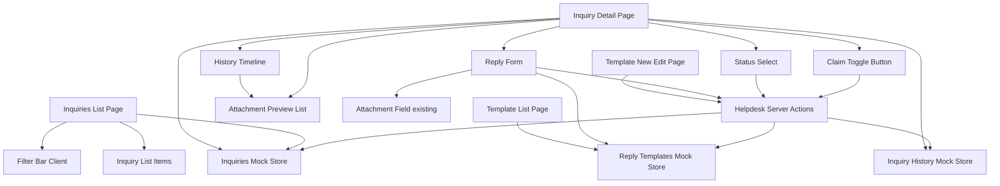
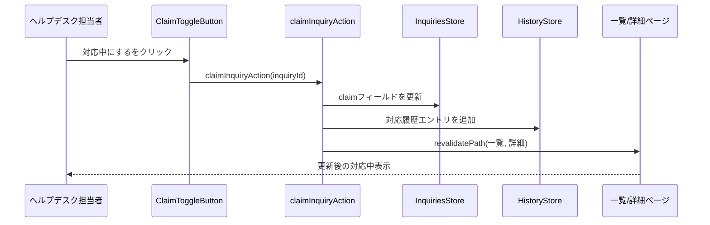
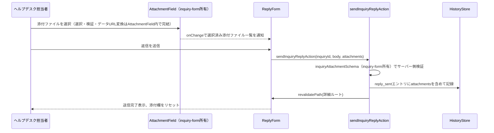

# Technical Design

## Overview
本機能は、`helpdesk-portal-layout`specが確立したヘルプデスク側のルーティング・レイアウト・全社データ取得API（`getAllInquiries`）の上に、ヘルプデスク担当者が実際に問い合わせへ対応するための画面群を実装する。**Purpose**: 緊急度優先の一覧・横断検索、二重対応を防ぐ対応中フラグ、対応履歴の可視化、カテゴリ別テンプレート返信、テンプレート管理という一連の機能により、ヘルプデスクの対応業務を1つのポータルで完結させる。**Users**: 日本側ヘルプデスク担当者（全員が全社分の問い合わせを閲覧する運用、個別アサインなし）。**Impact**: `Inquiry`型に対応中フラグ用の`claim`フィールドを追加（後方互換な追加）し、新規の対応履歴・テンプレートのモックストアとServer Actionsを導入する。`helpdesk-portal-layout`が確立したルート・レイアウト構造自体は変更しない。

**Impact（追加ラウンド・2026-07-03）**: `inquiry-form`specが確立した添付ファイルの型・上限定数・検証ユーティリティ・`AttachmentField`コンポーネントを読み取り専用で再利用し、(1) 問い合わせ詳細画面で問い合わせ本文の添付ファイルを表示、(2) 返信フォームに添付ファイル欄を追加、(3) 返信の添付ファイルを対応履歴に記録・表示する。返信送信がServer Action経由であるため、`next.config.mjs`のServer Actionボディサイズ上限を引き上げる。

**Impact（追加ラウンド・2026-07-07）**: `Inquiry`型に`inquiry-form`spec側で既に定義済みだが未使用の`translatedText`（日本語訳）フィールドを利用し、ヘルプデスク側詳細画面の問い合わせ本文表示を「日本語訳をメイン、原文を参照として下に表示」する形に変更する。実際の翻訳API連携（フェーズ3）は行わず、フェーズ1のモックデータ（`MOCK_INQUIRIES`）に日本語訳のダミー値を追加するのみとする。`Inquiry`型自体のフィールド追加・変更は発生しない（既存フィールドへの値追加のみ）。

### Goals
- ヘルプデスク担当者が緊急度優先で並んだ全社分の問い合わせを一覧・検索できる
- 対応中フラグにより、担当者間の二重対応を防ぐ
- 対応履歴タイムラインにより、誰が何をしたかを追跡できる
- カテゴリ別テンプレートにより、返信の初動を早め、文言のばらつきを減らす
- 上記変更が一覧・詳細画面をまたいで一貫して反映される（画面遷移しても状態が残る）
- （追加）問い合わせ本文・返信の添付ファイルを確認・ダウンロードでき、返信時にも資料を添付できる
- （追加）ヘルプデスク担当者が問い合わせ本文を日本語訳で確認できる（原文は参照として併記）

### Non-Goals
- 認証・ロールベースアクセス制御、担当者個別アサイン機能
- お知らせの作成・編集・削除（別spec）
- 全体傾向の俯瞰グラフ・週次推移分析
- FAQ化候補マーキング、内部コメント欄
- `helpdesk-portal-layout`が確立したルートセグメント・共通レイアウト構造自体の変更
- 実バックエンド・DB連携（フェーズ3）
- （追加）添付ファイルの型・上限定数・検証ロジック・選択UI自体の実装（`inquiry-form`spec所有）、申請者側詳細画面での添付ファイル表示（`inquiry-list`spec）
- （追加）実際の翻訳API連携・`translatedText`の自動生成ロジック（フェーズ3以降）、申請者側での日本語訳表示、返信本文・対応履歴の翻訳表示

## Boundary Commitments

### This Spec Owns
- `/[locale]/helpdesk/inquiries`・`/[locale]/helpdesk/inquiries/[id]`・`/[locale]/helpdesk/templates`配下の全ページ
- `Inquiry`型への`claim`フィールドの追加（後方互換な拡張）
- 対応履歴（`InquiryHistoryEntry`）・返信テンプレート（`ReplyTemplate`）の型・モックストア・モックAPI
- 対応中フラグ・ステータス変更・返信送信・テンプレート追加編集を行うServer Actions
- `HelpdeskSidebar`（`helpdesk-portal-layout`所有）への「問い合わせ管理」「テンプレート管理」ナビゲーション項目の追加
- （追加）`InquiryHistoryEntry`型への`attachments`フィールドの追加、読み取り専用の添付ファイル表示コンポーネント（`AttachmentPreviewList`）、`next.config.mjs`のServer Actionボディサイズ上限設定
- （追加・2026-07-07）ヘルプデスク側詳細画面での日本語訳（`translatedText`）表示ロジック、フェーズ1モックデータ（`MOCK_INQUIRIES`）への日本語訳ダミー値の追加

### Out of Boundary
- `helpdesk-portal-layout`が所有するルートセグメント構造・`HelpdeskAppShell`・`HelpdeskHeader`自体の変更
- 申請者側の画面・コンポーネント（`dashboard`・`inquiry-list`・`inquiry-form`spec所有）の変更。`claim`フィールドが追加されても、これらのコンポーネントは変更しないため表示されない
- お知らせ管理機能（別spec）
- 認証・ロールベースアクセス制御の実装
- （追加）`InquiryAttachment`型・添付ファイルの上限定数・検証ユーティリティ・`AttachmentField`コンポーネント自体の実装（`inquiry-form`spec所有）、申請者側詳細画面での添付ファイル表示（`inquiry-list`spec）
- （追加・2026-07-07）`Inquiry.translatedText`フィールドの型定義自体（`inquiry-form`spec所有、既存のまま）、実際の翻訳API連携（フェーズ3以降）

### Allowed Dependencies
- 既存の`getInquiries`・`getAllInquiries`（`helpdesk-portal-layout`所有、シグネチャ変更なしで利用）
- 既存の`Inquiry`型（フィールド追加のみ、既存フィールドは変更しない）
- 既存のUIプリミティブ（`Card`, `Badge`, `Button`, `Select`, `Input`, `Textarea`, `Label`, `Skeleton`, `Alert`）
- `HelpdeskSidebar`（項目追加のみ、コンポーネント構造自体は変更しない）
- （追加）`inquiry-form`spec所有の`InquiryAttachment`型、`ATTACHMENT_MAX_FILE_SIZE_BYTES`/`ATTACHMENT_MAX_COUNT`/`ATTACHMENT_ALLOWED_MIME_TYPES`定数、`validateAttachmentFile`/`readFileAsDataUrl`ユーティリティ、`AttachmentField`コンポーネント、`inquiryAttachmentSchema`（zod、返信のサーバー側検証で再利用するためexport済みにする）
- （追加・2026-07-07）`Inquiry.translatedText`フィールド（`inquiry-form`spec所有・既存の型定義、値のみを追加する）

### Revalidation Triggers
- `Inquiry`型のフィールド追加・変更（`dashboard`・`inquiry-list`・`inquiry-form`specが再確認する必要がある）
- Server Actionsの導入パターン自体の変更（将来別specが同様の変更系操作を追加する際の参照実装になる）
- `getInquiries`/`getAllInquiries`のデータ内容変更（`claim`フィールドが混入することを前提にした場合、申請者側コンポーネントが誤って表示していないか要再確認）
- （追加）`inquiry-form`が所有する添付ファイルの型・定数・`AttachmentField`のprops形状を変更した場合、本specの返信フォーム統合・`AttachmentPreviewList`への影響確認が必要
- （追加・2026-07-07）`inquiry-form`が`Inquiry.translatedText`のフィールド形状・意味（例: 空文字列と未設定の区別）を変更した場合、本specの表示分岐ロジックへの影響を再確認する

## Architecture

### Existing Architecture Analysis
`helpdesk-portal-layout`により、`/[locale]/helpdesk`配下は独立したレイアウト（`HelpdeskAppShell`）を持ち、`getAllInquiries()`で全社データを取得できる状態になっている。ただし現時点では`helpdesk/page.tsx`はプレースホルダーのみで、実際の問い合わせ管理機能は存在しない。既存のモック層（`lib/api/inquiries.ts`）は読み取り専用関数のみで、変更を永続化する仕組みを持たない（`research.md`参照）。
（追加）`src/lib/actions/helpdesk.ts`は全関数が`"use server"`のServer Actionであり、Next.jsのデフォルトのServer Actionボディサイズ上限（1MB）が適用される。`inquiry-form`spec所有の添付ファイル上限（1件5MB・最大5件、データURL化で理論上約34MB）をそのまま返信にも適用するため、`next.config.mjs`で上限を明示的に引き上げる（`research.md`のDesign Decisions参照）。一方`inquiry-form`の`createInquiry`は`"use server"`を持たない素の関数でありこの制約を受けない。

### Architecture Pattern & Boundary Map
Server Actionsが可変モックストアを更新し、`revalidatePath`で一覧・詳細ルートを再検証するパターンを採用する（比較検討は`research.md`のArchitecture Pattern Evaluation参照）。



**Architecture Integration**:
- 選択パターン: Server Actions（`"use server"`）がモックストアを直接更新し、`revalidatePath`で関連ルートを再検証する
- ドメイン境界: 問い合わせ本体（`InquiriesStore`、`helpdesk-portal-layout`所有の`getInquiries`/`getAllInquiries`が読む配列と同一）、対応履歴（`HistoryStore`、本spec新設）、返信テンプレート（`TemplatesStore`、本spec新設）の3ストアに分離
- 既存パターンの維持: ページ構成（一覧→詳細、新規作成フォーム）は申請者側の`inquiry-list`/`inquiry-form`specと同じNext.js App Router構成を踏襲。フォームは`react-hook-form`+`zod`を使用する既存規約に従う
- 新規コンポーネントの理由: 対応中フラグ・ステータス変更・返信フォームはいずれもServer Actionを呼び出すクライアント状態境界を持つため、独立コンポーネントとして新設する
- Steering準拠: 表示テキストは全て`next-intl`翻訳キー経由、モックAPIは`lib/api/`に抽象化、フォームは`react-hook-form`+`zod`という既存規約を維持
- （追加）`ReplyForm`は`inquiry-form`所有の`AttachmentField`を`useState`（`react-hook-form`は使っていないため`Controller`は不要）で接続し、選択済み添付ファイルをローカル状態として保持したまま`sendInquiryReplyAction`に渡す
- （追加）`AttachmentPreviewList`（本spec新設）は問い合わせ本文添付（`HelpdeskInquiryDetail`から直接）と返信添付（`HistoryTimeline`内の`reply_sent`エントリ）の両方から呼び出される読み取り専用コンポーネント

### Technology Stack

| Layer | Choice / Version | Role in Feature | Notes |
|-------|------------------|-----------------|-------|
| Frontend | Next.js App Router（既存, 14.2.35） | ページ構成・Server Actions | Server Actionsは本spec で初導入（`research.md`参照） |
| Frontend | next-intl（既存） | 翻訳キー管理 | 新規名前空間（`helpdeskInquiries`, `helpdeskTemplates`）を追加 |
| Forms | react-hook-form + zod（既存） | テンプレート追加・編集フォームのバリデーション | `inquiryForm`と同じ構成パターンを踏襲 |
| UI | shadcn/ui（既存） | `Select`（フィルタ・ステータス変更・テンプレート選択）, `Textarea`（返信欄）, `Badge`（対応中表示） | 新規UIプリミティブの追加は不要 |
| Data / Mock | `lib/api/`配下の可変配列 + Server Actions | 対応中フラグ・ステータス・履歴・テンプレートの状態管理 | フェーズ1限定。開発サーバー再起動でリセットされる |
| 設定（追加） | `next.config.mjs`の`experimental.serverActions.bodySizeLimit` | 添付ファイル付き返信のServer Actionペイロードを許容する | `"40mb"`に設定。`research.md`参照 |

## File Structure Plan

### Directory Structure
```
src/app/[locale]/helpdesk/
├── inquiries/
│   ├── page.tsx                    # 一覧（検索・フィルタ・緊急度ソート）
│   └── [id]/
│       └── page.tsx                # 詳細（対応中フラグ・ステータス変更・返信・履歴）
└── templates/
    ├── page.tsx                    # テンプレート一覧（カテゴリ別）
    ├── new/
    │   └── page.tsx                # テンプレート新規作成
    └── [id]/
        └── edit/
            └── page.tsx             # テンプレート編集

src/components/features/helpdesk-inquiries/
├── HelpdeskInquiryList.tsx          # Server: 取得・緊急度優先ソート・ローディング/エラー/空状態
├── HelpdeskInquiryListClient.tsx    # Client: フィルタ状態を保持し表示件数を絞り込む
├── HelpdeskInquiryFilterBar.tsx     # Client: 会社名・キーワード・国・カテゴリの入力
├── HelpdeskInquiryListItem.tsx      # 表示専用: 対応中バッジを含む一覧行
├── HelpdeskInquiryDetail.tsx        # Server: 取得・各セクションの組み立て（変更: 問い合わせ本文添付の表示を追加、日本語訳/原文の表示切り替えを追加）
├── ClaimToggleButton.tsx            # Client: 対応中フラグのON/OFF
├── StatusSelect.tsx                 # Client: ステータス変更
├── ReplyForm.tsx                    # Client: テンプレート選択+返信入力+送信（変更: 添付ファイル欄を追加）
├── HistoryTimeline.tsx              # 表示専用: 対応履歴の時系列表示（変更: 返信の添付ファイル表示を追加）
└── AttachmentPreviewList.tsx        # 新規: 添付ファイルの読み取り専用プレビュー・ダウンロードリスト

src/components/features/helpdesk-templates/
├── TemplateList.tsx                 # Server: カテゴリ別テンプレート一覧
└── TemplateForm.tsx                 # Client: 新規作成・編集共用フォーム

src/lib/api/
├── inquiries.ts                     # 変更: 対応中フラグ・ステータス変更のミューテーション関数を追加（追加: MOCK_INQUIRIESの`originalLanguage`が`ja`以外の要素に`translatedText`ダミー値を追加）
├── inquiry-history.ts               # 新規: 対応履歴の可変ストア・取得関数
└── reply-templates.ts               # 新規: テンプレートの可変ストア・CRUD関数

src/lib/actions/
└── helpdesk.ts                      # 新規: "use server" Server Actions一式

src/lib/validation/
└── reply-template.ts                # 新規: テンプレートフォームのzodスキーマ

src/lib/constants/
└── helpdesk.ts                      # 新規: MOCK_CURRENT_STAFF_NAME（フェーズ1固定の担当者名）

src/types/
├── inquiry.ts                       # 変更: `claim`フィールドを追加（既存フィールドは変更なし）
├── inquiry-history.ts               # 新規: InquiryHistoryEntry型（変更: `attachments`フィールドを追加）
└── reply-template.ts                # 新規: ReplyTemplate, CreateReplyTemplateInput型

src/components/layout/
└── HelpdeskSidebar.tsx               # 変更: ナビゲーション項目に「問い合わせ管理」「テンプレート管理」を追加

messages/
├── ja.json                          # 変更: helpdeskInquiries, helpdeskTemplates名前空間、helpdeskNavへのキー追加
└── en.json                          # 同上

next.config.mjs                      # 変更（追加）: experimental.serverActions.bodySizeLimit を "40mb" に設定
```

### Modified Files
- `src/types/inquiry.ts` — `claim?: { staffName: string; claimedAt: string } | null`を追加（既存フィールドは変更しない）
- `src/lib/api/inquiries.ts` — `setInquiryClaim`・`updateInquiryStatus`のミューテーション関数を追加（`getInquiries`/`getAllInquiries`のシグネチャは変更しない）
- `src/components/layout/HelpdeskSidebar.tsx` — `HELPDESK_NAV_ITEMS`に2項目追加
- `messages/ja.json` / `messages/en.json` — 新規名前空間・キーの追加
- （追加）`src/types/inquiry-history.ts` — `InquiryHistoryEntry`に`attachments?: InquiryAttachment[]`を追加
- （追加）`src/lib/actions/helpdesk.ts` — `sendInquiryReplyAction`の引数に`attachments: InquiryAttachment[]`を追加し、`inquiry-form`所有の`inquiryAttachmentSchema`（export化）で検証する
- （追加）`src/lib/validation/inquiry.ts`（`inquiry-form`spec所有） — 内部の`inquiryAttachmentSchema`を`export`する（本specから再利用するため。型・上限値そのものは変更しない）
- （追加）`src/components/features/helpdesk-inquiries/ReplyForm.tsx` — `AttachmentField`を組み込み、選択済み添付ファイルをローカル状態として保持する
- （追加）`src/components/features/helpdesk-inquiries/HelpdeskInquiryDetail.tsx` — `inquiry.attachments`を`AttachmentPreviewList`で表示する
- （追加）`src/components/features/helpdesk-inquiries/HistoryTimeline.tsx` — `reply_sent`エントリの`attachments`を`AttachmentPreviewList`で表示する
- （追加）`next.config.mjs` — `experimental.serverActions.bodySizeLimit: "40mb"`を追加
- （追加）`messages/ja.json` / `messages/en.json` — `helpdeskInquiries.reply`名前空間に添付ファイル関連のラベル・エラーメッセージを追加
- （追加・2026-07-07）`src/lib/api/inquiries.ts` — `MOCK_INQUIRIES`のうち`originalLanguage`が`ja`以外の要素（現行データでは`en`/`ko`/`zh`/`vi`各言語の複数件）に`translatedText`（日本語訳のダミーテキスト）を追加する。`originalLanguage`が`ja`の要素・既存フィールドは変更しない
- （追加・2026-07-07）`src/components/features/helpdesk-inquiries/HelpdeskInquiryDetail.tsx` — 問い合わせ本文セクションの表示を変更する。`inquiry.originalLanguage !== "ja" && inquiry.translatedText`が真のとき、`translatedTextLabel`（「日本語訳」）ラベル付きで`translatedText`をメインに表示し、その下に`originalTextLabel`（「原文」）ラベル付きで`originalText`を表示する。それ以外（`ja`原文、または`translatedText`未設定）のときは、ラベルなしで原文のみを表示する既存の挙動を維持する
- （追加・2026-07-07）`messages/ja.json` / `messages/en.json` — `helpdeskInquiries.detail`名前空間に`translatedTextLabel`（「日本語訳」/"Japanese Translation"）・`originalTextLabel`（「原文」/"Original Text"）を追加

> 申請者側のコンポーネント（`dashboard`・`inquiry-list`・`inquiry-form`所有）は一切変更しない。`claim`フィールドが`Inquiry`に追加されても、これらのコンポーネントは個別フィールドを明示的に参照する既存実装のため表示に影響しない（`research.md`参照）。

## System Flows

対応中フラグの切り替えとステータス変更は同じパターン（Client Component → Server Action → モックストア更新 → 履歴記録 → revalidatePath）を共有するため、代表として対応中フラグのフローのみ図示する。



- テンプレート返信送信・ステータス変更・テンプレート追加編集も同一の「Server Action → ストア更新 →（該当する場合）履歴記録 → revalidatePath」の型に従う。テンプレート追加編集のみ対応履歴への記録は行わない（履歴は問い合わせ単位の対応記録であり、テンプレート自体の変更履歴は本specの対象外）。



**Key Decisions（追加ラウンド）**: 添付ファイルの選択・検証・データURL変換は`AttachmentField`内で完結しており、`ReplyForm`は変換済みの`InquiryAttachment[]`をそのまま状態として保持するだけでよい。サーバー側でも`inquiryAttachmentSchema`による形状検証を行い、クライアント側検証のバイパスに備える（`inquiry-form`のクライアント側File API検証と同じく、これはUXのためのフロントエンド検証であり、なりすまされたMIMEタイプそのものへの防御ではない）。

## Requirements Traceability

| Requirement | Summary | Components | Interfaces | Flows |
|-------------|---------|------------|------------|-------|
| 1.1〜1.6 | 一覧表示・緊急度優先ソート・状態表示 | HelpdeskInquiryList | InquiriesMockApi (Service) | — |
| 2.1〜2.5 | 検索・横断フィルタ | HelpdeskInquiryFilterBar, HelpdeskInquiryListClient | — | — |
| 3.1〜3.4 | 問い合わせ詳細画面 | HelpdeskInquiryDetail | InquiriesMockApi (Service) | — |
| 4.1〜4.5 | 対応中フラグ | ClaimToggleButton, HelpdeskActions | Service, State | 対応中フラグの切り替えフロー |
| 5.1〜5.4 | 対応履歴タイムライン | HistoryTimeline, HelpdeskActions | InquiryHistoryMockApi (Service) | 対応中フラグの切り替えフロー |
| 6.1〜6.3 | ステータス変更 | StatusSelect, HelpdeskActions | Service | 対応中フラグの切り替えフローと同型 |
| 7.1〜7.5 | カテゴリ別テンプレート返信 | ReplyForm, HelpdeskActions | ReplyTemplatesMockApi (Service) | 対応中フラグの切り替えフローと同型 |
| 8.1〜8.5 | テンプレート管理画面 | TemplateList, TemplateForm, HelpdeskActions | ReplyTemplatesMockApi (Service) | 対応中フラグの切り替えフローと同型 |
| 9.1〜9.2 | ナビゲーション統合 | HelpdeskSidebar | — | — |
| 10.1〜10.2 | 多言語対応 | 全新規コンポーネント | — | — |
| 11.1 | レスポンシブ対応 | （既存HelpdeskAppShellに依存、新規コンポーネントなし） | — | — |
| 12.1〜12.6 | 添付ファイル対応 | HelpdeskInquiryDetail, ReplyForm, HistoryTimeline, AttachmentPreviewList, HelpdeskActions | AttachmentField（inquiry-form所有）, inquiryAttachmentSchema | 返信の添付ファイル送信フロー |
| 13.1〜13.6 | 問い合わせ本文の日本語訳表示 | HelpdeskInquiryDetail | InquiriesMockApi (Service、`translatedText`を読み取るのみ) | — |

## Components and Interfaces

| Component | Domain/Layer | Intent | Req Coverage | Key Dependencies (P0/P1) | Contracts |
|-----------|--------------|--------|---------------|---------------------------|-----------|
| HelpdeskInquiryList | UI/Server | 全社分の問い合わせを緊急度優先で取得・表示 | 1.1〜1.6 | InquiriesMockApi (P0) | State |
| HelpdeskInquiryListClient | UI/Client | フィルタ条件に応じて表示件数を絞り込む | 2.1〜2.5 | HelpdeskInquiryFilterBar (P0) | State |
| HelpdeskInquiryFilterBar | UI/Client | 会社名・キーワード・国・カテゴリの入力UI | 2.1〜2.4 | なし | State |
| HelpdeskInquiryListItem | UI | 一覧行の表示（対応中バッジ含む） | 1.3, 4.4 | なし | State |
| HelpdeskInquiryDetail | UI/Server | 問い合わせ詳細・関連セクションの組み立て（追加: 問い合わせ本文添付の表示、日本語訳/原文の表示切り替え） | 3.1〜3.4, 12.1, 12.2, 13.1〜13.4 | InquiriesMockApi (P0), InquiryHistoryMockApi (P0), AttachmentPreviewList (P1) | State |
| ClaimToggleButton | UI/Client | 対応中フラグのON/OFF操作 | 4.1〜4.5 | HelpdeskActions (P0) | State |
| StatusSelect | UI/Client | ステータス変更操作 | 6.1〜6.3 | HelpdeskActions (P0) | State |
| ReplyForm | UI/Client | テンプレート選択・返信入力・添付・送信 | 7.1〜7.5, 12.3, 12.4, 12.5 | HelpdeskActions (P0), ReplyTemplatesMockApi (P1), AttachmentField (P0, inquiry-form所有) | State |
| HistoryTimeline | UI | 対応履歴の時系列表示（追加: 返信添付の表示） | 5.1〜5.4, 12.6 | AttachmentPreviewList (P1) | State |
| AttachmentPreviewList（追加） | UI (Shared) | 添付ファイルの読み取り専用プレビュー・ダウンロード表示 | 12.1, 12.2, 12.6 | なし | - |
| TemplateList | UI/Server | カテゴリ別テンプレート一覧の表示 | 8.1 | ReplyTemplatesMockApi (P0) | State |
| TemplateForm | UI/Client | テンプレートの新規作成・編集フォーム | 8.2, 8.3, 8.5 | HelpdeskActions (P0) | State |
| InquiriesMockApi（拡張） | Data/Mock | 対応中フラグ・ステータスのミューテーション | 4.1〜4.3, 6.1〜6.2 | Inquiry型 (P0) | Service |
| InquiryHistoryMockApi | Data/Mock | 対応履歴の取得・追記 | 5.1〜5.3 | なし | Service |
| ReplyTemplatesMockApi | Data/Mock | テンプレートのCRUD | 7.1, 8.1〜8.4 | Inquiry["category"] (P1) | Service |
| HelpdeskActions | Server Actions | 上記モックAPI群を呼び出し、`revalidatePath`で再検証する | 4.1〜4.3, 5.2, 6.1〜6.2, 7.4, 8.2〜8.5 | 上記3つのMockApi (P0) | Service |

### Data / Mock API

#### InquiriesMockApi（拡張）

| Field | Detail |
|-------|--------|
| Intent | 対応中フラグ・ステータスの変更を`Inquiry`データに反映する |
| Requirements | 4.1, 4.2, 4.3, 6.1, 6.2 |

**Responsibilities & Constraints**
- 既存の`getInquiries`・`getAllInquiries`・`getInquiryById`のシグネチャ・返却データの意味を変更しない（`claim`フィールドが追加されるのみ）
- ミューテーションは`MOCK_INQUIRIES`配列の該当要素を直接書き換える（フェーズ1限定、プロセス内のみ有効）

**Dependencies**
- Inbound: `HelpdeskActions`（P0）
- Outbound: なし

**Contracts**: Service [x]

##### Service Interface
```typescript
interface InquiriesMockApiExtension {
  setInquiryClaim(id: string, staffName: string | null): Promise<Inquiry>;
  updateInquiryStatus(id: string, status: Inquiry["status"]): Promise<Inquiry>;
}
```
- Preconditions: `id`は存在する問い合わせのIDであること
- Postconditions: 対象`Inquiry`の`claim`または`status`が更新された状態で解決する
- Invariants: `claim`が非nullのとき`claim.staffName`は空文字列でない

**Implementation Notes**
- Integration: `HelpdeskActions`からのみ呼び出される想定（UIコンポーネントから直接importしない）
- Validation: 存在しないIDを渡した場合はエラーをthrowする
- Risks: プロセス再起動でリセットされる（`research.md`のRisks参照）

#### InquiryHistoryMockApi

| Field | Detail |
|-------|--------|
| Intent | 問い合わせごとの対応履歴を記録・取得する |
| Requirements | 5.1, 5.2, 5.3, 5.4 |

**Responsibilities & Constraints**
- 履歴エントリは追記のみ（更新・削除は行わない）
- 各エントリは発生時刻の降順で取得する

**Dependencies**
- Inbound: `HelpdeskActions`（P0）, `HelpdeskInquiryDetail`（P0, 表示のための取得）
- Outbound: なし

**Contracts**: Service [x]

##### Service Interface
```typescript
interface InquiryHistoryMockApi {
  getInquiryHistory(inquiryId: string): Promise<InquiryHistoryEntry[]>;
  appendInquiryHistoryEntry(
    entry: Omit<InquiryHistoryEntry, "id">
  ): Promise<InquiryHistoryEntry>;
}
```
- Preconditions: `inquiryId`は存在する問い合わせのIDであること
- Postconditions: `getInquiryHistory`は追記されたエントリを含む一覧を発生時刻降順で返す
- Invariants: エントリは不変（追記後に内容が変わらない）

**Implementation Notes**
- Integration: `appendInquiryHistoryEntry`は`HelpdeskActions`内の各操作（claim/status/reply）から呼び出される
- Validation: 履歴が0件のとき`HistoryTimeline`は空状態メッセージを表示する（要件5.4）
- Risks: なし

#### ReplyTemplatesMockApi

| Field | Detail |
|-------|--------|
| Intent | カテゴリ別テンプレートのCRUDを提供する |
| Requirements | 7.1, 8.1, 8.2, 8.3, 8.4, 8.5 |

**Responsibilities & Constraints**
- テンプレートはカテゴリ（`Inquiry["category"]`）ごとに0件以上存在しうる
- カテゴリまたは本文が空のテンプレートは作成できない（要件8.5、`lib/validation/reply-template.ts`のzodスキーマで検証）

**Dependencies**
- Inbound: `HelpdeskActions`（P0）, `ReplyForm`（P1, カテゴリ別取得）, `TemplateList`（P0）
- Outbound: なし

**Contracts**: Service [x]

##### Service Interface
```typescript
interface ReplyTemplatesMockApi {
  getReplyTemplates(): Promise<ReplyTemplate[]>;
  getReplyTemplatesByCategory(
    category: Inquiry["category"]
  ): Promise<ReplyTemplate[]>;
  getReplyTemplateById(id: string): Promise<ReplyTemplate | null>;
  createReplyTemplate(input: CreateReplyTemplateInput): Promise<ReplyTemplate>;
  updateReplyTemplate(
    id: string,
    input: CreateReplyTemplateInput
  ): Promise<ReplyTemplate>;
}
```
- Preconditions: `createReplyTemplate`/`updateReplyTemplate`の`input`はバリデーション済み（カテゴリ・本文が非空）であること
- Postconditions: 作成・更新されたテンプレートが以降の`getReplyTemplatesByCategory`の結果に反映される
- Invariants: `id`は一意

**Implementation Notes**
- Integration: `TemplateForm`は`react-hook-form`+`zod`（`lib/validation/reply-template.ts`）でクライアント側バリデーション後、`HelpdeskActions`のServer Actionを呼び出す
- Validation: サーバー側でも空文字列を拒否し、クライアント側バリデーションのバイパスに備える
- Risks: なし

### Server Actions

#### HelpdeskActions

| Field | Detail |
|-------|--------|
| Intent | クライアントからの変更系操作を受け、モックAPIのミューテーションと履歴記録、関連ルートの再検証を行う |
| Requirements | 4.1〜4.3, 5.2, 6.1〜6.2, 7.4, 8.2〜8.5 |

**Responsibilities & Constraints**
- 全ての関数に`"use server"`ディレクティブを付与する
- 各操作の最後に影響範囲のルート（一覧・詳細・テンプレート一覧）を`revalidatePath`で再検証する
- テンプレートのバリデーションはクライアント（`zod`）とサーバー（同一スキーマの再利用）の両方で行う

**Dependencies**
- Inbound: `ClaimToggleButton`, `StatusSelect`, `ReplyForm`, `TemplateForm`（いずれもP0）
- Outbound: `InquiriesMockApiExtension`, `InquiryHistoryMockApi`, `ReplyTemplatesMockApi`（いずれもP0）

**Contracts**: Service [x]

##### Service Interface
```typescript
interface HelpdeskActions {
  claimInquiryAction(inquiryId: string): Promise<void>;
  releaseInquiryClaimAction(inquiryId: string): Promise<void>;
  changeInquiryStatusAction(
    inquiryId: string,
    status: Inquiry["status"]
  ): Promise<void>;
  sendInquiryReplyAction(
    inquiryId: string,
    replyBody: string,
    attachments: InquiryAttachment[]
  ): Promise<void>;
  createReplyTemplateAction(
    input: CreateReplyTemplateInput
  ): Promise<ReplyTemplate>;
  updateReplyTemplateAction(
    id: string,
    input: CreateReplyTemplateInput
  ): Promise<ReplyTemplate>;
}
```
- Preconditions: `inquiryId`/`id`は存在するレコードを指すこと。フォーム系入力はクライアント側でバリデーション済みであること
- Postconditions: 対応する履歴エントリが記録され（claim/release/status/reply）、関連ルートが再検証される
- Invariants: `createReplyTemplateAction`/`updateReplyTemplateAction`は対応履歴に記録しない（テンプレート変更履歴は対象外）

**Implementation Notes**
- Integration: 対応中フラグ・ステータス変更・返信送信の操作者名はフェーズ1固定の`MOCK_CURRENT_STAFF_NAME`（`lib/constants/helpdesk.ts`）を使用する
- Validation: 存在しないIDに対する操作はエラーをthrowし、呼び出し元でエラー表示にフォールバックする
- Risks: `revalidatePath`のパス指定漏れがあると一覧・詳細間で表示が同期しない（`research.md`のRisks参照）
- （追加）Integration: `sendInquiryReplyAction`の`attachments`引数は`inquiry-form`所有の`inquiryAttachmentSchema`（export化）で検証してから`appendInquiryHistoryEntry`に渡す
- （追加）Risks: Server Actionのボディサイズ上限（`next.config.mjs`の`bodySizeLimit`）を添付ファイル上限に見合う値へ引き上げていないと、大きめの添付を含む返信が原因不明のエラーで失敗する（`research.md`のDesign Decisions参照）

### Presentation Components（サマリーのみ）

- **HelpdeskInquiryList / HelpdeskInquiryListClient / HelpdeskInquiryFilterBar / HelpdeskInquiryListItem**: `getAllInquiries()`の結果を緊急度→受付日時の順で並び替えた後、クライアント側でフィルタ条件（会社名・キーワード・国・カテゴリのAND条件）により表示件数を絞り込む。既存`InquiryList`/`InquiryListItem`（申請者側）の構造を参考にしつつ、対応中バッジの表示を追加する。
- **HelpdeskInquiryDetail / ClaimToggleButton / StatusSelect / ReplyForm / HistoryTimeline**: 既存`InquiryDetail`（申請者側）と同等の情報表示に加え、ヘルプデスク専用のセクション（対応中フラグ・ステータス変更・返信フォーム・履歴タイムライン）を追加する。（追加）`HelpdeskInquiryDetail`は`inquiry.attachments`を`AttachmentPreviewList`で、`HistoryTimeline`は`reply_sent`エントリの`attachments`を同じく`AttachmentPreviewList`で表示する。（追加・2026-07-07）`HelpdeskInquiryDetail`は問い合わせ本文の表示を、条件に応じて「日本語訳（メイン）+ 原文（参照）」または「原文のみ」に切り替える。
- **TemplateList / TemplateForm**: `InquiryForm`と同じ`react-hook-form`+`zod`パターンを踏襲したシンプルなCRUD画面。

#### AttachmentPreviewList（追加）

| Field | Detail |
|-------|--------|
| Intent | `InquiryAttachment[]`を受け取り、読み取り専用でサムネイル/ファイル名・サイズとダウンロードリンクを表示する。選択・削除機能は持たない |
| Requirements | 12.1, 12.2, 12.6 |

**Responsibilities & Constraints**
- `attachments: InquiryAttachment[]`をpropsで受け取る（`inquiryId`等の文脈には依存しない汎用設計とし、`inquiry-list`spec次ラウンドでの再利用に備える）
- 画像形式（`fileType.startsWith("image/")`）は`dataUrl`をサムネイルとして表示し、それ以外はファイル名・サイズのみを表示する（`AttachmentField`のプレビュー表示ロジックと同等の判定基準）
- 各添付ファイルを`<a href={dataUrl} download={fileName}>`でラップし、クリックでダウンロードできるようにする
- `attachments`が空・未指定のときは何も描画しない（呼び出し側で「添付なし」の表示要否を判断する）

**Dependencies**: なし（`InquiryAttachment`型のみに依存）

**Contracts**: Service [ ] / API [ ] / Event [ ] / Batch [ ] / State [ ]

**Implementation Notes**
- Integration: `HelpdeskInquiryDetail`からは`inquiry.attachments`を、`HistoryTimeline`からは各`reply_sent`エントリの`attachments`を渡して呼び出す
- Validation: 該当なし（読み取り専用の表示）
- Risks: なし

## Data Models

### Domain Model
- `Inquiry`（既存、拡張）: `claim?: { staffName: string; claimedAt: string } | null`を追加。対応中でない場合は`null`または未設定。（追加ラウンド: `attachments?: InquiryAttachment[]`は`inquiry-form`spec所有の既存追加であり、本specは読み取り専用で参照する）（追加・2026-07-07: `translatedText?: string`も`inquiry-form`spec所有の既存追加であり、本specはフェーズ1モックデータへの値追加と読み取り専用の表示のみを行う。型自体は変更しない）
- `InquiryHistoryEntry`（新規）: 1件の対応履歴イベント。`inquiryId`で`Inquiry`と関連付く（1問い合わせ:N履歴）。（追加）`type: "reply_sent"`のエントリは`attachments?: InquiryAttachment[]`を持ちうる
- `ReplyTemplate`（新規）: カテゴリ別の定型文。`Inquiry["category"]`と対応するが独立したエンティティ。

### Logical Data Model
- `Inquiry` 1 --- N `InquiryHistoryEntry`（`inquiryId`で関連付け、外部キー相当）
- `ReplyTemplate`は`category`で`Inquiry`と緩やかに対応するが、参照整合性は持たない（カテゴリコードの値一致のみ）

### Data Contracts & Integration

| 型 | 主なフィールド | 備考 |
|---|---|---|
| `Inquiry`（拡張） | 既存フィールド + `claim?: { staffName: string; claimedAt: string } \| null` | 既存フィールドは変更なし。`attachments`は`inquiry-form`が既に追加済み |
| `InquiryHistoryEntry`（拡張） | `id`, `inquiryId`, `type: "claimed" \| "released" \| "status_changed" \| "reply_sent"`, `actorName`, `occurredAt`, `detail?: string`, `attachments?: InquiryAttachment[]`（追加） | `detail`はステータス変更前後の値や返信本文の要約。`attachments`は`reply_sent`エントリのみ意味を持つ（他の種別では常に未設定） |
| `ReplyTemplate` | `id`, `category: Inquiry["category"]`, `body: string` | |
| `CreateReplyTemplateInput` | `category`, `body` | `ReplyTemplate`から`id`を除いたサブセット |

## Error Handling

### Error Strategy
既存の`inquiry-list`specと同様、各Server Componentは取得失敗時にtry/catchでエラーメッセージを表示する。Server Actionsは存在しないIDに対する操作時にエラーをthrowし、呼び出し元のクライアントコンポーネントがエラー状態を表示する。

### Error Categories and Responses
- **データ取得失敗**（一覧・詳細・テンプレート一覧）: 既存パターンと同様にエラーメッセージを表示
- **存在しない問い合わせ/テンプレートIDへの操作**: Server Actionがエラーをthrowし、クライアント側でエラー表示にフォールバック
- **テンプレート入力値不正**（カテゴリ・本文未入力）: クライアント側`zod`バリデーションで送信をブロックし、フィールド単位のエラーメッセージを表示（要件8.5）
- **添付ファイル選択時のエラー**（追加）: `AttachmentField`（`inquiry-form`所有）が上限超過・形式不許可・読み込み失敗を検出し、ファイル単位のエラーメッセージを表示する（`ReplyForm`側での追加ハンドリングは不要）
- **返信送信失敗**（追加）: 添付ファイルを含む送信が失敗した場合も、既存の`ReplyForm`のエラー表示（`errorMessage`）にフォールバックする。添付ファイル固有の失敗理由（サーバー側検証エラー等）を個別に区別する表示は行わない
- **日本語訳が未設定**（追加・2026-07-07）: `translatedText`が未設定（フェーズ1のモックデータ整備漏れ、または将来の実データ移行時に翻訳が未完了）の場合、エラー表示は行わず、原文のみを表示する既存の挙動にフォールバックする（要件13.4）

### Monitoring
フェーズ1はモックのため、追加のロギング・監視基盤は導入しない。

## Testing Strategy

- **Unit Tests**:
  - 緊急度優先ソートのコンパレータが高→中→低、同一緊急度内は受付日時降順になること
  - フィルタロジック（会社名・キーワード・国・カテゴリのAND条件）が正しく絞り込むこと
  - `setInquiryClaim`/`updateInquiryStatus`が対象の`Inquiry`のみを更新し、他のレコードに影響しないこと
  - `appendInquiryHistoryEntry`が発生時刻降順で取得できる状態を維持すること
  - テンプレートのzodスキーマがカテゴリ・本文の未入力を拒否すること
- **Integration Tests**:
  - `ClaimToggleButton`操作後、一覧・詳細の両方に対応中表示が反映されること
  - ステータス変更後、`status`の変更が対応履歴に記録されること
  - 返信送信後、対応履歴に記録されること
  - テンプレート追加後、`ReplyForm`の選択肢に反映されること
- **E2E/UI Tests**:
  - 日本語・英語両ロケールで一覧・詳細・テンプレート管理画面が表示されること
  - タブレット幅（768px）で新規画面が横スクロールを起こさないこと
- （追加）**Unit Tests**: `sendInquiryReplyAction`が`attachments`をサーバー側で検証し、`InquiryHistoryEntry`に正しく記録すること
- （追加）**Integration Tests**: `ReplyForm`で添付ファイルを選択して送信すると`sendInquiryReplyAction`に渡されること、`AttachmentPreviewList`が画像/非画像それぞれを正しく表示すること
- （追加）**E2E/UI Tests**: 問い合わせ本文の添付ファイルが詳細画面に表示されること、返信に添付したファイルが対応履歴タイムラインに表示・ダウンロードできること、大きめのファイル（数MB）を含む返信がServer Actionのボディサイズ上限に阻まれず送信できること
- （追加・2026-07-07）**Unit/Integration Tests**: `HelpdeskInquiryDetail`が次の3パターンを正しく切り替えること — (1) `originalLanguage`が`ja`以外かつ`translatedText`設定済みのとき日本語訳をメイン・原文を参照として表示、(2) `originalLanguage`が`ja`のとき原文のみ表示（日本語訳セクションなし）、(3) `originalLanguage`が`ja`以外だが`translatedText`未設定のとき原文のみ表示（エラー表示なし）
- （追加・2026-07-07）**E2E/UI Tests**: 外国語原文を持つ問い合わせの詳細画面で日本語訳が原文より上に表示されること、日本語原文の問い合わせでは日本語訳セクションが表示されないこと、日英両ロケールでラベルが正しく切り替わること

## Security Considerations
`claim`・対応履歴・テンプレートはヘルプデスク内部情報であり、申請者側画面に表示されてはならない。申請者側コンポーネント（`InquiryDetail`・`RecentInquiriesWidget`等）は個別フィールドを明示的に参照する既存実装のままとし、`Inquiry`オブジェクトを丸ごとクライアントに渡す変更を行わない。認証・アクセス制御は本specの対象外であり、`helpdesk-portal-layout`が定めた「フェーズ3で追加」という前提を踏襲する。
（追加）返信の添付ファイルはヘルプデスク担当者が入力した内容であり、`inquiry-form`と同様に`inquiryAttachmentSchema`によるサーバー側の形状検証を行うが、これはクライアント検証バイパスに対するUX上のフォールバックであり、なりすまされたMIMEタイプ自体への防御ではない（`inquiry-form`specの既存documented limitationを踏襲）。`AttachmentPreviewList`は`dataUrl`を``とダウンロード用の`<a href>`としてのみ使用し、`dangerouslySetInnerHTML`は使用しない。Server Actionのボディサイズ上限緩和（`bodySizeLimit: "40mb"`）は、フェーズ1のモック環境（単一プロセス、認証なし、外部公開なし）を前提とした判断であり、フェーズ3で実バックエンドへ移行する際はインフラ全体（CDN・ロードバランサ等）の制約を踏まえて再検討する。
