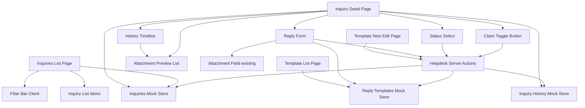
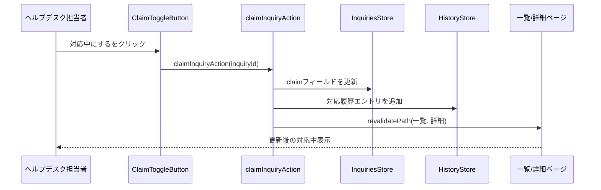
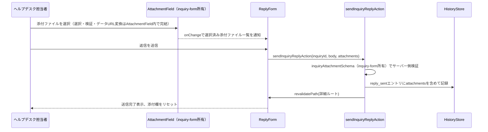

# Technical Design

## Overview
本機能は、`helpdesk-portal-layout`specが確立したヘルプデスク側のルーティング・レイアウト・全社データ取得API（`getAllInquiries`）の上に、ヘルプデスク担当者が実際に問い合わせへ対応するための画面群を実装する。**Purpose**: 緊急度優先の一覧・横断検索、二重対応を防ぐ対応中フラグ、対応履歴の可視化、カテゴリ別テンプレート返信、テンプレート管理という一連の機能により、ヘルプデスクの対応業務を1つのポータルで完結させる。**Users**: 日本側ヘルプデスク担当者（全員が全社分の問い合わせを閲覧する運用、個別アサインなし）。**Impact**: `Inquiry`型に対応中フラグ用の`claim`フィールドを追加（後方互換な追加）し、新規の対応履歴・テンプレートのモックストアとServer Actionsを導入する。`helpdesk-portal-layout`が確立したルート・レイアウト構造自体は変更しない。

**Impact（追加ラウンド・2026-07-03）**: `inquiry-form`specが確立した添付ファイルの型・上限定数・検証ユーティリティ・`AttachmentField`コンポーネントを読み取り専用で再利用し、(1) 問い合わせ詳細画面で問い合わせ本文の添付ファイルを表示、(2) 返信フォームに添付ファイル欄を追加、(3) 返信の添付ファイルを対応履歴に記録・表示する。返信送信がServer Action経由であるため、`next.config.mjs`のServer Actionボディサイズ上限を引き上げる。

**Impact（追加ラウンド・2026-07-07）**: `Inquiry`型に`inquiry-form`spec側で既に定義済みだが未使用の`translatedText`（日本語訳）フィールドを利用し、ヘルプデスク側詳細画面の問い合わせ本文表示を「日本語訳をメイン、原文を参照として下に表示」する形に変更する。実際の翻訳API連携（フェーズ3）は行わず、フェーズ1のモックデータ（`MOCK_INQUIRIES`）に日本語訳のダミー値を追加するのみとする。`Inquiry`型自体のフィールド追加・変更は発生しない（既存フィールドへの値追加のみ）。

**Impact（追加ラウンド・2026-07-07・2）**: 申請元とヘルプデスクが1件の問い合わせの中で何度もメッセージを往復できるようにする機能の一部として、本specが所有する`InquiryHistoryEntryType`に申請者からのメッセージを表す新種別（`requester_message`）を追加し、ヘルプデスク側の対応履歴タイムラインに他の履歴種別と時系列で混在表示する。送信フォーム・Server Action自体は`inquiry-list`spec側が新設し、本spec所有の`appendInquiryHistoryEntry`（既存の公開関数）を呼び出す。本specは型の追加とヘルプデスク側の表示のみを担当し、送信経路には関与しない。

### Goals
- ヘルプデスク担当者が緊急度優先で並んだ全社分の問い合わせを一覧・検索できる
- 対応中フラグにより、担当者間の二重対応を防ぐ
- 対応履歴タイムラインにより、誰が何をしたかを追跡できる
- カテゴリ別テンプレートにより、返信の初動を早め、文言のばらつきを減らす
- 上記変更が一覧・詳細画面をまたいで一貫して反映される（画面遷移しても状態が残る）
- （追加）問い合わせ本文・返信の添付ファイルを確認・ダウンロードでき、返信時にも資料を添付できる
- （追加）ヘルプデスク担当者が問い合わせ本文を日本語訳で確認できる（原文は参照として併記）
- （追加）ヘルプデスク担当者が、申請者から送信された追加メッセージを対応履歴の中で時系列に確認できる

### Non-Goals
- 認証・ロールベースアクセス制御、担当者個別アサイン機能
- お知らせの作成・編集・削除（別spec）
- 全体傾向の俯瞰グラフ・週次推移分析
- FAQ化候補マーキング、内部コメント欄
- `helpdesk-portal-layout`が確立したルートセグメント・共通レイアウト構造自体の変更
- 実バックエンド・DB連携（フェーズ3）
- （追加）添付ファイルの型・上限定数・検証ロジック・選択UI自体の実装（`inquiry-form`spec所有）、申請者側詳細画面での添付ファイル表示（`inquiry-list`spec）
- （追加）実際の翻訳API連携・`translatedText`の自動生成ロジック（フェーズ3以降）、申請者側での日本語訳表示、返信本文・対応履歴の翻訳表示
- （追加）申請者からのメッセージ送信フォーム・Server Action自体の実装（`inquiry-list`spec所有）、新着メッセージの通知・未読管理、メッセージ受信によるステータス・対応中フラグの自動変更

## Boundary Commitments

### This Spec Owns
- `/[locale]/helpdesk/inquiries`・`/[locale]/helpdesk/inquiries/[id]`・`/[locale]/helpdesk/templates`配下の全ページ
- `Inquiry`型への`claim`フィールドの追加（後方互換な拡張）
- 対応履歴（`InquiryHistoryEntry`）・返信テンプレート（`ReplyTemplate`）の型・モックストア・モックAPI
- 対応中フラグ・ステータス変更・返信送信・テンプレート追加編集を行うServer Actions
- `HelpdeskSidebar`（`helpdesk-portal-layout`所有）への「問い合わせ管理」（2026-07-15: 表示文言を「申請管理」に変更、追加要望参照）「テンプレート管理」ナビゲーション項目の追加
- （追加）`InquiryHistoryEntry`型への`attachments`フィールドの追加、読み取り専用の添付ファイル表示コンポーネント（`AttachmentPreviewList`）、`next.config.mjs`のServer Actionボディサイズ上限設定
- （追加・2026-07-07）ヘルプデスク側詳細画面での日本語訳（`translatedText`）表示ロジック、フェーズ1モックデータ（`MOCK_INQUIRIES`）への日本語訳ダミー値の追加
- （追加・2026-07-07・2）`InquiryHistoryEntryType`への`requester_message`種別の追加、ヘルプデスク側対応履歴タイムラインでの申請者メッセージ表示（typeLabel・操作者表示に会社名を用いる表示ロジック）

### Out of Boundary
- `helpdesk-portal-layout`が所有するルートセグメント構造・`HelpdeskAppShell`・`HelpdeskHeader`自体の変更
- 申請者側の画面・コンポーネント（`dashboard`・`inquiry-list`・`inquiry-form`spec所有）の変更。`claim`フィールドが追加されても、これらのコンポーネントは変更しないため表示されない
- お知らせ管理機能（別spec）
- 認証・ロールベースアクセス制御の実装
- （追加）`InquiryAttachment`型・添付ファイルの上限定数・検証ユーティリティ・`AttachmentField`コンポーネント自体の実装（`inquiry-form`spec所有）、申請者側詳細画面での添付ファイル表示（`inquiry-list`spec）
- （追加・2026-07-07）`Inquiry.translatedText`フィールドの型定義自体（`inquiry-form`spec所有、既存のまま）、実際の翻訳API連携（フェーズ3以降）
- （追加・2026-07-07・2）申請者からのメッセージ送信フォーム・Server Action自体の実装（`inquiry-list`spec所有）、申請者側での対応履歴表示（`inquiry-list`spec所有）

### Allowed Dependencies
- 既存の`getInquiries`・`getAllInquiries`（`helpdesk-portal-layout`所有、シグネチャ変更なしで利用）
- 既存の`Inquiry`型（フィールド追加のみ、既存フィールドは変更しない）
- 既存のUIプリミティブ（`Card`, `Badge`, `Button`, `Select`, `Input`, `Textarea`, `Label`, `Skeleton`, `Alert`）
- `HelpdeskSidebar`（項目追加のみ、コンポーネント構造自体は変更しない）
- （追加）`inquiry-form`spec所有の`InquiryAttachment`型、`ATTACHMENT_MAX_FILE_SIZE_BYTES`/`ATTACHMENT_MAX_COUNT`/`ATTACHMENT_ALLOWED_MIME_TYPES`定数、`validateAttachmentFile`/`readFileAsDataUrl`ユーティリティ、`AttachmentField`コンポーネント、`inquiryAttachmentSchema`（zod、返信のサーバー側検証で再利用するためexport済みにする）
- （追加・2026-07-07）`Inquiry.translatedText`フィールド（`inquiry-form`spec所有・既存の型定義、値のみを追加する）
- （追加・2026-07-07・2）本ラウンドで新規の外部依存は発生しない（`inquiry-list`spec側が本specの`appendInquiryHistoryEntry`を利用する側であり、本specから`inquiry-list`への依存は発生しない）

### Revalidation Triggers
- `Inquiry`型のフィールド追加・変更（`dashboard`・`inquiry-list`・`inquiry-form`specが再確認する必要がある）
- Server Actionsの導入パターン自体の変更（将来別specが同様の変更系操作を追加する際の参照実装になる）
- `getInquiries`/`getAllInquiries`のデータ内容変更（`claim`フィールドが混入することを前提にした場合、申請者側コンポーネントが誤って表示していないか要再確認）
- （追加）`inquiry-form`が所有する添付ファイルの型・定数・`AttachmentField`のprops形状を変更した場合、本specの返信フォーム統合・`AttachmentPreviewList`への影響確認が必要
- （追加・2026-07-07）`inquiry-form`が`Inquiry.translatedText`のフィールド形状・意味（例: 空文字列と未設定の区別）を変更した場合、本specの表示分岐ロジックへの影響を再確認する
- （追加・2026-07-07・2）本specが`InquiryHistoryEntryType`に種別を追加・変更する場合、`inquiry-list`spec側の対応履歴表示（`InquiryHistoryList`の網羅的switch文）が追随の必要があることを常に確認する

## Architecture

### Existing Architecture Analysis
`helpdesk-portal-layout`により、`/[locale]/helpdesk`配下は独立したレイアウト（`HelpdeskAppShell`）を持ち、`getAllInquiries()`で全社データを取得できる状態になっている。ただし現時点では`helpdesk/page.tsx`はプレースホルダーのみで、実際の問い合わせ管理機能は存在しない。既存のモック層（`lib/api/inquiries.ts`）は読み取り専用関数のみで、変更を永続化する仕組みを持たない（`research.md`参照）。
（追加）`src/lib/actions/helpdesk.ts`は全関数が`"use server"`のServer Actionであり、Next.jsのデフォルトのServer Actionボディサイズ上限（1MB）が適用される。`inquiry-form`spec所有の添付ファイル上限（1件5MB・最大5件、データURL化で理論上約34MB）をそのまま返信にも適用するため、`next.config.mjs`で上限を明示的に引き上げる（`research.md`のDesign Decisions参照）。一方`inquiry-form`の`createInquiry`は`"use server"`を持たない素の関数でありこの制約を受けない。

### Architecture Pattern & Boundary Map
Server Actionsが可変モックストアを更新し、`revalidatePath`で一覧・詳細ルートを再検証するパターンを採用する（比較検討は`research.md`のArchitecture Pattern Evaluation参照）。



**Architecture Integration**:
- 選択パターン: Server Actions（`"use server"`）がモックストアを直接更新し、`revalidatePath`で関連ルートを再検証する
- ドメイン境界: 問い合わせ本体（`InquiriesStore`、`helpdesk-portal-layout`所有の`getInquiries`/`getAllInquiries`が読む配列と同一）、対応履歴（`HistoryStore`、本spec新設）、返信テンプレート（`TemplatesStore`、本spec新設）の3ストアに分離
- 既存パターンの維持: ページ構成（一覧→詳細、新規作成フォーム）は申請者側の`inquiry-list`/`inquiry-form`specと同じNext.js App Router構成を踏襲。フォームは`react-hook-form`+`zod`を使用する既存規約に従う
- 新規コンポーネントの理由: 対応中フラグ・ステータス変更・返信フォームはいずれもServer Actionを呼び出すクライアント状態境界を持つため、独立コンポーネントとして新設する
- Steering準拠: 表示テキストは全て`next-intl`翻訳キー経由、モックAPIは`lib/api/`に抽象化、フォームは`react-hook-form`+`zod`という既存規約を維持
- （追加）`ReplyForm`は`inquiry-form`所有の`AttachmentField`を`useState`（`react-hook-form`は使っていないため`Controller`は不要）で接続し、選択済み添付ファイルをローカル状態として保持したまま`sendInquiryReplyAction`に渡す
- （追加）`AttachmentPreviewList`（本spec新設）は問い合わせ本文添付（`HelpdeskInquiryDetail`から直接）と返信添付（`HistoryTimeline`内の`reply_sent`エントリ）の両方から呼び出される読み取り専用コンポーネント

### Technology Stack

| Layer | Choice / Version | Role in Feature | Notes |
|-------|------------------|-----------------|-------|
| Frontend | Next.js App Router（既存, 14.2.35） | ページ構成・Server Actions | Server Actionsは本spec で初導入（`research.md`参照） |
| Frontend | next-intl（既存） | 翻訳キー管理 | 新規名前空間（`helpdeskInquiries`, `helpdeskTemplates`）を追加 |
| Forms | react-hook-form + zod（既存） | テンプレート追加・編集フォームのバリデーション | `inquiryForm`と同じ構成パターンを踏襲 |
| UI | shadcn/ui（既存） | `Select`（フィルタ・ステータス変更・テンプレート選択）, `Textarea`（返信欄）, `Badge`（対応中表示） | 新規UIプリミティブの追加は不要 |
| Data / Mock | `lib/api/`配下の可変配列 + Server Actions | 対応中フラグ・ステータス・履歴・テンプレートの状態管理 | フェーズ1限定。開発サーバー再起動でリセットされる |
| 設定（追加） | `next.config.mjs`の`experimental.serverActions.bodySizeLimit` | 添付ファイル付き返信のServer Actionペイロードを許容する | `"40mb"`に設定。`research.md`参照 |

## File Structure Plan

### Directory Structure
```
src/app/[locale]/helpdesk/
├── inquiries/
│   ├── page.tsx                    # 一覧（検索・フィルタ・緊急度ソート）
│   └── [id]/
│       └── page.tsx                # 詳細（対応中フラグ・ステータス変更・返信・履歴）
└── templates/
    ├── page.tsx                    # テンプレート一覧（カテゴリ別）
    ├── new/
    │   └── page.tsx                # テンプレート新規作成
    └── [id]/
        └── edit/
            └── page.tsx             # テンプレート編集

src/components/features/helpdesk-inquiries/
├── HelpdeskInquiryList.tsx          # Server: 取得・緊急度優先ソート・ローディング/エラー/空状態
├── HelpdeskInquiryListClient.tsx    # Client: フィルタ状態を保持し表示件数を絞り込む
├── HelpdeskInquiryFilterBar.tsx     # Client: 会社名・キーワード・国・カテゴリの入力
├── HelpdeskInquiryListItem.tsx      # 表示専用: 対応中バッジを含む一覧行
├── HelpdeskInquiryDetail.tsx        # Server: 取得・各セクションの組み立て（変更: 問い合わせ本文添付の表示を追加、日本語訳/原文の表示切り替えを追加）
├── ClaimToggleButton.tsx            # Client: 対応中フラグのON/OFF
├── StatusSelect.tsx                 # Client: ステータス変更
├── ReplyForm.tsx                    # Client: テンプレート選択+返信入力+送信（変更: 添付ファイル欄を追加）
├── HistoryTimeline.tsx              # 表示専用: 対応履歴の時系列表示（変更: 返信の添付ファイル表示を追加）
└── AttachmentPreviewList.tsx        # 新規: 添付ファイルの読み取り専用プレビュー・ダウンロードリスト

src/components/features/helpdesk-templates/
├── TemplateList.tsx                 # Server: カテゴリ別テンプレート一覧
└── TemplateForm.tsx                 # Client: 新規作成・編集共用フォーム

src/lib/api/
├── inquiries.ts                     # 変更: 対応中フラグ・ステータス変更のミューテーション関数を追加（追加: MOCK_INQUIRIESの`originalLanguage`が`ja`以外の要素に`translatedText`ダミー値を追加）
├── inquiry-history.ts               # 新規: 対応履歴の可変ストア・取得関数
└── reply-templates.ts               # 新規: テンプレートの可変ストア・CRUD関数

src/lib/actions/
└── helpdesk.ts                      # 新規: "use server" Server Actions一式

src/lib/validation/
└── reply-template.ts                # 新規: テンプレートフォームのzodスキーマ

src/lib/constants/
└── helpdesk.ts                      # 新規: MOCK_CURRENT_STAFF_NAME（フェーズ1固定の担当者名）

src/types/
├── inquiry.ts                       # 変更: `claim`フィールドを追加（既存フィールドは変更なし）
├── inquiry-history.ts               # 新規: InquiryHistoryEntry型（変更: `attachments`フィールドを追加）
└── reply-template.ts                # 新規: ReplyTemplate, CreateReplyTemplateInput型

src/components/layout/
└── HelpdeskSidebar.tsx               # 変更: ナビゲーション項目に「問い合わせ管理」（2026-07-15: 表示文言を「申請管理」に変更）「テンプレート管理」を追加

messages/
├── ja.json                          # 変更: helpdeskInquiries, helpdeskTemplates名前空間、helpdeskNavへのキー追加
└── en.json                          # 同上

next.config.mjs                      # 変更（追加）: experimental.serverActions.bodySizeLimit を "40mb" に設定
```

### Modified Files
- `src/types/inquiry.ts` — `claim?: { staffName: string; claimedAt: string } | null`を追加（既存フィールドは変更しない）
- `src/lib/api/inquiries.ts` — `setInquiryClaim`・`updateInquiryStatus`のミューテーション関数を追加（`getInquiries`/`getAllInquiries`のシグネチャは変更しない）
- `src/components/layout/HelpdeskSidebar.tsx` — `HELPDESK_NAV_ITEMS`に2項目追加
- `messages/ja.json` / `messages/en.json` — 新規名前空間・キーの追加
- （追加）`src/types/inquiry-history.ts` — `InquiryHistoryEntry`に`attachments?: InquiryAttachment[]`を追加
- （追加）`src/lib/actions/helpdesk.ts` — `sendInquiryReplyAction`の引数に`attachments: InquiryAttachment[]`を追加し、`inquiry-form`所有の`inquiryAttachmentSchema`（export化）で検証する
- （追加）`src/lib/validation/inquiry.ts`（`inquiry-form`spec所有） — 内部の`inquiryAttachmentSchema`を`export`する（本specから再利用するため。型・上限値そのものは変更しない）
- （追加）`src/components/features/helpdesk-inquiries/ReplyForm.tsx` — `AttachmentField`を組み込み、選択済み添付ファイルをローカル状態として保持する
- （追加）`src/components/features/helpdesk-inquiries/HelpdeskInquiryDetail.tsx` — `inquiry.attachments`を`AttachmentPreviewList`で表示する
- （追加）`src/components/features/helpdesk-inquiries/HistoryTimeline.tsx` — `reply_sent`エントリの`attachments`を`AttachmentPreviewList`で表示する
- （追加）`next.config.mjs` — `experimental.serverActions.bodySizeLimit: "40mb"`を追加
- （追加）`messages/ja.json` / `messages/en.json` — `helpdeskInquiries.reply`名前空間に添付ファイル関連のラベル・エラーメッセージを追加
- （追加・2026-07-07）`src/lib/api/inquiries.ts` — `MOCK_INQUIRIES`のうち`originalLanguage`が`ja`以外の要素（現行データでは`en`/`ko`/`zh`/`vi`各言語の複数件）に`translatedText`（日本語訳のダミーテキスト）を追加する。`originalLanguage`が`ja`の要素・既存フィールドは変更しない
- （追加・2026-07-07）`src/components/features/helpdesk-inquiries/HelpdeskInquiryDetail.tsx` — 問い合わせ本文セクションの表示を変更する。`inquiry.originalLanguage !== "ja" && inquiry.translatedText`が真のとき、`translatedTextLabel`（「日本語訳」）ラベル付きで`translatedText`をメインに表示し、その下に`originalTextLabel`（「原文」）ラベル付きで`originalText`を表示する。それ以外（`ja`原文、または`translatedText`未設定）のときは、ラベルなしで原文のみを表示する既存の挙動を維持する
- （追加・2026-07-07）`messages/ja.json` / `messages/en.json` — `helpdeskInquiries.detail`名前空間に`translatedTextLabel`（「日本語訳」/"Japanese Translation"）・`originalTextLabel`（「原文」/"Original Text"）を追加
- （追加・2026-07-07・2）`src/types/inquiry-history.ts` — `InquiryHistoryEntryType`に`"requester_message"`を追加する（既存の4種別は変更しない）
- （追加・2026-07-07・2）`src/components/features/helpdesk-inquiries/HelpdeskInquiryDetail.tsx` — `HistoryTimeline`へ渡す`typeLabels`に`requester_message: tHistory("types.requester_message")`を追加する（`HistoryTimeline`自体は`typeLabels`ルックアップ方式のため変更不要）
- （追加・2026-07-07・2）`messages/ja.json` / `messages/en.json` — `helpdeskInquiries.history.types`に`requester_message`（「申請者からのメッセージ」/"Message from requester"）を追加する
- （追加・2026-07-13）`src/lib/server/company-service.ts`（新規、または既存のCompany関連サービスファイルに配置） — `listCompaniesForHelpdesk(): Promise<{ id: string; name: string; country: string }[]>`を追加する（`Company`テーブルの全件を`name`昇順で返す）
- （追加・2026-07-13）`src/app/[locale]/helpdesk/(dashboard)/inquiry/new/page.tsx` — 非同期Server Componentに変更し、`listCompaniesForHelpdesk()`の結果を`InquiryForm`の`companies`propへ、`mode="helpdeskProxy"`を`mode`propへ渡す
- （追加・2026-07-13）`src/components/features/helpdesk-templates/TemplateForm.tsx` — `AnnouncementForm`と同様の`hasSubmitError`状態・`try/catch`・`submitErrorMessage`propを追加する
- （追加・2026-07-13）`src/app/[locale]/helpdesk/(dashboard)/templates/new/page.tsx` / `.../templates/[id]/edit/page.tsx` — `TemplateForm`へ`submitErrorMessage`propを配線する
- （追加・2026-07-13）`messages/ja.json` / `messages/en.json` — `helpdeskTemplates`名前空間に送信エラーメッセージのキーを追加する（`helpdeskAnnouncements`の`submitErrorMessage`と同等の文言パターンを踏襲）

> 申請者側のコンポーネント（`dashboard`・`inquiry-list`・`inquiry-form`所有）は一切変更しない。`claim`フィールドが`Inquiry`に追加されても、これらのコンポーネントは個別フィールドを明示的に参照する既存実装のため表示に影響しない（`research.md`参照）。`InquiryForm`本体・`createInquiry`のセッション分岐ロジックは`inquiry-form`spec 要件12が所有し、本specは`/helpdesk/inquiry/new`ページからの呼び出し（`mode`/`companies`propの配線）と、そのための会社一覧取得関数のみを所有する。

## System Flows

対応中フラグの切り替えとステータス変更は同じパターン（Client Component → Server Action → モックストア更新 → 履歴記録 → revalidatePath）を共有するため、代表として対応中フラグのフローのみ図示する。



- テンプレート返信送信・ステータス変更・テンプレート追加編集も同一の「Server Action → ストア更新 →（該当する場合）履歴記録 → revalidatePath」の型に従う。テンプレート追加編集のみ対応履歴への記録は行わない（履歴は問い合わせ単位の対応記録であり、テンプレート自体の変更履歴は本specの対象外）。



**Key Decisions（追加ラウンド）**: 添付ファイルの選択・検証・データURL変換は`AttachmentField`内で完結しており、`ReplyForm`は変換済みの`InquiryAttachment[]`をそのまま状態として保持するだけでよい。サーバー側でも`inquiryAttachmentSchema`による形状検証を行い、クライアント側検証のバイパスに備える（`inquiry-form`のクライアント側File API検証と同じく、これはUXのためのフロントエンド検証であり、なりすまされたMIMEタイプそのものへの防御ではない）。

## Requirements Traceability

| Requirement | Summary | Components | Interfaces | Flows |
|-------------|---------|------------|------------|-------|
| 1.1〜1.6 | 一覧表示・緊急度優先ソート・状態表示 | HelpdeskInquiryList | InquiriesMockApi (Service) | — |
| 2.1〜2.5 | 検索・横断フィルタ | HelpdeskInquiryFilterBar, HelpdeskInquiryListClient | — | — |
| 3.1〜3.4 | 問い合わせ詳細画面 | HelpdeskInquiryDetail | InquiriesMockApi (Service) | — |
| 4.1〜4.5 | 対応中フラグ | ClaimToggleButton, HelpdeskActions | Service, State | 対応中フラグの切り替えフロー |
| 5.1〜5.4 | 対応履歴タイムライン | HistoryTimeline, HelpdeskActions | InquiryHistoryMockApi (Service) | 対応中フラグの切り替えフロー |
| 6.1〜6.3 | ステータス変更 | StatusSelect, HelpdeskActions | Service | 対応中フラグの切り替えフローと同型 |
| 7.1〜7.5 | カテゴリ別テンプレート返信 | ReplyForm, HelpdeskActions | ReplyTemplatesMockApi (Service) | 対応中フラグの切り替えフローと同型 |
| 8.1〜8.5 | テンプレート管理画面 | TemplateList, TemplateForm, HelpdeskActions | ReplyTemplatesMockApi (Service) | 対応中フラグの切り替えフローと同型 |
| 9.1〜9.2 | ナビゲーション統合 | HelpdeskSidebar | — | — |
| 10.1〜10.2 | 多言語対応 | 全新規コンポーネント | — | — |
| 11.1 | レスポンシブ対応 | （既存HelpdeskAppShellに依存、新規コンポーネントなし） | — | — |
| 12.1〜12.6 | 添付ファイル対応 | HelpdeskInquiryDetail, ReplyForm, HistoryTimeline, AttachmentPreviewList, HelpdeskActions | AttachmentField（inquiry-form所有）, inquiryAttachmentSchema | 返信の添付ファイル送信フロー |
| 13.1〜13.6 | 問い合わせ本文の日本語訳表示 | HelpdeskInquiryDetail | InquiriesMockApi (Service、`translatedText`を読み取るのみ) | — |
| 14.1〜14.5 | 対応履歴への申請者メッセージの統合表示 | HelpdeskInquiryDetail, HistoryTimeline | InquiryHistoryMockApi (Service、`requester_message`種別を読み取るのみ) | — |
| 7.6 | テンプレート選択肢に名前をラベル表示 | ReplyForm | ReplyTemplatesMockApi (Service) | 対応中フラグの切り替えフローと同型 |
| 8.6 | `ReplyTemplate`型への`name`フィールド追加 | TemplateList, TemplateForm | ReplyTemplatesMockApi (Service) | — |
| 8.7〜8.8 | テンプレートフォームの送信エラーフィードバック（追加） | TemplateForm | ReplyTemplatesMockApi (Service) | — |
| 15.1〜15.6 | ヘルプデスク代理問い合わせ登録画面（追加） | HelpdeskInquiryNewPage, InquiryForm（`inquiry-form`spec所有） | ListCompaniesForHelpdesk (Service), CreateInquiry Service Interface（`inquiry-form`spec 要件12） | 代理登録フロー（`inquiry-form`spec design.md参照） |

## Components and Interfaces

| Component | Domain/Layer | Intent | Req Coverage | Key Dependencies (P0/P1) | Contracts |
|-----------|--------------|--------|---------------|---------------------------|-----------|
| HelpdeskInquiryList | UI/Server | 全社分の問い合わせを緊急度優先で取得・表示 | 1.1〜1.6 | InquiriesMockApi (P0) | State |
| HelpdeskInquiryListClient | UI/Client | フィルタ条件に応じて表示件数を絞り込む | 2.1〜2.5 | HelpdeskInquiryFilterBar (P0) | State |
| HelpdeskInquiryFilterBar | UI/Client | 会社名・キーワード・国・カテゴリの入力UI | 2.1〜2.4 | なし | State |
| HelpdeskInquiryListItem | UI | 一覧行の表示（対応中バッジ含む） | 1.3, 4.4 | なし | State |
| HelpdeskInquiryDetail | UI/Server | 問い合わせ詳細・関連セクションの組み立て（追加: 問い合わせ本文添付の表示、日本語訳/原文の表示切り替え、申請者メッセージ用typeLabelの追加） | 3.1〜3.4, 12.1, 12.2, 13.1〜13.4, 14.2, 14.3 | InquiriesMockApi (P0), InquiryHistoryMockApi (P0), AttachmentPreviewList (P1) | State |
| ClaimToggleButton | UI/Client | 対応中フラグのON/OFF操作 | 4.1〜4.5 | HelpdeskActions (P0) | State |
| StatusSelect | UI/Client | ステータス変更操作 | 6.1〜6.3 | HelpdeskActions (P0) | State |
| ReplyForm | UI/Client | テンプレート選択（選択肢は`name`をラベル表示）・返信入力・添付・送信 | 7.1〜7.6, 12.3, 12.4, 12.5 | HelpdeskActions (P0), ReplyTemplatesMockApi (P1), AttachmentField (P0, inquiry-form所有) | State |
| HistoryTimeline | UI | 対応履歴の時系列表示（追加: 返信添付の表示。追加: 申請者メッセージも既存のtypeLabelルックアップ方式でそのまま表示、コード変更不要） | 5.1〜5.4, 12.6, 14.2, 14.3, 14.4 | AttachmentPreviewList (P1) | State |
| AttachmentPreviewList（追加） | UI (Shared) | 添付ファイルの読み取り専用プレビュー・ダウンロード表示 | 12.1, 12.2, 12.6 | なし | - |
| TemplateList | UI/Server | カテゴリ別テンプレート一覧の表示（各テンプレートを`name`で識別、`body`はプレビュー表示） | 8.1, 8.6 | ReplyTemplatesMockApi (P0) | State |
| TemplateForm | UI/Client | テンプレートの新規作成・編集フォーム（`name`/`category`/`body`の3項目） | 8.2, 8.3, 8.5, 8.6 | HelpdeskActions (P0) | State |
| InquiriesMockApi（拡張） | Data/Mock | 対応中フラグ・ステータスのミューテーション | 4.1〜4.3, 6.1〜6.2 | Inquiry型 (P0) | Service |
| InquiryHistoryMockApi | Data/Mock | 対応履歴の取得・追記 | 5.1〜5.3 | なし | Service |
| ReplyTemplatesMockApi | Data/Mock | テンプレートのCRUD | 7.1, 8.1〜8.4 | Inquiry["category"] (P1) | Service |
| HelpdeskActions | Server Actions | 上記モックAPI群を呼び出し、`revalidatePath`で再検証する | 4.1〜4.3, 5.2, 6.1〜6.2, 7.4, 8.2〜8.5 | 上記3つのMockApi (P0) | Service |

### Data / Mock API

#### InquiriesMockApi（拡張）

| Field | Detail |
|-------|--------|
| Intent | 対応中フラグ・ステータスの変更を`Inquiry`データに反映する |
| Requirements | 4.1, 4.2, 4.3, 6.1, 6.2 |

**Responsibilities & Constraints**
- 既存の`getInquiries`・`getAllInquiries`・`getInquiryById`のシグネチャ・返却データの意味を変更しない（`claim`フィールドが追加されるのみ）
- ミューテーションは`MOCK_INQUIRIES`配列の該当要素を直接書き換える（フェーズ1限定、プロセス内のみ有効）

**Dependencies**
- Inbound: `HelpdeskActions`（P0）
- Outbound: なし

**Contracts**: Service [x]

##### Service Interface
```typescript
interface InquiriesMockApiExtension {
  setInquiryClaim(id: string, staffName: string | null): Promise<Inquiry>;
  updateInquiryStatus(id: string, status: Inquiry["status"]): Promise<Inquiry>;
}
```
- Preconditions: `id`は存在する問い合わせのIDであること
- Postconditions: 対象`Inquiry`の`claim`または`status`が更新された状態で解決する
- Invariants: `claim`が非nullのとき`claim.staffName`は空文字列でない

**Implementation Notes**
- Integration: `HelpdeskActions`からのみ呼び出される想定（UIコンポーネントから直接importしない）
- Validation: 存在しないIDを渡した場合はエラーをthrowする
- Risks: プロセス再起動でリセットされる（`research.md`のRisks参照）

#### InquiryHistoryMockApi

| Field | Detail |
|-------|--------|
| Intent | 問い合わせごとの対応履歴を記録・取得する |
| Requirements | 5.1, 5.2, 5.3, 5.4 |

**Responsibilities & Constraints**
- 履歴エントリは追記のみ（更新・削除は行わない）
- 各エントリは発生時刻の降順で取得する

**Dependencies**
- Inbound: `HelpdeskActions`（P0）, `HelpdeskInquiryDetail`（P0, 表示のための取得）
- Outbound: なし

**Contracts**: Service [x]

##### Service Interface
```typescript
interface InquiryHistoryMockApi {
  getInquiryHistory(inquiryId: string): Promise<InquiryHistoryEntry[]>;
  appendInquiryHistoryEntry(
    entry: Omit<InquiryHistoryEntry, "id">
  ): Promise<InquiryHistoryEntry>;
}
```
- Preconditions: `inquiryId`は存在する問い合わせのIDであること
- Postconditions: `getInquiryHistory`は追記されたエントリを含む一覧を発生時刻降順で返す
- Invariants: エントリは不変（追記後に内容が変わらない）

**Implementation Notes**
- Integration: `appendInquiryHistoryEntry`は`HelpdeskActions`内の各操作（claim/status/reply）から呼び出される
- Validation: 履歴が0件のとき`HistoryTimeline`は空状態メッセージを表示する（要件5.4）
- Risks: なし

#### ReplyTemplatesMockApi

| Field | Detail |
|-------|--------|
| Intent | カテゴリ別テンプレートのCRUDを提供する |
| Requirements | 7.1, 7.6, 8.1, 8.2, 8.3, 8.4, 8.5, 8.6 |

**Responsibilities & Constraints**
- テンプレートはカテゴリ（`Inquiry["category"]`）ごとに0件以上存在しうる（複数件を想定）
- カテゴリ・テンプレート名（`name`）・本文が空のテンプレートは作成できない（要件8.5、`lib/validation/reply-template.ts`のzodスキーマで検証）。`name`は`TEMPLATE_NAME_MAX_LENGTH`（40文字）以内であること

**Dependencies**
- Inbound: `HelpdeskActions`（P0）, `ReplyForm`（P1, カテゴリ別取得）, `TemplateList`（P0）
- Outbound: なし

**Contracts**: Service [x]

##### Service Interface
```typescript
interface ReplyTemplatesMockApi {
  getReplyTemplates(): Promise<ReplyTemplate[]>;
  getReplyTemplatesByCategory(
    category: Inquiry["category"]
  ): Promise<ReplyTemplate[]>;
  getReplyTemplateById(id: string): Promise<ReplyTemplate | null>;
  createReplyTemplate(input: CreateReplyTemplateInput): Promise<ReplyTemplate>;
  updateReplyTemplate(
    id: string,
    input: CreateReplyTemplateInput
  ): Promise<ReplyTemplate>;
}
```
- Preconditions: `createReplyTemplate`/`updateReplyTemplate`の`input`はバリデーション済み（カテゴリ・本文が非空）であること
- Postconditions: 作成・更新されたテンプレートが以降の`getReplyTemplatesByCategory`の結果に反映される
- Invariants: `id`は一意

**Implementation Notes**
- Integration: `TemplateForm`は`react-hook-form`+`zod`（`lib/validation/reply-template.ts`）でクライアント側バリデーション後、`HelpdeskActions`のServer Actionを呼び出す
- Validation: サーバー側でも空文字列を拒否し、クライアント側バリデーションのバイパスに備える
- Risks: なし

### Server Actions

#### HelpdeskActions

| Field | Detail |
|-------|--------|
| Intent | クライアントからの変更系操作を受け、モックAPIのミューテーションと履歴記録、関連ルートの再検証を行う |
| Requirements | 4.1〜4.3, 5.2, 6.1〜6.2, 7.4, 8.2〜8.5 |

**Responsibilities & Constraints**
- 全ての関数に`"use server"`ディレクティブを付与する
- 各操作の最後に影響範囲のルート（一覧・詳細・テンプレート一覧）を`revalidatePath`で再検証する
- テンプレートのバリデーションはクライアント（`zod`）とサーバー（同一スキーマの再利用）の両方で行う

**Dependencies**
- Inbound: `ClaimToggleButton`, `StatusSelect`, `ReplyForm`, `TemplateForm`（いずれもP0）
- Outbound: `InquiriesMockApiExtension`, `InquiryHistoryMockApi`, `ReplyTemplatesMockApi`（いずれもP0）

**Contracts**: Service [x]

##### Service Interface
```typescript
interface HelpdeskActions {
  claimInquiryAction(inquiryId: string): Promise<void>;
  releaseInquiryClaimAction(inquiryId: string): Promise<void>;
  changeInquiryStatusAction(
    inquiryId: string,
    status: Inquiry["status"]
  ): Promise<void>;
  sendInquiryReplyAction(
    inquiryId: string,
    replyBody: string,
    attachments: InquiryAttachment[]
  ): Promise<void>;
  createReplyTemplateAction(
    input: CreateReplyTemplateInput
  ): Promise<ReplyTemplate>;
  updateReplyTemplateAction(
    id: string,
    input: CreateReplyTemplateInput
  ): Promise<ReplyTemplate>;
}
```
- Preconditions: `inquiryId`/`id`は存在するレコードを指すこと。フォーム系入力はクライアント側でバリデーション済みであること
- Postconditions: 対応する履歴エントリが記録され（claim/release/status/reply）、関連ルートが再検証される
- Invariants: `createReplyTemplateAction`/`updateReplyTemplateAction`は対応履歴に記録しない（テンプレート変更履歴は対象外）

**Implementation Notes**
- Integration: 対応中フラグ・ステータス変更・返信送信の操作者名はフェーズ1固定の`MOCK_CURRENT_STAFF_NAME`（`lib/constants/helpdesk.ts`）を使用する
- Validation: 存在しないIDに対する操作はエラーをthrowし、呼び出し元でエラー表示にフォールバックする
- Risks: `revalidatePath`のパス指定漏れがあると一覧・詳細間で表示が同期しない（`research.md`のRisks参照）
- （追加）Integration: `sendInquiryReplyAction`の`attachments`引数は`inquiry-form`所有の`inquiryAttachmentSchema`（export化）で検証してから`appendInquiryHistoryEntry`に渡す
- （追加）Risks: Server Actionのボディサイズ上限（`next.config.mjs`の`bodySizeLimit`）を添付ファイル上限に見合う値へ引き上げていないと、大きめの添付を含む返信が原因不明のエラーで失敗する（`research.md`のDesign Decisions参照）

### Presentation Components（サマリーのみ）

- **HelpdeskInquiryList / HelpdeskInquiryListClient / HelpdeskInquiryFilterBar / HelpdeskInquiryListItem**: `getAllInquiries()`の結果を緊急度→受付日時の順で並び替えた後、クライアント側でフィルタ条件（会社名・キーワード・国・カテゴリのAND条件）により表示件数を絞り込む。既存`InquiryList`/`InquiryListItem`（申請者側）の構造を参考にしつつ、対応中バッジの表示を追加する。
- **HelpdeskInquiryDetail / ClaimToggleButton / StatusSelect / ReplyForm / HistoryTimeline**: 既存`InquiryDetail`（申請者側）と同等の情報表示に加え、ヘルプデスク専用のセクション（対応中フラグ・ステータス変更・返信フォーム・履歴タイムライン）を追加する。（追加）`HelpdeskInquiryDetail`は`inquiry.attachments`を`AttachmentPreviewList`で、`HistoryTimeline`は`reply_sent`エントリの`attachments`を同じく`AttachmentPreviewList`で表示する。（追加・2026-07-07）`HelpdeskInquiryDetail`は問い合わせ本文の表示を、条件に応じて「日本語訳（メイン）+ 原文（参照）」または「原文のみ」に切り替える。
- **TemplateList / TemplateForm**: `InquiryForm`と同じ`react-hook-form`+`zod`パターンを踏襲したシンプルなCRUD画面。（追加・2026-07-08）`TemplateList`はカテゴリ見出しを`Badge`で明示し、各テンプレートを`name`（見出し）+`body`（`line-clamp-2`によるプレビュー）の2段組で表示する。`TemplateForm`は`name`/`category`/`body`の3項目を扱う。

#### AttachmentPreviewList（追加）

| Field | Detail |
|-------|--------|
| Intent | `InquiryAttachment[]`を受け取り、読み取り専用でサムネイル/ファイル名・サイズとダウンロードリンクを表示する。選択・削除機能は持たない |
| Requirements | 12.1, 12.2, 12.6 |

**Responsibilities & Constraints**
- `attachments: InquiryAttachment[]`をpropsで受け取る（`inquiryId`等の文脈には依存しない汎用設計とし、`inquiry-list`spec次ラウンドでの再利用に備える）
- 画像形式（`fileType.startsWith("image/")`）は`dataUrl`をサムネイルとして表示し、それ以外はファイル名・サイズのみを表示する（`AttachmentField`のプレビュー表示ロジックと同等の判定基準）
- 各添付ファイルを`<a href={dataUrl} download={fileName}>`でラップし、クリックでダウンロードできるようにする
- `attachments`が空・未指定のときは何も描画しない（呼び出し側で「添付なし」の表示要否を判断する）

**Dependencies**: なし（`InquiryAttachment`型のみに依存）

**Contracts**: Service [ ] / API [ ] / Event [ ] / Batch [ ] / State [ ]

**Implementation Notes**
- Integration: `HelpdeskInquiryDetail`からは`inquiry.attachments`を、`HistoryTimeline`からは各`reply_sent`エントリの`attachments`を渡して呼び出す
- Validation: 該当なし（読み取り専用の表示）
- Risks: なし

## Data Models

### Domain Model
- `Inquiry`（既存、拡張）: `claim?: { staffName: string; claimedAt: string } | null`を追加。対応中でない場合は`null`または未設定。（追加ラウンド: `attachments?: InquiryAttachment[]`は`inquiry-form`spec所有の既存追加であり、本specは読み取り専用で参照する）（追加・2026-07-07: `translatedText?: string`も`inquiry-form`spec所有の既存追加であり、本specはフェーズ1モックデータへの値追加と読み取り専用の表示のみを行う。型自体は変更しない）
- `InquiryHistoryEntry`（新規）: 1件の対応履歴イベント。`inquiryId`で`Inquiry`と関連付く（1問い合わせ:N履歴）。（追加）`type: "reply_sent"`のエントリは`attachments?: InquiryAttachment[]`を持ちうる（追加・2026-07-07・2）`type`に`"requester_message"`を追加する。この種別のエントリも`detail`（メッセージ本文）・`attachments?: InquiryAttachment[]`を持ちうる。`actorName`には送信元の会社名（`Inquiry.submittedBy.companyName`）を格納する（フェーズ1は個人名を持たない申請者の識別に用いる）
- `ReplyTemplate`（新規、追加・2026-07-08: `name`フィールド追加）: カテゴリ別の定型文。`Inquiry["category"]`と対応するが独立したエンティティ。`name`（テンプレート名、上限40文字）で個々のテンプレートを識別する。

### Logical Data Model
- `Inquiry` 1 --- N `InquiryHistoryEntry`（`inquiryId`で関連付け、外部キー相当）
- `ReplyTemplate`は`category`で`Inquiry`と緩やかに対応するが、参照整合性は持たない（カテゴリコードの値一致のみ）

### Data Contracts & Integration

| 型 | 主なフィールド | 備考 |
|---|---|---|
| `Inquiry`（拡張） | 既存フィールド + `claim?: { staffName: string; claimedAt: string } \| null` | 既存フィールドは変更なし。`attachments`は`inquiry-form`が既に追加済み |
| `InquiryHistoryEntry`（拡張） | `id`, `inquiryId`, `type: "claimed" \| "released" \| "status_changed" \| "reply_sent" \| "requester_message"`（追加）, `actorName`, `occurredAt`, `detail?: string`, `attachments?: InquiryAttachment[]`（追加） | `detail`はステータス変更前後の値や返信本文・申請者メッセージ本文。`attachments`は`reply_sent`・`requester_message`エントリのみ意味を持つ（他の種別では常に未設定）。`requester_message`の`actorName`には送信元会社名を格納する |
| `ReplyTemplate`（拡張・2026-07-08） | `id`, `category: Inquiry["category"]`, `name: string`（追加、上限40文字）, `body: string` | `name`はテンプレート選択肢・一覧見出しのラベルとして使用 |
| `CreateReplyTemplateInput` | `category`, `name`, `body` | `ReplyTemplate`から`id`を除いたサブセット |

## Error Handling

### Error Strategy
既存の`inquiry-list`specと同様、各Server Componentは取得失敗時にtry/catchでエラーメッセージを表示する。Server Actionsは存在しないIDに対する操作時にエラーをthrowし、呼び出し元のクライアントコンポーネントがエラー状態を表示する。

### Error Categories and Responses
- **データ取得失敗**（一覧・詳細・テンプレート一覧）: 既存パターンと同様にエラーメッセージを表示
- **存在しない問い合わせ/テンプレートIDへの操作**: Server Actionがエラーをthrowし、クライアント側でエラー表示にフォールバック
- **テンプレート入力値不正**（カテゴリ・本文未入力）: クライアント側`zod`バリデーションで送信をブロックし、フィールド単位のエラーメッセージを表示（要件8.5）
- **添付ファイル選択時のエラー**（追加）: `AttachmentField`（`inquiry-form`所有）が上限超過・形式不許可・読み込み失敗を検出し、ファイル単位のエラーメッセージを表示する（`ReplyForm`側での追加ハンドリングは不要）
- **返信送信失敗**（追加）: 添付ファイルを含む送信が失敗した場合も、既存の`ReplyForm`のエラー表示（`errorMessage`）にフォールバックする。添付ファイル固有の失敗理由（サーバー側検証エラー等）を個別に区別する表示は行わない
- **日本語訳が未設定**（追加・2026-07-07）: `translatedText`が未設定（フェーズ1のモックデータ整備漏れ、または将来の実データ移行時に翻訳が未完了）の場合、エラー表示は行わず、原文のみを表示する既存の挙動にフォールバックする（要件13.4）
- **申請者メッセージの記録失敗**（追加・2026-07-07・2）: `appendInquiryHistoryEntry`の呼び出し元（`inquiry-list`spec所有のServer Action）が例外を投げた場合の表示は`inquiry-list`spec側の責務であり、本specはヘルプデスク側の表示に関するエラーハンドリングを追加しない（本specは記録済みの`requester_message`エントリを読み取り表示するのみ）

### Monitoring
フェーズ1はモックのため、追加のロギング・監視基盤は導入しない。

## Testing Strategy

- **Unit Tests**:
  - 緊急度優先ソートのコンパレータが高→中→低、同一緊急度内は受付日時降順になること
  - フィルタロジック（会社名・キーワード・国・カテゴリのAND条件）が正しく絞り込むこと
  - `setInquiryClaim`/`updateInquiryStatus`が対象の`Inquiry`のみを更新し、他のレコードに影響しないこと
  - `appendInquiryHistoryEntry`が発生時刻降順で取得できる状態を維持すること
  - テンプレートのzodスキーマがカテゴリ・本文の未入力を拒否すること
- **Integration Tests**:
  - `ClaimToggleButton`操作後、一覧・詳細の両方に対応中表示が反映されること
  - ステータス変更後、`status`の変更が対応履歴に記録されること
  - 返信送信後、対応履歴に記録されること
  - テンプレート追加後、`ReplyForm`の選択肢に反映されること
- **E2E/UI Tests**:
  - 日本語・英語両ロケールで一覧・詳細・テンプレート管理画面が表示されること
  - タブレット幅（768px）で新規画面が横スクロールを起こさないこと
- （追加）**Unit Tests**: `sendInquiryReplyAction`が`attachments`をサーバー側で検証し、`InquiryHistoryEntry`に正しく記録すること
- （追加）**Integration Tests**: `ReplyForm`で添付ファイルを選択して送信すると`sendInquiryReplyAction`に渡されること、`AttachmentPreviewList`が画像/非画像それぞれを正しく表示すること
- （追加）**E2E/UI Tests**: 問い合わせ本文の添付ファイルが詳細画面に表示されること、返信に添付したファイルが対応履歴タイムラインに表示・ダウンロードできること、大きめのファイル（数MB）を含む返信がServer Actionのボディサイズ上限に阻まれず送信できること
- （追加・2026-07-07・2）**Unit/Integration Tests**: `requester_message`種別のエントリが`HelpdeskInquiryDetail`の`typeLabels`に含まれ、`HistoryTimeline`で他の種別と時系列に混在表示されること、`actorName`（送信元会社名）・添付ファイルが正しく表示されること
- （追加・2026-07-07・2）**E2E/UI Tests**: `inquiry-list`spec側から送信された申請者メッセージが、ヘルプデスク側の対応履歴タイムラインに反映されることを日本語・英語の両方で確認する（`inquiry-list`spec側のE2Eタスクと合わせて実施）
- （追加・2026-07-07）**Unit/Integration Tests**: `HelpdeskInquiryDetail`が次の3パターンを正しく切り替えること — (1) `originalLanguage`が`ja`以外かつ`translatedText`設定済みのとき日本語訳をメイン・原文を参照として表示、(2) `originalLanguage`が`ja`のとき原文のみ表示（日本語訳セクションなし）、(3) `originalLanguage`が`ja`以外だが`translatedText`未設定のとき原文のみ表示（エラー表示なし）
- （追加・2026-07-07）**E2E/UI Tests**: 外国語原文を持つ問い合わせの詳細画面で日本語訳が原文より上に表示されること、日本語原文の問い合わせでは日本語訳セクションが表示されないこと、日英両ロケールでラベルが正しく切り替わること
- （追加・2026-07-13）**Unit Tests**: `listCompaniesForHelpdesk`が全社を`name`昇順で返すこと
- （追加・2026-07-13）**Integration Tests**: `/helpdesk/inquiry/new`（`mode="helpdeskProxy"`）で会社を選択して送信すると、`getAllInquiries`に指定会社の問い合わせとして反映されること。`TemplateForm`の保存が失敗（Server Actionのreject）したとき、送信エラーメッセージが表示され入力内容が保持されること
- （追加・2026-07-13）**E2E/UI Tests**: `/helpdesk/inquiry/new`から代理登録した問い合わせが問い合わせ管理一覧に表示されること（ja/en）

## Security Considerations
`claim`・対応履歴・テンプレートはヘルプデスク内部情報であり、申請者側画面に表示されてはならない。申請者側コンポーネント（`InquiryDetail`・`RecentInquiriesWidget`等）は個別フィールドを明示的に参照する既存実装のままとし、`Inquiry`オブジェクトを丸ごとクライアントに渡す変更を行わない。認証・アクセス制御は本specの対象外であり、`helpdesk-portal-layout`が定めた「フェーズ3で追加」という前提を踏襲する。
（追加）返信の添付ファイルはヘルプデスク担当者が入力した内容であり、`inquiry-form`と同様に`inquiryAttachmentSchema`によるサーバー側の形状検証を行うが、これはクライアント検証バイパスに対するUX上のフォールバックであり、なりすまされたMIMEタイプ自体への防御ではない（`inquiry-form`specの既存documented limitationを踏襲）。`AttachmentPreviewList`は`dataUrl`を``とダウンロード用の`<a href>`としてのみ使用し、`dangerouslySetInnerHTML`は使用しない。Server Actionのボディサイズ上限緩和（`bodySizeLimit: "40mb"`）は、フェーズ1のモック環境（単一プロセス、認証なし、外部公開なし）を前提とした判断であり、フェーズ3で実バックエンドへ移行する際はインフラ全体（CDN・ロードバランサ等）の制約を踏まえて再検討する。
（追加・2026-07-07・2）`requester_message`エントリの`actorName`（送信元会社名）は、既にヘルプデスク側の一覧・詳細画面に常時表示されている情報（`Inquiry.submittedBy.companyName`）であり、新たな情報漏洩には当たらない。本specはこのエントリの表示のみを担当し、送信内容自体の検証・サニタイズは呼び出し元（`inquiry-list`spec所有のServer Action）の責務とする。
（追加・2026-07-13）代理登録画面（`/helpdesk/inquiry/new`）はヘルプデスク側ルート（`helpdesk-portal-layout`前提により認証・アクセス制御はフェーズ3以降）に配置されるため、フェーズ1では申請者が誤ってアクセスできる制約は設けない。`listCompaniesForHelpdesk`は全社の会社名・国のみを返し、問い合わせ内容等の機密情報は含まない。

## 追加ラウンド（2026-07-13）: ヘルプデスク代理問い合わせ登録・テンプレートフォームの送信エラーフィードバック

### 対象ファイル
- `src/app/[locale]/helpdesk/(dashboard)/inquiry/new/page.tsx`（変更: 会社一覧取得・`InquiryForm`への`mode`/`companies`配線）
- `src/lib/server/company-service.ts`（新規または既存ファイルへの追加: `listCompaniesForHelpdesk`）
- `src/components/features/helpdesk-templates/TemplateForm.tsx`（変更: 送信エラーフィードバック追加）
- `src/app/[locale]/helpdesk/(dashboard)/templates/new/page.tsx` / `.../templates/[id]/edit/page.tsx`（変更: `submitErrorMessage`prop配線）
- `messages/ja.json` / `messages/en.json`（変更: テンプレート送信エラーメッセージの翻訳キー追加）

### ヘルプデスク代理問い合わせ登録画面（Requirement 15）
現状の`/helpdesk/inquiry/new/page.tsx`は次の通り、`InquiryForm`をそのまま呼び出すのみで、申請者セッションを前提とした既存の`createInquiry`呼び出しがヘルプデスクセッションでは必ず失敗する。

```typescript
// 現状（失敗する）
export default function HelpdeskInquiryNewPage() {
  return <InquiryForm listHref="/helpdesk/inquiries" />;
}
```

これを次のように変更する。`listCompaniesForHelpdesk`（本spec所有）が返す会社一覧を取得し、`inquiry-form`spec 要件12が追加する`mode`/`companies`propへ渡す。

```typescript
// 変更後
import { listCompaniesForHelpdesk } from "@/lib/server/company-service";

export default async function HelpdeskInquiryNewPage() {
  const companies = await listCompaniesForHelpdesk();
  return (
    <InquiryForm listHref="/helpdesk/inquiries" mode="helpdeskProxy" companies={companies} />
  );
}
```

`listCompaniesForHelpdesk`は既存の`Company`テーブルを`name`昇順で全件取得する単純な読み取り関数であり、`helpdesk-inquiry-management`spec専用の画面（代理登録画面）からのみ利用されるため本spec側で所有する（`inquiry-form`spec側は会社一覧の取得方法に依存しない、propとして受け取るのみの設計とする）。

### テンプレートフォームの送信エラーフィードバック（Requirement 8 AC7〜8）
`TemplateForm`は現状`onSubmit`に`try/catch`を持たず、`createReplyTemplateAction`/`updateReplyTemplateAction`が失敗（reject）した場合にユーザーへの表示が一切ない。既存の`AnnouncementForm`（`announcements-management`spec所有、参照実装として踏襲する）と同一のパターンで、`hasSubmitError`状態・`try/catch`・`role="status"`のエラー表示・`submitErrorMessage`propを追加する。

```typescript
// AnnouncementFormと同型のパターンをTemplateFormに適用
const [hasSubmitError, setHasSubmitError] = useState(false);

async function onSubmit(values: ReplyTemplateFormValues) {
  setHasSubmitError(false);
  try {
    await onSubmitAction(values);
  } catch {
    setHasSubmitError(true);
  }
}
```

```tsx
{hasSubmitError && (
  <span role="status" className="text-sm text-destructive">
    {submitErrorMessage}
  </span>
)}
```

保存成功時はフォームが遷移する既存動作（`templates/new`・`templates/[id]/edit`ページ側のリダイレクト処理）を変更しない。失敗時のみ`hasSubmitError`が真になり、入力内容を保持したままフォームを操作可能な状態を維持する（`onSubmit`が入力値をリセットしないため、既存の`react-hook-form`の状態管理により自然に満たされる）。

## 追加（2026-07-15）: 表示文言変更（問い合わせ管理→申請管理）

別ブランチ（`chore/rename-inquiry-to-application-labels`）でのUI表示文言のみの変更（要件9.3新規）であり、コンポーネント構成・データフロー・データモデルへの設計変更は発生しない。翻訳キー（`helpdeskNav.inquiries`・`helpdeskInquiries.list.title`）の値変更のみ。

## 追加（2026-07-21）: 対応履歴タイムラインの視覚的表示形式（縦タイムライン）

### Overview（追加分）
Requirement 16（対応履歴タイムラインの視覚的表示形式）への対応。対応履歴のデータモデル・記録ロジック（`InquiryHistoryEntry`型、`getInquiryHistory`/`appendInquiryHistoryEntry`関数）は変更せず、`HistoryTimeline`の表示形式のみを縦型タイムラインに変更する。配色マッピングは本specが所有し、`inquiry-list`spec 要件15（同ラウンドで対応）が読み取り専用で共有利用する。

### Component Design（追加分）
- **`getInquiryHistoryStyle`（`src/lib/inquiry-history-style.tsx`、新規、本spec所有）**: `InquiryHistoryEntryType`をキーに、種別ごとの`lucide-react`アイコンとTailwindクラス（マーカー用・バッジ用）を返す。配色は`globals.css`の既存トークンのみ使用: `reply_sent`→`primary`、`requester_message`→`accent`、`claimed`→`success`、`released`→`secondary`、`status_changed`→`muted`。`inquiry-list`spec からはこの関数を読み取り専用で参照される
- **`HistoryTimeline`（変更）**: `<ul>`をタイムライン化（縦の連結線、アイコン付きマーカー）。既存の`typeLabels`プロパティの値をそのまま種別バッジのラベルとして使用（新規翻訳キー不要）。担当者名（`actorName`）は既存どおり日時の隣に表示を維持する（Requirement 5.3、本specの既存仕様）。返信・申請者メッセージの本文は背景色付きのブロックとして区切って表示する

### Modified Files（追加分）
- `src/lib/inquiry-history-style.tsx`（新規、本spec所有） — 種別→アイコン・配色のマッピング
- `src/components/features/helpdesk-inquiries/HistoryTimeline.tsx` — 縦タイムライン形式への表示変更（データ・担当者名表示の有無は変更なし）

### Requirements Traceability（追加分）
| Requirement | Summary | Components |
|-------------|---------|------------|
| 16.1〜16.6 | 対応履歴タイムラインの視覚的表示形式 | HistoryTimeline, getInquiryHistoryStyle |

### Testing Strategy（追加分）
- 既存の`HistoryTimeline.test.tsx`（種別ラベル・担当者名・添付ファイル表示の検証）を変更なしで再利用し、全件成功することを確認する（表示形式の変更であり、表示される情報・DOM上のテキスト内容は保持される設計のため）

## 追加（2026-07-21・2）: 一覧のステータス絞り込み・ソート見直し、タイトルの活用、返信送信時のステータス自動遷移

### Overview（追加分）
Requirement 1 AC2/AC7、Requirement 2 AC1/AC3/AC6、Requirement 3 AC5、Requirement 6 AC4/AC5、Requirement 7 AC7への対応。既存のモックAPI境界（`lib/api/inquiries.ts`・`lib/server/inquiry-service.ts`）・`InquiryHistoryEntry`型・`Inquiry`型は変更しない。変更は次の3ファイル群に閉じる。

1. 一覧の絞り込み・ソートロジック（`src/lib/helpdesk-inquiry-list.ts`）とフィルタUI（`HelpdeskInquiryFilterBar`）・結線（`HelpdeskInquiryListClient`/`HelpdeskInquiryList`）
2. 一覧項目・詳細画面の見出し（`HelpdeskInquiryListItem`/`HelpdeskInquiryDetail`）
3. 返信送信のServer Action（`src/lib/actions/helpdesk.ts`の`sendInquiryReplyAction`）

### Component Design（追加分）

**`src/lib/helpdesk-inquiry-list.ts`（変更）**
- `HelpdeskInquiryFilters`に`status: "" | Inquiry["status"]`を追加し、`EMPTY_HELPDESK_INQUIRY_FILTERS`にも`status: ""`を追加する
- `filterInquiriesForHelpdesk`のキーワード判定を`inquiry.title`・`inquiry.originalText`のいずれかへの部分一致に変更する（申請者側`inquiry-filter.ts`の`filterInquiries`と同じ考え方）。`status`が指定されているときは一致しない問い合わせを除外する
- `sortInquiriesForHelpdesk`の比較関数を、(1) 対応状況グルーピング（`new`→`in_progress`→`resolved`の順、`STATUS_SORT_PRIORITY`定数で表現）、(2) 緊急度（既存の`URGENCY_PRIORITY`、高→中→低）、(3) 受付日時の昇順（`new Date(a.createdAt).getTime() - new Date(b.createdAt).getTime()`、既存の降順から変更）の順に比較する形へ変更する。関数シグネチャ・引数の非破壊性（コピーしてからソート）は変更しない

```typescript
const STATUS_SORT_PRIORITY: Record<Inquiry["status"], number> = {
  new: 0,
  in_progress: 1,
  resolved: 2,
};

export function sortInquiriesForHelpdesk(inquiries: Inquiry[]): Inquiry[] {
  return [...inquiries].sort((a, b) => {
    const statusDiff = STATUS_SORT_PRIORITY[a.status] - STATUS_SORT_PRIORITY[b.status];
    if (statusDiff !== 0) return statusDiff;

    const urgencyDiff = URGENCY_PRIORITY[a.urgency] - URGENCY_PRIORITY[b.urgency];
    if (urgencyDiff !== 0) return urgencyDiff;

    return new Date(a.createdAt).getTime() - new Date(b.createdAt).getTime();
  });
}
```

**`HelpdeskInquiryFilterBar`（変更）**: `InquiryFilterBar`（申請者側、`inquiry-list`spec所有）の`statusLabel`/`statusAll`パターンを踏襲し、`statusOptions: SelectOption[]`propを追加、会社名・キーワード・国・カテゴリの並びに対応状況の`Select`を追加する（`grid-cols`を5列相当に調整、レスポンシブは既存の`sm:grid-cols-2 lg:grid-cols-4`を`lg:grid-cols-5`等に拡張）。翻訳キーは新規に`helpdeskInquiries.filter.statusLabel`/`statusAll`を追加する（`inquiryList.status`の`new`/`in_progress`/`resolved`ラベルは`HelpdeskInquiryList`側で既に`statusLabels`として算出済みのため、`statusOptions`はそこから生成し新規翻訳キーは選択肢ラベル自体には追加しない）。

**`HelpdeskInquiryListClient`/`HelpdeskInquiryList`（変更）**: `statusOptions`（`INQUIRY_STATUS_CODES`と既存の`statusLabels`から生成）を`HelpdeskInquiryFilterBar`まで配線する。既存の`inquiries`（`sortInquiriesForHelpdesk`適用済み）・`filterInquiriesForHelpdesk`呼び出し自体の配線構造は変更しない。

**`HelpdeskInquiryListItem`（変更）**: 見出しリンクのテキストを`{inquiry.submittedBy.companyName} / {categoryLabel}`から`{inquiry.title}`に変更し、会社名・カテゴリはバッジ行の直前に補足行（`text-xs text-muted-foreground`）として表示する。

**`HelpdeskInquiryDetail`（変更）**: `CardTitle`の内容を`{inquiry.submittedBy.companyName} / {tCategories(inquiry.category)}`から`{inquiry.title}`に変更し、会社名・カテゴリを`CardTitle`の直下に補足テキスト（`text-sm text-muted-foreground`）として表示する。バッジ行（緊急度・対応状況・国・地域・日時）自体は変更しない。

**`sendInquiryReplyAction`（`src/lib/actions/helpdesk.ts`、変更）**: 返信本文・添付ファイルのバリデーション後、`reply_sent`エントリを記録してから、`updateInquiryStatusIfCurrent(id, "new", "in_progress")`（新設、後述）で`status`が`"new"`である場合にのみ`"in_progress"`へ原子的に変更する。この関数が`true`を返した（＝実際に変更された）ときのみ、`changeInquiryStatusAction`と同様の`inquiryList.status`翻訳キーを用いた`detail`（例:「新規 → 対応中」）を持つ`status_changed`エントリを追記する。`false`が返った（送信時点で既に`"in_progress"`/`"resolved"`だった、または他の担当者による変更と競合した）ときは何もしない。一覧画面の対応状況表示も更新されるよう、`revalidatePath(INQUIRY_DETAIL_PATH, "page")`単体呼び出しを既存の`revalidateInquiryRoutes()`（一覧・詳細の両方を再検証）に置き換える。

`updateInquiryStatusIfCurrent`（`src/lib/api/inquiries.ts`、新設）は`requireHelpdeskStaffSession`でセッションを要求したうえで、`src/lib/server/inquiry-service.ts`に新設する`updateStatusIfCurrent(id, expectedStatus, nextStatus)`に委譲する。この関数は`prisma.inquiry.updateMany({ where: { id, status: expectedStatus }, data: { status: nextStatus } })`によって「現在の`status`を読み取ってから条件なしで書き込む」のではなく、`WHERE`条件付きの単一クエリで原子的に判定・更新する。これは、読み取り（`getInquiryById`）と書き込み（`updateInquiryStatus`）を別クエリに分けた場合、その間に別の担当者が`changeInquiryStatusAction`で`status`を変更する競合が起こり得て、`resolved`案件へ返信した際に意図せず`in_progress`へ上書きしてしまう可能性があるため（静的レビューで指摘された論点）。既存の`updateStatus`（無条件更新、`changeInquiryStatusAction`が使用）はそのまま維持し、本ラウンドの自動遷移専用に新しい関数を追加する形で分離する。

```typescript
// src/lib/server/inquiry-service.ts（新設）
export async function updateStatusIfCurrent(
  id: string,
  expectedStatus: Inquiry["status"],
  nextStatus: Inquiry["status"]
): Promise<boolean> {
  const result = await prisma.inquiry.updateMany({
    where: { id, status: expectedStatus },
    data: { status: nextStatus },
  });
  return result.count > 0;
}

// src/lib/api/inquiries.ts（新設）
export async function updateInquiryStatusIfCurrent(
  id: string,
  expectedStatus: Inquiry["status"],
  nextStatus: Inquiry["status"]
): Promise<boolean> {
  await requireHelpdeskStaffSession();
  return updateStatusIfCurrent(id, expectedStatus, nextStatus);
}

// src/lib/actions/helpdesk.ts（変更）
export async function sendInquiryReplyAction(
  inquiryId: string,
  replyBody: string,
  attachments: InquiryAttachment[] = []
): Promise<void> {
  const id = inquiryIdSchema.parse(inquiryId);
  const body = replyBodySchema.parse(replyBody);
  const validatedAttachments = inquiryAttachmentsArraySchema.parse(attachments);
  const { claims } = await requireHelpdeskStaffSession();

  await appendInquiryHistoryEntry({
    inquiryId: id,
    type: "reply_sent",
    actorName: claims.displayName,
    occurredAt: new Date().toISOString(),
    detail: body,
    attachments: validatedAttachments.length > 0 ? validatedAttachments : undefined,
  });

  const didAutoTransition = await updateInquiryStatusIfCurrent(id, "new", "in_progress");

  if (didAutoTransition) {
    const t = await getTranslations("inquiryList.status");
    await appendInquiryHistoryEntry({
      inquiryId: id,
      type: "status_changed",
      actorName: claims.displayName,
      occurredAt: new Date().toISOString(),
      detail: `${t("new")} → ${t("in_progress")}`,
    });
  }

  revalidateInquiryRoutes();
}
```

一覧・詳細見出しでは、`inquiry.title`が空文字（フェーズ1のDB/シードデータ整備漏れにより実在する）の場合の代替表示を、申請者側`InquiryListItem`が既に持つ`untitledLabel`パターン（`inquiry.title || untitledLabel`）に倣って追加する。翻訳キーは`helpdeskInquiries.list.untitled`（`HelpdeskInquiryListItem`用）・`helpdeskInquiries.detail.untitled`（`HelpdeskInquiryDetail`用）を新設する。空文字のまま`<Link>`のテキストにすると、リンクにアクセシブルネームが存在しない状態になるため（ライブ検証で確認された実データでの再現事象）、これを避ける。

### Modified Files（追加分）
- `src/lib/helpdesk-inquiry-list.ts`（変更: `status`絞り込み追加、キーワード検索対象に`title`追加、ソート基準の変更）
- `src/lib/helpdesk-inquiry-list.test.ts`（変更: ソート・フィルタの新仕様に合わせたテスト更新・追加）
- `src/components/features/helpdesk-inquiries/HelpdeskInquiryFilterBar.tsx`（変更: 対応状況`Select`の追加）
- `src/components/features/helpdesk-inquiries/HelpdeskInquiryListClient.tsx`（変更: `statusOptions`・`untitledLabel`の配線）
- `src/components/features/helpdesk-inquiries/HelpdeskInquiryList.tsx`（変更: `statusOptions`の算出・`untitledLabel`の配線）
- `src/components/features/helpdesk-inquiries/HelpdeskInquiryListItem.tsx`（変更: 見出しを`title`に変更、空文字時のフォールバック追加）
- `src/components/features/helpdesk-inquiries/HelpdeskInquiryListItem.test.tsx`（新設）
- `src/components/features/helpdesk-inquiries/HelpdeskInquiryDetail.tsx`（変更: 見出しを`title`に変更、空文字時のフォールバック追加）
- `src/lib/actions/helpdesk.ts`（変更: `sendInquiryReplyAction`のステータス自動遷移）
- `src/lib/actions/helpdesk.test.ts`（変更: ステータス自動遷移のテスト追加）
- `src/lib/server/inquiry-service.ts`（変更: `updateStatusIfCurrent`の新設）
- `src/lib/server/inquiry-service.test.ts`（変更: `updateStatusIfCurrent`のテスト追加）
- `src/lib/api/inquiries.ts`（変更: `updateInquiryStatusIfCurrent`の新設）
- `src/lib/api/inquiries.test.ts`（変更: `updateInquiryStatusIfCurrent`のテスト追加）
- `messages/ja.json` / `messages/en.json`（変更: `helpdeskInquiries.filter.statusLabel`/`statusAll`、`helpdeskInquiries.list.untitled`、`helpdeskInquiries.detail.untitled`翻訳キー追加、`list.description`の文言更新）

### Requirements Traceability（追加分）
| Requirement | Summary | Components |
|-------------|---------|------------|
| 1.2, 1.7 | ソート基準の見直し・一覧見出しへの`title`追加 | HelpdeskInquiryList, sortInquiriesForHelpdesk, HelpdeskInquiryListItem |
| 2.1, 2.3, 2.6 | 対応状況絞り込みの追加・キーワード検索対象への`title`追加 | HelpdeskInquiryFilterBar, filterInquiriesForHelpdesk |
| 3.5 | 詳細見出しへの`title`追加 | HelpdeskInquiryDetail |
| 6.4, 6.5, 7.7 | 返信送信時のステータス自動遷移 | sendInquiryReplyAction, updateInquiryStatusIfCurrent |

### Error Handling（追加分）
`updateInquiryStatusIfCurrent`は`requireHelpdeskStaffSession`によるセッション確認後に実行される。対象の問い合わせが存在しない場合、`prisma.inquiry.updateMany`はマッチ0件（`count: 0`）で正常終了するため例外にはならず、`sendInquiryReplyAction`側は単に自動遷移をスキップする（返信自体の記録は既存どおり継続する）。

### Testing Strategy（追加分）
- `sortInquiriesForHelpdesk`/`filterInquiriesForHelpdesk`の単体テストを、新しいソート基準（対応状況→緊急度→受付日時昇順）・`status`絞り込み・`title`キーワード検索を含めて更新する
- `updateStatusIfCurrent`（`inquiry-service`）・`updateInquiryStatusIfCurrent`（`lib/api/inquiries`）の単体テストで、条件一致時に`true`を返し更新すること、不一致時に`false`を返し更新しないことを検証する
- `sendInquiryReplyAction`の単体テストに、`updateStatusIfCurrent`相当が`true`を返したとき`status_changed`エントリが追記されるケース、`false`を返したとき追記されないケースを追加する
- `HelpdeskInquiryListItem`/`HelpdeskInquiryDetail`の表示テストに、見出しが`title`になっていること、`title`が空文字のとき代替ラベルが表示されアクセシブルネームのないリンクが生じないことを検証するケースを追加する（既存の会社名・カテゴリ表示のテストは補足行としての表示に更新する）

## 追加（2026-07-22）: 一覧取得の添付ファイル除外（性能）と対応中フラグ解除の所有者チェック（整合性）

### Overview（追加分）
Requirement 17・18への対応。`Inquiry`型・`InquiryHistoryEntry`型・公開API関数のシグネチャは変更せず、変更はデータ取得層（`src/lib/server/inquiry-service.ts`・`src/lib/server/inquiry-mapper.ts`）、エラー変換層（`src/lib/server/api-errors.ts`）、対応中フラグの呼び出し経路（`src/lib/api/inquiries.ts`・claim route・`src/lib/actions/helpdesk.ts`）、および対応中フラグUI（`ClaimToggleButton`・`HelpdeskInquiryDetail`）に閉じる。この2件はいずれも共有データ取得層`inquiry-service.ts`に対する変更のため、同一ファイルの二重編集を避ける目的で本spec側で一括所有する（申請者側の期待は`inquiry-list`spec 要件16が参照・検証する）。

### 課題1: 一覧取得時の添付ファイル除外（Requirement 17）

**`src/lib/server/inquiry-service.ts`（変更）**
現状、詳細・一覧の全取得関数と作成関数が単一の`INQUIRY_INCLUDE = { claimedByStaff: true, attachments: true }`を共有している。これを次の2定義に分離する。

```typescript
// 一覧用: 添付ファイル（dataUrl=Base64、最大5MB×5件）を読み込まない
const INQUIRY_LIST_INCLUDE = { claimedByStaff: true } as const;
// 詳細・作成・更新用: 添付ファイルを含む
const INQUIRY_DETAIL_INCLUDE = { claimedByStaff: true, attachments: true } as const;
```

- 一覧取得関数 `listAllInquiries`・`listInquiriesForCompany` → `INQUIRY_LIST_INCLUDE`（`attachments`を読み込まない）
- 詳細取得関数 `findInquiryById`・`findInquiryForCompany` → `INQUIRY_DETAIL_INCLUDE`（従来どおり`attachments`を含む）
- 作成 `createInquiryRecord`、更新 `setClaim`・`updateStatus` → `INQUIRY_DETAIL_INCLUDE`（返却する更新後Inquiryに添付を含める既存挙動を維持）

**`src/lib/server/inquiry-mapper.ts`（変更）**
`mapInquiry`が受け取るPrismaレコード型（`PrismaInquiryWithRelations`）は現在`attachments: true`を含むペイロードに固定されている。一覧クエリでは`attachments`が付かないため、`attachments`を任意（optional）にする。

```typescript
type PrismaInquiryWithRelations = Prisma.InquiryGetPayload<{
  include: { claimedByStaff: true };
}> & { attachments?: PrismaInquiryAttachment[] };
```

`mapInquiry`本体は既に`record.attachments?.length ? record.attachments.map(mapAttachment) : undefined`と任意アクセスで実装済みのため、ロジック変更は不要。一覧由来の`Inquiry`は`attachments: undefined`となる（一覧・プレビューは添付を描画しないため影響なし。Requirement 17.5）。

**影響範囲の確認（設計時に確認済み）**: `attachments`/`AttachmentPreviewList`を参照するのは詳細系コンポーネント（`HelpdeskInquiryDetail`・`HistoryTimeline`・申請者側`InquiryDetail`・`InquiryHistoryList`・各返信/メッセージフォーム）のみで、一覧項目（`HelpdeskInquiryListItem`・`InquiryListItem`）・ダッシュボードプレビュー（`PriorityInquiriesPreviewPanel`）は`attachments`を参照しない。詳細画面は`getInquiryById`→`findInquiry*`（詳細include）を経由するため添付は従来どおり取得される。

**共有データ取得層としての所有権**: この変更は`inquiry-list`spec所有の申請者一覧（`listInquiriesForCompany`）・申請者詳細（`findInquiryForCompany`）にも同時に作用する。データ取得層（`inquiry-service.ts`）の変更は本specが一次的に所有し（1ファイルへの単一変更として実装）、`inquiry-list`spec 要件16はこの変更を参照して申請者側の期待（一覧は添付なし・詳細は添付あり、要件10の添付表示維持）を保証する。

### 課題2: 対応中フラグ解除の所有者チェック（Requirement 18）

**`src/lib/server/inquiry-service.ts`（変更）**
所有者不一致を表す専用エラーを追加する。

```typescript
export class ClaimOwnershipError extends Error {
  constructor(inquiryId: string) {
    super(`Claim not owned by acting staff: ${inquiryId}`);
    this.name = "ClaimOwnershipError";
  }
}
```

`setClaim`に、操作を行う担当者の`staffId`（`actingStaffId`）を必須の第3引数として追加し、解除パスで所有者を検証する。解除パスは`staff`が`null`で操作者の識別情報を持たないため、この追加引数が必要となる（claim ON時は`actingStaffId === staff.staffId`で自明に一致する）。

```typescript
export async function setClaim(
  id: string,
  staff: { staffId: string; displayName: string } | null,
  actingStaffId: string
): Promise<Inquiry> {
  const current = await prisma.inquiry.findUnique({ where: { id } });
  if (!current) {
    throw new InquiryNotFoundError(id);
  }

  if (staff && current.claimedByStaffId) {
    throw new DoubleClaimError(id); // 既存の二重claim防止（変更なし）
  }

  // 解除パス: claimが設定済みで、かつ操作者が所有者でない場合は拒否
  if (!staff && current.claimedByStaffId && current.claimedByStaffId !== actingStaffId) {
    throw new ClaimOwnershipError(id);
  }

  const record = await prisma.inquiry.update({
    where: { id },
    data: staff
      ? { claimedByStaffId: staff.staffId, claimedAt: new Date() }
      : { claimedByStaffId: null, claimedAt: null },
    include: INQUIRY_DETAIL_INCLUDE,
  });
  return mapInquiry(record);
}
```

- 対象が未claim（`claimedByStaffId`がnull）で解除要求された場合は条件に該当せず、冪等な無操作としてnull/null更新が実行される（Requirement 18.4）。
- claim ON時の`DoubleClaimError`挙動は不変（Requirement 18.6）。

**`src/lib/api/inquiries.ts`（変更）** `setInquiryClaim` — セッションから解決した`claims.staffId`を`actingStaffId`として渡す。

```typescript
export async function setInquiryClaim(id: string, staffName: string | null): Promise<Inquiry> {
  const { claims } = await requireHelpdeskStaffSession();
  return setClaim(
    id,
    staffName ? { staffId: claims.staffId, displayName: claims.displayName } : null,
    claims.staffId
  );
}
```

**`src/app/api/inquiries/[id]/claim/route.ts`（変更）** — `setClaim`の第3引数に`session.claims.staffId`を渡す。

**`src/lib/server/api-errors.ts`（変更）** — `ClaimOwnershipError`をimportし、403に対応付ける分岐を追加する（Requirement 18.3）。

```typescript
if (error instanceof ClaimOwnershipError) {
  return NextResponse.json({ error: error.message }, { status: 403 });
}
```

**`src/lib/actions/helpdesk.ts`（変更）** `releaseInquiryClaimAction` — 所有者不一致を呼び出し元（クライアント）が判別して専用メッセージを出せるよう、戻り値を判別可能な結果オブジェクトに変更する。`ClaimOwnershipError`のときは`released`履歴を記録せず（Requirement 18.5）、`{ ok: false, reason: "notOwner" }`を返す。成功時のみ`released`履歴記録＋`revalidateInquiryRoutes()`を行い`{ ok: true }`を返す。想定外の例外は再throwし、クライアントの汎用エラー表示にフォールバックさせる。

```typescript
export type ReleaseClaimResult = { ok: true } | { ok: false; reason: "notOwner" };

export async function releaseInquiryClaimAction(
  inquiryId: string
): Promise<ReleaseClaimResult> {
  const id = inquiryIdSchema.parse(inquiryId);
  const { claims } = await requireHelpdeskStaffSession();

  try {
    await setInquiryClaim(id, null);
  } catch (error) {
    if (error instanceof ClaimOwnershipError) {
      return { ok: false, reason: "notOwner" };
    }
    throw error;
  }

  await appendInquiryHistoryEntry({
    inquiryId: id,
    type: "released",
    actorName: claims.displayName,
    occurredAt: new Date().toISOString(),
  });
  revalidateInquiryRoutes();
  return { ok: true };
}
```

（`ClaimOwnershipError`は`@/lib/server/inquiry-service`からimportする。`claimInquiryAction`は既存どおり例外throw方式のまま変更しない。）

**`src/components/features/helpdesk-inquiries/ClaimToggleButton.tsx`（変更）** — 解除時に結果オブジェクトを判定し、`notOwner`のとき専用メッセージ（`notOwnerErrorMessage`prop、新規）を表示する。それ以外の失敗・claim ON失敗は既存の汎用`errorMessage`にフォールバックする。既存の`hasError: boolean`状態を`errorKind: null | "generic" | "notOwner"`に置き換え、表示メッセージを出し分ける。

```tsx
if (claim) {
  const result = await releaseInquiryClaimAction(inquiryId);
  if (!result.ok) {
    setErrorKind("notOwner");
    return;
  }
} else {
  await claimInquiryAction(inquiryId); // 失敗は既存のcatchで汎用エラー
}
setErrorKind(null);
```

**UI方針（他人のclaimでもボタンを非活性化しない理由）**: ヘルプデスク担当者は全員が全社問い合わせを閲覧・対応する運用（要件前提）であり、他人が対応中の問い合わせでも解除ボタンは表示・操作可能なままとする。他人のclaimかどうかをUIで確実に判定するには、claim所有者の`staffId`を申請者にも共有される公開`Inquiry`型（`claim`は現状`staffName`のみ）に載せる（申請者向けAPIに内部staffIdが露出する情報開示リスク）か、ヘルプデスク専用の追加クエリが必要で、費用対効果が低い。所有者チェックはサーバー側（`setClaim`）を唯一の正とし、UIは拒否結果を受けて専用メッセージを出すことで十分な体験を提供する。したがってボタンの非活性化は行わない（検討のうえ不採用）。

**`messages/ja.json` / `messages/en.json`（変更）** — `helpdeskInquiries.claim`名前空間に`notOwnerErrorMessage`（例: 「他の担当者が対応中のため解除できません」/"This inquiry is claimed by another staff member and cannot be released."）を追加する。

### Modified Files（追加分）
- `src/lib/server/inquiry-service.ts` — `INQUIRY_INCLUDE`を`INQUIRY_LIST_INCLUDE`/`INQUIRY_DETAIL_INCLUDE`に分離、各関数のinclude差し替え、`ClaimOwnershipError`追加、`setClaim`に`actingStaffId`引数と所有者チェックを追加
- `src/lib/server/inquiry-service.test.ts` — include分離（一覧=添付なし／詳細=添付あり）の検証、`setClaim`所有者チェック（一致/不一致/未claim冪等）のテスト追加、既存の`setClaim`呼び出しを3引数に更新
- `src/lib/server/inquiry-mapper.ts` — `PrismaInquiryWithRelations`の`attachments`を任意化
- `src/lib/server/api-errors.ts` — `ClaimOwnershipError`→403の分岐追加
- `src/lib/api/inquiries.ts` — `setInquiryClaim`が`claims.staffId`を`actingStaffId`として渡す
- `src/lib/api/inquiries.test.ts` — `setInquiryClaim`が`setClaim`を3引数（`actingStaffId`込み）で呼ぶことの検証に更新
- `src/app/api/inquiries/[id]/claim/route.ts` — `setClaim`の第3引数に`session.claims.staffId`を配線
- `src/app/api/inquiries/[id]/claim/route.test.ts` — 3引数呼び出しへの更新、`ClaimOwnershipError`→403のテスト追加
- `src/lib/actions/helpdesk.ts` — `releaseInquiryClaimAction`を結果オブジェクト返却＋所有者不一致ハンドリングに変更
- `src/lib/actions/helpdesk.test.ts` — `releaseInquiryClaimAction`の戻り値・所有者不一致時に`released`履歴を記録しないことの検証、`setClaim`モック呼び出しの3引数更新
- `src/components/features/helpdesk-inquiries/ClaimToggleButton.tsx` — 解除結果の判定と`notOwnerErrorMessage`表示
- `src/components/features/helpdesk-inquiries/ClaimToggleButton.test.tsx` — 所有者不一致時に専用メッセージが表示されることの検証
- `src/components/features/helpdesk-inquiries/HelpdeskInquiryDetail.tsx` — `ClaimToggleButton`へ`notOwnerErrorMessage`を配線
- `messages/ja.json` / `messages/en.json` — `helpdeskInquiries.claim.notOwnerErrorMessage`追加

### Requirements Traceability（追加分）
| Requirement | Summary | Components |
|-------------|---------|------------|
| 17.1〜17.5 | 一覧取得時の添付ファイル除外 | inquiry-service（INQUIRY_LIST_INCLUDE/INQUIRY_DETAIL_INCLUDE）, inquiry-mapper |
| 18.1, 18.2, 18.4, 18.6 | claim解除の所有者チェック（サーバー） | inquiry-service（setClaim, ClaimOwnershipError） |
| 18.3 | ClaimOwnershipError→403 | api-errors |
| 18.5, 18.7 | 拒否時の履歴非記録・専用メッセージ表示・i18n | releaseInquiryClaimAction, ClaimToggleButton, messages |

### Error Handling（追加分）
- `ClaimOwnershipError`: `setClaim`の解除パスで所有者不一致時に送出。API route経由では`api-errors`が403へ変換。Server Action（`releaseInquiryClaimAction`）経由では捕捉して`{ ok: false, reason: "notOwner" }`に変換し、`released`履歴を記録しない。
- 一覧のinclude分離は例外挙動を変えない（`attachments`が`undefined`になるのみ）。

### Security Considerations（追加分）
- claim解除の所有者チェックはサーバー側（`setClaim`）を唯一の正とする。UIの表示可否に依存しない。
- claim所有者の`staffId`は公開`Inquiry`型・申請者向けAPIに露出させない（現状どおり`claim`は`staffName`のみを公開）。所有者判定はサーバー内（`claimedByStaffId`）で完結させる。
- 一覧取得から添付ファイル本体（Base64）を除外することで、一覧応答に含まれる情報量を削減する（副次的なデータ最小化）。

### Testing Strategy（追加分）
- **Unit Tests（inquiry-service）**: `listAllInquiries`・`listInquiriesForCompany`が`prisma.inquiry.findMany`を添付を含まないinclude（`{ claimedByStaff: true }`）で呼ぶこと、`findInquiryById`・`findInquiryForCompany`・`createInquiryRecord`が添付を含むinclude（`{ claimedByStaff: true, attachments: true }`）で呼ぶこと。`mapInquiry`が`attachments`未設定のレコードで`attachments: undefined`を返すこと。`setClaim`が解除時に所有者一致で解除し、不一致で`ClaimOwnershipError`を送出し、未claim時は冪等に無操作となること。
- **Unit Tests（api/actions/route）**: `setInquiryClaim`が`setClaim`を`actingStaffId`込みで呼ぶこと。`releaseInquiryClaimAction`が所有者不一致時に`{ ok: false, reason: "notOwner" }`を返し`released`履歴を記録しないこと、成功時に`{ ok: true }`＋履歴記録＋revalidateを行うこと。claim routeが`ClaimOwnershipError`時に403を返すこと。
- **Integration Tests（UI）**: `ClaimToggleButton`が解除の`notOwner`結果で専用メッセージを表示すること。
- **回帰確認**: `tsc --noEmit`・`npm run lint`・`npm test`・`npm run build`が全て通ること。
