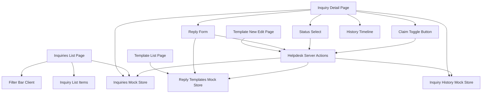
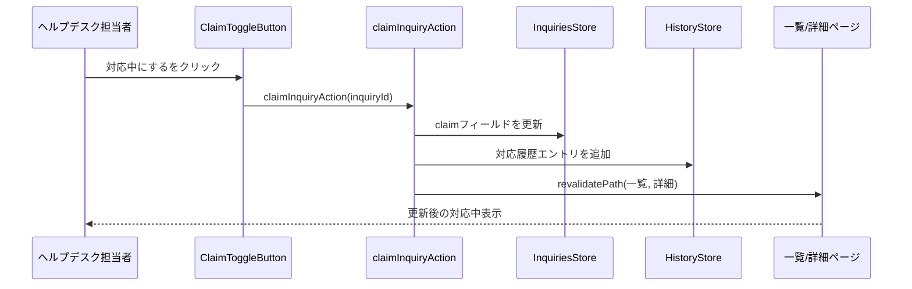

# Technical Design

## Overview
本機能は、`helpdesk-portal-layout`specが確立したヘルプデスク側のルーティング・レイアウト・全社データ取得API（`getAllInquiries`）の上に、ヘルプデスク担当者が実際に問い合わせへ対応するための画面群を実装する。**Purpose**: 緊急度優先の一覧・横断検索、二重対応を防ぐ対応中フラグ、対応履歴の可視化、カテゴリ別テンプレート返信、テンプレート管理という一連の機能により、ヘルプデスクの対応業務を1つのポータルで完結させる。**Users**: 日本側ヘルプデスク担当者（全員が全社分の問い合わせを閲覧する運用、個別アサインなし）。**Impact**: `Inquiry`型に対応中フラグ用の`claim`フィールドを追加（後方互換な追加）し、新規の対応履歴・テンプレートのモックストアとServer Actionsを導入する。`helpdesk-portal-layout`が確立したルート・レイアウト構造自体は変更しない。

### Goals
- ヘルプデスク担当者が緊急度優先で並んだ全社分の問い合わせを一覧・検索できる
- 対応中フラグにより、担当者間の二重対応を防ぐ
- 対応履歴タイムラインにより、誰が何をしたかを追跡できる
- カテゴリ別テンプレートにより、返信の初動を早め、文言のばらつきを減らす
- 上記変更が一覧・詳細画面をまたいで一貫して反映される（画面遷移しても状態が残る）

### Non-Goals
- 認証・ロールベースアクセス制御、担当者個別アサイン機能
- お知らせの作成・編集・削除（別spec）
- 全体傾向の俯瞰グラフ・週次推移分析
- FAQ化候補マーキング、内部コメント欄
- `helpdesk-portal-layout`が確立したルートセグメント・共通レイアウト構造自体の変更
- 実バックエンド・DB連携（フェーズ3）

## Boundary Commitments

### This Spec Owns
- `/[locale]/helpdesk/inquiries`・`/[locale]/helpdesk/inquiries/[id]`・`/[locale]/helpdesk/templates`配下の全ページ
- `Inquiry`型への`claim`フィールドの追加（後方互換な拡張）
- 対応履歴（`InquiryHistoryEntry`）・返信テンプレート（`ReplyTemplate`）の型・モックストア・モックAPI
- 対応中フラグ・ステータス変更・返信送信・テンプレート追加編集を行うServer Actions
- `HelpdeskSidebar`（`helpdesk-portal-layout`所有）への「問い合わせ管理」「テンプレート管理」ナビゲーション項目の追加

### Out of Boundary
- `helpdesk-portal-layout`が所有するルートセグメント構造・`HelpdeskAppShell`・`HelpdeskHeader`自体の変更
- 申請者側の画面・コンポーネント（`dashboard`・`inquiry-list`・`inquiry-form`spec所有）の変更。`claim`フィールドが追加されても、これらのコンポーネントは変更しないため表示されない
- お知らせ管理機能（別spec）
- 認証・ロールベースアクセス制御の実装

### Allowed Dependencies
- 既存の`getInquiries`・`getAllInquiries`（`helpdesk-portal-layout`所有、シグネチャ変更なしで利用）
- 既存の`Inquiry`型（フィールド追加のみ、既存フィールドは変更しない）
- 既存のUIプリミティブ（`Card`, `Badge`, `Button`, `Select`, `Input`, `Textarea`, `Label`, `Skeleton`, `Alert`）
- `HelpdeskSidebar`（項目追加のみ、コンポーネント構造自体は変更しない）

### Revalidation Triggers
- `Inquiry`型のフィールド追加・変更（`dashboard`・`inquiry-list`・`inquiry-form`specが再確認する必要がある）
- Server Actionsの導入パターン自体の変更（将来別specが同様の変更系操作を追加する際の参照実装になる）
- `getInquiries`/`getAllInquiries`のデータ内容変更（`claim`フィールドが混入することを前提にした場合、申請者側コンポーネントが誤って表示していないか要再確認）

## Architecture

### Existing Architecture Analysis
`helpdesk-portal-layout`により、`/[locale]/helpdesk`配下は独立したレイアウト（`HelpdeskAppShell`）を持ち、`getAllInquiries()`で全社データを取得できる状態になっている。ただし現時点では`helpdesk/page.tsx`はプレースホルダーのみで、実際の問い合わせ管理機能は存在しない。既存のモック層（`lib/api/inquiries.ts`）は読み取り専用関数のみで、変更を永続化する仕組みを持たない（`research.md`参照）。

### Architecture Pattern & Boundary Map
Server Actionsが可変モックストアを更新し、`revalidatePath`で一覧・詳細ルートを再検証するパターンを採用する（比較検討は`research.md`のArchitecture Pattern Evaluation参照）。



**Architecture Integration**:
- 選択パターン: Server Actions（`"use server"`）がモックストアを直接更新し、`revalidatePath`で関連ルートを再検証する
- ドメイン境界: 問い合わせ本体（`InquiriesStore`、`helpdesk-portal-layout`所有の`getInquiries`/`getAllInquiries`が読む配列と同一）、対応履歴（`HistoryStore`、本spec新設）、返信テンプレート（`TemplatesStore`、本spec新設）の3ストアに分離
- 既存パターンの維持: ページ構成（一覧→詳細、新規作成フォーム）は申請者側の`inquiry-list`/`inquiry-form`specと同じNext.js App Router構成を踏襲。フォームは`react-hook-form`+`zod`を使用する既存規約に従う
- 新規コンポーネントの理由: 対応中フラグ・ステータス変更・返信フォームはいずれもServer Actionを呼び出すクライアント状態境界を持つため、独立コンポーネントとして新設する
- Steering準拠: 表示テキストは全て`next-intl`翻訳キー経由、モックAPIは`lib/api/`に抽象化、フォームは`react-hook-form`+`zod`という既存規約を維持

### Technology Stack

| Layer | Choice / Version | Role in Feature | Notes |
|-------|------------------|-----------------|-------|
| Frontend | Next.js App Router（既存, 14.2.35） | ページ構成・Server Actions | Server Actionsは本spec で初導入（`research.md`参照） |
| Frontend | next-intl（既存） | 翻訳キー管理 | 新規名前空間（`helpdeskInquiries`, `helpdeskTemplates`）を追加 |
| Forms | react-hook-form + zod（既存） | テンプレート追加・編集フォームのバリデーション | `inquiryForm`と同じ構成パターンを踏襲 |
| UI | shadcn/ui（既存） | `Select`（フィルタ・ステータス変更・テンプレート選択）, `Textarea`（返信欄）, `Badge`（対応中表示） | 新規UIプリミティブの追加は不要 |
| Data / Mock | `lib/api/`配下の可変配列 + Server Actions | 対応中フラグ・ステータス・履歴・テンプレートの状態管理 | フェーズ1限定。開発サーバー再起動でリセットされる |

## File Structure Plan

### Directory Structure
```
src/app/[locale]/helpdesk/
├── inquiries/
│   ├── page.tsx                    # 一覧（検索・フィルタ・緊急度ソート）
│   └── [id]/
│       └── page.tsx                # 詳細（対応中フラグ・ステータス変更・返信・履歴）
└── templates/
    ├── page.tsx                    # テンプレート一覧（カテゴリ別）
    ├── new/
    │   └── page.tsx                # テンプレート新規作成
    └── [id]/
        └── edit/
            └── page.tsx             # テンプレート編集

src/components/features/helpdesk-inquiries/
├── HelpdeskInquiryList.tsx          # Server: 取得・緊急度優先ソート・ローディング/エラー/空状態
├── HelpdeskInquiryListClient.tsx    # Client: フィルタ状態を保持し表示件数を絞り込む
├── HelpdeskInquiryFilterBar.tsx     # Client: 会社名・キーワード・国・カテゴリの入力
├── HelpdeskInquiryListItem.tsx      # 表示専用: 対応中バッジを含む一覧行
├── HelpdeskInquiryDetail.tsx        # Server: 取得・各セクションの組み立て
├── ClaimToggleButton.tsx            # Client: 対応中フラグのON/OFF
├── StatusSelect.tsx                 # Client: ステータス変更
├── ReplyForm.tsx                    # Client: テンプレート選択+返信入力+送信
└── HistoryTimeline.tsx              # 表示専用: 対応履歴の時系列表示

src/components/features/helpdesk-templates/
├── TemplateList.tsx                 # Server: カテゴリ別テンプレート一覧
└── TemplateForm.tsx                 # Client: 新規作成・編集共用フォーム

src/lib/api/
├── inquiries.ts                     # 変更: 対応中フラグ・ステータス変更のミューテーション関数を追加
├── inquiry-history.ts               # 新規: 対応履歴の可変ストア・取得関数
└── reply-templates.ts               # 新規: テンプレートの可変ストア・CRUD関数

src/lib/actions/
└── helpdesk.ts                      # 新規: "use server" Server Actions一式

src/lib/validation/
└── reply-template.ts                # 新規: テンプレートフォームのzodスキーマ

src/lib/constants/
└── helpdesk.ts                      # 新規: MOCK_CURRENT_STAFF_NAME（フェーズ1固定の担当者名）

src/types/
├── inquiry.ts                       # 変更: `claim`フィールドを追加（既存フィールドは変更なし）
├── inquiry-history.ts               # 新規: InquiryHistoryEntry型
└── reply-template.ts                # 新規: ReplyTemplate, CreateReplyTemplateInput型

src/components/layout/
└── HelpdeskSidebar.tsx               # 変更: ナビゲーション項目に「問い合わせ管理」「テンプレート管理」を追加

messages/
├── ja.json                          # 変更: helpdeskInquiries, helpdeskTemplates名前空間、helpdeskNavへのキー追加
└── en.json                          # 同上
```

### Modified Files
- `src/types/inquiry.ts` — `claim?: { staffName: string; claimedAt: string } | null`を追加（既存フィールドは変更しない）
- `src/lib/api/inquiries.ts` — `setInquiryClaim`・`updateInquiryStatus`のミューテーション関数を追加（`getInquiries`/`getAllInquiries`のシグネチャは変更しない）
- `src/components/layout/HelpdeskSidebar.tsx` — `HELPDESK_NAV_ITEMS`に2項目追加
- `messages/ja.json` / `messages/en.json` — 新規名前空間・キーの追加

> 申請者側のコンポーネント（`dashboard`・`inquiry-list`・`inquiry-form`所有）は一切変更しない。`claim`フィールドが`Inquiry`に追加されても、これらのコンポーネントは個別フィールドを明示的に参照する既存実装のため表示に影響しない（`research.md`参照）。

## System Flows

対応中フラグの切り替えとステータス変更は同じパターン（Client Component → Server Action → モックストア更新 → 履歴記録 → revalidatePath）を共有するため、代表として対応中フラグのフローのみ図示する。



- テンプレート返信送信・ステータス変更・テンプレート追加編集も同一の「Server Action → ストア更新 →（該当する場合）履歴記録 → revalidatePath」の型に従う。テンプレート追加編集のみ対応履歴への記録は行わない（履歴は問い合わせ単位の対応記録であり、テンプレート自体の変更履歴は本specの対象外）。

## Requirements Traceability

| Requirement | Summary | Components | Interfaces | Flows |
|-------------|---------|------------|------------|-------|
| 1.1〜1.6 | 一覧表示・緊急度優先ソート・状態表示 | HelpdeskInquiryList | InquiriesMockApi (Service) | — |
| 2.1〜2.5 | 検索・横断フィルタ | HelpdeskInquiryFilterBar, HelpdeskInquiryListClient | — | — |
| 3.1〜3.4 | 問い合わせ詳細画面 | HelpdeskInquiryDetail | InquiriesMockApi (Service) | — |
| 4.1〜4.5 | 対応中フラグ | ClaimToggleButton, HelpdeskActions | Service, State | 対応中フラグの切り替えフロー |
| 5.1〜5.4 | 対応履歴タイムライン | HistoryTimeline, HelpdeskActions | InquiryHistoryMockApi (Service) | 対応中フラグの切り替えフロー |
| 6.1〜6.3 | ステータス変更 | StatusSelect, HelpdeskActions | Service | 対応中フラグの切り替えフローと同型 |
| 7.1〜7.5 | カテゴリ別テンプレート返信 | ReplyForm, HelpdeskActions | ReplyTemplatesMockApi (Service) | 対応中フラグの切り替えフローと同型 |
| 8.1〜8.5 | テンプレート管理画面 | TemplateList, TemplateForm, HelpdeskActions | ReplyTemplatesMockApi (Service) | 対応中フラグの切り替えフローと同型 |
| 9.1〜9.2 | ナビゲーション統合 | HelpdeskSidebar | — | — |
| 10.1〜10.2 | 多言語対応 | 全新規コンポーネント | — | — |
| 11.1 | レスポンシブ対応 | （既存HelpdeskAppShellに依存、新規コンポーネントなし） | — | — |

## Components and Interfaces

| Component | Domain/Layer | Intent | Req Coverage | Key Dependencies (P0/P1) | Contracts |
|-----------|--------------|--------|---------------|---------------------------|-----------|
| HelpdeskInquiryList | UI/Server | 全社分の問い合わせを緊急度優先で取得・表示 | 1.1〜1.6 | InquiriesMockApi (P0) | State |
| HelpdeskInquiryListClient | UI/Client | フィルタ条件に応じて表示件数を絞り込む | 2.1〜2.5 | HelpdeskInquiryFilterBar (P0) | State |
| HelpdeskInquiryFilterBar | UI/Client | 会社名・キーワード・国・カテゴリの入力UI | 2.1〜2.4 | なし | State |
| HelpdeskInquiryListItem | UI | 一覧行の表示（対応中バッジ含む） | 1.3, 4.4 | なし | State |
| HelpdeskInquiryDetail | UI/Server | 問い合わせ詳細・関連セクションの組み立て | 3.1〜3.4 | InquiriesMockApi (P0), InquiryHistoryMockApi (P0) | State |
| ClaimToggleButton | UI/Client | 対応中フラグのON/OFF操作 | 4.1〜4.5 | HelpdeskActions (P0) | State |
| StatusSelect | UI/Client | ステータス変更操作 | 6.1〜6.3 | HelpdeskActions (P0) | State |
| ReplyForm | UI/Client | テンプレート選択・返信入力・送信 | 7.1〜7.5 | HelpdeskActions (P0), ReplyTemplatesMockApi (P1) | State |
| HistoryTimeline | UI | 対応履歴の時系列表示 | 5.1〜5.4 | なし | State |
| TemplateList | UI/Server | カテゴリ別テンプレート一覧の表示 | 8.1 | ReplyTemplatesMockApi (P0) | State |
| TemplateForm | UI/Client | テンプレートの新規作成・編集フォーム | 8.2, 8.3, 8.5 | HelpdeskActions (P0) | State |
| InquiriesMockApi（拡張） | Data/Mock | 対応中フラグ・ステータスのミューテーション | 4.1〜4.3, 6.1〜6.2 | Inquiry型 (P0) | Service |
| InquiryHistoryMockApi | Data/Mock | 対応履歴の取得・追記 | 5.1〜5.3 | なし | Service |
| ReplyTemplatesMockApi | Data/Mock | テンプレートのCRUD | 7.1, 8.1〜8.4 | Inquiry["category"] (P1) | Service |
| HelpdeskActions | Server Actions | 上記モックAPI群を呼び出し、`revalidatePath`で再検証する | 4.1〜4.3, 5.2, 6.1〜6.2, 7.4, 8.2〜8.5 | 上記3つのMockApi (P0) | Service |

### Data / Mock API

#### InquiriesMockApi（拡張）

| Field | Detail |
|-------|--------|
| Intent | 対応中フラグ・ステータスの変更を`Inquiry`データに反映する |
| Requirements | 4.1, 4.2, 4.3, 6.1, 6.2 |

**Responsibilities & Constraints**
- 既存の`getInquiries`・`getAllInquiries`・`getInquiryById`のシグネチャ・返却データの意味を変更しない（`claim`フィールドが追加されるのみ）
- ミューテーションは`MOCK_INQUIRIES`配列の該当要素を直接書き換える（フェーズ1限定、プロセス内のみ有効）

**Dependencies**
- Inbound: `HelpdeskActions`（P0）
- Outbound: なし

**Contracts**: Service [x]

##### Service Interface
```typescript
interface InquiriesMockApiExtension {
  setInquiryClaim(id: string, staffName: string | null): Promise<Inquiry>;
  updateInquiryStatus(id: string, status: Inquiry["status"]): Promise<Inquiry>;
}
```
- Preconditions: `id`は存在する問い合わせのIDであること
- Postconditions: 対象`Inquiry`の`claim`または`status`が更新された状態で解決する
- Invariants: `claim`が非nullのとき`claim.staffName`は空文字列でない

**Implementation Notes**
- Integration: `HelpdeskActions`からのみ呼び出される想定（UIコンポーネントから直接importしない）
- Validation: 存在しないIDを渡した場合はエラーをthrowする
- Risks: プロセス再起動でリセットされる（`research.md`のRisks参照）

#### InquiryHistoryMockApi

| Field | Detail |
|-------|--------|
| Intent | 問い合わせごとの対応履歴を記録・取得する |
| Requirements | 5.1, 5.2, 5.3, 5.4 |

**Responsibilities & Constraints**
- 履歴エントリは追記のみ（更新・削除は行わない）
- 各エントリは発生時刻の降順で取得する

**Dependencies**
- Inbound: `HelpdeskActions`（P0）, `HelpdeskInquiryDetail`（P0, 表示のための取得）
- Outbound: なし

**Contracts**: Service [x]

##### Service Interface
```typescript
interface InquiryHistoryMockApi {
  getInquiryHistory(inquiryId: string): Promise<InquiryHistoryEntry[]>;
  appendInquiryHistoryEntry(
    entry: Omit<InquiryHistoryEntry, "id">
  ): Promise<InquiryHistoryEntry>;
}
```
- Preconditions: `inquiryId`は存在する問い合わせのIDであること
- Postconditions: `getInquiryHistory`は追記されたエントリを含む一覧を発生時刻降順で返す
- Invariants: エントリは不変（追記後に内容が変わらない）

**Implementation Notes**
- Integration: `appendInquiryHistoryEntry`は`HelpdeskActions`内の各操作（claim/status/reply）から呼び出される
- Validation: 履歴が0件のとき`HistoryTimeline`は空状態メッセージを表示する（要件5.4）
- Risks: なし

#### ReplyTemplatesMockApi

| Field | Detail |
|-------|--------|
| Intent | カテゴリ別テンプレートのCRUDを提供する |
| Requirements | 7.1, 8.1, 8.2, 8.3, 8.4, 8.5 |

**Responsibilities & Constraints**
- テンプレートはカテゴリ（`Inquiry["category"]`）ごとに0件以上存在しうる
- カテゴリまたは本文が空のテンプレートは作成できない（要件8.5、`lib/validation/reply-template.ts`のzodスキーマで検証）

**Dependencies**
- Inbound: `HelpdeskActions`（P0）, `ReplyForm`（P1, カテゴリ別取得）, `TemplateList`（P0）
- Outbound: なし

**Contracts**: Service [x]

##### Service Interface
```typescript
interface ReplyTemplatesMockApi {
  getReplyTemplates(): Promise<ReplyTemplate[]>;
  getReplyTemplatesByCategory(
    category: Inquiry["category"]
  ): Promise<ReplyTemplate[]>;
  getReplyTemplateById(id: string): Promise<ReplyTemplate | null>;
  createReplyTemplate(input: CreateReplyTemplateInput): Promise<ReplyTemplate>;
  updateReplyTemplate(
    id: string,
    input: CreateReplyTemplateInput
  ): Promise<ReplyTemplate>;
}
```
- Preconditions: `createReplyTemplate`/`updateReplyTemplate`の`input`はバリデーション済み（カテゴリ・本文が非空）であること
- Postconditions: 作成・更新されたテンプレートが以降の`getReplyTemplatesByCategory`の結果に反映される
- Invariants: `id`は一意

**Implementation Notes**
- Integration: `TemplateForm`は`react-hook-form`+`zod`（`lib/validation/reply-template.ts`）でクライアント側バリデーション後、`HelpdeskActions`のServer Actionを呼び出す
- Validation: サーバー側でも空文字列を拒否し、クライアント側バリデーションのバイパスに備える
- Risks: なし

### Server Actions

#### HelpdeskActions

| Field | Detail |
|-------|--------|
| Intent | クライアントからの変更系操作を受け、モックAPIのミューテーションと履歴記録、関連ルートの再検証を行う |
| Requirements | 4.1〜4.3, 5.2, 6.1〜6.2, 7.4, 8.2〜8.5 |

**Responsibilities & Constraints**
- 全ての関数に`"use server"`ディレクティブを付与する
- 各操作の最後に影響範囲のルート（一覧・詳細・テンプレート一覧）を`revalidatePath`で再検証する
- テンプレートのバリデーションはクライアント（`zod`）とサーバー（同一スキーマの再利用）の両方で行う

**Dependencies**
- Inbound: `ClaimToggleButton`, `StatusSelect`, `ReplyForm`, `TemplateForm`（いずれもP0）
- Outbound: `InquiriesMockApiExtension`, `InquiryHistoryMockApi`, `ReplyTemplatesMockApi`（いずれもP0）

**Contracts**: Service [x]

##### Service Interface
```typescript
interface HelpdeskActions {
  claimInquiryAction(inquiryId: string): Promise<void>;
  releaseInquiryClaimAction(inquiryId: string): Promise<void>;
  changeInquiryStatusAction(
    inquiryId: string,
    status: Inquiry["status"]
  ): Promise<void>;
  sendInquiryReplyAction(inquiryId: string, replyBody: string): Promise<void>;
  createReplyTemplateAction(
    input: CreateReplyTemplateInput
  ): Promise<ReplyTemplate>;
  updateReplyTemplateAction(
    id: string,
    input: CreateReplyTemplateInput
  ): Promise<ReplyTemplate>;
}
```
- Preconditions: `inquiryId`/`id`は存在するレコードを指すこと。フォーム系入力はクライアント側でバリデーション済みであること
- Postconditions: 対応する履歴エントリが記録され（claim/release/status/reply）、関連ルートが再検証される
- Invariants: `createReplyTemplateAction`/`updateReplyTemplateAction`は対応履歴に記録しない（テンプレート変更履歴は対象外）

**Implementation Notes**
- Integration: 対応中フラグ・ステータス変更・返信送信の操作者名はフェーズ1固定の`MOCK_CURRENT_STAFF_NAME`（`lib/constants/helpdesk.ts`）を使用する
- Validation: 存在しないIDに対する操作はエラーをthrowし、呼び出し元でエラー表示にフォールバックする
- Risks: `revalidatePath`のパス指定漏れがあると一覧・詳細間で表示が同期しない（`research.md`のRisks参照）

### Presentation Components（サマリーのみ）

- **HelpdeskInquiryList / HelpdeskInquiryListClient / HelpdeskInquiryFilterBar / HelpdeskInquiryListItem**: `getAllInquiries()`の結果を緊急度→受付日時の順で並び替えた後、クライアント側でフィルタ条件（会社名・キーワード・国・カテゴリのAND条件）により表示件数を絞り込む。既存`InquiryList`/`InquiryListItem`（申請者側）の構造を参考にしつつ、対応中バッジの表示を追加する。
- **HelpdeskInquiryDetail / ClaimToggleButton / StatusSelect / ReplyForm / HistoryTimeline**: 既存`InquiryDetail`（申請者側）と同等の情報表示に加え、ヘルプデスク専用のセクション（対応中フラグ・ステータス変更・返信フォーム・履歴タイムライン）を追加する。
- **TemplateList / TemplateForm**: `InquiryForm`と同じ`react-hook-form`+`zod`パターンを踏襲したシンプルなCRUD画面。

## Data Models

### Domain Model
- `Inquiry`（既存、拡張）: `claim?: { staffName: string; claimedAt: string } | null`を追加。対応中でない場合は`null`または未設定。
- `InquiryHistoryEntry`（新規）: 1件の対応履歴イベント。`inquiryId`で`Inquiry`と関連付く（1問い合わせ:N履歴）。
- `ReplyTemplate`（新規）: カテゴリ別の定型文。`Inquiry["category"]`と対応するが独立したエンティティ。

### Logical Data Model
- `Inquiry` 1 --- N `InquiryHistoryEntry`（`inquiryId`で関連付け、外部キー相当）
- `ReplyTemplate`は`category`で`Inquiry`と緩やかに対応するが、参照整合性は持たない（カテゴリコードの値一致のみ）

### Data Contracts & Integration

| 型 | 主なフィールド | 備考 |
|---|---|---|
| `Inquiry`（拡張） | 既存フィールド + `claim?: { staffName: string; claimedAt: string } \| null` | 既存フィールドは変更なし |
| `InquiryHistoryEntry` | `id`, `inquiryId`, `type: "claimed" \| "released" \| "status_changed" \| "reply_sent"`, `actorName`, `occurredAt`, `detail?: string` | `detail`はステータス変更前後の値や返信本文の要約 |
| `ReplyTemplate` | `id`, `category: Inquiry["category"]`, `body: string` | |
| `CreateReplyTemplateInput` | `category`, `body` | `ReplyTemplate`から`id`を除いたサブセット |

## Error Handling

### Error Strategy
既存の`inquiry-list`specと同様、各Server Componentは取得失敗時にtry/catchでエラーメッセージを表示する。Server Actionsは存在しないIDに対する操作時にエラーをthrowし、呼び出し元のクライアントコンポーネントがエラー状態を表示する。

### Error Categories and Responses
- **データ取得失敗**（一覧・詳細・テンプレート一覧）: 既存パターンと同様にエラーメッセージを表示
- **存在しない問い合わせ/テンプレートIDへの操作**: Server Actionがエラーをthrowし、クライアント側でエラー表示にフォールバック
- **テンプレート入力値不正**（カテゴリ・本文未入力）: クライアント側`zod`バリデーションで送信をブロックし、フィールド単位のエラーメッセージを表示（要件8.5）

### Monitoring
フェーズ1はモックのため、追加のロギング・監視基盤は導入しない。

## Testing Strategy

- **Unit Tests**:
  - 緊急度優先ソートのコンパレータが高→中→低、同一緊急度内は受付日時降順になること
  - フィルタロジック（会社名・キーワード・国・カテゴリのAND条件）が正しく絞り込むこと
  - `setInquiryClaim`/`updateInquiryStatus`が対象の`Inquiry`のみを更新し、他のレコードに影響しないこと
  - `appendInquiryHistoryEntry`が発生時刻降順で取得できる状態を維持すること
  - テンプレートのzodスキーマがカテゴリ・本文の未入力を拒否すること
- **Integration Tests**:
  - `ClaimToggleButton`操作後、一覧・詳細の両方に対応中表示が反映されること
  - ステータス変更後、`status`の変更が対応履歴に記録されること
  - 返信送信後、対応履歴に記録されること
  - テンプレート追加後、`ReplyForm`の選択肢に反映されること
- **E2E/UI Tests**:
  - 日本語・英語両ロケールで一覧・詳細・テンプレート管理画面が表示されること
  - タブレット幅（768px）で新規画面が横スクロールを起こさないこと

## Security Considerations
`claim`・対応履歴・テンプレートはヘルプデスク内部情報であり、申請者側画面に表示されてはならない。申請者側コンポーネント（`InquiryDetail`・`RecentInquiriesWidget`等）は個別フィールドを明示的に参照する既存実装のままとし、`Inquiry`オブジェクトを丸ごとクライアントに渡す変更を行わない。認証・アクセス制御は本specの対象外であり、`helpdesk-portal-layout`が定めた「フェーズ3で追加」という前提を踏襲する。
