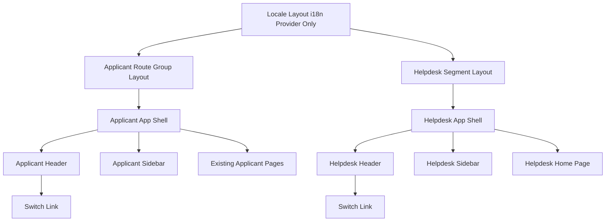

# Technical Design

## Overview
本機能は、海外販社担当者向けの申請者側ポータルと、日本側ヘルプデスク担当者向けの新設ポータルを、ルーティング・レイアウト・データ参照範囲の3レベルで分離する基盤を提供する。**Purpose**: 現状同一の画面・データに混在している申請者側とヘルプデスク側を明確に分離し、後続で実装されるヘルプデスク向け問い合わせ管理・お知らせ管理機能の置き場所を確立する。**Users**: 海外販社担当者（既存の申請者側画面を継続利用するが、参照データが自社のみに絞られる）と日本側ヘルプデスク担当者（新設のヘルプデスク側エリアにアクセスし、プレースホルダーのホーム画面と将来機能の受け皿を得る）。**Impact**: 既存の`src/app/[locale]`配下のルート構成をルートグループで再編し、共有していた単一の`AppShell`を申請者側・ヘルプデスク側それぞれ専用のシェルに分割する。あわせて、モックAPI `getInquiries`・`getInquiryStatusSummary` の参照データを自社スコープに限定し、全社データを返す `getAllInquiries` を新規に追加する。

### Goals
- 申請者側の既存URL・レイアウト・操作性を変えずに、ヘルプデスク側専用のルート・レイアウト・ナビゲーションを新設する
- 両ポータルが視覚的に判別できる状態にする
- フェーズ1（認証未実装）における申請者側⇔ヘルプデスク側の仮の切り替え導線を提供する
- 申請者側が参照する問い合わせデータを自社のみに限定し、ヘルプデスク側が全社データを取得できるモックAPIの土台を用意する

### Non-Goals
- 認証・ロールベースアクセス制御の実装（フェーズ3以降）
- ヘルプデスク側の個別機能（問い合わせ一覧のソート・検索フィルタ・対応中フラグ・対応履歴・テンプレート返信・お知らせ作成編集）の実装。これらは後続の別specが担う
- `announcements`, `inquiry-form`, `inquiry-list`, `links-page`, `faq` の各specが定義した機能・型契約の変更
- バックエンドAPI・DB連携（フェーズ3）

## Boundary Commitments

### This Spec Owns
- `[locale]`配下のルートセグメント構成（申請者側ルートグループとヘルプデスク側セグメントの分離）
- `AppShell`／`HelpdeskAppShell`とそれぞれのHeader・Sidebarコンポーネント
- 申請者側⇔ヘルプデスク側の切り替えリンクの実装
- `lib/api/inquiries.ts`における自社スコープの絞り込みロジック（`getInquiries`・`getInquiryStatusSummary`）と、新規`getAllInquiries`の契約
- ヘルプデスク側プレースホルダーホームページ

### Out of Boundary
- ヘルプデスク側の実機能（問い合わせ一覧UI・ソート・検索フィルタ・対応中フラグ・対応履歴タイムライン・テンプレート返信・テンプレート管理）— 次spec「ヘルプデスク問い合わせ管理」が担う
- お知らせの作成・編集・削除UI — 次spec「announcements拡張」が担う
- 認証・認可の実装
- `Inquiry`・`CreateInquiryInput`・`InquiryStatusSummary`型の形状変更

### Allowed Dependencies
- 既存の`next-intl`ルーティング（`src/i18n/routing.ts`, `src/i18n/navigation.ts`）— 変更せず利用
- 既存の`Inquiry`型（`src/types/inquiry.ts`）— 参照のみ、変更しない
- 既存のshadcn/ui基本コンポーネント（`Badge`等）— ヘルプデスク側の視覚的識別要素に利用
- 既存の`AppShell`/`Header`/`Sidebar`の実装パターン — ヘルプデスク側シェルの構造テンプレートとして踏襲

### Revalidation Triggers
- `getInquiries`/`getInquiryStatusSummary`/`getAllInquiries`のシグネチャ変更（`dashboard`, `inquiry-list`, および後続の「ヘルプデスク問い合わせ管理」specが要再確認）
- `(applicant)`/`helpdesk`ルート境界・シェルコンポーネントの変更（新規ページを追加する全specが配置先を再確認する必要あり）
- 認証機能の導入（本specが確立したルート境界・切り替えリンクの扱いを再設計する必要あり）

## Architecture

### Existing Architecture Analysis
現状、`src/app/[locale]/layout.tsx`は配下の全ページを無条件に`AppShell`（申請者側Header・Sidebar）でラップしている。`lib/api/inquiries.ts`の`getInquiries()`は関数コメント上「自社の問い合わせ全件」を意図しているが、実装は8社分のモックデータを無絞り込みで返しており、`getInquiryStatusSummary()`もデータと無関係な固定値を返す。本機能はこの2点（レイアウトの単一構造・データ境界の欠如）を是正する。

### Architecture Pattern & Boundary Map
Next.jsのルートグループ機能を用いて、URLに影響を与えずに申請者側・ヘルプデスク側のレイアウトを分離する（詳細な比較検討は`research.md`のArchitecture Pattern Evaluation参照）。



**Architecture Integration**:
- 選択パターン: Next.js Route Groups（`(applicant)`）+ 新規パスセグメント（`helpdesk`）
- ドメイン境界: 申請者側ページ群は`(applicant)`配下、ヘルプデスク側ページ群は`helpdesk`配下に完全分離。両者は共通の`[locale]/layout.tsx`（i18nプロバイダのみ）を最上位の親として共有するが、シェル（Header/Sidebar）以下は分岐しない独立構造
- 既存パターンの維持: `AppShell`/`Header`/`Sidebar`は無改造のまま`(applicant)`配下に適用。`Card`・`Badge`等の既存UIプリミティブをヘルプデスク側でも再利用
- 新規コンポーネントの理由: `HelpdeskAppShell`/`HelpdeskHeader`/`HelpdeskSidebar`は申請者側と異なるナビゲーション項目・視覚識別要素を持つため、既存コンポーネントの条件分岐ではなく独立コンポーネントとして新設する（「No Hidden Shared Ownership」原則に基づく）
- Steering準拠: `brand.md`のDAISOカラートークン（`--primary`, `--accent`等）はヘルプデスク側でも継続利用し、独自の配色体系は導入しない

### Technology Stack

| Layer | Choice / Version | Role in Feature | Notes |
|-------|------------------|-----------------|-------|
| Frontend | Next.js App Router（既存バージョン） | ルートグループによる申請者側・ヘルプデスク側の分離 | 新規ライブラリ追加なし |
| Frontend | next-intl（既存） | ロケールプレフィックス付きルーティング・翻訳キー管理 | `routing.ts`/`navigation.ts`は変更不要 |
| UI | Tailwind CSS + shadcn/ui（既存） | HelpdeskAppShell/Header/SidebarのスタイリングとBadge等の再利用 | 新規コンポーネント追加なし、既存`Badge`等を利用 |
| Data / Mock | `lib/api/inquiries.ts`（既存モック層） | `getInquiries`/`getInquiryStatusSummary`の自社スコープ化、`getAllInquiries`新設 | フェーズ3で実APIに差し替え予定の抽象層 |

## File Structure Plan

### Directory Structure
```
src/app/[locale]/
├── layout.tsx                     # 変更: NextIntlClientProviderのみを残し、AppShellの適用を除去
├── (applicant)/                   # 新規: 申請者側ルートグループ（URLに影響しない）
│   ├── layout.tsx                 # 新規: 既存AppShellを適用
│   ├── page.tsx                   # 移動: src/app/[locale]/page.tsx から
│   ├── inquiry/                   # 移動: 既存ディレクトリをそのまま移設
│   ├── announcements/             # 移動: 既存ディレクトリをそのまま移設
│   ├── links/                     # 移動: 既存ディレクトリをそのまま移設
│   └── faq/                       # 移動: 既存ディレクトリをそのまま移設
└── helpdesk/                      # 新規: ヘルプデスク側セグメント
    ├── layout.tsx                 # 新規: HelpdeskAppShellを適用
    └── page.tsx                   # 新規: ヘルプデスク側プレースホルダーホーム

src/components/layout/
├── AppShell.tsx                   # 変更なし
├── Header.tsx                     # 変更: ヘルプデスク側への切り替えリンクを追加
├── Sidebar.tsx                    # 変更なし
├── HelpdeskAppShell.tsx            # 新規: AppShellと同一構造でHelpdeskHeader/Sidebarを組み合わせる
├── HelpdeskHeader.tsx              # 新規: 視覚的識別要素（バッジ等）+ 申請者側への切り替えリンク
└── HelpdeskSidebar.tsx             # 新規: プレースホルダーのナビゲーション項目（ホームのみ）

src/lib/api/
└── inquiries.ts                   # 変更: MOCK_CURRENT_COMPANY定数を追加、getInquiries/getInquiryStatusSummaryを自社スコープ化、getAllInquiriesを新設

messages/
├── ja.json                        # 変更: helpdeskHeader, helpdeskNav, helpdeskHome, header(切り替えリンク)キーを追加
└── en.json                        # 同上（英語）
```

### Modified Files
- `src/app/[locale]/layout.tsx` — `AppShell`のラップを除去し、`NextIntlClientProvider`のみを残す
- `src/components/layout/Header.tsx` — ヘルプデスク側への切り替えリンクを追加（内容変更のみ、構造は維持）
- `src/lib/api/inquiries.ts` — `MOCK_CURRENT_COMPANY`定数の追加、`getInquiries`/`getInquiryStatusSummary`の自社スコープ化、`getAllInquiries`の新設
- `messages/ja.json` / `messages/en.json` — ヘルプデスク側レイアウト・切り替えリンク用の翻訳キーを追加

> 既存ページファイル（`page.tsx`, `inquiry/`, `announcements/`, `links/`, `faq/`）は内容を変更せず`(applicant)/`配下へ移動するのみ。ルートグループはURLセグメントとして現れないため、既存URLは変化しない。

## Requirements Traceability

| Requirement | Summary | Components | Interfaces | Flows |
|-------------|---------|------------|------------|-------|
| 1.1, 1.2, 1.3 | ヘルプデスク側ルートセグメントの新設 | LocaleLayout, ApplicantLayout, HelpdeskLayout | — | Route Group分岐 |
| 2.1, 2.2, 2.3 | ヘルプデスク側専用レイアウト | HelpdeskAppShell, HelpdeskHeader, HelpdeskSidebar | — | — |
| 3.1, 3.2 | 視覚的な区別 | HelpdeskHeader | — | — |
| 4.1, 4.2, 4.3 | 切り替え導線（フェーズ1仮実装） | Header, HelpdeskHeader | — | 切り替えリンク遷移 |
| 5.1, 5.2 | ヘルプデスク側ホームページ | HelpdeskHomePage | — | — |
| 6.1, 6.2 | 既存申請者側機能の非破壊 | ApplicantLayout, AppShell | — | — |
| 7.1, 7.2 | 多言語対応 | HelpdeskHeader, HelpdeskSidebar, HelpdeskHomePage | — | — |
| 8.1 | レスポンシブ対応 | HelpdeskAppShell | — | — |
| 9.1, 9.2, 9.3, 9.4 | 申請者側データの自社スコープ限定 | InquiriesMockApi | Service Interface | データ取得フロー |
| 10.1, 10.2, 10.3 | ヘルプデスク側データ基盤 | InquiriesMockApi | Service Interface | データ取得フロー |

## Components and Interfaces

| Component | Domain/Layer | Intent | Req Coverage | Key Dependencies (P0/P1) | Contracts |
|-----------|--------------|--------|---------------|---------------------------|-----------|
| LocaleLayout | Routing | i18nプロバイダのみを提供する最上位レイアウト | 1.2 | NextIntlClientProvider (P0) | State |
| ApplicantLayout | Routing | 申請者側ルートグループにAppShellを適用 | 1.3, 6.1 | AppShell (P0) | State |
| HelpdeskLayout | Routing | ヘルプデスク側セグメントにHelpdeskAppShellを適用 | 1.1, 1.2 | HelpdeskAppShell (P0) | State |
| HelpdeskAppShell | Layout | ヘルプデスク側の共通シェル（Header+Sidebar+コンテンツ領域） | 2.1, 2.2, 2.3, 8.1 | HelpdeskHeader (P0), HelpdeskSidebar (P0) | State |
| HelpdeskHeader | Layout | 視覚的識別要素と申請者側への切り替えリンクを持つヘッダー | 3.1, 3.2, 4.1, 7.1 | Badge (P1), LanguageSwitcher (P1) | State |
| HelpdeskSidebar | Layout | プレースホルダーのナビゲーション項目を持つサイドバー | 2.2, 7.1 | なし | State |
| Header | Layout | 既存申請者側ヘッダーにヘルプデスク側への切り替えリンクを追加 | 4.1 | なし | State |
| HelpdeskHomePage | UI Page | ヘルプデスク側トップのプレースホルダー画面 | 5.1, 5.2, 7.1 | なし | State |
| InquiriesMockApi | Data/Mock | 自社スコープの問い合わせ取得と全社データ取得を提供 | 9.1, 9.2, 9.3, 9.4, 10.1, 10.2, 10.3 | Inquiry型 (P0) | Service |

### Routing / Layout

#### ApplicantLayout

| Field | Detail |
|-------|--------|
| Intent | 申請者側ルートグループ（`(applicant)`）配下の全ページに既存`AppShell`を適用する |
| Requirements | 1.3, 6.1 |

**Responsibilities & Constraints**
- `(applicant)`配下のページのみをラップし、`helpdesk`配下には一切影響しない
- 既存`AppShell`の実装・propsを変更せずそのまま利用する

**Dependencies**
- Inbound: `LocaleLayout` — 子要素として描画される（P0）
- Outbound: `AppShell` — 既存シェルの適用（P0）

**Contracts**: State [x]

##### State Management
- State model: サーバーコンポーネントとして`children`をそのまま`AppShell`へ渡すのみ。クライアント状態を持たない
- Persistence & consistency: 該当なし
- Concurrency strategy: 該当なし

**Implementation Notes**
- Integration: 既存の`page.tsx`・`inquiry/`・`announcements/`・`links/`・`faq/`を本ルートグループ配下へ移動する
- Validation: 移動後に`npm run build`で全既存URLが変化していないことを確認する
- Risks: ファイル移動時の相対import崩れ（`@/`エイリアス使用箇所は影響なし想定）

#### HelpdeskLayout

| Field | Detail |
|-------|--------|
| Intent | ヘルプデスク側セグメント（`helpdesk`）配下の全ページに新設`HelpdeskAppShell`を適用する |
| Requirements | 1.1, 1.2 |

**Responsibilities & Constraints**
- `helpdesk`配下のページのみをラップする
- 申請者側のレンダリングパスに一切干渉しない

**Dependencies**
- Inbound: `LocaleLayout` — 子要素として描画される（P0）
- Outbound: `HelpdeskAppShell` — 新設シェルの適用（P0）

**Contracts**: State [x]

##### State Management
- State model: `children`を`HelpdeskAppShell`へ渡すのみのサーバーコンポーネント
- Persistence & consistency: 該当なし
- Concurrency strategy: 該当なし

**Implementation Notes**
- Integration: `ApplicantLayout`と対称的な構造で新設する
- Validation: `/[locale]/helpdesk`アクセス時に`HelpdeskHeader`/`HelpdeskSidebar`のみが表示され、申請者側`Header`/`Sidebar`が併存しないことを確認する
- Risks: なし（新規追加のみ）

### Data / Mock API

#### InquiriesMockApi

| Field | Detail |
|-------|--------|
| Intent | 申請者側には自社スコープの問い合わせデータのみを、ヘルプデスク側の将来機能には全社データを提供する |
| Requirements | 9.1, 9.2, 9.3, 9.4, 10.1, 10.2, 10.3 |

**Responsibilities & Constraints**
- `getInquiries`・`getInquiryStatusSummary`は`MOCK_CURRENT_COMPANY`（固定のモック会社定数）に一致する`submittedBy.companyName`のデータのみを対象にする
- `getAllInquiries`は絞り込みを行わず、`MOCK_INQUIRIES`全件を`createdAt`降順で返す
- 既存`getInquiries`・`getInquiryById`・`createInquiry`の引数・戻り値の型シグネチャは変更しない
- `MOCK_CURRENT_COMPANY`はフェーズ1限定の暫定実装であり、フェーズ3で認証済みユーザーの所属会社情報に置き換わる想定であることをコード上のコメントで明示する

**Dependencies**
- Inbound: `RecentInquiriesWidget`, `InquiryStatusWidget`, `InquiryList`, `InquiryDetail`（いずれも既存、`dashboard`/`inquiry-list`spec所有） — `getInquiries`/`getInquiryStatusSummary`/`getInquiryById`の呼び出し元（P0）
- Outbound: なし
- External: なし

**Contracts**: Service [x]

##### Service Interface
```typescript
interface InquiriesMockApi {
  // 既存・シグネチャ変更なし。返却データを MOCK_CURRENT_COMPANY に紐づく分のみへ絞り込む
  getInquiries(): Promise<Inquiry[]>;
  // 既存・シグネチャ変更なし。集計対象を MOCK_CURRENT_COMPANY に紐づく分のみへ絞り込む
  getInquiryStatusSummary(): Promise<InquiryStatusSummary>;
  // 既存・変更なし
  getInquiryById(id: string): Promise<Inquiry | null>;
  // 既存・変更なし
  createInquiry(input: CreateInquiryInput): Promise<Inquiry>;
  // 新規追加。絞り込みを行わず全社データを返す
  getAllInquiries(): Promise<Inquiry[]>;
}
```
- Preconditions: なし（引数を取らない）
- Postconditions: `getInquiries`/`getInquiryStatusSummary`の戻り値は常に`MOCK_CURRENT_COMPANY`に紐づくデータのみから導出される。`getAllInquiries`の戻り値は`MOCK_INQUIRIES`の全件を含む
- Invariants: `getInquiries()`が返す配列は`getAllInquiries()`が返す配列の部分集合である

**Implementation Notes**
- Integration: `MOCK_CURRENT_COMPANY`は`lib/api/inquiries.ts`内のモジュール非公開定数とし、外部からは参照させない
- Validation: `getInquiries()`の戻り値が全て`MOCK_CURRENT_COMPANY.companyName`と一致すること、`getInquiryStatusSummary()`の合計件数が`getInquiries()`の件数と一致することを単体テストで検証する
- Risks: `MOCK_CURRENT_COMPANY`に該当するモックデータが少ないと一覧・ダッシュボードの見た目が寂しくなるため、実装時に該当会社向けのモックエントリを1〜2件追加する（`research.md`のRisks参照）

### Layout Presentation Components（サマリーのみ）

- **HelpdeskAppShell**: `AppShell`と同一のレイアウト構造（固定ヘッダー・折りたたみ可能サイドバー・レスポンシブpadding）を、`HelpdeskHeader`/`HelpdeskSidebar`を用いて再現する。Implementation Note: 折りたたみ状態のロジックは`AppShell`と同一パターンを踏襲し、将来的な共通化候補として`research.md`のRisksに記録済み。
- **HelpdeskHeader**: `Header`と同じ構造（ロゴ＋タイトル＋言語切替）に加え、「ヘルプデスク」を示す`Badge`と、申請者側へ戻る切り替えリンクを表示する。Implementation Note: 既存`Badge`コンポーネント（`src/components/ui/badge.tsx`）をそのまま利用する。
- **HelpdeskSidebar**: `Sidebar`と同じ構造で、本spec時点ではホームへのナビゲーション項目1件のみを持つ。後続specがこの配列に項目を追加する。Implementation Note: `Sidebar.tsx`のNAV_ITEMSパターンをそのまま踏襲する。
- **Header（変更）**: 既存構成を維持したまま、ヘルプデスク側への切り替えリンクを右側領域に追加する。Implementation Note: `LanguageSwitcher`と並べて配置する。
- **HelpdeskHomePage**: 見出し・説明文のみの静的コンテンツ。今後追加される機能（問い合わせ管理・お知らせ管理）が別specで実装予定であることを説明する。Implementation Note: 既存の`Card`コンポーネントを流用する。

## Data Models

### Domain Model
新しいドメイン概念は導入しない。既存の`Inquiry`型（`src/types/inquiry.ts`）をそのまま参照する。`MOCK_CURRENT_COMPANY`はドメインモデルではなく、フェーズ1のモック層に閉じた暫定的な設定値である。

### Data Contracts & Integration

| 関数 | 戻り値 | スコープ | 備考 |
|------|--------|----------|------|
| `getInquiries()` | `Promise<Inquiry[]>` | `MOCK_CURRENT_COMPANY`に一致する分のみ | 既存呼び出し元（`inquiry-list`, `dashboard`）は変更不要 |
| `getInquiryStatusSummary()` | `Promise<InquiryStatusSummary>` | `MOCK_CURRENT_COMPANY`に一致する分から集計 | 固定値の返却をやめ、`getInquiries`相当のデータから件数を算出する |
| `getAllInquiries()` | `Promise<Inquiry[]>` | 全件（絞り込みなし） | 本spec時点では消費するUIコンポーネントは存在しない（次specで利用） |

## Error Handling

### Error Strategy
本機能はモックAPIの参照範囲変更とレイアウト構造変更のみであり、新たな例外系は発生しない。既存の各コンポーネント（`InquiryList`, `InquiryDetail`, `RecentInquiriesWidget`, `InquiryStatusWidget`）が持つtry/catchによるエラー表示パターンをそのまま踏襲する。

### Error Categories and Responses
- **データ0件（自社の問い合わせが存在しない場合）**: 既存の空状態表示（「問い合わせはありません」等）をそのまま利用する（要件9.4）
- **未定義ルート**: `helpdesk`配下に存在しないパスへのアクセスは、Next.js標準のnot-found挙動に従う

## Testing Strategy

- **Unit Tests**:
  - `getInquiries()`が`MOCK_CURRENT_COMPANY`に紐づくデータのみを返すこと
  - `getAllInquiries()`が絞り込みなしで全件を返すこと
  - `getInquiryStatusSummary()`の合計件数が`getInquiries()`の件数と一致すること
- **Integration Tests**:
  - `/[locale]/helpdesk`配下のページで`HelpdeskAppShell`（Header/Sidebar）が描画され、申請者側`AppShell`が併存しないこと
  - 既存の申請者側ルート（`/`, `/inquiry`, `/inquiry/[id]`, `/announcements`, `/links`, `/faq`）が移動後も同一の見た目・URLで描画されること
  - 申請者側⇔ヘルプデスク側の切り替えリンクが正しい遷移先に移動すること
- **E2E/UI Tests**:
  - 日本語・英語の両ロケールでヘルプデスク側ホームページが表示されること
  - タブレット幅（768px）でヘルプデスク側レイアウトが横スクロールを起こさないこと

## Security Considerations
本フェーズはルーティング・レイアウトの分離のみを行い、アクセス制御は実装しない。`helpdesk`セグメントは`(applicant)`と同様に認証なしで到達可能である。フェーズ3で認証が導入される際は、本specが確立したルートセグメント境界（`(applicant)` / `helpdesk`）を変更せずにアクセス制御を追加できることを設計上の前提とする（Revalidation Triggers参照）。

## サイドバーのアクティブ判定統一・ヘッダーロゴのダッシュボード導線化（2026-07-08 追記）

### 対象ファイル
- `src/components/layout/Sidebar.tsx`（変更）
- `src/components/layout/Header.tsx`（変更）
- `src/components/layout/HelpdeskHeader.tsx`（変更）
- `src/components/layout/HelpdeskSidebar.tsx`（変更なし・参照実装）

### サイドバーのアクティブ判定（Requirement 11）
`Sidebar.tsx`の`isActive`算出を、`HelpdeskSidebar.tsx`が既に採用している方式に統一する。

変更前:
```typescript
const isActive = pathname === item.href;
```

変更後（`HelpdeskSidebar.tsx`の`item.href !== "/helpdesk"`判定をルートパス`"/"`向けに置き換えたもの）:
```typescript
const isActive =
  pathname === item.href ||
  (item.href !== "/" && pathname.startsWith(`${item.href}/`));
```

この変更により、`/documents/123`は`documents`項目を、`/inquiry/456`は`inquiryList`項目をアクティブ表示する。`href="/"`（ダッシュボード）は完全一致のみでアクティブとし、他の全パスに対して常時アクティブ化する問題を避ける。

### ヘッダーロゴのダッシュボードリンク化（Requirement 12）
`Header.tsx` / `HelpdeskHeader.tsx`の左上ロゴ・タイトル領域（`<div className="flex items-center gap-3 min-w-0">...</div>`）を、`@/i18n/navigation`の`Link`でラップする。`Logo`コンポーネント自体（`src/components/layout/Logo.tsx`）は変更しない。

- `Header.tsx`: ラップ先を`href="/"`とする
- `HelpdeskHeader.tsx`: ラップ先を`href="/helpdesk"`とする（`Badge`要素もリンク内に含める）

いずれも既存のロゴ・タイトル・（ヘルプデスク側は）バッジの表示・スタイルはそのまま維持し、クリック可能領域を追加するのみとする。フォーカス可能なリンク要素になるため、追加の`tabIndex`やARIA属性は不要（ネイティブ`<a>`要素のデフォルト挙動に従う）。

## ログアウト導線の追加・HelpdeskAppShell開閉ボタンのi18n化（2026-07-13 追記）

### 対象ファイル
- `src/components/layout/Header.tsx`（変更: 申請者側ヘッダーにログアウトコントロールを追加）
- `src/components/layout/HelpdeskHeader.tsx`（変更: ヘルプデスク側ヘッダーにログアウトコントロールを追加）
- `src/components/layout/HelpdeskAppShell.tsx`（変更: サイドバー開閉ボタンの`aria-label`をi18n化）
- `messages/ja.json` / `messages/en.json`（変更: ログアウト文言・開閉ボタンの`aria-label`翻訳キーを追加）

### ログアウト導線（Requirement 13）
`src/auth.ts`が`export const { handlers, auth, signIn, signOut } = NextAuth({...})`で`signOut`をエクスポート済みだが、これを呼び出すUI導線が両ヘッダーに存在しない。両ヘッダーの右側領域（`LanguageSwitcher`・ポータル切り替えリンクと同じ並び）に、ログアウトを実行するコントロールを追加する。

- 実装形態: まずは最小構成として、ヘッダー右側にログアウト用のボタン（アイコン＋アクセシブルな名前）を1つ追加する方針とする。将来的にプロフィール等のメニュー項目が増える場合は、同じ位置をトリガーにしたユーザーメニュー（ドロップダウン）へ拡張できる構造を許容するが、本ラウンドではドロップダウンの新規実装は必須としない。
- 呼び出し: クライアントコンポーネントから`next-auth/react`の`signOut`（または`src/auth.ts`の`signOut`をラップしたServer Action）を呼び出し、完了後にサインイン画面へリダイレクトする。`signOut`の呼び出し方式（クライアント側`signOut({ callbackUrl })` か Server Action 経由か）は実装時に既存の認証構成（`backend-db-foundation`）に合わせて選択する。
- 表示文言・`aria-label`は`next-intl`翻訳キー（例: `header.signOut` / `helpdeskHeader.signOut`、または共通の`auth.signOut`）で提供する。
- 既存のロゴ・言語切替・ポータル切り替えリンク・ヘルプデスクバッジの表示・配置は変更しない（右側領域への要素追加のみ）。

### HelpdeskAppShell開閉ボタンのi18n化（Requirement 14）
`HelpdeskAppShell.tsx`はクライアントコンポーネント（`useState`でサイドバー折りたたみ状態を保持）だが`next-intl`を利用していない。サイドバー開閉ボタンの`aria-label`が日本語ハードコード（`isSidebarCollapsed ? "サイドバーを展開" : "サイドバーを折りたたむ"`）になっている。

- `useTranslations`を導入し、`aria-label`を翻訳キー（例: `helpdeskShell.expandSidebar` / `helpdeskShell.collapseSidebar`）から解決するよう変更する。
- 開閉挙動・折りたたみ状態のロジック・レイアウトは変更しない（`aria-label`の文言取得元のみを変更する）。
- 申請者側`AppShell`/`Sidebar`に同種のハードコードがある場合は、実装時に同一パターンで併せて是正してよい（本要件のスコープ外だが、`No Hidden Shared Ownership`の観点から同時是正を妨げない）。

### Requirements Traceability（2026-07-13 追記分）
| Requirement | Summary | Components | Interfaces | Flows |
|-------------|---------|------------|------------|-------|
| 13.1〜13.7 | ログアウト導線の追加 | Header, HelpdeskHeader | signOut（`src/auth.ts` / `next-auth/react`） | ログアウト→サインイン画面遷移 |
| 14.1〜14.4 | HelpdeskAppShell開閉ボタンのi18n化 | HelpdeskAppShell | — | — |

## モバイル幅のドロワー型ナビゲーション・ヘッダー副題の省略回避（2026-07-22 追記）

### 対象ファイル
- `src/components/layout/nav-items.ts`（新規: 申請者側・ヘルプデスク側のナビゲーション項目定義とアクティブ判定ロジックを一元化する共有モジュール）
- `src/components/layout/MobileNav.tsx`（新規: モバイル幅のハンバーガートグル＋ドロワーを内包する共有クライアントコンポーネント）
- `src/components/layout/Sidebar.tsx`（変更: 項目定義・アクティブ判定を`nav-items.ts`から取り込むリファクタ。表示・挙動は現状維持）
- `src/components/layout/HelpdeskSidebar.tsx`（変更: 同上）
- `src/components/layout/Header.tsx`（変更: モバイル用`MobileNav`をヘッダー左端に追加、タイトル領域の副題分離）
- `src/components/layout/HelpdeskHeader.tsx`（変更: 同上、ヘルプデスク側の項目・名前空間・ホーム遷移先を用いる）
- `messages/ja.json` / `messages/en.json`（変更: ハンバーガー/ドロワー/閉じる操作の`aria-label`翻訳キーを追加）

`AppShell.tsx`・`HelpdeskAppShell.tsx`はモバイルドロワーの状態を持たない設計とする（下記「配置と状態管理」参照）。したがってシェル本体（`md`以上のサイドバー`hidden md:block`・折りたたみトグル`md:flex lg:hidden`）は変更しない（Requirement 15.2, 15.10）。

### 課題1: モバイル幅のドロワー型ナビゲーション（Requirement 15）

#### 方針の全体像
既存レイアウトはブレークポイントで挙動が3段に分かれる。本追記は`< md`帯（モバイル）にのみ新しい導線を足し、`md`以上の既存挙動には一切干渉しない。

| 帯 | 幅 | サイドバー | 既存トグル | 本追記で足すもの |
|----|----|-----------|-----------|-----------------|
| モバイル | `< md`（768px未満） | 非表示（`hidden md:block`） | 非表示（`md:flex lg:hidden`） | **ハンバーガー＋ドロワー（新規）** |
| タブレット | `md`〜`< lg` | アイコンのみ折りたたみ表示 | 表示（折りたたみ/展開） | なし（現状維持） |
| PC | `>= lg` | 展開表示 | 非表示 | なし（現状維持） |

- ハンバーガートグルは`md:hidden`で表示し、既存の折りたたみトグル（`md:flex lg:hidden`）とはブレークポイントが重ならない（前者は`< md`のみ、後者は`md`〜`< lg`のみ）。よって同一画面幅で両者が同時に見えることはない。
- ドロワー自体も`md:hidden`側の文脈でのみ開けるため、`md`以上のレンダリング結果は不変（Requirement 15.10）。

#### 共有 vs 個別実装の判断
既存の`Sidebar.tsx`と`HelpdeskSidebar.tsx`は「No Hidden Shared Ownership」の観点から別コンポーネントとして分離されているが、**項目配列（`NAV_ITEMS`/`HELPDESK_NAV_ITEMS`）とアクティブ判定は同種のロジックを重複保持している**。モバイルドロワーを追加すると、同じ項目定義が「デスクトップ用サイドバー」「モバイル用ドロワー」の2箇所で必要になり、二重管理による乖離リスク（Requirement 15.4が明示的に禁止）が生じる。

そこで次の分担とする:
- **項目定義・アクティブ判定は共有化**（`nav-items.ts`に集約）。申請者側・ヘルプデスク側それぞれの配列をこの単一ソースからエクスポートし、`Sidebar`・`HelpdeskSidebar`・`MobileNav`が同じソースを参照する。これにより項目の乖離を構造的に防ぐ。
- **ドロワーの「外枠」（オーバーレイ・フォーカストラップ・開閉・スクロール抑止）は`MobileNav`として1コンポーネントに共通化**し、申請者側・ヘルプデスク側は`items`・`namespace`・`rootHref`をpropsで注入して同一コンポーネントを再利用する。デスクトップ用の`Sidebar`/`HelpdeskSidebar`は視覚要素（折りたたみ幅・PC常時展開）が異なるため従来どおり分離を維持し、モバイルドロワーのみ共通化する。

#### `nav-items.ts`（新規・共有モジュール）
`Sidebar.tsx`/`HelpdeskSidebar.tsx`に現在ハードコードされている項目配列とアクティブ判定を、そのまま移設・共通化する。既存の挙動を1ミリも変えないことが条件（リファクタであり仕様変更ではない）。

```typescript
import type { LucideIcon } from "lucide-react";

export interface NavItem {
  translationKey: string; // 既存の nav / helpdeskNav 名前空間のキー
  href: string;
  icon: LucideIcon;
}

// 既存 Sidebar.tsx の NAV_ITEMS をそのまま移設
export const APPLICANT_NAV_ITEMS: NavItem[];
// 既存 HelpdeskSidebar.tsx の HELPDESK_NAV_ITEMS をそのまま移設
export const HELPDESK_NAV_ITEMS: NavItem[];

/**
 * 既存 Sidebar.tsx の resolveActiveHref を一般化。
 * rootHref は "/"（申請者側）または "/helpdesk"（ヘルプデスク側）を受け取り、
 * ルート直下は完全一致のみ・それ以外はパス区切りを伴う前方一致でアクティブ判定する。
 * 最長一致（最も具体的な href）を優先する既存ロジックを踏襲する。
 */
export function resolveActiveHref(
  pathname: string,
  items: NavItem[],
  rootHref: string
): string | undefined;
```

- `Sidebar.tsx`は`APPLICANT_NAV_ITEMS`と`resolveActiveHref(pathname, APPLICANT_NAV_ITEMS, "/")`を用いるよう変更する。現行の`item.href !== "/"`分岐が`rootHref`引数に一般化されるだけで、表示・アクティブ判定結果は不変。
- `HelpdeskSidebar.tsx`は`HELPDESK_NAV_ITEMS`と`resolveActiveHref(pathname, HELPDESK_NAV_ITEMS, "/helpdesk")`を用いる。現行は最長一致を採らず「該当した全項目をアクティブ」にする単純判定だが、ヘルプデスク側項目は互いにプレフィックス衝突しない（`/helpdesk/inquiry/new`と`/helpdesk/inquiries`等は前方一致しない）ため、最長一致方式へ統一しても既存の見え方は変わらない。統一により両サイドバーとモバイルドロワーのアクティブ判定が一致する（Requirement 15.5）。
- リグレッション防止として、リファクタ後に既存のサイドバー関連テスト（存在すれば）と`npm run build`が通ることを完了条件にする。

#### `MobileNav.tsx`（新規・共有クライアントコンポーネント）
`@radix-ui/react-dialog`（プロジェクト導入済み。`src/components/ui/dialog.tsx`が同ライブラリを使用）を土台に、左からスライドインするドロワーとして実装する。Radix Dialogはフォーカストラップ・Escapeでのクローズ・背後スクロール抑止・クローズ時のトリガーへのフォーカス復帰を標準提供するため、Requirement 15.7・15.8をライブラリ機能で満たせる。

```typescript
"use client";

interface MobileNavProps {
  items: NavItem[];
  /** 翻訳名前空間: "nav"（申請者側）または "helpdeskNav"（ヘルプデスク側） */
  namespace: "nav" | "helpdeskNav";
  /** アクティブ判定のルート: "/" または "/helpdesk" */
  rootHref: string;
}
```

構造（Radix Dialogの制御コンポーネントとして`useState`でopen状態を保持する自己完結型）:
- `Dialog.Root`（`open`/`onOpenChange`を内部stateで制御）
- `Dialog.Trigger`: `md:hidden`のハンバーガーボタン（`Menu`アイコン, lucide）。`aria-label`は翻訳キー（例: `{namespace}.openMenu`）。
- `Dialog.Portal` → `Dialog.Overlay`（`fixed inset-0 z-40 bg-background/80`）＋`Dialog.Content`（`fixed left-0 top-0 bottom-0 z-50 w-72 max-w-[80vw] bg-sidebar` の左スライドインパネル、`data-[state=open]`のトランジション）。
- `Dialog.Title`: 既存の`{namespace}.sidebarLabel`（「メインナビゲーション」/「ヘルプデスクナビゲーション」）をドロワーのアクセシブルなタイトルに流用（Radix Dialogは`Title`必須。視覚的に出したくない場合は`sr-only`可、ただし本設計ではヘッダー的に表示してよい）。
- `Dialog.Close`: パネル内右上に閉じるボタン（`X`アイコン）。`aria-label`は翻訳キー（例: `{namespace}.closeMenu`）。
- ナビゲーション項目: `items.map(...)`で`@/i18n/navigation`の`Link`を描画。各`Link`の`onClick`で`setOpen(false)`を呼び、遷移とドロワークローズを両立（Requirement 15.6）。アクティブ判定は`resolveActiveHref(pathname, items, rootHref)`を用い、既存サイドバーと同一のアクティブ表現（`bg-primary text-primary-foreground font-semibold` / 非アクティブは`text-sidebar-foreground hover:bg-accent hover:text-accent-foreground`）を踏襲。
- ラベルは`useTranslations(namespace)`経由で`t(item.translationKey)`。

#### 配置と状態管理
- `MobileNav`はヘッダー内（`Header.tsx`/`HelpdeskHeader.tsx`）の左端（ロゴ・タイトルリンクの直前）に配置する。トグルが`md:hidden`のためモバイルでのみ視認される。
- 状態はドロワー自身（`MobileNav`内の`useState`）に閉じ込め、`AppShell`/`HelpdeskAppShell`には持たせない。これによりシェルの既存コード（Requirement 15.10で保護）を変更せず、ヘッダーへのコンポーネント追加のみで完結する。
- `Header.tsx`は`<MobileNav items={APPLICANT_NAV_ITEMS} namespace="nav" rootHref="/" />`を、`HelpdeskHeader.tsx`は`<MobileNav items={HELPDESK_NAV_ITEMS} namespace="helpdeskNav" rootHref="/helpdesk" />`を描画する（Requirement 15.11）。

#### i18n追加キー（Requirement 15.9）
`nav`・`helpdeskNav`名前空間の双方に、以下を`ja.json`/`en.json`で追加する（既存キーは変更しない。ドロワーのタイトルは既存の`sidebarLabel`を再利用）。

| キー | ja | en |
|------|----|----|
| `nav.openMenu` | メニューを開く | Open menu |
| `nav.closeMenu` | メニューを閉じる | Close menu |
| `helpdeskNav.openMenu` | メニューを開く | Open menu |
| `helpdeskNav.closeMenu` | メニューを閉じる | Close menu |

### 課題2: ヘッダー副題（screenName）の省略回避（Requirement 16）

#### 現状分析
両ヘッダーのタイトルは以下の1要素にまとめられ、`truncate`（`white-space:nowrap; overflow:hidden; text-overflow:ellipsis`）が付いている。

```tsx
<span className="hidden sm:inline truncate text-lg text-foreground">
  <span className="font-semibold">{t("portalName")}</span>
  <span className="font-medium text-muted-foreground"> / {t("screenName")}</span>
</span>
```

`portalName`と`screenName`が同一の`truncate`要素に同居しているため、幅が不足すると副題が途中で「…」省略される。左リンクは`min-w-0`で縮むが、右側クラスター（切り替えリンク・言語切替・ログアウト）は`shrink-0`で優先的に幅を確保するため、タブレット・英語表示でタイトル側が圧迫される。

#### 変更方針
「省略（…）を出さず、入らないなら副題ごと非表示にする」段階的開示（progressive disclosure）とする。

1. タイトルリンクを残余幅占有・縮小許容にする: 左リンクのクラスを`flex items-center gap-3 min-w-0`に加えて`flex-1`相当（利用可能幅を占有）とし、ヘッダー全体で横スクロールを起こさない（Requirement 16.5）。
2. `portalName`と`screenName`を別要素に分離する（Requirement 16.1）:
   - `portalName`要素: `hidden sm:inline`。`truncate`は付けない（`portalName`単体は「海外運用ポータル」/「Overseas Operations Portal」で、右クラスターと同居してもタブレット幅に収まる短さのため省略不要）。
   - `screenName`要素（区切り「 / 」を含む）: 副題を省略なく表示できる幅でのみ`inline`にし、それ未満では非表示（`display:none`）にする。`truncate`は付けず、`display`の切替のみで「…」の発生を回避する（Requirement 16.3, 16.4）。
3. 副題を表示するブレークポイントは、英語の最長文言（申請者側「Overseas Operations Portal / Overseas Sales Agent View」）を基準に、右クラスターと衝突しない最小の境界を実機（playwright）で確認して確定する。既定の推奨は`hidden xl:inline`（≒1280px以上で副題表示）とし、`lg`(1024px)で余裕がある場合は`hidden lg:inline`に緩める。最終境界は実装時に768/834/1024/1280の各幅・日英で「…」が出ないことを確認して決定する（Requirement 16.7）。
4. 右クラスターの表示密度調整（任意・Requirement 16.6の許容範囲）: 上記2〜3で副題の省略が解消しない帯が残る場合に限り、タブレット帯でポータル切り替えリンクをアイコンのみ表示に切り替える等の密度調整を行ってよい。ただし機能・遷移先・アクセシブルな名前（`aria-label`/`sr-only`）は保持し、既存の`sm`以下でのアイコン表示（`ArrowLeftRight` + `sr-only sm:not-sr-only`）パターンを踏襲する。まずは2〜3のみで解消できるかを優先検証し、不足時のフォールバックとして扱う。

#### 適用範囲
`Header.tsx`・`HelpdeskHeader.tsx`の双方に同一方針を適用する（Requirement 16.7）。両者はタイトル領域の構造が同一のため、変更内容も対称になる。

### Requirements Traceability（2026-07-22 追記分）
| Requirement | Summary | Components | Interfaces | Flows |
|-------------|---------|------------|------------|-------|
| 15.1〜15.11 | モバイル幅のドロワー型ナビゲーション | MobileNav（新規）, nav-items（新規）, Header, HelpdeskHeader, Sidebar, HelpdeskSidebar | Radix Dialog（`@radix-ui/react-dialog`）, `resolveActiveHref` | ハンバーガー操作→ドロワー開→項目選択→遷移＋クローズ |
| 16.1〜16.7 | ヘッダー副題の省略回避・余白確保 | Header, HelpdeskHeader | — | — |

### Testing Strategy（2026-07-22 追記分）
- **Unit / Component**:
  - `resolveActiveHref`が申請者側（`rootHref="/"`）・ヘルプデスク側（`rootHref="/helpdesk"`）の双方で、ルート直下は完全一致・子ルートは前方一致・最長一致優先となること。
  - リファクタ後の`Sidebar`/`HelpdeskSidebar`が従来と同一の項目・アクティブ表示を保つこと（既存テストがあれば流用、なければ追加）。
- **E2E/UI（playwright, 日英両ロケール）**:
  - 幅375px（モバイル）で申請者側・ヘルプデスク側の各ページにハンバーガーが表示され、開くとそのポータルの全ナビゲーション項目が出ること。項目クリックで遷移しドロワーが閉じること。Escape/オーバーレイクリック/閉じるボタンで閉じ、閉じた後トグルへフォーカスが戻ること。
  - 幅768px以上でハンバーガーが表示されず、既存サイドバー・折りたたみトグルの挙動が不変であること（横スクロールなし）。
  - 幅768/834/1024/1280で申請者側・ヘルプデスク側ヘッダーのタイトルに「…」省略が発生しないこと（副題は表示または非表示のいずれかで、途中省略は起きない）、および横スクロールが発生しないこと。

## 認証済みヘッダーからの反対ロール切り替えリンクの撤去（2026-07-22 追記）

Requirement 17 に対応する。ロール別ルート保護によりデッドリンク化している「反対ロールへの画面切り替えリンク」を、認証済みヘッダー（`Header.tsx`・`HelpdeskHeader.tsx`）から撤去する。

### 根本原因（コードで確認済み）
- `src/lib/server/route-protection.ts`の`resolveLoginRedirectPath`は、`/helpdesk`配下を「helpdeskロール必須」、それ以外を「applicantロール必須」として、ロール不一致時に対応するログイン画面へリダイレクトする。`src/middleware.ts`がこれを全ページに適用する。
- `Header.tsx`（申請者ロール文脈でのみ描画）の`href="/helpdesk"`リンク → applicantロールでは`/helpdesk/login`へリダイレクトされる。
- `HelpdeskHeader.tsx`（ヘルプデスクロール文脈でのみ描画）の`href="/"`リンク → helpdeskロールでは`/login`へリダイレクトされる。
- セッションは単一ロールのため、両リンクは認証済みヘッダー上で常にデッドリンク。

### 採用する設計: リンクの完全撤去（条件付き非表示ではなく削除）
「現在のロールに応じて非表示にする」案は、各ヘッダーが単一ロール専用であるため実質「常に非表示」と同義になり、条件分岐を足すだけ複雑化する。よって条件分岐ではなく、両ヘッダーから切り替えリンクの要素そのものを削除する。反対ポータルへ移る正規の手段は「ログアウト（Requirement 13の導線）→ ログイン画面のクロスログインリンク」であり、これは既に実装済みで変更しない。

### 対象ファイルと変更内容
- `src/components/layout/Header.tsx`:
  - `header.switchToHelpdesk`を表示する`<Link href="/helpdesk">`要素（`ArrowLeftRight`アイコン＋テキスト）を削除する。
  - 未使用になる`ArrowLeftRight`のインポートを削除する。`useLocale`はログアウトの`callbackUrl`で引き続き使用するため残す。
  - ロゴ／タイトルのダッシュボードリンク（Requirement 12）・`LanguageSwitcher`・ログアウトボタン（Requirement 13）は変更しない。
- `src/components/layout/HelpdeskHeader.tsx`:
  - `helpdeskHeader.switchToApplicant`を表示する`<Link href="/">`要素を削除する。
  - 未使用になる`ArrowLeftRight`のインポートを削除する。
- `messages/ja.json`・`messages/en.json`:
  - `header.switchToHelpdesk`・`helpdeskHeader.switchToApplicant`のキーを削除する。
  - ログイン画面用の`login.switchToHelpdeskLogin`・`login.switchToApplicantLogin`は変更しない。
- `src/components/layout/Header.test.tsx`・`HelpdeskHeader.test.tsx`:
  - 「切り替えリンクが表示される」ことを検証していた既存アサーション（`messages.header.switchToHelpdesk`等をnameに用いる`getByRole("link")`）を、「切り替えリンクが存在しない」ことを検証する内容（`queryByRole`でnullを確認）へ更新する。ロゴ・言語切替・ログアウトに関する既存アサーションは維持する。

### 他要件との整合
- Requirement 16（副題の省略回避）: 切り替えリンク撤去でヘッダー右側の要素が1つ減り、タイトル領域の残余幅が広がる方向に作用する。副題の省略回避と矛盾せず、むしろ有利。実装順に依存関係はないが、両方を同一実装ラウンドで行う場合は撤去後の幅でRequirement 16の副題表示境界を確定してよい。
- Requirement 15（モバイルドロワー）: ドロワー内のナビゲーションは同一ポータル内の項目のみを列挙するものであり、反対ロールへの切り替えは元々含まない。本撤去と独立。

### テスト追加方針
- `npm run lint` / `tsc --noEmit`（未使用インポートを含め）がエラーなく通ること（Requirement 17.6）。
- `Header.test.tsx` / `HelpdeskHeader.test.tsx` が更新後のアサーション（切り替えリンク不在）で通ること（Requirement 17.7）。
- playwright（日英両ロケール）で、申請者側・ヘルプデスク側の各ヘッダーに切り替えリンクが表示されないこと、ロゴ・言語切替・ログアウトは従来どおり機能すること、各幅で横スクロールが発生しないことを確認する（Requirement 17.1〜17.4・17.8）。

### Requirements Traceability（2026-07-22 追記・Requirement 17）
| Requirement | Summary | Components | Interfaces |
|-------------|---------|------------|------------|
| 17.1 | 申請者側ヘッダーからヘルプデスク切替リンクを撤去 | Header | — |
| 17.2 | ヘルプデスク側ヘッダーから申請者切替リンクを撤去 | HelpdeskHeader | — |
| 17.3 | 他ヘッダー要素（ロゴ・言語切替・ログアウト）は不変 | Header, HelpdeskHeader | — |
| 17.4 | ログイン画面のクロスログイン導線は維持 | login pages（変更なし） | — |
| 17.5 | 不要な翻訳キーを削除 | messages/ja.json, messages/en.json | i18n keys |
| 17.6 | 未使用インポート除去・Lint/型が通る | Header, HelpdeskHeader | — |
| 17.7 | ヘッダーテストを不在検証へ更新 | Header.test.tsx, HelpdeskHeader.test.tsx | — |
| 17.8 | 全幅で横スクロールなし・Req16と整合 | Header, HelpdeskHeader | — |
