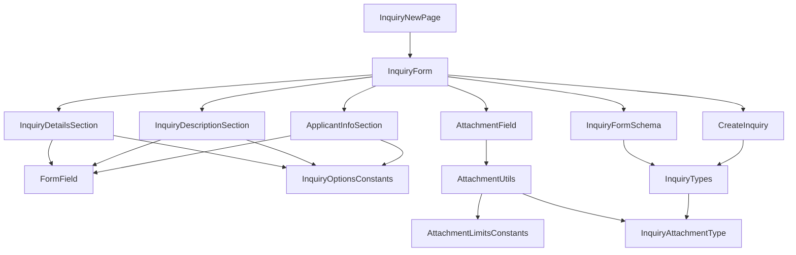
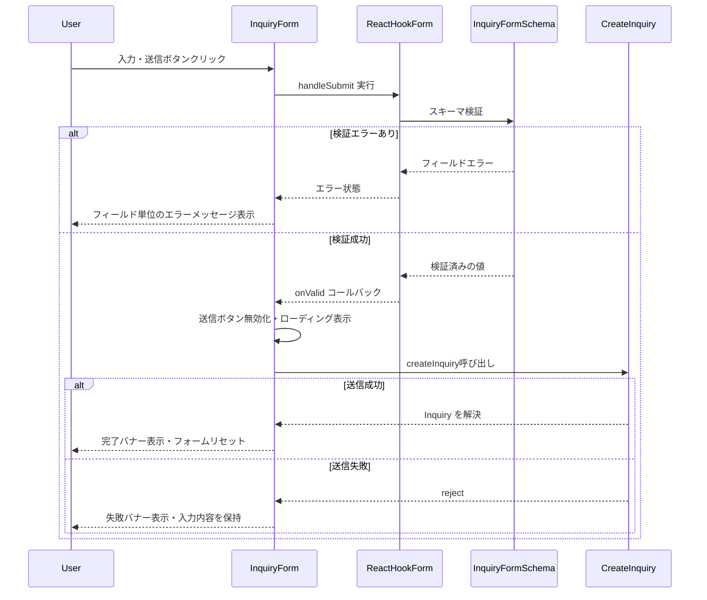
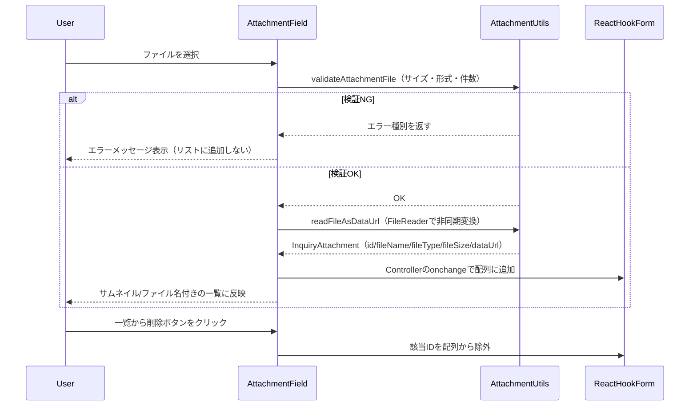
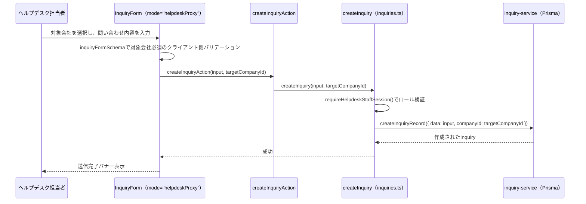

# 技術設計書: inquiry-form

## Overview

**Purpose**: 本機能は、海外販社担当者が問い合わせ・申請を選択式項目（分類・緊急度・地域）と自由記述を組み合わせた統一フォームから送信できる機能を提供する。ヘルプデスク側の受付時分類作業の負担を削減することが目的である。

**Users**: 海外販社（20か国以上）の担当者が、`/inquiry/new` 画面から問い合わせ・申請を送信する際に利用する。

**Impact**: 既存の `/inquiry/new` は `PlaceholderPage` を表示しているのみであり、本設計はそれを実際のフォーム機能に置き換える。`dashboard` 仕様で構築済みの `AppShell`・ナビゲーション・i18n基盤をそのまま利用し、新規に `react-hook-form`・`zod` を導入する。

**Impact（追加ラウンド・2026-07-03）**: 問い合わせ送信フォームに複数ファイルの添付機能を追加する。ブラウザのFile/FileReader APIのみを用い、新規の外部ライブラリ依存は発生しない。`Inquiry`・`CreateInquiryInput`型に`attachments`フィールドを追加し、添付ファイルの型・上限定数・検証ロジック・選択UIコンポーネントは`inquiry-form`が所有する共有モジュールとして実装し、返信側の添付（`helpdesk-inquiry-management`spec）から読み取り専用で再利用できる構造にする。

**Impact（追加ラウンド・2026-07-10）**: `inquiry-list`spec側の課題（一覧行が案件種別のみで中身を区別できない）を受け、問い合わせにタイトル（件名）を追加する。`Inquiry`・`CreateInquiryInput`型に必須の`title: string`フィールドを追加する。本アプリの`Inquiry`データは`backend-db-foundation`基盤導入により既にモックAPIではなくPrisma/Postgresで永続化されているため、`prisma/schema.prisma`へのマイグレーション追加、`lib/server/inquiry-service.ts`（作成時の書き込みマッピング）・`lib/server/inquiry-mapper.ts`（読み取り時のマッピング）・`prisma/seed.ts`（既存シードデータへのタイトル追加）もあわせて変更する。`lib/inquiry-form-mapper.ts`はフォーム値を`...rest`でスプレッドして`CreateInquiryInput`へ変換しているため、この変換ロジック自体の変更は不要。

### Goals
- 分類・緊急度・地域・自由記述・原文言語・申請者情報（会社名・国）を1つの統一フォームで入力・送信できる
- クライアント側でスキーマベースのバリデーションを行い、送信前に入力ミスを検出する
- モックAPIを実APIに差し替えやすい型インターフェースで送信処理を実装する
- 日本語・英語の両言語でフォーム全体が利用できる
- （追加）複数ファイルを選択・プレビュー・削除でき、上限を超える／許可されない形式のファイルを事前に弾ける
- （追加・2026-07-10）1行のタイトル（件名）を必須項目として入力・送信できる

### Non-Goals
- 問い合わせ一覧・詳細表示（別仕様 `inquiry-list` 等で対応）
- 送信データの実際の永続化、ヘルプデスク側の処理・通知
- 自由記述の翻訳処理（Google Cloud Translation API連携、フェーズ3）
- 認証・ログイン機能
- 店舗・地域マスタや国・言語コードの正式なマスタデータ整備（フェーズ1では仮の定数リストを使用）
- （追加）添付ファイルの詳細画面での表示・ダウンロード（`inquiry-list`・`helpdesk-inquiry-management`）、返信時の添付UI自体（`helpdesk-inquiry-management`）、実ファイルストレージ・CDN・ウイルススキャン

## Boundary Commitments

### This Spec Owns
- 問い合わせ・申請フォーム画面（`/inquiry/new`）のUIとクライアント側バリデーション
- `Inquiry` ドメイン型・フォーム入力値の型（`types/inquiry.ts`）
- フォーム入力用の選択肢定数（分類・緊急度・国・原文言語コード）
- モック送信関数 `createInquiry`（`lib/api/inquiries.ts` に追加）の型インターフェースと戻り値
- フォーム関連の翻訳キー（`messages/ja.json` / `en.json` の `inquiryForm` 名前空間）
- 新規UI基盤コンポーネント（Button/Input/Textarea/Label/Select/Alert）の初回追加
- （追加）`InquiryAttachment`型（`types/attachment.ts`）、添付ファイルの上限定数・検証ユーティリティ（`lib/constants/attachment.ts`, `lib/attachment-utils.ts`）、再利用可能な選択・プレビューUI（`components/features/inquiry-form/AttachmentField.tsx`）— これらは`helpdesk-inquiry-management`（返信側）が読み取り専用の依存として再利用する共有モジュールとして設計する
- （追加・2026-07-10）`Inquiry`・`CreateInquiryInput`型への`title: string`フィールド追加、フォームでのタイトル入力UI・バリデーション、`prisma/schema.prisma`の`title`列・`lib/server/inquiry-service.ts`/`lib/server/inquiry-mapper.ts`でのマッピング、`prisma/seed.ts`のシードデータ更新

### Out of Boundary
- 問い合わせ一覧・ステータス確認画面（別仕様）。本仕様は一覧ページへの遷移リンクのみを提供し、一覧画面自体は実装しない
- `InquiryStatusSummary`（ダッシュボードの集計型、`dashboard` 仕様が所有）との統合ロジック
- 送信データのサーバーサイド永続化・実API実装（フェーズ3）
- グローバルレイアウト（Header/Sidebar/AppShell/LanguageSwitcher）の変更。本仕様はこれらを変更せず利用するのみ
- （追加）添付ファイルの詳細画面での表示・ダウンロード（`inquiry-list`・`helpdesk-inquiry-management`が実装）、返信フォームでの`AttachmentField`の実際の利用箇所（`helpdesk-inquiry-management`が実装、本仕様はコンポーネントを提供するのみ）
- （追加・2026-07-10）一覧・詳細画面でのタイトル表示自体（`inquiry-list`spec）、ヘルプデスク側管理画面でのタイトル表示（`helpdesk-inquiry-management`spec、今回は対象外）

### Allowed Dependencies
- `dashboard` 仕様が提供する `AppShell` / ロケールレイアウト（`app/[locale]/layout.tsx`）
- 既存の `next-intl` 設定（`i18n/routing.ts`, `i18n/request.ts`, `middleware.ts`）
- 既存の `lib/utils.ts`（`cn` ヘルパー）、`tailwind.config.ts` のデザイントークン
- 新規導入する `react-hook-form` / `zod` / `@hookform/resolvers`
- （追加）ブラウザ標準のFile API・FileReader API（新規の外部ライブラリ依存なし）
- （追加・2026-07-10）`backend-db-foundation`基盤が導入したPrisma/Postgres連携層（`lib/server/inquiry-service.ts`・`lib/server/inquiry-mapper.ts`・`prisma/schema.prisma`）— 既存のマッピング関数に`title`フィールドを追加する形で利用する

### Revalidation Triggers
- `types/inquiry.ts` の `Inquiry` 型のフィールド形状が変更された場合、`inquiry-list` 等の後続仕様は再確認が必要
- `lib/api/inquiries.ts` の `createInquiry` の入出力契約が変更された場合、フェーズ3の実API設計に影響する
- 分類（`category`）の選択肢がヒアリング結果を受けて変更された場合、`lib/constants/inquiry-options.ts` と翻訳キーの同時更新が必要
- （追加）`InquiryAttachment`型・`lib/constants/attachment.ts`の上限値・`AttachmentField`のprops形状を変更する場合、これらに依存する`helpdesk-inquiry-management`仕様（返信側の添付UI）への影響確認が必要
- （追加・2026-07-10）`Inquiry`型への`title`フィールド追加は、`dashboard`・`inquiry-list`・`helpdesk-inquiry-management`の各仕様が参照する共有データ形状の変更のため、影響範囲の再確認が必要

## Architecture

### Existing Architecture Analysis
- `app/[locale]/layout.tsx` が `AppShell` を全ページ共通で提供しており、本機能はその `children` として `page.tsx` を配置するのみでよい
- `lib/api/` はモック関数を `Promise` で返す規約が確立済み（`getInquiryStatusSummary` 等）。新規関数もこの規約に従う
- UI基盤コンポーネント（`components/ui/`）は shadcn/ui CLIを使わず、`forwardRef` + `cn` ベースで手書きされている（`card.tsx`/`skeleton.tsx`）。本機能で追加するコンポーネントも同じパターンに従う
- 表示文字列は全て `next-intl` の翻訳キー経由という規約が確立済み。選択肢のような「コードと表示の分離」が必要なケースの前例はまだないため、本設計で新たに確立する
- （追加）`FormField`（本spec所有）が`helpdesk-announcements`等の他機能から既に読み取り専用で再利用されている前例に倣い、`AttachmentField`も同様に「翻訳済み文字列をpropsで受け取る」設計にすることで、返信側（`helpdesk-inquiry-management`）から違和感なく再利用できるようにする
- （追加）`lib/api/inquiries.ts`に`"use server"`ディレクティブがなく、`createInquiry`はクライアントバンドルから直接呼び出される素の関数（Server Actionではない）。そのためファイルのデータURL変換・送信は全てクライアント側で完結し、Server Actionのペイロードサイズ制限は本機能には影響しない

### Architecture Pattern & Boundary Map



**Architecture Integration**:
- **Selected pattern**: 単一の Client Component（`InquiryForm`）がフォーム状態（`react-hook-form`）を所有し、セクション単位のプレゼンテーションコンポーネントへ `Control` を渡すコンポジションパターン
- **Domain/feature boundaries**: `types/inquiry.ts`（型）→ `lib/validation/inquiry.ts`（検証ルール）→ `lib/constants/inquiry-options.ts`（選択肢データ）→ `lib/api/inquiries.ts`（送信）→ `components/features/inquiry-form/*`（UI）→ `app/[locale]/inquiry/new/page.tsx`（ルーティング）という一方向の依存関係で責務を分離する
- **Existing patterns preserved**: `AppShell` によるレイアウト共有、`lib/api/` のモック関数規約、`next-intl` 翻訳キー規約
- **New components rationale**: `FormField` は分類・緊急度・地域・自由記述・原文言語・会社名・国の7項目でラベル・必須表示・エラーメッセージ表示を統一するための共有ラッパー。UI基盤コンポーネント（Button/Input/Textarea/Label/Select/Alert）はフォーム実装に不可欠だが現状ゼロのため新規追加。（追加）`AttachmentField`は選択・プレビュー・削除のUIとファイル検証を統括する新規コンポーネントで、`inquiryId`のような文脈に依存しない汎用設計とし、返信側からも同一コンポーネントを再利用できるようにする
- **Steering compliance**: `tech.md` が指定する `react-hook-form` + `zod`、`lib/api/` でのモック抽象化、翻訳キー経由の文字列管理をすべて満たす

### Technology Stack

| Layer | Choice / Version | Role in Feature | Notes |
|-------|------------------|------------------|-------|
| Frontend | Next.js 14.2 (App Router) + React 18 + TypeScript 5 | 既存スタックを継続利用 | 変更なし |
| フォーム状態管理 | `react-hook-form` ^7.60 | フォームの入力値・エラー状態管理 | 新規導入 |
| スキーマ検証 | `zod` ^3.25 + `@hookform/resolvers` ^5.1 | 型と一体化したバリデーションルール定義 | 新規導入。詳細は `research.md` |
| UIコンポーネント | 手書き shadcn/ui 互換コンポーネント（`components/ui/`） | Button/Input/Textarea/Label/Select/Alert | 新規追加。CLIは使わず既存パターンを踏襲 |
| 多言語対応 | next-intl（既存） | フォーム文字列・選択肢ラベルの翻訳 | 既存基盤を拡張（`inquiryForm` 名前空間追加） |
| データ取得 | モック関数（`lib/api/inquiries.ts`） | `createInquiry` 追加 | 既存モックAPI規約を継続 |
| ファイル処理（追加） | ブラウザ標準 File API / FileReader API | 添付ファイルの選択・Base64データURL変換 | 新規の外部ライブラリ依存なし。`research.md`参照 |

## File Structure Plan

### Directory Structure
```
src/
├── types/
│   ├── inquiry.ts                          # Inquiry / CreateInquiryInput 型（attachments フィールドを追加）
│   └── attachment.ts                       # 新規: InquiryAttachment 型（inquiry-list・helpdesk-inquiry-managementが読み取り専用で再利用）
├── lib/
│   ├── validation/
│   │   └── inquiry.ts                      # zodスキーマ + InquiryFormValues 型（attachments を追加）
│   ├── constants/
│   │   ├── inquiry-options.ts              # category/urgency/country/language コード定義
│   │   └── attachment.ts                   # 新規: 添付ファイルの上限（サイズ・件数・許可形式）定数
│   ├── attachment-utils.ts                 # 新規: ファイル検証（サイズ・形式・件数）+ データURL変換ユーティリティ
│   └── api/
│       └── inquiries.ts                    # createInquiry を追加（既存ファイルを拡張）
├── components/
│   ├── ui/
│   │   ├── button.tsx                      # 新規: 送信ボタン等の汎用ボタン
│   │   ├── input.tsx                       # 新規: 単一行テキスト入力
│   │   ├── textarea.tsx                    # 新規: 複数行テキスト入力
│   │   ├── label.tsx                       # 新規: フォームラベル
│   │   ├── select.tsx                      # 新規: 選択式入力（分類・緊急度・国・言語）
│   │   └── alert.tsx                       # 新規: 送信結果フィードバックバナー
│   └── features/
│       └── inquiry-form/
│           ├── InquiryForm.tsx             # フォーム全体の状態・送信処理を所有
│           ├── InquiryDetailsSection.tsx   # 分類・緊急度・地域（3項目, 同一パターンの繰り返し）
│           ├── InquiryDescriptionSection.tsx # 自由記述・原文言語・残り文字数
│           ├── ApplicantInfoSection.tsx    # 会社名・国
│           ├── AttachmentField.tsx         # 新規: 添付ファイルの選択・プレビュー・削除UI（再利用可能な汎用コンポーネント）
│           └── FormField.tsx               # ラベル・必須表示・エラー表示を統一する共有ラッパー
└── app/[locale]/inquiry/new/page.tsx       # PlaceholderPage呼び出しを InquiryForm呼び出しに変更
messages/ja.json, messages/en.json          # inquiryForm 名前空間（項目ラベル・選択肢・エラー・完了メッセージ、添付ファイル関連ラベルを追加）
```

> `InquiryDetailsSection` 内の分類・緊急度・地域の3フィールドは、いずれも `FormField` + `Select`/`Input` の組み合わせで同一パターンのため、フィールド単位でファイルを分割しない。

### Modified Files
- `src/app/[locale]/inquiry/new/page.tsx` — `PlaceholderPage` の呼び出しを `InquiryForm` の呼び出しに置き換える
- `src/lib/api/inquiries.ts` — `createInquiry(input: CreateInquiryInput): Promise<Inquiry>` を追加
- `messages/ja.json` / `messages/en.json` — `inquiryForm` 名前空間（フィールドラベル・選択肢表示名・エラーメッセージ・完了/失敗メッセージ）を追加
- （追加）`src/types/inquiry.ts` — `Inquiry`・`CreateInquiryInput`に`attachments: InquiryAttachment[]`を追加
- （追加）`src/lib/validation/inquiry.ts` — `inquiryFormSchema`に`attachments`（`InquiryAttachment`配列、`ATTACHMENT_MAX_COUNT`件までの上限を持つ）を追加
- （追加）`messages/ja.json` / `messages/en.json` — `inquiryForm.fields.attachments`名前空間（ラベル・プレースホルダー・削除ボタン・サイズ超過/形式エラー/件数超過エラー）を追加
- （追加・2026-07-10）`prisma/schema.prisma` — `model Inquiry`に`title String`列を追加するマイグレーションを作成・適用する
- （追加・2026-07-10）`src/types/inquiry.ts` — `Inquiry`に`title: string`を追加（`CreateInquiryInput`は`Omit`経由で自動反映）
- （追加・2026-07-10）`src/lib/validation/inquiry.ts` — `TITLE_MAX_LENGTH`定数と`title: z.string().trim().min(1).max(TITLE_MAX_LENGTH)`を`inquiryFormSchema`に追加
- （追加・2026-07-10）`src/components/features/inquiry-form/InquiryDescriptionSection.tsx` — `originalText`欄の直前にタイトル入力欄（1行`Input`、`md:col-span-2`）を追加
- （追加・2026-07-10）`messages/ja.json` / `messages/en.json` — `inquiryForm.fields.title.{label,placeholder}`を追加
- （追加・2026-07-10）`src/lib/server/inquiry-service.ts` — `createInquiryRecord`の`prisma.inquiry.create({ data: {...} })`に`title: input.data.title`を追加
- （追加・2026-07-10）`src/lib/server/inquiry-mapper.ts` — `mapInquiry`に`title: record.title`を追加
- （追加・2026-07-10）`prisma/seed.ts` — `seed-inquiry-001`・`ADDITIONAL_INQUIRY_SEEDS`（10件）それぞれに`title`を追加
- （追加・2026-07-10）`src/app/api/inquiries/route.ts` — `POST`ハンドラの`createInquirySchema`（zod）に`title`（`TITLE_MAX_LENGTH`以内の必須文字列）を追加
- （追加・2026-07-13）`src/lib/api/inquiries.ts` — `createInquiry`のセッション取得を`requireApplicantSession()`固定から、`getSession()`で取得したロールに応じた分岐（`applicant`→既存動作、`helpdesk`→`companyId`引数必須）に変更
- （追加・2026-07-13）`src/types/inquiry.ts` — `CreateInquiryInput`は変更しない（`companyId`は`createInquiry`の別引数として渡すため、型自体への追加は不要）
- （追加・2026-07-13）`src/components/features/inquiry-form/InquiryForm.tsx` — 新規propの`mode?: "self" | "helpdeskProxy"`（既定値`"self"`）と`companies?: { id: string; name: string; country: string }[]`を追加し、`mode === "helpdeskProxy"`のときのみ会社選択欄を表示
- （追加・2026-07-13）`src/components/features/inquiry-form/ApplicantInfoSection.tsx` — `mode`/`companies`propを受け取り、`helpdeskProxy`のときのみ既存の会社名・国欄の下に対象会社`Select`（新規コンポーネント`ProxyCompanySelect`、または本コンポーネント内にインライン実装）を追加表示
- （追加・2026-07-13）`src/lib/validation/inquiry.ts` — `inquiryFormSchema`に、`mode`に応じて`targetCompanyId`（`helpdeskProxy`時のみ必須）を検証する条件分岐（`z.discriminatedUnion`または`.superRefine`）を追加
- （追加・2026-07-13）`src/lib/inquiry-form-mapper.ts` — `toCreateInquiryInput`は`targetCompanyId`を`CreateInquiryInput`に含めず、`InquiryForm`の送信ハンドラ側で`companyId`として`createInquiry`の別引数に振り分ける
- （追加・2026-07-13）`messages/ja.json` / `messages/en.json` — `inquiryForm.fields.targetCompany.{label,placeholder,validation}`を追加

## System Flows



**Key Decisions**:
- クライアント側検証（zod）を通過するまでAPI呼び出しを行わない（Fail Fast）
- 送信失敗時も入力内容を破棄しない（要件7.3）ため、`InquiryForm` はエラー時に `reset()` を呼ばない



**Key Decisions（追加ラウンド）**:
- 添付ファイルの検証（サイズ・形式・件数）はzodスキーマではなく`AttachmentField`内で選択直後に同期的に行う。File自体はzodで直接検証できず、`InquiryAttachment`への変換（非同期）が完了する前にフィードバックを返す必要があるため
- zodスキーマ側は変換後の`InquiryAttachment[]`に対する形状・最大件数の検証のみを担当する（二重の件数チェックになるが、フォーム全体の送信直前バリデーションとしての一貫性を保つため）

## Requirements Traceability

| Requirement | Summary | Components | Interfaces | Flows |
|-------------|---------|------------|------------|-------|
| 1.1–1.4 | 画面構造・アクセス | InquiryNewPage, InquiryForm | - | - |
| 2.1–2.5 | 選択式項目（分類・緊急度・地域） | InquiryDetailsSection, FormField, Select | InquiryOptionsConstants | - |
| 3.1–3.4 | 自由記述・原文言語 | InquiryDescriptionSection, FormField, Textarea, Select | InquiryOptionsConstants | - |
| 4.1–4.3 | 申請者情報 | ApplicantInfoSection, FormField, Input, Select | InquiryOptionsConstants | - |
| 5.1–5.5 | バリデーション | InquiryForm, FormField | InquiryFormSchema | 検証エラーフロー |
| 6.1–6.4 | 送信処理・モックAPI連携 | InquiryForm | CreateInquiry Service Interface | 送信フロー |
| 7.1–7.4 | 送信結果フィードバック | InquiryForm, Alert | - | 送信成功/失敗フロー |
| 8.1–8.3 | 多言語対応 | 全コンポーネント | messages/inquiryForm | - |
| 9.1–9.2 | レスポンシブ | InquiryDetailsSection, InquiryDescriptionSection, ApplicantInfoSection | - | - |
| 10.1–10.9 | 添付ファイルの追加 | AttachmentField, InquiryForm | AttachmentUtils, InquiryAttachmentType | 添付ファイル選択フロー |
| 11.1–11.5 | 問い合わせタイトル（追加） | InquiryDescriptionSection, InquiryForm | InquiryFormSchema, CreateInquiry Service Interface | 送信フロー |
| 12.1–12.9 | ヘルプデスク代理登録対応（追加） | InquiryForm, ProxyCompanySelect | CreateInquiry Service Interface | 代理登録フロー |

## Components and Interfaces

| Component | Domain/Layer | Intent | Req Coverage | Key Dependencies (P0/P1) | Contracts |
|-----------|--------------|--------|---------------|---------------------------|-----------|
| InquiryForm | Feature | フォーム状態・検証・送信を統括 | 1, 5, 6, 7 | InquiryFormSchema (P0), CreateInquiry (P0) | Service, State |
| InquiryDetailsSection | Feature (UI) | 分類・緊急度・地域の入力UI | 2, 9 | FormField (P0), InquiryOptionsConstants (P1) | - |
| InquiryDescriptionSection | Feature (UI) | 自由記述・原文言語の入力UI | 3, 9 | FormField (P0), InquiryOptionsConstants (P1) | - |
| ApplicantInfoSection | Feature (UI) | 会社名・国の入力UI | 4, 9 | FormField (P0), InquiryOptionsConstants (P1) | - |
| FormField | Feature (Shared) | ラベル・必須表示・エラー表示の共通ラッパー | 1.4, 5.2, 5.5 | Label (P1) | - |
| Button / Input / Textarea / Label / Select / Alert | UI Primitive | 汎用UIプリミティブ | 1–7 | - | - |
| AttachmentField | Feature (Shared, 追加) | 添付ファイルの選択・検証・プレビュー・削除UI。`inquiryId`等の文脈非依存で、返信側からも再利用可能 | 10 | AttachmentUtils (P0) | State |

### Feature Layer

#### InquiryForm

| Field | Detail |
|-------|--------|
| Intent | フォーム全体の入力状態・バリデーション・送信処理・結果フィードバックを所有する |
| Requirements | 1.1, 1.2, 5.1, 5.2, 5.3, 5.4, 6.1, 6.2, 6.3, 6.4, 7.1, 7.2, 7.3, 7.4 |

**Responsibilities & Constraints**
- `react-hook-form` の `useForm` を `zodResolver(inquiryFormSchema)` と共に初期化し、`FormProvider` で子セクションへ `control` を供給する
- 送信中は送信ボタンを無効化し、成功時はフォームをリセットし、失敗時は入力値を保持する
- `InquiryFormValues` から `CreateInquiryInput` への変換（`submittedBy` へのネスト化、`status: "new"`・`createdAt` の付与）を行う

**Dependencies**
- Outbound: `InquiryFormSchema`（zod検証） — フォーム値の検証 (P0)
- Outbound: `CreateInquiry`（モックAPI） — 送信処理 (P0)
- Outbound: `InquiryDetailsSection` / `InquiryDescriptionSection` / `ApplicantInfoSection` — 入力UIのレンダリング (P1)

**Contracts**: Service [x] / API [ ] / Event [ ] / Batch [ ] / State [x]

##### Service Interface
```typescript
interface InquiryFormValues {
  category: InquiryCategory;
  urgency: InquiryUrgency;
  storeRegion: string;
  originalText: string;
  originalLanguage: string; // ISO 639-1
  companyName: string;
  country: string; // ISO 3166-1 alpha-2
}

interface InquirySubmissionResult {
  status: "success" | "error";
  inquiry?: Inquiry;
}

function submitInquiryForm(
  values: InquiryFormValues
): Promise<InquirySubmissionResult>;
```
- Preconditions: `values` は `inquiryFormSchema` による検証を通過済みであること
- Postconditions: 成功時は `status: "success"` と生成された `Inquiry` を返す。失敗時は `status: "error"` を返し、例外を再スローしない
- Invariants: 失敗時も呼び出し元の入力状態は変更しない

##### State Management
- State model: `react-hook-form` の内部状態（`values`/`errors`/`isSubmitting`）＋ `InquiryForm` ローカルの送信結果状態（`idle` / `success` / `error`）
- Persistence & consistency: フェーズ1ではクライアントメモリ内のみ。ページ遷移・リロードで状態は破棄される
- Concurrency strategy: 送信中は送信ボタンを無効化し、二重送信を防止する

**Implementation Notes**
- Integration: `submitInquiryForm` 相当の処理は `InquiryForm` 内で `createInquiry` を `try/catch` で呼び出す形で実現する（別関数として物理的に切り出すかは実装時の裁量とする）
- Validation: フィールド単位のエラー表示は `FormField` に委譲し、`InquiryForm` は送信全体の成否のみを管理する
- Risks: `zod` スキーマと `types/inquiry.ts` の型定義が将来ずれるリスク → `InquiryFormValues` は `Pick<Inquiry, ...>` ベースで定義し、型の一体性を保つ

#### InquiryDetailsSection / InquiryDescriptionSection / ApplicantInfoSection

これらは新しい境界（ロジック・外部結合）を持たないプレゼンテーション層のコンポーネントであり、サマリー行の記載で十分とする。

**Implementation Notes**
- Integration: いずれも `react-hook-form` の `control` を props として受け取り、`FormField` + UIプリミティブ（Select/Input/Textarea）を組み合わせて表示する
- Validation: 表示するエラーメッセージは `control` から得られる `formState.errors` を `FormField` 経由で参照する
- Risks: なし（新規の境界を持たないため）

#### FormField

| Field | Detail |
|-------|--------|
| Intent | ラベル・必須インジケーター・エラーメッセージ表示を統一する共有ラッパー |
| Requirements | 1.4, 5.2, 5.5 |

**Responsibilities & Constraints**
- 子要素（Input/Textarea/Select）をラップし、`Label`・必須マーク・エラーメッセージ（翻訳キー経由）を一貫したレイアウトで表示する
- 全セクションコンポーネントから共通利用される `BaseFormFieldProps`（`name`, `labelKey`, `required`, `error`）を定義し、各フィールドはこれを拡張する

**Dependencies**
- Outbound: `Label`（UIプリミティブ） (P1)

**Contracts**: Service [ ] / API [ ] / Event [ ] / Batch [ ] / State [ ]

**Implementation Notes**
- Integration: `BaseFormFieldProps` を拡張し、子要素を `children` として受け取る構成にする
- Validation: エラーメッセージの翻訳キーは呼び出し側（各セクション）が `formState.errors` から解決し、`error` propとして渡す
- Risks: なし

#### AttachmentField（追加）

| Field | Detail |
|-------|--------|
| Intent | 複数ファイルの選択・検証（サイズ・形式・件数）・プレビュー表示・個別削除を統括する、文脈非依存の再利用可能コンポーネント |
| Requirements | 10.1, 10.2, 10.3, 10.4, 10.5, 10.6 |

**Responsibilities & Constraints**
- `value: InquiryAttachment[]` と `onChange: (attachments: InquiryAttachment[]) => void` を受け取る制御コンポーネント（`FormField`と異なり自身が状態変化のトリガーになるため、`react-hook-form`とは`Controller`経由で接続する）
- ファイル選択時に`validateAttachmentFile`でサイズ・形式・件数（既存件数 + 新規選択数が上限を超えないか）を検証し、NGのファイルは`onChange`を呼ばずエラーメッセージ用のローカル状態にのみ反映する
- 検証OKのファイルは`readFileAsDataUrl`で非同期にデータURLへ変換し、完了したものから順に`onChange`で親へ反映する（複数ファイル選択時、1件の変換失敗が他のファイルの反映をブロックしない）
- 画像形式（`image/*`）は`dataUrl`をそのまま``のプレビューに使い、それ以外（PDF等）はファイル名・サイズのみを表示する
- ラベル・プレースホルダー・エラーメッセージは全て翻訳済み文字列をpropsで受け取る（`FormField`と同じ規約。`useTranslations`をコンポーネント内で呼ばない）

**Dependencies**
- Outbound: `validateAttachmentFile` / `readFileAsDataUrl`（`lib/attachment-utils.ts`） — 検証・変換 (P0)
- Outbound: `ATTACHMENT_MAX_FILE_SIZE_BYTES` / `ATTACHMENT_MAX_COUNT` / `ATTACHMENT_ALLOWED_MIME_TYPES`（`lib/constants/attachment.ts`） (P0)

**Contracts**: Service [ ] / API [ ] / Event [ ] / Batch [ ] / State [x]

##### State Management
- State model: 選択済み添付ファイル一覧は親（`InquiryForm`）が`react-hook-form`の`Controller`経由で保持する「制御された」状態。検証エラーメッセージ（一時的な選択直後のフィードバック）のみ`AttachmentField`内のローカル状態として保持する
- Persistence & consistency: フェーズ1ではクライアントメモリ内のみ。ページ遷移・リロードで状態は破棄される（Blob URLではなくデータURLを使うため、同一セッション内でのページ遷移には影響されない）

**Implementation Notes**
- Integration: `InquiryForm`から`<Controller name="attachments" control={control} render={({field}) => <AttachmentField value={field.value} onChange={field.onChange} ... />} />`の形で接続する
- Validation: サイズ・形式・件数の判定ロジックは`lib/attachment-utils.ts`に切り出し、`AttachmentField`単体・`validateAttachmentFile`単体の両方でユニットテスト可能にする
- Risks: 大量の大容量ファイルを連続選択した場合のブラウザメモリ使用量は`ATTACHMENT_MAX_COUNT`・`ATTACHMENT_MAX_FILE_SIZE_BYTES`の上限で緩和する（`research.md`参照）

### Data Layer

#### CreateInquiry（モックAPI）

| Field | Detail |
|-------|--------|
| Intent | 問い合わせ・申請データを受け取り、モックの永続化結果として `Inquiry` を返す |
| Requirements | 6.1, 6.2, 6.3, 6.4 |

**Responsibilities & Constraints**
- `lib/api/inquiries.ts` に既存の `getInquiryStatusSummary` と同じファイルへ追加する
- 実APIと同一の型インターフェースを持ち、関数の内部実装のみ差し替えれば実API連携に移行できる

**Dependencies**
- External: なし（フェーズ1はモックデータのみ）

**Contracts**: Service [x] / API [ ] / Event [ ] / Batch [ ] / State [ ]

##### Service Interface
```typescript
function createInquiry(input: CreateInquiryInput): Promise<Inquiry>;
```
- Preconditions: `input` は `CreateInquiryInput` 型を満たす（呼び出し側でzod検証済み）
- Postconditions: 一意な `id` を付与した `Inquiry` を解決する。フェーズ1では常に成功する
- Invariants: `input` の内容を変更せずに `Inquiry` へマッピングする（`id` のみ新規生成）

## Data Models

### Domain Model
- **Inquiry**: 問い合わせ・申請1件を表す集約。`id` を識別子とし、`status` のライフサイクル（`new` → `in_progress` → `resolved`）を持つが、本仕様は `new` 状態の生成のみを担当する（状態遷移は対象外）
- **CreateInquiryInput**: `Inquiry` から `id` と `translatedText`（フェーズ3で付与）を除いたサブセット。フォーム送信時のAPI入力契約
- **InquiryAttachment**（追加）: 添付ファイル1件を表す値オブジェクト。`Inquiry.attachments`として複数保持され、`helpdesk-inquiry-management`spec側でも返信の添付表現として同じ型をそのまま再利用する

### Logical Data Model

| フィールド | 型 | 必須 | 備考 |
|---|---|---|---|
| `id` | `string` | ✓（生成） | `createInquiry` 内で一意な値を生成 |
| `title`（追加・2026-07-10） | `string` | ✓ | 最大100文字。一覧・詳細の見出しとして`inquiry-list`specが表示 |
| `category` | `"defect" \| "order" \| "system" \| "other"` | ✓ | ヒアリング後に選択肢変更の可能性あり（仮値） |
| `urgency` | `"high" \| "medium" \| "low"` | ✓ | |
| `storeRegion` | `string` | ✓ | 自由入力（`research.md` Design Decision参照） |
| `originalText` | `string` | ✓ | 最大文字数あり（要件3.4, 5.3） |
| `originalLanguage` | `string`（ISO 639-1） | ✓ | `lib/constants/inquiry-options.ts` のコード一覧から選択 |
| `translatedText` | `string` | - | フェーズ3まで未使用。本仕様では設定しない |
| `status` | `"new" \| "in_progress" \| "resolved"` | ✓（固定） | 本仕様では常に `"new"` を設定 |
| `createdAt` | `string`（ISO 8601） | ✓（生成） | 送信時にクライアントで生成 |
| `submittedBy.companyName` | `string` | ✓ | |
| `submittedBy.country` | `string`（ISO 3166-1 alpha-2） | ✓ | `lib/constants/inquiry-options.ts` のコード一覧から選択 |
| `attachments`（追加） | `InquiryAttachment[]` | - | 任意項目。0件を許可（要件10.6） |

**InquiryAttachment（追加、`types/attachment.ts`）**

| フィールド | 型 | 必須 | 備考 |
|---|---|---|---|
| `id` | `string` | ✓（生成） | `crypto.randomUUID()`でクライアント生成 |
| `fileName` | `string` | ✓ | 元のファイル名 |
| `fileType` | `string` | ✓ | MIMEタイプ（`ATTACHMENT_ALLOWED_MIME_TYPES`のいずれか） |
| `fileSize` | `number` | ✓ | バイト数。`ATTACHMENT_MAX_FILE_SIZE_BYTES`以下 |
| `dataUrl` | `string` | ✓ | `FileReader.readAsDataURL`で生成したBase64データURL文字列 |

### Data Contracts & Integration

**フォーム → API 変換**
- `InquiryFormValues`（フラットな7フィールド、追加で`attachments`）を `CreateInquiryInput`（`submittedBy` にネストした構造 + `status`/`createdAt` 付与）へ `InquiryForm` 内で変換する
- 変換ロジックは `types/inquiry.ts` に定義した型のみに依存し、UIコンポーネントには依存しない
- （追加）`attachments`は`InquiryFormValues`と`CreateInquiryInput`の両方で同一の`InquiryAttachment[]`形状のまま変換不要で引き継がれる

## Error Handling

### Error Strategy
- **フィールドレベル**: `zod` スキーマによる同期検証。`FormField` がエラーメッセージを翻訳キー経由で表示する
- **送信レベル**: `createInquiry` の呼び出しを `try/catch` で囲み、失敗時は入力内容を保持したまま失敗バナーを表示する（要件7.3）

### Error Categories and Responses
- **User Errors**: 必須項目未入力・文字数超過 → フィールド単位のインラインエラー（要件5.2, 5.3）
- **System Errors**: `createInquiry` の reject（フェーズ1では発生しないが、実API移行後の想定として型上サポート） → 送信失敗バナー、フォーム内容は保持
- **User Errors（追加）**: 添付ファイルのサイズ超過・許可されない形式・件数超過 → `AttachmentField`内でファイル単位のエラーメッセージを表示し、当該ファイルのみ一覧に追加しない（他の正常なファイルの選択は妨げない）
- **User Errors（追加）**: `FileReader`での読み取り自体が失敗した場合（破損ファイル等） → 当該ファイルのみエラー表示とし、他の選択済みファイルの状態は変更しない

### Monitoring
- フェーズ1ではモックAPIのためサーバーサイド監視は対象外。ブラウザコンソールへのエラーログ出力のみで十分とする

## Testing Strategy

- **Unit Tests**: `inquiryFormSchema` の必須項目検証・文字数上限検証（正常値/異常値）、`InquiryFormValues` → `CreateInquiryInput` の変換ロジック
- **Integration Tests**: `InquiryForm` の送信フロー（`createInquiry` をモック化した成功/失敗パターン）、バリデーションエラー表示から修正後の再送信までの一連の流れ
- **E2E/UI Tests**: `/inquiry/new` へのナビゲーション遷移、全項目入力から送信完了バナー表示までのハッピーパス、必須項目未入力時のエラー表示、日英切り替え後のラベル表示切り替え
- （追加）**Unit Tests**: `validateAttachmentFile`（サイズ超過・形式不許可・件数超過それぞれのケース）、`readFileAsDataUrl`（正常系）
- （追加）**Integration Tests**: `AttachmentField`でのファイル選択→プレビュー表示→削除の一連の操作、上限超過時にエラー表示され一覧に追加されないこと、`InquiryForm`全体で選択した添付ファイルが送信データ（`createInquiry`への引数）に含まれること
- （追加）**E2E/UI Tests**: 画像ファイル選択時のサムネイル表示、PDF等非画像ファイル選択時のファイル名表示、複数ファイルの同時選択、上限超過時のエラーメッセージ表示（ja/en）
- （追加・2026-07-10）**Unit Tests**: `inquiryFormSchema`のタイトル必須検証・最大文字数検証、`mapInquiry`/`createInquiryRecord`が`title`を正しく読み書きすること
- （追加・2026-07-10）**Integration Tests**: タイトル未入力時のエラー表示、`InquiryForm`の送信データに`title`が含まれること
- （追加・2026-07-10）**E2E/UI Tests**: `/inquiry/new`でタイトルを入力して送信し、一覧・詳細（`inquiry-list`spec側画面）でそのタイトルが表示されること（ja/en）
- （追加・2026-07-13）**Unit Tests**: `createInquiry`が申請者セッション時に既存動作を維持すること、ヘルプデスクセッション+`companyId`のときに指定会社へ紐付けて作成すること、いずれの条件も満たさないときに`UnauthorizedSessionError`を送出すること
- （追加・2026-07-13）**Integration Tests**: `InquiryForm`が`mode="helpdeskProxy"`のときのみ会社選択欄を表示すること、未選択のまま送信をブロックすること、選択済み会社の`id`が`createInquiry`の`companyId`引数として渡ること
- （追加・2026-07-13）**E2E/UI Tests**: `mode="self"`（既存の`/inquiry/new`）で会社選択欄が表示されないこと（既存挙動に回帰がないことの確認）

## Security Considerations
- フォーム入力値はフェーズ1ではクライアント内メモリとモック関数間でのみ扱われ、外部送信・永続化は行わない。XSS対策として、自由記述欄の表示（将来の一覧画面等）ではReactの標準エスケープに依拠し、`dangerouslySetInnerHTML` を使用しない
- （追加）添付ファイルはクライアント側でMIMEタイプ・拡張子を検証してから受け入れるが、これはUX向上のためのフロントエンド検証であり、なりすまされたMIMEタイプに対する防御ではない（フェーズ3で実ファイルストレージに移行する際は、サーバーサイドでの再検証・ウイルススキャンが必須になる旨を明記する）
- （追加）データURL文字列は``（画像プレビュー）以外の文脈で描画しない。ダウンロードリンクとして扱う場合も`<a href>`のみとし、`dangerouslySetInnerHTML`等でHTMLとして解釈させない
- （追加）ファイルサイズ・件数の上限（`lib/constants/attachment.ts`）は、悪意のある入力というよりも大容量データURLによるブラウザメモリ枯渇を防ぐ目的で設ける
- （追加・2026-07-13）`createInquiry`のヘルプデスク経路は`requireHelpdeskStaffSession()`によるサーバー側のロール検証を必須とし、クライアントから渡される`mode`propの値自体をセキュリティ境界として信用しない（`mode`はUI表示の切り替えのみに使い、実際のアクセス制御は常にサーバー側セッション検証で行う）。対象会社IDはサーバー側で`Company`テーブルに存在するIDであることを暗黙にPrismaの外部キー制約に委ねる（存在しないIDはINSERT時に制約違反エラーとなる）

## 追加ラウンド（2026-07-13）: ヘルプデスク代理登録対応

### 対象ファイル
- `src/lib/api/inquiries.ts`（変更: `createInquiry`のセッション分岐）
- `src/components/features/inquiry-form/InquiryForm.tsx`（変更: `mode`/`companies`prop追加）
- `src/components/features/inquiry-form/ApplicantInfoSection.tsx`（変更: 対象会社選択欄の追加表示）
- `src/lib/validation/inquiry.ts`（変更: `mode`に応じた条件付きバリデーション）
- `messages/ja.json` / `messages/en.json`（変更: 対象会社選択欄の翻訳キー追加）

### `createInquiry`のセッション分岐（Requirement 12.1〜12.4）
現在の実装は`const { claims } = await requireApplicantSession();`で無条件に申請者セッションを要求している。これを次のように分岐させる。

```typescript
export async function createInquiry(
  input: CreateInquiryInput,
  proxyCompanyId?: string
): Promise<Inquiry> {
  const session = await getSession();

  if (session?.claims?.role === "applicant") {
    return createInquiryRecord({ data: input, companyId: session.claims.companyId });
  }

  if (session?.claims?.role === "helpdesk" && proxyCompanyId) {
    await requireHelpdeskStaffSession();
    return createInquiryRecord({ data: input, companyId: proxyCompanyId });
  }

  throw new UnauthorizedSessionError("Applicant session, or helpdesk session with a target company, is required");
}
```

`proxyCompanyId`は第2引数（オプショナル）とし、既存の申請者向け呼び出し（`createInquiry(input)`）はシグネチャ変更なしに動作する。

### 対象会社選択欄（Requirement 12.5〜12.9）
`InquiryForm`が新規propを受け取り、`mode === "helpdeskProxy"`のときのみ`ApplicantInfoSection`内に会社選択`Select`を表示する。既存の会社名・国（自由記述、要件4）はそのまま維持し、対象会社選択欄はその下に追加する形とする。

```typescript
type InquiryFormProps = {
  mode?: "self" | "helpdeskProxy"; // 既定値 "self"
  companies?: { id: string; name: string; country: string }[]; // helpdeskProxy時のみ使用。helpdesk-inquiry-management spec側で取得し渡す
};
```

送信ハンドラは、`mode === "helpdeskProxy"`のとき選択された会社の`id`を`createInquiry`の第2引数として渡す。`mode === "self"`（既定）のときは第2引数を渡さず、既存の申請者フローを変更しない。

### 代理登録フロー（System Flow）



## Supporting References
- 選択肢コード（`category`/`urgency`/国/言語）の暫定リストと出典は `research.md` の Design Decisions を参照
- 添付ファイルのデータURL方式選定・上限値・共有モジュール設計の根拠は `research.md` の「追加ラウンド（2026-07-03）」を参照
