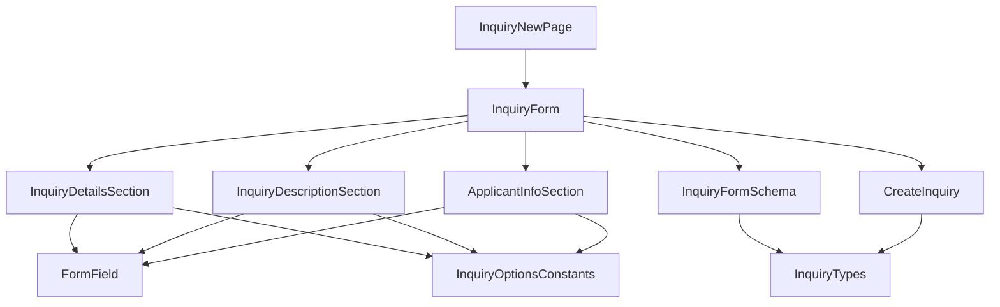
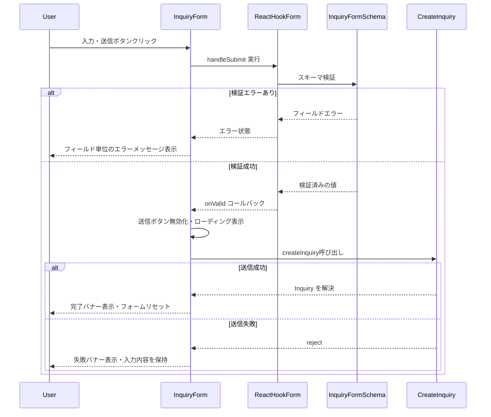

# 技術設計書: inquiry-form

## Overview

**Purpose**: 本機能は、海外販社担当者が問い合わせ・申請を選択式項目（分類・緊急度・地域）と自由記述を組み合わせた統一フォームから送信できる機能を提供する。ヘルプデスク側の受付時分類作業の負担を削減することが目的である。

**Users**: 海外販社（20か国以上）の担当者が、`/inquiry/new` 画面から問い合わせ・申請を送信する際に利用する。

**Impact**: 既存の `/inquiry/new` は `PlaceholderPage` を表示しているのみであり、本設計はそれを実際のフォーム機能に置き換える。`dashboard` 仕様で構築済みの `AppShell`・ナビゲーション・i18n基盤をそのまま利用し、新規に `react-hook-form`・`zod` を導入する。

### Goals
- 分類・緊急度・地域・自由記述・原文言語・申請者情報（会社名・国）を1つの統一フォームで入力・送信できる
- クライアント側でスキーマベースのバリデーションを行い、送信前に入力ミスを検出する
- モックAPIを実APIに差し替えやすい型インターフェースで送信処理を実装する
- 日本語・英語の両言語でフォーム全体が利用できる

### Non-Goals
- 問い合わせ一覧・詳細表示（別仕様 `inquiry-list` 等で対応）
- 送信データの実際の永続化、ヘルプデスク側の処理・通知
- 自由記述の翻訳処理（Google Cloud Translation API連携、フェーズ3）
- 認証・ログイン機能
- 店舗・地域マスタや国・言語コードの正式なマスタデータ整備（フェーズ1では仮の定数リストを使用）

## Boundary Commitments

### This Spec Owns
- 問い合わせ・申請フォーム画面（`/inquiry/new`）のUIとクライアント側バリデーション
- `Inquiry` ドメイン型・フォーム入力値の型（`types/inquiry.ts`）
- フォーム入力用の選択肢定数（分類・緊急度・国・原文言語コード）
- モック送信関数 `createInquiry`（`lib/api/inquiries.ts` に追加）の型インターフェースと戻り値
- フォーム関連の翻訳キー（`messages/ja.json` / `en.json` の `inquiryForm` 名前空間）
- 新規UI基盤コンポーネント（Button/Input/Textarea/Label/Select/Alert）の初回追加

### Out of Boundary
- 問い合わせ一覧・ステータス確認画面（別仕様）。本仕様は一覧ページへの遷移リンクのみを提供し、一覧画面自体は実装しない
- `InquiryStatusSummary`（ダッシュボードの集計型、`dashboard` 仕様が所有）との統合ロジック
- 送信データのサーバーサイド永続化・実API実装（フェーズ3）
- グローバルレイアウト（Header/Sidebar/AppShell/LanguageSwitcher）の変更。本仕様はこれらを変更せず利用するのみ

### Allowed Dependencies
- `dashboard` 仕様が提供する `AppShell` / ロケールレイアウト（`app/[locale]/layout.tsx`）
- 既存の `next-intl` 設定（`i18n/routing.ts`, `i18n/request.ts`, `middleware.ts`）
- 既存の `lib/utils.ts`（`cn` ヘルパー）、`tailwind.config.ts` のデザイントークン
- 新規導入する `react-hook-form` / `zod` / `@hookform/resolvers`

### Revalidation Triggers
- `types/inquiry.ts` の `Inquiry` 型のフィールド形状が変更された場合、`inquiry-list` 等の後続仕様は再確認が必要
- `lib/api/inquiries.ts` の `createInquiry` の入出力契約が変更された場合、フェーズ3の実API設計に影響する
- 分類（`category`）の選択肢がヒアリング結果を受けて変更された場合、`lib/constants/inquiry-options.ts` と翻訳キーの同時更新が必要

## Architecture

### Existing Architecture Analysis
- `app/[locale]/layout.tsx` が `AppShell` を全ページ共通で提供しており、本機能はその `children` として `page.tsx` を配置するのみでよい
- `lib/api/` はモック関数を `Promise` で返す規約が確立済み（`getInquiryStatusSummary` 等）。新規関数もこの規約に従う
- UI基盤コンポーネント（`components/ui/`）は shadcn/ui CLIを使わず、`forwardRef` + `cn` ベースで手書きされている（`card.tsx`/`skeleton.tsx`）。本機能で追加するコンポーネントも同じパターンに従う
- 表示文字列は全て `next-intl` の翻訳キー経由という規約が確立済み。選択肢のような「コードと表示の分離」が必要なケースの前例はまだないため、本設計で新たに確立する

### Architecture Pattern & Boundary Map



**Architecture Integration**:
- **Selected pattern**: 単一の Client Component（`InquiryForm`）がフォーム状態（`react-hook-form`）を所有し、セクション単位のプレゼンテーションコンポーネントへ `Control` を渡すコンポジションパターン
- **Domain/feature boundaries**: `types/inquiry.ts`（型）→ `lib/validation/inquiry.ts`（検証ルール）→ `lib/constants/inquiry-options.ts`（選択肢データ）→ `lib/api/inquiries.ts`（送信）→ `components/features/inquiry-form/*`（UI）→ `app/[locale]/inquiry/new/page.tsx`（ルーティング）という一方向の依存関係で責務を分離する
- **Existing patterns preserved**: `AppShell` によるレイアウト共有、`lib/api/` のモック関数規約、`next-intl` 翻訳キー規約
- **New components rationale**: `FormField` は分類・緊急度・地域・自由記述・原文言語・会社名・国の7項目でラベル・必須表示・エラーメッセージ表示を統一するための共有ラッパー。UI基盤コンポーネント（Button/Input/Textarea/Label/Select/Alert）はフォーム実装に不可欠だが現状ゼロのため新規追加
- **Steering compliance**: `tech.md` が指定する `react-hook-form` + `zod`、`lib/api/` でのモック抽象化、翻訳キー経由の文字列管理をすべて満たす

### Technology Stack

| Layer | Choice / Version | Role in Feature | Notes |
|-------|------------------|------------------|-------|
| Frontend | Next.js 14.2 (App Router) + React 18 + TypeScript 5 | 既存スタックを継続利用 | 変更なし |
| フォーム状態管理 | `react-hook-form` ^7.60 | フォームの入力値・エラー状態管理 | 新規導入 |
| スキーマ検証 | `zod` ^3.25 + `@hookform/resolvers` ^5.1 | 型と一体化したバリデーションルール定義 | 新規導入。詳細は `research.md` |
| UIコンポーネント | 手書き shadcn/ui 互換コンポーネント（`components/ui/`） | Button/Input/Textarea/Label/Select/Alert | 新規追加。CLIは使わず既存パターンを踏襲 |
| 多言語対応 | next-intl（既存） | フォーム文字列・選択肢ラベルの翻訳 | 既存基盤を拡張（`inquiryForm` 名前空間追加） |
| データ取得 | モック関数（`lib/api/inquiries.ts`） | `createInquiry` 追加 | 既存モックAPI規約を継続 |

## File Structure Plan

### Directory Structure
```
src/
├── types/
│   └── inquiry.ts                          # Inquiry / CreateInquiryInput 型
├── lib/
│   ├── validation/
│   │   └── inquiry.ts                      # zodスキーマ + InquiryFormValues 型
│   ├── constants/
│   │   └── inquiry-options.ts              # category/urgency/country/language コード定義
│   └── api/
│       └── inquiries.ts                    # createInquiry を追加（既存ファイルを拡張）
├── components/
│   ├── ui/
│   │   ├── button.tsx                      # 新規: 送信ボタン等の汎用ボタン
│   │   ├── input.tsx                       # 新規: 単一行テキスト入力
│   │   ├── textarea.tsx                    # 新規: 複数行テキスト入力
│   │   ├── label.tsx                       # 新規: フォームラベル
│   │   ├── select.tsx                      # 新規: 選択式入力（分類・緊急度・国・言語）
│   │   └── alert.tsx                       # 新規: 送信結果フィードバックバナー
│   └── features/
│       └── inquiry-form/
│           ├── InquiryForm.tsx             # フォーム全体の状態・送信処理を所有
│           ├── InquiryDetailsSection.tsx   # 分類・緊急度・地域（3項目, 同一パターンの繰り返し）
│           ├── InquiryDescriptionSection.tsx # 自由記述・原文言語・残り文字数
│           ├── ApplicantInfoSection.tsx    # 会社名・国
│           └── FormField.tsx               # ラベル・必須表示・エラー表示を統一する共有ラッパー
└── app/[locale]/inquiry/new/page.tsx       # PlaceholderPage呼び出しを InquiryForm呼び出しに変更
messages/ja.json, messages/en.json          # inquiryForm 名前空間（項目ラベル・選択肢・エラー・完了メッセージ）を追加
```

> `InquiryDetailsSection` 内の分類・緊急度・地域の3フィールドは、いずれも `FormField` + `Select`/`Input` の組み合わせで同一パターンのため、フィールド単位でファイルを分割しない。

### Modified Files
- `src/app/[locale]/inquiry/new/page.tsx` — `PlaceholderPage` の呼び出しを `InquiryForm` の呼び出しに置き換える
- `src/lib/api/inquiries.ts` — `createInquiry(input: CreateInquiryInput): Promise<Inquiry>` を追加
- `messages/ja.json` / `messages/en.json` — `inquiryForm` 名前空間（フィールドラベル・選択肢表示名・エラーメッセージ・完了/失敗メッセージ）を追加

## System Flows



**Key Decisions**:
- クライアント側検証（zod）を通過するまでAPI呼び出しを行わない（Fail Fast）
- 送信失敗時も入力内容を破棄しない（要件7.3）ため、`InquiryForm` はエラー時に `reset()` を呼ばない

## Requirements Traceability

| Requirement | Summary | Components | Interfaces | Flows |
|-------------|---------|------------|------------|-------|
| 1.1–1.4 | 画面構造・アクセス | InquiryNewPage, InquiryForm | - | - |
| 2.1–2.5 | 選択式項目（分類・緊急度・地域） | InquiryDetailsSection, FormField, Select | InquiryOptionsConstants | - |
| 3.1–3.4 | 自由記述・原文言語 | InquiryDescriptionSection, FormField, Textarea, Select | InquiryOptionsConstants | - |
| 4.1–4.3 | 申請者情報 | ApplicantInfoSection, FormField, Input, Select | InquiryOptionsConstants | - |
| 5.1–5.5 | バリデーション | InquiryForm, FormField | InquiryFormSchema | 検証エラーフロー |
| 6.1–6.4 | 送信処理・モックAPI連携 | InquiryForm | CreateInquiry Service Interface | 送信フロー |
| 7.1–7.4 | 送信結果フィードバック | InquiryForm, Alert | - | 送信成功/失敗フロー |
| 8.1–8.3 | 多言語対応 | 全コンポーネント | messages/inquiryForm | - |
| 9.1–9.2 | レスポンシブ | InquiryDetailsSection, InquiryDescriptionSection, ApplicantInfoSection | - | - |

## Components and Interfaces

| Component | Domain/Layer | Intent | Req Coverage | Key Dependencies (P0/P1) | Contracts |
|-----------|--------------|--------|---------------|---------------------------|-----------|
| InquiryForm | Feature | フォーム状態・検証・送信を統括 | 1, 5, 6, 7 | InquiryFormSchema (P0), CreateInquiry (P0) | Service, State |
| InquiryDetailsSection | Feature (UI) | 分類・緊急度・地域の入力UI | 2, 9 | FormField (P0), InquiryOptionsConstants (P1) | - |
| InquiryDescriptionSection | Feature (UI) | 自由記述・原文言語の入力UI | 3, 9 | FormField (P0), InquiryOptionsConstants (P1) | - |
| ApplicantInfoSection | Feature (UI) | 会社名・国の入力UI | 4, 9 | FormField (P0), InquiryOptionsConstants (P1) | - |
| FormField | Feature (Shared) | ラベル・必須表示・エラー表示の共通ラッパー | 1.4, 5.2, 5.5 | Label (P1) | - |
| Button / Input / Textarea / Label / Select / Alert | UI Primitive | 汎用UIプリミティブ | 1–7 | - | - |

### Feature Layer

#### InquiryForm

| Field | Detail |
|-------|--------|
| Intent | フォーム全体の入力状態・バリデーション・送信処理・結果フィードバックを所有する |
| Requirements | 1.1, 1.2, 5.1, 5.2, 5.3, 5.4, 6.1, 6.2, 6.3, 6.4, 7.1, 7.2, 7.3, 7.4 |

**Responsibilities & Constraints**
- `react-hook-form` の `useForm` を `zodResolver(inquiryFormSchema)` と共に初期化し、`FormProvider` で子セクションへ `control` を供給する
- 送信中は送信ボタンを無効化し、成功時はフォームをリセットし、失敗時は入力値を保持する
- `InquiryFormValues` から `CreateInquiryInput` への変換（`submittedBy` へのネスト化、`status: "new"`・`createdAt` の付与）を行う

**Dependencies**
- Outbound: `InquiryFormSchema`（zod検証） — フォーム値の検証 (P0)
- Outbound: `CreateInquiry`（モックAPI） — 送信処理 (P0)
- Outbound: `InquiryDetailsSection` / `InquiryDescriptionSection` / `ApplicantInfoSection` — 入力UIのレンダリング (P1)

**Contracts**: Service [x] / API [ ] / Event [ ] / Batch [ ] / State [x]

##### Service Interface
```typescript
interface InquiryFormValues {
  category: InquiryCategory;
  urgency: InquiryUrgency;
  storeRegion: string;
  originalText: string;
  originalLanguage: string; // ISO 639-1
  companyName: string;
  country: string; // ISO 3166-1 alpha-2
}

interface InquirySubmissionResult {
  status: "success" | "error";
  inquiry?: Inquiry;
}

function submitInquiryForm(
  values: InquiryFormValues
): Promise<InquirySubmissionResult>;
```
- Preconditions: `values` は `inquiryFormSchema` による検証を通過済みであること
- Postconditions: 成功時は `status: "success"` と生成された `Inquiry` を返す。失敗時は `status: "error"` を返し、例外を再スローしない
- Invariants: 失敗時も呼び出し元の入力状態は変更しない

##### State Management
- State model: `react-hook-form` の内部状態（`values`/`errors`/`isSubmitting`）＋ `InquiryForm` ローカルの送信結果状態（`idle` / `success` / `error`）
- Persistence & consistency: フェーズ1ではクライアントメモリ内のみ。ページ遷移・リロードで状態は破棄される
- Concurrency strategy: 送信中は送信ボタンを無効化し、二重送信を防止する

**Implementation Notes**
- Integration: `submitInquiryForm` 相当の処理は `InquiryForm` 内で `createInquiry` を `try/catch` で呼び出す形で実現する（別関数として物理的に切り出すかは実装時の裁量とする）
- Validation: フィールド単位のエラー表示は `FormField` に委譲し、`InquiryForm` は送信全体の成否のみを管理する
- Risks: `zod` スキーマと `types/inquiry.ts` の型定義が将来ずれるリスク → `InquiryFormValues` は `Pick<Inquiry, ...>` ベースで定義し、型の一体性を保つ

#### InquiryDetailsSection / InquiryDescriptionSection / ApplicantInfoSection

これらは新しい境界（ロジック・外部結合）を持たないプレゼンテーション層のコンポーネントであり、サマリー行の記載で十分とする。

**Implementation Notes**
- Integration: いずれも `react-hook-form` の `control` を props として受け取り、`FormField` + UIプリミティブ（Select/Input/Textarea）を組み合わせて表示する
- Validation: 表示するエラーメッセージは `control` から得られる `formState.errors` を `FormField` 経由で参照する
- Risks: なし（新規の境界を持たないため）

#### FormField

| Field | Detail |
|-------|--------|
| Intent | ラベル・必須インジケーター・エラーメッセージ表示を統一する共有ラッパー |
| Requirements | 1.4, 5.2, 5.5 |

**Responsibilities & Constraints**
- 子要素（Input/Textarea/Select）をラップし、`Label`・必須マーク・エラーメッセージ（翻訳キー経由）を一貫したレイアウトで表示する
- 全セクションコンポーネントから共通利用される `BaseFormFieldProps`（`name`, `labelKey`, `required`, `error`）を定義し、各フィールドはこれを拡張する

**Dependencies**
- Outbound: `Label`（UIプリミティブ） (P1)

**Contracts**: Service [ ] / API [ ] / Event [ ] / Batch [ ] / State [ ]

**Implementation Notes**
- Integration: `BaseFormFieldProps` を拡張し、子要素を `children` として受け取る構成にする
- Validation: エラーメッセージの翻訳キーは呼び出し側（各セクション）が `formState.errors` から解決し、`error` propとして渡す
- Risks: なし

### Data Layer

#### CreateInquiry（モックAPI）

| Field | Detail |
|-------|--------|
| Intent | 問い合わせ・申請データを受け取り、モックの永続化結果として `Inquiry` を返す |
| Requirements | 6.1, 6.2, 6.3, 6.4 |

**Responsibilities & Constraints**
- `lib/api/inquiries.ts` に既存の `getInquiryStatusSummary` と同じファイルへ追加する
- 実APIと同一の型インターフェースを持ち、関数の内部実装のみ差し替えれば実API連携に移行できる

**Dependencies**
- External: なし（フェーズ1はモックデータのみ）

**Contracts**: Service [x] / API [ ] / Event [ ] / Batch [ ] / State [ ]

##### Service Interface
```typescript
function createInquiry(input: CreateInquiryInput): Promise<Inquiry>;
```
- Preconditions: `input` は `CreateInquiryInput` 型を満たす（呼び出し側でzod検証済み）
- Postconditions: 一意な `id` を付与した `Inquiry` を解決する。フェーズ1では常に成功する
- Invariants: `input` の内容を変更せずに `Inquiry` へマッピングする（`id` のみ新規生成）

## Data Models

### Domain Model
- **Inquiry**: 問い合わせ・申請1件を表す集約。`id` を識別子とし、`status` のライフサイクル（`new` → `in_progress` → `resolved`）を持つが、本仕様は `new` 状態の生成のみを担当する（状態遷移は対象外）
- **CreateInquiryInput**: `Inquiry` から `id` と `translatedText`（フェーズ3で付与）を除いたサブセット。フォーム送信時のAPI入力契約

### Logical Data Model

| フィールド | 型 | 必須 | 備考 |
|---|---|---|---|
| `id` | `string` | ✓（生成） | `createInquiry` 内で一意な値を生成 |
| `category` | `"defect" \| "order" \| "system" \| "other"` | ✓ | ヒアリング後に選択肢変更の可能性あり（仮値） |
| `urgency` | `"high" \| "medium" \| "low"` | ✓ | |
| `storeRegion` | `string` | ✓ | 自由入力（`research.md` Design Decision参照） |
| `originalText` | `string` | ✓ | 最大文字数あり（要件3.4, 5.3） |
| `originalLanguage` | `string`（ISO 639-1） | ✓ | `lib/constants/inquiry-options.ts` のコード一覧から選択 |
| `translatedText` | `string` | - | フェーズ3まで未使用。本仕様では設定しない |
| `status` | `"new" \| "in_progress" \| "resolved"` | ✓（固定） | 本仕様では常に `"new"` を設定 |
| `createdAt` | `string`（ISO 8601） | ✓（生成） | 送信時にクライアントで生成 |
| `submittedBy.companyName` | `string` | ✓ | |
| `submittedBy.country` | `string`（ISO 3166-1 alpha-2） | ✓ | `lib/constants/inquiry-options.ts` のコード一覧から選択 |

### Data Contracts & Integration

**フォーム → API 変換**
- `InquiryFormValues`（フラットな7フィールド）を `CreateInquiryInput`（`submittedBy` にネストした構造 + `status`/`createdAt` 付与）へ `InquiryForm` 内で変換する
- 変換ロジックは `types/inquiry.ts` に定義した型のみに依存し、UIコンポーネントには依存しない

## Error Handling

### Error Strategy
- **フィールドレベル**: `zod` スキーマによる同期検証。`FormField` がエラーメッセージを翻訳キー経由で表示する
- **送信レベル**: `createInquiry` の呼び出しを `try/catch` で囲み、失敗時は入力内容を保持したまま失敗バナーを表示する（要件7.3）

### Error Categories and Responses
- **User Errors**: 必須項目未入力・文字数超過 → フィールド単位のインラインエラー（要件5.2, 5.3）
- **System Errors**: `createInquiry` の reject（フェーズ1では発生しないが、実API移行後の想定として型上サポート） → 送信失敗バナー、フォーム内容は保持

### Monitoring
- フェーズ1ではモックAPIのためサーバーサイド監視は対象外。ブラウザコンソールへのエラーログ出力のみで十分とする

## Testing Strategy

- **Unit Tests**: `inquiryFormSchema` の必須項目検証・文字数上限検証（正常値/異常値）、`InquiryFormValues` → `CreateInquiryInput` の変換ロジック
- **Integration Tests**: `InquiryForm` の送信フロー（`createInquiry` をモック化した成功/失敗パターン）、バリデーションエラー表示から修正後の再送信までの一連の流れ
- **E2E/UI Tests**: `/inquiry/new` へのナビゲーション遷移、全項目入力から送信完了バナー表示までのハッピーパス、必須項目未入力時のエラー表示、日英切り替え後のラベル表示切り替え

## Security Considerations
- フォーム入力値はフェーズ1ではクライアント内メモリとモック関数間でのみ扱われ、外部送信・永続化は行わない。XSS対策として、自由記述欄の表示（将来の一覧画面等）ではReactの標準エスケープに依拠し、`dangerouslySetInnerHTML` を使用しない

## Supporting References
- 選択肢コード（`category`/`urgency`/国/言語）の暫定リストと出典は `research.md` の Design Decisions を参照
