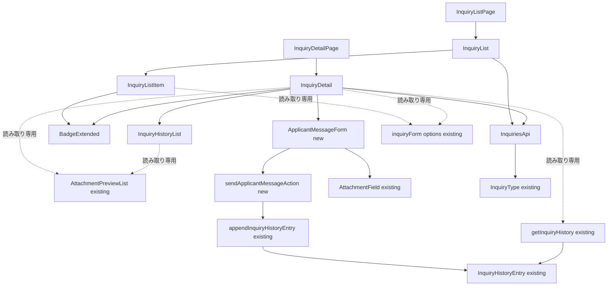
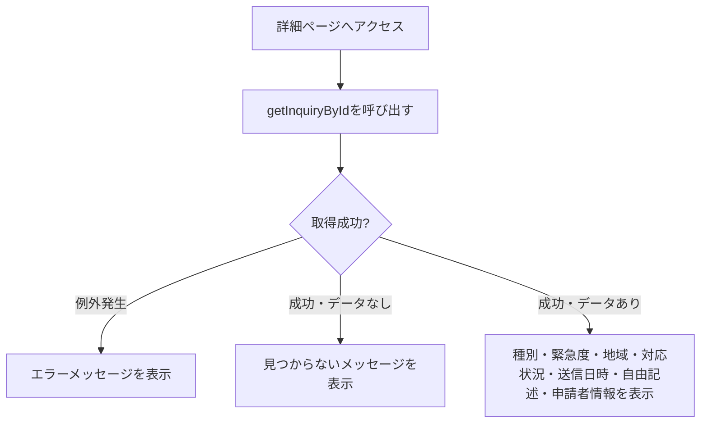
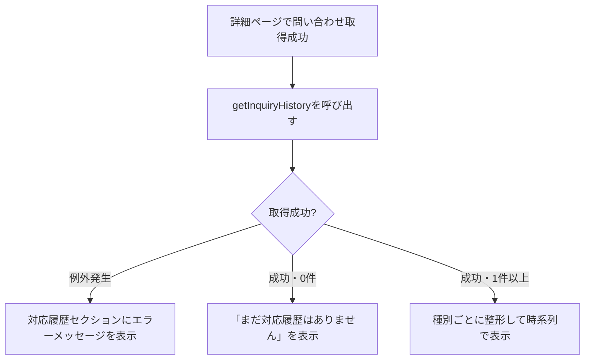
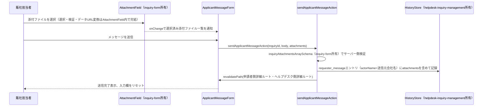

# 技術設計書: inquiry-list

## Overview

**Purpose**: 本機能は、海外販社担当者が自社の問い合わせ・申請の一覧（`/inquiry`）と対応状況を確認し、個々の詳細（`/inquiry/[id]`）を参照できる画面を提供する。

**Users**: 海外販社の担当者が、サイドバーの「問い合わせ一覧」ナビゲーションから遷移し、自社が送信した問い合わせの対応状況を確認する際に利用する。

**Impact**: 既存の`/inquiry`は`PlaceholderPage`を表示しているのみであり、本設計はそれを実際の一覧表示に置き換える。加えて`/inquiry/[id]`の動的ルートを新規追加する。`inquiry-form`仕様が所有する`Inquiry`型・`CreateInquiryInput`型・`createInquiry`関数・`getInquiryStatusSummary`関数は変更しない。`createInquiry`が送信データを永続化していないため、本仕様は一覧表示用の静的モックデータを新規に用意する。

**Impact（追加ラウンド・2026-07-03）**: `helpdesk-inquiry-management`spec実装により、ヘルプデスク側で記録される対応履歴（`InquiryHistoryEntry`）・対応中フラグ（`Inquiry.claim`）が存在するようになったが、`/inquiry/[id]`（本specの詳細画面）はこれらを一切表示していなかった。本ラウンドでは、既存の`InquiryDetail`に対応履歴セクションと対応中バッジを追加し、これらのデータを読み取り専用で表示する。`InquiryHistoryEntry`型・`getInquiryHistory`関数・`Inquiry.claim`の記録ロジックは変更しない。

**Impact（追加ラウンド・2026-07-07）**: `inquiry-form`・`helpdesk-inquiry-management`の両specにより、問い合わせ本文（`Inquiry.attachments`）・返信（`InquiryHistoryEntry.attachments`）の両方に添付ファイルを保持できるようになったが、`InquiryDetail`・`InquiryHistoryList`のいずれもこれらを表示していなかった。本ラウンドでは、`helpdesk-inquiry-management`spec実装済みの読み取り専用コンポーネント`AttachmentPreviewList`を両コンポーネントから再利用し、既存のデータモデル・検証ロジックを変更せず表示配線のみを追加する。

**Impact（追加ラウンド・2026-07-07・2）**: 申請元とヘルプデスクが1件の問い合わせの中で何度もメッセージを往復できるようにする機能を新設する。本specはこれまで読み取り専用の画面のみを所有していたが、本ラウンドで初めて「書き込み」操作（Server Action）を持つ。新設する送信フォームは`inquiry-form`spec所有の`AttachmentField`を再利用し、`helpdesk-inquiry-management`spec所有の`appendInquiryHistoryEntry`（既存の公開関数）を呼び出して対応履歴に記録する。`InquiryHistoryEntryType`への新種別（`requester_message`）の追加自体は`helpdesk-inquiry-management`spec側が担当し、本specはその値を使って記録・表示するのみである。

**Impact（追加ラウンド・2026-07-10）**: 一覧行が案件種別のみで中身を区別できないという課題を受け、`inquiry-form`spec側が新設する`Inquiry.title`を一覧・詳細の見出しとして表示し、あわせて自由記述（`originalText`）の2行プレビューを一覧行に表示する。また`InquiryList`の成功・空・エラー3状態すべてで`CardHeader`/`CardTitle`による見出しの重複表示を除去し、`announcements`spec所有の`AnnouncementList`と同じ`Card`+`CardContent className="pt-6"`構成に統一する。`Inquiry.title`フィールド自体・フォーム側の変更は`inquiry-form`spec側の追加要望であり、本specはこれを読み取り専用の依存として表示するのみ。

### Goals
- 自社の問い合わせを送信日時降順で一覧表示し、対応状況・緊急度を視覚的に区別できる
- 一覧項目から詳細画面へ遷移し、自由記述本文を含む詳細情報を確認できる
- `inquiry-form`仕様が所有する型・関数を変更しない
- 日本語・英語の両言語で一覧・詳細画面が利用できる
- （追加）詳細画面で、ヘルプデスクからの返信内容・対応状況の推移・現在の対応中状態を確認できる
- （追加）詳細画面で、問い合わせ本文・返信の添付ファイルを確認・ダウンロードできる
- （追加）詳細画面で、当該問い合わせへ追加メッセージ（添付ファイルを含む）を送信でき、送信内容が対応履歴に反映される
- （追加・2026-07-10）一覧行から`Inquiry.title`と本文の2行プレビューを確認でき、詳細画面にも`title`が見出しとして表示される。一覧の`Card`表示から重複した見出しが除去され、余白が整理される

### Non-Goals
- ヘルプデスク担当者向けの対応状況の変更・返信・コメント機能
- 他社（自社以外）の問い合わせの参照、認証・ログイン機能
- 問い合わせの検索・絞り込み・並び替えのカスタマイズ
- （追加）新着返信の通知・未読管理、対応履歴の担当者名表示
- （追加）添付ファイルの型・上限定数・検証ロジック・選択UI・アップロード操作（表示のみが対象）
- （追加）`InquiryHistoryEntryType`の型定義自体の変更（`helpdesk-inquiry-management`spec所有）、送信メッセージによる`status`・`claim`の自動変更、新着メッセージの通知・未読管理、送信済みメッセージの編集・削除

## Boundary Commitments

### This Spec Owns
- 問い合わせ一覧ページ（`/inquiry`）・詳細ページ（`/inquiry/[id]`）のUI
- 一覧表示用の静的モックデータ（`Inquiry[]`）と、それを返すモック関数（`getInquiries`・`getInquiryById`）
- 問い合わせ一覧・詳細関連の翻訳キー（`messages/ja.json` / `en.json` の `inquiryList` 名前空間、および対応状況ラベル）
- `components/ui/badge.tsx` への対応状況・緊急度用variantの加法的な追加
- （追加）詳細画面における対応履歴セクション（`InquiryHistoryList`）・対応中バッジの表示、および対応する翻訳キー（`inquiryList.history` / `inquiryList.detail.inProgressBadge` 名前空間）
- （追加）詳細画面・対応履歴セクションにおける添付ファイル表示の組み込み（`AttachmentPreviewList`の呼び出し配線のみ。コンポーネント自体は所有しない）
- （追加・2026-07-07・2）追加メッセージの送信フォーム（`ApplicantMessageForm`）、送信用のServer Action（`sendApplicantMessageAction`）、対応する翻訳キー（`inquiryList.message`名前空間）
- （追加・2026-07-10）`InquiryListItem`・`InquiryDetail`での`Inquiry.title`表示配線、一覧行の本文（`originalText`）プレビュー表示、`InquiryList`の`Card`表示構成（重複見出し除去）

### Out of Boundary
- `Inquiry`型・`CreateInquiryInput`型・`createInquiry`関数・`getInquiryStatusSummary`関数（`inquiry-form`仕様が所有）。本仕様はこれらを一切変更しない
- `inquiryForm`名前空間の翻訳キー（案件種別・緊急度・国の表示ラベルは`inquiry-form`仕様が定義済みのものを読み取り専用で再利用する）
- グローバルレイアウト（Header/Sidebar/AppShell/LanguageSwitcher）の変更
- （追加）`InquiryHistoryEntry`型・`getInquiryHistory`/`appendInquiryHistoryEntry`関数・`Inquiry.claim`フィールドの記録ロジック（`setInquiryClaim`等）、ヘルプデスク側の`HistoryTimeline`・`ClaimToggleButton`（いずれも`helpdesk-inquiry-management`spec所有）。本仕様はこれらを変更せず読み取りのみ行う
- （追加）`InquiryAttachment`型・添付ファイルの上限定数・検証ユーティリティ（`inquiry-form`spec所有）、`AttachmentPreviewList`コンポーネント自体・`AttachmentField`（いずれも`helpdesk-inquiry-management`/`inquiry-form`spec所有）。本仕様はこれらを変更せず読み取り専用で呼び出すのみ行う
- （追加・2026-07-07・2）`InquiryHistoryEntryType`の型定義自体（`helpdesk-inquiry-management`spec所有）、ヘルプデスク側の対応履歴タイムライン表示（`helpdesk-inquiry-management`spec所有）。本仕様は型を変更せず、既存の公開関数（`appendInquiryHistoryEntry`）を呼び出すのみ行う
- （追加・2026-07-10）`Inquiry.title`フィールド自体の追加・フォームでの入力（`inquiry-form`spec所有）、ヘルプデスク側管理画面でのタイトル表示（`helpdesk-inquiry-management`spec所有、今回は対象外）

### Allowed Dependencies
- `dashboard` 仕様が提供する `AppShell` / ロケールレイアウト
- `inquiry-form` 仕様が定義した `Inquiry` 型、および `messages/*.json` の `inquiryForm.options.category` / `inquiryForm.options.urgency` / `inquiryForm.options.country` 翻訳キー（表示ラベルとして読み取り専用で再利用する）
- 既存のUI基盤コンポーネント（`card.tsx`・`badge.tsx`・`skeleton.tsx`）
- 既存の `next-intl` 設定
- （追加）`helpdesk-inquiry-management` 仕様が定義した `InquiryHistoryEntry` 型・`getInquiryHistory` 関数・`Inquiry.claim` フィールド（読み取り専用で利用する）
- （追加）`helpdesk-inquiry-management` 仕様が定義した `AttachmentPreviewList` コンポーネント（`src/components/features/helpdesk-inquiries/AttachmentPreviewList.tsx`、読み取り専用で呼び出す）
- （追加・2026-07-07・2）`helpdesk-inquiry-management` 仕様が定義した `appendInquiryHistoryEntry` 関数（`src/lib/api/inquiry-history.ts`、既存の公開関数を呼び出して追加メッセージを記録する）・`InquiryHistoryEntryType`の`"requester_message"`値（`helpdesk-inquiry-management`spec側で追加予定）
- （追加・2026-07-07・2）`inquiry-form` 仕様が定義した `AttachmentField` コンポーネント・`inquiryAttachmentsArraySchema`（zod、既存export済み、サーバー側検証で再利用する）
- （追加・2026-07-10）`inquiry-form` 仕様が追加する `Inquiry.title` フィールド（読み取り専用で表示する）

### Revalidation Triggers
- `inquiry-form`仕様が`Inquiry`型のフィールド形状や`inquiryForm.options.*`の翻訳キー構造を変更した場合、本仕様の一覧・詳細表示に影響がないか再確認が必要
- `components/ui/badge.tsx`のvariant一覧を変更する場合、`announcements`仕様が定義済みの既存キー（`maintenance`/`policy`/`incident`/`other`）を変更しないこと
- （追加）`helpdesk-inquiry-management`仕様が`InquiryHistoryEntry`の`type`一覧やstatus変更時の`detail`文言の生成方法（`inquiryList.status`翻訳キーの再利用）を変更した場合、本仕様の対応履歴表示ロジックへの影響を再確認する
- （追加）`helpdesk-inquiry-management`仕様が`AttachmentPreviewList`のprops契約（`attachments: InquiryAttachment[]`）を変更した場合、本仕様の呼び出し箇所（`InquiryDetail`・`InquiryHistoryList`）への影響を再確認する
- （追加・2026-07-07・2）`helpdesk-inquiry-management`仕様が`InquiryHistoryEntryType`に新たな種別を追加・変更する場合、本仕様の`InquiryHistoryList`の網羅的switch文が追随の必要があることを常に確認する。逆に本仕様が`appendInquiryHistoryEntry`の呼び出し方（`type`・`detail`・`attachments`の形状）を変更する場合は、`helpdesk-inquiry-management`仕様側の表示ロジックへの影響を確認する
- （追加・2026-07-10）`inquiry-form`仕様が`Inquiry.title`のフィールド形状・最大文字数を変更した場合、本仕様の一覧・詳細表示への影響を再確認する

## Architecture

### Existing Architecture Analysis
- `AnnouncementList`/`AnnouncementDetail`（`announcements`仕様）が確立した「async Server Component + `try/catch` + `Suspense`/Skeleton」パターンを本機能でも踏襲する
- `components/ui/badge.tsx`は現在`AnnouncementCategory`固有のキー（`maintenance`/`policy`/`incident`/`other`）に限定されているため、対応状況・緊急度用のキーを加法的に追加する
- `messages/ja.json`の`inquiryForm.options.category`/`urgency`/`country`は`inquiry-form`仕様実装時に整備済みであり、本仕様はこれらを読み取り専用で再利用することで翻訳キーの重複を避ける
- （追加）`helpdesk-inquiry-management`仕様が導入した`getInquiryHistory`（発生時刻降順で返す既存関数）をそのまま利用する。同仕様の`HistoryTimeline`コンポーネントは常に`actorName`を表示する設計で本仕様の要件（担当者名非表示）を満たさないため再利用せず、`InquiryDetail`と同じ「async Server Component + `try/catch`」パターンに沿った専用コンポーネント（`InquiryHistoryList`）を新規に追加する
- （追加）`helpdesk-inquiry-management`仕様が導入した`AttachmentPreviewList`（`inquiryId`等の文脈に依存しない汎用設計・`attachments: InquiryAttachment[]`のみを受け取る読み取り専用コンポーネント）をそのまま再利用する。同コンポーネントは0件時に`null`を返す設計のため、呼び出し側で「0件なら非表示」を別途分岐実装する必要がない
- （追加・2026-07-07・2）`helpdesk-inquiry-management`仕様の`ReplyForm`（テンプレート選択+本文入力+`AttachmentField`+送信、`"use client"`+`useTransition`によるServer Action呼び出し）と同一のUIパターンを、テンプレート選択欄を除いた形で新規の`ApplicantMessageForm`に適用する。Server Action（`sendApplicantMessageAction`）も同specの`sendInquiryReplyAction`と同じ構造（引数検証→`appendInquiryHistoryEntry`呼び出し→`revalidatePath`）を踏襲する

### Architecture Pattern & Boundary Map



**Architecture Integration**:
- **Selected pattern**: `AnnouncementList`/`AnnouncementDetail`と同じ「async Server Component + `try/catch` + `Suspense`/Skeleton」パターン
- **Domain/feature boundaries**: `lib/api/inquiries.ts`（既存関数は不変、新規関数を追加）→ `components/features/inquiry-list/*`（UI）→ `app/[locale]/inquiry/**/page.tsx`（ルーティング）という一方向の依存関係。型・カテゴリ/緊急度の翻訳ラベルは`inquiry-form`仕様の既存資産を読み取り専用で参照する
- **Existing patterns preserved**: `AppShell`によるレイアウト共有、`lib/api/`のモック関数規約、`next-intl`翻訳キー規約、`Suspense`+Skeletonによるローディング表示パターン
- **New components rationale**: `InquiryListItem`・`InquiryDetail`は対応状況・緊急度をバッジで視覚的に区別する新規コンポーネント。`Badge`への加法的なvariant追加により、既存の`announcements`利用箇所には影響を与えない。（追加）`InquiryHistoryList`は`Detail`から`getInquiryHistory`（`helpdesk-inquiry-management`仕様所有・既存関数）を読み取り専用で呼び出し、担当者名を含まない申請者向けの表示に整形する新規コンポーネント
- （追加・2026-07-07・2）`ApplicantMessageForm`は本仕様で初めて導入するクライアントコンポーネント（`"use client"`）で、`sendApplicantMessageAction`（新規Server Action）を呼び出す。本specはこれまで完全に読み取り専用であったため、Server Actionの導入パターンは`helpdesk-inquiry-management`spec所有の`sendInquiryReplyAction`を参考実装として踏襲し、独自のパターンを新設しない
- **Steering compliance**: `structure.md`が想定する`components/features/inquiry-list/`構成（本spec-init時に追記）、`lib/api/`でのモック抽象化、翻訳キー経由の文字列管理をすべて満たす

### Technology Stack

| Layer | Choice / Version | Role in Feature | Notes |
|-------|------------------|------------------|-------|
| Frontend | Next.js 14.2 (App Router) + React 18 + TypeScript 5 | 既存スタックを継続利用 | 変更なし |
| UIコンポーネント | 既存の`card`/`badge`/`skeleton`（`components/ui/`） | 対応状況・緊急度バッジ・カード表示・ローディング表示 | `badge.tsx`のvariantを加法的に拡張、新規UIプリミティブは追加しない |
| 多言語対応 | next-intl（既存） | 一覧・詳細文字列の翻訳。案件種別・緊急度・国は`inquiryForm`名前空間を再利用 | 新規の`inquiryList`名前空間（一覧見出し・対応状況ラベル等）を追加 |
| データ取得 | モック関数（`lib/api/inquiries.ts`） | `getInquiries`・`getInquiryById`を追加 | 既存の`createInquiry`・`getInquiryStatusSummary`は無変更 |

## File Structure Plan

### Directory Structure
```
src/
├── lib/
│   ├── api/
│   │   └── inquiries.ts                    # getInquiries・getInquiryByIdを追加（既存2関数・既存エクスポートは無変更）
│   └── actions/
│       └── inquiry.ts                      # 新規（追加・2026-07-07・2）: "use server"。sendApplicantMessageAction
├── components/
│   ├── ui/
│   │   └── badge.tsx                       # variantに対応状況・緊急度用キーを加法的に追加
│   └── features/
│       └── inquiry-list/
│           ├── InquiryListItem.tsx         # 1件分の表示（種別・緊急度・対応状況・地域・送信日時、詳細への遷移リンク）
│           ├── InquiryList.tsx             # 一覧取得・状態管理 + InquiryListSkeleton
│           ├── InquiryDetail.tsx           # 詳細取得・状態管理 + InquiryDetailSkeleton（見つからない場合の表示を含む）+ 対応中バッジ・対応履歴セクションの組み込み（追加）+ 問い合わせ本文添付ファイルの表示（追加・2026-07-07）+ ApplicantMessageFormの組み込み（追加・2026-07-07・2）
│           ├── InquiryHistoryList.tsx      # 追加: 対応履歴の表示（種別ごとの文言分岐、担当者名は表示しない）+ 返信添付ファイルの表示（追加・2026-07-07）+ requester_message種別の表示分岐（追加・2026-07-07・2）
│           └── ApplicantMessageForm.tsx    # 新規（追加・2026-07-07・2）: Client。本文入力・AttachmentField・送信ボタン。sendApplicantMessageActionを呼び出す
└── app/[locale]/inquiry/
    ├── page.tsx                            # PlaceholderPage呼び出しをInquiryList呼び出しに変更
    └── [id]/page.tsx                       # 新規: 詳細ページ（動的ルート）
messages/ja.json, messages/en.json          # inquiryList 名前空間（一覧見出し・空/エラーメッセージ・対応状況ラベル・詳細ラベル・対応履歴ラベル（追加）・追加メッセージ送信フォームラベル（追加・2026-07-07・2））を新規追加
```

### Modified Files
- `src/lib/api/inquiries.ts` — `getInquiries(): Promise<Inquiry[]>`・`getInquiryById(id: string): Promise<Inquiry | null>`と、それらが参照する静的モックデータ配列（5〜10件程度、対応状況・緊急度・案件種別が一通り確認できる内容）を追加。既存の`createInquiry`・`getInquiryStatusSummary`・`MOCK_INQUIRY_STATUS`は変更しない
- `src/components/ui/badge.tsx` — `variant`に対応状況用（`status-new`/`status-in_progress`/`status-resolved`）・緊急度用（`urgency-high`/`urgency-medium`/`urgency-low`）のキーを追加。既存キー（`maintenance`/`policy`/`incident`/`other`）は変更しない
- `src/app/[locale]/inquiry/page.tsx` — `PlaceholderPage`の呼び出しを、`Suspense`+`InquiryListSkeleton`でラップした`InquiryList`の呼び出しに置き換える
- `messages/ja.json` / `messages/en.json` — `inquiryList`名前空間（一覧見出し・空/エラーメッセージ・対応状況ラベル・詳細画面のラベル・見つからないメッセージ・一覧へ戻るリンク）を追加。案件種別・緊急度・国の表示ラベルは既存の`inquiryForm.options.*`を再利用するため重複追加しない
- （追加）`src/components/features/inquiry-list/InquiryDetail.tsx` — `getInquiryHistory(id)`を`try/catch`で呼び出し、対応中バッジ（`inquiry.claim`が truthy な場合に表示、担当者名は表示しない）と`InquiryHistoryList`を追加描画する
- （追加）`src/components/features/inquiry-list/InquiryHistoryList.tsx`（新規） — `InquiryHistoryEntry[]`を受け取り、種別（`reply_sent`/`status_changed`/`claimed`/`released`）ごとに申請者向けの文言へ整形して時系列（新しい順、入力配列の順序をそのまま描画）で表示する。`actorName`は一切参照・表示しない
- （追加）`messages/ja.json` / `messages/en.json` — `inquiryList.detail.inProgressBadge`（対応中バッジ）、`inquiryList.history.*`（`title`/`empty`/`error`/`replyLabel`/`claimedMessage`/`releasedMessage`）を追加
- （追加・2026-07-07）`src/components/features/inquiry-list/InquiryDetail.tsx` — 問い合わせ本文セクション（自由記述の直後）に、`inquiry.attachments`を`AttachmentPreviewList`（`helpdesk-inquiry-management`spec所有、`src/components/features/helpdesk-inquiries/AttachmentPreviewList.tsx`）へそのまま渡して描画する。`attachments`が未定義または空配列の場合は`AttachmentPreviewList`が`null`を返すため、呼び出し側で追加の分岐は行わない
- （追加・2026-07-07）`src/components/features/inquiry-list/InquiryHistoryList.tsx` — `reply_sent`種別の分岐（`renderEntryContent`）内で、`entry.attachments`を`AttachmentPreviewList`へ渡して描画する。他の種別（`status_changed`/`claimed`/`released`）には添付ファイルフィールドが存在しないため変更しない
- （追加・2026-07-07）`messages/ja.json` / `messages/en.json` — `inquiryList.detail.attachmentsLabel`（問い合わせ本文添付ファイルのラベル）を新規追加する。`helpdeskInquiry-management`spec側の`HelpdeskInquiryDetail`が本文添付ファイルに`helpdeskInquiries.detail.attachmentsLabel`（「添付ファイル」）というラベルを付けている既存パターンに合わせる。対応履歴（返信）内の添付ファイルは、同spec側の`HistoryTimeline`と同様にラベルなしで`AttachmentPreviewList`を直接表示するため、新規キーは不要
- （追加・2026-07-07・2）`src/lib/actions/inquiry.ts`（新規） — `sendApplicantMessageAction(inquiryId, body, attachments)`を実装する。`inquiryAttachmentsArraySchema`（`inquiry-form`spec所有、既存export済み）で添付ファイルを検証し、`appendInquiryHistoryEntry`（`helpdesk-inquiry-management`spec所有）を`type: "requester_message"`・`actorName: 該当Inquiryのsubmittedby.companyName`で呼び出し、`/[locale]/inquiry/[id]`・`/[locale]/helpdesk/inquiries/[id]`の両ルートを`revalidatePath`する
- （追加・2026-07-07・2）`src/components/features/inquiry-list/ApplicantMessageForm.tsx`（新規） — `"use client"`。本文入力（`Textarea`）・`AttachmentField`（`inquiry-form`spec所有）・送信ボタンを持ち、`useTransition`で`sendApplicantMessageAction`を呼び出す。送信成功時は入力欄をリセットし、失敗時はエラーメッセージを表示し入力内容を保持する（`ReplyForm`と同じ状態管理パターン）
- （追加・2026-07-07・2）`src/components/features/inquiry-list/InquiryDetail.tsx` — 対応履歴セクションの下に、`ApplicantMessageForm`を追加描画する
- （追加・2026-07-07・2）`src/components/features/inquiry-list/InquiryHistoryList.tsx` — `renderEntryContent`のswitch文に`case "requester_message":`を追加する。表示は`reply_sent`と同様、本文（`entry.detail`）と添付ファイル（`entry.attachments`があれば`AttachmentPreviewList`）を表示する。ラベルは「返信」ではなく専用の文言（`requesterMessageLabel`、「送信したメッセージ」）を使う
- （追加・2026-07-07・2）`messages/ja.json` / `messages/en.json` — `inquiryList.history.requesterMessageLabel`（「送信したメッセージ」/"Your Message"）、`inquiryList.message`名前空間（`sectionTitle`/`bodyLabel`/`bodyPlaceholder`/`submitButton`/`submitting`/`successMessage`/`error`/`attachments.*`、`helpdeskInquiries.reply`と同じキー構造）を追加する
- （追加・2026-07-10）`src/components/features/inquiry-list/InquiryListItem.tsx` — リンク見出しを`categoryLabel`から`inquiry.title`に変更し、案件種別は`AnnouncementListItem`と同様に既存のstatus/urgencyバッジ列へバッジとして追加する。タイトルリンクの直下に`originalText`の`line-clamp-2`プレビュー段落を追加する（`AnnouncementListItem`の`showBodyExcerpt`実装と同一パターン、常時表示のためオプショナルpropは設けない）
- （追加・2026-07-10）`src/components/features/inquiry-list/InquiryDetail.tsx` — `inquiry.title`を見出しとして表示する（既存のフィールド一覧表示は維持する）
- （追加・2026-07-10）`src/components/features/inquiry-list/InquiryList.tsx` — 成功・空・エラーの3状態すべてで、`<Card><CardHeader><CardTitle>{t("list.title")}</CardTitle></CardHeader><CardContent>`を`<Card><CardContent className="pt-6">`に置き換え、`announcements`spec所有の`AnnouncementList`と同じ構成に統一する。`InquiryListSkeleton`は`AnnouncementListSkeleton`と同様の非対称（skeletonのみ`CardHeader`を残す）を許容し変更しない

## System Flows



**Key Decisions**:
- `getInquiryById`は「存在しないID」を例外ではなく`null`の解決で表現する（`announcements`仕様の`getAnnouncementById`と同じ設計判断。要件4.3の「見つからない」表示と通信・実装エラーによる「取得失敗」表示を区別するため）
- 一覧（`InquiryList`）は`AnnouncementList`と同一の`try/catch`+空配列チェックパターンのため、個別の図は省略する



**Key Decisions（追加ラウンド）**:
- 対応履歴の取得失敗は、問い合わせ本体の取得失敗（要件4.3・既存）とは独立して扱う。問い合わせ本体が取得できていれば、対応履歴の取得に失敗してもページ全体をエラー扱いにはせず、対応履歴セクション内にのみエラーメッセージを表示する（要件8.6）
- `getInquiryHistory`は既に発生時刻降順で返すため、`InquiryHistoryList`側での並び替えは行わず、受け取った配列の順序をそのまま描画する



**Key Decisions（追加ラウンド・2026-07-07・2）**:
- 添付ファイルの選択・検証・データURL変換は`AttachmentField`内で完結しており、`ApplicantMessageForm`は変換済みの`InquiryAttachment[]`をそのまま状態として保持するだけでよい（`helpdesk-inquiry-management`spec所有の`ReplyForm`と同じ設計）
- `sendApplicantMessageAction`は、送信元の会社名を`actorName`として`appendInquiryHistoryEntry`に渡す。フェーズ1では認証機能が未実装のため、`getInquiryById`で取得した対象問い合わせの`submittedBy.companyName`をサーバー側で解決する（クライアントから会社名を渡さない。改ざん防止と実装の一貫性のため）
- 送信失敗時は`ApplicantMessageForm`がエラーメッセージを表示し、入力内容（本文・添付ファイル）を保持する（要件11.7）。フォームのリセットは送信成功時のみ行う

## Requirements Traceability

| Requirement | Summary | Components | Interfaces | Flows |
|-------------|---------|------------|------------|-------|
| 1.1–1.3 | 一覧ページへのアクセス・全体構造 | InquiryListPage, InquiryList | - | - |
| 2.1–2.4 | 表示順序・視覚的区別 | InquiryList, InquiryListItem | GetInquiries Service Interface | - |
| 3.1–3.3 | 状態表示 | InquiryList | GetInquiries Service Interface | - |
| 4.1–4.4 | 詳細表示 | InquiryDetailPage, InquiryDetail | GetInquiryById Service Interface | 詳細取得フロー |
| 5.1–5.3 | モックAPI連携 | InquiryList, InquiryDetail | GetInquiries/GetInquiryById Service Interfaces | - |
| 6.1–6.2 | 多言語対応 | 全コンポーネント | messages/inquiryList, messages/inquiryForm（再利用） | - |
| 7.1 | レスポンシブ | InquiryList, InquiryDetail | - | - |
| 8.1–8.6 | 対応履歴・返信内容の表示 | InquiryDetail, InquiryHistoryList | GetInquiryHistory Service Interface（既存・再利用） | 対応履歴取得フロー |
| 9.1–9.3 | 対応中状態バッジ | InquiryDetail | - | - |
| 10.1–10.6 | 添付ファイルの表示 | InquiryDetail, InquiryHistoryList, AttachmentPreviewList（既存・再利用） | - | - |
| 11.1–11.8 | 追加メッセージの送信 | InquiryDetail, ApplicantMessageForm, InquiryHistoryList | SendApplicantMessageAction (Service), AttachmentField（inquiry-form所有） | 追加メッセージ送信フロー |
| 12.1–12.5 | タイトル表示・本文プレビュー・余白改善 | InquiryListItem, InquiryDetail, InquiryList | GetInquiries/GetInquiryById Service Interfaces | - |

## Components and Interfaces

| Component | Domain/Layer | Intent | Req Coverage | Key Dependencies (P0/P1) | Contracts |
|-----------|--------------|--------|---------------|---------------------------|-----------|
| InquiryList | Feature | 一覧取得・ローディング/エラー/空状態・表示を統括 | 1, 2, 3, 5 | GetInquiries (P0), InquiryListItem (P1) | Service, State |
| InquiryListItem | Feature (UI) | 1件分の種別・緊急度・対応状況・地域・送信日時表示、詳細リンク | 1.2, 2.2, 2.3, 2.4, 4.1 | Badge (P1) | - |
| InquiryDetail | Feature | 詳細取得・見つからない/エラー/成功状態を管理して表示。対応中バッジ・対応履歴セクションの組み込み（追加）。問い合わせ本文添付ファイルの表示（追加・2026-07-07）。ApplicantMessageFormの組み込み（追加・2026-07-07・2） | 4, 5, 9, 10, 11.1 | GetInquiryById (P0), Badge (P1), InquiryHistoryList (P1), AttachmentPreviewList (P1), ApplicantMessageForm (P1) | Service, State |
| InquiryHistoryList | Feature (追加) | 対応履歴を取得し、種別ごとに申請者向けの文言へ整形して表示（担当者名は表示しない）。返信添付ファイルの表示（追加・2026-07-07）。requester_message種別の表示（追加・2026-07-07・2） | 8, 10, 11.6 | GetInquiryHistory (P0), AttachmentPreviewList (P1) | Service |
| ApplicantMessageForm（追加・2026-07-07・2） | Feature (UI/Client) | 追加メッセージの本文入力・添付ファイル選択・送信を行うフォーム | 11.1〜11.3, 11.7 | SendApplicantMessageAction (P0), AttachmentField (P0, inquiry-form所有) | State |

### Feature Layer

#### InquiryList

| Field | Detail |
|-------|--------|
| Intent | 自社の問い合わせ全件を取得し、送信日時降順で一覧表示する。ローディング・エラー・空状態を管理する |
| Requirements | 1.1, 1.2, 2.1, 3.1, 3.2, 3.3, 5.1 |

**Responsibilities & Constraints**
- async Server Componentとして実装し、`getInquiries()`を`try/catch`で呼び出す（`AnnouncementList`と同じエラーハンドリング規約）
- 取得結果が空配列の場合、専用の空状態メッセージを表示する
- 案件種別・緊急度の表示ラベルは`inquiryForm.options.category`/`inquiryForm.options.urgency`（既存、読み取り専用）から解決する

**Dependencies**
- Outbound: `getInquiries`（モックAPI） — 一覧データ取得 (P0)
- Outbound: `InquiryListItem` — 1件ごとの表示 (P1)

**Contracts**: Service [x] / API [ ] / Event [ ] / Batch [ ] / State [x]

##### Service Interface
```typescript
function getInquiries(): Promise<Inquiry[]>;
```
- Preconditions: なし
- Postconditions: `createdAt`の降順に並んだ全件の`Inquiry`配列を解決する
- Invariants: `createInquiry`・`getInquiryStatusSummary`が参照するデータ・実装とは独立している（本仕様が新規に用意する静的モックデータのみを参照する）

##### State Management
- State model: サーバーコンポーネントのため、クライアント側の状態は持たない
- Persistence & consistency: フェーズ1ではクライアントに状態を保持しない

**Implementation Notes**
- Integration: `getInquiries`・`getInquiryById`は`lib/api/inquiries.ts`の既存関数とは別関数として追加し、既存のコード・挙動を変更しない
- Validation: 該当なし（読み取り専用の一覧表示）
- Risks: なし

#### InquiryListItem

新しい境界（ロジック・外部結合）を持たないプレゼンテーション層のコンポーネントであり、サマリー行の記載で十分とする。

**Implementation Notes**
- Integration: `InquiryList`から1件分の`Inquiry`・翻訳済みラベルをpropsで受け取り、`Badge`（対応状況用・緊急度用の2つ）と組み合わせて表示する。タイトル代わりの案件種別テキストは`next-intl`の`Link`経由で詳細ページ（`/inquiry/[id]`）へのリンクとする
- Validation: 該当なし
- Risks: なし

#### InquiryDetail

| Field | Detail |
|-------|--------|
| Intent | 指定されたIDの問い合わせを取得し、見つからない・エラー・成功の3状態を管理して詳細を表示する。（追加）成功時は対応中バッジと対応履歴セクション（`InquiryHistoryList`）を組み込む。（追加・2026-07-07）問い合わせ本文の添付ファイルを表示する。（追加・2026-07-07・2）`ApplicantMessageForm`を組み込む |
| Requirements | 4.1, 4.2, 4.3, 4.4, 5.1, 5.3, 9.1, 9.2, 9.3, 10.1, 10.2, 10.3, 10.6, 11.1 |

**Responsibilities & Constraints**
- async Server Componentとして実装し、`getInquiryById(id)`を`try/catch`で呼び出す
- 戻り値が`null`の場合は「見つからない」メッセージを、例外発生時は「取得失敗」メッセージを、それぞれ区別して表示する
- 一覧ページへ戻るリンクを常に表示する
- （追加）`inquiry.claim`が truthy のとき、既存の対応状況バッジの隣に対応中バッジを表示する。`inquiry.claim.staffName`は参照しない（要件9.2）
- （追加）問い合わせの取得に成功した場合のみ、`InquiryHistoryList`に`id`を渡してレンダリングする
- （追加・2026-07-07）問い合わせ本文セクション（自由記述の直後）に、`inquiry.attachments`が1件以上存在する場合のみ`inquiryList.detail.attachmentsLabel`（「添付ファイル」）ラベルとともに`AttachmentPreviewList`をレンダリングする（`HelpdeskInquiryDetail`の既存パターンに合わせ、ラベルの表示自体は`InquiryDetail`側で0件判定を行う）
- （追加・2026-07-07・2）問い合わせの取得に成功した場合のみ、対応履歴セクションの下に`ApplicantMessageForm`を`inquiry.id`とともにレンダリングする（見つからない・エラー状態では表示しない）

**Dependencies**
- Outbound: `getInquiryById`（モックAPI） — 単体データ取得 (P0)
- Outbound: `Badge` — 対応状況・緊急度・対応中バッジ表示 (P1)
- Outbound: `InquiryHistoryList`（追加） — 対応履歴セクションの表示 (P1)
- Outbound: `AttachmentPreviewList`（追加・2026-07-07、`helpdesk-inquiry-management`spec所有・既存） — 問い合わせ本文添付ファイルの表示 (P1)
- Outbound: `ApplicantMessageForm`（追加・2026-07-07・2） — 追加メッセージ送信フォームの表示 (P1)

**Contracts**: Service [x] / API [ ] / Event [ ] / Batch [ ] / State [x]

##### Service Interface
```typescript
function getInquiryById(id: string): Promise<Inquiry | null>;
```
- Preconditions: `id`は文字列であること
- Postconditions: 該当する`Inquiry`が存在する場合はそれを解決し、存在しない場合は`null`を解決する
- Invariants: `getInquiries`と同一のデータソースを参照する

**Implementation Notes**
- Integration: 動的ルートパラメータ（`params.id`）を`app/[locale]/inquiry/[id]/page.tsx`から受け取り、`InquiryDetail`に渡す
- Validation: 該当なし（読み取り専用の詳細表示）
- Risks: `null`とrejectの区別を実装で誤ると、要件4.3（見つからない）と一般的なエラー表示が混同される。テストで両方のケースを明示的に検証する

#### InquiryHistoryList（追加）

| Field | Detail |
|-------|--------|
| Intent | 指定された問い合わせの対応履歴を取得し、種別ごとに申請者向けの文言へ整形して時系列（新しい順）で表示する。担当者名は一切表示しない。（追加・2026-07-07）返信項目の添付ファイルを表示する。（追加・2026-07-07・2）自分自身が送信したメッセージ（`requester_message`）を表示する |
| Requirements | 8.1, 8.2, 8.3, 8.4, 8.5, 8.6, 10.4, 10.5, 10.6, 11.6 |

**Responsibilities & Constraints**
- async Server Componentとして実装し、`getInquiryHistory(inquiryId)`（`helpdesk-inquiry-management`仕様所有・既存関数）を`try/catch`で呼び出す
- 取得失敗時は、詳細画面全体ではなく本セクション内にのみエラーメッセージを表示する（問い合わせ本体の取得成功に影響を与えない）
- 取得結果が0件の場合、「まだ対応履歴はありません」を表示する
- 種別ごとの表示文言:
  - `reply_sent`: 「返信」ラベルとともに`entry.detail`（返信本文全文）を表示する。（追加・2026-07-07）続けて`entry.attachments ?? []`を`AttachmentPreviewList`へ渡してレンダリングする
  - `status_changed`: `entry.detail`（`inquiryList.status`翻訳キー経由で既にlocalize済みの「旧 → 新」文字列）をそのまま表示する
  - `claimed`: 固定文言「対応中になりました」（`entry.detail`は参照しない）を表示する
  - `released`: 固定文言「対応中の状態を解除しました」（`entry.detail`は参照しない、「対応完了」を連想させる表現は使わない）を表示する
  - `requester_message`（追加・2026-07-07・2）: `requesterMessageLabel`（「送信したメッセージ」）ラベルとともに`entry.detail`（メッセージ本文全文）を表示し、`entry.attachments ?? []`を`AttachmentPreviewList`へ渡してレンダリングする。`reply_sent`と同一の表示構造だが、ラベル文言で区別する
- `entry.actorName`はいかなる種別でも参照・表示しない（`requester_message`の`actorName`には会社名が入るが、これも表示しない。会社名自体は問い合わせ詳細画面の他箇所に既に表示されているため、対応履歴内での重複表示を避ける）

**Dependencies**
- Outbound: `getInquiryHistory`（モックAPI、`helpdesk-inquiry-management`仕様所有） — 対応履歴取得 (P0)
- Outbound: `AttachmentPreviewList`（追加・2026-07-07、`helpdesk-inquiry-management`spec所有・既存） — 返信添付ファイルの表示 (P1)

**Contracts**: Service [x] / API [ ] / Event [ ] / Batch [ ] / State [ ]

##### Service Interface
```typescript
function getInquiryHistory(inquiryId: string): Promise<InquiryHistoryEntry[]>;
```
- Preconditions: `inquiryId`は文字列であること
- Postconditions: 該当する問い合わせの対応履歴を、発生時刻（`occurredAt`）の降順で解決する（0件の場合は空配列）
- Invariants: 本仕様はこの関数のシグネチャ・実装を変更しない（`helpdesk-inquiry-management`仕様所有）

**Implementation Notes**
- Integration: `InquiryDetail`から`inquiry.id`を受け取り、内部で`getInquiryHistory`を呼び出す（`InquiryDetail`から`entries`をpropsで渡すのではなく、`InquiryHistoryList`自身が取得を担う。取得失敗の影響範囲を本セクションに閉じ込めるため）
- Validation: 該当なし（読み取り専用の表示）
- Risks: `claimed`/`released`の固定文言が`status`の`resolved`と混同されないよう、「完了」という語を使わない（research.mdの設計決定を参照）

#### ApplicantMessageForm（追加・2026-07-07・2）

| Field | Detail |
|-------|--------|
| Intent | 追加メッセージの本文入力・添付ファイル選択・送信を行うクライアントコンポーネント |
| Requirements | 11.1, 11.2, 11.3, 11.7 |

**Responsibilities & Constraints**
- `"use client"`として実装し、`useState`で本文・添付ファイル・送信状態（`idle`/`sent`/`error`）を管理する
- 本文が空文字列（トリム後）の場合は送信ボタンを無効化する（要件11.3）
- `AttachmentField`（`inquiry-form`spec所有）を組み込み、複数ファイルの添付を許可する。添付は必須項目としない
- 送信は`useTransition`経由で`sendApplicantMessageAction`を呼び出す
- 送信成功時は本文・添付ファイルの状態をリセットする
- 送信失敗時はエラーメッセージを表示し、本文・添付ファイルの状態を保持する（リセットしない）
- `helpdesk-inquiry-management`spec所有の`ReplyForm`と同一の状態管理・UI構造パターンを踏襲する（テンプレート選択欄のみ持たない）

**Dependencies**
- Outbound: `sendApplicantMessageAction`（Server Action） — 送信 (P0)
- Outbound: `AttachmentField`（`inquiry-form`spec所有） — 添付ファイル選択UI (P0)

**Contracts**: Service [x] / API [ ] / Event [ ] / Batch [ ] / State [x]

##### Service Interface
```typescript
function sendApplicantMessageAction(
  inquiryId: string,
  body: string,
  attachments?: InquiryAttachment[]
): Promise<void>;
```
- Preconditions: `inquiryId`は存在する問い合わせのID、`body`は空文字列でないこと（サーバー側でも再検証する）
- Postconditions: 対象問い合わせの対応履歴に`type: "requester_message"`のエントリが追記され、申請者側・ヘルプデスク側の両詳細ルートが再検証される
- Invariants: 呼び出しによって`Inquiry`の`status`・`claim`は変更されない（要件11.8）

**Implementation Notes**
- Integration: `InquiryDetail`から`inquiry.id`を受け取り、送信時に`sendApplicantMessageAction(inquiry.id, body, attachments)`を呼び出す
- Validation: クライアント側で本文の空文字列チェックのみ行う（送信ボタンの無効化）。添付ファイルの上限・形式検証は`AttachmentField`内部（`inquiry-form`spec所有）で完結する
- Risks: サーバー側で`actorName`（会社名）を`getInquiryById`から再取得せず、クライアントから受け取った値をそのまま信頼すると、フェーズ3の実装移行時に改ざんリスクが残る。フェーズ1から一貫してサーバー側で解決する実装にしておく（`sendApplicantMessageAction`の設計、System Flows参照）

## Data Models

### Domain Model
- 本仕様は`inquiry-form`仕様が定義した`Inquiry`型をそのまま参照する（フィールドの追加・変更はしない）
- 一覧表示用の静的モックデータは、本仕様が`lib/api/inquiries.ts`内に新規の配列として保持し、`createInquiry`が返す実行時データとは独立する
- （追加）本仕様は`helpdesk-inquiry-management`仕様が定義した`InquiryHistoryEntry`型・`Inquiry.claim`フィールドをそのまま参照する。フィールドの追加・変更は行わない
- （追加・2026-07-07・2）本仕様は`helpdesk-inquiry-management`仕様が`InquiryHistoryEntryType`に追加する`"requester_message"`値を利用して`InquiryHistoryEntry`を記録するが、型定義自体は変更しない

### Data Contracts & Integration

**モックAPI契約**
- `getInquiries(): Promise<Inquiry[]>` — 自社の問い合わせ全件を`createdAt`降順で返す
- `getInquiryById(id: string): Promise<Inquiry | null>` — 該当データがなければ`null`を返す
- 既存の`createInquiry`・`getInquiryStatusSummary` — 型・挙動ともに変更しない
- （追加）`getInquiryHistory(inquiryId: string): Promise<InquiryHistoryEntry[]>`（`helpdesk-inquiry-management`仕様所有） — 発生時刻降順の対応履歴を返す。本仕様は読み取り専用で利用し、変更しない
- （追加・2026-07-07・2）`appendInquiryHistoryEntry(entry: Omit<InquiryHistoryEntry, "id">): Promise<InquiryHistoryEntry>`（`helpdesk-inquiry-management`仕様所有） — 本仕様の`sendApplicantMessageAction`から`type: "requester_message"`のエントリを渡して呼び出す。関数のシグネチャ・実装は変更しない

## Error Handling

### Error Strategy
- **一覧取得失敗**: `InquiryList`内の`try/catch`でエラーメッセージ（翻訳キー経由）を表示する
- **詳細取得失敗**: `InquiryDetail`内の`try/catch`で「取得失敗」メッセージを表示する
- **詳細が見つからない**: `getInquiryById`が`null`を返した場合、`InquiryDetail`は「取得失敗」とは異なる「見つからない」メッセージを表示する（要件4.3）
- （追加）**対応履歴取得失敗**: `InquiryHistoryList`内の`try/catch`でエラーメッセージを表示する。この失敗は問い合わせ本体（`InquiryDetail`）の表示には影響しない、独立したエラー境界として扱う（要件8.6）
- （追加・2026-07-07・2）**追加メッセージ送信失敗**: `sendApplicantMessageAction`が例外を投げた場合、`ApplicantMessageForm`はエラーメッセージを表示し、入力内容（本文・添付ファイル）を保持する（フォームをリセットしない、要件11.7）
- （追加・2026-07-07・2）**メッセージ本文未入力**: クライアント側で本文が空文字列（トリム後）の場合は送信ボタンを無効化し、送信自体をブロックする（要件11.3）。サーバー側の`sendApplicantMessageAction`でも同様の検証を行い、クライアント検証のバイパスに備える

### Monitoring
- フェーズ1ではモックAPIのためサーバーサイド監視は対象外

## Testing Strategy

- **Unit Tests**: `getInquiries`（`createdAt`降順ソート・全件返却）・`getInquiryById`（存在するID/存在しないID）の挙動検証、既存の`createInquiry`・`getInquiryStatusSummary`の戻り値が変更されていないことのリグレッション検証
- **Integration Tests**: `InquiryList`の空状態・エラー状態の表示切り替え、`InquiryDetail`の見つからない状態とエラー状態の区別
- **E2E/UI Tests**: 一覧から詳細への遷移、存在しないIDへの直接アクセス時の表示、対応状況・緊急度バッジの視覚的区別、日英切り替え、タブレット幅での表示崩れ確認
- （追加）**Unit/Integration Tests**: `InquiryHistoryList`の種別ごとの表示分岐（`reply_sent`/`status_changed`/`claimed`/`released`）、0件時の空状態メッセージ、`getInquiryHistory`失敗時のエラー表示、`entry.actorName`がDOM上に一切出力されないことの検証、`InquiryDetail`が`inquiry.claim`の有無で対応中バッジの表示/非表示を切り替えること、`claim.staffName`がDOM上に出力されないことの検証
- （追加）**E2E/UI Tests**: ヘルプデスク側で返信・ステータス変更・対応中フラグ操作を行った直後に、申請者側詳細画面へ遷移して反映が見えることの確認（Playwright, ja/en両言語）
- （追加・2026-07-07）**Unit/Integration Tests**: `InquiryDetail`が`inquiry.attachments`の有無（1件以上/未定義/空配列）に応じて`AttachmentPreviewList`の表示・非表示を切り替えること、`InquiryHistoryList`が`reply_sent`項目の`entry.attachments`の有無に応じて添付ファイル欄の表示・非表示を切り替えること、`status_changed`/`claimed`/`released`項目には添付ファイル欄が出力されないことの検証
- （追加・2026-07-07）**E2E/UI Tests**: 添付ファイル付きの問い合わせ・添付ファイル付きの返信を持つ問い合わせ詳細画面で、画像サムネイル・ファイル名・サイズが表示されダウンロードリンクが機能することの確認（Playwright, ja/en両言語、タブレット幅での折り返し確認を含む）
- （追加・2026-07-07・2）**Unit Tests**: `sendApplicantMessageAction`が本文未入力を拒否すること、添付ファイルを`inquiryAttachmentsArraySchema`でサーバー側検証すること、`appendInquiryHistoryEntry`を`type: "requester_message"`・`actorName`（会社名）で正しく呼び出すこと、`Inquiry`の`status`・`claim`を変更しないこと
- （追加・2026-07-07・2）**Integration Tests**: `ApplicantMessageForm`で本文未入力のとき送信ボタンが無効化されること、添付ファイルを選択して送信すると`sendApplicantMessageAction`に渡されること、送信成功時に入力欄がリセットされ送信失敗時に入力内容が保持されること、`InquiryHistoryList`が`requester_message`エントリを`reply_sent`と区別可能なラベルで表示し添付ファイルを表示すること
- （追加・2026-07-07・2）**E2E/UI Tests**: 申請者側詳細画面から追加メッセージ（添付ファイル付き）を送信すると、ページ全体を再読み込みせずに対応履歴セクションへ反映されること、同じ問い合わせをヘルプデスク側で開くと同じメッセージが対応履歴タイムラインに表示されること、を日本語・英語の両方で確認する
- （追加・2026-07-10）**Unit/Integration Tests**: `InquiryListItem`がリンク見出しに`inquiry.title`を表示すること、案件種別がバッジとして表示されること、`originalText`のプレビューが表示されること。`InquiryDetail`が`inquiry.title`を見出しとして表示すること
- （追加・2026-07-10）**E2E/UI Tests**: 一覧画面で各行のタイトル・本文プレビューが表示され、`Card`上部の重複見出しが表示されないことを日本語・英語の両方で確認する

## Security Considerations
- 本仕様は読み取り専用のモックデータのみを扱い、外部入力の受け付けは行わない。自由記述本文（`originalText`）の表示はReactの標準エスケープに依拠し、`dangerouslySetInnerHTML`を使用しない
- （追加）対応履歴の返信本文（`entry.detail`）はヘルプデスク担当者が入力した文字列だが、外部（申請者）からの入力ではないため信頼度は既存の`originalText`より高い。ただし表示方法は同様にReactの標準エスケープに依拠し、`dangerouslySetInnerHTML`は使用しない
- （追加）担当者名（`actorName`・`claim.staffName`）は社内情報のため、`InquiryHistoryList`・`InquiryDetail`のいずれのレンダリング経路でも参照・出力しない（要件8.4, 9.2）
- （追加・2026-07-07）添付ファイルは`InquiryAttachment.dataUrl`（Data URL形式）としてクライアントに渡り、`AttachmentPreviewList`が`<a>`要素の`href`/`download`属性、および画像の場合は``要素の`src`属性としてそのまま使用する。この設計・エスケープ方式は`helpdesk-inquiry-management`spec実装時に確定済みであり、本仕様は既存コンポーネントを変更せず利用するのみのため追加のセキュリティ検討は発生しない
- （追加・2026-07-07・2）本仕様は初めて外部（申請者）からの書き込み入力（追加メッセージ本文・添付ファイル）を受け付ける。本文はReactの標準エスケープに依拠し`dangerouslySetInnerHTML`を使用しない。添付ファイルはヘルプデスク側の返信と同じ`inquiryAttachmentsArraySchema`（`inquiry-form`spec所有）でサーバー側の形状検証を行うが、これはクライアント検証バイパスに対するUX上のフォールバックであり、なりすまされたMIMEタイプ自体への防御ではない（`inquiry-form`・`helpdesk-inquiry-management`spec既存のdocumented limitationを踏襲）
- （追加・2026-07-07・2）`actorName`（送信元会社名）はクライアントから受け取らず、サーバー側（`sendApplicantMessageAction`内）で`getInquiryById`により対象問い合わせから解決する。これにより、他社の問い合わせIDを指定して会社名を偽装したメッセージを送信することを防ぐ（フェーズ1は認証未実装のため`inquiryId`自体の正当性検証はできないが、少なくとも会社名の偽装は防止する）
