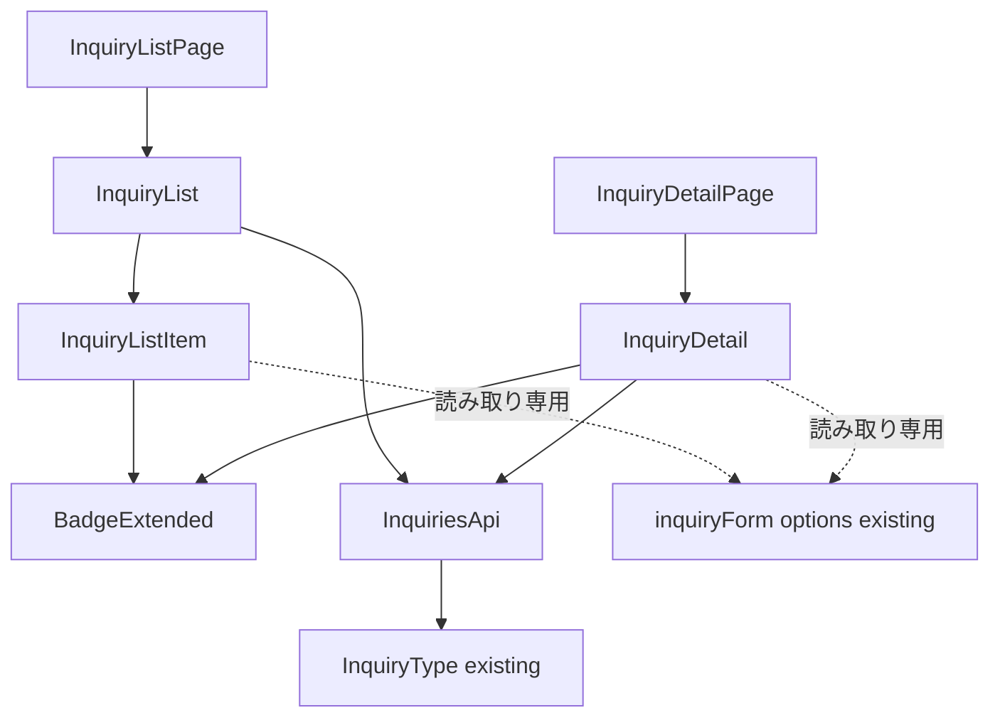
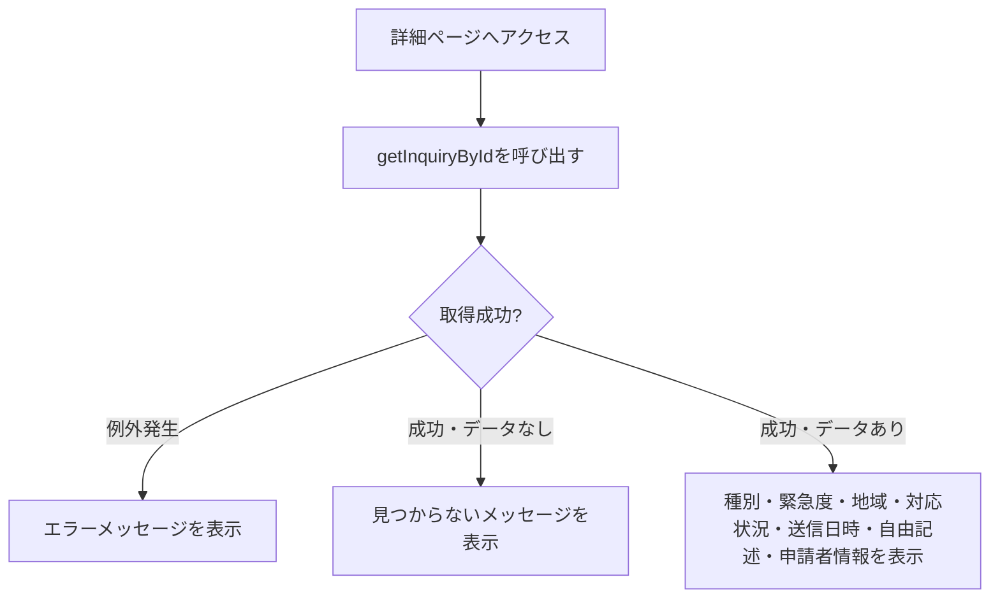

# 技術設計書: inquiry-list

## Overview

**Purpose**: 本機能は、海外販社担当者が自社の問い合わせ・申請の一覧（`/inquiry`）と対応状況を確認し、個々の詳細（`/inquiry/[id]`）を参照できる画面を提供する。

**Users**: 海外販社の担当者が、サイドバーの「問い合わせ一覧」ナビゲーションから遷移し、自社が送信した問い合わせの対応状況を確認する際に利用する。

**Impact**: 既存の`/inquiry`は`PlaceholderPage`を表示しているのみであり、本設計はそれを実際の一覧表示に置き換える。加えて`/inquiry/[id]`の動的ルートを新規追加する。`inquiry-form`仕様が所有する`Inquiry`型・`CreateInquiryInput`型・`createInquiry`関数・`getInquiryStatusSummary`関数は変更しない。`createInquiry`が送信データを永続化していないため、本仕様は一覧表示用の静的モックデータを新規に用意する。

### Goals
- 自社の問い合わせを送信日時降順で一覧表示し、対応状況・緊急度を視覚的に区別できる
- 一覧項目から詳細画面へ遷移し、自由記述本文を含む詳細情報を確認できる
- `inquiry-form`仕様が所有する型・関数を変更しない
- 日本語・英語の両言語で一覧・詳細画面が利用できる

### Non-Goals
- ヘルプデスク担当者向けの対応状況の変更・返信・コメント機能
- 他社（自社以外）の問い合わせの参照、認証・ログイン機能
- 問い合わせの検索・絞り込み・並び替えのカスタマイズ

## Boundary Commitments

### This Spec Owns
- 問い合わせ一覧ページ（`/inquiry`）・詳細ページ（`/inquiry/[id]`）のUI
- 一覧表示用の静的モックデータ（`Inquiry[]`）と、それを返すモック関数（`getInquiries`・`getInquiryById`）
- 問い合わせ一覧・詳細関連の翻訳キー（`messages/ja.json` / `en.json` の `inquiryList` 名前空間、および対応状況ラベル）
- `components/ui/badge.tsx` への対応状況・緊急度用variantの加法的な追加

### Out of Boundary
- `Inquiry`型・`CreateInquiryInput`型・`createInquiry`関数・`getInquiryStatusSummary`関数（`inquiry-form`仕様が所有）。本仕様はこれらを一切変更しない
- `inquiryForm`名前空間の翻訳キー（案件種別・緊急度・国の表示ラベルは`inquiry-form`仕様が定義済みのものを読み取り専用で再利用する）
- グローバルレイアウト（Header/Sidebar/AppShell/LanguageSwitcher）の変更

### Allowed Dependencies
- `dashboard` 仕様が提供する `AppShell` / ロケールレイアウト
- `inquiry-form` 仕様が定義した `Inquiry` 型、および `messages/*.json` の `inquiryForm.options.category` / `inquiryForm.options.urgency` / `inquiryForm.options.country` 翻訳キー（表示ラベルとして読み取り専用で再利用する）
- 既存のUI基盤コンポーネント（`card.tsx`・`badge.tsx`・`skeleton.tsx`）
- 既存の `next-intl` 設定

### Revalidation Triggers
- `inquiry-form`仕様が`Inquiry`型のフィールド形状や`inquiryForm.options.*`の翻訳キー構造を変更した場合、本仕様の一覧・詳細表示に影響がないか再確認が必要
- `components/ui/badge.tsx`のvariant一覧を変更する場合、`announcements`仕様が定義済みの既存キー（`maintenance`/`policy`/`incident`/`other`）を変更しないこと

## Architecture

### Existing Architecture Analysis
- `AnnouncementList`/`AnnouncementDetail`（`announcements`仕様）が確立した「async Server Component + `try/catch` + `Suspense`/Skeleton」パターンを本機能でも踏襲する
- `components/ui/badge.tsx`は現在`AnnouncementCategory`固有のキー（`maintenance`/`policy`/`incident`/`other`）に限定されているため、対応状況・緊急度用のキーを加法的に追加する
- `messages/ja.json`の`inquiryForm.options.category`/`urgency`/`country`は`inquiry-form`仕様実装時に整備済みであり、本仕様はこれらを読み取り専用で再利用することで翻訳キーの重複を避ける

### Architecture Pattern & Boundary Map



**Architecture Integration**:
- **Selected pattern**: `AnnouncementList`/`AnnouncementDetail`と同じ「async Server Component + `try/catch` + `Suspense`/Skeleton」パターン
- **Domain/feature boundaries**: `lib/api/inquiries.ts`（既存関数は不変、新規関数を追加）→ `components/features/inquiry-list/*`（UI）→ `app/[locale]/inquiry/**/page.tsx`（ルーティング）という一方向の依存関係。型・カテゴリ/緊急度の翻訳ラベルは`inquiry-form`仕様の既存資産を読み取り専用で参照する
- **Existing patterns preserved**: `AppShell`によるレイアウト共有、`lib/api/`のモック関数規約、`next-intl`翻訳キー規約、`Suspense`+Skeletonによるローディング表示パターン
- **New components rationale**: `InquiryListItem`・`InquiryDetail`は対応状況・緊急度をバッジで視覚的に区別する新規コンポーネント。`Badge`への加法的なvariant追加により、既存の`announcements`利用箇所には影響を与えない
- **Steering compliance**: `structure.md`が想定する`components/features/inquiry-list/`構成（本spec-init時に追記）、`lib/api/`でのモック抽象化、翻訳キー経由の文字列管理をすべて満たす

### Technology Stack

| Layer | Choice / Version | Role in Feature | Notes |
|-------|------------------|------------------|-------|
| Frontend | Next.js 14.2 (App Router) + React 18 + TypeScript 5 | 既存スタックを継続利用 | 変更なし |
| UIコンポーネント | 既存の`card`/`badge`/`skeleton`（`components/ui/`） | 対応状況・緊急度バッジ・カード表示・ローディング表示 | `badge.tsx`のvariantを加法的に拡張、新規UIプリミティブは追加しない |
| 多言語対応 | next-intl（既存） | 一覧・詳細文字列の翻訳。案件種別・緊急度・国は`inquiryForm`名前空間を再利用 | 新規の`inquiryList`名前空間（一覧見出し・対応状況ラベル等）を追加 |
| データ取得 | モック関数（`lib/api/inquiries.ts`） | `getInquiries`・`getInquiryById`を追加 | 既存の`createInquiry`・`getInquiryStatusSummary`は無変更 |

## File Structure Plan

### Directory Structure
```
src/
├── lib/
│   └── api/
│       └── inquiries.ts                    # getInquiries・getInquiryByIdを追加（既存2関数・既存エクスポートは無変更）
├── components/
│   ├── ui/
│   │   └── badge.tsx                       # variantに対応状況・緊急度用キーを加法的に追加
│   └── features/
│       └── inquiry-list/
│           ├── InquiryListItem.tsx         # 1件分の表示（種別・緊急度・対応状況・地域・送信日時、詳細への遷移リンク）
│           ├── InquiryList.tsx             # 一覧取得・状態管理 + InquiryListSkeleton
│           └── InquiryDetail.tsx           # 詳細取得・状態管理 + InquiryDetailSkeleton（見つからない場合の表示を含む）
└── app/[locale]/inquiry/
    ├── page.tsx                            # PlaceholderPage呼び出しをInquiryList呼び出しに変更
    └── [id]/page.tsx                       # 新規: 詳細ページ（動的ルート）
messages/ja.json, messages/en.json          # inquiryList 名前空間（一覧見出し・空/エラーメッセージ・対応状況ラベル・詳細ラベル）を新規追加
```

### Modified Files
- `src/lib/api/inquiries.ts` — `getInquiries(): Promise<Inquiry[]>`・`getInquiryById(id: string): Promise<Inquiry | null>`と、それらが参照する静的モックデータ配列（5〜10件程度、対応状況・緊急度・案件種別が一通り確認できる内容）を追加。既存の`createInquiry`・`getInquiryStatusSummary`・`MOCK_INQUIRY_STATUS`は変更しない
- `src/components/ui/badge.tsx` — `variant`に対応状況用（`status-new`/`status-in_progress`/`status-resolved`）・緊急度用（`urgency-high`/`urgency-medium`/`urgency-low`）のキーを追加。既存キー（`maintenance`/`policy`/`incident`/`other`）は変更しない
- `src/app/[locale]/inquiry/page.tsx` — `PlaceholderPage`の呼び出しを、`Suspense`+`InquiryListSkeleton`でラップした`InquiryList`の呼び出しに置き換える
- `messages/ja.json` / `messages/en.json` — `inquiryList`名前空間（一覧見出し・空/エラーメッセージ・対応状況ラベル・詳細画面のラベル・見つからないメッセージ・一覧へ戻るリンク）を追加。案件種別・緊急度・国の表示ラベルは既存の`inquiryForm.options.*`を再利用するため重複追加しない

## System Flows



**Key Decisions**:
- `getInquiryById`は「存在しないID」を例外ではなく`null`の解決で表現する（`announcements`仕様の`getAnnouncementById`と同じ設計判断。要件4.3の「見つからない」表示と通信・実装エラーによる「取得失敗」表示を区別するため）
- 一覧（`InquiryList`）は`AnnouncementList`と同一の`try/catch`+空配列チェックパターンのため、個別の図は省略する

## Requirements Traceability

| Requirement | Summary | Components | Interfaces | Flows |
|-------------|---------|------------|------------|-------|
| 1.1–1.3 | 一覧ページへのアクセス・全体構造 | InquiryListPage, InquiryList | - | - |
| 2.1–2.4 | 表示順序・視覚的区別 | InquiryList, InquiryListItem | GetInquiries Service Interface | - |
| 3.1–3.3 | 状態表示 | InquiryList | GetInquiries Service Interface | - |
| 4.1–4.4 | 詳細表示 | InquiryDetailPage, InquiryDetail | GetInquiryById Service Interface | 詳細取得フロー |
| 5.1–5.3 | モックAPI連携 | InquiryList, InquiryDetail | GetInquiries/GetInquiryById Service Interfaces | - |
| 6.1–6.2 | 多言語対応 | 全コンポーネント | messages/inquiryList, messages/inquiryForm（再利用） | - |
| 7.1 | レスポンシブ | InquiryList, InquiryDetail | - | - |

## Components and Interfaces

| Component | Domain/Layer | Intent | Req Coverage | Key Dependencies (P0/P1) | Contracts |
|-----------|--------------|--------|---------------|---------------------------|-----------|
| InquiryList | Feature | 一覧取得・ローディング/エラー/空状態・表示を統括 | 1, 2, 3, 5 | GetInquiries (P0), InquiryListItem (P1) | Service, State |
| InquiryListItem | Feature (UI) | 1件分の種別・緊急度・対応状況・地域・送信日時表示、詳細リンク | 1.2, 2.2, 2.3, 2.4, 4.1 | Badge (P1) | - |
| InquiryDetail | Feature | 詳細取得・見つからない/エラー/成功状態を管理して表示 | 4, 5 | GetInquiryById (P0), Badge (P1) | Service, State |

### Feature Layer

#### InquiryList

| Field | Detail |
|-------|--------|
| Intent | 自社の問い合わせ全件を取得し、送信日時降順で一覧表示する。ローディング・エラー・空状態を管理する |
| Requirements | 1.1, 1.2, 2.1, 3.1, 3.2, 3.3, 5.1 |

**Responsibilities & Constraints**
- async Server Componentとして実装し、`getInquiries()`を`try/catch`で呼び出す（`AnnouncementList`と同じエラーハンドリング規約）
- 取得結果が空配列の場合、専用の空状態メッセージを表示する
- 案件種別・緊急度の表示ラベルは`inquiryForm.options.category`/`inquiryForm.options.urgency`（既存、読み取り専用）から解決する

**Dependencies**
- Outbound: `getInquiries`（モックAPI） — 一覧データ取得 (P0)
- Outbound: `InquiryListItem` — 1件ごとの表示 (P1)

**Contracts**: Service [x] / API [ ] / Event [ ] / Batch [ ] / State [x]

##### Service Interface
```typescript
function getInquiries(): Promise<Inquiry[]>;
```
- Preconditions: なし
- Postconditions: `createdAt`の降順に並んだ全件の`Inquiry`配列を解決する
- Invariants: `createInquiry`・`getInquiryStatusSummary`が参照するデータ・実装とは独立している（本仕様が新規に用意する静的モックデータのみを参照する）

##### State Management
- State model: サーバーコンポーネントのため、クライアント側の状態は持たない
- Persistence & consistency: フェーズ1ではクライアントに状態を保持しない

**Implementation Notes**
- Integration: `getInquiries`・`getInquiryById`は`lib/api/inquiries.ts`の既存関数とは別関数として追加し、既存のコード・挙動を変更しない
- Validation: 該当なし（読み取り専用の一覧表示）
- Risks: なし

#### InquiryListItem

新しい境界（ロジック・外部結合）を持たないプレゼンテーション層のコンポーネントであり、サマリー行の記載で十分とする。

**Implementation Notes**
- Integration: `InquiryList`から1件分の`Inquiry`・翻訳済みラベルをpropsで受け取り、`Badge`（対応状況用・緊急度用の2つ）と組み合わせて表示する。タイトル代わりの案件種別テキストは`next-intl`の`Link`経由で詳細ページ（`/inquiry/[id]`）へのリンクとする
- Validation: 該当なし
- Risks: なし

#### InquiryDetail

| Field | Detail |
|-------|--------|
| Intent | 指定されたIDの問い合わせを取得し、見つからない・エラー・成功の3状態を管理して詳細を表示する |
| Requirements | 4.1, 4.2, 4.3, 4.4, 5.1, 5.3 |

**Responsibilities & Constraints**
- async Server Componentとして実装し、`getInquiryById(id)`を`try/catch`で呼び出す
- 戻り値が`null`の場合は「見つからない」メッセージを、例外発生時は「取得失敗」メッセージを、それぞれ区別して表示する
- 一覧ページへ戻るリンクを常に表示する

**Dependencies**
- Outbound: `getInquiryById`（モックAPI） — 単体データ取得 (P0)
- Outbound: `Badge` — 対応状況・緊急度表示 (P1)

**Contracts**: Service [x] / API [ ] / Event [ ] / Batch [ ] / State [x]

##### Service Interface
```typescript
function getInquiryById(id: string): Promise<Inquiry | null>;
```
- Preconditions: `id`は文字列であること
- Postconditions: 該当する`Inquiry`が存在する場合はそれを解決し、存在しない場合は`null`を解決する
- Invariants: `getInquiries`と同一のデータソースを参照する

**Implementation Notes**
- Integration: 動的ルートパラメータ（`params.id`）を`app/[locale]/inquiry/[id]/page.tsx`から受け取り、`InquiryDetail`に渡す
- Validation: 該当なし（読み取り専用の詳細表示）
- Risks: `null`とrejectの区別を実装で誤ると、要件4.3（見つからない）と一般的なエラー表示が混同される。テストで両方のケースを明示的に検証する

## Data Models

### Domain Model
- 本仕様は`inquiry-form`仕様が定義した`Inquiry`型をそのまま参照する（フィールドの追加・変更はしない）
- 一覧表示用の静的モックデータは、本仕様が`lib/api/inquiries.ts`内に新規の配列として保持し、`createInquiry`が返す実行時データとは独立する

### Data Contracts & Integration

**モックAPI契約**
- `getInquiries(): Promise<Inquiry[]>` — 自社の問い合わせ全件を`createdAt`降順で返す
- `getInquiryById(id: string): Promise<Inquiry | null>` — 該当データがなければ`null`を返す
- 既存の`createInquiry`・`getInquiryStatusSummary` — 型・挙動ともに変更しない

## Error Handling

### Error Strategy
- **一覧取得失敗**: `InquiryList`内の`try/catch`でエラーメッセージ（翻訳キー経由）を表示する
- **詳細取得失敗**: `InquiryDetail`内の`try/catch`で「取得失敗」メッセージを表示する
- **詳細が見つからない**: `getInquiryById`が`null`を返した場合、`InquiryDetail`は「取得失敗」とは異なる「見つからない」メッセージを表示する（要件4.3）

### Monitoring
- フェーズ1ではモックAPIのためサーバーサイド監視は対象外

## Testing Strategy

- **Unit Tests**: `getInquiries`（`createdAt`降順ソート・全件返却）・`getInquiryById`（存在するID/存在しないID）の挙動検証、既存の`createInquiry`・`getInquiryStatusSummary`の戻り値が変更されていないことのリグレッション検証
- **Integration Tests**: `InquiryList`の空状態・エラー状態の表示切り替え、`InquiryDetail`の見つからない状態とエラー状態の区別
- **E2E/UI Tests**: 一覧から詳細への遷移、存在しないIDへの直接アクセス時の表示、対応状況・緊急度バッジの視覚的区別、日英切り替え、タブレット幅での表示崩れ確認

## Security Considerations
- 本仕様は読み取り専用のモックデータのみを扱い、外部入力の受け付けは行わない。自由記述本文（`originalText`）の表示はReactの標準エスケープに依拠し、`dangerouslySetInnerHTML`を使用しない
