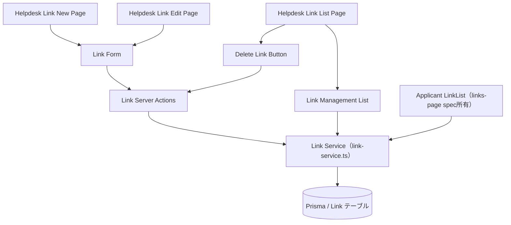
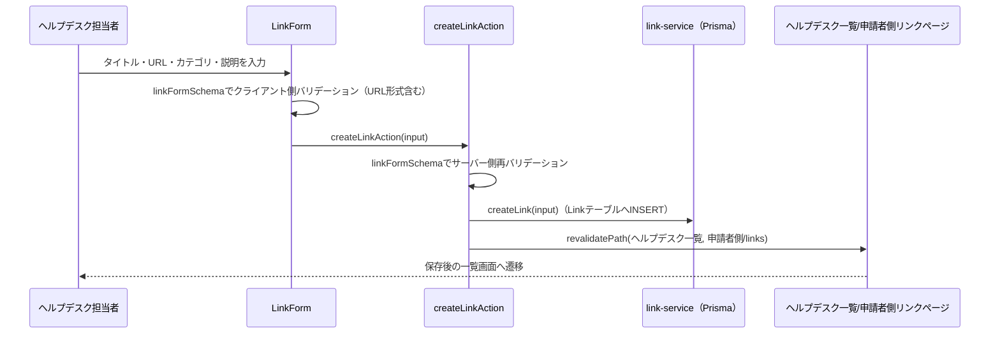

# 技術設計書: links-management

## Overview

**Purpose**: 本機能は、ヘルプデスク担当者がリンク（タイトル・URL・カテゴリ・説明）を登録・編集・削除できる管理画面（`/helpdesk/links`配下）を提供する。あわせて、申請者側の閲覧機能（`links-page`spec）が依存するリンクデータの書き込み系（作成・更新・削除）を本specが所有・提供する。

**Users**: 日本側ヘルプデスク担当者が、海外販社向けの業務リンク集を継続的に整備する際に利用する。

**Impact**: 現状、ヘルプデスク側のリンク集画面（`/helpdesk/links`）は申請者側と同一の閲覧専用コンポーネント（`LinkList`）を流用しているだけで、作成・編集・削除の手段が存在しない。本specはこの画面を管理画面に置き換え、`faq-management`が確立したヘルプデスク側CRUDのパターン（公開範囲・公開状態を持たない単純なエンティティの管理画面）をそのまま踏襲する。データ層は`backend-db-foundation`が導入したPrisma/PostgreSQL上の`Link`モデルを、既存のサーバー専用サービス層（`src/lib/server/link-service.ts`）を拡張して読み書きする。

### Goals
- ヘルプデスク担当者がリンクを作成・編集・削除できる
- リンクごとにカテゴリ（既存の`LinkCategory`の4値）を指定できる
- リンクのURLが妥当な形式であることをクライアント・サーバー双方で検証する
- 変更操作の完了後、申請者側のリンク一覧表示に確実に反映される
- 既存の`faq-management`・`documents-management`のパターンを踏襲し、新規の抽象化・依存ライブラリを追加しない

### Non-Goals
- 申請者側のリンク一覧画面のレイアウト・カテゴリ別グループ表示実装自体（`links-page`spec所有）
- リンク先サイトのステータス監視（死活監視）
- 認証・ロールベースアクセス制御（フェーズ3以降）
- `Link`型/`LinkCategory`選択肢自体の変更（既存定義を流用する）
- リンクへの公開範囲（配信対象）・公開状態（下書き/公開）・表示順の概念の追加（既存`Link`モデルに存在しないため対象外）

## Boundary Commitments

### This Spec Owns
- `/[locale]/helpdesk/links`・`/[locale]/helpdesk/links/new`・`/[locale]/helpdesk/links/[id]/edit`配下の全ページ（現状の閲覧専用流用画面を管理画面へ置き換える）
- リンクの作成・更新・削除を行うサービス層関数（`createLink`・`updateLink`・`deleteLink`）と、ヘルプデスク向け取得関数（`listLinksForHelpdesk`・`getLinkById`）の型契約・実装（`src/lib/server/link-service.ts`への追加）
- リンクの作成・編集・削除のServer Actions（`src/lib/actions/links.ts`、新規）
- リンクフォームのサーバー側バリデーションスキーマ（`src/lib/validation/link.ts`、新規）
- `CreateLinkInput`型（作成・更新入力、`src/types/link.ts`への追加）
- `HelpdeskSidebar`の既存「リンク集」ナビゲーション項目（`translationKey: "links"`）が指す画面の実体（項目自体は変更しない）

### Out of Boundary
- `links-page`spec所有の申請者側リンク一覧・カテゴリ別グループ表示の実装
- `links-page`specが所有する`Link`型・`LinkCategory`の選択肢定義（読み取り専用で再利用する）
- `helpdesk-portal-layout`が所有するルートセグメント構造・`HelpdeskAppShell`・`HelpdeskHeader`自体の変更
- 認証・ロールベースアクセス制御の実装

### Allowed Dependencies
- `faq-management`・`documents-management`が確立したServer Actions + サーバー側バリデーション + `revalidatePath`パターン
- `backend-db-foundation`が導入したPrismaクライアント（`src/lib/db/prisma.ts`）・`Link`モデル
- `links-page`spec所有の`Link`型・`LinkCategory`型（`src/types/link.ts`）の再利用
- 既存のUIプリミティブ（`Card`, `Button`, `Select`, `Input`, `Textarea`, `Label`）
- `HelpdeskSidebar`（既存項目の遷移先変更のみ、項目追加は行わない）

### Revalidation Triggers
- `Link`型・`LinkCategory`のフィールド・選択肢の変更（`links-page`specが再確認する必要がある）
- `getLinks`/`listLinks`の関数シグネチャ変更（`links-page`specの実装前提が変わる）

## Architecture

### Existing Architecture Analysis
現状の`src/lib/server/link-service.ts`は読み取り専用の`listLinks()`のみを実装しており、申請者側`/lib/api/links.ts`の`getLinks()`から呼び出される。ヘルプデスク側`/helpdesk/links/page.tsx`は申請者側と同一の`LinkList`コンポーネントを呼び出すのみで、書き込み手段がない。本specは`faq-management`が確立したパターン（`listFaqsForHelpdesk`等の追加、`documents-management`型のCRUDルート構成）をそのまま踏襲し、`link-service.ts`にCRUD関数を追加する。

### Architecture Pattern & Boundary Map
`faq-management`と同一のパターンを踏襲する（ファイル添付・公開範囲を持たない点も同様。`Link`は`description`が任意項目である点、URL形式検証が必要な点のみが`Faq`と異なる）。



**Architecture Integration**:
- 選択パターン: Server Actions + サーバー専用サービス層（`faq-management`・`announcements-management`・`documents-management`と同一パターン。データ実体はPrisma/PostgreSQL）
- ドメイン境界: リンクデータは単一の`Link`テーブルに集約し、ヘルプデスク側（管理一覧）と申請者側（カテゴリ別閲覧）の両方が`link-service`経由で読む。可視性スコープは持たない（リンクは全社共通）
- 既存パターンの維持: フォームは`react-hook-form`+`zod`、ページ構成（一覧→新規作成/編集）は`faq-management`と同じNext.js App Router構成を踏襲
- 新規コンポーネントを最小化: ファイル添付・公開範囲選択のUIを持たないため、追加コンポーネントは最小限（一覧・フォーム・削除ボタンのみ）
- Steering準拠: 表示テキストは全て`next-intl`翻訳キー経由、データアクセスは`src/lib/server/`のサービス層に集約という既存規約を維持

### Technology Stack

| Layer | Choice / Version | Role in Feature | Notes |
|-------|------------------|-----------------|-------|
| Frontend | Next.js App Router（既存, 14.2.35） | ページ構成・Server Actions | `faq-management`と同一パターン |
| Forms | react-hook-form + zod（既存） | リンク作成・編集フォームのバリデーション | タイトル・URL（形式検証）・カテゴリの必須検証 |
| UI | shadcn/ui（既存） | `Select`（カテゴリ選択）, `Input`（タイトル・URL）, `Textarea`（説明） | 新規UIプリミティブの追加は不要。削除確認はブラウザ標準`confirm()`を使用 |
| Data | Prisma / PostgreSQL（`backend-db-foundation`基盤）+ `link-service.ts` | リンクのCRUD | 既存の`listLinks`にCRUD関数を追加 |

## File Structure Plan

### Directory Structure
```
src/app/[locale]/helpdesk/(dashboard)/links/
├── page.tsx                        # 変更: 一覧（全件表示・削除導線）※現状の閲覧専用流用画面を置き換える
├── new/
│   └── page.tsx                    # 新規: 新規作成
└── [id]/
    └── edit/
        └── page.tsx                 # 新規: 編集・削除

src/components/features/helpdesk-links/
├── LinkManagementList.tsx            # Server: 全件取得・一覧表示
├── LinkForm.tsx                      # Client: 新規作成・編集共用フォーム（カテゴリ選択を含む）
└── DeleteLinkButton.tsx              # Client: confirm()による確認 + 削除アクション呼び出し

src/lib/server/
└── link-service.ts                   # 変更: listLinksForHelpdesk / getLinkById / createLink / updateLink / deleteLink を追加

src/lib/actions/
└── links.ts                          # 新規: "use server" Server Actions（create/update/delete）

src/lib/validation/
└── link.ts                           # 新規: リンクフォームのzodスキーマ（title/url必須・url形式検証、category enum）

src/types/
└── link.ts                           # 変更: CreateLinkInput を追加（既存 Link / LinkCategory は変更しない）

messages/
├── ja.json                          # 変更: helpdeskLinks名前空間
└── en.json                          # 同上
```

### Modified Files
- `src/lib/server/link-service.ts` — 既存の`listLinks`はそのまま維持し、ヘルプデスク向け一覧（`listLinksForHelpdesk`、`createdAt`降順・`createdAt`を含む）・`getLinkById`・`createLink`・`updateLink`・`deleteLink`を追加する
- `src/types/link.ts` — `CreateLinkInput`（`{ title: string; url: string; category: LinkCategory; description?: string }`）を追加。既存の`Link`・`LinkCategory`は変更しない
- `src/app/[locale]/helpdesk/(dashboard)/links/page.tsx` — 申請者側と共用していた`LinkList`呼び出しを`LinkManagementList`・`DeleteLinkButton`に置き換える
- `messages/ja.json` / `messages/en.json` — 新規名前空間・キーの追加。カテゴリ表示名は`links-page`specが定義済みのキーを再利用する

> `links-page`spec所有の申請者側リンク一覧・カテゴリ別グループ表示は本specでは変更しない。これらが呼び出す`getLinks`/`listLinks`の型インターフェースを本specは変更しない。

## System Flows

リンクの作成・編集・削除はいずれも「Client Component → Server Action → サービス層（Prisma）→ revalidatePath」という同一パターンに従う（`faq-management`の作成フローと同型）ため、代表として新規作成フローを図示する。



- 編集・削除も同様に、Server Action内で（作成・編集は`linkFormSchema`による）サーバー側バリデーションを行った後、サービス層を通じてLinkテーブルを更新し、影響範囲の全ルート（ヘルプデスク側・申請者側`/links`）を`revalidatePath`で再検証する。

## Requirements Traceability

| Requirement | Summary | Components | Interfaces | Flows |
|-------------|---------|------------|------------|-------|
| 1.1〜1.6 | ヘルプデスク側リンク一覧 | LinkManagementList | LinkService (Service) | — |
| 2.1〜2.6 | リンクの新規作成 | LinkForm, LinkActions | Service | 新規作成フロー |
| 3.1〜3.5 | リンクの編集 | LinkForm, LinkActions | Service | 新規作成フローと同型 |
| 4.1〜4.3 | リンクの削除 | DeleteLinkButton, LinkActions | Service | 新規作成フローと同型 |
| 5.1〜5.4 | カテゴリの指定 | LinkForm, linkFormSchema | Service | — |
| 6.1〜6.2 | 既存ナビゲーション導線の管理画面化 | HelpdeskSidebar（変更なし）, HelpdeskLinkListPage | — | — |
| 7.1〜7.2 | 申請者側表示への反映 | LinkActions（revalidatePath） | Service | 新規作成フロー |
| 8.1〜8.3 | 多言語対応 | 全新規コンポーネント | — | — |
| 9.1 | レスポンシブ対応 | （既存HelpdeskAppShellに依存、新規コンポーネントなし） | — | — |

## Components and Interfaces

| Component | Domain/Layer | Intent | Req Coverage | Key Dependencies (P0/P1) | Contracts |
|-----------|--------------|--------|---------------|---------------------------|-----------|
| LinkManagementList | UI/Server | 全件のリンクを取得・一覧表示 | 1.1〜1.6 | LinkService (P0) | State |
| LinkForm | UI/Client | タイトル・URL・カテゴリ・説明の入力・送信 | 2.1〜2.6, 3.1〜3.5, 5.1〜5.4 | LinkActions (P0) | State |
| DeleteLinkButton | UI/Client | 削除確認・削除アクション呼び出し | 4.1〜4.3 | LinkActions (P0) | State |
| LinkService | Data/Service | リンクの読み取り（全件）・CRUD（Prisma） | 1.1, 7.1 | Prisma (P0), Link型 (P0) | Service |
| LinkActions | Server Actions | サービス層のCRUDを呼び出し、`revalidatePath`で再検証する | 2.4, 3.4, 4.3, 7.1 | LinkService (P0) | Service |

### Data / Service Layer

#### LinkService

| Field | Detail |
|-------|--------|
| Intent | 申請者側・ヘルプデスク側の双方にリンクを提供し、ヘルプデスク側からのCRUDを行う |
| Requirements | 1.1, 7.1 |

**Responsibilities & Constraints**
- `listLinks`（既存、変更しない）は申請者側`links-page`specが利用する読み取り関数。絞り込みを行わず全件を返す
- `listLinksForHelpdesk`は管理一覧用に`createdAt`降順で全件を返す（`createdAt`フィールドを含める）
- `getLinkById`は指定IDのリンクを1件返し、存在しない場合は`null`を返す
- ミューテーション（`createLink`・`updateLink`・`deleteLink`）はPrisma経由で`Link`テーブルを更新する。`createLink`は`createdAt`をDBの`@default(now())`に委ねる
- リンクは可視性スコープ（配信対象）を持たないため、ヘルプデスク側・申請者側で同一のレコード集合を扱う

**Dependencies**
- Inbound: `LinkActions`（P0）, `LinkManagementList`（P0）, `links-page`spec所有の申請者側一覧（読み取り専用、P0）
- Outbound: Prismaクライアント（P0）

**Contracts**: Service [x]

##### Service Interface
```typescript
interface LinkService {
  listLinks(): Promise<Link[]>;                                  // 既存（変更しない）
  listLinksForHelpdesk(): Promise<LinkWithTimestamp[]>;          // createdAt降順・createdAtを含む
  getLinkById(id: string): Promise<Link | null>;
  createLink(input: CreateLinkInput): Promise<Link>;
  updateLink(id: string, input: CreateLinkInput): Promise<Link>;
  deleteLink(id: string): Promise<void>;
}
```
- Preconditions: `updateLink`/`deleteLink`の`id`は存在するリンクのIDであること
- Postconditions: `createLink`で作成されたリンクは、直後の`listLinks`/`listLinksForHelpdesk`の結果に反映される
- Invariants: `listLinks`が返す集合と`listLinksForHelpdesk`が返す集合は同一のレコード群を表す（並び順・付随フィールドのみ異なる）

**Implementation Notes**
- Integration: `links-page`spec は本サービスの`listLinks`のみを利用する（型・戻り値を変更しない限り、申請者側の実装に影響しない）
- Validation: 存在しないIDに対する`updateLink`/`deleteLink`はエラーをthrowする（Prismaの`P2025`をハンドリングして見つからない旨を返してもよい）
- Risks: なし（永続化はPrisma/PostgreSQL。フェーズ1のモック配列ではない）

### Server Actions

#### LinkActions

| Field | Detail |
|-------|--------|
| Intent | クライアントからのリンク作成・編集・削除操作を受け、サーバー側バリデーション・ミューテーション・関連ルートの再検証を行う |
| Requirements | 2.2〜2.4, 3.2〜3.4, 4.3, 5.2, 7.1 |

**Responsibilities & Constraints**
- 全ての関数に`"use server"`を付与する
- `createLinkAction`・`updateLinkAction`は`linkFormSchema`（zod）でタイトル・URL（形式検証）・カテゴリを検証し、不正な入力は保存せず例外を送出する
- 各操作の最後に、ヘルプデスク側一覧・編集、申請者側`/links`ルートを`revalidatePath`で再検証する

**Contracts**: Service [x]

##### Service Interface
```typescript
interface LinkActions {
  createLinkAction(input: CreateLinkInput): Promise<Link>;
  updateLinkAction(id: string, input: CreateLinkInput): Promise<Link>;
  deleteLinkAction(id: string): Promise<void>;
}
```
- Preconditions: `input`はクライアント側で`react-hook-form`+`zod`によりバリデーション済みであること（サーバー側でも同一スキーマで再検証する）
- Postconditions: 成功時、対象ルート群が再検証され、次回アクセス時に最新状態が反映される
- Invariants: バリデーション失敗時はDBを変更しない

**Implementation Notes**
- Integration: `revalidatePath`の対象は`/[locale]/helpdesk/links`（page）, `/[locale]/helpdesk/links/[id]/edit`（page）, `/[locale]/links`（page）
- Validation: サーバー側バリデーションはクライアント側と同一の`linkFormSchema`を再利用する

### Presentation Components（サマリーのみ）

- **LinkManagementList**: `listLinksForHelpdesk()`を登録日降順で表示し、各行にタイトル・URL・カテゴリ表示名・登録日、編集リンクと`DeleteLinkButton`を配置する。既存`DocumentManagementList`・`FaqManagementList`と同じ構造パターンを踏襲する。
- **LinkForm**: タイトル（`Input`）・URL（`Input`）・カテゴリ（`Select`、`LinkCategory`の4値）・説明（`Textarea`、任意）を持つ`react-hook-form`+`zod`フォーム。新規作成・編集で共用する。
- **DeleteLinkButton**: クリック時に`confirm()`でユーザーに確認し、確認後に`deleteLinkAction`を呼び出す。

## Data Models

### Domain Model
- `Link`（既存、変更しない）: `id`, `title`, `url`, `category`, `description?`
- `CreateLinkInput`（新規）: `{ title: string; url: string; category: LinkCategory; description?: string }`（`id`・`createdAt`を除いた作成・更新入力）
- `LinkCategory`（既存、変更しない）: `"internal" | "external" | "document" | "other"`

### Logical Data Model
- `Link`は単一エンティティ。Prismaの`Link`モデル（`id`・`title`・`url`・`category`・`description`・`createdAt`）に対応する。公開範囲・公開状態・表示順といった追加のリレーション・属性は持たない。

### Data Contracts & Integration

| 型 | 主なフィールド | 備考 |
|---|---|---|
| `Link` | `id`, `title`, `url`, `category`, `description?` | `links-page`spec所有。本specは変更しない |
| `CreateLinkInput` | `title`, `url`, `category`, `description?` | `Link`から`id`を除き、`createdAt`はDBが採番 |
| `LinkCategory` | `internal` \| `external` \| `document` \| `other` | `links-page`spec所有の既存定義を流用 |

## Error Handling

### Error Strategy
`faq-management`と同様のパターンを踏襲する。Server Componentは取得失敗時にtry/catchでエラーメッセージを表示し、Server Actionsは不正な入力・存在しないIDに対してエラーをthrowし、呼び出し元のクライアントコンポーネントがエラー状態を表示する。

### Error Categories and Responses
- **データ取得失敗**（一覧）: 既存パターンと同様にエラーメッセージを表示
- **存在しないリンクIDへの編集・削除操作**: Server Actionがエラーをthrow（またはPrisma `P2025`をハンドリング）し、クライアント側で見つからない旨/エラー表示にフォールバック
- **入力値不正**（タイトル・URL未入力、URL形式不正、カテゴリ未選択）: クライアント側`zod`バリデーションで送信をブロックし、フィールド単位のエラーメッセージを表示。サーバー側でも同一スキーマで再検証する

### Monitoring
フェーズ1では追加のロギング・監視基盤は導入しない。

## Testing Strategy

- **Unit Tests**:
  - `listLinksForHelpdesk`が`createdAt`降順で全件を返すこと、`getLinkById`が存在しないIDに対して`null`を返すこと
  - `createLink`/`updateLink`/`deleteLink`が対象のリンクのみを操作し、他のレコードに影響しないこと（存在しないIDへの操作がエラーになること）
  - `linkFormSchema`がタイトル・URLの未入力、無効なURL形式、カテゴリ未選択（4値以外）を拒否すること。`description`が未入力でも受理されること
  - Server Actionsが不正な入力を拒否し、DBを変更しないこと
- **Integration Tests**:
  - ヘルプデスク側でリンクを作成後、申請者側`/links`の該当カテゴリグループに表示されること
  - 編集でカテゴリを変更すると、申請者側で別グループに移動して表示されること
  - 削除後、ヘルプデスク側一覧・申請者側`/links`の両方から除去されること
- **E2E/UI Tests**:
  - 日本語・英語両ロケールで一覧・作成・編集画面が表示され、カテゴリ表示名が`links-page`specと同一のラベルで切り替わること
  - タブレット幅（768px）で新規画面が横スクロールを起こさないこと

## Security Considerations
フェーズ1は認証未実装のため、ヘルプデスク側のリンク作成・編集・削除画面は`helpdesk-portal-layout`の前提通り制限なくアクセス可能である。リンクは可視性スコープを持たない全社共通データであり、公開範囲による情報分離は行わない。ユーザーが入力したURLはリンク先の内容を検証せず、`<a href>`として提示するのみとする（既存`links-page`specの前提を踏襲。リンク先の安全性検証はフェーズ1の対象外）。フェーズ3で認証が導入される際、本specのルート境界を変更せずにアクセス制御（ヘルプデスク担当者のみ書き込み可）を追加できることを設計上の前提とする。
