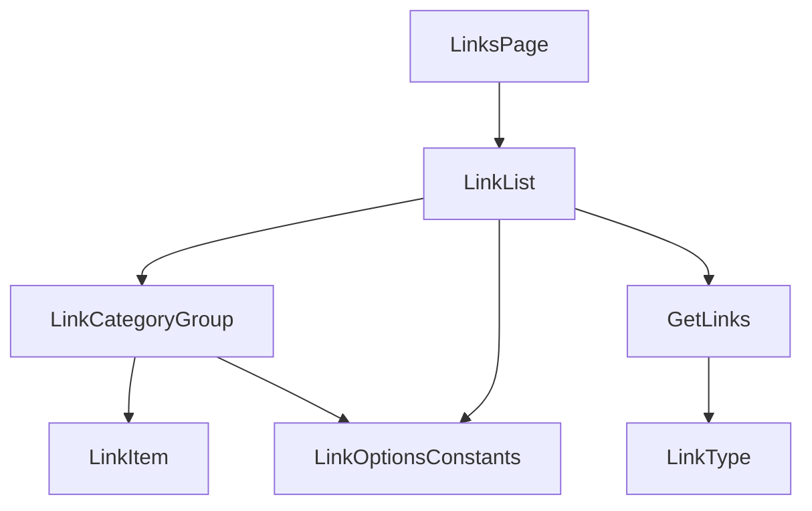

# 技術設計書: links-page

## Overview

**Purpose**: 本機能は、海外販社担当者が業務で利用する外部・内部サイトへのリンクをカテゴリ別に整理して確認できるリンク一覧ページ（`/links`）を提供する。

**Users**: 海外販社の担当者が、サイドバーの「リンク集」ナビゲーションから遷移し、業務で必要なサイトへアクセスする際に利用する。

**Impact**: 既存の`/links`は`PlaceholderPage`を表示しているのみであり、本設計はそれを実際のリンク一覧表示に置き換える。`dashboard`仕様が実装済みの`AppShell`・ナビゲーションをそのまま利用する。本機能は他仕様が依存する既存の型・APIを持たないグリーンフィールドの実装であり、後方互換の制約はない。

### Goals
- リンクをカテゴリ別にグループ化して一覧表示できる
- リンクをクリックすると新しいタブで安全に開ける（`rel="noopener noreferrer"`）
- モックAPIを実APIに差し替えやすい型インターフェースで実装する
- 日本語・英語の両言語で一覧画面が利用できる

### Non-Goals
- ヘルプデスク担当者向けのリンク作成・編集・削除機能
- リンクの検索・並び替え機能
- リンク先サイトの死活監視・有効性チェック

## Boundary Commitments

### This Spec Owns
- リンク一覧ページ（`/links`）のUI
- `Link`型・カテゴリコード定数の新規定義
- リンク一覧取得のモック関数（`lib/api/links.ts`）
- リンク一覧関連の翻訳キー（`messages/ja.json` / `en.json` の `links` 名前空間）

### Out of Boundary
- グローバルレイアウト（Header/Sidebar/AppShell/LanguageSwitcher）の変更。本仕様はこれらを変更せず利用するのみ
- リンクの作成・編集・削除、検索・並び替え、死活監視（Non-Goals参照）

### Allowed Dependencies
- `dashboard` 仕様が提供する `AppShell` / ロケールレイアウト（`app/[locale]/layout.tsx`）
- 既存のUI基盤コンポーネント（`card.tsx`・`badge.tsx`・`skeleton.tsx`）
- 既存の `next-intl` 設定

### Revalidation Triggers
- 本仕様が新規に定義する`Link`型・`lib/api/links.ts`は他仕様に依存されていないため、変更時の外部影響は想定されない
- カテゴリ（`category`）の選択肢がヒアリング結果を受けて変更された場合、`lib/constants/link-options.ts`と翻訳キーの同時更新が必要

## Architecture

### Existing Architecture Analysis
- `app/[locale]/layout.tsx` が `AppShell` を全ページ共通で提供しており、本機能は `children` として `page.tsx` を配置するのみでよい
- `AnnouncementList`（`announcements`仕様）が確立した「async Server Component + `try/catch` + `Suspense`/Skeleton」パターンを本機能でも踏襲する
- `components/ui/`の`card`・`badge`・`skeleton`は本機能の要件（カテゴリグループ表示・種別バッジ・ローディング表示）をそのまま満たせるため、新規UIプリミティブの追加は不要

### Architecture Pattern & Boundary Map



**Architecture Integration**:
- **Selected pattern**: `AnnouncementList`と同じ「async Server Component + `try/catch` + `Suspense`/Skeleton」パターンを適用するコンポジションパターン
- **Domain/feature boundaries**: `types/link.ts`（型）→ `lib/constants/link-options.ts`（カテゴリコード）→ `lib/api/links.ts`（取得）→ `components/features/links/*`（UI）→ `app/[locale]/links/page.tsx`（ルーティング）という一方向の依存関係で責務を分離する
- **Existing patterns preserved**: `AppShell`によるレイアウト共有、`lib/api/`のモック関数規約、`next-intl`翻訳キー規約、`Suspense`+Skeletonによるローディング表示パターン
- **New components rationale**: `LinkCategoryGroup`・`LinkItem`はカテゴリ別グループ表示・リンク項目表示を担う新規コンポーネント。既存のUI基盤（`Card`/`Badge`）を組み合わせて実装し、新規UIプリミティブは追加しない
- **Steering compliance**: `structure.md`が想定する`components/features/links/`構成、`lib/api/`でのモック抽象化、翻訳キー経由の文字列管理をすべて満たす

### Technology Stack

| Layer | Choice / Version | Role in Feature | Notes |
|-------|------------------|------------------|-------|
| Frontend | Next.js 14.2 (App Router) + React 18 + TypeScript 5 | 既存スタックを継続利用 | 変更なし |
| UIコンポーネント | 既存の`card`/`badge`/`skeleton`（`components/ui/`） | カテゴリグループ・種別表示・ローディング表示 | 新規UIプリミティブは追加しない |
| アイコン | `lucide-react`（既存導入済み） | 外部リンクを示すアイコン表示 | 新規依存なし |
| 多言語対応 | next-intl（既存） | 一覧文字列・カテゴリラベルの翻訳 | 既存基盤を拡張（`links`名前空間を新規追加） |
| データ取得 | モック関数（`lib/api/links.ts`） | `getLinks`を新規追加 | 新規ファイル。既存の他モックAPIと同一規約 |

## File Structure Plan

### Directory Structure
```
src/
├── types/
│   └── link.ts                             # Link型・LinkCategory型
├── lib/
│   ├── constants/
│   │   └── link-options.ts                 # category コード一覧
│   └── api/
│       └── links.ts                        # getLinks モック関数
├── components/
│   └── features/
│       └── links/
│           ├── LinkList.tsx                # 一覧取得・カテゴリ別グループ化・状態管理 + LinkListSkeleton
│           ├── LinkCategoryGroup.tsx        # 1カテゴリ分のグループ表示（Card + 見出し + LinkItemのリスト）
│           └── LinkItem.tsx                 # 1件分のリンク項目（title・説明・外部リンクアイコン）
└── app/[locale]/links/page.tsx              # PlaceholderPage呼び出しをLinkList呼び出しに変更
messages/ja.json, messages/en.json           # links 名前空間（見出し・空/エラーメッセージ・カテゴリラベル）を追加
```

### Modified Files
- `src/app/[locale]/links/page.tsx` — `PlaceholderPage`の呼び出しを、`Suspense`+`LinkListSkeleton`でラップした`LinkList`の呼び出しに置き換える
- `messages/ja.json` / `messages/en.json` — `links`名前空間を追加

## Requirements Traceability

| Requirement | Summary | Components | Interfaces | Flows |
|-------------|---------|------------|------------|-------|
| 1.1–1.3 | 一覧ページへのアクセス・全体構造 | LinksPage, LinkList | - | - |
| 2.1–2.4 | カテゴリ別分類 | LinkList, LinkCategoryGroup | LinkOptionsConstants | - |
| 3.1–3.3 | クリック動作 | LinkItem | - | - |
| 4.1–4.3 | 状態表示 | LinkList | GetLinks Service Interface | - |
| 5.1–5.2 | モックAPI連携 | LinkList | GetLinks Service Interface | - |
| 6.1–6.3 | 多言語対応 | 全コンポーネント | messages/links | - |
| 7.1–7.2 | レスポンシブ | LinkList, LinkCategoryGroup | - | - |

## Components and Interfaces

| Component | Domain/Layer | Intent | Req Coverage | Key Dependencies (P0/P1) | Contracts |
|-----------|--------------|--------|---------------|---------------------------|-----------|
| LinkList | Feature | 一覧取得・カテゴリ別グループ化・ローディング/エラー/空状態を統括 | 1, 2, 4, 5 | GetLinks (P0), LinkCategoryGroup (P1) | Service, State |
| LinkCategoryGroup | Feature (UI) | 1カテゴリ分の見出し・リンク項目リストを表示 | 2.2, 2.3, 7.2 | LinkItem (P1) | - |
| LinkItem | Feature (UI) | 1件のリンクをタイトル・説明・外部アイコン付きで表示し、新しいタブで開く | 3.1, 3.2, 3.3 | - | - |

### Feature Layer

#### LinkList

| Field | Detail |
|-------|--------|
| Intent | リンク全件を取得し、カテゴリごとにグループ化して表示する。ローディング・エラー・空状態を管理する |
| Requirements | 1.1, 1.2, 2.1, 2.2, 2.4, 4.1, 4.2, 4.3, 5.1 |

**Responsibilities & Constraints**
- async Server Componentとして実装し、`getLinks()`を`try/catch`で呼び出す（`AnnouncementList`と同じエラーハンドリング規約）
- 取得結果を`LINK_CATEGORY_CODES`の順序で走査し、該当カテゴリのリンクが1件以上存在する場合のみ`LinkCategoryGroup`を表示する（空のカテゴリグループは表示しない）
- 取得結果が空配列の場合、専用の空状態メッセージを表示する
- 呼び出し元（`page.tsx`）から`Suspense`でラップされ、フォールバックとして同ファイルの`LinkListSkeleton`が使われることを前提とする

**Dependencies**
- Outbound: `getLinks`（モックAPI） — 一覧データ取得 (P0)
- Outbound: `LinkCategoryGroup` — カテゴリ単位の表示 (P1)

**Contracts**: Service [x] / API [ ] / Event [ ] / Batch [ ] / State [x]

##### Service Interface
```typescript
function getLinks(): Promise<Link[]>;
```
- Preconditions: なし
- Postconditions: 全件の`Link`配列を解決する。並び順は保証しない（カテゴリ別グループ化は呼び出し側が行う）
- Invariants: なし（読み取り専用の一覧取得）

##### State Management
- State model: サーバーコンポーネントのため、クライアント側の状態は持たない
- Persistence & consistency: フェーズ1ではクライアントに状態を保持しない（画面遷移ごとに再取得）

**Implementation Notes**
- Integration: カテゴリ別グループ化のロジックはこのコンポーネント内に直接実装し、別ファイルへの抽出は行わない（ロジックが単純なため過度な抽象化を避ける）
- Validation: 該当なし（読み取り専用の一覧表示）
- Risks: なし

#### LinkCategoryGroup / LinkItem

新しい境界（ロジック・外部結合）を持たないプレゼンテーション層のコンポーネントであり、サマリー行の記載で十分とする。

**Implementation Notes**
- Integration: `LinkCategoryGroup`は`Card`＋カテゴリの翻訳済みラベル（`Badge`または見出しテキスト）＋`LinkItem`のリストで構成する。`LinkItem`は`<a target="_blank" rel="noopener noreferrer">`で実装し、`lucide-react`の外部リンクアイコンをタイトル横に表示する
- Validation: 該当なし
- Risks: なし

## Data Models

### Domain Model
- **Link**: リンク1件を表す集約。`id`・`title`・`url`・`category`・`description`（任意）を持つ。本仕様は読み取りのみを扱う
- **LinkCategory**: リンクの種別を表す列挙（`"internal" | "external" | "document" | "other"`）。ヒアリング後に選択肢が変更される前提の仮値

### Logical Data Model

| フィールド | 型 | 必須 | 備考 |
|---|---|---|---|
| `id` | `string` | ✓ | |
| `title` | `string` | ✓ | |
| `url` | `string` | ✓ | |
| `category` | `LinkCategory` | ✓ | `lib/constants/link-options.ts`のコード一覧から選択 |
| `description` | `string` | - | 任意。補足説明がある場合のみ設定 |

### Data Contracts & Integration

**モックAPI契約**
- `getLinks(): Promise<Link[]>` — 全件を返す（並び順の保証なし、カテゴリ別グループ化はUI側の責務）

## Error Handling

### Error Strategy
- **一覧取得失敗**: `LinkList`内の`try/catch`でエラーメッセージ（翻訳キー経由）を表示する（`AnnouncementList`と同一パターン）

### Error Categories and Responses
- **System Errors**: モックAPI呼び出しの例外 → エラーメッセージ表示
- **Empty State**: リンクが0件 → 空状態メッセージ表示

### Monitoring
- フェーズ1ではモックAPIのためサーバーサイド監視は対象外

## Testing Strategy

- **Unit Tests**: `getLinks`が全件の`Link`配列を返すことの検証
- **Integration Tests**: `LinkList`の空状態・エラー状態の表示切り替え、カテゴリ別グループ化（該当カテゴリのリンクのみグループ表示され、リンクが存在しないカテゴリは表示されないこと）の検証
- **E2E/UI Tests**: リンククリックで新しいタブが開くこと（`target="_blank"`・`rel="noopener noreferrer"`の付与確認）、日英切り替え時のカテゴリラベル切り替え、タブレット幅での表示崩れ確認

## Security Considerations
- 新しいタブで開く外部リンクには`rel="noopener noreferrer"`を付与し、開いた先のページから`window.opener`経由で元のページを操作されるリスク（タブナビング攻撃）を防止する
