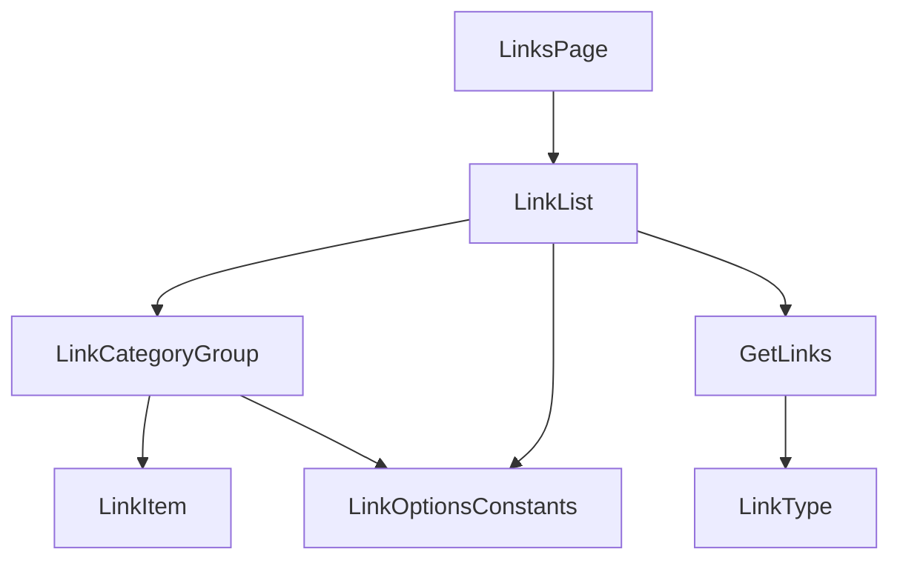

# 技術設計書: links-page

## Overview

**Purpose**: 本機能は、海外販社担当者が業務で利用する外部・内部サイトへのリンクをカテゴリ別に整理して確認できるリンク一覧ページ（`/links`）を提供する。

**Users**: 海外販社の担当者が、サイドバーの「リンク集」ナビゲーションから遷移し、業務で必要なサイトへアクセスする際に利用する。

**Impact**: 既存の`/links`は`PlaceholderPage`を表示しているのみであり、本設計はそれを実際のリンク一覧表示に置き換える。`dashboard`仕様が実装済みの`AppShell`・ナビゲーションをそのまま利用する。本機能は他仕様が依存する既存の型・APIを持たないグリーンフィールドの実装であり、後方互換の制約はない。

### Goals
- リンクをカテゴリ別にグループ化して一覧表示できる
- リンクをクリックすると新しいタブで安全に開ける（`rel="noopener noreferrer"`）
- モックAPIを実APIに差し替えやすい型インターフェースで実装する
- 日本語・英語の両言語で一覧画面が利用できる

### Non-Goals
- ヘルプデスク担当者向けのリンク作成・編集・削除機能
- リンクの検索・並び替え機能
- リンク先サイトの死活監視・有効性チェック

## Boundary Commitments

### This Spec Owns
- リンク一覧ページ（`/links`）のUI
- リンク一覧取得のモック関数（`lib/api/links.ts`）
- リンク一覧関連の翻訳キー（`messages/ja.json` / `en.json` の `links` 名前空間）
- （2026-07-29追記）`groupLinksByCategory`（大分類・中分類ベースのグループ化ロジック、`links-management`spec の`LinkPreviewPanel`からも再利用される）

### Out of Boundary
- グローバルレイアウト（Header/Sidebar/AppShell/LanguageSwitcher）の変更。本仕様はこれらを変更せず利用するのみ
- リンクの作成・編集・削除、並び替え、死活監視（Non-Goals参照）
- （2026-07-29追記）`Link`型・`LinkCategory`型の定義、カテゴリの階層データモデル・カテゴリ管理画面・多言語対応（`links-management`spec所有。当初本specが所有していた`Link`型・カテゴリコード定数の新規定義は、2026-07-29追記により所有権が`links-management`specへ移った）

### Allowed Dependencies
- `dashboard` 仕様が提供する `AppShell` / ロケールレイアウト（`app/[locale]/layout.tsx`）
- 既存のUI基盤コンポーネント（`card.tsx`・`badge.tsx`・`skeleton.tsx`）
- 既存の `next-intl` 設定
- （2026-07-29追記）`links-management`spec提供の`Link`型・`LinkCategory`型・`LinkCategorySummary`型・`getLinkCategoriesForApplicant`・`resolveLinkCategoryContent`

### Revalidation Triggers
- 本仕様が新規に定義する`lib/api/links.ts`は他仕様に依存されていないため、変更時の外部影響は想定されない
- （2026-07-29追記）`links-management`spec所有の`Link`型・`LinkCategorySummary`型・`getLinkCategoriesForApplicant`のシグネチャ変更（本仕様の`LinkList`・`groupLinksByCategory`が追随する必要がある）

## Architecture

### Existing Architecture Analysis
- `app/[locale]/layout.tsx` が `AppShell` を全ページ共通で提供しており、本機能は `children` として `page.tsx` を配置するのみでよい
- `AnnouncementList`（`announcements`仕様）が確立した「async Server Component + `try/catch` + `Suspense`/Skeleton」パターンを本機能でも踏襲する
- `components/ui/`の`card`・`badge`・`skeleton`は本機能の要件（カテゴリグループ表示・種別バッジ・ローディング表示）をそのまま満たせるため、新規UIプリミティブの追加は不要

### Architecture Pattern & Boundary Map


```mermaid
graph TB
    Page[LinksPage]
    List[LinkList]
    Group[LinkCategoryGroup]
    Item[LinkItem]
    Options[LinkOptionsConstants]
    Api[GetLinks]
    Types[LinkType]

    Page --> List
    List --> Group
    Group --> Item
    List --> Options
    Group --> Options
    List --> Api
    Api --> Types
```

**Architecture Integration**:
- **Selected pattern**: `AnnouncementList`と同じ「async Server Component + `try/catch` + `Suspense`/Skeleton」パターンを適用するコンポジションパターン
- **Domain/feature boundaries**: `types/link.ts`（型）→ `lib/constants/link-options.ts`（カテゴリコード）→ `lib/api/links.ts`（取得）→ `components/features/links/*`（UI）→ `app/[locale]/links/page.tsx`（ルーティング）という一方向の依存関係で責務を分離する
- **Existing patterns preserved**: `AppShell`によるレイアウト共有、`lib/api/`のモック関数規約、`next-intl`翻訳キー規約、`Suspense`+Skeletonによるローディング表示パターン
- **New components rationale**: `LinkCategoryGroup`・`LinkItem`はカテゴリ別グループ表示・リンク項目表示を担う新規コンポーネント。既存のUI基盤（`Card`/`Badge`）を組み合わせて実装し、新規UIプリミティブは追加しない
- **Steering compliance**: `structure.md`が想定する`components/features/links/`構成、`lib/api/`でのモック抽象化、翻訳キー経由の文字列管理をすべて満たす

### Technology Stack

| Layer | Choice / Version | Role in Feature | Notes |
|-------|------------------|------------------|-------|
| Frontend | Next.js 14.2 (App Router) + React 18 + TypeScript 5 | 既存スタックを継続利用 | 変更なし |
| UIコンポーネント | 既存の`card`/`badge`/`skeleton`（`components/ui/`） | カテゴリグループ・種別表示・ローディング表示 | 新規UIプリミティブは追加しない |
| アイコン | `lucide-react`（既存導入済み） | 外部リンクを示すアイコン表示 | 新規依存なし |
| 多言語対応 | next-intl（既存） | 一覧文字列・カテゴリラベルの翻訳 | 既存基盤を拡張（`links`名前空間を新規追加） |
| データ取得 | モック関数（`lib/api/links.ts`） | `getLinks`を新規追加 | 新規ファイル。既存の他モックAPIと同一規約 |

## File Structure Plan

### Directory Structure
```
src/
├── types/
│   └── link.ts                             # Link型・LinkCategory型
├── lib/
│   ├── constants/
│   │   └── link-options.ts                 # category コード一覧
│   └── api/
│       └── links.ts                        # getLinks モック関数
├── components/
│   └── features/
│       └── links/
│           ├── LinkList.tsx                # 一覧取得・カテゴリ別グループ化・状態管理 + LinkListSkeleton
│           ├── LinkCategoryGroup.tsx        # 1カテゴリ分のグループ表示（Card + 見出し + LinkItemのリスト）
│           └── LinkItem.tsx                 # 1件分のリンク項目（title・説明・外部リンクアイコン）
└── app/[locale]/links/page.tsx              # PlaceholderPage呼び出しをLinkList呼び出しに変更
messages/ja.json, messages/en.json           # links 名前空間（見出し・空/エラーメッセージ・カテゴリラベル）を追加
```

### Modified Files
- `src/app/[locale]/links/page.tsx` — `PlaceholderPage`の呼び出しを、`Suspense`+`LinkListSkeleton`でラップした`LinkList`の呼び出しに置き換える
- `messages/ja.json` / `messages/en.json` — `links`名前空間を追加

## Requirements Traceability

| Requirement | Summary | Components | Interfaces | Flows |
|-------------|---------|------------|------------|-------|
| 1.1–1.3 | 一覧ページへのアクセス・全体構造 | LinksPage, LinkList | - | - |
| 2.1–2.4 | カテゴリ別分類 | LinkList, LinkCategoryGroup | LinkOptionsConstants | - |
| 3.1–3.3 | クリック動作 | LinkItem | - | - |
| 4.1–4.3 | 状態表示 | LinkList | GetLinks Service Interface | - |
| 5.1–5.2 | モックAPI連携 | LinkList | GetLinks Service Interface | - |
| 6.1–6.3 | 多言語対応 | 全コンポーネント | messages/links | - |
| 7.1–7.2 | レスポンシブ | LinkList, LinkCategoryGroup | - | - |

## Components and Interfaces

| Component | Domain/Layer | Intent | Req Coverage | Key Dependencies (P0/P1) | Contracts |
|-----------|--------------|--------|---------------|---------------------------|-----------|
| LinkList | Feature | 一覧取得・カテゴリ別グループ化・ローディング/エラー/空状態を統括 | 1, 2, 4, 5 | GetLinks (P0), LinkCategoryGroup (P1) | Service, State |
| LinkCategoryGroup | Feature (UI) | 1カテゴリ分の見出し・リンク項目リストを表示 | 2.2, 2.3, 7.2 | LinkItem (P1) | - |
| LinkItem | Feature (UI) | 1件のリンクをタイトル・説明・外部アイコン付きで表示し、新しいタブで開く | 3.1, 3.2, 3.3 | - | - |

### Feature Layer

#### LinkList

| Field | Detail |
|-------|--------|
| Intent | リンク全件を取得し、カテゴリごとにグループ化して表示する。ローディング・エラー・空状態を管理する |
| Requirements | 1.1, 1.2, 2.1, 2.2, 2.4, 4.1, 4.2, 4.3, 5.1 |

**Responsibilities & Constraints**
- async Server Componentとして実装し、`getLinks()`を`try/catch`で呼び出す（`AnnouncementList`と同じエラーハンドリング規約）
- 取得結果を`LINK_CATEGORY_CODES`の順序で走査し、該当カテゴリのリンクが1件以上存在する場合のみ`LinkCategoryGroup`を表示する（空のカテゴリグループは表示しない）
- 取得結果が空配列の場合、専用の空状態メッセージを表示する
- 呼び出し元（`page.tsx`）から`Suspense`でラップされ、フォールバックとして同ファイルの`LinkListSkeleton`が使われることを前提とする

**Dependencies**
- Outbound: `getLinks`（モックAPI） — 一覧データ取得 (P0)
- Outbound: `LinkCategoryGroup` — カテゴリ単位の表示 (P1)

**Contracts**: Service [x] / API [ ] / Event [ ] / Batch [ ] / State [x]

##### Service Interface
```typescript
function getLinks(): Promise<Link[]>;
```
- Preconditions: なし
- Postconditions: 全件の`Link`配列を解決する。並び順は保証しない（カテゴリ別グループ化は呼び出し側が行う）
- Invariants: なし（読み取り専用の一覧取得）

##### State Management
- State model: サーバーコンポーネントのため、クライアント側の状態は持たない
- Persistence & consistency: フェーズ1ではクライアントに状態を保持しない（画面遷移ごとに再取得）

**Implementation Notes**
- Integration: カテゴリ別グループ化のロジックはこのコンポーネント内に直接実装し、別ファイルへの抽出は行わない（ロジックが単純なため過度な抽象化を避ける）
- Validation: 該当なし（読み取り専用の一覧表示）
- Risks: なし

#### LinkCategoryGroup / LinkItem

新しい境界（ロジック・外部結合）を持たないプレゼンテーション層のコンポーネントであり、サマリー行の記載で十分とする。

**Implementation Notes**
- Integration: `LinkCategoryGroup`は`Card`＋カテゴリの翻訳済みラベル（`Badge`または見出しテキスト）＋`LinkItem`のリストで構成する。`LinkItem`は`<a target="_blank" rel="noopener noreferrer">`で実装し、`lucide-react`の外部リンクアイコンをタイトル横に表示する
- Validation: 該当なし
- Risks: なし

## Data Models

### Domain Model
- **Link**: リンク1件を表す集約。`id`・`title`・`url`・`category`・`description`（任意）を持つ。本仕様は読み取りのみを扱う
- **LinkCategory**: リンクの種別を表す列挙（`"internal" | "external" | "document" | "other"`）。ヒアリング後に選択肢が変更される前提の仮値

### Logical Data Model

| フィールド | 型 | 必須 | 備考 |
|---|---|---|---|
| `id` | `string` | ✓ | |
| `title` | `string` | ✓ | |
| `url` | `string` | ✓ | |
| `category` | `LinkCategory` | ✓ | `lib/constants/link-options.ts`のコード一覧から選択 |
| `description` | `string` | - | 任意。補足説明がある場合のみ設定 |

### Data Contracts & Integration

**モックAPI契約**
- `getLinks(): Promise<Link[]>` — 全件を返す（並び順の保証なし、カテゴリ別グループ化はUI側の責務）

## Error Handling

### Error Strategy
- **一覧取得失敗**: `LinkList`内の`try/catch`でエラーメッセージ（翻訳キー経由）を表示する（`AnnouncementList`と同一パターン）

### Error Categories and Responses
- **System Errors**: モックAPI呼び出しの例外 → エラーメッセージ表示
- **Empty State**: リンクが0件 → 空状態メッセージ表示

### Monitoring
- フェーズ1ではモックAPIのためサーバーサイド監視は対象外

## Testing Strategy

- **Unit Tests**: `getLinks`が全件の`Link`配列を返すことの検証
- **Integration Tests**: `LinkList`の空状態・エラー状態の表示切り替え、カテゴリ別グループ化（該当カテゴリのリンクのみグループ表示され、リンクが存在しないカテゴリは表示されないこと）の検証
- **E2E/UI Tests**: リンククリックで新しいタブが開くこと（`target="_blank"`・`rel="noopener noreferrer"`の付与確認）、日英切り替え時のカテゴリラベル切り替え、タブレット幅での表示崩れ確認

## Security Considerations
- 新しいタブで開く外部リンクには`rel="noopener noreferrer"`を付与し、開いた先のページから`window.opener`経由で元のページを操作されるリスク（タブナビング攻撃）を防止する

---

## 追加設計（追記日: 2026-07-22）: 説明文改行保持・更新日/新着表示・キーワード検索

> 対応要件: 要件8（説明文の改行保持）・要件9（更新日/新着表示）・要件10（キーワード検索）。既存の`LinkList`（Server Component）・`LinkCategoryGroup`・`LinkItem`の構成を維持しつつ、`documents`機能で確立済みの「Server Componentがデータ取得 → Client Componentがキーワード状態を保持して絞り込み描画」パターン（`DocumentList` → `DocumentListClient`）を踏襲する。

### 設計方針の全体像

- 現状の`LinkList`はServer Componentで、取得したリンクを`LINK_CATEGORY_CODES`順に`LinkCategoryGroup`へ渡している。キーワード検索はクライアント状態を要するため、**取得は`LinkList`（Server）に残し、絞り込み・グループ描画を新規の`LinkListClient`（Client）へ移す**（`DocumentList`→`DocumentListClient`と同型）。
- 登録日・新着判定には`Link`の`createdAt`が必要。`Link`基底型（`id`・`title`・`url`・`category`・`description`）は**変更しない**（`links-management`spec の`CreateLinkInput = Omit<Link,"id">`等に影響させないため）。申請者側の表示専用に`createdAt`を含む型を用いる。

### データ供給（要件9）

- Prisma `Link` モデルには既に `createdAt DateTime @default(now())` が存在するため、**スキーマ変更・マイグレーションは不要**。
- 申請者側の読み取り経路に`createdAt`を供給する。対象と変更内容:
  - `src/lib/server/link-service.ts` の `mapLink` は`createdAt`を含めないため、**申請者側一覧用に`createdAt`を含めて返すよう変更する**。具体的には、既存の`listLinks(): Promise<Link[]>`の戻り値を`createdAt`付きに拡張する（`LinkWithTimestamp[]`を返す）。`listLinks`の`findMany`は`orderBy`を持たないため、`createdAt: "desc"`の並びを付与してよい（カテゴリ別グループ化は表示側の責務のため並び順は表示に影響しないが、同一カテゴリ内は新しい順が自然）。
  - `LinkWithTimestamp`（`{ ...Link; createdAt: string }`、`createdAt`はISO文字列）は現状`link-service.ts`に定義され`links-management`側も参照している。申請者側コンポーネントからも型参照できるよう、**この表示用型を`src/types/link.ts`へ移設し、`link-service.ts`はそこから`import`して再利用する**（`Link`基底型は変更しない）。`links-management`側の`import`元は必要に応じて`@/types/link`へ向け直す（後方互換のため`link-service.ts`から`export`を残してもよい）。
  - `src/lib/api/links.ts` の `getLinks()` の戻り値を `Promise<LinkWithTimestamp[]>` に変更する（`listLinks`の拡張に追随）。呼び出し側（`LinkList`）は`createdAt`を`LinkListClient`経由で`LinkItem`へ渡す。
- 新着判定ユーティリティ（`documents`の`isRecentlyUploaded`/`DOCUMENT_NEW_BADGE_DAYS`と同一方針）:
  - 新規 `src/lib/link-utils.ts` に `LINK_NEW_BADGE_DAYS = 7`（定数）と `isRecentlyCreated(createdAt: string, now?: Date): boolean` を実装する。負の差分（未来日時）は`false`、基準日数以内を`true`とする（`document-utils.ts`の`isRecentlyUploaded`と同一ロジック）。
- 表示（`LinkItem`）:
  - `LinkItem`のprops に`createdAt: string`・`locale: string`・`newBadgeLabel: string`を追加する。
  - タイトル行の下に、`<time dateTime={createdAt}>`で`new Date(createdAt).toLocaleDateString(locale, { year:"numeric", month:"short", day:"numeric" })`を表示する（`DocumentListItem`と同一書式）。
  - `isRecentlyCreated(createdAt)`が`true`のとき`<Badge>{newBadgeLabel}</Badge>`（新着バッジ）を表示する。

### 説明文の改行保持（要件8）

- `src/components/features/links/LinkItem.tsx` の説明文表示 `<p className="mt-1 text-xs text-muted-foreground">` に **`whitespace-pre-wrap` を追加**する（`DocumentListItem.tsx`の`<p className="whitespace-pre-wrap text-sm text-muted-foreground">`と同方針）。折り返しは既存のカードレイアウトで担保され、横スクロールは発生しない。未登録時に非表示とする既存の条件分岐は維持する。

### キーワード検索（要件10）

- 新規 `src/components/features/links/LinkSearchBar.tsx`（Client）: `documents`の`DocumentSearchBar`と同型。`keyword`・`onChange`・`onClear`をpropsで受け、`Input`＋`Label`＋クリア`Button`で構成。ラベル等は`useTranslations("links.search")`で自己解決する。
- 新規 `src/components/features/links/LinkListClient.tsx`（Client）: `documents`の`DocumentListClient`と同型。propsで`links: LinkWithTimestamp[]`・`locale`・各翻訳済みラベルを受け取り、`useState`でキーワードを保持。`useMemo`で`filterLinks(links, keyword)`により絞り込み、絞り込み結果を`LINK_CATEGORY_CODES`順に走査して、該当リンクを持つカテゴリのみ`LinkCategoryGroup`で描画する。該当0件のときは`links.search.noResults`メッセージを表示する。
- 絞り込みユーティリティ: `src/lib/link-utils.ts` に `filterLinks(links, keyword): LinkWithTimestamp[]` を実装する。キーワードを`trim().toLowerCase()`し、空なら入力をそのまま返す。非空なら`title`・`description`・`url`のいずれかに部分一致するものを返す（`document-utils.ts`の`filterDocuments`はtitle+descriptionだが、リンクはURLも検索対象に含める）。
- `LinkList`（Server）は取得後、`heading`＋`<LinkListClient links={links} locale={locale} ... />`を描画する形へ変更する。空状態（0件）・エラー・スケルトンの既存分岐は`LinkList`側に維持する（`DocumentList`と同一の責務分担）。

### 翻訳キー（要件8・9・10）

`messages/ja.json`・`messages/en.json` の `links` 名前空間に以下を追加する（`ja`/`en`でキー構造を一致させる）:

```
links.item.newBadge            // 例(ja): "新着" / (en): "New"
links.search.keywordLabel      // 例(ja): "キーワード検索"
links.search.keywordPlaceholder// 例(ja): "タイトル・説明・URLに含まれる語句"
links.search.clearButton       // 例(ja): "条件をクリア"
links.search.noResults         // 例(ja): "該当するリンクがありません"
```

- 登録日は既存の日付書式（`toLocaleDateString`）で表示するため専用の翻訳キーは不要（`documents`と同じ扱い）。

### 影響ファイル一覧（追加設計分）

| 区分 | ファイル | 変更内容 |
|---|---|---|
| 変更 | `src/types/link.ts` | 表示用型 `LinkWithTimestamp`（`{ ...Link; createdAt: string }`）を移設・定義。`Link`基底型は不変 |
| 変更 | `src/lib/server/link-service.ts` | `listLinks`を`createdAt`付き（`LinkWithTimestamp[]`、`createdAt`降順）で返すよう変更。`LinkWithTimestamp`は`@/types/link`から参照 |
| 変更 | `src/lib/api/links.ts` | `getLinks()`の戻り値を`Promise<LinkWithTimestamp[]>`に変更 |
| 新規 | `src/lib/link-utils.ts` | `LINK_NEW_BADGE_DAYS`・`isRecentlyCreated`・`filterLinks` |
| 変更 | `src/components/features/links/LinkList.tsx` | 取得結果を`LinkListClient`へ渡す形へ変更（空/エラー/スケルトンは維持） |
| 新規 | `src/components/features/links/LinkListClient.tsx` | キーワード状態保持＋絞り込み＋カテゴリ別描画 |
| 新規 | `src/components/features/links/LinkSearchBar.tsx` | キーワード検索欄 |
| 変更 | `src/components/features/links/LinkCategoryGroup.tsx` | `LinkItem`へ`locale`・`newBadgeLabel`を渡すためのprops追加（透過） |
| 変更 | `src/components/features/links/LinkItem.tsx` | 説明文に`whitespace-pre-wrap`、登録日`<time>`・新着バッジ表示、props追加 |
| 変更 | `messages/ja.json` / `messages/en.json` | `links.item.newBadge`・`links.search.*` を追加 |

### テスト方針（追加分）

- Unit: `isRecentlyCreated`（境界7日・未来日時）、`filterLinks`（空キーワードで全件・title/description/URL部分一致・大文字小文字非依存）、`getLinks`が`createdAt`を含むこと。
- Integration: `LinkListClient`のキーワード入力で該当カテゴリのみ表示・0件メッセージ表示、`LinkItem`が改行を保持し新着バッジを条件表示すること。
- E2E/UI（任意）: 日英で新着バッジ・検索欄ラベルが切り替わること、タブレット幅で横スクロールしないこと。

---

## 追加設計（追記日: 2026-07-29）: 大分類・中分類によるグループ表示への変更（要件11、要件2を上書き）

> `links-management`spec（要件12〜16）が、リンクの`category`（固定4値enum）を大分類・中分類の階層カテゴリ（`LinkCategory`）へ置き換える。本追加設計は、これに伴う`/links`のグループ表示ロジックの変更を定義する。既存の「Server Componentが取得 → `LinkListClient`が絞り込み・グループ描画」という責務分担（2026-07-22追記）は維持し、グループ化の単位のみを差し替える。

### 変更の要点

- 固定配列`LINK_CATEGORY_CODES`（4値）を走査してグループ化していたロジックを廃止し、`links-management`spec提供の`getLinkCategoriesForApplicant()`（`LinkCategorySummary[]`、大分類のみ・`displayOrder`昇順）を走査してグループ化するロジックへ置き換える。
- グループ化・中分類サブラベル解決のロジックは`groupLinksByCategory`という1つの純粋関数に集約し、本spec（申請者側`/links`）と`links-management`spec の`LinkPreviewPanel`（要件16.3）の両方から呼び出す（表示ロジックの二重実装を避ける、`links-management`design.md「プレビュー機能設計」参照）。

### データ供給

- `LinkList`（Server Component）は、既存の`getLinks()`に加えて`links-management`spec提供の`getLinkCategoriesForApplicant()`（`src/lib/server/link-category-service.ts`所有）を並行取得し、両方を`LinkListClient`へpropsで渡す。
- `Link`型は`links-management`要件12.3により`category`（enum）を廃止し`categoryId`/`subCategoryId`（`string | null`）を持つ。`LinkWithTimestamp`（本spec所有、`src/types/link.ts`）もこの変更に追随する（`categoryId`/`subCategoryId`を含む形に変わる。`id`/`title`/`url`/`description`/`createdAt`は変更しない）。
- カテゴリ名の解決には`links-management`spec提供の`resolveLinkCategoryContent(category, locale)`（`src/lib/link-category-utils.ts`）を`import`して利用する。本spec側での名称解決ロジックの独自実装は行わない。

### グループ化ロジック（`groupLinksByCategory`、新規）

`src/lib/link-utils.ts`に純粋関数として追加する。

`links-management`spec提供の`LinkCategorySummary`（`getLinkCategoriesForApplicant(locale)`が返す型、大分類名・中分類名とも`locale`解決済み）を前提とする。

```typescript
export interface LinkCategoryGroupData {
  /** 大分類のID。「未分類」グループのみ null */
  categoryId: string | null;
  /** 解決済みの大分類名（「未分類」グループは呼び出し側が用意した固定ラベルを充てる） */
  categoryName: string;
  links: Array<LinkWithTimestamp & { subCategoryName: string | null }>;
}

export function groupLinksByCategory(
  links: LinkWithTimestamp[],
  categories: LinkCategorySummary[],
  uncategorizedLabel: string
): LinkCategoryGroupData[];
```

- `categories`を`displayOrder`昇順に走査し、各大分類について`links.filter(l => l.categoryId === category.id)`が1件以上あるときのみグループを生成する（要件11.4）。
- 各グループ内のリンクについて、`subCategoryId`が非nullのとき、`category.subCategories`から該当中分類を検索し、その解決済み`name`を`subCategoryName`とする。中分類未設定・該当なしなら`null`。
- `categoryId`が`null`のリンクをまとめ、1件以上あれば末尾に「未分類」グループ（`categoryId: null`, `categoryName: uncategorizedLabel`）を追加する（要件11.6）。
- キーワード絞り込み（`filterLinks`、既存）は本関数の**前段**で適用する（絞り込み後のリンク配列を本関数に渡す）。
- 名前解決（`resolveLinkCategoryContent`によるlocaleフォールバック）は`getLinkCategoriesForApplicant(locale)`側で完了しているため、本関数はlocaleを引数に取らない。

### コンポーネント変更

- **`LinkListClient`（変更）**: propsに`categories: LinkCategorySummary[]`を追加。`useMemo`内で`filterLinks`→`groupLinksByCategory`の順に適用し、結果を`LinkCategoryGroup`へ1グループずつ渡す。該当リンクが0件のときの「該当するリンクがありません」表示は維持する（要件11.7で維持する要件10.4相当）。
- **`LinkCategoryGroup`（変更）**: props`category: LinkCategory`（固定4値のenum値）を受け取り内部で翻訳キーを解決していた実装から、props`categoryName: string`（解決済み文字列）をそのまま見出しに表示する実装へ変更する（`resolveLinkCategoryContent`はServer側またはグループ化関数内で解決済みのため、本コンポーネントはロケール解決を行わない）。
- **`LinkItem`（変更）**: props`subCategoryName: string | null`を追加。非nullのとき、タイトル行の近く（登録日・新着バッジと並ぶ位置）に小さなサブラベル（`Badge`のoutlineバリアント等）として表示する（要件11.3）。
- **`LinkList`（変更）**: `getLinks()`・`getLinkCategoriesForApplicant(locale)`を並行取得（`Promise.all`）し、いずれかの失敗も既存のエラー表示分岐に含める。

### 翻訳キー

`messages/ja.json`・`messages/en.json`の`links`名前空間に追加する:
```
links.uncategorized   // 例(ja): "未分類" / (en): "Uncategorized"
```
既存の`links.categories.*`（固定4値のカテゴリ表示名キー、`links-page`spec既存所有）は、本変更によりカテゴリ名がDB管理の可変値になるため**使用しなくなる**。当該キー・関連コードは`links-management`要件12実装時に撤去する（`link-options.ts`の`LINK_CATEGORY_CODES`廃止と同時）。

### 影響ファイル一覧（追加設計分）

| 区分 | ファイル | 変更内容 |
|---|---|---|
| 変更 | `src/types/link.ts` | `Link`/`LinkWithTimestamp`を`categoryId`/`subCategoryId`ベースへ変更 |
| 変更 | `src/lib/link-utils.ts` | `groupLinksByCategory`を追加（`LINK_CATEGORY_CODES`走査ロジックを置き換え） |
| 変更 | `src/components/features/links/LinkList.tsx` | `getLinkCategoriesForApplicant(locale)`を追加取得し`LinkListClient`へ渡す |
| 変更 | `src/components/features/links/LinkListClient.tsx` | `groupLinksByCategory`を用いたグループ化へ変更 |
| 変更 | `src/components/features/links/LinkCategoryGroup.tsx` | props を固定カテゴリ値から解決済み`categoryName: string`へ変更 |
| 変更 | `src/components/features/links/LinkItem.tsx` | `subCategoryName`表示を追加 |
| 変更 | `src/lib/constants/link-options.ts` | `LINK_CATEGORY_CODES`・`LinkManagementCategoryFilter`を撤去（`links-management`要件15の大分類/中分類ベース絞り込みに置き換わるため） |
| 変更 | `messages/ja.json` / `messages/en.json` | `links.uncategorized`を追加、`links.categories.*`を撤去 |

### テスト方針（追加分）

- Unit: `groupLinksByCategory`が「displayOrder順の大分類グループ生成」「0件大分類の非表示」「未分類グループの生成条件（0件なら非表示）」「中分類名の付与」を正しく行うこと。
- Integration: カテゴリ管理（`links-management`側）でカテゴリを追加・並び替えたとき、`/links`のグループ順序が追随すること（`links-management`のプレビュー機能と同一の関数を経由するため、プレビューと実画面の表示が一致することを確認する）。
- E2E/UI（任意）: 日英切り替えで大分類名・中分類名・「未分類」ラベルが切り替わること。
