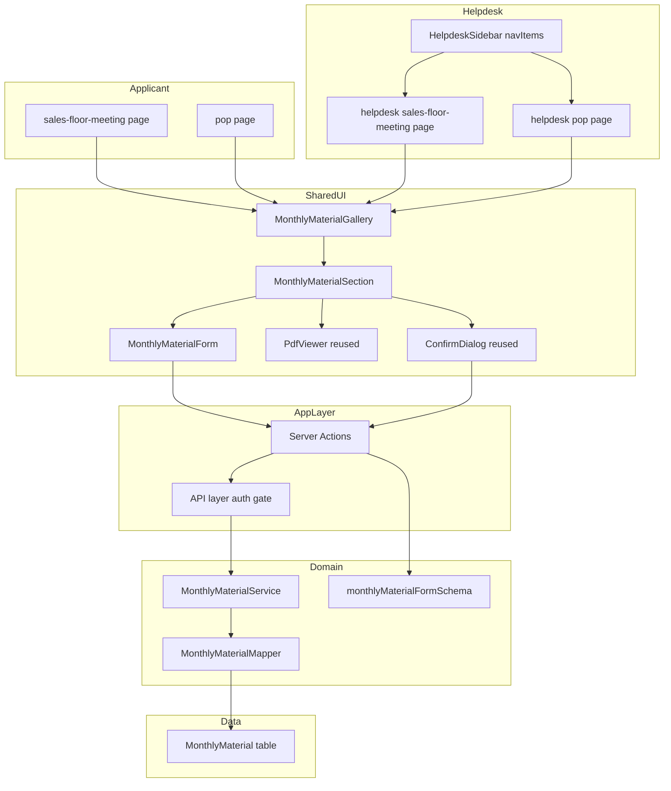
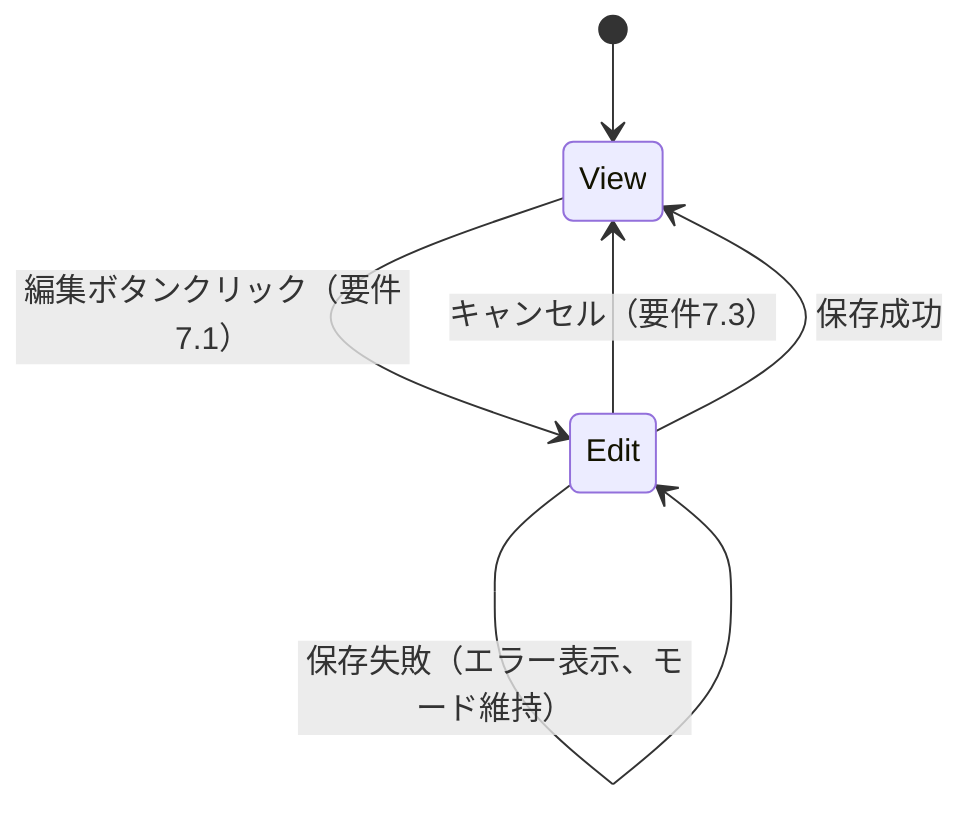
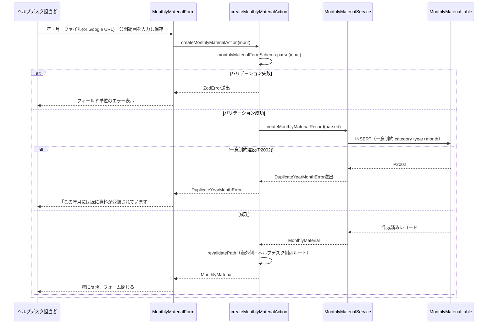

# Technical Design: monthly-document-gallery

## Overview

本機能は、海外販社担当者向けポータルと日本大創ヘルプデスク側ポータルの両方に、年月区切りでPDF資料を閲覧できる「月次資料ギャラリー」を追加する。対象カテゴリは売場検討会資料・POP資料の2つで、既存の「ドキュメント管理」（`documents`/`documents-management`spec）とはデータ・画面ともに独立させる。

**Purpose**: 海外販社担当者に、毎月更新される売場検討会資料・POP資料を、年月ごとに整理された形で確認できる手段を提供する。日本大創ヘルプデスク担当者には、同じ閲覧画面上で直接資料を登録・更新・削除できる手段を提供する。
**Users**: 海外販社担当者（閲覧専用）、日本大創ヘルプデスク担当者（閲覧＋編集）。
**Impact**: 新規ルート4つ（`/sales-floor-meeting`, `/pop`, `/helpdesk/sales-floor-meeting`, `/helpdesk/pop`）と新規Prismaモデル1件を追加する。既存の`documents`/`documents-management`のデータ・画面は変更しない。ダッシュボードカードのリンク先変更は`dashboard-card-redesign`spec側の追記（本specの成果物完成後に反映）で対応する。

### Goals
- 売場検討会・POPの2カテゴリについて、年月ごとにPDF資料を閲覧できる画面を海外販社側・ヘルプデスク側の双方に提供する
- ヘルプデスク側は、閲覧画面と同一の画面内で、画面遷移なしに資料の登録・編集・削除を行える
- ファイル登録方式としてPDFアップロード（Base64データURL）とGoogle共有リンクの両方をサポートし、将来のGoogle Drive資源表示への移行の土台を用意する
- 既存`documents`/`documents-management`のデータモデル・コンポーネント資産（PDFプレビュー・ファイル検証・Google URL変換・公開範囲UI・`ConfirmDialog`）を可能な限り再利用する

### Non-Goals
- Google Drive APIによるOAuth連携・変更検知・自動再同期（本specはGoogle埋め込み表示のみ）
- 動画ファイル・PDF以外の形式への対応
- 1年月に複数ファイルを登録する機能
- ダッシュボードカード（`/`ページ）自体の実装変更（`dashboard-card-redesign`specへの追記で対応）
- 資料へのタイトル・説明・多言語コンテンツの付与（見出しは年月から動的生成するため不要。詳細は research.md の Design Decisions を参照）

## Boundary Commitments

### This Spec Owns
- `MonthlyMaterial`データモデル（年月・カテゴリ・ファイル情報・公開範囲）とそのCRUD処理
- 海外販社側閲覧ルート2つ、ヘルプデスク側閲覧・編集ルート2つ
- 年月セクション単位の表示/編集モード切り替えUI
- 年月の一意性制約（カテゴリごと）とその違反時のエラーハンドリング
- `HelpdeskSidebar`・`nav-items.ts`への新規ナビゲーション項目2件

### Out of Boundary
- `Document`/`DocumentCategory`型・データおよびそのCRUD（`documents`/`documents-management`所有）
- ダッシュボードカードのレイアウト・表示順自体（`dashboard-card-redesign`所有。本specは新設ルートへのリンク先変更のみをそちらへ追記する）
- 認証・セッションの発行ロジック（`backend-db-foundation`所有。本specは`requireApplicantSession`/`requireHelpdeskStaffSession`を利用するのみ）

### Allowed Dependencies
- `src/lib/server/auth-session.ts`（`requireApplicantSession` / `requireHelpdeskStaffSession`）
- `src/lib/constants/document-company-options.ts`（`DOCUMENT_COMPANY_OPTIONS`、販社マスタの再利用）
- `src/lib/constants/inquiry-options.ts`（`INQUIRY_COUNTRY_CODES`、国コード一覧の再利用）
- `src/lib/google-document-url.ts`（`toGoogleEmbedUrl`、Google URL変換ロジックの再利用）
- `src/lib/document-utils.ts`（`validateDocumentFile`、PDF検証ロジックの再利用。ただし本specは独自の定数`MONTHLY_MATERIAL_MAX_FILE_SIZE_BYTES`等は持たず、既存`DOCUMENT_MAX_FILE_SIZE_BYTES`/`DOCUMENT_ALLOWED_MIME_TYPES`をそのまま使う）
- `src/components/features/documents/PdfViewer.tsx`（PDFプレビュー、判別可能ユニオンpropsのため変更なしで再利用可能）
- `src/components/features/helpdesk-documents/DocumentFileField.tsx` / `DocumentGoogleLinkField.tsx`（ファイル選択・Google URL入力フィールド）
- `src/components/ui/confirm-dialog.tsx`（`ConfirmDialog`）
- `src/components/layout/nav-items.ts`（`HELPDESK_NAV_ITEMS`への追加）

### Revalidation Triggers
- `DOCUMENT_COMPANY_OPTIONS`・`INQUIRY_COUNTRY_CODES`のデータ構造（フィールド名・型）が変更された場合、本specの公開範囲フォーム・ラベル解決処理を再確認する
- `PdfViewer`/`DocumentFileField`/`DocumentGoogleLinkField`/`ConfirmDialog`のprops契約が変更された場合、本specのUIコンポーネントを再確認する
- `requireApplicantSession`/`requireHelpdeskStaffSession`の戻り値型が変更された場合、本specのAPI層を再確認する

## Architecture

### Architecture Pattern & Boundary Map

既存`documents`/`documents-management`と同型の層構造（Types → Constants/Validation → Mapper → Service → API(認可) → Server Actions → UI）を採用する。カテゴリ（売場検討会／POP）は共通の`MonthlyMaterial`モデル・共通コンポーネントに対する1パラメータとして扱い、ルーティングのみをカテゴリ別に分離する。



**Architecture Integration**:
- Selected pattern: 既存`documents`系と同じ多層アーキテクチャ（型安全なドメインモデル＋認可の関所をAPI層に集約）
- Domain/feature boundaries: `category`（`salesFloorMeeting`|`pop`）を全クエリ・全一意制約の必須軸とすることで、2カテゴリのデータが同一テーブルに同居しても混在しないようにする
- Existing patterns preserved: `list*VisibleTo`/`*Record`/`*Action`の命名規約、Server Actionsの例外送出＋呼び出し側`try/catch`方式、`targetingScope`3値による公開範囲フィルタ
- New components rationale: `MonthlyMaterialSection`は年月セクション単位でモード状態を持つ必要があり、ページ単位でモードを持つ既存`DocumentDetailPanel`から独立させる（詳細はresearch.md参照）
- Steering compliance: `next-intl`翻訳キー経由の文言、`react-hook-form`+`zod`のフォーム、Server Actions経由のデータ変更、という`tech.md`のコーディング規約に準拠

### Technology Stack

| Layer | Choice / Version | Role in Feature | Notes |
|-------|------------------|-----------------|-------|
| Frontend | Next.js App Router + TypeScript | 新規ルート4つ、Server/Client Component分離 | 既存ルーティング規約を踏襲 |
| Forms | react-hook-form + zod | 新規登録・編集フォーム | `monthlyMaterialFormSchema`をdiscriminated unionで定義 |
| Data / Storage | PostgreSQL（Prisma ORM） | `MonthlyMaterial`モデル・関連enum2件を新規追加 | `Document`とは独立したテーブル・enum |
| i18n | next-intl | 新規翻訳名前空間`monthlyMaterials` | `messages/ja.json`・`messages/en.json` |

## File Structure Plan

### Directory Structure
```
src/
├── types/
│   └── monthly-material.ts                 # MonthlyMaterial/CreateMonthlyMaterialInput型
├── lib/
│   ├── constants/
│   │   └── monthly-material.ts             # カテゴリ列挙・年の入力範囲などの定数
│   ├── validation/
│   │   └── monthly-material.ts             # monthlyMaterialFormSchema（zod）
│   ├── monthly-material-utils.ts           # formatYearMonth（年月見出し生成）、年月一覧のソート
│   ├── server/
│   │   ├── monthly-material-mapper.ts      # Prismaレコード⇔ドメイン型変換、targeting変換（document-mapper.tsと同型）
│   │   └── monthly-material-service.ts     # CRUD・可視性フィルタ・P2002→DuplicateYearMonthError変換
│   ├── api/
│   │   └── monthly-materials.ts            # 認可の関所（requireApplicantSession/requireHelpdeskStaffSession）
│   └── actions/
│       └── monthly-materials.ts            # Server Actions（create/update/delete）
├── components/
│   └── features/
│       └── monthly-materials/              # 申請者側・ヘルプデスク側で共通利用
│           ├── MonthlyMaterialGallery.tsx  # Server Component。一覧取得＋Section描画
│           ├── MonthlyMaterialSection.tsx  # Client Component。1年月分のview/edit状態を保持
│           ├── MonthlyMaterialForm.tsx     # Client Component。年月・ファイル・公開範囲入力
│           ├── DeleteMonthlyMaterialButton.tsx # ConfirmDialogベースの削除ボタン（DeleteDocumentButton踏襲）
│           └── AddMonthlyMaterialButton.tsx    # 「新規追加」トグルボタン（一覧先頭にフォームを表示）
└── app/[locale]/
    ├── (applicant)/
    │   ├── sales-floor-meeting/page.tsx    # category="salesFloorMeeting", editable=false
    │   └── pop/page.tsx                    # category="pop", editable=false
    └── helpdesk/(dashboard)/
        ├── sales-floor-meeting/page.tsx    # category="salesFloorMeeting", editable=true
        └── pop/page.tsx                    # category="pop", editable=true
```

### Modified Files
- `prisma/schema.prisma` — `MonthlyMaterial`モデル、`MonthlyMaterialCategory`/`MonthlyMaterialSourceType`/`MonthlyMaterialTargetingScope`enumを追加
- `prisma/seed.ts` — 売場検討会・POPそれぞれのデモ`MonthlyMaterial`（2026年9月分、`SAMPLE_PDF_DATA_URL`使用）を追加
- `src/components/layout/nav-items.ts` — `HELPDESK_NAV_ITEMS`に`salesFloorMeeting`/`pop`の2項目を追加
- `messages/ja.json` / `messages/en.json` — `helpdeskNav.salesFloorMeeting`/`helpdeskNav.pop`、新規名前空間`monthlyMaterials`を追加

> 再利用のみで変更しないファイル: `src/components/features/documents/PdfViewer.tsx`, `src/components/features/helpdesk-documents/DocumentFileField.tsx`, `src/components/features/helpdesk-documents/DocumentGoogleLinkField.tsx`, `src/components/ui/confirm-dialog.tsx`, `src/lib/google-document-url.ts`, `src/lib/document-utils.ts`（`validateDocumentFile`のみ利用）, `src/lib/constants/document-company-options.ts`, `src/lib/constants/inquiry-options.ts`

## System Flows

### 表示モード⇔編集モードの切り替え（年月セクション単位）



各`MonthlyMaterialSection`インスタンスが独立して`view`/`edit`の状態を持つため、あるセクションを編集モードにしても他のセクションの表示モードには影響しない（要件7.4）。

### 新規登録・年月重複チェック



## Requirements Traceability

| Requirement | Summary | Components | Interfaces | Flows |
|-------------|---------|------------|------------|-------|
| 1.1-1.4 | ルート新設・カテゴリ独立性 | Pages(4), MonthlyMaterialGallery | category prop | - |
| 2.1-2.6 | 海外側月次一覧表示 | MonthlyMaterialGallery, MonthlyMaterialSection | listMonthlyMaterialsVisibleTo | - |
| 3.1-3.4 | 公開範囲による可視性制御 | MonthlyMaterialService | monthlyMaterialVisibleToWhere | - |
| 4.1-4.4 | PDFプレビュー(アップロード型) | PdfViewer(reused), MonthlyMaterialSection | PdfViewerProps(variant upload) | - |
| 5.1-5.5 | Google共有リンク表示・フォールバック | PdfViewer(reused) | PdfViewerProps(variant google) | - |
| 6.1-6.3 | ヘルプデスク表示モード | MonthlyMaterialGallery, MonthlyMaterialSection | listAllMonthlyMaterials | 表示/編集モード切替図 |
| 7.1-7.4 | 表示/編集モード切り替え | MonthlyMaterialSection | mode state | 表示/編集モード切替図 |
| 8.1-8.4 | 新規登録 | AddMonthlyMaterialButton, MonthlyMaterialForm, Server Actions | createMonthlyMaterialAction | 新規登録シーケンス図 |
| 9.1-9.2 | 年月一意性 | MonthlyMaterialService | DuplicateYearMonthError | 新規登録シーケンス図 |
| 10.1-10.5 | PDFファイル検証 | DocumentFileField(reused), validateDocumentFile(reused) | monthlyMaterialFormSchema | - |
| 11.1-11.5 | Google共有リンク登録 | DocumentGoogleLinkField(reused), toGoogleEmbedUrl(reused) | monthlyMaterialFormSchema | - |
| 12.1-12.4 | 公開範囲の指定 | MonthlyMaterialForm | targeting fields | - |
| 13.1-13.3 | 編集・更新 | MonthlyMaterialSection, updateMonthlyMaterialAction | - | - |
| 14.1-14.3 | 削除 | DeleteMonthlyMaterialButton, ConfirmDialog(reused) | deleteMonthlyMaterialAction | - |
| 15.1-15.3 | ナビゲーション統合 | nav-items.ts, HelpdeskSidebar(既存), MobileNav(既存) | HELPDESK_NAV_ITEMS | - |
| 16.1-16.2 | i18n | 全UIコンポーネント | messages/ja.json, messages/en.json | - |
| 17.1 | レスポンシブ | MonthlyMaterialGallery | - | - |

## Components and Interfaces

| Component | Domain/Layer | Intent | Req Coverage | Key Dependencies (P0/P1) | Contracts |
|-----------|--------------|--------|--------------|--------------------------|-----------|
| MonthlyMaterialService | Server/Domain | CRUD・可視性フィルタ・年月重複検出 | 2,3,6,8,9,13,14 | Prisma(P0) | Service |
| MonthlyMaterialMapper | Server/Domain | Prisma⇔ドメイン型変換 | 2,3,6 | Prisma types(P0) | - |
| monthlyMaterialFormSchema | Validation | 入力検証（discriminated union） | 8,9,10,11,12 | zod(P0) | - |
| monthly-materials API層 | Server/AppLayer | 認可の関所 | 2,3,6,8,13,14 | auth-session(P0), MonthlyMaterialService(P0) | Service |
| monthly-materials Server Actions | Server/AppLayer | 保存操作のエントリポイント | 8,9,11,13,14 | monthly-materials API層(P0), validation(P0) | Service |
| MonthlyMaterialGallery | UI/Server Component | 一覧取得・年月降順描画・ローディング/エラー/空表示 | 1,2,6,17 | monthly-materials API層(P0) | State |
| MonthlyMaterialSection | UI/Client Component | 1年月分のview/edit切り替え、プレビュー・編集ボタン配置 | 4,5,6,7,13 | PdfViewer(P0), MonthlyMaterialForm(P0) | State |
| MonthlyMaterialForm | UI/Client Component | 年月・ファイル/Google URL・公開範囲の入力 | 8,9,10,11,12 | DocumentFileField(P0), DocumentGoogleLinkField(P0), Server Actions(P0) | State |
| AddMonthlyMaterialButton | UI/Client Component | 新規追加フォームのトグル表示 | 8.1 | MonthlyMaterialForm(P1) | State |
| DeleteMonthlyMaterialButton | UI/Client Component | 削除確認・実行 | 14 | ConfirmDialog(P0), Server Actions(P0) | State |

新規に境界を持ち込むのは`MonthlyMaterialService`・`monthly-materials API層`・`monthly-materials Server Actions`・`monthlyMaterialFormSchema`のみで、以降で full block を記載する。UIコンポーネント（`MonthlyMaterialGallery`/`Section`/`Form`/`AddMonthlyMaterialButton`/`DeleteMonthlyMaterialButton`）は既存`documents`系の対応コンポーネントと同一の責務パターンを踏襲するプレゼンテーション層のため、Implementation Notesのみ記載する。

### Server/Domain

#### MonthlyMaterialService

| Field | Detail |
|-------|--------|
| Intent | `MonthlyMaterial`のCRUDと、公開範囲による可視性フィルタ・年月一意性違反の検出を行う |
| Requirements | 2.1, 2.4, 2.5, 2.6, 3.1, 3.2, 3.3, 3.4, 6.2, 8.4, 9.1, 9.2, 13.2, 13.3, 14.3 |

**Responsibilities & Constraints**
- 全関数は`category`（`MonthlyMaterialCategory`）を必須引数に取り、他カテゴリのレコードを混入させない
- 可視性フィルタ（`monthlyMaterialVisibleToWhere`）は`document-service.ts`の`documentVisibleToWhere`と同型のOR条件（全体公開／国一致／販社一致）
- 年月の一意性はPrismaの`@@unique([category, year, month])`制約に委譲し、違反時（`P2002`）を`DuplicateYearMonthError`に変換して送出する

**Dependencies**
- Inbound: monthly-materials API層 — 認可済みリクエストの実処理 (P0)
- Outbound: Prisma Client — `MonthlyMaterial`テーブルへのCRUD (P0)
- Outbound: `monthly-material-mapper.ts` — レコード⇔ドメイン型変換 (P0)

**Contracts**: Service [x] / API [ ] / Event [ ] / Batch [ ] / State [ ]

##### Service Interface
```typescript
interface MonthlyMaterialService {
  listVisibleTo(
    category: MonthlyMaterialCategory,
    country: string,
    companyCode: string
  ): Promise<MonthlyMaterial[]>; // year,month降順

  listAll(category: MonthlyMaterialCategory): Promise<MonthlyMaterial[]>; // year,month降順、絞り込みなし

  create(
    category: MonthlyMaterialCategory,
    input: CreateMonthlyMaterialInput
  ): Promise<MonthlyMaterial>; // 一意制約違反時 DuplicateYearMonthError

  update(
    id: string,
    input: CreateMonthlyMaterialInput
  ): Promise<MonthlyMaterial>; // 対象なし時 MonthlyMaterialNotFoundError、年月変更先が重複時 DuplicateYearMonthError

  remove(id: string): Promise<void>; // 対象なし時 MonthlyMaterialNotFoundError
}
```
- Preconditions: `input.category`は呼び出し元ルートに対応するカテゴリと一致していること
- Postconditions: `create`/`update`/`remove`成功後、対応するルートの再検証（`revalidatePath`）はServer Actions層の責務
- Invariants: 同一`category`内で`(year, month)`の組は常に一意

### Validation

#### monthlyMaterialFormSchema

| Field | Detail |
|-------|--------|
| Intent | 新規登録・編集フォームの入力値をdiscriminated union（sourceType別）で検証する |
| Requirements | 8.2, 8.3, 9.1(クライアント側の年月必須), 10.1-10.4, 11.1-11.4, 12.1-12.4 |

**Responsibilities & Constraints**
- `documentFormSchema`（`src/lib/validation/document.ts`）と同型のsourceType別discriminated union構造を採る（title/description/categoryId/subCategoryId/translationsに相当するフィールドは持たない）
- `year`/`month`はどちらの分岐にも共通のフィールドとして持つ

**Contracts**: Service [ ] / API [ ] / Event [ ] / Batch [ ] / State [ ]

```typescript
const monthlyMaterialTargetingSchema = documentTargetingSchema; // documents-managementのスキーマをそのまま再利用

const monthlyMaterialUploadSchema = z.object({
  category: z.enum(["salesFloorMeeting", "pop"]),
  year: z.number().int().min(2020).max(2100),
  month: z.number().int().min(1).max(12),
  sourceType: z.literal("upload"),
  fileName: z.string().trim().min(1),
  fileType: z.enum(DOCUMENT_ALLOWED_MIME_TYPES),
  fileSize: z.number().int().positive().max(DOCUMENT_MAX_FILE_SIZE_BYTES),
  dataUrl: z.string().trim().min(1).startsWith("data:application/pdf"),
  targeting: monthlyMaterialTargetingSchema,
});

const monthlyMaterialGoogleSchema = z.object({
  category: z.enum(["salesFloorMeeting", "pop"]),
  year: z.number().int().min(2020).max(2100),
  month: z.number().int().min(1).max(12),
  sourceType: z.literal("google"),
  googleUrl: z.string().trim().min(1),
  googleEmbedUrl: z.string().trim().min(1),
  targeting: monthlyMaterialTargetingSchema,
});

export const monthlyMaterialFormSchema = z
  .discriminatedUnion("sourceType", [monthlyMaterialUploadSchema, monthlyMaterialGoogleSchema])
  .superRefine((data, ctx) => {
    if (data.sourceType === "google" && toGoogleEmbedUrl(data.googleUrl) === null) {
      ctx.addIssue({ code: z.ZodIssueCode.custom, message: "Invalid Google document URL", path: ["googleUrl"] });
    }
  });

export type MonthlyMaterialFormValues = z.input<typeof monthlyMaterialFormSchema>;
export type MonthlyMaterialSubmitValues = z.output<typeof monthlyMaterialFormSchema>;
```
- Preconditions: `documentTargetingSchema`・`toGoogleEmbedUrl`・`DOCUMENT_ALLOWED_MIME_TYPES`・`DOCUMENT_MAX_FILE_SIZE_BYTES`は`documents`/`documents-management`specの既存資産をそのままimportする
- Postconditions: パース成功後の値はサーバー側`create`/`update`の入力型と一致する
- Invariants: `category`は常にルートに対応する固定値としてフォーム側から渡し、ユーザーが変更できないようUIを制限する

### AppLayer

#### monthly-materials API層

| Field | Detail |
|-------|--------|
| Intent | セッション種別（applicant/helpdesk）に応じた認可を行い、`MonthlyMaterialService`を呼び出す |
| Requirements | 2, 3, 6.2, 8, 13, 14 |

**Responsibilities & Constraints**
- 認可は`document`系と同じ関所パターン：読み取り2種（海外側・ヘルプデスク側）、書き込み3種（すべてヘルプデスク限定）
- 海外側の読み取りは`requireApplicantSession`が返す`claims.country`/`claims.companyCode`を`MonthlyMaterialService.listVisibleTo`にそのまま渡す

**Dependencies**
- Inbound: Server Actions（書き込み系）, ページServer Component（読み取り系） (P0)
- Outbound: `requireApplicantSession` / `requireHelpdeskStaffSession` (P0)
- Outbound: MonthlyMaterialService (P0)

**Contracts**: Service [x] / API [ ] / Event [ ] / Batch [ ] / State [ ]

```typescript
export async function getMonthlyMaterials(
  category: MonthlyMaterialCategory
): Promise<MonthlyMaterial[]>; // requireApplicantSession

export async function getAllMonthlyMaterialsForHelpdesk(
  category: MonthlyMaterialCategory
): Promise<MonthlyMaterial[]>; // requireHelpdeskStaffSession

export async function createMonthlyMaterial(
  category: MonthlyMaterialCategory,
  input: CreateMonthlyMaterialInput
): Promise<MonthlyMaterial>; // requireHelpdeskStaffSession

export async function updateMonthlyMaterial(
  id: string,
  input: CreateMonthlyMaterialInput
): Promise<MonthlyMaterial>; // requireHelpdeskStaffSession

export async function deleteMonthlyMaterial(id: string): Promise<void>; // requireHelpdeskStaffSession
```

#### monthly-materials Server Actions

| Field | Detail |
|-------|--------|
| Intent | フォーム送信を受け取り、バリデーション・保存・再検証を行う |
| Requirements | 8.4, 9.1, 11.3, 13.3, 14.3 |

**Responsibilities & Constraints**
- `monthlyMaterialFormSchema.parse(input)`をアクション内で呼び、失敗時は`ZodError`を送出する（`documentFormSchema`と同じ方式）
- Google共有リンクの場合、`googleEmbedUrl`をサーバー側で`toGoogleEmbedUrl`により再計算し、クライアント入力を信用しない（`withServerRecomputedEmbedUrl`と同型のヘルパーを新設）
- 保存成功後、海外側・ヘルプデスク側それぞれの対象カテゴリルート（例: `/[locale]/sales-floor-meeting`, `/[locale]/helpdesk/sales-floor-meeting`）を`revalidatePath`する

**Dependencies**
- Inbound: MonthlyMaterialForm, DeleteMonthlyMaterialButton (P0)
- Outbound: monthly-materials API層 (P0)
- Outbound: monthlyMaterialFormSchema (P0)

**Contracts**: Service [x] / API [ ] / Event [ ] / Batch [ ] / State [ ]

```typescript
export async function createMonthlyMaterialAction(
  input: CreateMonthlyMaterialInput
): Promise<MonthlyMaterial>; // throws ZodError | DuplicateYearMonthError

export async function updateMonthlyMaterialAction(
  id: string,
  input: CreateMonthlyMaterialInput
): Promise<MonthlyMaterial>; // throws ZodError | DuplicateYearMonthError | MonthlyMaterialNotFoundError

export async function deleteMonthlyMaterialAction(id: string): Promise<void>; // throws MonthlyMaterialNotFoundError
```

### UIコンポーネント（Implementation Notes）

- **MonthlyMaterialGallery**（Server Component）: `editable`（boolean）・`category`をpropsで受け取り、`editable`に応じて`getMonthlyMaterials`／`getAllMonthlyMaterialsForHelpdesk`を呼び分ける。年月降順に整列済みの配列を`MonthlyMaterialSection`へ1件ずつ渡す。ローディング（Suspense+Skeleton）・エラー・0件時のメッセージ表示は`DocumentList.tsx`のパターンを踏襲。`editable=true`のとき`AddMonthlyMaterialButton`を一覧の先頭に描画する（要件8.1、別ルートの`/new`は持たない）。
- **MonthlyMaterialSection**（Client Component）: `useState<"view" | "edit">("view")`を保持。表示モードでは見出し（年月）＋`PdfViewer`＋（`editable`時のみ）プレビュー領域と同じ行の右上に配置した「編集」ボタン（要件6.3）。編集モードでは`MonthlyMaterialForm`＋`PdfViewer`（既存プレビューを表示し続ける、要件7.2）＋「キャンセル」ボタン＋`DeleteMonthlyMaterialButton`。
- **MonthlyMaterialForm**: `react-hook-form`+`monthlyMaterialFormSchema`。RHFのdiscriminated union制限を回避するため、`DocumentForm.tsx`と同様にフラットな内部フィールド型（`DocumentFormFieldValues`相当）を用意する。年（数値input）・月（1〜12のselect）・登録方式（upload/google）・ファイル or Google URL（`DocumentFileField`/`DocumentGoogleLinkField`をそのまま利用）・公開範囲（`documentTargetingSchema`と同じUIパターン：全体公開/国選択/販社選択）を入力する。送信時、`DuplicateYearMonthError`を`instanceof`で判別し「この年月には既に資料が登録されています」を年/月フィールドに表示、それ以外は既存同様の汎用送信エラーメッセージを表示する。
- **AddMonthlyMaterialButton**: クリックで一覧先頭に`MonthlyMaterialForm`（`mode="create"`）をインライン表示するトグルボタン。`useState<boolean>`のみを保持する薄いラッパ。
- **DeleteMonthlyMaterialButton**: `DeleteDocumentButton.tsx`と同型。`ConfirmDialog`の`onConfirm`で`deleteMonthlyMaterialAction`を呼び、成功時のみ自動クローズ。

## Data Models

### Domain Model
- **Aggregate root**: `MonthlyMaterial`（`category`+`year`+`month`で一意）。子エンティティ・値オブジェクトは持たない
- **Invariant**: 同一`category`内で`(year, month)`は一意（要件9）
- **Invariant**: `sourceType`が`upload`のとき`fileName`/`fileType`/`fileSize`/`dataUrl`が必須かつ`googleUrl`/`googleEmbedUrl`はnull、`sourceType`が`google`のときその逆（`document-mapper.ts`の`DocumentDataIntegrityError`と同型の整合性検証を`monthly-material-mapper.ts`にも設ける）

### Logical Data Model

| フィールド | 型 | 説明 |
|-----------|-----|------|
| id | String (cuid) | 主キー |
| category | MonthlyMaterialCategory (enum) | `salesFloorMeeting` \| `pop` |
| year | Int | 西暦年 |
| month | Int | 1〜12 |
| sourceType | MonthlyMaterialSourceType (enum) | `upload` \| `google` |
| fileName / fileType / fileSize / dataUrl | String?/String?/Int?/String? | uploadのとき必須 |
| googleUrl / googleEmbedUrl | String?/String? | googleのとき必須 |
| targetingScope | MonthlyMaterialTargetingScope (enum) | `all` \| `countries` \| `companies` |
| targetingCountries | String[] | targetingScope=countriesのとき使用 |
| targetingCompanyCodes | String[] | targetingScope=companiesのとき使用 |
| createdAt / updatedAt | DateTime | 監査用 |

参照整合性: 他モデルへの外部キーは持たない（`Document`/`DocumentCategory`とは無関係な独立テーブル）。

### Physical Data Model

```prisma
enum MonthlyMaterialCategory {
  salesFloorMeeting
  pop
}

enum MonthlyMaterialSourceType {
  upload
  google
}

enum MonthlyMaterialTargetingScope {
  all
  countries
  companies
}

model MonthlyMaterial {
  id                    String                        @id @default(cuid())
  category              MonthlyMaterialCategory
  year                  Int
  month                 Int
  sourceType            MonthlyMaterialSourceType     @default(upload)
  fileName              String?
  fileType              String?
  fileSize              Int?
  dataUrl               String?
  googleUrl             String?
  googleEmbedUrl        String?
  targetingScope        MonthlyMaterialTargetingScope @default(all)
  targetingCountries    String[]                      @default([])
  targetingCompanyCodes String[]                      @default([])
  createdAt             DateTime                      @default(now())
  updatedAt             DateTime                      @updatedAt

  @@unique([category, year, month])
  @@index([category])
}
```
- 一意制約`@@unique([category, year, month])`が要件9のカテゴリ内年月一意性をDBレベルで保証する
- `@@index([category])`は一覧取得クエリ（`WHERE category = ...`）の性能を担保する

### Data Contracts & Integration

`CreateMonthlyMaterialInput`（`monthlyMaterialFormSchema`の`z.output`と一致）:
```typescript
export type CreateMonthlyMaterialInput =
  | {
      category: MonthlyMaterialCategory;
      year: number;
      month: number;
      sourceType: "upload";
      fileName: string;
      fileType: "application/pdf";
      fileSize: number;
      dataUrl: string;
      targeting: DocumentTargeting; // documents系の型を再利用（構造は独立、型定義のみ共有）
    }
  | {
      category: MonthlyMaterialCategory;
      year: number;
      month: number;
      sourceType: "google";
      googleUrl: string;
      googleEmbedUrl: string;
      targeting: DocumentTargeting;
    };
```

## Error Handling

### Error Strategy
既存`documents-management`と同じ「Service層が意味のあるカスタムエラーを送出し、Server Actionsはそのまま透過、UIが`try/catch`で分岐する」方針を採る。

### Error Categories and Responses
| カテゴリ | 例 | 送出元 | UI側の扱い |
|---------|-----|--------|-----------|
| 入力検証エラー | 必須項目欠落・PDF形式/サイズ不正・Google URL不正 | `monthlyMaterialFormSchema.parse`（`ZodError`） | フィールド単位のエラーメッセージ（要件8.3, 10.2, 10.3, 11.2） |
| 年月重複エラー | 同一カテゴリ内で既存の年月を新規/変更しようとした | `MonthlyMaterialService.create`/`update`（`DuplicateYearMonthError`、Prisma `P2002`から変換） | 年/月フィールドに専用メッセージ（要件9.1, 13.2） |
| 対象不存在エラー | 削除済み/存在しないIDへの更新・削除 | `MonthlyMaterialService.update`/`remove`（`MonthlyMaterialNotFoundError`） | 「見つかりません」旨のメッセージ |
| 権限エラー | 未認証・ロール不一致でのアクセス | `requireApplicantSession`/`requireHelpdeskStaffSession`（`UnauthorizedSessionError`、既存踏襲） | 既存の認可エラーハンドリングに委譲（本specでは変更しない） |

### Monitoring
既存`documents`系同様、専用の監視・ログ基盤は追加しない（フェーズ1のモック/DB混在フェーズの既存運用に準じる）。

## Testing Strategy

- **Unit Tests**:
  - `MonthlyMaterialService`: カテゴリ別フィルタが他カテゴリのレコードを含まないこと、可視性フィルタ（全体公開/国単位/販社単位）の3分岐、年月重複時に`DuplicateYearMonthError`を送出すること
  - `monthly-material-mapper.ts`: `sourceType`不整合時に整合性エラーを送出すること
  - `monthlyMaterialFormSchema`: sourceType別必須項目、Google URL不正、年/月の範囲外値
- **Integration Tests**:
  - Server Actions経由の作成→一覧反映（`revalidatePath`後の取得）
  - 同一年月への重複作成がブロックされること
  - ヘルプデスク側は全件、海外側は公開範囲でフィルタされた件のみ取得できること
- **E2E/UI Tests**:
  - `MonthlyMaterialSection`の表示モード⇔編集モード切り替え（他セクションへの影響がないこと含む）
  - 新規追加フォームのトグル表示→保存→一覧反映
  - 削除確認モーダル→確定→一覧から除去

## Security Considerations
書き込み系（作成・更新・削除）は全て`requireHelpdeskStaffSession`必須とし、海外販社側セッションからの書き込みリクエストは`monthly-materials API層`で拒否する。公開範囲（`targetingScope`）による可視性フィルタはService層のクエリ条件として実装し、UI側のみのフィルタ（クライアントで非表示にするだけ）にはしない。

## Migration Strategy
新規テーブル追加のみで既存データの移行は不要。
1. `prisma/schema.prisma`にモデル・enum追加 → `prisma migrate dev`でマイグレーションファイル生成
2. `prisma/seed.ts`にデモレコード（売場検討会・POP各1件、2026年9月、`SAMPLE_PDF_DATA_URL`使用）を追加
3. 本番Cloud SQLへは、既存運用（`main`マージ後に`prisma migrate deploy`を手動実行）に従う（`tech.md`参照）
