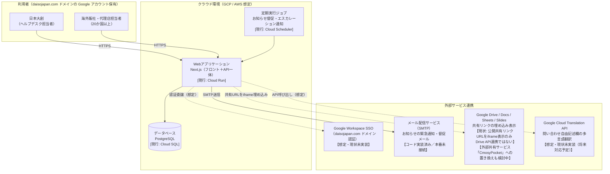

# ヘルプデスクポータル システム構成図（インフラレビュー用）

作成日: 2026-09-07
目的: インフラチームによるセキュリティ・構成上の確認のための1枚資料。実装状況（実装済み／想定）を区別して記載する。

## 前提条件

- ホスティング先は GCP または AWS を想定（現行モックは GCP：Cloud Run + Cloud SQL for PostgreSQL）
- 利用者は全員 `daisojapan.com`（仮）ドメインの Google Workspace アカウントを保有
- 利用者は2種類のユーザー種別に分かれる
  - **日本大創（ヘルプデスク担当者）**: 問い合わせ対応、お知らせ・ドキュメント・リンク集・FAQの管理
  - **海外販社・代理店担当者（20か国以上）**: 問い合わせ・申請の提出、お知らせ・ドキュメント・リンク集・FAQの閲覧

## 構成図

## 外部連携先の状態一覧

| # | 連携先 | 用途 | 現状 |
|---|---|---|---|
| 1 | Google Workspace SSO（`daisojapan.com`ドメイン） | 利用者認証 | **想定のみ・未実装。** 現行はメール＋パスワードによる自前の Credentials 認証（DB内にbcryptハッシュを保持）。将来的にドメイン限定の Google OAuth へ切り替える前提 |
| 2 | メール配信サービス（SMTP） | お知らせの督促・エスカレーション通知メール送信 | **コード実装済み。** `nodemailer` によるSMTP送信処理あり。ただし本番環境のSMTP接続情報（ホスト・認証情報等）は未設定のため現状は無効（送信スキップ） |
| 3 | Google Drive / Docs / Sheets / Slides | ヘルプデスクが登録した資料の共有リンクを申請者側で埋め込み表示 | **限定的に実装済み。** ヘルプデスクが入力した公開共有リンクのURLを `<iframe>` でそのまま埋め込むのみで、Drive APIによる認可連携・ファイル一覧取得は行っていない。**利用者（ユーザー）単位でのアクセス出し分けができるかは現在検討中。** また、Google Driveに代えて外部共有サービス「**CmosyPocket**」を採用する案も検討中 |
| 4 | Google Cloud Translation API | 問い合わせ・申請フォームの自由記述欄の多言語翻訳 | **想定のみ・未実装。** 開発フェーズ3以降で対応予定。データモデル上は翻訳結果を保持するフィールドを用意済みだが、翻訳処理自体は未実装 |

## インフラチームへの確認事項（想定される論点）

- Google Workspace SSO 導入時、ドメイン制限（`daisojapan.com`のみ許可）をIdP側・アプリ側どちらで担保するか
- SMTP送信先を外部メール配信サービス（例: SendGrid等）にするか、社内SMTPリレー経由にするか、送信元ドメインのSPF/DKIM設定
- Google Drive等の共有リンクをユーザー単位で出し分ける場合、Drive API連携（OAuth委任・サービスアカウント等）への切り替えが必要になる可能性
- Google Driveの代わりに外部共有サービス「CmosyPocket」を採用する場合の、データ越境・アクセス権限管理・既存Drive運用との比較検討
- Cloud Run（`allUsers`にinvoker権限を付与し一般公開）+ Cloud SQL（Cloud Run組み込みのCloud SQL Auth Proxy経由）という現行構成のまま本番化してよいか、追加のネットワーク制御（VPC-SC、IP制限等）が必要か
- Translation API導入時の送信データ（自由記述欄の内容）の越境処理・データ保持ポリシー
